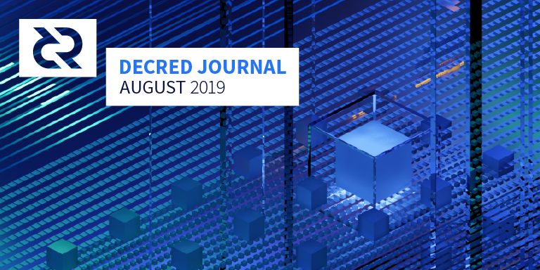

# Decred Journal – August 2019

_Image: Key Symmetry by @saender. When everything is aligned, big things are born._

Major news of August:

* The privacy feature which Company 0 had been working on privately was revealed, an initial implementation was released, and the first mixes were observed on mainnet. See Privacy section below.
* Development of Decred's decentralized exchange has commenced, after a proposal led by @chappjc and @buck54321 for up to $230,000 in funding was approved by 90% of voters.
* The percentage of circulating DCR locked in PoS tickets broke above 50% for the first time on Aug 15. This, along with the rising ticket price, indicates that the confidence of Decred holders is increasing over time, as more holders opt to time-lock their DCR to participate in governance.
* Decred stakeholders signalled that they wish to fund a market maker to address liquidity issues (87% approval). Voting for the proposals from i2 Trading, Grapefruit Trading and Tantra Labs started on Sep 4 and is very competitive as all 3 proposals have 50-62% support at time of publication. See Governance section for more details.

## Privacy

A blog [post](https://blog.decred.org/2019/08/21/Surveying-the-Privacy-Landscape/) by @jy-p surveying the privacy landscape was published on Aug 21. This post considers the trade-offs associated with different approaches to cryptocurrency privacy and reviews the pros and cons of the approach taken by Monero, Zcash, Grin, Beam, Dash and Wasabi Wallet for Bitcoin.

The first details of the privacy feature that Company 0 have been developing in private were released publicly by @jz on an [episode](https://unchainedpodcast.com/after-years-of-secret-work-decred-adds-a-new-feature-privacy/) of Laura Shin's Unchained Podcast on Aug 27.

On Aug 28 a blog [post](https://blog.decred.org/2019/08/28/Iterating-Privacy/) from @jy-p was published which gives a full account of the approach that Company 0 are taking to privacy, and explains the reasoning for this choice. Only approaches which would allow for pruning of spent transactions were considered, with a preference for less complex solutions that allow the auditability of DCR supply to be maintained. This tweet [thread](https://twitter.com/decredproject/status/1166746979160023046) offers a more concise introduction, and @Dustorf has also written a [post](https://medium.com/@dlefebvr/decred-privacy-taking-the-long-road-62d218223db6) which considers the importance of privacy and provides a less technical perspective on how the new approach works. @jy-p also recorded an hour-long [episode](https://twitter.com/decredproject/status/1168558002867191808) of Decred in Depth with @anshawblack focusing on privacy, where he discussed topics from evading surveillance capitalism to why different approaches were more or less suited to Decred. @anshawblack and GhostWridah also collaborated on a 1 minute [rap](https://soundcloud.com/decredindepth/privacy-flow/s-5ifuN) about Decred and privacy.

The approach is based on the CoinShuffle++ protocol, integrated into the ticket buying process so that stakeholders can opt in to mix their coins as they buy tickets. Smaller denominations are also available for mixing regular (non staking) transactions. The protocol addresses the traceability (who sends to whom) but does not hide amounts. The solution relies on a centralized server to coordinate mixing - information about input addresses and change addresses is leaked to the server but not the other peers in the mix, and output addresses are fully anonymized. As the mixing occurs off-chain, no change to the consensus rules was required. As all development to this point has been funded by Company 0, no Politeia proposal for funding was required as well.

The initial release works only for users of the command-line interface dcrwallet. It will take time for mixing to be integrated into Decrediton, and in order for it to be offered to VSP users significant improvements to dcrstakepool are required. Longer term, Confidential Transactions (with Bulletproofs) will be considered. These could be used to hide the amounts, which would enhance privacy and avoid the need for extensive mixing of change from the transactions. This kind of development would require changes to the consensus rules, and so would go through the normal governance process.

## Development

[dcrd](https://github.com/decred/dcrd): New module named `blockchain/standalone` was [introduced](https://github.com/decred/dcrd/pull/1808), which aims to provide several of the standalone functions currently available in the `blockchain` module. The primary goal of offering these functions via a separate module is to reduce dependencies for client code. It will also be beneficial for applications such as lightweight clients that need to ensure basic security properties hold and calculate appropriate vote subsidies. The opportunity was taken to write more robust and performant functions that will replace those in the `blockchain` module in the next major version. The new module will ship with comprehensive tests, full package documentation, and basic usage examples.

New major versions of [`blockchain`](https://github.com/decred/dcrd/pull/1823), [`mining`](https://github.com/decred/dcrd/pull/1831), [`connmgr`](https://github.com/decred/dcrd/pull/1833), [`peer`](https://github.com/decred/dcrd/pull/1834) and [`mempool`](https://github.com/decred/dcrd/pull/1835) modules have been introduced to make use of other new major module versions. The main module was also [updated](https://github.com/decred/dcrd/pull/1837) to use them all, which marks the end to the module upgrading saga for now. The overall benefit is that it updates dcrd to make use of all the latest code updates and significantly reduces that amount of future churn necessary in certain modules when they require API changes that constitute a major semantic versioning break.

`gcs` module received multiple [improvements](https://github.com/decred/dcrd/pulls?q=is%3Apr+is%3Aclosed+merged%3A2019-08-01..2019-08-31+gcs) to bring it to the quality level required by consensus code for ultimate inclusion in [header commitments](https://proposals.decred.org/proposals/0a1ff846ec271184ea4e3a921a3ccd8d478f69948b984445ee1852f272d54c58). Support has been [added](https://github.com/decred/dcrd/pull/1854) for independent false positive rate and Golomb coding bin size. Among other things, this permits more optimal parameters for minimizing the filter size to be specified. This capability will be used in the upcoming version 2 filters that will ultimately be included in header commitments. Start of the module's v2 dev cycle also marked the start of a [new approach](https://github.com/decred/dcrd/pull/1843) towards handling module versioning between release cycles to reduce the maintenance burden.

The Blake256 implementation has been [copied](https://github.com/decred/dcrd/pull/1811) into the dcrd repository so that dcrd does not have that external dependency anymore. While the optimizations required by dcrd were [accepted](https://github.com/dchest/blake256/pull/3) upstream, it is still desirable to have consensus critical code under tight control of dcrd maintainers to avoid situations mentioned [here](https://github.com/decred/dcrd/issues/1810).

Automatic [address discovery](https://github.com/decred/dcrd/pull/1522) has been merged. It allows users who are behind NAT to run publicly discoverable full nodes without specifying `--externalip`.

Test coverage was increased and hardened in multiple areas of the codebase.

Work [started](https://github.com/decred/dcrd/pull/1829) to maximize block template fees based on transaction chains in the mempool.

[dcrwallet](https://github.com/decred/dcrwallet): A new [RPC](https://github.com/decred/dcrwallet/pull/1522) has been added that allows the user to abandon (or remove) an unconfirmed transaction from the wallet, and any other transactions dependent on its outputs. Another new RPC allows export of the [extended private key](https://github.com/decred/dcrwallet/pull/1533) of an account after unlocking the wallet.

Code maintenance: updated to use the new modules in dcrd and [removed](https://github.com/decred/dcrwallet/pull/1531) usages of old modules, [improved](https://github.com/decred/dcrwallet/pull/1539) compatibility with Go 1.13 errors.

Work has begun to add [support](https://github.com/decred/dcrwallet/pull/1541) for creating CoinJoin transactions for ticket purchasing "split" transactions, as well as mixing of individual mix change outputs into smaller standard denominations.

[Decrediton](https://github.com/decred/decrediton): UI tweaks, bug fixes, code cleanup.

Initial [dark mode](https://github.com/decred/decrediton/issues/2089) has been [completed](https://github.com/decred/decrediton/pull/2163). Work continues on making the UI responsive, with four new responsive views [added](https://github.com/decred/decrediton/pull/2174).

[Politeia](https://github.com/decred/politeia): Work on the Politeia redesign is proceeding at pace, with a [number](https://github.com/decred/politeiagui/pull/1356) [of](https://github.com/decred/politeiagui/pull/1338) [PRs](https://github.com/decred/politeiagui/pull/1360) merged that add existing functionality to the redesigned interface. On the backend, significant work laying the foundations for the [DCC process](https://proposals.decred.org/proposals/fa38a3593d9a3f6cb2478a24c25114f5097c572f6dadf24c78bb521ed10992a4), to be incorporated in the CMS, has been [merged](https://github.com/decred/politeia/pull/980).

The question of how to support RFP type proposals on Politeia has been the subject of discussion in this [issue](https://github.com/decred/politeia/issues/966) and in #politeia (see Governance for more detail).

Login by username was switched back to email to prevent [targeted locking](https://github.com/decred/politeia/issues/860#issuecomment-520871500) of accounts. [2FA](https://github.com/decred/politeia/issues/544) will solve this issue and allow logins without email.

[dcrdex](https://github.com/decred/dcrdex): The dcrdex repository was [announced](https://twitter.com/decredproject/status/1156652694502817793) in July to house the DEX [specification](https://github.com/decred/dcrdex/tree/master/spec), and the first substantive PRs are already [open](https://github.com/decred/dcrdex/pull/17). A new [#dexdev](https://riot.im/app/#/room/!EzTSRQITaqHuFBDFhM:decred.org) room was also created for DEX development chat on Matrix.

[cspp](https://github.com/decred/cspp): This new repository provides client and server implementations to execute the [CoinShuffle++](https://crypsys.mmci.uni-saarland.de/projects/FastDC/paper.pdf) mixing protocol. While intended to be used to create Decred CoinJoin transactions, the client and server packages are generic enough to anonymously mix and join elements of any group.

Before CoinShuffle++, Company 0 developed a Go implementation of TumbleBit protocol. Despite not integrating it into Decred, the code was released for the public benefit in [tumblebit](https://github.com/decred/tumblebit) repository.

[dcrstakepool](https://github.com/decred/dcrstakepool): The large [effort](https://github.com/decred/dcrstakepool/pulls?q=is%3Apr+is%3Aclosed+227) to [decouple](https://github.com/decred/dcrstakepool/issues/227) dcrstakepool from dcrwallet, started in April, has finally come to [completion](https://github.com/decred/dcrstakepool/pull/470). This change decreases code complexity and reduces the quantity of RPC calls over the network, which in turn enhances performance and increases security.

VSP operators gained support for SMTPS to send registration and account recovery emails via encrypted connections (including [self-signed certificates](https://github.com/decred/dcrstakepool/pull/486)), improved [status page](https://github.com/decred/dcrstakepool/pull/484) and better error reporting.

tmux [test harness](https://github.com/decred/dcrstakepool/pull/476) has been added to boost productivity of testing.

[30 PRs](https://github.com/decred/dcrstakepool/pulls?q=is%3Apr+is%3Aclosed+merged%3A2019-08-01..2019-08-31) were merged in total.

[dcrlnd](https://github.com/decred/dcrlnd): Merged work in August concerns improvements to the stability of tests and initial work to support using existing wallets (only a wallet embedded in dcrlnd is supported for now).

More upstream lnd work was [ported](https://github.com/decred/dcrlnd/pull/36#issuecomment-526721084) and is being tested before merging in dcrlnd. A total of 400+ PRs and 1700+ lines of code were adjusted.

> to keep in sync we needed to adapt pretty much every single commit after our merge point on Jan 10 ([@matheusd](https://twitter.com/matheusd_tech/status/1169194706636615680))

LN faucet gained a form to [pay invoices](https://github.com/decred/lightning-faucet/pull/8) and new config [parameters](https://github.com/decred/lightning-faucet/pull/14).

[dcrandroid](https://github.com/decred/dcrandroid): Work is being done to implement the [new UI](https://github.com/decred/dcrandroid/pull/400) which will bring the app into alignment with the standard app design recommendations for Android. Work on the backend is also ongoing for [multi-wallet](https://github.com/decred/dcrandroid/issues/188) support which will enable [watch only](https://github.com/decred/dcrandroid/issues/393) wallets for ticket monitoring.

[dcrios](https://github.com/raedahgroup/dcrios): Work is in progress on the improved UI and watch-only wallet support similar to the Android app.

[dcrdata](https://github.com/decred/dcrdata): incorporated upgrades from dcrd, UI tweaks, optimizations and bug fixes.

A big change that had been on the Todo list for a long time is [dropping SQLite](https://github.com/decred/dcrdata/pull/1480). This makes the database architecture much simpler, only requiring PostgreSQL, and makes the build cgo-free (pure Go, no C).

A redesign is ramping up, but the backend development is mostly in maintenance mode now as key contributors shift focus to dcrdex. There is still much room for dcrdata improvement and expansion, especially with mixed transactions.

[docs](https://github.com/decred/dcrdocs): [Added](https://github.com/decred/dcrdocs/pull/968) a new page detailing [atomic swaps](https://docs.decred.org/advanced/atomic-swap/), [updated](https://github.com/decred/dcrdocs/pull/979) [hardware wallet](https://docs.decred.org/wallets/hardware-wallets/) support info, minor cleanups.

Work has started on a long-asked-for separate [developer documentation](https://github.com/decredcommunity/issues/issues/135) site. Initial work is occurring in a personal repo that will be moved under the main Decred GitHub org when the site is launched.

[decred.org](https://github.com/decred/dcrweb): Roadmap has been [updated](https://github.com/decred/dcrweb/pull/695) with new developments, the [press coverage page](https://github.com/decred/dcrweb/pull/706) was updated with recent coverage, and privacy has been [added](https://github.com/decred/dcrweb/pull/712) to the homepage and roadmap.

Dev activity stats for August: 244 active PRs, 274 master commits, 46K added and 24K deleted lines spread across 15 repositories. Contributions came from 2-9 developers per repository.

## People

Welcome to new first time contributors with code merged to master: aarcamp ([dcrd](https://github.com/decred/dcrd/commits?author=aarcamp)), skipcheru ([dcrandroid](https://github.com/decred/dcrandroid/commits?author=skipcheru)), RyanBRiley ([politeia](https://github.com/decred/politeia/commits?author=RyanBRiley)), UferePease ([dcrstakepool](https://github.com/decred/dcrstakepool/commits?author=UferePease)), fguisso ([lightning-faucet](https://github.com/decred/lightning-faucet/commits?author=fguisso)).

Community stats:

* Politeia users: 174 (+20)
* Twitter followers: 40,597 (+25)
* Reddit subscribers: 9,594 (+38)
* Matrix users: 412 (+28)
* Slack users: 6,834 (+25)
* Discord users: 2,442 (+65), verified to post: 310 (+29)
* Telegram users: 3,148 (-142)
* YouTube subscribers: 3,819 (+19)
* Facebook followers: 3,271 (+18), likes: 2,999 (+16)
* LinkedIn followers: 603 (+12)
* GitHub dcrd stars: 516 (+18), forks: 1,383 (+18)

Following the [events](https://github.com/decredcommunity/events/blob/master/reports/20190725-cointime-summit-ho-chi-minh-city-vietnam.md) in Ho Chi Minh City, Vietnamese [Telegram](https://t.me/decredvietnam), [Twitter](https://twitter.com/DecredVietnam) and [Facebook](https://www.facebook.com/Decred-DCR-Vietnam-108991833777572/) accounts have been created. A list of all Decred social media groups is [here](https://github.com/decredcommunity/wiki/blob/master/wiki/social-media.md).

## Governance

In August the [Treasury](https://explorer.dcrdata.org/address/Dcur2mcGjmENx4DhNqDctW5wJCVyT3Qeqkx) received 15,278 DCR and spent 8,223 DCR. Using August's daily average DCR/USD rate of $26.23, this is $401K received and $216K spent. As these payments were for work completed in July, it is also informative to consider them in the context of the July average daily rate of $28.97 - in which case the USD spent figure is $238K. As of Aug 9, Treasury balance is 638K DCR (15.8 million USD at $24.80).

A DEX development [proposal](https://proposals.decred.org/proposals/417607aaedff2942ff3701cdb4eff76637eca4ed7f7ba816e5c0bd2e971602e1) from @chappjc and @buck54321 (who work on dcrdata), with support from Company 0, was submitted - and approved with 90% Yes votes. This proposal has an estimated cost of $230,000 to deliver a command-line interface application, which can be extended by future proposals to offer a user interface using the Electron framework.

The decredcommunity proposals [repository](https://github.com/decredcommunity/proposals) has an [index](https://github.com/decredcommunity/proposals/blob/master/dex/index.md) of DEX-related material.

3 Market Maker proposals were published on Aug 7, from [Altonomy](https://proposals.decred.org/proposals/772d083fef79fa2e443d8424b353deadc3af69c8d8764e473cb200f98f356c60), [i2 Trading](https://proposals.decred.org/proposals/2eb7ddb29f151691ba14ac8c54d53f6692c1f5e8fe06244edf7d3c33fb440bd9) and [Grapefruit Trading](https://proposals.decred.org/proposals/4becbe00bd5ae93312426a8cf5eeef78050f5b8b8430b45f3ea54ca89213f82b). After a few days of discussion the dominant topic was whether the Treasury should be used to hire market makers at all. @jz submitted an [RFP proposal](https://proposals.decred.org/proposals/30822c16533890abc6e243eb6d12264b207c3923c14af42cd9b883e71c7003cd) to establish whether the stakeholders wanted to hire a designated market maker in principle. The proposal explained the process which @jz, @maxbronstein and Chris Burniske had undertaken prior to the submission of the proposals - and made a case for approving one of these proposals. The RFP proposal also clarified the terms of the vote (a maximum of 1 market maker proposal can be approved and it must meet the usual criteria).

Altonomy submitted a proposal to offer $50K each side on 10 pairs, they were actively engaged on Politeia and provided answers to many questions, but on Aug 16 they withdrew their proposal, editing it to say "Sorry, due to our technical capacity, we decided to withdraw this proposal.".

i2 Trading submitted a proposal to offer $50K each side on 6 pairs, they engaged actively on Politeia and in the #proposals channel, answering the majority of questions. In response to concerns about transparency, i2 offered to allow a Decred representative read-only access to their exchange accounts for limited periods of time. i2 made a number of edits to their proposal, to add a note about providing API access, clarify the borrowing need and terms, and then amending their offer to loosen the spreads, reduce the maximum trading fees reimbursement to $10K/month, and drop the fees for providing the service from $40K/month to $35K/month.

Grapefruit started with 2 offers in their proposal (both for $30K each side on 4 pairs), one with a tighter spread that would cost $40K/month in fees and one with a looser spread that would cost $28K/month in fees. @grapefruittrading answered questions on Politeia on Aug 8 and 20, ignoring some questions while offering [substantive](https://proposals.decred.org/proposals/4becbe00bd5ae93312426a8cf5eeef78050f5b8b8430b45f3ea54ca89213f82b/comments/6) [replies](https://proposals.decred.org/proposals/4becbe00bd5ae93312426a8cf5eeef78050f5b8b8430b45f3ea54ca89213f82b/comments/5) to others. Before authorizing voting to start, @grapefruittrading edited their proposal to remove the more expensive offer, choosing to run with the less expensive offer as they perceived a demand for that from stakeholders and it was their preferred option anyway.

i2 and Grapefruit authorized voting to begin on their proposals on Aug 27.

Tantra Labs submitted a [proposal](https://proposals.decred.org/proposals/82ce113827140caaaf8b5779ab30402d3ed39f1911fdd2e8fa64cf0dc9e09ecb) on Aug 28 which offered a very different proposition, $30K each side at up to 3% spread on 6 ([or 7](https://proposals.decred.org/proposals/82ce113827140caaaf8b5779ab30402d3ed39f1911fdd2e8fa64cf0dc9e09ecb/comments/8)) pairs, with no fee for providing the service being charged to the Treasury. Instead, the Treasury would only be charged for the cost of borrowing the inventory and up to $10K/month in trading fees. Tantra offered to allow a read-only access to their exchange accounts to "elected" Decred representatives, so that the promised availability of liquidity can be verified. Tantra also offered a web interface to a set of open source order book transparency tools.

Much of the discussion of Tantra's proposal concerns whether it is too good to be true, with a number of people expressing their doubts that Tantra could deliver on what they propose, and wondering if the low cost comes with hidden downsides. Tantra have been active in #proposals and have answered some of the questions on Politeia. Some members of the community grew impatient waiting for Tantra to authorize the start of voting, illuminating an issue with RFP proposals being slowed down out by late submissions, and highlighting the value of a defined timetable.

A fourth [proposal](https://proposals.decred.org/proposals/c9604f7879e4b2cd4f2582d238a7ccea210005c63481bec1ddae44ff93e1340f) about market making, submitted by @betterfuture, was published on Aug 31. This proposes a scheme for incentivizing market makers to provide liquidity on specific pairs without a firm commitment. The proposal describes rules and penalties for keeping participants in line, and would require a trusted intermediary representing the Decred project to audit the activities of the market makers. @jz was nominated for this role in the proposal, but he has [stated](https://proposals.decred.org/proposals/c9604f7879e4b2cd4f2582d238a7ccea210005c63481bec1ddae44ff93e1340f/comments/5) that he would not wish to take it on. Deliberation and refinement of this proposal is being viewed as a long term effort by its proponents, and it will not be competing with the other proposals.

Voting commenced for the 3 market maker proposals on Sep 4.

For a more detailed consideration of the market maker proposals and other Politeia activity, check out Politeia Digest [issue 20](https://github.com/RichardRed0x/politeia-digest/blob/master/issue-020.md) (Aug 1-12) and [issue 21](https://github.com/RichardRed0x/politeia-digest/blob/master/issue-021.md) (Aug 13-31). There are also a number of community-produced resources which aim to help people who are new to the idea of market making to understand it, and which make comparisons between the different proposals:

* an index of all notable documents and discussions related to market makers is maintained [here](https://github.com/decredcommunity/proposals/blob/master/market-makers/index.md).
* [comparison table](https://github.com/decredcommunity/proposals/blob/master/market-makers/comparison.md) which aims to compare the proposals in terms of their offers and costs - maximum monthly fees estimated in this table are $17K for Tantra, $53K for i2 and $31K for Grapefruit (for Tantra and i2 maximum trading fees of $10K/month are assumed).
* @bee has written up a comprehensive [overview](https://github.com/decredcommunity/proposals/blob/master/market-makers/arguments.md) of the discussion in relation to specific questions and arguments, and also a detailed [dissection](https://github.com/xaur/writings/blob/master/20190822-dissection-market-makers-for-decred.md) of the subject, introducing relevant terms and presenting an overview of the key considerations.
* @exitus has produced a [video overview](https://www.youtube.com/watch?v=BKSMA-eanoY) of the proposals.

Following discussion in the #research channel, @richardred began collecting order book data for a selection of pairs and exchanges in this [repository](https://github.com/RichardRed0x/exchange-data). The objective is to build a better picture of how the order books for DCR and other selected cryptoassets currently look, and an initial report has been prepared ahead of the voting on market maker proposals. This data will also be useful for tracking the order books over time to observe the effect of a market maker, should one be hired. Order book data will likely be added to dcrdata's external data offering at some stage, but the nature of this data is such that it can only be recorded live. The only sources of historical order book data are proprietary and [expensive](https://www.kaiko.com/products/binance-10-order-books).

It is worth mentioning the Decred community proposals [repository](https://github.com/decredcommunity/proposals), where a number of the above resources can be found. This repository was created as a place to collect the information that emerges from discussion and analysis of proposals.

Handling the market maker proposals and RFP process has generated much discussion and insight, and an initial integration of RFP functionality on Politeia is being prepared. There will be a new RFP type proposal which candidate proposals can link to, voting and determining the options/outcome will be controlled through these RFP proposals. Before opening a RFP proposal, an ordinary proposal asking "should we have this RFP" would be submitted and approved - the 2 "RFP proposals" Politeia has seen thus far are of this type.

The main point of discussion about the new RFP proposal type is around whether these should be conducted as multiple-choice proposals (where voters can vote for 1-of-N options and one with the most votes wins) or as parallel proposals where tickets can vote yes/no on each proposal and the winner is the one with the highest yes less no votes aggregate score (as the MM RFP is being conducted). Parallel voting on competing proposals seems to be the priority, with multiple-choice voting likely to come later and be used for a different purpose (more like polling).

A Reddit [post](https://www.reddit.com/r/decred/comments/cutc16/decred_events_meetups_in_the_cis_in_20192020/) was submitted for feedback which is intended to serve as a pre-proposal for funding of Decred events and meetups in the Commonwealth of Independent States (CIS) - specifically Russia, Ukraine and Georgia.

## Network

Hashrate: August's hashrate opened at ~563 Ph/s and closed ~567 Ph/s, bottoming at 374 Ph/s and peaking at 671 Ph/s throughout the month. Pool hashrate distribution as of Sep 5: F2Pool 23%, UUPool 16%, Poolin 16%, lab.antpool.com 4.1%, BTC.com 2.3%, Luxor 1.8%, BeePool 0.10%, Coinmine 0.10%, suprnova 0.01% and others 36% per [dcrstats.com](https://dcrstats.com/pow). Pool distribution numbers are approximate and cannot be accurately determined.

Staking: 30-day average ticket price was 130.05 DCR (+4.25) per dcrstats.com. The price varied between 119.9-134.5 DCR. Locked amount was 5.03-5.25 million DCR, which corresponded to 49.40-50.93% of the available supply.

Nodes: Throughout [August](https://charts.dcr.farm/d/000000014/nodes?orgId=1&from=1564617600000&to=1567296000000) there were around 167 listening nodes and 445-530 total nodes per dcr.farm. Roughly 78% run dcrd v1.4.0, 5.7% are dcrwallet v1.4.0 and 6.2% are v1.5.0(pre) dev builds.

As of Sep 5, the DCR [testnet LN](https://charts.dcr.farm/d/DHPdAO4Wz/lightning-network?orgId=1) shows 19 nodes, 32 channels and a total capacity of 253 DCR.

First [transactions](https://twitter.com/decredproject/status/1167269901293297664) that make use of the new privacy system have been noticed.

## Integrations

Exodus has [added](https://twitter.com/exodus_io/status/1168886493617840131) the ability to send, receive and exchange DCR to their mobile wallet.

Ellipal cold wallet has [announced](https://twitter.com/ellipalwallet/status/1163771448042803201) that their upcoming airgapped hardware wallet Titan will support Decred.

Warning: the authors of Decred Journal have no idea about the trustworthiness of any of the services above. Please do your own research before trusting your personal information or assets to any entity.

## Outreach

Much of the in-process Outreach work was pushed aside, as we focused on the release of Decred privacy. Efforts began on Aug 21, as @jy-p published [Surveying the Privacy Landscape](https://blog.decred.org/2019/08/21/Surveying-the-Privacy-Landscape/). This work was supported via a [tweetstorm](https://twitter.com/decredproject/status/1164245224274767873) which generated direct engagement from fluffypony, Zooko, and the MimbleWimble folks. The first details of privacy broke when @jz went on Laura Shin's [Unchained Podcast](https://unchainedpodcast.com/after-years-of-secret-work-decred-adds-a-new-feature-privacy/) to talk about Decred and its new feature.

Twenty-four hours later, the first written news of Decred privacy was released by The Block, in concert with the publication of @jy-p's article, [Iterating Privacy](https://blog.decred.org/2019/08/28/Iterating-Privacy/), which deeply explored the motivations, operational details, limitations, and next steps of Decred privacy. This was supported with a 10-part [tweetstorm](https://twitter.com/decredproject/status/1166746979160023046), which garnered lots of attention and engagement. Decred's privacy implementation has received heavy coverage, detailed in Media, with the exception of CoinDesk.

To continue the support of the privacy release, @anshawblack released [Privacy Flow](https://twitter.com/decredproject/status/1169011789255925762), with GhostWridah, and also a very special Decred in Depth [episode](https://twitter.com/decredproject/status/1168558002867191808) featuring @jy-p just days after the release. In this episode, @jy-p delves deeply into the surveillance economy, why privacy matters, and the current and future states of Decred privacy.

At the time of publication, the Ditto team continues to work on ways to keep Decred privacy top of mind, and it seems like a timely issue with [recent news of Google wrongdoing](https://www.ft.com/content/e3e1697e-ce57-11e9-99a4-b5ded7a7fe3f). Additionally, @Dustorf published a [blog entry](https://medium.com/@dlefebvr/decred-privacy-taking-the-long-road-62d218223db6) targeting the less technical crowd.

Outreach has made a concerted effort to increase engagement on Twitter via quality content and education regarding Decred. This was demonstrated by project impression counts more than doubling from July to over 5.6M. One of the messages that gained the most amount of traction was a 4-part [tweet storm](https://twitter.com/decredproject/status/1156652694502817793) on the announcement of the DEX spec.

Decred has confirmed its booth presence at [Web Summit](https://websummit.com/) on Nov 4-7 in Lisbon, Portugal, so please connect with us in the #event\_planning room in Matrix if you're interesting in helping out. We're also planning a roadshow in Asia, but don't have any details to share at the time of publication.

[Foundational Messaging](https://github.com/decredcommunity/pr/blob/release/foundational-messaging.md) was updated to v2. [Changes](https://github.com/decredcommunity/pr/commit/fc407b8f037a222db22a4507e4a5ade5b746f4dd) include Pitch, Tagline and Vision expanded with Decred's principles and a FAQ. Tagline was slightly tweaked to replace "Self-Funding" with "Sustainable".

Ditto's August achievements:

* Secured 8 pieces of coverage so far on the privacy launch - a who's-who of all the top crypto media: Unchained Podcast, [The Block](https://www.theblockcrypto.com/tiny/crypto-project-decred-adds-privacy-features-to-its-coin/) (also mentioned in its newsletter), [Crypto Briefing](https://cryptobriefing.com/decred-struts-privacy-credentials-with-surprisingly-awesome-rap-snippet/) newsletter feature and article on Privacy Rap (kudos to @anshawblack for helping produce this gem), [Cointelegraph](https://cointelegraph.com/news/crypto-project-decred-adds-privacy-features-to-its-coin), [Decrypt Media](https://decrypt.co/8796/decred-aims-to-be-a-more-effective-privacy-coin-than-monero-or-zcash), [Modern Consensus](https://modernconsensus.com/cryptocurrencies/alt-coins/decred-cryptocurrency-launches-launches-privacy-mixing-feature/), Russian language news site [Forklog](https://forklog.com/menshe-koda-menshe-vzloma-razrabotchiki-kriptovalyuty-decred-dobavili-optsiyu-privatnosti-tranzaktsij/), Spanish language news site [Criptonoticias](https://www.criptonoticias.com/redes-protocolos/decred-anade-privacidad-criptomoneda-dcr/).
* The achievement of the year: exclusive breaking coverage on Laura Shin's [Unchained](https://unchainedpodcast.com/after-years-of-secret-work-decred-adds-a-new-feature-privacy/) (kudos to @jz for incredible delivery) - something we've been working to secure for 6+ months, and it finally happened!
* Coordinated with interested community members in aggregating the best resources around the Internet for Decred's educational resources repository. Please share hidden gems if you have them.
* Continued our work with various community members on engaging in a productive/educational way on Twitter. This included conducting a call with 7 community members to discuss social media playbook strategies, feedback, and take questions.
* Created buzz around Decred privacy with approximately 85 tweets in one 24-hour period and nearly 400 over the last week, including conversations and tweets from Chris Burniske, Justin Yashoufar (Blockhead Capital), Blockfolio, Max Bronstein (DharmaHQ), and Weiss Reports.
* Coordinated tweetstorms and community outreach around privacy news.
* Secured 2 more additional podcast interviews slated to come out in the next few weeks.
* Secured an in-depth profile of project lead @jy-p in Decrypt Media.
* Secured publication of @akinsawyerr's interview on the [Base Layer Podcast](https://acrabaselayer.podbean.com/e/base-layer-episode-059-akin-sawyerr-decred/).
* Secured Crypto Briefing [article](https://cryptobriefing.com/decentralized-governance-in-action-decred-debates-market-liquidity/) on market maker proposals.
* Completed [messaging](https://github.com/decredcommunity/pr/blob/release/foundational-messaging.md) refresh.
* Wrote and submitted a proposal for @matheusd to speak at The Lightning Conference Berlin.
* Secured a TV interview for @zubair at the Futurist Conference in Toronto.

## Events

Attended:

* Jul 2-3 - Asia Blockchain Summit 2019 - Taipei, Taiwan. @morphymore in the Decred Jacket was there to make a presence, and to explain Decred to those who wanted to learn more about the project. _(missed in July issue)_
* Aug 8 - [Blockchain Bajio](https://www.eventbrite.com/e/blockchain-bajio-2do-meetup-tickets-66510186759) - Leon, Mexico. @elian, @francov\_, @victorarubin and @luisantoniocrag [presented](https://matrix.to/#/!aNPTuiryMFmdMQWUzb:decred.org/$156537300012257UWNLZ:decred.org) a high level overview of Decred to around 60 attendees. (photos: [1](https://twitter.com/Decred_ES/status/1159621068027551744) [2](https://twitter.com/victorarubin/status/1159898002858893313))
* Aug 12 - [Crypto Mondays](https://www.meetup.com/Bitcoin-Argentina/events/263594472) - Buenos Aires, Argentina. First time in Espacio Bitcoin, @pablito and @camilolwi had 15 minutes to [explain](https://matrix.to/#/!aNPTuiryMFmdMQWUzb:decred.org/$156570958816586TKntU:decred.org) the most relevant aspects of Decred to around 40 people in the local Bitcoin community and members from other projects. ([photos](https://matrix.to/#/!aNPTuiryMFmdMQWUzb:decred.org/$156570965016592IkfFu:decred.org))
* Aug 13 - [Futurist Conference](https://www.futurist19.com/) - Toronto, Canada. @michae2xl, @zubair and @ammarooni ran the booth, gave a few interviews and spoke on the panel "Blockchain Social Impact & Governance for Good". Decred was a silver sponsor. (photos: [1](https://twitter.com/Decred_CA/status/1161466609267105792) [2](https://twitter.com/Ammarooni/status/1161707860822302722) [3](https://twitter.com/Decred_CA/status/1161982417781047297) [4](https://matrix.to/#/!aNPTuiryMFmdMQWUzb:decred.org/$156581155118027SCAXO:decred.org))
* Aug 16 - [Campus Party](https://brasil.campus-party.org/campus-party-natal/) - Natal, Brazil. @guisso and @claranobre represented Decred. ([photos](https://twitter.com/Decred_BR/status/1163473134676258816))
* Aug 20 - Bitcoin Embassy - Mexico City, Mexico. @elian was [invited](https://matrix.to/#/!OfChXgczrIlpEZSFAv:decred.org/$15664995075484PTrhJ:decred.org) to the Bitcoin Embassy for an interview with El Financiero (Bloomberg affiliate in Mexico) to talk about cryptocurrencies in Mexico. (photos: [1](https://twitter.com/LOR_ena_OR/status/1164205626723098630) [2](https://twitter.com/bitcoinemb/status/1164269677381652480))
* Aug 21 - [Decred Meetup](https://www.meetup.com/Chicago-Decred-Meetup/events/263814807/) - Chicago, USA.
* Aug 22 - [Binance Meetup](https://www.facebook.com/events/406522099975717/) - Monterrey, Mexico. @elian and @francov\_ represented Decred. (photos: [1](https://twitter.com/binance/status/1166526786525487105) [2](https://matrix.to/#/!aNPTuiryMFmdMQWUzb:decred.org/$15665195371107618foQnv:matrix.org) [3](https://matrix.to/#/!aNPTuiryMFmdMQWUzb:decred.org/$15666946921832943HyclD:matrix.org))
* Aug 24 - [Decred Live AMA](https://twitter.com/coin98_net/status/1164845587910414337) - Internet. @Haon and Việt Anh Đàm answered questions from the Vietnamese community, organized by Coin98 on their [Facebook](https://www.facebook.com/groups/Coin98.Net/) page. There were a total of 309 comments (including answers), for best questions there was a reward of $50 in DCR. ([transcript](https://github.com/noahpierau/articles/blob/master/Decred-Vietnam-AMA.md))
* Aug 28 - [Blockchain Bootcamp](https://www.meetup.com/blockchaincentre/events/263601014/) - Docklands, Australia. @zohand and @eSizeDave were [invited](https://matrix.to/#/!OfChXgczrIlpEZSFAv:decred.org/$156697235011245SxvJY:decred.org) by Ernst & Young to run a Decred-specific presentation on blockchain governance to an audience with representatives from academia, business, legal and government sectors. Both the presentation and Decred were well received, leading to a number of follow-up [engagements](https://matrix.to/#/!aNPTuiryMFmdMQWUzb:decred.org/$156739040517633gdQNG:decred.org). ([photos](https://twitter.com/DecredAustralia/status/1166592295296208896))
* Aug 29 - [Binance Meetup](https://twitter.com/Decred_ES/status/1166132690342567938) - Mexico City, Mexico. @elian [noted](https://matrix.to/#/!aNPTuiryMFmdMQWUzb:decred.org/$156713369714381PAoax:decred.org): "we had around 60 attendees, mainly enthusiasts and entrepreneurs, there was a lot of interest in the privacy implementation of Decred and in the idea of Governance as a Service. Big thanks to @francov\_ @luisantoniocrag and @victorarubin for helping out". (photos: [1](https://twitter.com/TRADcoinMX/status/1168541349395738624) [2](https://twitter.com/interprocsys/status/1167243076726861824) [3](https://twitter.com/victorarubin/status/1167495971539836928))

Upcoming:

* Sep 10 - [BlockDAM Co-working Tuesdays](https://twitter.com/NoahPierau/status/1170198038301855745) - Amsterdam, Netherlands. @Haon will be presenting a talk on cryptocurrency privacy tech and the new privacy features of Decred.
* Sep 16 - [Decred Special Interest Group](https://www.meetup.com/Philadelphia-Technology-for-Blockchain-and-Cryptocurrency/events/hmqlhryzmbvb/) - Philadelphia, USA. Organized by [@mikeghen](https://twitter.com/mikeghen).
* Sep 20 - [A Framework for Blockchain Governance](https://www.eventbrite.com/e/a-framework-for-blockchain-governance-tickets-70134180221) - Washington DC, USA. Along with Thomas Cox, the Chief Governance Officer of [StrongBlock](https://strongblock.io/), @akinsawyerr be speaking on and taking questions on a Blockchain Governance Framework developed the Wharton Crypto Governance roundtable group of which he is a member.
* Sep 21 - [French Vibes Connection](https://twitter.com/Decred_ES/status/1160669435989856256) - Mexico City, Mexico. Decred will co-host a music concert featuring Telepopmusik, Cherokee and Else. Brand awareness experiment by @elian.
* Sep 21 - [Decred Meetup](https://twitter.com/DecredArabia/status/1171117988461854721) - Casablanca, Morocco. @arij will be talking about her experience as a Decred contractor, Decred's governance and privacy and future plans.
* Sep 25 - [La Conexion Conference](https://la-conexion.com/home/) - Buenos Aires, Argentina. The project will be presented in main stage.
* Sep 26 - [Inaugural Decred Meetup](https://twitter.com/MattDavidKaye/status/1164974520081342464) - Los Angeles, USA. Blockhead Capital and @jy-p will talk about fundamentals behind Decred.
* Sep 27 - [Crypto Fest](https://argentinacryptofest.com/) in Cordoba, Argentina. The project will be presented in main stage.
* Sep 30 - Oct 1 - [Voice of Blockchain](https://twitter.com/BlockchainVoice/status/1154772731575099392) - Chicago, USA. @jy-p will present a keynote "Why Direct Sovereignty & Multi-Stakeholder Inclusive Governance Will Last".
* Oct 29-31 - [World Crypto Conference](https://worldcryptocon.com/) - Las Vegas, USA. @akinsawyerr will be speaking on a panel on "Governance Practices" and will have an opportunity to highlight the Decred governance model and process.
* Nov 4-7 - [Web Summit](https://websummit.com/) - Lisbon, Portugal. Decred will have a booth.

Alex Von Schulze is [looking](https://twitter.com/avonschulze/status/1166026265805172737 ) for people to organize the first Decred [meetup](https://www.meetup.com/Decred-KC/) in Kansas City, USA.

## Media

Selected articles:

* Decred | The Power to Think for Oneself by @BlackBearXVII ([medium](https://medium.com/@imagnusholdings/decred-the-power-to-think-for-oneself-46b9aab9ff0e))
* Decred Q&A with @elian for Crypto Hispano ([steemit](https://steemit.com/btc/@cryptohispano01/decred-q-and-a))
* Decred's Ambitious Vision for a Truly Decentralized Exchange by Nate Urbas ([cryptolinks.com](https://cryptolinks.com/news/decreds-ambitious-vision-for-a-truly-decentralized-exchange))
* Decentralized Governance in Action: Decred Debates Market Liquidity by Darren Kleine ([cryptobriefing.com](https://cryptobriefing.com/decentralized-governance-in-action-decred-debates-market-liquidity/))
* Surveying the Privacy Landscape by @jy-p ([blog.decred.org](https://blog.decred.org/2019/08/21/Surveying-the-Privacy-Landscape/))
* Iterating Privacy by @jy-p ([blog.decred.org](https://blog.decred.org/2019/08/28/Iterating-Privacy/))
* Decred Project Lead Jake Yocom-Piatt: Practice What You Preach by Matt Hussey ([decrypt.co](https://decrypt.co/8801/decred-project-lead-jake-yocom-piatt-interview-profile))

Translations:

* Surveying the Privacy Landscape - [in Portuguese](https://stakey.club/translated/privacy-landscape/) by @mm.
* Decred Journal July 2019 was translated to Arabic (@arij) and April-July to Spanish (@francov\_ and @luisantoniocrag). The index of all translations is maintained [here](https://xaur.github.io/decred-news/) and is updated several times a month. Thank you all for spreading DJ all over the world!

Videos:

* Decred's Market Maker Proposals - Crypto Governance In Action! by @Exitus ([youtube](https://www.youtube.com/watch?v=BKSMA-eanoY))
* The Feeless Decred DEX Has Been Approved! by @Exitus ([youtube](https://www.youtube.com/watch?v=An5YCY_q894))
* Futurist 19 interview with @ammarooni ([youtube](https://www.youtube.com/watch?v=YmQce50dfGY))

Audio:

* Decred in Depth Ep. 6 with @jholdstock - Jamie talks about his Decred journey, from an airdrop recipient to a part-time docs contributor to his recent transition to working full-time on Decred as a developer and the reasons why that was an attractive option. ([youtube](https://www.youtube.com/watch?v=A-zcLGSYxbA))
* Decred in Depth Ep. 7 with @jy-p - Jake talks about privacy in the general sense of surveillance capitalism and how to avoid it, why and how Company 0 arrived at CoinShuffle++ as the optimal way to add privacy to Decred, and the importance of privacy to the project. ([player.fm](https://player.fm/series/decred-in-depth/jake-yocom-piatt-dcr-privacy))
* Note that Decred in Depth episodes are mirrored on [SoundCloud](https://soundcloud.com/decredindepth) and [Libsyn](https://decredindepth.libsyn.com/).
* Unchained Podcast Ep. 134 with Laura Shin - @jz gives a comprehensive intoduction to Decred and his involvement with the project, then releases initial information about Decred's new opt-in privacy feature. ([unchainedpodcast.com](https://unchainedpodcast.com/after-years-of-secret-work-decred-adds-a-new-feature-privacy/))
* Inclusionism: Guest Akin Sawyerr on What Money Is ([jamesfeltonkeith.com](https://www.jamesfeltonkeith.com/radioshow/episode/c3b1bb50/inclusionism-guest-akin-sawyerr-on-what-money-is), [soundcloud](https://soundcloud.com/inclusionism/inclusionism-guest-akin-sawyerr-on-what-money-is))
* Base Layer Ep. 59 - Akin Sawyerr (Decred) ([podbean.com](https://acrabaselayer.podbean.com/e/base-layer-episode-059-akin-sawyerr-decred/), [spotify](https://open.spotify.com/episode/6tT4PTA572I1PAbHsZEX6N))
* Decred Struts Privacy Credentials with Surprisingly Awesome Rap Snippet ([cryptobriefing.com](https://cryptobriefing.com/decred-struts-privacy-credentials-with-surprisingly-awesome-rap-snippet/))

> Couple hundred code lines, no errors in my design, off-chain, unbreakable, I'm ahead of time

Since April the Decred Journal has been pushing for greater decentralization of its production. This has involved writing down descriptions of how components of the Journal get made and the reasoning for making them in these ways. The idea is that by formalizing these aspects the Journal becomes less reliant on the individuals who currently contribute and their tacit knowledge. The following documents are available, worth a look to anyone who would like to become a Journal contributor:

* a self-describing [template](https://github.com/xaur/decred-news/blob/docs/journal-template.md) for new issues
* a revamped [contributing](https://github.com/xaur/decred-news/blob/docs/contributing.md) page
* a [content plan](https://github.com/xaur/decred-news/blob/docs/content.md) with ideas for expansion
* an extensive [guidelines](https://github.com/xaur/decred-news/blob/docs/guidelines.md) doc that captures the vision and ways of DJ, and also includes tips for translators.

## Community Discussions

Comm systems news:

* Reddit [thread](https://www.reddit.com/r/decred/comments/coppup/i_did_a_review_of_the_powpos_mechanism_used_in/) was removed by mods where the author tried to get exposure for his project by posting a low effort review of how Decred's hybrid PoW+PoS does not work. Our moderation is [transparent](https://snew.notabug.io/r/decred) thanks to [publicmodlogs](https://www.reddit.com/user/publicmodlogs).
* Reddit [thread](https://www.reddit.com/r/decred/comments/csc0ne/what_is_c0s_role_going_forward_with_the_dcr/) asking about Company 0's role going forward received many substantial replies but then vanished after the author's Reddit account was deleted (coincidentally, on the same day). To bring it back to r/decred feed it was ["undeleted"](https://www.reddit.com/r/decred/comments/csq58r/what_is_c0s_role_going_forward_with_the_dcr/) by resubmitting the link.
* Yet another case where a [question](https://www.reddit.com/r/decred/comments/cvrddy/raising_the_limit_of_coins/) received a proper answer and was quickly deleted. It was "undeleted", but the deletion of the original post caused the answer to lose visibility. This pattern is one of the factors that discourage knowledgeable people from putting in the effort to answer questions on Reddit. In this case the question poster actually [apologized](https://www.reddit.com/r/decred/comments/cvwmsz/raising_the_limit_of_coins_undelete/ey7p6qr) for deleting their post in the "undeleted" thread.
* More impostors were detected in Telegram that promise to help with your technical problem for a modest 0.05 BTC. Beware the scammers.

An AMA with the Vietnamese community was conducted on Facebook by @Haon and Việt Anh Đàm. There were a total of 309 comments (including answers), and a transcript is available [here](https://github.com/noahpierau/articles/blob/master/Decred-Vietnam-AMA.md).

Selected Reddit posts:

* [Questions](https://www.reddit.com/r/decred/comments/cr8u4w/post_politeia_approval_fiat_pairs_integration_on/) to EXMO went unanswered.
* [Why I'm into the Decred project](https://www.reddit.com/r/decred/comments/crci7p/why_im_into_the_decred_project/) by Somebody\_\_Online
* [Collaborative effort](https://www.reddit.com/r/decred/comments/ct7aw9/collaborative_effort_for_mw_tech/) for MimbleWimble tech?
* [Thread](https://www.reddit.com/r/decred/comments/ctp1zf/bitcoin_lighting_network/) with a long reply from @matheusd addressing concerns about contractors dumping DCR and fostering the adoption of LN.
* Privacy: the feature [revealed](https://www.reddit.com/r/decred/comments/cw1wd8/privacy_feature_revealed/), privacy is [already in use](https://www.reddit.com/r/decred/comments/cxrb42/decred_privacy_was_announced_and_its_already_in/) on mainnet, [difference](https://www.reddit.com/r/decred/comments/cwz0ib/in_what_way_is_decreds_mixer_different_to/) from Bitcoin's CoinJoin and background on Decred's privacy idea, [comments](https://www.reddit.com/r/decred/comments/cxdxso/what_does_it_mean_by_12x_increase_of_onchain/) on the 12x transaction storage increase.

Selected Twitter discussions:

* [Quote](https://twitter.com/Ammarooni/status/1161707860822302722) from [@zubair](https://twitter.com/generalsaccount)'s talk - "We need to solve for transparency in blockchain governance now, so that we have a mechanism to make decisions two decades from now".
* Decred privacy [tweetstorm](https://twitter.com/decredproject/status/1166746979160023046).
* @Checkmate on [privacy](https://twitter.com/_Checkmatey_/status/1167502975276933121).
* @richardred on Decred's [open source mentality](https://twitter.com/RichardRed0x/status/1160972879133073409) of "dig in and find something useful to do".
* @DCRtheSoV on [the growth of Politeia](https://twitter.com/DCRtheSOV/status/1165708600410402816) and the role it's playing within the project.
* @DCRtheSoV on [how to stake DCR](https://twitter.com/DCRtheSOV/status/1163514060542894080).
* @Checkmate on the [Treasury](https://twitter.com/_Checkmatey_/status/1157342578787913733).
* Chris Burniske of Placeholder VC [clarified](https://twitter.com/cburniske/status/1163912381598248965 ) that Placeholder are not liquidating their DCR position, after an impersonator was seen on Telegram supposedly looking for buyers for their DCR.

New Twitter account [@DCRtheSOV](https://twitter.com/DCRtheSOV) aims to [become](https://matrix.to/#/!MgQoetFiyjrHAywokv:decred.org/$15650685647545vLtzj:decred.org) a reputable source of news and analysis covering Decred and is looking for feedback.

## Markets

In August DCR was trading between USD 22.63-32.17 / BTC 0.00227-0.00275. The average daily rate was $26.23.

A spike of unrealistic volume was [observed](https://www.reddit.com/r/decred/comments/ctm0rq/whats_with_the_new_trade_volume/) from bw.com.

Bitcoin has again been oscillating around the $10,000 mark most of August, briefly hitting $12,200. Many are speculating that the upcoming launch of [Bakkt](https://cointelegraph.com/news/bitcoin-price-will-bakkts-launch-this-month-take-btc-to-new-highs) will make Bitcoin break this cycle.

In context of discussing the market maker proposals, [CoinMarketBook](https://coinmarketbook.cc/) argues: "Market cap is a lie. Buy support tells the true story". As of Aug 19, DCR was #95 in that rating with only $260K of buy support at 10% distance from highest bid price. For context: BTC has $360M, ETH $55M, LTC $23M, XMR $9.5M, DASH $5.7M, DOGE $4.6M.

## Relevant External

Blockstream have [announced](https://blockstream.com/2019/08/08/en-mining-launch/) their Bitcoin mining operations (which started in 2017), with sites in Quebec (Canada) and Georgia (USA) that host their own machines plus those of their clients. Blockstream also announced a new mining pool, the first production mining pool to use the [BetterHash](https://bitcoinmagazine.com/articles/betterhash-protocol-lets-pool-miners-regain-control-over-their-hash-power) protocol. BetterHash allows individual miners to choose which transactions to include in the blocks they find, which would make it significantly more difficult for mining pool operators to use their pool's hashrate maliciously.

Braiins have [announced](https://bitcoinmagazine.com/articles/with-stratum-v2-braiins-plans-big-overhaul-in-pooled-bitcoin-mining) that the open source Stratum mining protocol V2 will incorporate similar functionality inspired by BetterHash, allowing pools to be configured so that miners can choose transactions and version bits for their proposals directly.

The Zcash community continues to wrestle with the decision about how to fund development after the founders' reward ceases to channel 20% of block rewards to the ECC, Zcash Foundation and other beneficiaries. There follow some short descriptions of seemingly relevant posts - following this process is quite effortful, so it is possible that important items have been missed.

The Zcash Foundation (ZF) has [posted](https://www.zfnd.org/blog/dev-fund-guidance-and-timeline/) to make its position clear that their preferred option is mandatory funding of development through block rewards, with the stipulation that all entities receiving these funds must be not-for-profit. The ECC is presently a for-profit corporation, with a fiduciary duty to look out for the profit of its shareholders, whose interests could conflict with the health of the network. This is a common theme to much of the discussion, people are not keen on block rewards going to a for-profit company and possibly enriching the founders/investors.

ZF's less preferred options are opt-in funding by miners (who would choose whether to burn funds or donate them, and who to donate them to) and no dev funding. Zcash Foundation has a projected burn rate of $3.7M/year ($2M being wages), and could operate at this level until 2023, after which point it would need alternative funding.

The Zcash Foundation is organizing a Community Governance Panel for which individuals [could](https://twitter.com/zooko/status/1166819884669341697) sign up on Twitter. Outcomes of the panel are [not binding](https://www.zfnd.org/blog/governance-results/).

The ECC released a [Transparency Report](https://electriccoin.co/wp-content/uploads/2019/08/Transparency-report-Q3-2019-2.pdf) which breaks down the ECC's income and outgoings during Q1 2019. ECC's effective burn rate was $635K/month in Q1, and the company holds $6.4M worth of USD and ZEC. The company had an income of $449K in Q1.

Other proposals include a [grand compromise](https://forum.zcashcommunity.com/t/a-grand-compromise-synthesis-zip-proposal/34812) from Josh Cincinnati of the Zcash Foundation, which would instigate another 4 years of 20% block rewards, shared between EFF and ZF, with the release of 8% (4% for ECC and 4% for ZF) contingent on greater adoption of shielded transactions.

[Strategic Council Proposal](https://forum.zcashcommunity.com/t/dev-fund-proposal-strategic-council-approach/34801), which would see a continued 20% of block rewards and a board of 5 people making decisions about how it is spent. This comes from avichal, a serial entrepreneur and founder of Electric Capital, which invests in a number of layer 1 protocols (but not Zcash).

James Prestwich has a [proposal](https://twitter.com/_prestwich/status/1165390624171986944) (in a Google Doc) which criticizes the management of ECC and takes exception to the ECC using its funds to conduct marketing campaigns which aim to generate support for its continued funding. This document also highlights the power which ownership of the Zcash trademark affords ECC, and argues that no decision-making process should proceed until that issue is resolved.

Zooko has [posted](https://forum.zcashcommunity.com/t/note-about-trademark-strategy/34807) to address disagreement about how the Zcash trademark should be managed. The trademark is the sole property of ECC, but there has been a long-standing agreement to share control of it with a novel legal agreement with Zcash Foundation which would provide a double-veto. ECC has had second thoughts about sharing control in a 2-of-2 multisig type arrangement because this is prone to deadlock and inaction. Ultimately, the post argues that ECC should wait until the decision about funding is made to decide how control of the trademark should be decentralized. This has not been well received by many community members.

Icon announced a [paper](https://m.icon.foundation/download/Contribution_Proposal_Paper_EN.pdf) about how their Contribution Proposal system will work. Proposals will be submitted on-chain (with a security deposit of around $100 minimum), where a majority vote (of "ICONists", people staking ICX) will determine whether the proposal is approved to receive funding. Approved proposals are allowed to receive delegation, and in effect the proposal receives a share of available funding determined by the proportion of staked ICX delegated to it. This is different to how most projects handle funding decisions, with the recipients usually defining and requesting their own budget. Progress reports will be required for all approved proposals every 30 days, ICX stakeholders will read these proposals and can rescind a proposal's approval with a majority vote. It is not clear what the target date is for this system to be completed and in production.

Maker [deployed](https://blog.makerdao.com/an-update-to-maker-governance-polling/) a new [Governance Voting Portal](https://vote.makerdao.com/). The UX has been improved to make voting easier and allow holders of MKR to vote on binding executive decisions (about stability fee) at the same time as voting on governance polls - something which was not previously possible. All of the content associated with governance polls is stored off-chain on "any publicly accessible source". A hash of the poll is committed to the blockchain, and participants can check whether the content in the public source has been edited by checking this hash.

Maker [polled](https://vote.makerdao.com/polling) voters to determine the priority for integrating 7 different assets that were pre-approved by the risk team into multi-collateral DAI. GNT (17% approval, 1.2% participation), ZRX (76% approval, 2.3% participation), OMG (38% approval, 1.2% participation), REP (92% approval, 3.6% participation), BAT (99.8% approval, 2.3% participation), ETH (100% approval, 4.3% participation), DGD (42% approval, 1.3% participation). The maximum number of unique voting wallets per proposal was 50 (for the ETH vote). These votes serve as a signal to the developers about which assets the voters would like to see added first.

Tezos [launched](https://medium.com/@tezosagora/enter-agora-c9e545ce4862) its [Agora](https://www.tezosagora.org/) governance tracker, which presents live information about the current state of the protocol amendment cycle, as well as historical information about past cycles. Discussion does not happen on the Agora site directly, instead each proposal links to a [Discourse forum](https://forum.tezosagora.org/) post. The functionality afforded by Agora is on par with the [voting.decred.org](https://voting.decred.org/) page, as it presents information about consensus rule change votes. Agora has more to do in this regard, as the Tezos voting process is more complex than Decred's, with the process for deploying new consensus rules having more stages.

The Babylon 2.0 proposal is currently in its testing phase, having beaten Babylon 1.0 (a previous version) in [round 1](https://www.tezosagora.org/period/16) (78% to 22%, voter turnout of 49%) and received virtually unanimous support in the [second round](https://www.tezosagora.org/period/17) (voter turnout of 82%, although only 179 of 463 bakers voted). This protocol change makes a number of improvements, adjusts the dynamic quorum rules to cap it, and mints 500 XTZ from inflation so that the developers can buy some drinks.

The Tezos Foundation made a [grant](https://tezos.foundation/news/camlcase-receives-grant-to-develop-decentralized-exchange-protocol-on-tezos) to CamlCase to develop a decentralized exchange protocol, inspired by Uniswap, on the Tezos blockchain. There are no details about the amount of the grant in the announcement, as is standard for Tezos Foundation reporting.

Steemit [announced](https://www.coindesk.com/steemit-to-automate-development-funding-with-new-dao) a hard fork for Aug 27 to enable a [worker proposal system](https://steemit.com/blocktrades/@blocktrades/proposing-a-worker-proposal-system-for-steem) or DAO to administer funding from block rewards - with the intention of speeding up and decentralizing development. Steem users make stake-weighted votes to prioritize funding requests with the top proposals receiving funding until the available budget is spent.

[Sellout DAO](https://devpost.com/software/sellout-dao) was created to demonstrate that members of MolochDAO (or Moloch clones) can sell their right to submit proposals with a smart proxy contract that allows the highest bidder to submit a proposal. This [initial version](https://selloutdao.com/) seems to have been for demo purposes [only](https://twitter.com/nanexcool/status/1168640894947471360), but version 2 is apparently coming.

The /r/ethtrader moderator team and community seems to have undergone a [hard fork](https://www.reddit.com/r/ethtrader/comments/cs84ar/6_of_10_moderators_are_leaving_ethtrader_a/), as 6 moderators resigned to start /r/ethfinance because the lead moderator had been making unilateral decisions and stripping moderator status from mods who disagreed with him. Part of the disagreement was about the Donuts experiment, with the lead moderator having many [more](https://www.reddit.com/r/ethtrader/comments/cs84ar/6_of_10_moderators_are_leaving_ethtrader_a/exe5mo0/) Donuts than anyone else and failing to update other moderators on progress with the Reddit admins.

PIVX is dealing with an issue where some small stakers are receiving much greater rewards than they should be, in a long [post](https://pivx.org/a-response-to-the-article-pivx-and-200-pos-chains-currently-vulnerable-chains-already-under-attack/) about it a PIVX ambassador makes the case that the situation is not as severe as another [article](https://hackernoon.com/pivx-and-all-pivx-forks-vulnerable-in-a-pos-exploit-several-chains-already-under-attack-vx13xf3vqy) implied, and considers the difficult position PIVX developers are in with hundreds of forks relying on their codebase.

A CoinDesk [article](https://www.coindesk.com/despite-ceo-claims-dash-isnt-really-the-most-used-crypto-in-venezuela) explored the reality of Dash adoption in Venezuela, suggesting that it was not being used as widely as claimed by some Dash representatives, and that some of the programs to promote adoption among merchants were ineffective.

Australia is [considering](https://www.abc.net.au/news/2019-08-20/transacting-$10,000-or-more-in-cash-could-make-you-a-criminal/11429230) banning cash payments to businesses larger than $10K, affecting major purchases like cars and housing. This will not apply to individual-to-individual transactions. Commenters noted that this can be abused as a tool to implement negative interest rates, on top of standard surveillance concerns.

The US Treasury Department's Office of Foreign Assets Control (OFAC) has [sanctioned](https://www.coindesk.com/us-treasury-blacklists-bitcoin-litecoin-addresses-of-chinese-drug-kingpins) three Chinese nationals under the Foreign Narcotics Kingpin Designation Act. This involved freezing their US-based assets, publishing details of their email aliases and other identifying information, along with Bitcoin and Litecoin addresses.

## About This Issue

This is issue 17 of Decred Journal. Index of all issues, mirrors and translations is available [here](https://xaur.github.io/decred-news/).

Most information from third parties is relayed directly from source after a minimal sanity check. The authors of Decred Journal have no ability to verify all claims. Please beware of scams and do your own research.

Your [feedback](https://github.com/xaur/decred-news/blob/docs/contributing.md#feedback) and [contributions](https://github.com/xaur/decred-news/blob/docs/contributing.md) are always welcome.

Credits (alphabetical order):

* writing and editing: akinsawyerr, bee, cryptoleslie, degeri, Dustorf, elian, kozel, raedah, richardred, s\_ben
* reviews and feedback: arij, chappjc, davecgh, emiliomann, jholdstock, jy-p, lukebp
* title image: saender
