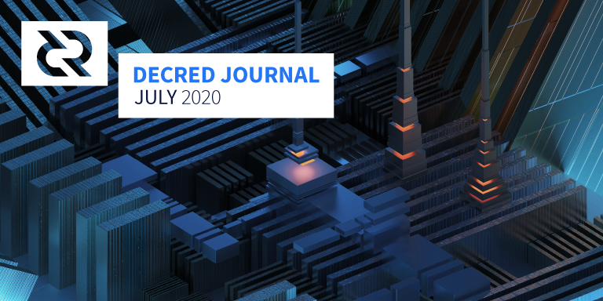

# Decred Journal – July 2020

_Image: Relay Pylons by @saender_

July's highlights:

- The decentralized approval of Treasury transactions, for which a DCP is forthcoming, will use Schnorr signatures, and the implementation is currently under review.
- Politeia saw a round of significant new features deployed, including RFP proposals and dark mode. On the CMS end accountability features are being added.
- vspd has received the last major change it needed, and is being tested on testnet and soon mainnet.
- There has been more progress towards running dcrlnd in SPV mode, and a huge codebase upgrade to match new lnd version.
- Discussion of community outreach activity has increased considerably across Reddit, Matrix and Discord channels - with a corresponding increase in the number of marketing-related proposals appearing on Politeia.

## Development

Unless otherwise noted, the work reported here has the "merged to master" status. It means that the work is completed, reviewed, and integrated into the source code that advanced users can build and run, but is not yet available in release binaries for regular users.

[dcrd](https://github.com/decred/dcrd):

- added handling of [`notfound`](https://github.com/decred/dcrd/pull/2253) peer message (if a peer indicates it has some data but does not serve it upon request, that peer is very likely misbehaving and gets banned)
- added more [test coverage](https://github.com/decred/dcrd/issues/2069) for the `rpcserver` package
- field normalization code [hardened](https://github.com/decred/dcrd/pull/2258) against the possibility of non-constant time operations due to branch prediction (primarily based on a [pull request](https://github.com/btcsuite/btcd/pull/1084) to btcd from 2017). The PR demonstrates a way of detecting non-constant time behavior by simply _looking_ at the assembly output.
- memory usage optimizations in [stake](https://github.com/decred/dcrd/pull/2294) node pruning, txscript [stack](https://github.com/decred/dcrd/pull/2298), trace [logging](https://github.com/decred/dcrd/pull/2301), and [chain tip](https://github.com/decred/dcrd/pull/2302) tracking code
- [exported](https://github.com/decred/dcrd/pull/2240) various consensus functions and types as a step to remove all non-consensus code out of the `txscript` package
- mining code [moved](https://github.com/decred/dcrd/pull/1965) into `mining` package
- [`mempool`](https://github.com/decred/dcrd/pull/2274), [`mining`](https://github.com/decred/dcrd/pull/2275) and [`fees`](https://github.com/decred/dcrd/pull/2287) converted from exported modules to internal packages to reduce the maintenance burden. This is part of the overall effort to reduce the total number of modules and eventually get to the point that it will be possible to follow [semantic versioning](https://semver.org/) for the root module.
- `rpcserver` code [moved](https://github.com/decred/dcrd/pull/2288) from the main module to a standalone internal package
- `cpuminer` [refactored](https://github.com/decred/dcrd/pull/2276) into its own package to improve testability and facilitate reuse
- `cpuminer` [reworked](https://github.com/decred/dcrd/pull/2277) to use the background block template generator to simplify testing with simulation test networks
- [exported](https://github.com/decred/dcrd/pull/2243) several `txscript` functions that are independently useful to make the Treasury PR a bit smaller

Commenting on the status of optimizations:

> Flame graph for CPU usage shows pretty clearly that things are being dominated by IO now, so the biggest speedups left will definitely come from that front. ~10% GC, <1% validation, ~3.5% peer I/O, ~55% disk I/O, ~3% profiling cost, ~27% idle, and the rest in minor bits and bobs. ([@davecgh](https://chat.decred.org/#/room/!zefvTnlxYHPKvJMThI:decred.org/$U9ybkey7ppiqGR_K_BagIHwcoyNGTS-H91hEaXzghmI))

A total of 53 pull requests from 8 contributors were [merged](https://github.com/decred/dcrd/pulls?q=is%3Apr+merged%3A2020-07-01..2020-07-31+sort%3Aupdated-asc), adding 11K and deleting 5K lines of code.

Decentralized Treasury spending [pull request](https://github.com/decred/dcrd/pull/2170) is undergoing [testing](https://twitter.com/marco_peereboom/status/1290439680937385985) and code review with over 350 comments now. A very notable [change](https://twitter.com/marco_peereboom/status/1283168367856300037) is that TSPEND transactions will use Schnorr signatures:

> I suggested that we use Schnorr signatures for the Treasury payouts in order to pick up some of the benefits they provide such as smaller signatures and formally provable security. I recently cleaned up the Schnorr code to bring it up to the project's high standards for consensus code and while there are some changes that we want to make to it in the future before switching to it for widespread usage with multi-party signatures among multiple untrusted sources, it is ready for prime time in the context of the Treasury payouts. ([@davecgh](https://chat.decred.org/#/room/!zefvTnlxYHPKvJMThI:decred.org/$yLGDR6WC7v7LTDkNYOLgTXHOozNnVc92xNS8B-0epds))

If you have some idle hardware, you can help by [fuzz testing](https://github.com/degeri/dcrd-continuous-fuzz) dcrd.

[dcrwallet](https://github.com/decred/dcrwallet):

- added optional [gaplimit](https://github.com/decred/dcrwallet/pull/1761) parameter to the `discoverusage` command
- added optional [account](https://github.com/decred/dcrwallet/pull/1767) parameter to the `listunspent` command
- implemented [`ticketinfo`](https://github.com/decred/dcrwallet/pull/1783) method that provides detailed status information regarding all tickets of the wallet (needed for vspd)
- added CoinJoin [params](https://github.com/decred/dcrwallet/pull/1780) to the `PurchaseTicketRequest` call
- implemented [`getpeerinfo`](https://github.com/decred/dcrwallet/pull/1797) command in SPV mode
- added new command to change wallet's public [passphrase](https://github.com/decred/dcrwallet/pull/1510)
- bug fixes

[Decrediton](https://github.com/decred/decrediton):

- backup and restore of the [SCB file](https://github.com/decred/decrediton/pull/2535) generated by dcrlnd (see explanation in the [docs](https://docs.decred.org/lightning-network/backups/))
- display of basic [LN info](https://github.com/decred/decrediton/pull/2575)
- added back proper [decoding](https://github.com/decred/decrediton/pull/2523) of staking transactions (needed for signing messages for the VSP)
- continued [upgrading](https://github.com/decred/decrediton/pulls?q=functional+is%3Apr+merged%3A2020-07-01..2020-07-31+sort%3Aupdated-asc) the codebase to modern React using functional components and CSS modules
- initial PoC support of the new [vspd](https://github.com/decred/decrediton/pull/2516) staking system
- support for [short](https://github.com/decred/decrediton/pull/2602) proposal URLs
- don't require passphrase when importing [redeem](https://github.com/decred/decrediton/pull/2616) scripts
- bug fixes

A total of 35 pull requests from 6 contributors were merged, adding 9K and deleting 7K lines of code.

[Politeia](https://github.com/decred/politeia):

Multiple new [features](https://twitter.com/lukebp_/status/1285955294703411201) have been deployed to the [proposals.decred.org](https://proposals.decred.org/) site: RFP process, flat display of comments (helps to quickly spot new comments without hunting them down in the thread), dark mode, short proposal URLs, and a change to block the posting of comments once a day instead of once an hour (workaround for a limitation that will be fixed with the migration to the tlog backend).

Merged changes:

- command-line [utility](https://github.com/decred/politeia/pull/1240) to test the RFP process
- improved test coverage
- bug fixes

CMS:

- admin [searching](https://github.com/decred/politeiagui/pull/2033) contractors by domain or type
- display proposal [names](https://github.com/decred/politeiagui/pull/2041) instead of tokens in invoice line items
- assigning proposal [ownership](https://github.com/decred/politeiagui/pull/2055) (GUI)
- admin review of proposal [spending](https://github.com/decred/politeiagui/pull/2032) summary and details
- new tab for proposal [owners](https://github.com/decred/politeiagui/pull/2046) to review billing details
- [highlighting](https://github.com/decred/politeiagui/pull/2057) for illegal characters in invoice line items

[vspd](https://github.com/decred/vspd):

- voting wallet [consistency](https://github.com/decred/vspd/pull/86) checks (the [last](https://twitter.com/JamieHoldstock/status/1288030715486056448) major change necessary for the release)
- admin table showing the [status](https://github.com/decred/vspd/pull/149) of each voting wallet
- API versioning and a few bug fixes

vspd has now been deployed on testnet by a couple of existing VSP operators, deployment seems to have been straightforward for them and things are working as expected.

[dcrlnd](https://github.com/decred/dcrlnd):

- updated to use latest [dcrwallet](https://github.com/decred/dcrlnd/pull/90) and [dcrd](https://github.com/decred/dcrlnd/pull/105)
- new [chainscan](https://github.com/decred/dcrlnd/pull/83) package that uses committed filters to detect transactions relevant for the LN node more efficiently and can also operate in SPV mode
- [implementations](https://github.com/decred/dcrlnd/pull/92) for chainntnfs package and a [driver](https://github.com/decred/dcrlnd/pull/93) for the chainview package that uses embedded and remote dcrwallet as a source of chain events. This allows us to further decouple dcrlnd from an underlying dcrd, which is a requirement for having a dcrlnd instance running in SPV mode.
- [switched](https://github.com/decred/dcrlnd/pull/94) the main dcrlnd package to use the new wallet-backed drivers so that chain IO operations are now fully performed by the underlying dcrwallet instance and dcrlnd no longer requires a connection to a running dcrd to perform its job
- enable and test [SPV mode](https://github.com/decred/dcrlnd/pull/95) for remote wallets (see [March issue](202003.md#development) for more background)
- [ported](https://github.com/decred/dcrlnd/pull/99) upstream lnd changes between v0.9.0-beta and 0.10.0-beta - 139 upstream PRs (plus a few non-PR'd commits) were considered for inclusion

[dcrdex](https://github.com/decred/dcrdex):

- client browser now provides a complete wallet [reconfiguration](https://github.com/decred/dcrdex/pull/533) dialog
- [smart fee rate](https://github.com/decred/dcrdex/pull/505) handling. To minimize the on-chain mining fees required for the optimal fee rate at swap time (not order time), smart fee estimates are used. To deal with orders needing to lock the coins required to fund the swaps, which can occur far after order placement when on-chain fees have changed, orders must reserve enough for a "max fee rate". In other words, orders reserve enough for a "max fee rate" in case BTC fees are high when the order is filled, but the optimal network fee at match time is used for the swap contract transaction. (and here's a [tweet](https://twitter.com/chappjc/status/1280510447515586565) for outreach people)
- improved wallet [locking of coins](https://github.com/decred/dcrdex/pull/525) that fund orders, particularly for chained swaps
- additional server administration functions: [ban](https://github.com/decred/dcrdex/pull/469), [unban](https://github.com/decred/dcrdex/pull/479), [notify](https://github.com/decred/dcrdex/pull/555), and [notify all](https://github.com/decred/dcrdex/pull/534)
- for orders with revoked (failed) matches, the order is automatically [unbooked](https://github.com/decred/dcrdex/pull/475) and the clients are notified
- client's database scheme is now versioned, with an [upgrade](https://github.com/decred/dcrdex/pull/448) infrastructure for future changes
- the client now automatically [resubscribes](https://github.com/decred/dcrdex/pull/503) to the order book feed after a reconnection with the server
- client command line interface now provides the [order book](https://github.com/decred/dcrdex/pull/496)
- client [prevents](https://github.com/decred/dcrdex/pull/527) accidental shutdown with active orders and swaps
- client browser interface [polish](https://github.com/decred/dcrdex/pull/560)
- numerous bug fixes and optimizations

[dcrandroid](https://github.com/planetdecred/dcrandroid):

- updated French translation
- bug fixes
- fetching Politeia [proposals](https://github.com/planetdecred/dcrlibwallet/pull/153) added to dcrlibwallet base library
- several bug fixes in dcrlibwallet

[godcr](https://github.com/planetdecred/godcr):

godcr is an upcoming cross-platform pure-Go desktop SPV wallet for Decred. See [June](202006.md#development) issue for the introduction.

- [sync status](https://github.com/planetdecred/godcr/pull/170) widget on the Overview page
- Send page [updated](https://github.com/planetdecred/godcr/pull/184) to match the mobile apps
- updated to newer [Gio](https://github.com/planetdecred/godcr/pull/186) UI library
- removed hardcoded [dimensions](https://github.com/planetdecred/godcr/pull/173) from all pages
- UI tweaks and fixes

@planetdecred Twitter published a short [demo](https://twitter.com/planetdecred/status/1290753362829352960) of how existing features look in action (overview, connect, send, receive, history).

[decred.org](https://github.com/decred/dcrweb):

- notable articles added to [Press](https://decred.org/press/) page
- Lottie animations [added](https://github.com/decred/dcrweb/pull/892) to History page

Other:

- [decredpower.com](https://decredpower.com/) migrated to [Hugo](https://github.com/planetdecred/decredpower/pull/19) which is more flexible and easier to update. It also features a fresh new theme (don't worry, [retro](https://decredpower.com/retro/) theme is still there!).
- there is a pending pull request adding [Decred support](https://github.com/trezor/trezor-utxo-lib/pull/9) to Trezor's javascript library
- @kozel published a detailed [guide](https://medium.com/@artikozel/the-decred-node-back-to-the-source-part-one-27d4576e7e1c) how to build the most recent Decred software from source and run it on Raspberry Pi

## People

Welcome to new first time contributors with code merged to master: @Kifen ([dcrwallet](https://github.com/decred/dcrwallet/pull/1520)).

Congratulations to new contractors granted the Decred Contractor Clearance (DCC): [@rstaudt2](https://github.com/rstaudt2) (development).

Community stats as of Aug 1:

- Twitter followers: 40,637 (+120)
- Reddit subscribers: 9,875 (+21)
- Matrix #general users: 124 (-498) \*
- Discord users: 1,372 (+84)
- Telegram users: 2,520 (-87)
- YouTube subscribers: 4,150 (+40), views: 151K (+3K)
- Facebook followers: 3,655 (+0), likes: 3,305 (-6)
- LinkedIn followers: 862 (+26)
- GitHub dcrd stars: 550 (+1), forks: 240 (-1)

\* chat rooms were upgraded on Jul 9, see [Community Discussions](#community-discussions) for details.

You can see charts of all social media data points reported in Decred Journal and more [here](https://github.com/xaur/social-media-data/blob/graphs/graphs/index.md) (raw data is in the same repository). Another good resource is [community stats](https://dcrextdata.planetdecred.org/community) page of the dcrextdata project - it tracks fewer accounts but has much better data resolution and interactive charts.

## Governance

In July the [Treasury](https://explorer.dcrdata.org/address/Dcur2mcGjmENx4DhNqDctW5wJCVyT3Qeqkx) received 13,050 DCR and spent 16,073 DCR. Using July's daily average DCR/USD rate of $15.13, this is $197K received and $243K spent. At June's average daily rate of $16.05, the USD figure billed for work completed in that month is $258K. As of Aug 1, Treasury balance is 630,766 DCR (10.7 million USD at $16.92).

There were 7 proposals submitted in July:

- The [proposal](https://proposals.decred.org/proposals/c81926b) from @lindseymmc for the continuation of PR services at $3,500/month for one year was approved with 90% support (25% turnout), up on the first proposal's 72% approval.
- [Proposal](https://proposals.decred.org/proposals/dedf452074752d7e29304a0566643feb26d1d130596e04c613e15de113ac2d08) to spend $15,000 creating augmented reality posters.
- [Proposal](https://proposals.decred.org/proposals/32cba00b8bb0f41689ca8216e2e14a0e3d91a724c83369b3fcda02490dc119f4) to cover moderation of Matrix, Discord, Telegram and Politeia, max $9,000 expected $4,800 for 6 months. This work is already being done and paid for, the proposal is to formalize this and put a limit on how much can be billed for it.
- [Proposal](https://proposals.decred.org/proposals/2dcbc3e14c06c6e84449f5e2756b944d5ed23be41c23a9f5225f3eef424ce0ae) to offer DCR as a payment option on two travel booking websites ($30K), plus some promotional activities ($21.5K).
- [Proposal](https://proposals.decred.org/proposals/3372cfce1218ba81d9c8ca0535cd9dd590f60c92adc068c0089218ae7e3e99e1) to spend $10K on a range of marketing activities (including paid retweets/endorsements and advertisements) - associated Reddit [post](https://www.reddit.com/r/decred/comments/hzo3yu/creating_a_decred_marketing_workgroup/).
- [Proposal](https://proposals.decred.org/proposals/4f81031) to create 20 social media memes for 10 DCR/meme.
- [Proposal](https://proposals.decred.org/proposals/7a67ed5) to host a series of poker games with DCR prizes (300 DCR/month).

Two of these proposals have an issue with DCR-denominated budgets.

Also this month the question of changing DCR issuance was put to a Reddit [poll](https://www.reddit.com/r/decred/comments/hz9i6d/poll_the_decred_great_inflation/) by @Checkmate, in an effort to put the issue to rest. The poll attracted 87 votes, and 65 were against any further consideration of changing the DCR issuance policy.

Check Politeia Digest [issue 33](https://blockcommons.red/politeia-digest/issue033/) for more details about the first two of these, issue 34 with details of the other new proposals will be out soon.

## Network

Hashrate: [July's hashrate](https://explorer.dcrdata.org/charts?chart=hashrate&zoom=kc0s5ehh-kdbsef8t&scale=linear&bin=block&axis=time) opened at ~394 Ph/s and closed ~307 Ph/s, bottoming at 307 Ph/s and peaking at 582 Ph/s throughout the month. Pool [hashrate distribution](https://dcrstats.com/pow) as of Aug 1 (approximate): Poolin 33%, UUPool 26%, lab.antpool.com 9.6%, BTC.com 3.4%, Luxor 0.9%, F2Pool 0.8%, BeePool 0.09%, CoinMine 0.03%, Suprnova 0.02% and others ~26%.

Staking: [30-day average](https://dcrstats.com/) ticket price was 144.3 DCR (+4.9). The [price](https://explorer.dcrdata.org/charts?chart=ticket-price&zoom=kc0s5ehh-kdbsef8t&bin=window&axis=time&visibility=true-false&mode=stepped) varied between 137.1-155.5 DCR. [Locked amount](https://explorer.dcrdata.org/charts?chart=ticket-pool-value&zoom=kc0s5ehh-kdbsef8t&bin=day&axis=time) was 5.75-5.88 million DCR, which corresponded to 48.98-50.06% of the available supply [participating](https://explorer.dcrdata.org/charts?chart=stake-participation&zoom=kc0s5ehh-kdbsef8t&bin=day&axis=time) in PoS.

Nodes: Throughout [July](https://charts.dcr.farm/d/000000014/nodes?orgId=1&from=1593561600000&to=1596240000000) there was an average of 134 public listening nodes and 241 total nodes per dcr.farm. Average version distribution for July: 51% dcrd v1.5.1, 10% dcrd v1.5, 6% dcrd v1.6 dev builds, 5% dcrd v1.5 dev and RC builds, 1.3% dcrd v1.4, 7% dcrwallet v1.5.1, 1% dcrwallet v1.5, 0.6% dcrwallet v1.4, and 18% others.

## Integrations

- NovaDAX exchange [added](https://twitter.com/Decred_BR/status/1275190825060794377) DCR trading against BRL, USDT, BTC and ETH (_missed in Jun_).

- Binance added both [DCR/BUSD](https://www.binance.com/en/support/articles/fee761e58d684bc3a1c7fc11660ab596) and [DCR/USDT](https://www.binance.com/en/support/articles/043fc71cdcce4fcfbdae133d8d0f35aa) pairs within weeks of each other.

- Originally XT.com [listed](https://twitter.com/XTexchange/status/1062529195094339584) DCR in Nov 2018, now they have DCR trading to [USDT](https://twitter.com/XTexchange/status/1281867070653816832) and a leveraged mode.

- Decred is finally no longer a "Bitcoin fork" on [CoinMarketCap](https://coinmarketcap.com/currencies/decred/).

Warning: the authors of the Decred Journal have no idea about the trustworthiness of any of the services above. Please do your own research before trusting your personal information or assets to any entity.

## Community Shop

[Decentralized Boutique](https://twitter.com/decentralizedbt/status/1288529718514536449) announced "Decred Grenade" that is also available as a digital download for printing at home, for people who would rather avoid receiving delivery of grenade-shaped items in the mail.

[@OfficialCryptos](https://twitter.com/OfficialCryptos/status/1289170923501817859) unveiled flashy looking Decred heart stickers.

## Outreach

The subject of marketing saw a considerable discussion on Reddit and Matrix, and specifically what role the Treasury of a decentralized project like Decred should play in this.

@Checkmate has been stirring the pot of grassroots outreach and other ideas on Reddit, with regular and irregular posts provoking discussion that has also spilled over into some other marketing-related discussion posts. This month's outreach braindroplets:

- @mrbulb posted a [Workshop Wednesday](https://www.reddit.com/r/decred/comments/hj7n52/what_is_decred_workshopwednesday/), inviting people to explore the 4 key stages of narrative development with him.
- Forward Thinking Friday (FTF) Jul 3 - Decred [Artwork](https://www.reddit.com/r/decred/comments/hkfj1r/forward_thinking_friday_decred_artwork_03_july/), developing the concept of an art competition.
- Skepticism Sunday, Jul 5 considered hardware wallets and staking, @jy-p [knows](https://www.reddit.com/r/decred/comments/hluve9/decred_skepticism_sunday_05_july_2020/fx38dq3/) a new dev who is into this kind of thing. This edition also featured an epic [ragequit](https://www.reddit.com/r/decred/comments/hluve9/decred_skepticism_sunday_05_july_2020/fx2xh21/) from an airdrop participant who bounced between DCR and XMR over the years, started staking in 2019 but is now done. Multiple surprising claims were questioned by @bee and [debunked](https://www.reddit.com/r/decred/comments/hluve9/decred_skepticism_sunday_05_july_2020/fx3j2j6/) by @jy-p.
- FTF Jul 10 had [discussion](https://www.reddit.com/r/decred/comments/homdwc/forward_thinking_friday_10_july_2020/) about bringing DCR data to life for more people and showing off Decred's interesting and immaculately presented chain, plus rappers, graffiti and some skepticism that was shared on the wrong day.
- Skepticism Sunday Jul 12 - [capture](https://www.reddit.com/r/decred/comments/hpsgye/decred_skepticism_sunday_12_july_2020/) of governance, losing the "currency" focus from messaging.
- FTF Jul 17 on the subject of [differentiators](https://www.reddit.com/r/decred/comments/ht4r8a/forward_thinking_friday_differentiators_17_july/), looking at the different ways in which Decred stands out.
- Skepticism Sunday Jul 19 - fiat on-ramps, [wrapping](https://www.reddit.com/r/decred/comments/htuac8/decred_skepticism_sunday_19_july_2020/) DCR in ETH.
- @Haon shared a [concept](https://www.reddit.com/r/decred/comments/hviup5/brainstorm_ideas_about_the_future_of_politeia/) of a dapp for transparent governance based on Politeia.
- FTF Jul 24 focused on content [amplification](https://www.reddit.com/r/decred/comments/hxblmd/forward_thinking_friday_content_amplification_24/) - cyclical patterns and getting the right messages to the right people.
- Juiced from Sunday's (lack of) [skepticism](https://www.reddit.com/r/decred/comments/hy4x66/decred_skepticism_sunday_26_july_2020/), on Monday, July 27 @Checkmate dropped part 2 of the Grassroots Marketing Discussion - [The Hardest Part](https://www.reddit.com/r/decred/comments/hyrq5w/grassroots_marketing_discussion_round_2_the/). This post set out 3 observations: #1 marketing budgets to date have not performed well, #2 absence of structure and leaders, #3 Treasury creates perverse incentives in marketing. These have struck a chord with many community members (40 comments so far), and even brought @Dustorf [back](https://www.reddit.com/r/decred/comments/hyrq5w/grassroots_marketing_discussion_round_2_the/fzjjg0s/) into the mix to share his perspective.

If you're on LinkedIn, check the new [dcrdex](https://www.linkedin.com/showcase/dcrdex) showcase page.

Warning: there is a strange [Decredcash](https://www.facebook.com/Decredcash/) account on Facebook with a surprising number of followers (2.5K). Some latest posts appear legit, but the owner is unknown and the [About](https://www.facebook.com/Decredcash/about/) page has suspicious account details and a mention of "masternode system". 

Monde PR's achievements for July:

- created and pitched 4 story ideas to personal finance, business, crypto and tech publications
- secured two email Q&As with crypto and mainstream publications

News coverage secured by Monde PR:

- a thought leadership piece in [ValueWalk](https://www.valuewalk.com/2020/07/self-funding-cryptocurrencies-recession/) by @richardred about the resiliency of self-funding cryptocurrencies during the recession
- an article in [Forbes](https://www.forbes.com/sites/cbovaird/2020/07/08/bitcoin-volatility-reached-lowest-since-february-last-month/) featuring commentary by @jy-p on Bitcoin price volatility. The comments were also included in an article in [BitPush News](https://www.bitpush.news/articles/872764), which was syndicated to 4 news outlets including [Chain News](https://www.chainnews.com/zh-hant/articles/585418132268.htm).
- @jy-p's commentary in [Cointelegraph](https://cointelegraph.com/news/decred-co-founder-calls-paypal-and-crypto-an-odd-combination) about the PayPal cryptocurrency rumors was featured in [Cointelegraph Italy](https://it.cointelegraph.com/news/paypal-letter-seems-to-confirm-crypto-capability-rumors) and [Corriere Romagna](https://www.corriereromagna.it/le-criptovalute-sbarcheranno-su-paypal-i-dubbi-degli-esperti/)

Commenting on Monde PR's Phase Two proposal being approved:

> Thank you to everyone who voted and gave feedback. I'm very much looking forward to continuing the PR efforts and working with the community to raise awareness about the project. Lindsey McConaghy (@l1ndseymm)

## Events

Attended:

- Jul 2 - [Legaltech Talk #7](https://twitter.com/legal_medellin/status/1278507480570609664) - Internet. @elian talked with Legal Hackers Colombia and BlockchainEx Colombia about Fintech regulation, cryptocurrency ecosystem in Latam, and challenges and opportunities for innovation. Questions from the audience were related to regulatory environments in Mexico, Argentina, and Colombia, opportunities for collaboration and sources of education. ([video](https://www.youtube.com/watch?v=7B-_0yKJzGI))
- Jul 3 - [Cryptographic Friday](https://twitter.com/anibalcripto/status/1278478260716933120) - Internet. @elian joined the panel on blockchain governance of Decred and Dash with [@anibalcripto](https://twitter.com/anibalcripto) (Venezuelan crypto influencer), [@EzioRed](https://twitter.com/EzioRed) (editor of Cointelegraph in Spanish) and [@ernestocontrer](https://twitter.com/ernestocontrer) (Dash Core Group BizDev). It was a good opportunity to connect with the Venezuelan ecosystem and showcase the differences between Decred and Dash.
- Jul 8 - [Youth Entrepreneurship](https://twitter.com/in_insaf/status/1280771474966675456) - Internet. The event was organized by the Moroccan Organization of Young Decision Makers, where @arij talked about blockchain technology and how it will change the industrial sector. The presentation took one hour, plus half an hour of Q&A. At the beginning, there were just 16 participants but more have joined in the middle of the webinar. ([report](https://github.com/decredcommunity/events/blob/master/reports/20200708-virtual-training-academy-internet.md))
- Jul 9-11 - [Campus Party](https://brasil.campus-party.org/) - Internet. This was the first online Campus Party with speakers from around the world. Decred BR team had 3 talks from Clara Nobre ("[Open Source and cryptocurrencies](https://www.youtube.com/watch?v=AD84kjsS50w): uniting community and bytes that are worth gold!"), Rafaela Romano ("[Blockchain monetization](https://www.youtube.com/watch?v=m4zxnq7RJoQ): one coin for your thoughts"), and Fernando Guisso ("[Instant payments](https://www.youtube.com/watch?v=CkQaUhlPTKA) with cryptocurrencies").
- Jul 10 - [Cryptographic Friday](https://twitter.com/anibalcripto/status/1281194876932108288) - Internet. @adcade joined women from crypto communities in Mexico, Chile, and Venezuela. The panel discussed cryptocurrency projects, crypto culture, personal stories of how each one got started, tips on navigating the industry, and some discussion of the nuances of gender in crypto. The event was sponsored by Binance and hosted by @anibalcripto and @EzioRed. ([photo](https://twitter.com/elianhuesca/status/1281729905236025345))
- Jul 15 - [¿Segura, adaptable y sustentable?](https://twitter.com/Decred_ES/status/1283548889249992704) - Internet. Instagram Live with @adcade and lawyer Hector Ibarra to discuss cryptocurrencies and the three main characteristics of Decred: security, adaptability, and sustainability. Around each characteristic explored, some parallels were drawn with current laws in Mexico, and how crypto can render them useless. Where and how to buy DCR was also examined.
- Jul 22 - [Crypto Resources Academy](https://twitter.com/cryptorc_tech/status/1284187985366462464) - Internet. @elian talked about crypto scams, what kinds of scams exist, how to spot them, how to prevent, and a summary of the largest hacks in the cryptocurrency industry. The event was announced on [Cointelegraph](https://es.cointelegraph.com/news/theyll-be-giving-a-talk-on-preventing-crypto-scams) in Spanish and [livestreamed](https://www.youtube.com/watch?v=IAlXrrYCYcs) on YouTube.
- Jul 22-23 - [Blockchain Land](https://www.blockchain-land.tv/) - Internet. @pablito and @camilolwi were on the panel on [DAO](https://www.blockchain-land.tv/eventos/comunidades-con-codigos-el-rol-de-las-daos-en-la-blockchain-gustavo-segovia-mariano-di-pietrantonio-pablo-labarta-camilo-rodriguez/) with MakerDAO and Colony. On the next day @adcade gave a [talk](https://www.blockchain-land.tv/eventos/las-criptomonedas-son-productos-digitales-quien-las-mantiene-ana-chavez/) "Who pays for cryptocurrency development?", a 20 min segment on how to contribute to Decred. (full 12-hour [video](https://www.youtube.com/watch?v=On2zYc7BrvI), @adcade's [talk](https://www.youtube.com/watch?v=iot1tkctSRI))
- Jul 23 - Hablemos Decred 7 - Internet. @elian and Lorena Ortiz from Bitcoin Embassy Bar talked about scams, how to prevent them, and how to store cryptocurrencies safely. ([video](https://www.youtube.com/watch?v=lRtXgtJ7dU8))
- Jul 30 - [Descentralizar 2020](https://descentralizar.org/) - Internet. Descentralizar is a virtual event organised by Bitcoin Argentina, the largest cryptocurrency association in Argentina, gathering the community of developers, entrepreneurs, investors, and the general public. Decred was a sponsor of the event.
- Jul 31 - [Decred Virtual Meetup](https://www.meetup.com/Decred-Australia/events/272243922/) - Internet. @eSizeDave, @Checkmate, and @Zohand hosted this event in Zoom and updated the community on Decred's latest developments, upcoming releases, general market analysis, and insights from Decred's latest on-chain analytics findings.

## Media

If you see that the venerable [thedecreddigest.com](https://thedecreddigest.com/) is down, do not panic, it has moved to [thedecreddigest.org](https://thedecreddigest.org/).

Selected articles:

- The Federal Reserve: A blatantly rigged game by @jy-p ([blog.decred.org](https://blog.decred.org/2020/07/01/The-Federal-Reserve-A-Blatantly-Rigged-Game/)) - triggered a [debate](https://twitter.com/behindtext/status/1278424658962984962) on Twitter and a [discussion](https://www.reddit.com/r/decred/comments/hjsgg1/the_federal_reserve_a_blatantly_rigged_game/) of the history of money where so many crises were amplified by speculation, debt taking, and money printing
- The Decred Node: Back to the Source - Part One by @kozel ([medium](https://medium.com/@artikozel/the-decred-node-back-to-the-source-part-one-27d4576e7e1c))
- Decred On-Chain Mini Pub 1: Relative MVRV ratio by @PermabullNino ([medium](https://medium.com/@permabullnino/decred-on-chain-mini-pub-1-relative-mvrv-ratio-ea2564ca420f))
- Decred On-Chain Mini Pub 2: HODL power by @PermabullNino ([medium](https://medium.com/@permabullnino/decred-on-chain-mini-pub-2-hodl-power-d1cf8bafbffc))
- Decred On-Chain Mini Pub 3: Difficulty ribbon price by @PermabullNino ([medium](https://medium.com/@permabullnino/decred-on-chain-mini-pub-3-difficulty-ribbon-price-d644e470b989))
- More than 20 developers have contributed to Decred so far this year by Fernando Quirós (Spanish, [es.cointelegraph.com](https://es.cointelegraph.com/news/more-than-20-developers-have-contributed-to-decred-so-far-this-year))

Translations:

- Why we need Decred: An inclusive approach to sound money - [in Spanish](https://medium.com/decred-es/porque-decred-es-necesario-un-enfoque-inclusivo-sobre-el-dinero-duradero-b8235fb312f3) by @adcade
- The Federal Reserve: A blatantly rigged game - [in Arabic](https://insaf01.github.io/decred-arabic/articles/the-federal-reserve-a-blatantly-rigged-game.html) by @arij (corrections by @Abdulrahman4 who has been reviewing most Arabic texts so far - thanks!), [in Portuguese](https://stakey.club/translated/federal-reserve/) by @mm, and [in Spanish](https://medium.com/decred-es/la-reserva-federal-un-sistema-realmente-manipulado-d40dedcc619b) by @francov\_
- Decred Journal June 2020 was [translated](https://xaur.github.io/decred-news/) to Arabic (@arij, review by @Abdulrahman4), Chinese (@Dominic), and Spanish (@francov\_, review by @pablito). Thank you all for your persistence!

Videos:

- Decred bi-weekly news update - July 13th, 2020 by @Exitus ([youtube](https://www.youtube.com/watch?v=yqI5R_WthT4))
- Decred bi-weekly news update - July 31st, 2020 by @Exitus ([youtube](https://www.youtube.com/watch?v=SwDH0mIAB_w))
- Decred Webinar: Sociology, the future of work and incentive alignment hosted by Decred Australia ([youtube](https://www.youtube.com/watch?v=1dcHwap7xHQ))
- Clay Stakey, speed runner - Decred ticket 871071c... by @richardred ([youtube](https://www.youtube.com/watch?v=PAt-slBHVTo), [twitter](https://twitter.com/RichardRed0x/status/1283874248994492416) version) - 22 second short film featuring Clay Stakey on a speed voting run
- Decred and the open ledger by Decred Society ([youtube](https://www.youtube.com/watch?v=npfjhfVUmMQ)) - a tour of the dcrdata block explorer
- Decred price analysis - 16 July 2020 by Brave New Coin ([youtube](https://www.youtube.com/watch?v=O2M6oVhL9rU))

Audio:

- Decred in Depth 28: DCR round up. @Checkmate and @PermabullNino talk shop about Decred fundamentals, the rigged economic system, inspired by @jy-p's piece on the topic and update the community on the progress of their individual proposals. ([libsyn](https://decredindepth.libsyn.com/dcr-round-up-with-checkmate-permabull-nio-0), [soundcloud](https://soundcloud.com/decredindepth/dcr-round-up-with-checkmate-1))
- Decred in Depth 29: @Ammarooni makes another DiD appearance to talk about inflationary monetary policy through history, the search for ways to store value, and the ways in which Decred builds on Bitcoin's value proposition. ([libsyn](https://decredindepth.libsyn.com/ammar-naseer-hyperinflation-sound-money-dcrs-role))
- Rough Consensus 9: Early crypto bull? @mr.black, @Checkmate, and @PermabullNino discuss the possible emergence of an early crypto bull market and relevant narratives that might underpin it, which includes DeFi, staking, leverage, yield chasing, and hard assets. ([libsyn](https://roughconsensus.libsyn.com/episode-9-early-crypto-bull))
- Bankless 20: Ethereum opportunity with Chris Burniske. Chris highlights the importance of governance in cryptocurrencies and mentions Decred as an example: "Over the long term good and equitable governance, things that involve people, that give people a voice to at least be heard, are key to surviving and resilience, even if they may slow down week-to-week execution through a little bit of analysis paralysis and being too distributed". ([bankless.substack.com](https://bankless.substack.com/p/-ethereum-opportunity-chris-burniske), [youtube](https://www.youtube.com/watch?v=oG3CUT9kziE))

Games: 

- coli, of #trading fame, has been adding Stakey skins to games, including [Stakey Jump](https://www.reddit.com/r/decred/comments/hk83uh/stakey_jump/)

Artwork:

- @aithzakaria1 posted new drawings (highlights): [astronaut](https://twitter.com/aithzakaria1/status/1278714765939036166), crystal [butterfly](https://twitter.com/aithzakaria1/status/1281058200054308865), [golden key](https://twitter.com/aithzakaria1/status/1282487571373842438), [bob stakey](https://twitter.com/aithzakaria1/status/1284048337562411010)
- @OfficialCryptos: pencil version of [armored lizard](https://twitter.com/OfficialCryptos/status/1285152788947832833), [butterfly](https://twitter.com/OfficialCryptos/status/1279525695048364038), and some others
- @svitekpavel [announced](https://www.reddit.com/r/decred/comments/htdsts/decred_artwork_new_repo_on_github_free_to_use/) a new [repository](https://github.com/Decred-Bulls/decred-artwork) to collect Decred-related artwork that is free to use and tries to include original source files (AI, PSD, etc) so the artwork is editable or reusable in further creations. The first piece to be included is the butterfly DCR graphics by u/BitartZone, which emerged from the [cocoon](https://www.reddit.com/r/decred/comments/ho1x71/dcr_bounty_create_decred_butterfly_svg_and/) of a DCR Bounty post.

_Image: [wood carving](https://twitter.com/aithzakaria1/status/1288926196751904768) by @aithzakaria1_

## Community Discussions

Comm systems news:

- Most Matrix rooms were upgraded to version 5, which should resolve some edge case bugs when joining rooms. Since members of the old room do not automatically join the new one (they must accept an invite), one consequence of the upgrade is a sharp drop in user counts (e.g. #general went from 622 to 124). On the other hand, this reveals the number of users active during the last 3 weeks.
- The #showerthoughts chat room is finally here, the place to unburden yourself of those off the wall ideas. @matheusd insists they be presented fresh from the shower, unburdened by the weight of excessive scrutiny or logic.
- The Riot desktop client for the Matrix protocol, as well as its developer company New Vector, have [rebranded](https://element.io/blog/welcome-to-element/) to Element. The change came with some UI updates too, adding room previews, improved notifications, and more.
- Important [notice](https://element.io/previously-riot) for Riot Desktop users loading the app from riot.im: "For the next few weeks, you can still use Riot on the web at riot.im/app. Please make sure you sign into your account soon to cross-sign your new login session, and ensure you have access to your encrypted messages."
- First experimental build of peer-to-peer Riot for iOS is [published](https://matrix.org/blog/2020/07/10/this-week-in-matrix-2020-07-10#riot-ios-p2p-demo) on TestFlight.
- RiotX (a from-scratch rewrite of Riot Android) has exited beta, gaining VoIP calls and Widget support, and was also rebranded to Element. Available on [F-Droid](https://f-droid.org/packages/im.vector.app/) and [Google Play](https://play.google.com/store/apps/details?id=im.vector.app).

Selected Reddit posts:

- "[This party sucks](https://www.reddit.com/r/decred/comments/hy7h7w/this_party_sucks_i_wish_i_was_at_home_staking/). I wish I was at home staking Decred" - @Exitus shared his painful experience of going to the wrong party ([tweet](https://twitter.com/coveryfire7777/status/1287389278444630017) version).
- Celebrating the community's [response](https://www.reddit.com/r/decred/comments/hp834o/a_sound_example_of_community_engagement/) to gaps where Decred can be mentioned.
- Suggestion to participate in a "[MetaDAO](https://www.reddit.com/r/decred/comments/hxul33/metadao_pooling_onchain_funding_for_public_good/)" pooling funding for public good proposals with other projects.
- Animated visualization of Decred [Git history](https://www.reddit.com/r/decred/comments/i0fcf4/decred_git_history_2016_2020/) 2016-2020 by @pablito.
- Ideas to [reward](https://www.reddit.com/r/decred/comments/hw3atn/ideas_for_growing_the_decred_userbase/) influencers for educating their audiences about Decred, tipping systems, DCR vouchers.
- Idea to filter out [tainted](https://www.reddit.com/r/decred/comments/hsyij4/filtering_of_tainted_coins_in_dcrdex/) coins on dcrdex was met with some criticism, in part due to the complexity it introduces.
- Another "attention grab" attack thread asking about ["use cases"](https://www.reddit.com/r/decred/comments/hj5w4q/hi_im_new_just_wondering_what_are_some_usecases/) for DCR was removed (account deleted) after collecting substantial replies, but was soon resurrected.

Selected Twitter discussions:

- @chappjc [asks](https://twitter.com/chappjc/status/1288167672849596417) whether an open source non-rent-seeking decentralized exchange counts as DeFi?
- @jholdstock is [back](https://twitter.com/JamieHoldstock/status/1288030715486056448) on Twitter to put out an update on vspd and call for more testers, @sethsimmons [dives](https://twitter.com/sethisimmons/status/1288189814349664258) in and is up and running on testnet in [doublequick](https://twitter.com/sethisimmons/status/1288554162628833280) time.
- @pablito [suggested](https://twitter.com/plabarta_/status/1286062208460390401) that Messari may have missed a DAO and helped to fix their chart.
- @DecredAustralia [_coined_](https://twitter.com/DecredAustralia/status/1287541151105298432) the term [#DCRDiet](https://twitter.com/hashtag/DCRDiet) where people choose to spend their money on buying DCR over fast food and unnecessary items.
- Check out [@decredcitizen](https://twitter.com/decredcitizen), a new Twitter account with the right Decred vibe in it. Each tweet is sharp and balanced.

> deCred is not they, he, she, you.  
> deCred is I, me, we. ([tweet](https://twitter.com/decredcitizen/status/1287827725596622848))

## Markets

In July DCR was trading between USD 13.70-16.28 / BTC 0.00132-0.00177. The average daily rate was $15.13.

The new Binance DCR/USDT pair quickly made it to the top 10 with a $50K 24-hour volume as of Aug 6, according to [CoinMarketCap](https://coinmarketcap.com/currencies/decred/markets/). On Brazilian NovaDAX, the new DCR/BRL dominates the other pairs with $5K daily volume observed on Aug 4.

@PermabullNino started the new Decred On-Chain Mini Pub series where he explores one metric at a time. [Part 1](https://medium.com/@permabullnino/decred-on-chain-mini-pub-1-relative-mvrv-ratio-ea2564ca420f) introduces several new metrics derived from BTC and DCR realized caps that reflect holder psychology and market over-/undervaluation. [Part 2](https://medium.com/@permabullnino/decred-on-chain-mini-pub-2-hodl-power-d1cf8bafbffc) combines realized cap and % of supply locked in the ticket pool to derive two new metrics unique to DCR that matched historical tops and bottoms with good accuracy. [Part 3](https://medium.com/@permabullnino/decred-on-chain-mini-pub-3-difficulty-ribbon-price-d644e470b989) looks at Decred's difficulty ribbon and derives a new price metric against USD and BTC that has acted as a magnet for price in bear markets. As usual, all code to generate the charts is [open](https://github.com/permabullnino/nino_on_chain) on GitHub so that any interested researcher can reproduce the results or build on top of it.

@Checmkate [observes](https://twitter.com/_Checkmatey_/status/1282465263011508225) that "There is a whole swathe of Decred onchain metrics that are lighting up right now".

## Relevant External

Cloudflare suffered an issue that took down many of the sites which rely on it, the [effect](https://cointelegraph.com/news/cloudflare-outage-shows-crypto-holders-are-not-that-decentralized) could be [seen](https://twitter.com/lopp/status/1284275353389862914) on Bitcoin transaction volume, presumably because transactions from web wallets that rely on Cloudflare were not possible.

More than 75 companies in the blockchain and cryptocurrency industry don't mind taking U.S. government backed payroll [loans](https://www.coindesk.com/consensys-polychain-tron-ciphertrace-blockchain-startups-got-18m-in-us-ppp-bailout-loans). These include such well known (and funded) outfits as Consensys (Ethereum) and the Electronic Coin Company (Zcash) - which already enjoys (part of) the 20% of ZEC block rewards. Opinions are split between those who think taking government-sponsored loans is at odds with cryptocurrency ideals and those who think they'll be disadvantaged if they refrain while others help themselves. This demonstrates that even a well-subscribed ICO or ongoing 20% block rewards are not guarantees of a secure and sustainable funding situation, it is also necessary to manage spending and if possible establish some reserves.

Josh Concinnati [announced](https://twitter.com/acityinohio/status/1289223795903881216) he is resigning his position as Executive Director of the Zcash Foundation. The tweeted "letter" of resignation cites principles like "In open systems, those who help architect process which grant their organizations power should refuse to wield it" (Josh was involved in securing future ZEC block rewards for the Foundation, which only has a stipend from ECC in the current arrangement). The letter also indicates that a major reason for Josh's departure is that his relationship with the ECC and capacity to work with them was irreparably damaged during the trademark dispute, which formed part of the negotiations about Zcash development funding after the initial period of 20% for ECC ends.

Josh also shared a piece of advice that applies to broader cryptocurrency and Decred: "beware relentless, unexamined positivism and near-religious zealotry", "welcome serious critique", "do not cargo-cult startup-ism into the core of your protocol, and resist attempts by others to do so", and "question where influence truly lies and who wields it". Check them in full in the original [post](https://gist.github.com/acityinohio/8590e5384806090fbcf5609e613eae51).

Reddit's "great scaling bake-off" (about scaling Reddit's use of Ethereum) attracted considerable attention and many [contributions](https://www.reddit.com/r/ethfinance/comments/hbjyd3/the_great_reddit_scaling_bakeoff/), entries are being assessed in August.

Someone is [complaining](https://medium.com/coinmonks/a-primer-on-ethereum-social-governance-fde47d678de9) about Ethereum's social governance processes on platforms like Twitter which the developers do not pay attention to, and calling for an all-in-one Ethereum governance platform "that effectively gauges the sentiment of the Ethereum community to ensure their voices are being represented".

Ravencoin was subjected to an [attack](https://medium.com/@tronblack/ravencoin-post-vulnerability-fix-fb3a4bd70b7b) which exploited a protocol bug to print RVN without limit, outside the issuance schedule. The attack was enabled by a one-time [pull request](https://github.com/RavenProject/Ravencoin/pull/732) from a developer with no other history and exploited some time after being merged into production releases of the Ravencoin software. Once the vulnerability was announced and the fix released, new attackers emerged to exploit it while the network rushed to update enough miners within the first activation window. Much of the RVN minted by these new attackers was subsequently burned, as at least one of them revealed some personally identifiable information, and the lead Ravencoin developer threatened to (and in fact did) involve law enforcement. The attack was running for some time, minting RVN regularly, mixing it up, and selling it - 4% of all the RVN in circulation now was created (and sold) in this manner. As this extra RVN was outside the planned issuance, the Ravencoin community must now decide how to accommodate the extra RVN within the planned issuance limit. The subject was also covered by @BlockCommons on [Twitter](https://twitter.com/BlockCommons/status/1281930933889896449). This attack reminds the BTCP exploit we covered in [Dec 2018](201812.md#relevant-external) where a developer without a proven track record introduced a bug that was exploited to print a significant amount of coins. It is yet another reminder of extreme care that is required by the consensus code at both technical and social levels.

When Twitter was [hacked](https://www.nytimes.com/2020/07/31/technology/twitter-hack-arrest.html) to circulate a Bitcoin scam, thousands of people rushed to send Elon, Barrack and Kanye their BTC - in the expectation that these celebrities were going to double it for them. Coinbase [prevented](https://www.theblockcrypto.com/post/72200/coinbase-says-it-prevented-over-1000-customers-from-sending-280000-worth-of-bitcoin-to-twitter-hackers) over 1,000 of their customers from making these transactions, demonstrating that perhaps some people might be better off not controlling their own keys.

Someone is [impersonating](https://cointelegraph.com/news/cointelegraph-cracks-down-on-staff-imposters-investigation-on-the-way) Cointelegraph journalists to scam people, by offering to write stories for payment.

A Monero researcher funded by the Community Crowdfunding System (CCS) has [found](https://www.reddit.com/r/Monero/comments/i1fknt/ccs_results_monero_atomic_swaps_research/) a way of doing BTC/XMR atomic swaps with recognized cryptographic primitives. The method does not use Hash Time Locked Contracts (HTLC) which are common in many forms of atomic swap but not possible on Monero. Instead, all of the logic for the swap operates on the Bitcoin end. The author cautions that while implementation now is possible this would be technically challenging, a new CCS proposal for this work may be forthcoming.

Binance [announced](https://www.binance.com/en/support/articles/f73f03d86f1a421fb9afce1221baff2e) that they will be adding "cold staking" although no coins have been announced yet. While "flexible staking" allows for immediate withdrawals, customers who participate in "cold staking" will be committing to lock their assets for a defined interval, with penalties for early withdrawals.

Hardware wallet producer Ledger [announced](https://twitter.com/Ledger/status/1288372785098764288) that their marketing database had been breached, with 1M email addresses being leaked along with the full names and postal addresses of 9,500 customers. The only way to guarantee that your personal data will not be leaked is to never share it in the first place. This incident highlights the challenge of acquiring hardware wallets without compromising privacy. There is no such problem for software wallets that can be downloaded anonymously.

Russia is catching up on regulating crypto with the first [bill](https://cointelegraph.com/news/russian-lawmakers-finally-pass-countrys-major-crypto-bill) giving crypto a legal status but banning its use as a payment method.

A new anti-encryption [bill](https://cyberlaw.stanford.edu/blog/2020/06/there%E2%80%99s-now-even-worse-anti-encryption-bill-earn-it-doesn%E2%80%99t-make-earn-it-bill-ok) was introduced in the U.S. Senate, which would make law enforcement backdoors mandatory and forbid any offers of end-to-end encryption services.

## About This Issue

This is issue 28 of Decred Journal. Index of all issues, mirrors, and translations is available [here](https://xaur.github.io/decred-news/).

Most information from third parties is relayed directly from source after a minimal sanity check. The authors of the Decred Journal have no ability to verify all claims. Please beware of scams and do your own research.

Your [feedback](https://github.com/xaur/decred-news/blob/docs/contributing.md#feedback) and [contributions](https://github.com/xaur/decred-news/blob/docs/contributing.md) are always welcome.

Credits (alphabetical order):

- writing and editing: bee, chappjc, degeri, elian, l1ndseymm, richardred
- reviews and feedback: adcade, buck54321, davecgh, emiliomann, jholdstock, jz
- title image: saender
