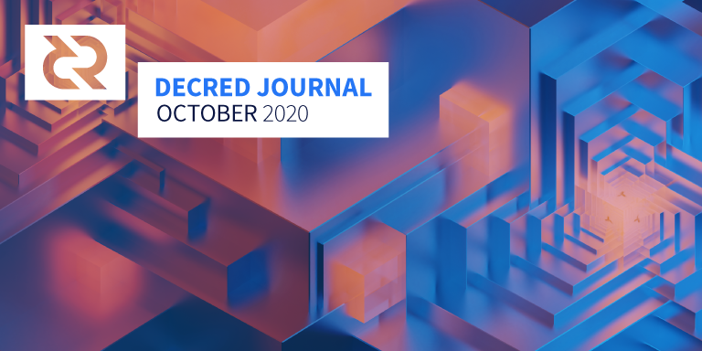

# Decred Journal – October 2020

_Image: Restructuring I by @saender_

Decred's highlights in October:

- v1.6.0 had its first two release candidates, following community testing fixes and improvements are being rolled into a third release candidate which is coming soon.
- The initial release of the dcrdex MVP on mainnet accompanied the first v1.6.0 release candidate. CLI users can now add dcrdex to the installation by adding an extra argument to the install command.
- The attention of many community members has now turned to making the most of the proper v1.6 release when it happens, check the Outreach section to see what they're planning.
- Politeia celebrated 2 years in production, congratulations to the people behind the 47 approved proposals and the stakeholders who voted for them.

## DCRDEX Initial Release

A little more than a year since the [RFP](https://proposals.decred.org/proposals/5431da8) and [development](https://proposals.decred.org/proposals/417607a) proposals have been approved on Politeia, Decred users can now trade between DCR and BTC without risking their funds and personal information with custodial exchanges.

First MVP [release](https://github.com/decred/dcrdex/releases/tag/release-v0.1.0) was followed by a quick [v0.1.1](https://github.com/decred/dcrdex/releases/tag/release-v0.1.1) patch release that is currently the latest.

Visit [dex.decred.org](https://dex.decred.org/) to get started, or follow the [guide](https://www.publish0x.com/block-commons/how-to-get-on-dcrdex-mvp-xolpzmv) by @richardred, or just see it in action in a [video](https://twitter.com/Decred_News/status/1320184172749721600). Latest price and order books can be viewed at dcrdata's [Market](https://explorer.dcrdata.org/market) dashboard, with more public data to follow.

> I want to thank ALL of our earlier testers for your feedback and patience as we get this thing moving. We have taken a lot of the feedback into account, and resolved a number of UI/UX issues, and fixed a couple of bugs that have popped up in match recovery scenarios. ([@chappjc](https://matrix.to/#/!mlRZqBtfWHrcmgdTWB:decred.org/$AQsNUyN7WWfYR6IhOgtGckBAecXP5ASXCYKFBpNWrcM))

Congratulations everyone with the release!

## v1.6 Release Candidates

Release candidates for dcrd, dcrwallet, Decrediton and dcrlnd are available for testing [here](https://github.com/decred/decred-binaries/releases). Please bear in mind that while key features are there and working in Decrediton, a number of UI improvements and bug fixes are forthcoming in a third release candidate.

As always, [verify the binaries](https://docs.decred.org/advanced/verifying-binaries/) before running them.

Version 1.6 will be one of the biggest releases Decred ever made. If you would like to help with outreach please check that [section](#outreach) below.

## Development

Unless otherwise noted, the work reported here has the "merged to master" status. It means that the work is completed, reviewed, and integrated into the source code that advanced users can build and run, but is not yet available in release binaries for regular users.

**[dcrd](https://github.com/decred/dcrd)**

v1.6 Release Candidate 1 and 2 have been made for public testing. You can read the RC2 release notes and get the source code [here](https://github.com/decred/dcrd/releases/tag/release-v1.6.0-rc2). Bug reports are welcome [here](https://github.com/decred/dcrd/issues).

Work included in v1.6 release:

- mining code changed to prioritize transactions with higher [aggregate fee](https://github.com/decred/dcrd/pull/1829) based on its ancestors in the mempool (aka Child Pays for Parent)
- ticket [exhaustion](https://github.com/decred/dcrd/pull/2398) check to prevent a theoretical scenario when the ticket pool goes too low and the chain can become unrecoverable if certain blocks are added
- optimized block template generation for [disapproved](https://github.com/decred/dcrd/pull/2397) blocks
- multiple tweaks and fixes for the new treasury code
- tool for generating certificates [rewritten](https://github.com/decred/dcrd/pull/2425) to support more use cases (like not including hostname and interface in the certificate or specify any of the 4 supported algorithms)
- improved chain generation [test harness](https://github.com/decred/dcrd/pull/2329)
- fixed database [migration](https://github.com/decred/dcrd/pull/2446) to support upgrading from v1.4
- for upgrading from even older clients where the database is too old to migrate, redownloading the chain from scratch was [automated](https://github.com/decred/dcrd/pull/2449) to not require any manual intervention from the user

Continued merged work past the v1.6 branching point:

- continued the saga to cover [rpcserver](https://github.com/decred/dcrd/issues/2069) with tests
- `mining` package reorganized for easier testing and navigation

**[dcrwallet](https://github.com/decred/dcrwallet)**

- allow wallet accounts to be individually [encrypted](https://github.com/decred/dcrwallet/pull/1823) and unlocked, each with its own passphrase
- commands to query and set [voting policy](https://github.com/decred/dcrwallet/pull/1897) for treasury spend transactions created by particular keys
- commands to set voting policy for [individual](https://github.com/decred/dcrwallet/pull/1905) tspend transactions
- require [TLS certificate](https://github.com/decred/dcrwallet/pull/1867) authentication for gRPC clients and allow it for JSON-RPC clients. This is a more secure way for programs to talk to dcrwallet. Other projects were updated to support this change (Decrediton, Politeia, dcrlnd, and others).
- allow gRPC clients to [lock/unlock](https://github.com/decred/dcrwallet/pull/1883) wallet once and then call methods without a [passphrase](https://github.com/decred/dcrwallet/pull/1880)
- better handling of [low](https://github.com/decred/dcrwallet/pull/1875) [balance](https://github.com/decred/dcrwallet/pull/1879) when purchasing tickets
- track [status](https://github.com/decred/dcrwallet/pull/1866) of vspd ticket fees to handle failures of vspd's fee processing
- multiple fixes for vspd staking
- fixes for new `getminingstate` and `getinitstate` messages

**[Decrediton](https://github.com/decred/decrediton)**

- LN [Watchtowers](https://github.com/decred/decrediton/pull/2638) support
- multiple UI/UX improvements for [LN views](https://github.com/decred/decrediton/pull/2641)
- initial auto [ticket buyer](https://github.com/decred/decrediton/pull/2577) for the new vspd
- manual ticket [purchasing](https://github.com/decred/decrediton/pull/2729) with the new vspd
- initial integration of ticket purchasing combined with [CSPP](https://github.com/decred/decrediton/pull/2773)
- [listing](https://github.com/decred/decrediton/pull/2747) of vspd tickets
- [migrated](https://github.com/decred/decrediton/pull/2705) from the deprecated [trezor.js](https://github.com/trezor/trezor.js) to Trezor [Connect API](https://github.com/trezor/connect)
- show SPV mode [icon](https://github.com/decred/decrediton/pull/2666) on the sidebar
- show [peer count](https://github.com/decred/decrediton/pull/2685) on the sidebar
- new tab for ticket [status](https://github.com/decred/decrediton/pull/2813)
- remember [last used](https://github.com/decred/decrediton/pull/2789) VSP
- highlight misplaced seed words on [seed entry](https://github.com/decred/decrediton/pull/2683) view
- updated [Portuguese](https://github.com/decred/decrediton/pull/2782) translation
- continued refactoring to functional components and CSS modules
- ~60 bug fixes

In progress:

- Trezor [staking](https://github.com/decred/decrediton/issues/2681) support. Since it might take a long time for the required [changes](https://github.com/trezor/trezor-firmware/pull/1249) in Trezor firmware to get merged upstream, Decred devs have [decided](https://github.com/decred/decrediton/issues/2681#issuecomment-714265711) to try our own custom firmware.
- automated UI [testing](https://github.com/decred/decrediton/pull/2659)

**[Politeia](https://github.com/decred/politeia)**

- inline Markdown [images](https://github.com/decred/politeiagui/pull/2158)
- bug fixes and UI tweaks for Politeia and CMS

In progress:

- automated [UI testing](https://github.com/decred/politeiagui/pull/2151)

Update on tlog backend migration:

> We have a testnet instance up and are still in the process of testing everything and fixing bugs. Inclusion proof routes and test coverage are also in the works. (@lukebp)

**[vspd](https://github.com/decred/vspd)**

- optimizations and bug fixes

**[dcrpool](https://github.com/decred/dcrpool)**

- support for [DCP-6](https://github.com/decred/dcrpool/pull/252) treasury upgrade
- [dust](https://github.com/decred/dcrpool/pull/254) payments to pool participants will be forfeited as pool fees. One reason for that is dust payments would fail the payout transaction anyway. Another is it serves as an incentive to contribute enough resources to the pool to get a normal payout when it mines a block and to discourage contributing intermittent, sporadic work.
- a lot of work was put in to support [Postgres](https://github.com/decred/dcrpool/issues/257) as a database backend
- show pending and archived [pool fee](https://github.com/decred/dcrpool/pull/249) payments on the admin page
- refactored [reward payment](https://github.com/decred/dcrpool/pull/250) code
- many improvements to test code

**[dcrlnd](https://github.com/decred/dcrlnd)**

- updated to [lnd v0.11.1](https://github.com/decred/dcrlnd/pull/103) code by porting hundreds of upstream commits. To feel the scale of the porting work you can check [this](https://github.com/decred/dcrlnd/blob/master/docs/upstream-prs.csv) list of upstream changes processed.
- updated to latest dcrd and dcrwallet

dcrlnd is preparing v0.3.0 to be released together with the big v1.6 release of core software (dcrd, dcrwallet, Decrediton). Release notes are [here](https://github.com/decred/dcrlnd/blob/master/docs/release-notes/release-notes-0.3.0.md).

**[dcrdex](https://github.com/decred/dcrdex)**

Most of the work merged in October was included in the initial [v0.1.0](https://github.com/decred/dcrdex/releases/tag/release-v0.1.0) and follow-up [v0.1.1](https://github.com/decred/dcrdex/releases/tag/release-v0.1.1) releases.

- implemented optional [SegWit](https://github.com/decred/dcrdex/pull/741) BTC swap contracts (saves ~30% in tx fees)
- added configurable target number of confirmations for [redeem](https://github.com/decred/dcrdex/pull/739) transactions (they do not have to be mined as quickly as swap tx so it is possible to save on fees)
- generation of new [deposit](https://github.com/decred/dcrdex/pull/769) addresses
- client [Tor support](https://github.com/decred/dcrdex/pull/738)
- stack [multiple](https://github.com/decred/dcrdex/pull/710) notifications and keep them visible for ~4 seconds + a bunch of other [notifications](https://github.com/decred/dcrdex/pull/744) UI improvements
- market [suspend/resume](https://github.com/decred/dcrdex/pull/705) functionality
- resolve [match status](https://github.com/decred/dcrdex/pull/704) on startup
- changes to violation tracking and penalization [system](https://github.com/decred/dcrdex/pull/700) _(trivia: did you know dcrdex has an `--anarchy` mode?)_
- implemented [limits](https://github.com/decred/dcrdex/pull/750) for the amount of orders a user may place
- verify that coins funding unfilled orders are [unspent](https://github.com/decred/dcrdex/pull/732)
- allow disconnected clients a [timeout](https://github.com/decred/dcrdex/pull/725) to reconnect before their orders get unbooked (revoked)
- data transfer [limits](https://github.com/decred/dcrdex/pull/754) for clients until they log in
- mainnet [instructions](https://github.com/decred/dcrdex/pull/764) in the README
- numerous bug fixes

A total of 48 PRs from 7 contributors were [merged](https://github.com/decred/dcrdex/pulls?q=is%3Apr+merged%3A2020-10-01..2020-10-31+sort%3Aupdated-asc), adding 11K and deleting 5K lines of code.

In progress:

- DCR [SPV wallet](https://github.com/decred/dcrdex/pull/788) support
- market [data API](https://github.com/decred/dcrdex/pull/796) endpoint for public consumption

**[dcrandroid](https://github.com/planetdecred/dcrandroid)**

- fixed bug where the [balance](https://github.com/planetdecred/dcrandroid/pull/516) was not updating

In progress:

- [CSPP](https://github.com/planetdecred/dcrandroid/pull/520) privacy support

**[dcrios](https://github.com/planetdecred/dcrios)**

- fixed bug with [precision](https://github.com/planetdecred/dcrios/pull/723) loss when switching currencies

**[godcr](https://github.com/planetdecred/godcr)**

- upgrade to latest dcrlibwallet and refactor

In progress:

- [new UI](https://github.com/planetdecred/godcr/pull/260) implementation

**[dcrdata](https://github.com/decred/dcrdata)**

- dex.decred.org data [added](https://github.com/decred/dcrdata/pull/1787) to [Markets](https://explorer.dcrdata.org/market) dashboard (order books and price initially, volume will be next)

**[dcrros](https://github.com/decred/dcrros)**

- support for new [treasury](https://github.com/decred/dcrros/pull/7) transactions if DCP-6 passes
- changed the format of [reversed](https://github.com/decred/dcrros/pull/8) tx ids to correctly express Decred's block disapproval in Rosetta's terms

**[docs](https://github.com/decred/dcrdocs)**

- updated to newer MkDocs [Material](https://github.com/decred/dcrdocs/pull/1131) theme for improved search UX
- [PoW Mining](https://docs.decred.org/mining/overview/) page [updated](https://github.com/decred/dcrdocs/pull/1134) with instructions and lists of relevant ASICs and pools

**[dcrdevdocs](https://github.com/decred/dcrdevdocs)**

- [added](https://github.com/decred/dcrdevdocs/pull/89) page about [Reproducible Builds](https://devdocs.decred.org/developer-guides/reproducible-builds/)

Other:

- @degeri posted a new [update](https://bounty.decred.org/2020/10/status-update/) on the Bug Bounty program
- dcrdevdocs are now on [IPFS and ZeroNet](https://www.reddit.com/r/decred/comments/j7cgzv/devdocs_on_ipfs_zeronet/), just in case

## People

Welcome to new first time contributors with code merged to master: @nitronick600 ([dcrdocs](https://github.com/decred/dcrdocs/pull/1134)) and @GuzmanPintos ([dcrdocs](https://github.com/decred/dcrdocs/pull/1134))!

See [Media](#media) for 4 new interviews with Decred community members.

Community stats as of Nov 1:

- Twitter followers: 40,818 (+28)
- Reddit subscribers: 9,937 (+8)
- Matrix #general users: 222 (+25)
- Discord users: 1,432 (+36)
- Telegram users: 2,394 (-40)
- YouTube subscribers: 4,210 (+0), views: 159K (+3K)
- LinkedIn followers: 924 (+33)
- GitHub dcrd stars: 566 (+3), forks: 246 (-2)

## Governance

In October the [Treasury](https://explorer.dcrdata.org/address/Dcur2mcGjmENx4DhNqDctW5wJCVyT3Qeqkx) received 12,388 DCR and spent 14,748 DCR. Using October's daily average rate of $12.01 per DCR, this is $149K received and $177K spent. At September's average daily rate of $13.26, the USD figure billed for past work is $196K. As of Nov 4, Treasury balance is 638,044 DCR (7.9 million USD at $12.38).

The candidate proposals for the [RFP proposal](https://proposals.decred.org/proposals/91becea) to change messaging on decred.org (approved in Sep) were voted on, but none of these were approved. Results were as follows:

- [D.R.E.A.M.](https://proposals.decred.org/proposals/4532397) - 48% approval, turnout of 29% (_The Decred Chad ignored the disapproval and continued anyway, because Chad_)
- ["Money Evolved"](https://proposals.decred.org/proposals/02d9fc2) tagline with minimal changes to the site - 25% approval, turnout of 25%
- Decred - Building Revolutionary [Infrastructure](https://proposals.decred.org/proposals/d6ff458) - 16% approval, turnout of 18%
- "Money Evolved" tagline - plus ["Fair"](https://proposals.decred.org/proposals/f0a00d5) box and page added to the site - 7% approval, turnout of 17%

A content and asset translation [proposal](https://proposals.decred.org/proposals/c093b8a) by @kozel was submitted in Oct and approved in early Nov with 75% approval and 28% turnout. This proposal will cover the translation of Decred publications and assets into 6-8 languages, with a maximum budget of $33,000 to cover 6 months of work. The proposal is staffed by people who have a [record](https://github.com/decredcommunity/translations/blob/master/index.md) of delivering translations of Decred content.

Politeia Digest [issue 37](https://blockcommons.red/politeia-digest/issue037/) and [issue 38](https://blockcommons.red/politeia-digest/issue038/) have more details on the month's proposals.

A pre-proposal from Paris Smithson for the WhyDecred.com site was [announced](https://twitter.com/ParisSmithson/status/1318278630208901126) on Twitter, discussed on [Reddit](https://www.reddit.com/r/decred/comments/jkmhbv/whydecredcom_proposal_open_talk/), and finally landed on [Politeia](https://proposals.decred.org/proposals/8a09324) in early Nov.

@richardred published a [report](https://blockcommons.red/publication/politeia-at-2/) of Politeia activity for its second year of operation. Some highlights:

- 46 proposals published, 21 approved, 17 rejected, 6 abandoned
- 3 proposals failed to reach quorum (didn't happen in year 1)
- average (mean) turnout was 27.9%, down 3.3% from year 1
- average (mean) approval for passed proposals was 79%, down from 86% in year 1
- there were more marketing proposals than in year 1
- 48% of proposals came from contractors (up from 35% in year 1), and these are still more likely to be approved
- 10 of the proposals in year 2 were requesting the renewal of funding, and these had an 80% success rate
- proposals with hourly pay were more likely to pass than fixed cost

## Network

Hashrate: October's [hashrate](https://explorer.dcrdata.org/charts?chart=hashrate&zoom=kfoi5rmw-kgziese8&scale=linear&bin=block&axis=time) opened at 450 Ph/s and closed 225 Ph/s, bottoming at 185 Ph/s and peaking at 551 Ph/s throughout the month. Pool hashrate [distribution](https://miningpoolstats.stream/decred) as of Nov 1: Poolin 37%, UUPool 37%, Antpool 13%, Huobipool 9%, F2Pool 1.2%, BTC.com 1%, easy2mine 0.9%, Luxor 0.6%, CoinMine 0.02%.

On Oct 25 the hashrate dropped to 260 and continued all the way down to 185 Ph/s on Oct 28. Quick recovery started on the first days of Nov.

Staking: [30-day average](https://dcrstats.com/) ticket price was 151.7 DCR (+3.1). The [price](https://explorer.dcrdata.org/charts?chart=ticket-price&zoom=kfoi5rmw-kgziese8&bin=window&axis=time&visibility=true-false&mode=stepped) varied between 139.2-168.3 DCR. [Locked amount](https://explorer.dcrdata.org/charts?chart=ticket-pool-value&zoom=kfoi5rmw-kgziese8&bin=block&axis=time) was 6.02-6.12 million DCR, which corresponded to 49.58-50.87% of the available supply [participating](https://explorer.dcrdata.org/charts?chart=stake-participation&zoom=kfoi5rmw-kgziese8&bin=block&axis=time) in PoS.

Ticket price hit 168.28 DCR, which is a new high since the change of the price algorithm in 2017.

Nodes: Throughout [October](https://charts.dcr.farm/d/000000014/nodes?orgId=1&from=1601510400000&to=1604188800000) there was an average of 104 public listening nodes and 150 total nodes per dcr.farm. Average version distribution for October: 30% dcrd v1.5.2, 23% dcrd v1.5.1, 8% dcrd v1.6 dev builds, 6% dcrd v1.5.0, 3% dcrd v1.5 dev and RC builds, 2.7% dcrd v1.7 dev builds, 0.7% dcrd v1.4, 12% dcrwallet v1.5.1, 1.4% dcrwallet v1.5, 0.8% dcrwallet v1.4, 12% others.

@PermabullNino contributed his recent on-chain findings (Mining Pulse, ticket flows, Treasury flows) to Our Network [issue 41](https://ournetwork.substack.com/p/our-network-issue-41).

## Integrations

[stakey.net](https://stakey.net/) is the first mainnet VSP running the new vspd software. It has [voted](https://stakey.net/vspd-stats/) 13 tickets and 40 are live as of Nov 11.

> Our first private ticket purchase using a VSP just verified on chain. It was purchased without an account, using funds mixed by CoinShuffle++ via the Tor onion service. Stick that in your pipe and smoke it, Surveillance Daddy! ([@stakeynet](https://twitter.com/stakeynet) on Twitter)

Warning: the authors of the Decred Journal have no idea about the trustworthiness of any of the services above. Please do your own research before trusting your personal information or assets to any entity.

## Outreach

@Checkmate is calling all Decred stakeholders to prepare for the release of the Hidden Hydra aka Decred v1.6. Discussions in Forward Thinking Fridays [Oct 16](https://www.reddit.com/r/decred/comments/jc6qjq/forward_thinking_friday_160_time_to_shine_16/) and [Oct 23](https://www.reddit.com/r/decred/comments/jgzs57/forward_thinking_friday_23_october_2020_the/), and one other call to [organize](https://www.reddit.com/r/decred/comments/ji9gm4/calling_all_stakeholders_prepare_to_release_the/) have collected dozens of ideas what can be done to get the word out about Decred v1.6 and DCRDEX. A cheat sheet with everything a Decred advocate might need is being assembled [here](https://github.com/decredcommunity/outreach/pull/12) (help is welcome).

Decred Latam published [4th report](https://github.com/decredcommunity/proposals/blob/master/proposals/3c02b67/updates/20201012.md) of their second proposal that lists all notable events, media presence, business development and finances. A notable strategy being explored is developer outreach and onboarding in Spanish:

- 4 episodes of Código Decred released since July: Introduction to [Git and GitHub](https://www.youtube.com/watch?v=RFX0P9MKLKg), Exploring Decred with [Python](https://www.youtube.com/watch?v=FGhklclRNt0), [Verifying](https://www.youtube.com/watch?v=U3BwnmmF1Ro) Decred binaries, and [DCR Wallet](https://www.youtube.com/watch?v=S2SeVZqnO9A)
- intro to blockchain and [dcrdata](https://www.youtube.com/watch?v=XSmdwWykmSo) workshop was held in October
- new [@decredES_devs](https://t.me/decredES_devs) Telegram channel has 70+ users as of writing

A long-running Blockchain Learning and Development [Challenge](https://www.talentland.talent-republic.tv/challenge/blockchain-learning-challenge-decred/) by Decred Latam was opened for registration in October and will run until December 9. In Phase 1 participants will attend workshops to learn about Bitcoin and blockchain, DAOs, governance, dcrdata API etc. In Phase 2 they will need to build an original project using Decred public blockchain data, release it with ISC license and present in a 3-minute video pitch. All comms, mentoring and support will take place in @decredES\_devs Telegram. 3 winners will get $1,500, $700 and $300 in DCR. 90+ people from 8+ Latam countries have registered so far.

@michae2xl published a [report](https://github.com/decredcommunity/proposals/blob/master/proposals/bc20f98/updates/20201102.md) of his October activities for the Brazil Marketing proposal.

@pavel announced that a new withDecred.org giveaway [campaign](https://www.reddit.com/r/decred/comments/jhb5do/withdecred_on_twitter_new_earned_giveaway_campaign/) is live. It uses a smart combination of QR codes and Twitter to maximize engagement and spreading of the message at the same time.

New website [WhyDecred.com](https://whydecred.com/) by Paris Smithson has a draft version up for [discussion](https://www.reddit.com/r/decred/comments/jkmhbv/whydecredcom_proposal_open_talk/) and feedback. This project takes the big picture approach by first explaining all the problems with _money_ we have today, and then explaining how Decred solves them. Quality artwork will be used to communicate. A formal [proposal](https://proposals.decred.org/proposals/8a09324) to fund the completion of the website is now being discussed.

A new project [winatoms.com](https://winatoms.com/) by @buck54321 is up for testing. Users can create and solve each other's [puzzles](https://winatoms.com/challenge/TckpZfv9RMCtTkPfFyfGjV7wjfeurpPoky7), winning DCR if the submitted solution is correct. Currently it only works with testnet DCR and project status is "prototype for discussion". Follow [@winatoms](https://twitter.com/winatoms) on Twitter for updates.

Monde PR's achievements for October:

- created/pitched 2 story ideas to finance and crypto publications including the DCRDEX announcement
- responded to 4 requests for comments
- secured 4 media interviews

News coverage secured by Monde PR:

- the DCRDEX announcement was covered by [Geek Insider](https://geekinsider.com/decred-announces-launch-of-dcrdex/), Fortune's [The Ledger](https://fortune.com/2020/10/21/digital-banks-feature-product-or-business/) newsletter, [Crowdfund Insider](https://www.crowdfundinsider.com/2020/10/168215-decred-a-security-and-scalability-focused-digital-currency-project-launches-dcrdex-a-non-custodial-exchange/), [Bankless Times](https://www.banklesstimes.com/2020/10/21/decred-launches-dcrdex/), [Crypto Comes](https://cryptocomes.com/news/decred-dcr-blockchain-veterans-break-into-defi-turf-dex-goes-live), [Day Crypto Trading](https://daycryptotrading.com/noticias/dcrdex-exchange-descentralizado-decred/), [Crypto Option](https://www.crypto-option.com/decred-announces-the-launch-of-its-first-decentralized-exchange-dcrdex/) and [Crypto Potato](https://cryptopotato.com/decred-announces-dcrdex-decentralized-exchange/), which was syndicated to 3 news outlets including [CoinMarketCap](https://coinmarketcap.com/headlines/news/decred-announces-dcrdex-decentralized-exchange/) and [Bitcoin Insider](https://www.bitcoininsider.org/article/96269/decred-announces-its-first-zero-fees-decentralized-exchange-dcrdex).
- the announcement was also distributed via [PRweb](http://www.prweb.com/releases/decred_announces_launch_of_dcrdex_first_exchange_with_no_trading_fees_seeks_to_disrupt_billion_dollar_crypto_exchange_market/prweb17487844.htm) which was picked up by 99 news outlets including [MarketWatch](https://www.marketwatch.com/press-release/decred-announces-launch-of-dcrdex---first-exchange-with-no-trading-fees-seeks-to-disrupt-billion-dollar-crypto-exchange-market-2020-10-21) and [Benzinga](https://www.benzinga.com/pressreleases/20/10/n17998254/decred-announces-launch-of-dcrdex-first-exchange-with-no-trading-fees-seeks-to-disrupt-billion-dol). The list of syndications can be viewed [here](https://drive.google.com/file/d/161nx5O9V8gDWIZ_z6rXyvySpv32OOR9g/view?usp=sharing).
- an article in [Cointelegraph](https://cointelegraph.com/news/defi-market-fall-showcases-how-rising-tvl-doesn-t-tell-the-full-story) featuring commentary by @richardred on the DeFi market, syndicated to 21 news outlets including [Cointelegraph China](https://cointelegraphcn.com/news/defi-market-fall-showcases-how-rising-tvl-doesn-t-tell-the-full-story) and [Cointelegraph Spain](https://es.cointelegraph.com/news/defi-market-fall-showcases-how-rising-tvl-doesn-t-tell-the-full-story)
- articles in [Cointelegraph Italy](https://it.cointelegraph.com/news/paypal-to-offer-crypto-payments-starting-in-2021) and [TrendOnline](https://www.trend-online.com/prp/paypal-bitcoin/) featuring commentary by @jy-p on PayPal offering cryptocurrency payments

## Events

Attended:

- Oct 2 - [Hablemos Decred 15](https://twitter.com/Decred_ES/status/1310685771884625920) - Internet. @elian talked with guest Jose Rodriguez from Bitso and Talent Land about the future of decentralized finance, non-fungible tokens, and investments of the future using blockchain tech. ([video](https://www.youtube.com/watch?v=wkT01O_mRZk))
- Oct 2 - [Decentralized Governance Panel](https://twitter.com/Decred_ES/status/1310961312105672705) - Internet. @elian represented Decred project in a panel with Crypto Resources Academy, Kleros, and Maker DAO. The discussion was about the relevance and future of decentralized governance and cryptocurrencies. ([video](https://twitter.com/Decred_ES/status/1312150389160988673))
- Oct 8 - [Criptolugares Instagram live](https://twitter.com/Decred_ES/status/1313869491160444929) - Internet. @elian talked with Jose Manuel da Silva from Criptolugares to explain the governance model of Decred, Politeia, and how to start contributing to the project. ([video](https://www.instagram.com/p/CGGZc5Gntil/))
- Oct 9 - [Hablemos Decred 16](https://twitter.com/Decred_ES/status/1313526622927171585) - Internet. @elian and guests Anibal Cripto (cryptofinances consultant) and Ezio Rojas (head of news at Cointelegraph en Español) about cryptocurrencies in Venezuela, challenges of adoption, and the future of money. ([video](https://www.youtube.com/watch?v=xxNFxZJuOwA))
- Oct 16 - [Hablemos Decred 17](https://es.cointelegraph.com/news/21-heads-crypto-art-show-they-will-analyze-the-intersection-between-art-and-cryptocurrencies) - Mexico City, Mexico. The event was the presentation of "21 Heads Crypto Art Show" at the Bitcoin Embassy. The panel was about the intersection of cryptocurrencies and art the potential role of non-fungible tokens. ([video](https://www.youtube.com/watch?v=b89-CTM0bYk))
- Oct 17 - [Introduction to Blockchain API for Decred (dcrdata)](https://www.eventbrite.com/e/open-source-workshop-introduccion-a-blockchain-api-de-decred-dcrdata-tickets-124107662359) - Internet. @pablito hosted a workshop on working with Decred blockchain data. ([video](https://www.youtube.com/watch?v=XSmdwWykmSo))
- Oct 21 - [CCOSS 2020](https://www.eventbrite.com.mx/e/cumbre-de-contribuidores-de-open-source-software-ccoss-2020-tickets-91491063233) - Internet. CCOSS was a 5-day event dedicated to open source. @adcade presented Decred in a talk "Open source contractor model in the cryptocurrency industry". ([video](https://www.youtube.com/watch?v=TuRAeBmnScQ))
- Oct 23 - [Hablemos Decred 18](https://es.cointelegraph.com/news/what-new-launches-are-planned-by-the-decred-ecosystem) - Internet. @adcade and @elian explored all the details about the project and what will be released this year. ([video](https://www.youtube.com/watch?v=rjfYxi6CXyI))
- Oct 29 - [Blockchain and Cryptocurrencies](https://www.eventbrite.es/e/entradas-blockchain-y-criptomonedas-america-latina-evento-online-124390452191) - Internet. @elian presented Decred features coming in v1.6. Organized by Territorio Bitcoin. ([video](https://www.youtube.com/watch?v=dx8D18jlr9s))
- Oct 29 - [Criptolugares Instagram live](https://twitter.com/criptolugares/status/1321810282264645632) - Internet. In this second live episode with Criptolugares @elian explored the latest updates from Decred. Also there was a giveaway of $100 in DCR among 10 participants. ([video](https://www.instagram.com/p/CG8ebPOnQg7/))
- Oct 30 - [Hablemos Decred 19](https://es.cointelegraph.com/news/new-edition-of-hablemos-decred-will-deal-with-cryptomontages-in-mexico) - Internet. Guest Manuel Flores (founder of the Bitcoin Monterrey community) shared his vision on the real use cases of Bitcoin and cryptocurrencies in Mexico and Latam, adoption and a future where cryptocurrencies are at the center of the global economy. ([video](https://www.youtube.com/watch?v=ok9TVEXF8mM))

Note that Spanish Decred events are often announced by [Cointelegraph in Spanish](https://es.cointelegraph.com/tags/decred).

Upcoming:

- Dec 11-12 - [Cripto Latin Fest Online 2020](https://twitter.com/Criptolatinfest/status/1321588347203162112).

## Media

[Decred Journal](https://www.publish0x.com/decredjournal), [Politeia Digest](https://www.publish0x.com/politeia-digest) and [Block Commons](https://www.publish0x.com/block-commons) are now on Publish0x.

Selected articles:

- Decred announces launch of DCRDEX - First exchange with no trading fees seeks to disrupt billion-dollar crypto exchange market by @l1ndseymm ([prweb.com](https://www.prweb.com/releases/decred_announces_launch_of_dcrdex_first_exchange_with_no_trading_fees_seeks_to_disrupt_billion_dollar_crypto_exchange_market/prweb17487844.htm))
- How I learned to stop worrying and love the Decred DEX by @bochinchero ([publish0x.com](https://www.publish0x.com/bochinchero/how-i-learned-to-stop-worrying-and-love-the-decred-dex-xpjglkw))
- How to get on DCRDEX MVP by @richardred ([publish0x.com](https://www.publish0x.com/block-commons/how-to-get-on-dcrdex-xolpzmv))
- Year two of Decred's Politeia in numbers and graphs by @richardred ([blockcommons.red](https://blockcommons.red/publication/politeia-at-2/))

Videos:

- DCRDEX is live - animation by @karamble ([youtube](https://www.youtube.com/watch?v=XwGJyRBjdtM))
- Decred DEX flow by [GhostWridah](https://twitter.com/GhostWridah) ([youtube](https://www.youtube.com/watch?v=hwIzAQqxyt8))
- Decred bi-weekly news update - October 19th, 2020 by @Exitus ([youtube](https://www.youtube.com/watch?v=ZC65h2sklIQ))
- Staked Podcast 0.0.4 talking about Politeia ([youtube](https://www.youtube.com/watch?v=tbL_auhbsE0))
- Why run a Decred full node? by Decred Society ([youtube](https://www.youtube.com/watch?v=JX-HWGJZjoE))
- Interview with Akin Sawyerr (Strategy and Africa Decred Lead) by Staked Podcast ([youtube](https://www.youtube.com/watch?v=dXnA_rZwCTo))
- Interview with Checkmate (ReadySetCrypto Analyst, Co-host of @RoughConsensus Podcast) by Staked Podcast ([youtube](https://www.youtube.com/watch?v=U6Rcmipfuzo))
- What is Decred? - DCR beginners guide by Ternio ([youtube](https://www.youtube.com/watch?v=h0jMlrDqxyQ))

Audio:

- Rough Consensus 11. In this episode the spidermen and Chris Dannen from Iterative Capital discuss open source, Bitcoin, Decred, bootstrapping cryptocurrencies and more. ([libsyn](https://roughconsensus.libsyn.com/episode-11-open-source-bitcoin-decred-with-chris-dannen))
- Decred in Depth 32: Pavel - Grassroots Marketing + Growing the Decred Community ([libsyn](https://decredindepth.libsyn.com/pavel-grassroots-marketing-growing-the-decred-community))

Art/Fun:

- The stars await with your [vote](https://twitter.com/coveryfire7777/status/1314866865781592064) by @Exitus
- Hidden [Hydra](https://twitter.com/real_rouse_/status/1321395402248200193) (Decred v1.6) by @rouse
- [Chad](https://www.reddit.com/r/decred/comments/jc6vck/chad_memes/) memes by @Checkmate
- Decred logo [word art](https://twitter.com/coveryfire7777/status/1321964399431720962) by @Exitus
- [The Big Long](https://twitter.com/ChadDegenerate/status/1321276927252967425): A Decred Story. Coming Soon™️ by @ChadDegenerate
- Clay Stakey: [Time to Chill](https://twitter.com/RichardRed0x/status/1315375919532515329) by @richardred (18+)

Translations:

- Meet the Disruptors: How Jake Yocom-Piatt of Decred aims to redefine governance, with blockchain technology - [in Spanish](https://medium.com/decred-es/conoce-a-los-disruptores-como-jake-yocom-piat-redefine-la-gobernanza-con-la-tecnolog%C3%ADa-blockchain-d959bb1ac296) by @francov\_
- How to get on DCRDEX MVP - [in Spanish](https://medium.com/decred-es/c%C3%B3mo-instalar-y-usar-dcrdex-93c59d96f176) by @pablito
- Blockchain governance - [Part 1](https://github.com/DecredES/traducciones/blob/master/Gobernanza-blockchain-parte-uno.md) and [Part 2](https://github.com/DecredES/traducciones/blob/master/Gobernanza-blockchain-parte-dos.md) in Spanish by @francov\_
- Decred Journal September 2020 was [translated](https://xaur.github.io/decred-news/) to Arabic (@arij, @abdulrahman4), Chinese (@Dominic), Spanish (@francov\_) and Vietnamese (@duyenemdo, welcome back!). Thank you everyone for spreading the word!

Other non-English content:

- "Decred Project, the journey of decentralized credits" was published in a popular Arabic crypto news site [satoshiat.com](https://www.satoshiat.com/2020/09/%D9%85%D8%B4%D8%B1%D9%88%D8%B9-%D8%B9%D9%85%D9%84%D8%A9-decred-%D8%A8%D8%B1%D9%85%D8%B2%D9%87%D8%A7-dcr/). The article is quite comprehensive and covers everything from the origin and history of Decred, importance of governance and hybrid consensus, to the latest developments like LN, privacy and DEX.
- @rramires wrote a detailed [guide](https://rramires.medium.com/instala%C3%A7%C3%A3o-e-configura%C3%A7%C3%A3o-da-dcrdex-no-windows-793d78994fde) and recorded a [video](https://www.youtube.com/watch?v=ZsDLbhc7iBY) in Portuguese on how to set up dcrdex on Windows.

## Community Discussions

Selected Reddit posts:

- Skepticism Sunday [Oct 4](https://www.reddit.com/r/decred/comments/j56uys/decred_skepticism_sunday_4_october_2020/) got 35 comments
- Forward Thinking Friday (FTF) [Oct 9](https://www.reddit.com/r/decred/comments/j8btv5/forward_thinking_friday_9_october_2020_airdrops/) imagining a second airdrop and using DCR as collateral

Selected Twitter discussions:

- @QuadraQ [explains](https://twitter.com/QuadraQ/status/1317335576048062464) how Decred fixes the weaknesses of Bitcoin in five simple steps
- Jared Tate notes that DEX is [game changing](https://twitter.com/jaredctate/status/1321293730125651972)
- Decred Journal got its first official tweet [thread](https://twitter.com/decredproject/status/1318250359740039169) summary to chase down anyone who avoids reading the full thing
- [shoutout](https://twitter.com/cburniske/status/1317234859899678720) to key features of the v1.6 by @cburniske/@Checkmate: "The full sovereign secure money stack"

## Markets

In October DCR was trading between USD 11.17-13.84 / BTC 0.00085-0.00124. The average daily rate was $12.01.

[dcrdex](https://dex.decred.org/) was reported to have traded a total of 4 BTC on [Oct 26](https://matrix.to/#/!mlRZqBtfWHrcmgdTWB:decred.org/$vfxOI7g-SkKc1nMIOid39Wm_Lk1OOSx-6TFxLOmkWAI) and 25 BTC on [Oct 28](https://matrix.to/#/!aNnAOHkWUdNcEXRGjJ:decred.org/$BUsJJwTfvakxhAxuvgxYefQBgaJCe3oIaf6iPyDtY30).

Bitcoin fees have [skyrocketed](https://jochen-hoenicke.de/queue/#0,1y) to values unseen for a long time at the end of Oct, which made dcrdex transactions more expensive. The mempool was cleared during the first week of November and fees went back to normal.

dcrdex order books can be viewed at dcrdata's [Market](https://explorer.dcrdata.org/market) dashboard. Volume data will follow.

## Relevant External

Mario Laul of Placeholder identified [ten theses](https://medium.com/@mariolaul/ten-theses-on-decentralized-network-governance-c1a24a9d59c7) on decentralized network governance. This high level decomposition of core principles driving the networks gives another way to look at Decred.

> good network governance aligns the interests of all stakeholders through a sufficiently flexible system of checks and balances. Imbalanced governance or inability to resolve conflicts between key stakeholders creates instability, which is particularly problematic for networks positioned to become systemically important administrative infrastructure with a very large user base.

IOHK has distributed $250K worth of ADA to Project Catalyst, which will fund projects proposed by the community. According to [Cointelegraph](https://cointelegraph.com/news/charles-hoskinson-s-treasury-concept-is-about-to-get-its-first-real-world-test-drive-with-project-catalyst), "Charles Hoskinson is a big proponent of decentralized treasuries, which he believes to be one of the greatest innovations of our time".

A paper on atomic swaps between Bitcoin and Monero was [published](https://eprint.iacr.org/2020/1126) in September and a corresponding [proposal](https://ccs.getmonero.org/proposals/h4sh3d-atomic-swap-implementation.html) was funded on Monero's Community Crowdfunding System, raising 2.7K XMR ($340K) in just 4 days. Another group [iterated](https://medium.com/comit-network/monero-bitcoin-atomic-swap-1cab015d7af9) further on the protocol to use 2-of-2 multisig scripts that are common in Bitcoin.

The OKEx cryptocurrency exchange, based in Malta, has [suspended](https://www.coindesk.com/okex-suspends-withdrawals) all cryptocurrency withdrawals because a key-holder is indisposed, because they are "currently cooperating with a public security bureau in investigations". The suspension was [still](https://bravenewcoin.com/insights/okex-withdrawal-suspension) in place a week later, despite a whale alert and social media furore about a large transfer to Binance, but this turned out to be [mislabelled](https://twitter.com/philip_gradwell/status/1317120228510359552).

US Department of Justice [released](https://www.justice.gov/opa/pr/attorney-general-william-p-barr-announces-publication-cryptocurrency-enforcement-framework) Cryptocurrency Enforcement Framework that provides an overview of the crypto space and its illicit uses, existing laws, and current challenges and strategies to address them. Similar to FinCEN [guidance](https://www.fincen.gov/sites/default/files/2019-05/FinCEN%20Guidance%20CVC%20FINAL%20508.pdf) from May 2019, the document is most relevant to custodial services.

Komodo [announced](https://komodoplatform.com/community-update-on-atomicdex-kyc-aml/) that they will be implementing KYC/AML procedures on the AtomicDEX liquidity network that is officially supported by the developers, even though the exchange is non-custodial. The announcement mentions another thing to worry about besides the recent regulatory action: "there is a buyback and token swap concerning security-like tokens that underpin AtomicDEX operations, including assets like DEX token, SuperNET assets, and any revenue-sharing token".

CFTC [charged](https://www.cftc.gov/PressRoom/PressReleases/8270-20) BitMEX owners for operating an unregistered trading platform and violating CFTC regulations, including failing to implement AML procedures.

FinCEN issued a $60M [fine](https://www.coindesk.com/fincen-fines-bitcoin-mixing-ceo-60m-in-landmark-crackdown-on-helix-coin-ninja) to the owner of a Bitcoin mixer who was arrested in February. The service was [custodial](https://cryptobriefing.com/bitcoin-coin-mixers-legal-crosshairs/).

Coinbase released its first transparency [report](https://blog.coinbase.com/transparency-at-coinbase-c8edf6dce4d6) with a breakdown of law enforcement requests received in the first half of 2020.

PayPal [announced](https://www.coindesk.com/paypal-new-york-conditional-bitlicense-paxos-cryptocurrency) that it will allow users to buy BTC, ETH, BCH, and LTC with its app. The initial version will not allow deposits, withdrawals, or sending crypto to other PayPal accounts. The company has a [history](https://en.wikipedia.org/wiki/PayPal) of arbitrarily frozen accounts and associated lawsuits.

Dustin Dreifuerst of [Did You Know Podcast](https://didyouknowcrypto.com/ep26/) warns of a [scenario](https://medium.com/@dustindreifuerst/the-coming-bitcoin-war-ff3e96db3aad) where an influx of institutional investment will lead to a conflict with principles crypto was founded on.

Tether [reversed](https://cryptobriefing.com/tether-can-freeze-destroy-your-usdt/) a $1 million transaction in September by a user who erroneously sent the funds to the smart contract for the DeFi platform Swerve.

The DeFi protocol harvest.finance was [hacked](https://cryptobriefing.com/hackers-drain-defi-protocol-harvest-finance-24-million/) for $24 million with a flash loan that manipulated the price of a stablecoin on Curve's Y pool.

Missed last month, Andre Cronje (of YFI) [deployed](https://twitter.com/AndreCronjeTech/status/1310763506170499072) contracts for a new "Eminence" gaming platform, within a few hours $15 million had been deposited, and it was then all taken by a hacker. The attacker then [returned](https://www.coindesk.com/eminence-exploit-defi-compensated) $8 million to a YFI smart contract controlled by Cronje, and this was distributed to victims of the hack.

Popular DeFi character Blue Kirby is not popular anymore, after a [rollercoaster](https://thedailygwei.substack.com/p/the-rise-and-fall-of-blue-kirby-the) 3 months in which they went from 0 to 20,000 followers on Twitter, got a job with Yearn earning $7K/month, sold 500 ETH worth of Kirby NFTs, and received 25 YFI from Andre Cronje himself. Things started going wrong for Kirby when they encouraged people to pile into the beta Eminence contracts which got hacked, got a little worse when they cashed in all their YFI and were called out, then there was an episode with some new "Off-Blue" tokens that Kirby was promoting which people found to be suspicious. Someone apparently threatened to doxx Blue Kirby, and they disappeared, deleting their accounts and leaving with an estimated $1 million.

Uniswap held the [first](https://app.uniswap.org/#/vote/1) and [second](https://app.uniswap.org/#/vote/2) votes of its new UNI-based governance system, both failing with 97-98% approval but only Yes votes from 3.75%-3.96%, while the minimum quorum to pass is Yes votes from 4% of the UNI tokens. The first proposal sought to lower the requirement for submitting a proposal, at present the proposer must have or be delegated at least 1% of all UNI, and for passing the quorum requirement (from 4% to 3%). The first two proposals were created by the same actors, including Dharma protocol and Gauntlet. The second proposal sought to extend the initial airdrop to Uniswap users who interacted with proxy contracts, with ~20% of the addresses to receive these tokens being Dharma users. This led some participants to [frame](https://gov.uniswap.org/t/urgent-discussion-on-current-vote-reduce-uni-governance-proposal-quorum-thresholds/7117) the proposals as a kind of takeover attempt.

GitHub has taken down the repository of the popular [youtube-dl](https://github.com/ytdl-org/youtube-dl/) project that allows to download video files from YouTube without dealing with its browser UI. This is a reminder of what may happen to all GitHub data not sored in Git repositories, which is especially relevant when design discussions and decisions are stored in issues and pull requests outside of Git.

Samsung is [integrating](https://cryptonews.com/news/samsung-adds-anti-money-laundering-features-to-it-crypto-wal-7911.htm) AML checks into their phones to make everyone safer.

UK Government published an international [statement](https://www.gov.uk/government/publications/international-statement-end-to-end-encryption-and-public-safety) on end-to-end encryption, co-signed by representatives from the US, Australia, New Zealand, Canada, India, and Japan ([mirrored](https://www.justice.gov/opa/pr/international-statement-end-end-encryption-and-public-safety) on the DoJ website). The statement calls for tech companies to inject backdoors, for public safety. Matrix team posted a [response](https://matrix.org/blog/2020/10/19/combating-abuse-in-matrix-without-backdoors/) explaining why compromising everyone's security and privacy to combat abuse by the minority of bad actors is fundamentally flawed and proposed alternative measures.

## Submit Your Stories!

If you want something mentioned please comment [here](https://github.com/xaur/decred-news/labels/next%20release). The story can be about development, research, outreach, merchants and services, new content and pretty much anything you normally see in DJ.

## About This Issue

This is issue 31 of Decred Journal. Index of all issues, mirrors, and translations is available [here](https://xaur.github.io/decred-news/).

Most information from third parties is relayed directly from source after a minimal sanity check. The authors of the Decred Journal have no ability to verify all claims. Please beware of scams and do your own research.

[Feedback](https://github.com/xaur/decred-news/blob/docs/contributing.md#feedback) and [contributions](https://github.com/xaur/decred-news/blob/docs/contributing.md) are always welcome.

Credits (alphabetical order):

- writing and editing: bee, degeri, elian, l1ndseymm, richardred
- reviews and feedback: arij, bochinchero, buck54321, davecgh, lukebp
- title image: saender
