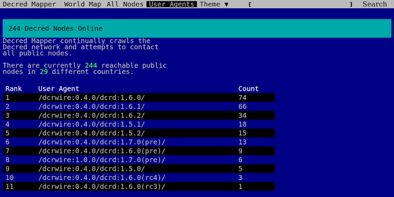
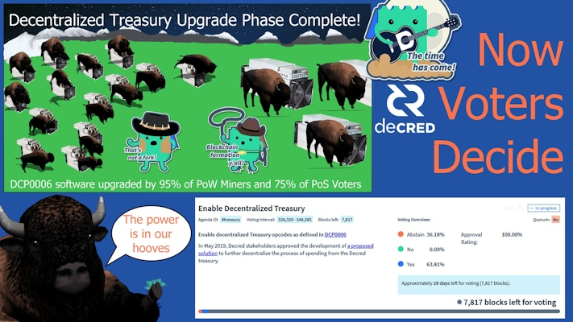

# Decred Journal – March 2021

_Image: Structural Phasing by @saender_

Highlights for March:

- The consensus vote to enable the new treasury system has been approved and should activate around May 7, at which point nodes running software older than v1.6 will be forked off the network.
- v1.6.2 was released in early Apr, it fixes a number of issues with mixing and VSP tickets, as well as improving the stability of SPV nodes, among other improvements.
- The epic migration of Politeia to a new more flexible and scalable storage back-end, which has been in progress for over a year, is finally complete!
- The Decred community have settled on a spirit animal for the project, the majestic Bison!

Contents:

- [Fork is Coming](#fork-is-coming)
- [Development](#development)
- [People](#people)
- [Governance](#governance)
- [Network](#network)
- [Integrations](#integrations)
- [Outreach](#outreach)
- [Events](#events)
- [Media](#media)
- [Community Discussions](#community-discussions)
- [Markets](#markets)
- [Relevant External](#relevant-external)

## Fork is Coming

The consensus vote to enable the new treasury system has [passed](https://explorer.dcrdata.org/agenda/treasury) and the new rules will activate around May 7. Nodes older than v1.6 will stop syncing, so please upgrade to stay on the network. You can track the days remaining [here](https://voting.decred.org/).

The latest release v1.6.2 has fixes for several bugs with VSP staking and mixing, as well as improved SPV operation. See the full release notes and downloads [here](https://github.com/decred/decred-binaries/releases/tag/v1.6.2), and don't forget to [verify](https://docs.decred.org/advanced/verifying-binaries/) them before installing.

## Development

The work reported below has the "merged to master" status unless noted otherwise. It means that the work is completed, reviewed, and integrated into the source code that advanced users can [build and run](https://medium.com/@artikozel/the-decred-node-back-to-the-source-part-one-27d4576e7e1c), but is not yet available in release binaries for regular users.

**[dcrd](https://github.com/decred/dcrd)**

Merged in master and the v1.6.2 release:

- only send [fast block](https://github.com/decred/dcrd/pull/2606) announcements to full node peers, and don't send them to lightweight clients that cannot properly handle them. This improves SPV connection stability and, as a result, SPV wallets should need fewer rescans.

Main addition of the month is the new package for handling [standard addresses](https://github.com/decred/dcrd/pull/2610) that is easier to follow and use than the code it replaces. It is also more generic, allowing new address types to be added in the future. If you have ever wondered how "scripts" and "addresses" are related, or how "standard" is different from "consensus", check the shiny new [README](https://github.com/decred/dcrd/tree/master/txscript/stdaddr) of the package or follow the examples and comprehensive tests to fully understand how it works. Thanks to all reviewers and welcome to the newcomers - it's always good to get a fresh pair of eyes!

The new address package, along with the other merged address-related changes are all part of laying some initial groundwork and infrastructure towards future consensus votes.

Other merged work:

- option to not print [timestamps](https://github.com/decred/dcrd/pull/2608) in logs
- more accurate detection of [own IP](https://github.com/decred/dcrd/pull/2571) address to fix some UPnP configurations
- increased test coverage for `rpcserver` and the new UTXO cache

**[dcrwallet](https://github.com/decred/dcrwallet)**

Merged in master and the v1.6.2 release:

- prevent [low-fee](https://github.com/decred/dcrwallet/pull/2011) submissions to the mixing server, which are now being rejected
- fixed [UTXO handling](https://github.com/decred/dcrwallet/pull/2013) to avoid confusing "insufficient balance" errors when the remaining balance is enough to buy one more ticket
- update [vote choices](https://github.com/decred/dcrwallet/pull/2016) for vspd tickets using the `setvotechoices` command, if the VSP is configured in dcrwallet settings
- new `accountunlocked` [command](https://github.com/decred/dcrwallet/pull/2020) reporting account encryption and locked status (needed for DCRDEX but is also useful in general)
- config flag to disable [logging](https://github.com/decred/dcrwallet/pull/2014) to files

**[Decrediton](https://github.com/decred/decrediton)**

Patch release v1.6.2 has fixed several bugs and updated the Decred-patched [trezor-connect](https://github.com/decred/decrediton/pull/3340) library.

Merged in master:

- use the new [slider](https://github.com/decred/decrediton/pull/3046) component from the pi-ui library
- reorganized [balances](https://github.com/decred/decrediton/pull/3319) overview
- List UTXOs view converted to a [modal](https://github.com/decred/decrediton/pull/3323)
- improved layout of [Trezor](https://github.com/decred/decrediton/pull/2956)-related modals
- project updated to latest [Electron 12](https://github.com/decred/decrediton/pull/3318) and [Webpack 5](https://github.com/decred/decrediton/pull/3322)
- ~25 pull requests concluded the 1-year quest to migrate the codebase to a modern React programming style with functional [components](https://github.com/decred/decrediton/issues/2438), hooks, and [CSS modules](https://github.com/decred/decrediton/issues/2439)
- increased UI test coverage
- ~11 bug fixes

A total of 53 PRs from 5 contributors were [merged](https://github.com/decred/decrediton/pulls?q=is%3Apr+merged%3A2021-03-01..2021-03-31+sort%3Aupdated-asc), changing 504 files, adding 14.5K and deleting 14.7K lines of code. Without too many user-tangible changes, these large numbers basically mean a lot of "behind-the-scenes" infrastructure upgrades to make future development easier.

In progress: [DCRDEX](https://github.com/decred/decrediton/pull/3356) integration and design updates.

**[Politeia](https://github.com/decred/politeia)**

An epic migration to a more scalable and [flexible](https://twitter.com/lukebp_/status/1376238020563767303) storage backend is [merged](https://github.com/decred/politeia/pull/1180) after almost 1 year of development. On a high level it brings us the following:

- scalability - it is no longer constrained to the file system of a single instance
- timestamps and data are separated, allowing to truly censor (and delete) data without awkward trade-offs. Mind that censoring only removes data but not the record proving that the server has seen it, i.e. the "audit trail" is immutable.
- ability to retrieve a cryptographic timestamped proof for any piece of data, e.g. a single comment. There was no easy way to do this in the Git backend.
- a proper plugin architecture where plugins can extend generic timestamped "records" with additional functionality, such as comments or ticket voting. Plugins can be turned on and off in a config file without writing code.
- simplified `politeiad` API
- `politeiawww` API rewritten to be generic and application agnostic while plugins handle specialized routes
- check the [pull request](https://github.com/decred/politeia/pull/1180) for more details

[Backend](https://github.com/decred/politeia/pull/1180) and [frontend](https://github.com/decred/politeiagui/pull/2306) changes rewrote much of the Politeia codebase as can be seen from the stats: 51K lines added, 42K deleted, and 474 files changed.

For developers, the [v0.2.0](https://github.com/decred/politeia/releases/tag/v0.2.0) tag marks the last commit that supports the politeiad Git backend, the politeiad v1 API, and much of the politeiawww `www/v1` and `www/v2` APIs.

Everybody is welcome to join the testing party for the new version at [test-proposals2.decred.org](https://test-proposals2.decred.org/).

Other changes:

- trickling mode of the politeiavoter command-line tool was made truly [random](https://github.com/decred/politeia/pull/1368) instead of using random bucketized durations

> Short term we'll be focusing on feature development that took a backseat during these architecture upgrades. Things like proposal updates from the author, launching a Reddit like forum for the community that runs on Politeia, adding informal stakeholder polls, etc.
> 
> Long term, the idea is that Politeia becomes a configurable, timestamped data store that can serve as the foundation for all kinds of use cases. ([@lukebp](https://twitter.com/lukebp_/status/1376259489704337408))

**[dcrpool](https://github.com/decred/dcrpool)**

Release candidate 2 for the upcoming v1.2.0 is [out](https://twitter.com/dnldd/status/1376476239062564868) for testing. See the [release notes](https://github.com/decred/dcrpool/releases/tag/v1.2.0-rc2) for a full list of bug fixes, improvements and a couple of breaking changes.

Merged in master:

- fixed saving of [archived](https://github.com/decred/dcrpool/pull/309) payments
- disable account [lookup](https://github.com/decred/dcrpool/pull/310) UI in solo pools where it is not available
- `--homedir` config flag renamed to `--appdata` to be consistent with other software

**[dcrlnd](https://github.com/decred/dcrlnd)**

@matheusd discovered an interesting hack that allows one to implement PTLCs with very little changes to existing LN code built for HTLCs.

PTLCs (Point-Time-Locked-Contracts) is an exciting development in Lightning Network for its potential to address the [limitations](https://suredbits.com/payment-points-monotone-access-structures/) of HTLCs (Hashed Time-Locked Contracts) used currently, and for the new use cases made possible.

The hack to enable PTLCs was in fact so simple _for @matheusd_ that he was also able to code up an interesting construct called Multi-Redeemer Transaction Tree (MRTTREE) with it, and an offline LN donation/payment prototype on top of that. The system is made of a patched [dcrlnd](https://github.com/decred/dcrlnd/compare/v0.3.1...matheusd:ptlc-poc), a PoC [server](https://github.com/matheusd/mrttree) to coordinate MRTTREEs, and a patched [Decrediton](https://github.com/matheusd/decrediton/commits/mrttree_poc). The math is explained in an [email](https://lists.linuxfoundation.org/pipermail/lightning-dev/2021-March/002983.html) to the lightning-dev mailing list and a presentation [video](https://www.youtube.com/watch?v=m1sQGHUKU7I) (offline LN payments demo starts around [15 min](https://www.youtube.com/watch?v=m1sQGHUKU7I&t=915s) mark).

The hack is experimental and needs some serious cryptographic investigation to make sure it is safe. Nevertheless, this work is interesting in the context of LN-powered [multi-owner tickets](https://blog.decred.org/2019/11/11/LN-Multi-Owner-Tickets/) (a better form of ticket splitting), as well as other use cases enabled by MRTTREEs like off-chain donations and crowdfunding. Unlike the HTLC-based construction of MRTTREEs mentioned in the original [blog](https://blog.decred.org/2019/11/11/LN-Multi-Owner-Tickets/) post, the one based on PTLCs does not need a new opcode: the existing Schnorr checksig opcode (or any new ones eventually added) are sufficient to enable it.

You can learn more about Decred's LN in the recent Decred in Depth with @matheusd, starting at [28 min](https://www.youtube.com/watch?v=O6oIrRsZnMQ&t=27m54s) mark.

**[cspp](https://github.com/decred/cspp)**

- minimum [peer count](https://github.com/decred/cspp/pull/64) made configurable for servers that want to increase it to provide higher quality mixes
- support [LOGFLAGS](https://github.com/decred/cspp/pull/66) for more flexible logging

**[DCRDEX](https://github.com/decred/dcrdex)**

- ability to reset and change the [password](https://github.com/decred/dcrdex/pull/978)
- ability to [disable](https://github.com/decred/dcrdex/pull/985) account
- allow [sorting](https://github.com/decred/dcrdex/pull/955) Your Orders table
- indicate [disconnected](https://github.com/decred/dcrdex/pull/989) state
- support account-based [encryption](https://github.com/decred/dcrdex/pull/1023) and locking for DCR wallets (this will be used by Decrediton to only lock the trading account but not others)
- allow multiple authenticated [sessions](https://github.com/decred/dcrdex/pull/1012) (to login in different browsers at the same time)
- send most recent [fee rate](https://github.com/decred/dcrdex/pull/1000) estimate to the client to support SPV clients, improve order estimates and tighten up security
- send raw [transaction](https://github.com/decred/dcrdex/pull/804) data to accommodate SPV clients who don't have a mempool and are in the dark until a contract's tx is mined (this also makes the process more robust against poor propagation of tx on the network)
- Ethereum simnet [harness](https://github.com/decred/dcrdex/pull/956) for testing during development
- foundations for [Bitcoin Cash](https://github.com/decred/dcrdex/pull/944) support
- added database [versioning](https://github.com/decred/dcrdex/pull/959) and generated historical trading data (volumes, highs and lows, etc)
- updated to use [Webpack 5](https://github.com/decred/dcrdex/pull/990) and other newer modules
- [dex.decred.org](https://dex.decred.org/) updated with cool new visuals by @30000fps

A total of 25 PRs from 6 contributors were [merged](https://github.com/decred/dcrdex/pulls?q=is%3Apr+merged%3A2021-03-01..2021-03-31+sort%3Aupdated-asc), adding 22K and deleting 9K lines of code.

In progress: Ethereum support, a new [registration](https://github.com/decred/dcrdex/pull/1017) protocol (more robust + supports fee payments in arbitrary assets), demo [Electron](https://github.com/decred/dcrdex/pull/999) integration, and multiple other improvements.

Feedback from Ethereum experts on the [swap contracts](https://github.com/decred/dcrdex/issues/1001) used is greatly appreciated.

See the [v0.2](https://github.com/decred/dcrdex/milestone/6) and [v0.3](https://github.com/decred/dcrdex/milestone/12) milestones to track progress of next releases.

**[dcrios](https://github.com/planetdecred/dcrios)**

In progress:

- showing Politeia [proposals](https://github.com/planetdecred/dcrios/pull/715)
- [mixing](https://github.com/planetdecred/dcrios/pull/727) implementation
- update dcrlibwallet to latest Decred modules and fix sync issues

**[godcr](https://github.com/planetdecred/godcr)**

- new UI for the [Send](https://github.com/planetdecred/godcr/pull/320) page
- updated UI for [Overview](https://github.com/planetdecred/godcr/pull/338) and [Account](https://github.com/planetdecred/godcr/pull/348) pages
- added [About](https://github.com/planetdecred/godcr/pull/352) page
- added staking and other info to account [details](https://github.com/planetdecred/godcr/pull/337) page
- tweaked text [inputs](https://github.com/planetdecred/godcr/pull/341)
- [debug](https://github.com/planetdecred/godcr/pull/346) page with logs
- start [sync](https://github.com/planetdecred/godcr/pull/343) on app startup after passphrase is entered
- request [passphrase](https://github.com/planetdecred/godcr/pull/324) when syncing a restored wallet in order to allow address generation
- code cleanup and bug fixes

In progress: Politeia [proposals](https://github.com/planetdecred/godcr/pull/331) page and furher UI work.

**[dcrdata](https://github.com/decred/dcrdata)**

- [limit](https://github.com/decred/dcrdata/pull/1808) the amount of addresses allowed in POST requests

**[dcrdevdocs](https://github.com/decred/dcrdevdocs)**

- [Script Extensions](https://devdocs.decred.org/developer-guides/script-extensions/) page moved from dcrdocs

**[decred.org](https://github.com/decred/dcrweb)**

- list [vspd](https://github.com/decred/dcrweb/pull/965) instances on the [VSP](https://decred.org/vsp/) page
- updated [Exchanges](https://decred.org/exchanges/) page

**[Decred Address Scanner](https://github.com/decred/dcraddrscanner)**

- code repository moved to [decred](https://github.com/decred/dcraddrscanner) org
- license changed to ISC to meet F-Droid requirements

In addition to [Google Play](https://play.google.com/store/apps/details?id=com.joegruff.decredaddressscanner) and direct [APK](https://github.com/decred/dcraddrscanner/releases/tag/v1.08) download, the app is now also available on [F-Droid](https://f-droid.org/en/packages/com.decred.decredaddressscanner/)!

**[Decred Mapper](https://github.com/jholdstock/dcrmapper)**

@jholdstock has released a website with a [world map](https://nodes.jholdstock.uk/) of nodes and counts of each [user agents](https://nodes.jholdstock.uk/user_agents). Source code is available [here](https://github.com/jholdstock/dcrmapper). Testnet version of the site is [here](https://testnet-nodes.jholdstock.uk/). Unix greybeards will enjoy the [386 theme](https://nodes.jholdstock.uk/?theme=386).

**[Ticket Splitting](https://docs.decred.org/proof-of-stake/ticket-splitting/)**

@bee has compiled a comprehensive [document](https://github.com/decredcommunity/wiki/blob/master/wiki/ticket-splitting-v1.6.md) with all recent knowledge about ticket splitting and v1.6 software. Key takeaways:

- existing ticket splitting solution will work with v1.5.2 software until around May 7, 2021 when it will stop syncing
- everybody agrees ticket splitting is good to have, but there are currently no spare resources to allocate for it, given the low demand (81 split tickets per month is roughly 0.2% of all tickets)
- the lowest hanging fruit is to patch the [client](https://github.com/matheusd/dcr-split-ticket-matcher) to support the new authentication in dcrwallet v1.6
- this is a good opportunity for new developers to get familiar with Decred while making Decred staking more affordable

Other:

- [decredpower.com](https://decredpower.com/) received a ton of new links and design tweaks
- Bug Bounty program [reported](https://bounty.decred.org/2021/03/status-update/) that it has processed a total of 157 submissions and 15 were eligible for a payout. Congrats to [@proabiral](https://twitter.com/proabiral) who has been listed in the [Hall of Fame](https://bounty.decred.org/)!

_Image: Decred Mapper's futuristic design_

## People

Welcome to new first time contributors with code merged to master: @tuhalang ([godcr](https://github.com/planetdecred/godcr/commits?author=tuhalang))!

Community stats as of Apr 2:

- [Twitter](https://twitter.com/decredproject) followers: 43,628 (+706)
- [Reddit](https://www.reddit.com/r/decred/) subscribers: 10,797 (+238)
- [Matrix](https://chat.decred.org/) #general users: 407 (+25)
- [Discord](https://discord.gg/GJ2GXfz) users: 1,409 (-35)
- [Telegram](https://t.me/Decred) users: 2,594 (+76)
- [YouTube](https://www.youtube.com/decredchannel) subscribers: 4,460 (+40), views: 179K (+4K)
- GitHub [dcrd](https://github.com/decred/dcrd) stars: 589 (+5), forks: 255 (+3)

Notable activity detected across ~90 [tracked](https://github.com/decredcommunity/social-media-stats) accounts:

- main Twitter, Reddit and Telegram had another month of good growth
- [CoinGecko](https://www.coingecko.com/en/coins/decred) got +409 likes (to 9,516) since mid-March when we started tracking it
- [@decredproject](https://gab.com/decredproject) account on Gab is 11 months old but is still at 7 followers. Any outreach is welcome to help it grow.
- [@Checkmate](https://twitter.com/_Checkmatey_) aka "The Machine" gained +1,816 followers (+35%, to 7,042), posting _another_ 1K tweets at ~34 tweets per day
- [@PermabullNino](https://twitter.com/PermabullNino) gained +398 followers (+13%, to 3,391)
- [@ConsensusRough](https://twitter.com/ConsensusRough) got a surprising +34% followers (to 580)
- [@decredbr](https://t.me/decredbr) TG got +6% users (to 384)
- [@Decred_ES](https://twitter.com/Decred_ES) TW got +5% followers (to 1,365)
- [DECRED BRasil](https://www.facebook.com/groups/decredbrasil/) FB had a noticeable drop in 30-day posts from ~50 to 19

The above are most notable highlights, but you can see full reports for [March](https://decredcommunity.github.io/social-media-stats/posts/20210407.1) and [February](https://decredcommunity.github.io/social-media-stats/posts/20210306.1) in a new dedicated place _(that can finally fit \*all\* my numbers -- @bee)_.

Thanks to Decred ambassadors on all platforms for raising awareness about the project!

## Governance

In March the [Treasury](https://explorer.dcrdata.org/address/Dcur2mcGjmENx4DhNqDctW5wJCVyT3Qeqkx) received 11,531 DCR and spent 4,196 DCR - however 3,010 of this was delayed payment for Jan invoices, so the amount paid for Feb invoices was just 1,184 DCR. Using March's daily average DCR/USD rate of $161.01, this is $1.86M received and $676K spent. The USD figures billed for past work are $135K for Feb (at $113.76) and $163K delayed payments for Jan (at $54.25). As of Apr 4, Treasury balance is 663,658 DCR (124 million USD at $187.04).

Three proposals were published in March.

- The Moderation 2021 [proposal](https://proposals.decred.org/proposals/e1cda44) estimated a budget of $8,800 (maximum $16,500) for the year, and was approved with 93.4% support and turnout of 36%.
- The Design [proposal](https://proposals.decred.org/proposals/76eba5a) to cover the remainder of 2021 requests a maximum of $58,850, and reported underspending on the previous proposal such that only 60% of its budget was used. Most of the underspend is associated with the identity and visual communication subdomains. Worklog report for the previous proposal was posted [here](https://github.com/decred/dcrdesign/issues/252).
- The video content [proposal](https://proposals.decred.org/proposals/95a1409) (phase 3) is up for renewal with a maximum budget of $18,800 for another 6 months, and 2 new contributors (@karamble and @DecredSociety). During the previous phase only 41% of the budget was used.

@bee published a list of all [active approved](https://decredcommunity.github.io/proposals/approved) proposals to track the ones expiring soon.

Politeia Digest [issue 41](https://blockcommons.red/politeia-digest/issue041/) has more details on the month's proposals.

## Network

**Hashrate**: March's [hashrate](https://explorer.dcrdata.org/charts?chart=hashrate&zoom=kln9bt1o-kn255ihw&scale=linear&bin=block&axis=time) opened at ~410 Ph/s and closed ~496 Ph/s, bottoming at 228 Ph/s and peaking at 620 Ph/s throughout the month.

Distribution of hashrate [reported](https://miningpoolstats.stream/decred) by the pools on Apr 1: Antpool 37%, Poolin 29%, F2Pool 10%, Easy2Mine 8%, Luxor 1.3%, BTC.com 1.3%, Coinmine 0.04%, UUPool 0.04%, unknown 13%.

Distribution of 1,000 blocks actually [mined](https://miningpoolstats.stream/decred) before Apr 1: Poolin 30%, Antpool 27%, F2Pool 8%, Easy2Mine 4%, Luxor 2%, BTC.com 1.6%, Coinmine 0.1%, unknown 27%.

Hashrate of the previously top UUPool appears to have migrated to Antpool and F2Pool.

**Staking**: [Ticket price](https://explorer.dcrdata.org/charts?chart=ticket-price&zoom=kln9bt1o-kn255ihw&axis=time&visibility=true-true&mode=stepped) varied between 154.3-221.5 DCR, with 30-day [average](https://dcrstats.com/) at 178.0 DCR (-3.7). In the first 3 months of 2021 the ticket price had the highest oscillation since the price algorithm change in 2017, swinging between ~150 and ~220.

The [locked amount](https://explorer.dcrdata.org/charts?chart=ticket-pool-value&zoom=kln9bt1o-kn255ihw&scale=linear&bin=block&axis=time) was 7.10-7.46 million DCR, meaning that 56.0-58.7% of the circulating supply [participated](https://explorer.dcrdata.org/charts?chart=stake-participation&zoom=kln9bt1o-kn255ihw&scale=linear&bin=block&axis=time) in proof-of-stake - again new all-time highs.

**VSP**: On Apr 1, 6.6K live tickets were held by vspd servers and 4.0K by the legacy dcrstakepool servers. Compared to Mar 1, more than 2.2K tickets have migrated to the new vspd system. Legacy VSPs have reported 11K active and 22K total users. All VSPs together (17 old, 11 new) held 26% of the ticket pool.

**Nodes**: Throughout March there were around 215 reachable nodes according to [dcrextdata](https://dcrextdata.planetdecred.org/nodes).

Node versions as of Apr 1 [snapshot](https://nodes.jholdstock.uk/user_agents) (247 total, dcrd only): v1.6.1 - 32%, v1.6.0 - 32%, v1.5.1 - 10%, v1.5.2 - 8%, v1.7 dev builds - 8%, v1.6 dev builds - 6%, v1.5.0 - 2.4%, v1.6.2 - 1.2%.

The share of [mixed coins](https://explorer.dcrdata.org/charts?chart=coin-supply&zoom=kln9bt1o-kn255ihw&bin=day&axis=time&visibility=true-true-true) has gradually increased from 39% to 44%. Daily [mixed amount](https://explorer.dcrdata.org/charts?chart=privacy-participation&zoom=jzk95g03-kncehhc0&bin=day&axis=time) varied between 200-350K DCR.

Decred's [Lightning Network](https://ln-map.jholdstock.uk/) has seen 34 nodes (+4), 60 channels (+4) with a total capacity of 20 DCR (+3.2), as of Apr 1.

@Checkmate shared charts showing increased [transaction](https://twitter.com/_Checkmatey_/status/1372684156908437508) volumes (2021 volume looks even more dramatic when [adjusted](https://twitter.com/_Checkmatey_/status/1369787880776691712) for circulating supply) and how the share of [fees](https://twitter.com/_Checkmatey_/status/1375608621417996288) in the total block reward went from 0.01% to 0.12% since October 2020.

@matheusd [shared](https://www.reddit.com/r/decred/comments/m547to/not_focusing_on_split_tickets_will_affect_us/gr0in3e/) charts of split ticket purchases [by month](https://github.com/decredcommunity/wiki/blob/files/files/20210315.1.png) (80 on average, topped at 127 on March 2020) and by the number of [participants](https://github.com/decredcommunity/wiki/blob/files/files/20210315.2.png) (4 is most common).

## Integrations

[decred.raqamiya.net](https://decred.raqamiya.net/) VSP announced that it will be shutting down. As of Apr 5 it [had](https://decred.raqamiya.net/stats) 128 active users and 284 total users, 52 live tickets, and over 20K tickets voted since 2017. The VSP featured a custom UI, email notifications on voted tickets, and 4 voting servers in 3 continents. The [home page](https://decred.raqamiya.net/) asks to not buy any new tickets, but live tickets will be supported until all of them are called. Thank you for your service!

[CexZ](https://www.cexz.ca/) exchange [announced](https://twitter.com/_cexz_/status/1366501324536299523) the listing of a DCR/BTC pair and came to [visit](https://www.reddit.com/r/decred/comments/lvl8i0/decred_dcr_added_to_the_btc_market/) r/decred.

Warning: the authors of the Decred Journal have no idea about the trustworthiness of any of the services above. Please do your own research before trusting your personal information or assets to any entity.

## Outreach

A new bison [theme](https://twitter.com/BisonContent/status/1370827335973416960) has exploded in March, culminating in DCR Bison species getting its own Twitter account specializing in [@BisonContent](https://twitter.com/BisonContent). Most bison research took place in [#trading](https://chat.decred.org/#/room/#trading:decred.org) (almost 400 mentions). First [mentions](https://matrix.to/#/!hxDOGQVaUlvoqMMcOB:decred.org/$CWpMA7avAE_gWjVVwGglZPIAxxEO-QJ1WwqfT4JfIrw) date back to 2019 chats about Bison Trails, a New York City blockchain infrastructure company (that happens to offer [Decred services](https://bisontrails.co/decred/) now!). But the hype really took off when a stronger link with Decred was found by @Void and @karamble in a 2015 [paper](https://www.researchgate.net/publication/281933407_Collective_decision_making_during_group_movements_in_European_bison_Bison_bonasus) titled "Collective decision making during group movements in European bison, Bison bonasus".

> Group coordination and the synchronization of activities are essential to maintain group cohesion during collective movements. Collective decisions arising from this synchronization are influenced by both ecological and sociodemographic factors. (...) The initiator was more likely to be followed if it went in the direction indicated by the majority of individuals, suggesting a _voting process_.

[@DCRann](https://t.me/DCRann) Telegram channel was created to mirror important announcements and reduce dependency on Twitter.

@pavel has shared more [insights](https://github.com/decredcommunity/proposals/blob/master/proposals/2bf72e/updates/20210313.md) from running the [withDecred.org](https://proposals.decred.org/proposals/2bf72e6) proposal. In total 11.6 DCR was distributed in 5 rounds. People were quite engaged on Twitter even without being rewarded. Getting people to visit the [website](https://withdecred.org/) was a challenge though, even with sponsored tweets. It is most common for Twitter users to quickly consume and like/retweet if they like the content. With that in mind, site content was boiled down to a giant [tweet-storm](https://twitter.com/withdecred/status/1325147231935098880) pinned on the Twitter profile.

Reports from outreach experiments like the one above are appreciated as they help the community to learn what works and what doesn't, and get better at spreading our message.

Monde PR's achievements for March:

- created & pitched 2 stories to finance and crypto publications
- responded to 1 request for comment
- secured 1 media interview

News coverage secured by Monde PR:

- @jy-p appeared on the [Finance Magnates](https://www.financemagnates.com/cryptocurrency/interview/decreds-jake-yocom-piatt-on-bitcoin-blockchain-governance-dcr-more/) podcast talking about Bitcoin, blockchain governance, and DCR, syndicated to 4 news outlets including [Tech Centry](https://techfans.co.uk/decreds-jake-yocom-piatt-on-bitcoin-blockchain-governance-dcr-more/)

A reminder for everyone, if you have an awesome tweet or content to share, don't hesitate to drop it in the [#media](https://chat.decred.org/#/room/#media:decred.org) chat and ask for a retweet via @decredproject.

_Image: Bison PoWer_

## Events

Attended:

- Mar 12-14 - [Hackathon Nayarit 2021](https://decredcommunity.github.io/events/index/20210312.1) - Internet. Decred in Spanish sponsored the hackathon organized by the Ministry of Education of Nayarit. To prepare participants, the Spanish team hosted Blockchain Education training week, consisting of 5 webinars. Hackathon prize pool of $1,000 was divided as follows: $500 for first place, $300 second place and $200 divided among the rest of the 20 participants that presented final projects. After the hackathon a learning session was made for the winners to learn how to use Decrediton, mobile wallets and a general info on how to store and use crypto. It lasted for 3 hours and winners had a chance to ask questions while receiving their prizes. More details [here](https://decredcommunity.github.io/events/index/20210312.1).
- Mar 15 - [State of crypto adoption in Morocco](https://decredcommunity.github.io/events/index/20210315.1) - Internet. @arij was invited to an interview with Tony Obiajuru from on \#InsideBlockchain at CryptoTvplus where she told about the state of crypto adoption in Morocco, and about Decred and her work with the project.

## Media

Selected articles:

- @arij of "cryptocurrency firm Decred" gave commentary to [CoinDesk](https://www.coindesk.com/crypto-is-banned-in-morocco-but-bitcoin-purchases-are-soaring) on the state of crypto adoption in Morocco. The article was translated to 4+ languages and went a bit viral in Moroccan electronic news. Governor of the central bank of Morocco [commented](https://www.youtube.com/watch?v=yWLNOlKbhtc) on the article, saying that they've put together a committee for studying crypto and central bank digital currencies to keep up with the innovation, that Bitcoin is not money because it's speculative and unregulated, but in the end people cannot be stopped from using it. As a follow-up the bank has launched a [video](https://www.youtube.com/watch?v=38N24GrUTxY) discouraging from using Bitcoin because it's too risky.
- Decred's v1.6.1 release and "User Activated Hard Fork" to decentralize the treasury have been mentioned in f2pool's bi-weekly PoW Round-Up [Mar-09](https://f2pool.io/mining/pow-round-up/20210309-pow-round-up/) and [Mar-23](https://f2pool.io/mining/pow-round-up/20210323-pow-round-up/) issues
- What is Decred? by Samuel Sherwood ([exodus.com](https://www.exodus.com/blog/what-is-decred/))

Videos:

- Matheus Degiovani interview Decred in Depth (live) by @elima\_iii ([youtube](https://www.youtube.com/watch?v=O6oIrRsZnMQ)) - new treasury, opcodes, LN and more
- Decred staking tutorial - \[2021 updated\] by @Exitus ([youtube](https://www.youtube.com/watch?v=olWfTqw16OQ))
- Exploring Decred and on-chain analysis by Real Vision ([realvision.com](https://www.realvision.com/shows/the-interview-crypto/videos/exploring-decred-and-on-chain-analysis/)) - an interview with @Checkmate, you can see a free sample on [YouTube](https://www.youtube.com/watch?v=SLr-XTqPL4s) (mentions the unprecedented reduction of liquid BTC) or the full episode by signing up on the site
- PTLCs, MRTREEs and offline LN payments by @matheusd ([youtube](https://www.youtube.com/watch?v=m1sQGHUKU7I))
- Decred News Update - $110M treasury decentralization, on-chain governance voting, network ATH & more by @Exitus ([youtube](https://www.youtube.com/watch?v=yX9zfO_2KTo))
- Decred Price Analysis - 24th March 2021 by Josh Olszewicz of Brave New Coin ([youtube](https://www.youtube.com/watch?v=5UyRni0rjHc)) - _Decred slices and dices!_

Audio:

- Decred's Jake Yocom-Piatt on Bitcoin, blockchain governance, DCR, & more by Rachel McIntosh ([youtube](https://www.youtube.com/watch?v=SOoCbr51sus), edited text version at [financemagnates.com](https://www.financemagnates.com/cryptocurrency/interview/decreds-jake-yocom-piatt-on-bitcoin-blockchain-governance-dcr-more/))

Translations:

- Spanish subtitles added to some of the top viewed [channel](https://www.youtube.com/decredchannel)'s videos: [How to Stake](https://www.youtube.com/watch?v=m5lcm6yttEk) tutorial, [Full Node & Tor](https://www.youtube.com/watch?v=B-5O_GBcbV0) on Raspberry Pi, [Governance Walkthrough](https://www.youtube.com/watch?v=1QiC0btcf7E) with @Checkmate, Decred Assembly 15 on [Decred and ASICs](https://www.youtube.com/watch?v=7K2sDhyjQys), Feb 14 [News Update](https://www.youtube.com/watch?v=cZx4azGOvqQ), and the recent [Decred in Depth](https://www.youtube.com/watch?v=O6oIrRsZnMQ) with @matheusd
- Decred Journal February 2021 was [translated](https://xaur.github.io/decred-news/) to Arabic (@arij, @abdulrahman4), Chinese (@Dominic), and Spanish (@francov\_). Thank you all for spreading Decred news!

## Community Discussions

Selected Reddit posts:

- odd [patterns](https://www.reddit.com/r/decred/comments/lzr2w8/decredbitcoin_chart/) on the price chart
- a compilation of [rough edges](https://www.reddit.com/r/decred/comments/m3k31o/161_things_ive_learned/) in mixed staking with Decrediton v1.6.1 and how to workaround them
- invitation to Twitter poll [tournament](https://www.reddit.com/r/decred/comments/m618sa/decred_is_in_the_2021_ultimate_crypto_tournament/) (and the irony of pitching it to a community obsessed with solid voting tech)
- notes on [quantum](https://www.reddit.com/r/decred/comments/m6w2ue/q_re_quantum_resistance/) resistance
- [generating](https://www.reddit.com/r/decred/comments/marjaa/generating_media_for_upcoming_consensus_vote/) media for the latest consensus vote (and challenges of getting the word out)
- March's last [price talk](https://www.reddit.com/r/decred/comments/mg5hhj/has_anybody_noticed_that_decred_has_finally/) again got pretty intelligent and compared Decred to Python

Selected Twitter discussions:

- @jy-p on going in the [opposite](https://twitter.com/behindtext/status/1368655110449094657) direction by creating a fairer opt-in financial system
- @ammarooni [suggests](https://twitter.com/Ammarooni/status/1367655623698096128) to talk more about the USD value locked in tickets because it going above 1 billion is quite an achievement
- @bochinchero has [linked](https://twitter.com/TheBochinchero/status/1375072938106445824) the price rally with rising stake participation, voter turnout and mixing activity, and noted that fungibility is strong when massive:

> Over 43% of the available $DCR supply is now mixed and unspent. Some argue that opt-in privacy or a transparent ledger can never be truly fungible... I honestly can't think of a rational actor that would willingly accept a currency, but reject half of the circulating coins. ([@TheBochinchero](https://twitter.com/TheBochinchero/status/1375072954493636608))

## Markets

In March DCR was trading between USD 140.16-180.60 / BTC 0.00275-0.00310. The average daily rate was $161.01.

@PermabullNino [posted](https://twitter.com/PermabullNino/status/1366915444355964932) that Decred's on-chain data is in beast mode, having settled 4x more native units than Bitcoin in February.

@Checkmate has updated his [comparison](https://twitter.com/_Checkmatey_/status/1369769392884436992) chart of "Lindy Coins" vs Bitcoin as it has rallied from $10K to $58K. DCR continues to stand out.

## Relevant External

March's big DeFi Dumpster Fire was PAID, which was subjected to an infinite minting [attack](https://cointelegraph.com/news/paid-network-exploiter-nets-3-million-in-infinite-mint-attack) that saw the attacker issue $180 million PAID to themselves, but they were apparently only able to capture $3 million of the value by converting it to something other than rapidly devaluing (down 85% at one stage) PAID tokens. In a [postmortem](https://paidnetwork.medium.com/paid-network-attack-postmortem-march-7-2021-9e4c0fef0e07) it was explained that the attacker gained access to the private key for the original contract deployer and used it to "upgrade" the contracts so that they could mint new tokens. A snapshot will be used to "reset" the PAID token to wipe out the attacker's tokens which they were not able to sell before being discovered.

SushiSwap has been dealing with a major [dilemma](https://decrypt.co/62522/defi-exchange-sushiswap-faces-an-880-million-dilemma) about how to distribute tokens which it owes to liquidity providers from Oct 2020, the tokens had a 6 month "vesting period", and the question of how to distribute them was raised in Jan 2021. SUSHI holders have already voted against a straight airdrop of the tokens and opted for a claiming mechanism which will cost claimants fees, but then it transpired that the smart contract's code had been edited so that it could no longer be claimed by users who interacted with it through third party smart contracts (like Harvest.finance, whose users are owed 5-6% of these tokens). The reason given by the developers who deployed this update is concern that "parasitic farms" will dump their token allocations. The latest is that these farms can submit proposals for how to distribute their allocations, for review by the Sushiswap community.

The Cosmos "inter blockchain communication (IBC)" protocol has been [approved](https://www.coindesk.com/cosmos-vote-approve-inter-blockchain-communication) by Cosmos voters by a whopping majority of 112 million to seventy five, it promises to enable secure communication between blockchains which satisfy certain criteria. As Cosmos is the only blockchain to support this IBC standard it is not currently very useful, but it is likely that other Tendermint based blockchains will add support soon too.

Ethereum's EIP 1559 has been included in the forthcoming London hard fork, as decided on the Core Developers [call](https://www.youtube.com/watch?v=xWfR-WxjmYg) on Mar 5. EIP 1559 will fundamentally change how transaction fees are calculated and paid, winning the support of most users and developers by promising to significantly improve the user experience. Miners however have [signalled](https://twitter.com/_Checkmatey_/status/1366831390424068098) [opposition](https://www.coindesk.com/ethereum-improvement-proposal-1559-london-hard-fork) to this change, with over 60% opposing it as it will interfere with one source of revenue for them. [Analysis](https://insights.deribit.com/market-research/miners-will-accept-eip-1559-here-is-why/) from Hasu suggests that miners will go along with it anyway as they can still earn a good profit from block rewards and Miner Extractable Value (MEV), whereas the alternative can be interpreted as an attack on the network and is likely to damage the ETH price (thus miners' bottom line).

The UK Tax authority has [updated](https://www.coindesk.com/uk-tax-authority-updates-treatment-of-crypto-assets-to-incorporate-staking) its guidance for the treatment of crypto assets to cover staking for the first time - this is to be treated in the same way as mining income is currently treated, but may open the door for future differentiated treatment.

Privacy advocate @6102bitcoin [received](https://twitter.com/6102bitcoin/status/1367376460214853632) a report that Bitstamp Europe asked their user to explain a CoinJoin transaction made with Wasabi wallet soon after withdrawing, and that request was made _months after_ the activity. One [reply](https://twitter.com/thibm_/status/1367613186950766603) pointed out that operators are pressured by the governments imposing these rules, such as the French DASP authorization that asks to inspect on-chain hops both ways (inbound and outbound). Earlier Bitstamp made the [news](https://cointelegraph.com/news/bitstamp-crypto-exchange-users-bemoan-additional-kyc-requirements) for asking a Dutch-based customer to share an unusual amount of personal information, including net worth and annual income, proof of residence, and the origins of fiat and crypto funds.

CoinDesk's YouTube account got [suspended](https://www.coindesk.com/youtube-suspends-coindesk) for about 1 day, after what was apparently a mistaken takedown of their channel.

A new method of cashing out cryptocurrency has apparently been popularized in Russia, "buried [treasure](https://www.nasdaq.com/articles/russias-darknet-criminals-have-novel-crypto-cash-out-system%3A-buried-treasure-2021-03-22)", or dead drops of cash to specific coordinates.

## About This Issue

This is issue 36 of Decred Journal. Index of all issues, mirrors, and translations is available [here](https://xaur.github.io/decred-news/).

Most information from third parties is relayed directly from source after a minimal sanity check. The authors of the Decred Journal have no ability to verify all claims. Please beware of scams and do your own research.

You can submit a story [here](https://github.com/xaur/decred-news/labels/next%20release) to be considered for the next release. [Feedback](https://github.com/xaur/decred-news/blob/docs/contributing.md#feedback) and [contributions](https://github.com/xaur/decred-news/blob/docs/contributing.md) are always welcome.

Credits (alphabetical order):

- writing and editing: bee, degeri, l1ndseymm, richardred
- reviews and feedback: arij, davecgh, dnldd, jholdstock, JoeGruff, lukebp, matheusd
- title image: saender
- funding: Decred stakeholders
