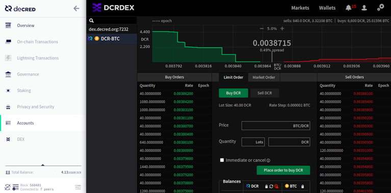
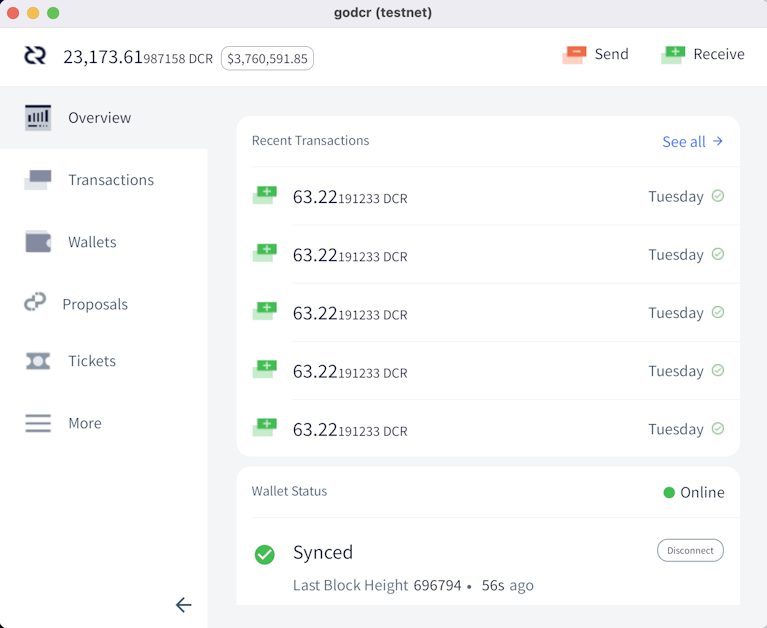

# Decred Journal – May 2021

_Image: Qubism Ascend by @saender_

Highlights for May:

- The new Treasury system is actively receiving block rewards and has already been tested with the first of the new tspend transactions being approved and mined.
- Version 1.6.3 of node and wallet software was released to patch some issues with VSP staking and add some of the latest features.
- DCRDEX v0.2.0 was released, incorporating more than 3 months work, and an experimental DCRDEX integration has been added to Decrediton v1.6.3.

Contents:

- [v1.6.3 Patch Release](#v163-patch-release)
- [New Treasury Activated](#new-treasury-activated)
- [Development](#development)
- [People](#people)
- [Governance](#governance)
- [Network](#network)
- [Ecosystem](#ecosystem)
- [Outreach](#outreach)
- [Media](#media)
- [Discussions](#discussions)
- [Markets](#markets)
- [Relevant External](#relevant-external)

## v1.6.3 Patch Release

Latest release of our flagship GUI wallet Decrediton fixes issues with VSP staking, makes the wallet "cooler" with granular unlocking of accounts, and adds experimental integration of the new [DCRDEX release](#dcrdex). Command-line dcrwallet is updated as well with VSP staking fixes and improvements.

Decrediton users please be aware:

- the DEX tab is only shown in full mode and is hidden in SPV mode
- you need to run Bitcoin Core and have it fully synced to use the DEX tab
- Windows download was updated to fix default Bitcoin directory [bug](https://github.com/decred/decrediton/pull/3469), if you got the installer before May 25 please download again and reinstall

See the full release notes and downloads [here](https://github.com/decred/decred-binaries/releases/tag/v1.6.3). As always, respect the signature [verification](https://docs.decred.org/advanced/verifying-binaries/) ritual to ensure you run unmodified binaries.

## New Treasury Activated

The new consensus rules activated on May 8. Starting with block [552,448](https://explorer.dcrdata.org/block/00000000000000001c6fc262b2673d94827f87daa329b0bdeb7866562ef919cf), 10% of the block rewards are flowing to the new [Treasury account](https://explorer.dcrdata.org/treasury) and are no longer flowing to the [legacy address](https://explorer.dcrdata.org/address/Dcur2mcGjmENx4DhNqDctW5wJCVyT3Qeqkx).

The key difference is that the new Treasury account is controlled by Decred stakeholders. Spending from the legacy address only required a transaction signed by Decred Holdings Group LLC ("DHG"), a conventional corporate entity created to bootstrap Decred. Spending from the new account is only possible if stakeholders vote to approve a special "treasury spend" transaction ("tspend").

A sophisticated voting process to support it was specified in [Decred Change Proposal 6](https://github.com/decred/dcps/blob/master/dcp-0006/dcp-0006.mediawiki) and implemented in software release v1.6. In simple terms, the key steps are:

- Politeia admins create a tspend transaction conforming to certain requirements (not spending too much money, with not too long expiration time, signed by one of the two keys allowed by consensus, etc)
- the transaction is published to the mempool and voting wallets start voting on it
- the vote runs for up to 12 days but can "short-circuit" in as early as ~7 days if the outcome becomes unchangeable by any remaining votes
- up to 17,280 tickets that are called to vote during this period may cast tspend votes (along with normal block approval and consensus upgrade votes)
- if the vote passes, the transaction is included in a block (up to 1 day later) and the contractors are paid

The new Treasury system was successfully tested on mainnet quickly after the activation. On May 10 the stakeholders were [notified](https://twitter.com/decredproject/status/1391877816292151296) to configure their voting wallets. Then on May 12, a small test tspend [transaction](https://explorer.dcrdata.org/tx/7507bcc72bfde895065034e12e6d462f2360163cd0c879f0db35514f9456b2c1) was broadcast to the network. The nearest voting window was May 13-24, but the vote "short-circuited" after accumulating 6,755 Yes and 1 No vote over 9 days. Out of 12,550 tickets that had a chance to vote in that period, 54% actively voted. The tspend was mined in block [556,416](https://explorer.dcrdata.org/block/000000000000000000b8bed4b8511e3c5197d3eee6372db2ba199481e14d5376).

As of software release v1.6.3, tspend voting is only supported for "solo voters" who run voting wallets 24/7 (~77% of all stakeholders as of Jun 1). Work is [underway](https://github.com/decred/decrediton/issues/3184) to enable this for VSP voters.

Treasury spend voting will become an important monthly process to pay the people building Decred. Solo voters are [advised](https://twitter.com/decredproject/status/1391877959410233344) to prepare for upcoming tspend votes by configuring their voting wallets with the following command:

    dcrctl --wallet settreasurypolicy "03f6e7041f1cf51ee10e0a01cd2b0385ce3cd9debaabb2296f7e9dee9329da946c" "yes or no"

This command expresses your trust to the current Treasury management and its key `03f6e704...`, and sets how your wallet will vote for tspends signed by it. You can verify this key in the [DCP-0006](https://github.com/decred/dcps/blob/master/dcp-0006/dcp-0006.mediawiki) or in the [source code](https://github.com/decred/dcrd/blob/master/chaincfg/mainnetparams.go#L389). The voting is semi-automated with this one-time configuration, but it is possible to vote on individual tspend transactions when more granular control is needed.

Congratulations to all stakeholders with this milestone and thanks to all [contributors](https://twitter.com/matheusd_tech/status/1390981711736053760) making it a reality!

## Development

The work reported below has the "merged to master" status unless noted otherwise. It means that the work is completed, reviewed, and integrated into the source code that advanced users can [build and run](https://medium.com/@artikozel/the-decred-node-back-to-the-source-part-one-27d4576e7e1c), but is not yet available in release binaries for regular users.

**[dcrd](https://github.com/decred/dcrd)**

- moved code for handling [signing](https://github.com/decred/dcrd/pull/2642) standard scripts to its own subpackage in order to prepare for future splitting of standard script handling from consensus critical code
- updated OpenBSD [rc script](https://github.com/decred/dcrd/pull/2646) for 6.9 features
- reworked application [version](https://github.com/decred/dcrd/pull/2651) handling to parse it from a single string, which is easier to manage and is more error-proof
- perform a graceful shutdown when the [SIGHUP](https://github.com/decred/dcrd/pull/2645) signal is received
- added script [version](https://github.com/decred/dcrd/pull/2650) to the result of the `gettxout` RPC. The script version is going to become more important in the future when a new version is introduced.
- [flush](https://github.com/decred/dcrd/pull/2649) block database to disk before UTXO database to ensure the latter can be recovered after an unclean shutdown
- reworked [UTXO](https://github.com/decred/dcrd/pull/2652) related logic for better separation of concerns. This makes the flow easier to follow and paves the way for optimizing the UTXO database.

**[dcrwallet](https://github.com/decred/dcrwallet)**

Merged in master and v1.6.3 release:

- improved heuristic for creating additional [split transactions](https://github.com/decred/dcrwallet/pull/2034) to fix more insufficient balance errors when buying tickets
- fixed [input selection](https://github.com/decred/dcrwallet/pull/2035) when paying VSP fees, resolving two bugs: one where the intended inputs were not being used and could remain locked, and another where VSP fee could be paid out of the wrong account, possibly degrading the privacy of mixing wallets
- ensure intended wallet [accounts](https://github.com/decred/dcrwallet/pull/2037) are used for paying VSP fee and receiving change when syncing failed VSP tickets
- [multiple](https://github.com/decred/dcrwallet/pull/2045) [fixes](https://github.com/decred/dcrwallet/pull/2046) for [tracking](https://github.com/decred/dcrwallet/pull/2048) VSP-managed tickets regarding fee payment scheduling, error handling, revocations, and expired fee transactions
- ensure there are [no duplicate](https://github.com/decred/dcrwallet/pull/2042) fee payments and that all are tracked by the VSP client
- perform a graceful shutdown when the [SIGHUP](https://github.com/decred/dcrwallet/pull/2039) signal is received
- added a new gRPC endpoint that exposes tickets and fees [tracked](https://github.com/decred/dcrwallet/pull/2040) by the VSP client (used by Decrediton)

Merged in master:

- implemented [`gettxout`](https://github.com/decred/dcrwallet/pull/1903) method returning information about an unspent transaction output, which is required for DCRDEX to operate a DCR wallet in [SPV mode](https://github.com/decred/dcrdex/pull/788)
- implemented [methods](https://github.com/decred/dcrwallet/pull/1978) to obtain cfilters ([compact block filters](https://bitcoinops.org/en/topics/compact-block-filters/)) and the best block. These are similar to dcrd's implementations and also enable DCRDEX to manage DCR in SPV mode.

**[Decrediton](https://github.com/decred/decrediton)**

Merged in master and v1.6.3 release:

- allow to [send](https://github.com/decred/decrediton/pull/3446) funds between accounts in privacy wallets (except into the mixed account)
- only show the "Process Managed Tickets" view when it is [needed](https://github.com/decred/decrediton/pull/3457)
- fixed blank page being shown on startup instead of a [loading bar](https://github.com/decred/decrediton/pull/3449)
- fixed incorrect passphrase allowing to [skip](https://github.com/decred/decrediton/pull/3454) account security migration
- fixed wallet account [locking](https://github.com/decred/decrediton/pull/3453) to prevent the locking of accounts where VSP tickets are being processed, but to also lock any accounts that no longer need to be unlocked
- consistently use Lodash for [type checking](https://github.com/decred/decrediton/pull/3135)
- fixed unmixed and change accounts not being [unlocked](https://github.com/decred/decrediton/pull/3476) when the ticket autobuyer is in privacy mode
- fixed default Bitcoin [directory](https://github.com/decred/decrediton/pull/3469) on Windows

Merged in master:

- fixed handling of [zero](https://github.com/decred/decrediton/pull/3468) "Balance to Maintain" value
- introduced [preload script](https://github.com/decred/decrediton/pull/3397) and converted some comms between the main and renderer processes to a more robust approach using `invoke/handle`. This is a first step towards isolating all Node-related calls so that Node integration can be turned off for the main UI code.

**[Politeia](https://github.com/decred/politeia)**

Most of the work has been dedicated to updating UI code, testing, and fixing bugs after the massive upgrade to the new storage backend and the new API.

- updated [About Politeia](https://github.com/decred/politeiagui/pull/2378) copy
- put proposal token into email notification [subject](https://github.com/decred/politeia/pull/1417)
- consistently handle [short](https://github.com/decred/politeiagui/pull/2365) proposal tokens across the UI codebase
- fixed multiple [comment](https://github.com/decred/politeiagui/pull/2384)-related UI bugs
- fixed [flickering](https://github.com/decred/politeiagui/pull/2395) during initial UI loading
- ~2 other backend and ~14 UI bug fixes
- fixed [unit](https://github.com/decred/politeiagui/pull/2364) and [end-to-end](https://github.com/decred/politeiagui/pull/2383) tests to work with the new backend API
- dependency upgrades, code cleanup, API enhancement

Contractor Management System (CMS):

- changed invoice peer review [visibility](https://github.com/decred/politeia/pull/1351) from based on author's domain to based on invoice's line-item domain. This will allow contractors to review all billed work in their domain even if it is coming from contractors in other domains. The current domains are Development, Research, Design, and Marketing.
- added more email [notifications](https://github.com/decred/politeia/pull/1353): "Timely submission of invoices will be much more important once the payout from the treasury is fully automated, so further nagging is due."
- docs update and code cleanup
- ~4 backend and ~1 UI bug fixes

Politeia v1.0.1 has been [released](https://github.com/decred/politeia/releases/tag/v1.0.1) including all the above backend fixes and improvements.

Progress towards v1.1.0 can now be tracked on the [Milestones](https://github.com/decred/politeia/milestones) page.

**[vspd](https://github.com/decred/vspd)**

- added block explorer [links](https://github.com/decred/vspd/pull/247) for ticket and fee transactions to the UI
- added best block [height](https://github.com/decred/vspd/pull/254) to status response (useful for detecting stalled VSPs)
- populate ticket [purchase height](https://github.com/decred/vspd/pull/250) for all confirmed tickets and show it on the admin page
- improved admin page [aesthetics](https://github.com/decred/vspd/pull/263)
- added a framework for database [upgrades](https://github.com/decred/vspd/pull/242)
- improved logging when [recovering](https://github.com/decred/vspd/pull/255) from request handling failures
- added [config](https://github.com/decred/vspd/pull/249) params for max log size and max log files to keep
- [remove](https://github.com/decred/vspd/pull/260) confirmed fee transactions from the database, cutting disk usage [by ~2x](https://github.com/decred/vspd/pull/243#issuecomment-844945549)
- store each ticket in its own [DB bucket](https://github.com/decred/vspd/pull/243). Combined with the previous optimization, it allows to trade ~40% higher disk usage for ~50% faster insertion and ~85% faster iterating over tickets.

**[dcrstakepool](https://github.com/decred/dcrstakepool)**

- fixed [incompatibility](https://github.com/decred/dcrstakepool/pull/636) between dcrstakepool (legacy VSP software) and dcrwallet v1.6.3 in some [rare](https://github.com/decred/dcrwebapi/pull/139#issuecomment-843101864) configurations

**[dcrpool](https://github.com/decred/dcrpool)**

- do not try to run with database version [newer](https://github.com/decred/dcrpool/pull/326) than expected
- handle `SIGTERM` and `SIGHUP` shutdown [signals](https://github.com/decred/dcrpool/pull/327)
- fixed chain notifications getting [blocked](https://github.com/decred/dcrpool/pull/324) by payment processing and added a workaround for dcrwallet's [reorg handling](https://github.com/decred/dcrwallet/issues/1740) bug

Third v1.2.0 release [candidate](https://github.com/decred/dcrpool/releases/tag/v1.2.0-rc3) fixed issues discovered since RC2, but coinbase confirmation failures remain unresolved. The release is postponed till further notice while the team is exploring solutions.

**[DCRDEX](https://github.com/decred/dcrdex)**

DCRDEX v0.2.0 has been released! It incorporates more than 3 months of work since the v0.1.5 release. The most notable changes are:

- UI and usability enhancements including responsive design and interactive depth chart
- support for client control by Decrediton and use of its accounts
- account import/export
- experimental Bitcoin Cash (BCH) support

Check Important Notices and the full list of changes in the [release notes](https://github.com/decred/decred-binaries/releases/tag/v1.6.3#dcrdex-v020). The [DEX page](https://dex.decred.org/) guides through simplified installation steps. More advanced users can get the binaries [here](https://github.com/decred/decred-binaries/releases/tag/v1.6.3#downloads-v163) and install them manually. Don't forget to [verify](https://docs.decred.org/advanced/verifying-binaries/) the downloads to ensure they came unmodified.

Merged in master:

- initial server-side [Ethereum](https://github.com/decred/dcrdex/pull/979) asset support
- disallow [changing](https://github.com/decred/dcrdex/pull/1055) to a wallet that cannot settle user's active trades
- fixed an elusive and long-standing issue with updating [score](https://github.com/decred/dcrdex/pull/1083) for offline users
- updated to [latest](https://github.com/decred/dcrdex/pull/953) dcrd and dcrwallet packages

A lot of exciting work towards the [0.3 milestone](https://github.com/decred/dcrdex/milestone/12) is in progress, most notably Ethereum and SPV.

**[dcrandroid](https://github.com/planetdecred/dcrandroid)**

- disallow sending from [unmixed](https://github.com/planetdecred/dcrandroid/pull/541) accounts
- added password input [delays](https://github.com/planetdecred/dcrandroid/pull/542) to resist brute-force attacks
- show [staking](https://github.com/planetdecred/dcrandroid/pull/543)-related transactions on the Overview page
- updated [dependencies](https://github.com/planetdecred/dcrandroid/pull/546) and replaced usages of "CoinShuffle++" with "StakeShuffle"
- keep the [display on](https://github.com/planetdecred/dcrandroid/pull/553) until the mixing is completed or canceled
- show rich text [formatting](https://github.com/planetdecred/dcrandroid/pull/557) for Politeia proposals (without using WebView)
- updated Chinese and French translations
- fixed [watch-only](https://github.com/planetdecred/dcrandroid/pull/560) wallet being listed as a source when sending funds

Merged in [dcrlibwallet](https://github.com/planetdecred/dcrlibwallet) shared library:

- added code for fetching proposal [description](https://github.com/planetdecred/dcrlibwallet/pull/192) and switched from saving proposal files to loading them on demand
- integrated a signed TLS [certificate](https://github.com/planetdecred/dcrlibwallet/pull/193) for [cspp.decred.org](https://cspp.decred.org/) which is required when using mainnet
- fixed bugs with balance and Politeia integration

**[dcrios](https://github.com/planetdecred/dcrios)**

- implemented [Privacy mode](https://github.com/planetdecred/dcrios/pull/727) with guided setup of the mixer
- show [USD equivalent](https://github.com/planetdecred/dcrios/pull/746) of wallet's DCR balance on the Overview page
- added password input [delays](https://github.com/planetdecred/dcrios/pull/749) to resist brute-force attacks
- when there is more than one wallet on the Overview page, show [which wallet](https://github.com/planetdecred/dcrios/pull/776) the transactions belong to
- show more specific [notifications](https://github.com/planetdecred/dcrios/pull/766) for staking transactions (ticket voted or revoked)
- show rich text [formatting](https://github.com/planetdecred/dcrios/pull/773) for Politeia proposals (without using UIWebView)
- fixed incorrect list of [accounts](https://github.com/planetdecred/dcrios/pull/765) to send from
- added support for iOS 11
- ~17 bug fixes and UI tweaks

**[godcr](https://github.com/planetdecred/godcr)**

- implemented pages: [Tickets](https://github.com/planetdecred/godcr/pull/395) overview, [Tickets list](https://github.com/planetdecred/godcr/pull/406), and [Restore wallet](https://github.com/planetdecred/godcr/pull/386)
- implemented the [Max](https://github.com/planetdecred/godcr/pull/396) button for setting the maximum DCR amount that can be sent
- added the submission of input fields with pressing [Enter](https://github.com/planetdecred/godcr/pull/414)
- added [loading](https://github.com/planetdecred/godcr/pull/400) animations to some modals
- initial [dark mode](https://github.com/planetdecred/godcr/pull/401) support
- added language [translation](https://github.com/planetdecred/godcr/pull/426) infrastructure
- ~14 bug fixes

Elias Naur (creator of the Gio library that powers godcr) has kindly reviewed the UI code and shared his [recommendations](https://paste.sr.ht/~eliasnaur/cea1d29d6a5f96668b5e166c2f39ef596974574f). Issues were created to address them, and some are already completed (e.g. [#409](https://github.com/planetdecred/godcr/issues/409), [#411](https://github.com/planetdecred/godcr/issues/411), [#416](https://github.com/planetdecred/godcr/issues/416)).

**[dcrdata](https://github.com/decred/dcrdata)**

- [initial version](https://github.com/decred/dcrdata/pull/1824) of the new [`/treasury`](https://dcrdata.decred.org/treasury) page
- [show](https://github.com/decred/dcrdata/pull/1827) treasury spend transactions on the [mempool](https://dcrdata.decred.org/mempool) page, tspend Yes/No votes on the ticket vote transaction page, and vote tally on tspend's own transaction page
- added a simpler endpoint to query [exchange rates](https://github.com/decred/dcrdata/pull/1826)
- added the share of [mixed](https://github.com/decred/dcrdata/pull/1825) coins to the [homepage](https://dcrdata.decred.org/) (under Distribution)

**[docs](https://github.com/decred/dcrdocs)**

- removed [inline HTML](https://github.com/decred/dcrdocs/pull/1168) for images - a step towards packaging all docs as a single [PDF file](https://github.com/decred/dcrdocs/issues/923)
- several updates regarding [vspd](https://github.com/decred/dcrdocs/pull/1171) staking

**[decred.org](https://github.com/decred/dcrweb)**

- [`/release`](https://decred.org/release/) page [updated](https://github.com/decred/dcrweb/pull/982) for v1.6.3
- improved [SEO tags](https://github.com/decred/dcrweb/pull/979)
- removed [inactive](https://github.com/decred/dcrweb/pull/990) contributors
- [updated](https://github.com/decred/dcrweb/pull/957) [`/exchanges`](https://decred.org/exchanges/) page
- added [hardware wallets](https://github.com/decred/dcrweb/pull/989) section on the [`/wallets`](https://decred.org/wallets/) page

Other:

- Bug Bounty Program [update](https://bounty.decred.org/2021/05/status-update/): a total of 180 submissions processed so far, with 16 of them being eligible for a payout
- a lightweight Jekyll [theme config](https://github.com/decredcommunity/jekyll-themes) was extracted into its own repo for reuse. It allows to publish a few Markdown pages without third party tracking scripts. You can see it in action on mini-websites for [events](https://decredcommunity.github.io/events/index/), [proposals](https://decredcommunity.github.io/proposals/) and [social-media-stats](https://decredcommunity.github.io/social-media-stats/) projects.
- translations require continuous maintenance. Join the [#translations](https://chat.decred.org/#/room/#translations:decred.org) chat room to coordinate with the other translators and developers.

## People

Welcome to new first time contributors with code merged to master: @LasTshaMAN ([politeia](https://github.com/decred/politeia/commits?author=LasTshaMAN))!

Community stats as of Jun 1:

- [Twitter](https://twitter.com/decredproject) followers: 45,724 (+1,333)
- [Reddit](https://www.reddit.com/r/decred/) subscribers: 11,190 (+203)
- [Matrix](https://chat.decred.org/) #general users: 467 (+33)
- [Discord](https://discord.gg/GJ2GXfz) users: 1,787 (+221)
- [Telegram](https://t.me/Decred) users: 2,705 (+60)
- [YouTube](https://www.youtube.com/decredchannel) subscribers: 4,540 (+40), views: 186K (+4K)
- GitHub [dcrd](https://github.com/decred/dcrd) stars: 598 (+7), forks: 255 (+1)

May's recap of interesting social media dynamics [is out](https://decredcommunity.github.io/social-media-stats/posts/20210604.1), now with tables for easier reading. Feedback is appreciated to understand how valuable these reports are.

All-time community growth charts have been tweaked, updated, and moved to a new location [here](https://decredcommunity.github.io/social-media-stats/docs/charts).

## Governance

In May Decred Treasury received 11,342 DCR (2,564 to the [old address](https://explorer.dcrdata.org/address/Dcur2mcGjmENx4DhNqDctW5wJCVyT3Qeqkx), and 8,778 to the [new system](https://explorer.dcrdata.org/treasury)) worth $1.97M at May's average rate of $173.47. No DCR was spent in May. On Jun 2, 698 DCR was spent from the legacy address for April invoices, worth $121K at May's rate, or $139K at April's billing rate of $198.60. As of Jun 3, combined Treasury balance is 683,438 DCR (107 million USD at $156).

May saw 1 proposal submitted and approved, the proposal for continued development of Politeia (detailed [last month](202104.md)) had 98.4% approval and turnout of 44%.

Treasury charts have been [added](https://twitter.com/_Checkmatey_/status/1392266971228430338) on [checkonchain.com](http://checkonchain.com/) to assist with governance decisions around expenses.

## Network

**Hashrate**: May's [hashrate](https://explorer.dcrdata.org/charts?chart=hashrate&zoom=ko2vefoc-kpf16yhd&scale=linear&bin=block&axis=time) opened at ~418 Ph/s and closed ~351 Ph/s, bottoming at 234 Ph/s and peaking at 497 Ph/s throughout the month.

There appears to be a correlation between the Dec-Apr price rally from ~25 to ~200 USD and the hashrate rise from ~350 to 450-550 Ph/s. Then in the opposite direction, Apr 17-23 price correction happened along hashrate drop from ~450 to ~250 Ph/s. Most recently, May 10-23 hashrate decline correlated with price drop from ~200 to ~110 USD.

Distribution of hashrate [reported](https://miningpoolstats.stream/decred) by the pools on Jun 1: Poolin 39%, F2Pool 17%, Antpool 3%, BTC.com 1.6%, Luxor 1.3%, Huobipool 0.4%, UUPool 0.1%, Coinmine 0.05%, okex 0.01%, others 38%.

Distribution of 1,000 actually [mined blocks](https://miningpoolstats.stream/decred) almost matches the reported hashrate. Unidentified mined blocks are split between 4 addresses: [Dsacz](https://explorer.dcrdata.org/address/DsaczRtjC31N6XVV69qcBoyR2BEEmjRDay3) 25%, [DsR4G](https://explorer.dcrdata.org/address/DsR4GSVsMxShvk6dpod9DBTbX7DuZhE2jjs) 7%, [DsbNN](https://explorer.dcrdata.org/address/DsbNNnupnCWd9MrHycs1NvwrtfhSYKF6ZGB) 4%, and [DsaWD](https://explorer.dcrdata.org/address/DsaWDBxVjxtV1ugqXsV3PGmAD4jLwryvSX3) 0.2%.

**Staking**: [Ticket price](https://explorer.dcrdata.org/charts?chart=ticket-price&zoom=ko2vefoc-kpf16yhd&axis=time&visibility=true-true&mode=stepped) varied between 173-198 DCR, with 30-day [average](https://dcrstats.com/) at 183.7 DCR (-2.1).

The [locked amount](https://explorer.dcrdata.org/charts?chart=ticket-pool-value&zoom=ko2vefoc-kpf16yhd&scale=linear&bin=block&axis=time) was 7.39-7.62 million DCR, meaning that 57.2-58.7% of the circulating supply [participated](https://explorer.dcrdata.org/charts?chart=stake-participation&zoom=ko2vefoc-kpf16yhd&scale=linear&bin=block&axis=time) in proof-of-stake.

**VSP**: On Jun 1, 8.2K (+1.1K) live tickets were managed by vspd servers and 1.1K (-1.1K) by the [still listed](https://decred.org/vsp/) legacy dcrstakepool servers. Collectively the 12 legacy and 13 new VSPs managed 22.5% of the ticket pool. The recently delisted but still active legacy VSPs managed 61 live tickets.

On May 14 it was [discovered](https://github.com/decred/dcrwebapi/issues/138) that 4 legacy VSPs have not upgraded to the new consensus rules and got forked off the network on May 8, while holding ~350 tickets of their clients. All but one have eventually upgraded to continue serving their tickets, while [stakepool.dcrstats.com](https://stakepool.dcrstats.com) changed to maintenance mode and stopped reporting the stats. The status of its 77 live tickets is unknown as of Jun 8.

**Nodes**: Throughout May there were around 215 reachable nodes according to [dcrextdata](https://dcrextdata.planetdecred.org/nodes).

Node versions as of Jun 1 [snapshot](https://nodes.jholdstock.uk/user_agents) (252 total, dcrd only): v1.6.2 - 42%, v1.6.0 - 21%, v1.6.1 - 17%, v1.7 dev builds - 8%, v1.6 dev builds 4%, v1.5.2 - 3%, v1.5.1 - 2.7%, v1.5.0 - 0.8%.

## Ecosystem

Welcome the new [vspd](https://github.com/decred/vspd) instance [123.dcr.rocks](https://123.dcr.rocks/) from [@thefrankbraun](https://twitter.com/thefrankbraun). Service fee is 0.49% and voting wallets are [located](https://twitter.com/thefrankbraun/status/1389014142095437825) in 3 data centers on 2 continents. Since it was listed on May 1, the service has already voted ~430 tickets and manages ~650 live tickets as of Jun 8.

Legacy VSP [dcrpool.dittrex.com](https://dcrpool.dittrex.com) was [removed](https://github.com/decred/dcrwebapi/pull/140) from the [listing](https://decred.org/vsp/) but is still online watching its last 1 live ticket. The service has voted 800+ tickets since [Nov 2018](https://github.com/decred/dcrwebapi/pull/48). The replacement vspd instance from Dittrex is up, [waiting](https://github.com/decred/dcrwebapi/pull/133) its first voted ticket to get added to the list.

Not all exchanges handled Decred's 6th consensus upgrade smoothly:

- Binance has upgraded in advance and was not affected by the fork when it happened
- Bittrex got stuck at block [552,447](https://explorer.dcrdata.org/block/552447) - last block adhering to the old consensus rules. Their [status page](https://global.bittrex.com/Status) reported that DCR wallet was disabled and under "Wallet Maintenance", which changed to "Normal" on around May 13.
- Poloniex [tweeted](https://twitter.com/PoloSupport/status/1390916088397852675) that their DCR wallet was disabled for "maintenance" (~4 hours after the consensus upgrade), and [tweeted](https://twitter.com/PoloSupport/status/1395727656251973639) again on May 21 that it was re-enabled

Since around May 17, Ledger Live users have been reporting issues with syncing and sending their DCR. Last update on Ledger's [incident page](https://status.ledger.com/incidents/j1sypv88pgs6) says the fix was being tested on May 20, but their Jun 3 [tweet](https://twitter.com/Ledger_Support/status/1400429510827388929) confirms the issue is still unresolved. As of Jun 8, the [status page](https://status.ledger.com/) reports an outage for DCR and a 75% uptime over the past 90 days.

The following services have been [removed](https://github.com/decred/dcrweb/pull/957) from [decred.org](https://decred.org/exchanges/):

- [instaex.io](https://instaex.io/) - website is down
- [fexpro.net](https://fexpro.net/) - certificate errors
- [changenow.io](https://changenow.io) - DCR trading pair [unavailable](https://github.com/decred/dcrweb/pull/988) for 3+ months
- [transak.com](https://global.transak.com/) - [no longer](https://github.com/decred/dcrweb/issues/984) seems to support buying DCR
- 6 OTC desks [removed](https://github.com/decred/dcrweb/issues/983) as none of them were actively quoting DCR

[MarketplaceGOLD](https://marketplacegold.com/) has compiled a list of merchants [accepting DCR](https://marketplacegold.com/crypto/186-decred-dcr) globally and [announced](https://www.reddit.com/r/decred/comments/nbcvob/where_decred_dcr_is_accepted_locally_and_globally/) it on r/decred.

Warning: the authors of the Decred Journal have no idea about the trustworthiness of any of the services above. Please do your own research before trusting your personal information or assets to any entity.

Join our [#services](https://chat.decred.org/#/room/#services:decred.org) chat to follow Decred ecosystem updates.

## Outreach

Monde PR's achievements for May:

- pitched 2 stories to finance and crypto publications
- responded to 12 requests for comments/PR opportunities
- secured 2 media interviews

News coverage secured by Monde PR:

- an article in [Brave New Coin](https://bravenewcoin.com/insights/crypto-market-forecast-week-of-may-3rd-2021) featuring news about the decentralized treasury activation
- an article in [CoinDesk](https://www.coindesk.com/bitcoiners-future-consensus-2018-2021) featuring commentary by @lukebp about his experience at Consensus. The piece was syndicated to [Yahoo! Finance](https://finance.yahoo.com/news/8-400-bitcoiners-went-hilton-200356039.html)
- The DCRDEX integration announcement was covered by [Bankless Times](https://www.banklesstimes.com/2021/05/27/decred-announces-initial-dcrdex-integration-into-decrediton-wallet/) and [Crowdfund Insider](https://www.crowdfundinsider.com/2021/05/175918-digital-currency-project-decred-announces-initial-integration-of-its-decentralized-exchange-into-decrediton-wallet/). The Crowdfund Insider article was syndicated to [Crypto News BTC](https://cryptonewsbtc.org/2021/05/28/digital-currency-project-decred-announces-initial-integration-of-its-decentralized-exchange-into-decrediton-wallet/), [MCC Exchange](https://mcc.exchange/2021/05/27/digital-currency-project-decred-announces-initial-integration-of-its-decentralized-exchange-into-decrediton-wallet/) and [MoneyNow](https://moneynow.cc/decreds-virtual-currency-allocation-announces-initial-integration-of-its-decentralized-wallet-into-decrediton-wallet/). The announcement was also covered by [CryptoNEXA](https://www.cryptonexa.com/2021/06/02/decred-and-zcash-lead-the-weekly-top/), [CriptoNoticias](https://www.criptonoticias.com/mercados/decred-zcash-lideran-top-semanal-mercado-halla-plena-recuperacion/) and [Crypto News](https://cryptonews.com/news/polygon-enjin-decred-uniswap-and-horizen-led-the-market-last-10514.htm). The Crypto News article was syndicated to [IQ Stock Market](https://www.iqstockmarket.com/n/polygon-enjin-decred-uniswap-horizen-led-market-last-week-2325136/).

## Media

Selected articles:

- Big Tech on steroids: why the 2020s will be the "decade of the DAO" by [Dominic Frisby](https://en.wikipedia.org/wiki/Dominic_Frisby) ([MoneyWeek](https://moneyweek.com/investments/alternative-finance/bitcoin-crypto/603213/decade-of-the-dao-decentralised-autonomous-organisation))
- Thinking Out Loud #2: Decred charting spree by @PermabullNino ([substack.com](https://permabullnino.substack.com/p/thinking-out-loud-2-decred-charting))

Videos:

- Finite coin supply - Decred Fundamentals by @phoenixgreen ([youtube](https://www.youtube.com/watch?v=pRIEiCvBYPE))
- Why is governance important - Decred Fundamentals by @phoenixgreen ([youtube](https://www.youtube.com/watch?v=hrL4sS8HuXg))
- Decred News Update - $150M stakeholder-driven DAO now live, DCRDEX coming to wallet, v1.6.2 & more by @Exitus ([youtube](https://www.youtube.com/watch?v=S_asvjm4lFI))
- Why this will be the decade of the DAO - Big Tech on steroids by Dominic Frisby ([youtube](https://www.youtube.com/watch?v=dQLN-DNnVKU))
- Decred 2021: DCR coin (Decred explained) by Layah Heilpern of Exodus ([youtube](https://www.youtube.com/watch?v=Kkb4BWmth7k))
- Decred Price Analysis - 26th May 2021 by Josh Olszewicz of Brave New Coin ([youtube](https://www.youtube.com/watch?v=LUg_DXUHdmg))
- Talking Decred with Jake Yocom-Piatt by Dominic Frisby ([youtube](https://www.youtube.com/watch?v=ZCfIM8IHurU)) - @jy-p hinted at upgrading the mixing tech with post-quantum crypto

Art and fun:

- The games are rigged - the revolution will not be centralized by @karamble ([twitter](https://twitter.com/karamblez/status/1398087058892148740))
- [Lego Stakey](https://twitter.com/Talha_Habib/status/1398268623572111362) made by young hodlers
- @jz has been busy with the [#RealDecredMemes](https://twitter.com/hashtag/RealDecredMemes) hashtag: DCR marrow [chart/menu](https://twitter.com/jz_bz/status/1391442849808408580), [freedom eagle](https://twitter.com/jz_bz/status/1392177374008053760), levels of voter [enlightenment](https://twitter.com/jz_bz/status/1395560884433473537), [shower thoughts](https://twitter.com/jz_bz/status/1396211915098136578)
- CoinDesk sending [mixed signals](https://twitter.com/CoinDesk/status/1395432897834848256) on their sympathy for Stakey

Translations:

- Decred Journal April 2021 was [translated](https://xaur.github.io/decred-news/) to Arabic (@arij, @abdulrahman4) and Chinese (@Dominic). Thank you all!

Other non-English content:

- Decred's new Treasury covered by [CriptoNoticias](https://www.criptonoticias.com/comunidad/protocolo-decred-esta-5-dias-descentralizar-tesoreria/)
- looks like @Dominic secretly runs a new Decred podcast in Chinese with 3 episodes already out: [first](https://twitter.com/wanbihou/status/1383625001098649602) with an anon hardware engineer about events in the community, [second](https://twitter.com/wanbihou/status/1388412787076984832) on governance with decreder, and [third](https://twitter.com/wanbihou/status/1393825045902807041) with Mable Jiang of 51% Podcast (where @Dominic was a [guest](https://podcasts.apple.com/cn/podcast/51-with-mable-jiang-presented-by-multicoin-capital/id1540917284?l=en&i=1000515571194) recently)

## Discussions

Selected Reddit threads:

- Chia's [Proof of Space and Time](https://www.reddit.com/r/decred/comments/n2sdwq/thoughts_on_alternatives_to_proof_of_work/) (PoST) as a replacement of PoW
- My GF made this deliciously looking [cake](https://www.reddit.com/r/decred/comments/n7l6ca/my_gf_made_this_deliciously_looking_cake_full_of/) full of Decred
- Decred: a [moonshot](https://www.reddit.com/r/decred/comments/ncnmca/decred_a_moonshot_and_the_continuity_of_proof_of/), and the continuity of proof of work consensus
- Do we [still need](https://www.reddit.com/r/decred/comments/njdrw6/do_we_still_need_centralized_exchanges/) centralized exchanges?
- Why Decred is worth a [non-zero percentage](https://www.reddit.com/r/decred/comments/nors4z/why_decred_is_worth_a_nonzero_percentage_of/) of Bitcoin's market cap

Selected Twitter discussions:

- a long [debate](https://twitter.com/lukebp_/status/1388987670832074758) between @lukebp and @BuckPerley on formal vs informal governance

> The Decred DAO has achieved a new milestone for the entire crypto space: A Digital Sovereign Wealth Fund.
> 
> The Decred network is the closest thing to a Digital Nation state.
> 
> A Layer 1 DAO with its own treasury, its own exchange, its own currency, and its own wallet. ([@ammarooni](https://twitter.com/Ammarooni/status/1390869248910794753))

 

_And its own cakes!_

## Markets

In May DCR was trading between USD 90.4-229.4 / BTC 0.0027-0.0047. The average daily rate was $173.47.

@PermabullNino posted a ["charting spree"](https://permabullnino.substack.com/p/thinking-out-loud-2-decred-charting) with lots of metrics unique to Decred and succint commentary. USD 40 and BTC 0.004 seem to be important levels for many miners and stakers.

@PermabullNino's non-Decred series ["Permabullish Banter"](https://permabullnino.substack.com/) [reports](https://permabullnino.substack.com/p/pb-banter-5-7-2021) that the stablecoin printer is in full "brr" mode, and some [insights](https://permabullnino.substack.com/p/pb-banter-5-25-2021) on USDC.

@Checkmate has updated [checkonchain.com](https://checkonchain.com/) with new charts tracking [Decred Treasury](https://www.reddit.com/r/decred/comments/nakdpc/new_decred_onchain_metric_charts_live/) and DCRDEX trading [volume](https://twitter.com/_Checkmatey_/status/1391743198242885634).

[DCRDEX](https://dex.decred.org/) has traded 383K DCR and 1.4K BTC in May, averaging to 12K DCR and 46 BTC daily trading volume.

## Relevant External

[Signalling](https://taproot.watch/) for Taproot activation on Bitcoin has hit a level exceeding 90% (as of early Jun at ~97%) and is set to be locked in some time in June when the current signalling window ends.

Iran's Central Bank has [reportedly](https://www.coindesk.com/iran-central-bank-ban-trading-crypto-mined-abroad) banned trading of cryptocurrency which is "mined abroad", in an effort to stop capital flight. Iranian businesses are still permitted to obtain cryptocurrency from registered Iranian miners, for use in international payments.

Bitcoin mining pool Marathon Mining has [mined](https://www.coindesk.com/marathon-miners-censor-bitcoin-transactions-ofac-compliant) a block which it describes as "fully compliant with U.S. regulations", having censored transactions from entities it believes are sanctioned by the US Department of Treasury or have been involved in dark web activity. Despite their efforts some darknet market transactions made it into this block which was intended as a milestone for Bitcoin censorship.

After Elon Musk criticized Bitcoin's environmental characteristics and Tesla [stopped](https://twitter.com/elonmusk/status/1392602041025843203) accepting it as payment, he joined with Michael Saylor and others to [promote](https://www.forbes.com/sites/ninabambysheva/2021/05/24/elon-musk-and-michael-saylor-lead-effort-by-bitcoin-miners-to-address-environmental-concerns/) a new "Bitcoin Mining Council to promote energy usage transparency and accelerate sustainability initiatives worldwide".

Ark's Cathie Wood also [remarked](https://www.coindesk.com/ark-cathie-wood-crash-esg-movement) at Consensus that ESG (Environmental Social and Governance) concerns with Bitcoin meant "A lot of institutional buying went on pause", crediting Elon Musk with a role in this movement.

The PoolTogether DAO, associated with the Pool Together lottery and controlling over 50% of all POOL tokens, has [voted](https://snapshot.org/#/poolpool.pooltogether.eth/proposal/QmfDcwyhMyhiTmszt8EX1a2vGfJzAN5TcXGMUwm7W7G7rq) to [diversify](https://gov.pooltogether.com/t/ptip-11-treasury-diversification/963) the holdings by selling 5.38% of all POOL tokens, currently controlled by the DAO, to a selection of VCs for the agreed sum of 7 million USDC. The POOL tokens bought by the VCs will have a lock-up period of 1 year, vesting over a 1 year period following that.

This is part of an apparent recent [trend](https://www.coindesk.com/synthetix-baderdao-sushiswap-lido-dao-treasuries) for DAOs to diversify their holdings.

May's big Ethereum flash loan fail victim was xToken, where an attacker [exploited](https://www.theblockcrypto.com/post/104667/defi-protocol-xtoken-exploit-attack) bugs in two different contracts within the same transaction, netting a profit of $24.5 million after paying a $21,900 transaction fee to obtain the flash loan.

Binance Smart Chain is now providing [competition](https://www.crowdfundinsider.com/2021/05/175611-defi-hack-analysis-project-pancakebunny-attacked-via-major-200-million-flash-loan-vulnerability/) for Ethereum in the DeFi dumpster fire stakes, after BUNNY tokens were hit for a notional $200 million in misprinted tokens following an economic exploit with, you guessed it, flash loans.

Coinbase is [expanding](https://decrypt.co/72109/coinbase-says-its-a-media-company-really) its remit to also become a media company, going direct to their audience with "fact check" type content that is approved by its marketing department.

That's all for May. Share your stories for the next issue in our declassified [#journal](https://chat.decred.org/#/room/#journal:decred.org) chat.

## About

This is issue 38 of Decred Journal. Index of all issues, mirrors, and translations is available [here](https://xaur.github.io/decred-news/).

Most information from third parties is relayed directly from source after a minimal sanity check. The authors of the Decred Journal have no ability to verify all claims. Please beware of scams and do your own research.

Credits (alphabetical order):

- writing and editing: bee, degeri, l1ndseymm, richardred
- reviews and feedback: chappjc, davecgh, dnldd, jholdstock, karamble, lukebp, matheusd, oshorefueled
- title image: saender
- funding: Decred stakeholders
