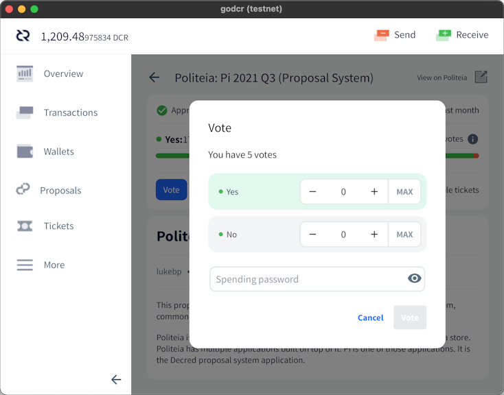
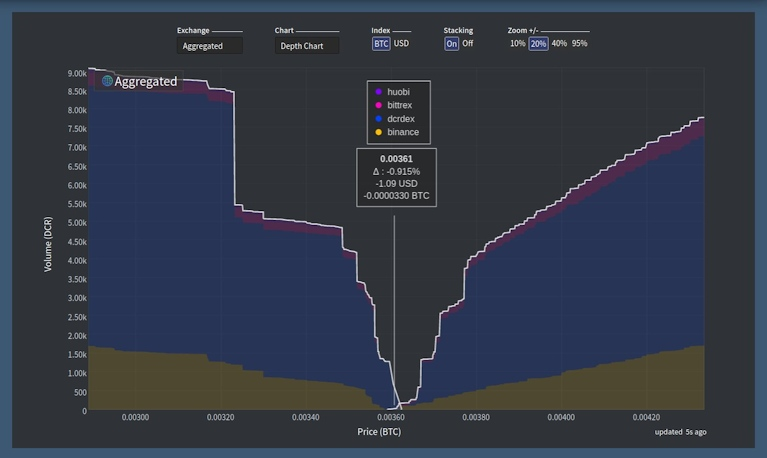

# Decred Journal – June 2021

_Image: Core Lattice by @saender_

June's highlights:

- An upcoming consensus upgrade was approved on Politeia which would make future consensus changes easier, more reliable, and more secure.
- A bug with the checks on treasury spending saw a limit which is too low being imposed, this will require a consensus upgrade to fix.
- Three Politeia proposals approved with high turnout (~47%) and yes votes (97-99%) - Bug Bounty, Translations, and the Explicit Version Upgrades Consensus Change.
- The PoW hashrate has seen a significant drop, likely associated with the crackdown on mining within China.

Contents:

- [New Treasury Bug](#new-treasury-bug)
- [Development](#development)
- [People](#people)
- [Governance](#governance)
- [Network](#network)
- [Ecosystem](#ecosystem)
- [Outreach](#outreach)
- [Events](#events)
- [Media](#media)
- [Discussions](#discussions)
- [Markets](#markets)
- [Relevant External](#relevant-external)

## New Treasury Bug

Payments from the new treasury are blocked for several months by a bug in expenditure policy implementation. The test treasury spend transaction mined on [May 22](https://explorer.dcrdata.org/tx/7507bcc72bfde895065034e12e6d462f2360163cd0c879f0db35514f9456b2c1) triggered an overlooked condition in the safety mechanism protecting from spending too much DCR in a short period of time. For the next few months, only around 0.15 DCR can be spent from the new treasury, which is too low to pay contractors.

While this is an unfortunate delay in migrating to the decentralized treasury and extra work to fix the bug, the migration plan was created to handle any cases such as this. All funds in the network are safe and contractor payments will continue from the legacy treasury. Fixing the safety algorithm requires another consensus change that is [under development](https://github.com/decred/dcps/pull/20).

Read the full story of the bug in the [blog post](https://blog.decred.org/2021/06/25/Treasury-Expenditure-Policy-Bug/) and Twitter threads from [@matheusd](https://twitter.com/matheusd_tech/status/1409928455974699013) and [@lukebp](https://twitter.com/lukebp_/status/1409929016400822279).

On a side note, this incident reminds us that even the heavily [reviewed](https://github.com/decred/dcrd/pull/2170) and tested consensus code is not immune to bugs, but they are easier to fix when a well-defined and non-controversial upgrade process exists.

## Development

The work reported below has the "merged to master" status unless noted otherwise. It means that the work is completed, reviewed, and integrated into the source code that advanced users can [build and run](https://medium.com/@artikozel/the-decred-node-back-to-the-source-part-one-27d4576e7e1c), but is not yet available in release binaries for regular users.

**[dcrd](https://github.com/decred/dcrd)**

The way standard scripts are handled has been reworked to address several long-standing issues.

For a quick background, "[scripts](https://devdocs.decred.org/developer-guides/transactions/txscript/overview/)" are small commands stored inside [transactions](https://devdocs.decred.org/developer-guides/transactions/transaction-format/) that consume "input" coins from past transactions and create new "output" coins for the recipient. "Standard scripts" is a subset of all scripts allowed by the consensus that covers most useful operations (sending funds, staking, multisig, etc) optimized for efficiency and network security. Mainnet nodes will normally [refuse](https://github.com/decred/dcrd/pull/2656#issuecomment-851105968) to accept and relay standalone transactions (those that are not part of a block) containing non-standard scripts.

The [reworked code](https://github.com/decred/dcrd/pull/2656) adds a new package called `stdscript` that supports different script versions (this was hard to support previously and is required for the next consensus upgrade), provides a more ergonomic API for developers (including multisig and atomic swap helpers) and improves separation between "standard" and "consensus" (a common point of confusion for new developers). Additionally, the policy of what scripts are considered "standard" has been further tightened to help ensure the typical scripts occupy less space on-chain and further restrict cases that don't make sense.

As usual, this large change comes in a series of easy-to-digest commits with informative descriptions, tests, benchmarks, examples, all finished with a thorough new [README](https://github.com/decred/dcrd/blob/62950c2b8b8d831cacf6f2ec46216e420d2658cc/internal/staging/stdscript/README.md).

A number of other [changes](https://github.com/decred/dcrd/pulls?q=standardness+is%3Apr+merged%3A2021-06-01..2021-06-30+sort%3Aupdated-asc) have been focused on removing the usages of standardness code from consensus code, since the policy of what is considered "standard" may change at any time without requiring a consensus change and so consensus code must not be affected.

A [proposal](https://proposals.decred.org/record/3a98861) for developing the next consensus change has been submitted and approved. This upgrade will practically forbid soft forks to simplify future consensus changes and [improve security](https://proposals.decred.org/record/3a98861/comments/8). Once it activates, full nodes will start rejecting transactions and scripts of newer versions they do not understand, instead of ignoring them and believing they still fully validate the chain.

> Soft forks are primarily the outgrowth of less capable systems with technical shortcomings and the lack of formal governance processes necessary to uncontroversially deploy them ([@davecgh](https://proposals.decred.org/record/3a98861))

Further departure from soft forks is possible thanks to Decred's drama-free process of coordinating hard forks and its highly engaged community.

**[dcrwallet](https://github.com/decred/dcrwallet)**

- an option to randomly [disapprove](https://github.com/decred/dcrwallet/pull/2054) blocks (intended for testing and cannot be used on mainnet)
- updated to latest [dcrd modules](https://github.com/decred/dcrwallet/pull/2056), including the new `stdaddr`
- removed attempts to vote or revoke when private key is [not available](https://github.com/decred/dcrwallet/pull/2062) (should prevent some ticketbuyer errors)
- use multiple [connections](https://github.com/decred/dcrwallet/pull/1983) when auto-buying tickets (may result in slower mixing if the funding account has limited UTXOs)

**[Decrediton](https://github.com/decred/decrediton)**

User-facing:

- gray out the [DEX tab](https://github.com/decred/decrediton/pull/3505) and show a tooltip instead of hiding it in SPV mode (a lot of people have been confused by this)
- added [advanced](https://github.com/decred/decrediton/pull/3487) options for restoring wallet (disable coin type upgrades and setting the gap limit)
- allow [empty passphrases](https://github.com/decred/decrediton/pull/3470) to support Trezor [passphrase](https://wiki.trezor.io/Passphrase) feature
- allow entering passphrase on the [Trezor](https://github.com/decred/decrediton/pull/3496) itself instead of asking it in Decrediton (Model T only)
- implemented new UI design for [Governance](https://github.com/decred/decrediton/pull/3467) views (both Proposals and Consensus Changes)
- integrated [text input](https://github.com/decred/decrediton/pull/3398) component from the [pi-ui](https://github.com/decred/pi-ui) library. To support Decrediton's design spec it was [updated](https://github.com/decred/pi-ui/pull/326) with new features that other React-based projects can now also use.
- ~10 bug fixes

Developer-facing changes include the completion of several security improvements that have been long in the making:

- automated tests for [Send](https://github.com/decred/decrediton/pull/3489), [Receive](https://github.com/decred/decrediton/pull/3490), and [Export](https://github.com/decred/decrediton/pull/3493) views
- reorganized, cleaned up, and optimized [Webpack config](https://github.com/decred/decrediton/pull/3503)
- disabled [Node Integration](https://github.com/decred/decrediton/pull/3486) in the UI code so that it can no longer access the low-level Node and Electron APIs directly. This is an important security feature and a [recommended](https://www.electronjs.org/docs/tutorial/security#2-do-not-enable-nodejs-integration-for-remote-content) practice in modern Electron app development.
- [context isolation](https://github.com/decred/decrediton/pull/3492) enabled in main window - another important [security](https://www.electronjs.org/docs/tutorial/security#3-enable-context-isolation-for-remote-content) feature further restricting the UI code
- enabled the [`webSecurity`](https://github.com/decred/decrediton/pull/3500) feature to tighten up external requests (this also fixed the development mode on Windows)
- reduced [dependencies](https://github.com/decred/decrediton/pull/3509) to rely less on third-party code and improve security by reducing the surface of a possible supply chain attack
- introduced a more secure confirmation dialog and used it for confirming [VSP access](https://github.com/decred/decrediton/pull/3515) and [transaction signing](https://github.com/decred/decrediton/pull/3519)

**[Politeia](https://github.com/decred/politeia)**

User-facing:

- added a button to access [raw Markdown](https://github.com/decred/politeiagui/issues/2415)
- show status of [proposal credit](https://github.com/decred/politeiagui/pull/2417) payment (gives an idea how soon the credits can be used to submit new proposals)
- show a [banner](https://github.com/decred/politeiagui/pull/2456) when the user is viewing `proposals-archive.decred.org` to reduce confusion when clicking the site logo
- improved look of the [Flat mode](https://github.com/decred/politeiagui/pull/2434) button
- added proposal name to email [subjects](https://github.com/decred/politeia/pull/1440)
- ~13 bug fixes

Backend and CLI:

- `politeiavoter` [upgraded](https://github.com/decred/politeia/pull/1235) to the new API released in [v1.0.0](https://github.com/decred/politeia/releases/tag/v1.0.0)
- `politeiavoter` will now [retry](https://github.com/decred/politeia/pull/1438) its votes on server errors
- added [MySQL](https://github.com/decred/politeia/pull/1419) implementation of the user database. The data will need to be migrated from CockroachDB to remove this dependency and have only one database to deal with. The choice of MySQL was dictated by [tlog](https://github.com/decred/politeia/issues/1392) (which [does not](https://github.com/google/trillian/issues/1298) support PostgreSQL).
- updated [READMEs](https://github.com/decred/politeia/pull/1421) with setup instructions to get a full Politeia instance up and running _(new contributors, wait no more!)_
- added missing [docs](https://github.com/decred/politeia/pull/1435) to `pictl` and `politeiaverify` tools
- more meaningful [stack traces](https://github.com/decred/politeia/pull/1428)
- test coverage for [user](https://github.com/decred/politeia/pull/1235) management and fetching
- ~2 bug fixes

Contractor Management System (CMS):

- allow using [archived proposals](https://github.com/decred/politeia/pull/1422) in invoices
- added tracking of [spends](https://github.com/decred/politeia/pull/1431) from the new treasury (to determine if the invoice has been paid)
- fixed proposal [expenses](https://github.com/decred/politeia/pull/1429) calculation and [fetching](https://github.com/decred/politeia/pull/1430) of correct invoice version

@lukebp shared a nice [educational intro](https://twitter.com/lukebp_/status/1407089424924610572) on how Politea achieves its strong cryptographic auditability.

**[vspd](https://github.com/decred/vspd)**

User-facing:

- added the [share](https://github.com/decred/vspd/pull/264) of VSP's live tickets, as well as its revoked percentage, to the homepage and status API response
- allow admins to set a custom [message](https://github.com/decred/vspd/pull/269) that will be shown on the webpage and returned by the status API when the VSP is closed
- [admin page](https://github.com/decred/vspd/pull/274) UI tweaks
- improved [cache busting](https://github.com/decred/vspd/pull/270) (prevents users from seeing outdated resources)

Internal:

- compare transaction [scripts](https://github.com/decred/vspd/pull/267) rather than addresses when verifying fee payments (this is more correct, more efficient, and fixes some edge cases)
- [filtering](https://github.com/decred/vspd/pull/265) of database tickets made more than twice as fast
- ensure ticket [purchase height](https://github.com/decred/vspd/pull/277) is set for all tickets
- improved [shutdown](https://github.com/decred/vspd/pull/271) handling
- refactored [GUI cache](https://github.com/decred/vspd/pull/273) for better reuse

**[dcrpool](https://github.com/decred/dcrpool)**

v1.2.0 [is here](https://twitter.com/dnldd/status/1409819702654910465) bringing almost a full year of development since v1.1.0. See all fixes and improvements in the [release notes](https://github.com/decred/dcrpool/releases/tag/v1.2.0).

Merged in master and v1.2.0 release:

- reworked coinbase [confirmation](https://github.com/decred/dcrpool/pull/334) tracking to resolve remaining issues

**[DCRDEX](https://github.com/decred/dcrdex)**

- more accurate [order status](https://github.com/decred/dcrdex/pull/1094) reporting
- added [trading fees](https://github.com/decred/dcrdex/pull/1074) overview to the README
- improved match [validation](https://github.com/decred/dcrdex/pull/1077)
- store [archived orders](https://github.com/decred/dcrdex/pull/1071) separately to speed up the processing of active orders
- verify [script versions](https://github.com/decred/dcrdex/pull/1107) (use different methods for dcrd 1.6 and 1.7) and prepare for handling different script versions ([backported](https://github.com/decred/dcrdex/pull/1108) v0.2 branch)

**[dcrandroid](https://github.com/planetdecred/dcrandroid)**

- option to [send change](https://github.com/planetdecred/dcrandroid/pull/568) to unmixed account (to be mixed before use), and indicate to which account the change will go on the Send page
- distinguish [mixes](https://github.com/planetdecred/dcrandroid/pull/565) with unique label and icon
- updated [French](https://github.com/planetdecred/dcrandroid/pull/567) translation
- ~3 bug fixes

Merged in [dcrlibwallet](https://github.com/planetdecred/dcrlibwallet) (base library for Android/iOS apps and godcr):

- added filters to find [mixed](https://github.com/planetdecred/dcrlibwallet/pull/195) or various [staking](https://github.com/planetdecred/dcrlibwallet/pull/201) transactions
- added [statistics](https://github.com/planetdecred/dcrlibwallet/pull/201) across transactions and staking activity
- option to send [change](https://github.com/planetdecred/dcrlibwallet/pull/199) to unmixed account
- fixed [insufficient](https://github.com/planetdecred/dcrlibwallet/pull/189) balance when paying vspd ticket fees

**[dcrios](https://github.com/planetdecred/dcrios)**

- option to [send change](https://github.com/planetdecred/dcrios/pull/807) to unmixed account (to be mixed before use), and indicate to which account the change will go on the Send page
- prevent screen [sleep](https://github.com/planetdecred/dcrios/pull/798) while syncing, rescanning, or mixing
- more flexible [dropdown](https://github.com/planetdecred/dcrios/pull/738) menu on the wallets list
- distinguish [mixes](https://github.com/planetdecred/dcrios/pull/801) with unique label and icon
- UI tweaks
- ~7 bug fixes

**[godcr](https://github.com/planetdecred/godcr)**

User-facing:

- implemented views: [Ticket activity](https://github.com/planetdecred/godcr/pull/439), [Statistics](https://github.com/planetdecred/godcr/pull/445), proposal [voting modal](https://github.com/planetdecred/godcr/pull/468), [start page](https://github.com/planetdecred/godcr/pull/465) that is shown while the wallets are loading
- added explainer [tooltips](https://github.com/planetdecred/godcr/pull/448) for tickets
- allow going to [previous page](https://github.com/planetdecred/godcr/pull/491)
- show [account](https://github.com/planetdecred/godcr/pull/467) names on inputs and outputs of the transaction
- limit content [width](https://github.com/planetdecred/godcr/pull/444) when stretching the window
- numerous bug fixes and UI tweaks

Developer:

- extracted reusable code for [pages](https://github.com/planetdecred/godcr/pull/459), [modals](https://github.com/planetdecred/godcr/pull/460), [notifications](https://github.com/planetdecred/godcr/pull/464), and [account selector](https://github.com/planetdecred/godcr/pull/484) (along with refactoring and cleanup)
- refactored to improve the use of [dcrlibwallet](https://github.com/planetdecred/godcr/pull/475)
- replaced global subpage buttons with instances [local](https://github.com/planetdecred/godcr/pull/492) to each page (fixes pages interfering with each other)
- implemented more [recommendations](https://paste.sr.ht/~eliasnaur/cea1d29d6a5f96668b5e166c2f39ef596974574f) from Elias Naur (creator of the Gio UI library)

godcr is approaching the public testing phase. Look forward to pre-release builds.

**[dcrdata](https://github.com/decred/dcrdata)**

- added [swapscan](https://github.com/decred/dcrdata/pull/1828) tool that scans Decred and Bitcoin blockchains for swap transactions and outputs a CSV file
- removed [inline javascript](https://github.com/decred/dcrdata/pull/1832) from charts page
- added rigorous [HTML escaping](https://github.com/decred/dcrdata/pull/1836) for anything that might contain user input
- removed dependency on [axios](https://github.com/decred/dcrdata/pull/1833) for making requests from UI code
- fixed [connectivity](https://github.com/decred/dcrdata/pull/1837) with Bittrex

Other:

- Decred [staking support](https://github.com/trezor/trezor-firmware/pull/1249) was merged in the firmware [repository](https://github.com/trezor/trezor-firmware/blob/master/core) for Trezor Model T and included in [release](https://github.com/trezor/trezor-firmware/blob/e67b3ab214a96885397f613fe8117c8193adcc0b/core/CHANGELOG.md) 2.4.0. More work is needed on Decrediton's end but this is a big milestone.

- @fst\_nml announced a $100K [bounty](https://twitter.com/fst_nml/status/1404114567525978121) for building Decred integration with [THORChain](https://docs.thorchain.org/) - a decentralized cross-chain liquidity protocol based on Tendermint, Cosmos and utilizing Threshold Signature Schemes. The development is already [in progress](https://twitter.com/THORChain/status/1410176914619179009) ([discussion](https://www.reddit.com/r/decred/comments/o14da0/decred_community_member_willing_to_put_up_100k_to/)).

## People

Welcome to new first time contributors with code merged to master: @vibros68 ([politeiagui](https://github.com/decred/politeiagui/commits?author=vibros68)) and @x-walker-x ([politeiagui](https://github.com/decred/politeiagui/commits?author=x-walker-x))!

Community stats as of Jul 1:

- [Twitter](https://twitter.com/decredproject) followers: 46,919 (+1,195)
- [Reddit](https://www.reddit.com/r/decred/) subscribers: 11,322 (+132)
- [Matrix](https://chat.decred.org/) #general users: 501 (+34)
- [Discord](https://discord.gg/GJ2GXfz) users: 1,933 (+146)
- [Telegram](https://t.me/Decred) users: 2,733 (+28)
- [YouTube](https://www.youtube.com/decredchannel) subscribers: 4,570 (+30), views: 188K (+2K)
- GitHub [dcrd](https://github.com/decred/dcrd) stars: 601 (+3), forks: 256 (+1)

June's recap of unusual social media dynamics can be found [here](https://decredcommunity.github.io/social-media-stats/posts/20210711.1).

## Governance

In June the [new treasury](https://dcrdata.decred.org/treasury) received 10,510 DCR worth $1.4 million at June's average rate of $131.52. 1,460 DCR was spent (from the legacy treasury address) to pay contractors, worth $192K at June's rate, or $253K at May's billing rate of $173.47. As of Jul 2, a combined balance of [legacy](https://dcrdata.decred.org/address/Dcur2mcGjmENx4DhNqDctW5wJCVyT3Qeqkx) and new treasury is 692,988 DCR (91.4 million USD at $131.88).

The first real transaction from the new treasury was not mined because of the [bug](#new-treasury-bug) described earlier and the contractors were paid from the legacy one instead. Even though it didn't work [as planned](https://twitter.com/behindtext/status/1402628975676035078), that transaction showed a high engagement of on-chain voters and high support of the current treasury management: 11,943 tickets out of the max possible 17,280 voted Yes and zero voted No - a 69% turnout. It could go even higher when TSPEND voting is implemented for VSP users, who currently hold around 20% of live tickets.

Three proposals were published on Politeia, and all three have been approved with strong approval ratings.

- The [Explicit Version Upgrades Consensus Change](https://proposals.decred.org/record/3a98861) proposal hit a new approval milestone with 99.9% Yes votes and just 13 tickets voting against the proposal among the 47% turnout.

- The fourth iteration of the Bug Bounty [proposal](https://proposals.decred.org/record/e1f104b) returned with a boosted payout schedule and was approved with 98.5% Yes votes and a turnout of 47%. This is +0.5% Yes votes and +15% turnout compared to [Phase 3](https://proposals.decred.org/proposals/2170df6). @degeri [thanks](https://twitter.com/degeri_crypto/status/1409714139396591617) the stakeholders for the ever increasing amount of faith and trust.

- The second phase of the big translation [proposal](https://proposals.decred.org/record/af9942a) was approved with 97.3% approval and a turnout of 46% - a big increase in support from 75% Yes and 28% turnout for the first [proposal](https://proposals.decred.org/proposals/c093b8a).

See Politeia Digest [issue 43](https://blockcommons.red/politeia-digest/issue043/) for more details on the month's proposals.

## Network

**Hashrate**: June's [hashrate](https://dcrdata.decred.org/charts?chart=hashrate&zoom=kpb32srm-kqn8vbkn&scale=linear&bin=block&axis=time) opened at ~369 Ph/s and closed ~73 Ph/s, bottoming at 61 Ph/s and peaking at 438 Ph/s throughout the month.

As you can see above June had a large drop in hashrate due to miners shifting out of China due to a recent [ban](https://www.coindesk.com/chinas-bitcoin-mining-crackdown-is-a-boon-for-miners-elsewhere). This is especially visible in ASIC mined coins like Decred and [Bitcoin](https://twitter.com/krugermacro/status/1409484360651317250).

Distribution of hashrate [reported](https://miningpoolstats.stream/decred) by the pools on Jul 1: Poolin 37%, F2Pool 28%, Antpool 8%, Luxor 5%, BTC.com 5%, HuobiPool 1%, UUPool 0.2%, CoinMine 0.1%.

Distribution of 1,000 actually [mined blocks](https://miningpoolstats.stream/decred) almost matches the reported hashrate. Unidentified 15% mined blocks are split between the same 4 addresses as [previously](202105.md).

**Staking**: [Ticket price](https://dcrdata.decred.org/charts?chart=ticket-price&zoom=kpb32srm-kqn8vbkn&axis=time&visibility=true-true&mode=stepped) varied between 168-208 DCR, with 30-day [average](https://dcrstats.com/) at 184.7 DCR (-1).

The [locked amount](https://dcrdata.decred.org/charts?chart=ticket-pool-value&zoom=kpb32srm-kqn8vbkn&scale=linear&bin=block&axis=time) was 7.33-7.72 million DCR, meaning that 56.1-59% of the circulating supply [participated](https://dcrdata.decred.org/charts?chart=stake-participation&zoom=kpb32srm-kqn8vbkn&scale=linear&bin=block&axis=time) in proof-of-stake.

**VSP**: On Jul 1, ~8,000 (-200) live tickets were managed by vspd servers and ~600 (-500) by the [listed](https://decred.org/vsp/) legacy dcrstakepool servers. Collectively the 12 legacy and 13 new VSPs managed 20.9% of the ticket pool, down from 22.7% on Jun 1. Delisted but still active legacy VSPs managed 26 live tickets (-35).

**Nodes**: Throughout June there were around 216 reachable nodes according to [dcrextdata](https://analytics.planetdecred.org/nodes).

Node versions as of Jul 1 [snapshot](https://nodes.jholdstock.uk/user_agents) (256 total, dcrd only): v1.6.2 - 53%, v1.6.0 - 19%, v1.6.1 - 13%, v1.7 dev builds - 7%, v1.6 dev builds - 3%, v1.5.1 - 2.8%, v1.5.2 - 2%.

The share of [mixed coins](https://dcrdata.decred.org/charts?chart=coin-supply&zoom=jzh4wow9-ks9hgjcu&bin=day&axis=time&visibility=true-true-true) varied between 43.7-47.0% and made a new all-time high.

Decred's [Lightning Network](https://ln-map.jholdstock.uk/) has seen 34 nodes (+1), 60 channels (+7) with a total capacity of 21.8 DCR (+4.7), as of Jul 1.

## Ecosystem

[stakey.net](https://stakey.net/) has [removed](https://citadel.stakey.net/@support/106416385081730641) the web interface for its legacy dcrstakepool instance. Voting wallets and the API will be maintained until users migrate to vspd. As of Jul 1, stakey.net's legacy VSP managed 63 live tickets, down from 134 on Jun 1. Its [vspd instance](https://stakey.net/) has become the largest, managing more than 2,200 live tickets.

To maintain decentralization, it is recommended to avoid providers that control too many tickets. But stakey.net presents a "problem" here, as it is the only known VSP offering a Tor hidden service. Other providers are welcome to the competition!

dcr.farm now redirects to its [vspd instance](https://vsp.dcr.farm/) but @infertux [confirmed](https://github.com/decred/dcrwebapi/issues/146#issuecomment-865451784) that its legacy wallets are up and will stay up until all tickets vote (32 remained live as of Jun 22). The status of dcr.farm's legacy and vspd wallets can be checked on a dedicated [status page](https://stats.uptimerobot.com/46PWkSrZD).

[YieldWallet](https://yieldwallet.io/)'s legacy VSP has voted its last ticket and has been shut down for good. Thank you for the service!

New VSP from crypto-synergy.net is up on [mainnet](https://vspd.synergy-crypto.net/) and [testnet](https://vspd-testnet.synergy-crypto.net/). The mainnet instance reports its first voted ticket (a requirement for all new VSPs) but it needs to pass the [review](https://github.com/decred/dcrwebapi/pull/147) to get listed on [decred.org/vsp](https://decred.org/vsp/).

At this point legacy VSPs hold less than 1.4% of the ticket pool and upgrading to vspd is [recommended](https://twitter.com/JamieHoldstock/status/1405069123453784065) to avoid the risk of missed tickets, e.g. in a scenario where another consensus upgrade is activated while [dcrstakepool](https://github.com/decred/dcrstakepool) is _not_ patched to follow the chain.

Ledger Live users are recommended to [update](https://www.ledger.com/ledger-live) to version 2.29.0 or later where [issues](https://status.ledger.com/incidents/j1sypv88pgs6) with syncing and sending DCR in have been fixed. The disruption between first [mentions](https://status.ledger.com/incidents/j1sypv88pgs6) of the issue and the release of [v2.29.0](https://github.com/LedgerHQ/ledger-live-desktop/releases/tag/v2.29.0) lasted around 22 days.

Indian [WazirX](https://wazirx.com/) has [enabled](https://twitter.com/WazirXIndia/status/1408022090750496776) DCR/INR and DCR/USDT trading. DCR was part of the ["Rapid Listing"](https://blog.wazirx.com/rapid-listing-initiative-on-wazirx/) process where trading starts sooner but deposit and withdrawal options are limited until the full integration is completed. In case of this listing, inter-wallet deposits and withdrawals between WazirX and Binance are [available](https://twitter.com/WazirXIndia/status/1407655011925073921) with no fees. WazirX was [acquired](https://www.binance.com/en/blog/404105749895733248/Binance-Acquires-Indias-Leading-Digital-Asset-Platform-WazirX-to-Launch-Multiple-FiattoCrypto-Gateways) by Binance in 2019.

For those who missed it, two lesser-known services in the wider Decred ecosystem are worth highlighting. One is a modestly called Twitter alternative from stakey.net:

> This _Decred citadel_ is a modestly fast, secure, and up-to-date Mastodon instance with monitored server availability and nightly off-site backups. Open to the Decred community. (invite link [here](https://citadel.stakey.net/@support/105249104743040856))

And another is @karamble's [PeerTube instance](https://tube.decredcommunity.org/videos/recently-added) that mirrors Decred video content for increased resilience and decentralization.

Warning: the authors of the Decred Journal have no idea about the trustworthiness of any of the services above. Please do your own research before trusting your personal information or assets to any entity.

Join our [#services](https://chat.decred.org/#/room/#services:decred.org) chat to follow Decred ecosystem updates.

## Outreach

Monde PR's achievements for June:

- pitched 1 story to finance and crypto publications
- responded to 6 requests for comments/PR opportunities
- secured 2 media interviews

News coverage secured by Monde PR:

- an article in [CryptoNexa](https://www.cryptonexa.com/2021/06/02/decred-and-zcash-lead-the-weekly-top/) featuring news about the DCRDEX integration into Decrediton
- an article in [Benzinga](https://www.benzinga.com/markets/cryptocurrency/21/06/21722413/chicken-soup-for-the-bitcoin-soul) featuring commentary by @jz about crypto FUD and FOMO. The piece was syndicated to three publications including [Yahoo! Finance](https://finance.yahoo.com/news/chicken-soup-bitcoin-soul-131625705.html) and [Explica.co](https://www.explica.co/cryptocurrency-chicken-soup-for-the-bitcoin-soul.html).
- an article in [NerdWallet](https://www.nerdwallet.com/article/investing/is-bitcoin-safe) featuring commentary by @jy-p on how to store crypto
- an article in [NerdWallet](https://www.nerdwallet.com/article/investing/crypto-crash) featuring commentary by @jy-p on how to buy crypto. The article was syndicated to 42 publications including [Nasdaq](https://www.nasdaq.com/articles/what-to-do-when-cryptocurrency-is-crashing-2021-06-30), [MSN Money](https://www.msn.com/en-us/money/savingandinvesting/what-to-do-when-cryptocurrency-is-crashing/ar-AALCJYT), [Yahoo! Finance](https://finance.yahoo.com/news/cryptocurrency-crashing-130055734.html) and [SF Gate](https://www.sfgate.com/business/personalfinance/article/What-to-Do-When-Cryptocurrency-Is-Crashing-16283912.php).

## Events

Attended:

- Jun 12 - Arab Blockchain Week 2021 - Internet. @arij introduced on-chain and off-chain governance and examples of both in Decred (see links and slides in the [report](https://decredcommunity.github.io/events/index/20210612.1)).

## Media

Selected articles:

- Treasury expenditure policy bug by @matheusd ([blog.decred.org](https://blog.decred.org/2021/06/25/Treasury-Expenditure-Policy-Bug/))
- Crowdfunding with voting rights - A killer feature of the Decred DAO by @ammarooni ([medium](https://ammarooni.medium.com/crowdfunding-with-voting-rights-a-killer-feature-of-the-decred-dao-78cf608e3498))

Videos:

- Decred News Update - v1.6.3, DEX integration, first DAO treasury spend, staking ATH & more by @Exitus ([youtube](https://www.youtube.com/watch?v=JXbcBKnUgYc))
- Should money be private - Decred Fundamentals by @phoenixgreen ([youtube](https://www.youtube.com/watch?v=1iCpzXC6WBw))
- The evolution of the treasury - Decred Fundamentals by @phoenixgreen ([youtube](https://www.youtube.com/watch?v=hk2USZ-MxqM))
- Coin supply and distribution - Decred Fundamental by @phoenixgreen ([youtube](https://www.youtube.com/watch?v=mGhOOVUP1Dg))
- 13 million landmark reached - Decred Society by @phoenixgreen ([youtube](https://www.youtube.com/watch?v=iDCo9VOVSKU))
- Decred - Top reasons this cryptocurrency rocks! by Ripe For Investing ([youtube](https://www.youtube.com/watch?v=JnBb5uiTSFU))
- Don Jon aka PurpleSuede22 speaks to us on the secrets behind Decred's success! by [CryptoND1](https://twitter.com/CryptoND1) ([youtube](https://www.youtube.com/watch?v=dHif4vuIenA))
- Coin Review - Decred by Spencer Tarring ([youtube](https://www.youtube.com/watch?v=eEZZVgMEYVs))
- Why Decred is a game changer by Todd F. Maki ([twitter](https://twitter.com/toddfmaki/status/1401734301243232259), [part 2](https://twitter.com/toddfmaki/status/1401812413947604992))
- @OfficialCryptos is now on [YouTube](https://www.youtube.com/channel/UC6_TA2_NBf5i99vFKsqgbKQ)

Art and fun:

- objects [in mirror](https://twitter.com/OfficialCryptos/status/1400149513462026241) are closer than they appear
- Cathie [on Bison](https://twitter.com/OfficialCryptos/status/1400737260753018882)

Translations:

- Decred Journal May 2021 was [translated](https://xaur.github.io/decred-news/) to Arabic (@arij, @abdulrahman4) and Chinese (@Dominic). April issue in Spanish is out too. Thank you all!

## Discussions

Comm systems news:

- Matrix experienced degraded performance due to a large scale attempt to bulk-register [bot accounts](https://twitter.com/matrixdotorg/status/1409873992454967304) and spam the network.

Selected Reddit posts:

- Decred, PoW's energy use and [renewables](https://www.reddit.com/r/decred/comments/o931uc/random_question_dcr_pow_and_renewables/)
- @atweiden's strong [pitch](https://www.reddit.com/r/decred/comments/o2g8c2/dex_decentralized_exchange/) for DCRDEX
- THORChain integration [bounty](https://www.reddit.com/r/decred/comments/o14da0/decred_community_member_willing_to_put_up_100k_to/) and comparison to DCRDEX

Selected Twitter discussions:

- @sumiflow is asking exchanges a [tough question](https://twitter.com/Sumiflow/status/1410003328780619777) about their listing choices
- @lukebp on how "De"Fi should not rely on a handful of trivially [blockable](https://twitter.com/lukebp_/status/1409280372970508301) central points
- @lukebp showed why Politeia is _huge_, with live examples:

> Politeia has undergone a huge upgrade this year and is doing things that nobody else is doing.
> 
> (technical explanation...)
> 
> So why is this a big deal? This provides us with irrefutable proof that my proposal existed at block height 552071 and has not been altered since then. No other production site provides this level of transparency and cryptographic auditability for its data. ([@lukebp](https://twitter.com/lukebp_/status/1407089424924610572))

## Markets

In June DCR was trading between USD 87.66-174.59 / BTC 0.00298-0.00468. The average daily rate was $131.52.

_Who can resist this liquidity?_

## Relevant External

A large scale migration of Bitcoin miners (and others) hashrate from China is underway, and it's being covered in all the [mainstream](https://www.cnbc.com/2021/06/15/chinas-bitcoin-miner-exodus-.html) [business](https://www.bloomberg.com/news/articles/2021-06-20/bitcoin-drops-as-hashrate-declines-with-china-mining-crackdown) [publications](https://www.forbes.com/sites/zinnialee/2021/06/23/bitcoin-mining-companies-exiting-china-as-authorities-crackdown-on-cryptocurrencies/). The exodus was triggered after Chinese authorities made statements about cracking down on Bitcoin mining, and then several provinces made it clear to miners that they had to stop. One of the issues the mining companies face in [relocating](https://www.coindesk.com/bitcoin-unpacking-hashrate-nic-cart-migration) their hashing hardware is with the current [high](https://compassmining.io/education/cost-bitcoin-miners-leaving-china/) price of international shipping.

The Zcash Open Major Grants (ZOMG) program has [funded](https://www.coindesk.com/tor-project-zcash-open-major-grants-zomg-arti-coding-language-upgrade) the Tor Project with $670,000, to be used for paying developer salaries as they work towards Arti (A Rust Tor Implementation) - which would make Tor more accessible to other applications, including Zcash.

The Uniswap community is [considering](https://thedefiant.io/uniswap-lobby/) funding a "DeFi political defense fund" with $27M to $40M USD, the fund's purpose would be to "educate policymakers, achieve regulatory clarity for DeFi, support DeFi and decentralized governance, and encourage other DeFi protocols to contribute ideas and support". As it progressed through a [temperature check](https://gov.uniswap.org/t/temperature-check-funding-a-political-defense-of-defi/12557) and [consensus check](https://gov.uniswap.org/t/consensus-check-uni-should-fund-a-political-defense-organization-for-decentralized-finance-copy/12717) phase, it became the more general "DeFi Education Fund" by the time it came to a [vote](https://app.uniswap.org/#/vote/0/1) (which concluded at the end of June with 84% approval).

The Curve DeFi project is [considering](https://www.theblockcrypto.com/post/108561/the-first-dao-lawsuit-proposal-asks-if-curve-should-protect-its-ip) whether to enforce its intellectual property rights in court. A [proposal](https://gov.curve.fi/t/cip-xx-enforce-curves-ip-rights/1890/3) is under discussion which would see the Curve DAO members soliciting and approving or rejecting proposals from law firms, related to shutting down competitor projects that have copied Curve's code (which includes the stipulation that "no license, right of reproduction or distribution or other right with respect thereto is granted or implied").

There has been a run on the Iron Titanium protocol, which saw it [incentivize](https://www.coindesk.com/iron-finance-defi-titan-iron-price-drop) its own rapid and irrevocable decline to zero once certain rare trading conditions were met.

The ironically titled "SafeDollar" also went to zero this month after being [hacked](https://securityboulevard.com/2021/06/safedollar-stablecoin-not-safe-nor-stable-hack-sends-value-to-zero/), with the attacker looting around $248,000 worth of tokens.

THORChain, which some Decred community members have been engaging with around a DCR integration, [suffered](https://twitter.com/THORChain/status/1409630489611182081) its first malicious attack. A [postmortem](https://twitter.com/THORChain/status/1409736048960180227) indicated $140K was taken by exploiting a logic error in the ETH Bifrost module. The network was halted for 6 hours while a fix was deployed. THORChain said it will cover losses incurred by users from treasury funds.

That's all for June. Share your updates for the next issue in our [#journal](https://chat.decred.org/#/room/#journal:decred.org) chat room.

## About

This is issue 39 of Decred Journal. Index of all issues, mirrors, and translations is available [here](https://xaur.github.io/decred-news/).

Most information from third parties is relayed directly from source after a minimal sanity check. The authors of the Decred Journal have no ability to verify all claims. Please beware of scams and do your own research.

Credits (alphabetical order):

- writing and editing: bee, degeri, l1ndseymm, richardred
- reviews and feedback: davecgh, lukebp, raedah
- title image: saender
- funding: Decred stakeholders
