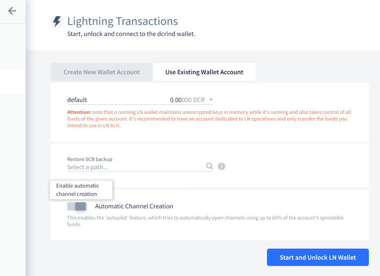
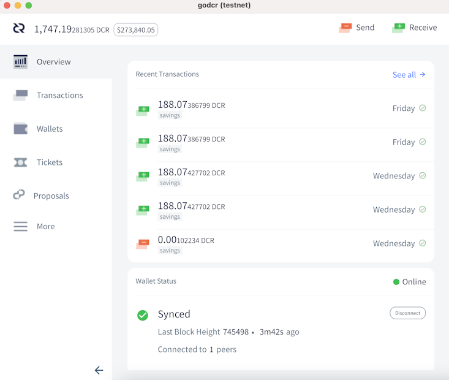
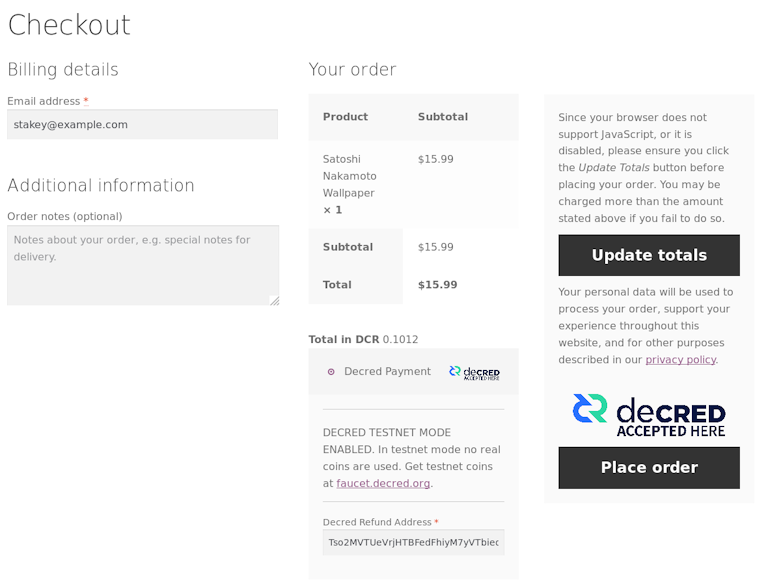

# Decred Journal – July 2021

_Image: Proximity Scaling by @saender_

Highlights for July:

- There are now 3 consensus changes in various stages of development, and the ticket revocations one is already attracting some press coverage.
- Solid progress on all of the usual repositories - dcrd took another 10% off the initial blockchain download time, and DCRDEX has added core ETH integration.
- It has been a big month for interviews, with Decred in Depth recording episodes with a number of well-known community members, and some other publications and podcasts featuring interviews with project developers.

Contents:

- [Development](#development)
- [People](#people)
- [Governance](#governance)
- [Network](#network)
- [Ecosystem](#ecosystem)
- [Outreach](#outreach)
- [Events](#events)
- [Media](#media)
- [Discussions](#discussions)
- [Markets](#markets)
- [Relevant External](#relevant-external)

## Development

The work reported below has the "merged to master" status unless noted otherwise. It means that the work is completed, reviewed, and integrated into the source code that advanced users can [build and run](https://medium.com/@artikozel/the-decred-node-back-to-the-source-part-one-27d4576e7e1c), but is not yet available in release binaries for regular users.

**[dcrd](https://github.com/decred/dcrd)**

- updated the `UtxoBackend` implementation to use `leveldb` directly rather than using the `database` package. This results in ~10% faster initial blockchain download and ~12% reduced memory usage.
- block index changed to use [short keys](https://github.com/decred/dcrd/pull/2685), resulting in ~30 MiB memory savings
- added size [limits](https://github.com/decred/dcrd/pull/2675) for RPC requests to help further harden the server against potential abuse in non-standard configurations on poorly configured networks
- added a more strict [origin check](https://github.com/decred/dcrd/pull/2676) for WebSocket connections
- smaller fixes and cleanup

At this point we have 3 upcoming consensus changes at different stages of development:

- reverting to the originally-proposed treasury expenditure policy (to [fix spending](202106.md#new-treasury-bug) from the new treasury) has a draft [DCP](https://github.com/decred/dcps/pull/20) and a draft [pull request](https://github.com/decred/dcrd/pull/2680)
- explicit version upgrades has an approved [proposal](https://github.com/decred/dcrd/pull/2680) and some support code already merged (like the standard script handling we covered [in June](202106.md#dcrd))
- automatic ticket revocations has an approved [proposal](https://proposals.decred.org/record/e2d7b7d)

One less obvious benefit of automatic ticket revocation is that it simplifies [ticket splitting](https://www.reddit.com/r/decred/comments/ot8x7o/decred_memelord_13_part_tweet_thread_113_decreds/h6w1vnk/) implementation.

**[dcrwallet](https://github.com/decred/dcrwallet)**

- added an RPC method that will allow Decrediton to discover active addresses more efficiently
- added an RPC method to [revoke](https://github.com/decred/dcrwallet/pull/2061) tickets in SPV mode (also for Decrediton)
- fixed concurrency issues when [unlocking](https://github.com/decred/dcrwallet/pull/2067) the wallet

**[Decrediton](https://github.com/decred/decrediton)**

User-facing:

- added [seed confirmation](https://github.com/decred/decrediton/pull/3521) window to the wallet creation flow
- improved UI design for LN wallet [Connect](https://github.com/decred/decrediton/pull/3530) page
- simplified responsive layout [breakpoints](https://github.com/decred/decrediton/pull/3525) (to ease integration with DCRDEX)
- disallow some problematic [characters](https://github.com/decred/decrediton/pull/3511) in wallet names
- fixed selecting [tx filters](https://github.com/decred/decrediton/issues/3528) on Transaction History page
- ~7 other fixes

Internal:

- migrated to new [Politeia API](https://github.com/decred/decrediton/pull/3495)
- automated tests for [Transaction](https://github.com/decred/decrediton/pull/3518) page
- removed the use of [winston](https://github.com/decred/decrediton/pull/3536) logging library to reduce the project's dependency tree (and supply chain attack surface)

_Updated Decrediton LN setup page_

**[Politeia](https://github.com/decred/politeia)**

User-facing:

- capture additional proposal [metadata](https://github.com/decred/politeiagui/pull/2469) like USD funding limit, start date, estimated end date, and domain. This will allow us to improve and automate contractor invoice validation, and also to generate proposal stats on Politeia.
- added [rate limiting](https://github.com/decred/politeia/pull/1448) for email notifications to prevent malicious behavior
- show who [censored](https://github.com/decred/politeiagui/pull/2454) a record, why, and when
- improved UX of downloading [proposal bundles](https://github.com/decred/politeiagui/pull/2453)
- forbid some [Markdown](https://github.com/decred/politeiagui/pull/2494) elements in comments to prevent text size abuse
- show [placeholders](https://github.com/decred/politeiagui/pull/2484) while loading proposal data
- show a [warning](https://github.com/decred/politeiagui/pull/2500) about possible data loss when saving drafts
- ~11 frontend and ~1 backend bug fixes

Internal and developer:

- allow multiple values in [plugin settings](https://github.com/decred/politeia/pull/1451)
- added test coverage for proposal [validation](https://github.com/decred/politeia/pull/1453)
- automated UI tests for [proposal list](https://github.com/decred/politeiagui/pull/2473)
- extended developer docs
- ~1 frontend and ~7 backend bug fixes

CMS:

- ~1 frontend and ~2 backend bug fixes

Changes awaiting deployment are marked with a `pi-not-deployed` label in both [politeiagui](https://github.com/decred/politeiagui/issues?q=label%3Api-not-deployed) and [politeia](https://github.com/decred/politeia/pulls?q=label%3Api-not-deployed) repos. In a similar way, changes in scope of the development [proposal](https://proposals.decred.org/record/91cfcc8) are labeled [`91cfcc8`](https://github.com/decred/politeia/issues?q=label%3A91cfcc8).

**[DCRDEX](https://github.com/decred/dcrdex)**

User-facing:

- handle attempts to register with [insufficient balance](https://github.com/decred/dcrdex/pull/1092)
- log [swap refund](https://github.com/decred/dcrdex/pull/1110) transactions so that the user can salvage funds when access to the client is lost but the logs are still available
- added [export](https://github.com/decred/dcrdex/pull/1109) of orders in CSV file
- group orders with [same rate](https://github.com/decred/dcrdex/pull/1090) into one table row
- show the current price in browser window [title](https://github.com/decred/dcrdex/pull/1117)
- show order errors [on the form](https://github.com/decred/dcrdex/pull/1093) instead of the notification bell
- 4+ bug fixes

Internal:

- only allow one [preimage](https://github.com/decred/dcrdex/pull/1106) request on the client to protect against malicious server behavior
- lot size and rate step made [market params](https://github.com/decred/dcrdex/pull/1102) instead of asset params
- updated npm [dependencies](https://github.com/decred/dcrdex/pull/1111)
- migrated to dcrd's [`stdaddr`](https://github.com/decred/dcrdex/pull/1096) package
- 4+ bug fixes

Ethereum support:

- bare bones client-side [ETH](https://github.com/decred/dcrdex/pull/1005) infrastructure (mainnet use disabled for now)
- store ETH balance in [gwei](https://github.com/decred/dcrdex/pull/1078) units to fit 64-bit integers
- implemented ETH [sync status](https://github.com/decred/dcrdex/pull/1082) and fee rate information (with a workaround, missing Geth feature [requested](https://github.com/ethereum/go-ethereum/issues/23099))

A few fixes have been [backported](https://github.com/decred/dcrdex/commits/release-v0.2) to an upcoming v0.2.1 release.

Work started to replace the registration fee with [fidelity bonds](https://github.com/decred/dcrdex/pull/1120) where users lock funds to use DCRDEX (as a [disincentive](https://twitter.com/lukebp_/status/1412061031061508098) against bad behavior) but can redeem them after a certain time. This creates a time cost to use DCRDEX instead of a monetary cost.

**[dcrandroid](https://github.com/planetdecred/dcrandroid)**

@raedah commented on the question of when staking will be supported in the mobile apps:

> Support for new style vspd staking has been built into dcrlibwallet for godcr and is currently in final testing. After godcr is released, it will be easy for the devs to import the same staking functionality into the mobile applications. There is not a strong incentive to prioritize building the mobile staking UI though until there is a functional hardware wallet that it can be paired with. ([2021-07-19](https://www.reddit.com/r/decred/comments/okrlg1/mobile_staking/h5rps6h/))

**[dcrios](https://github.com/planetdecred/dcrios)**

- updated [Vietnamese](https://github.com/planetdecred/dcrios/pull/809) translation

**[godcr](https://github.com/planetdecred/godcr)**

- implemented [HTML renderer](https://github.com/planetdecred/godcr/pull/469) for displaying styled text
- implemented custom [toggle](https://github.com/planetdecred/godcr/pull/487) widget
- [hide](https://github.com/planetdecred/godcr/pull/493) staking balances and imported account when they have no funds
- added [License](https://github.com/planetdecred/godcr/pull/516) page
- UI updates and massive code cleanup for: [Proposal](https://github.com/planetdecred/godcr/pull/513) list and details, [Wallet](https://github.com/planetdecred/godcr/pull/496), [Wallets](https://github.com/planetdecred/godcr/pull/493), [Send](https://github.com/planetdecred/godcr/pull/524), [StakeShuffle](https://github.com/planetdecred/godcr/pull/534), and several [Tickets](https://github.com/planetdecred/godcr/pull/539) pages
- pages and modals grouped into [packages](https://github.com/planetdecred/godcr/pull/512)
- 6+ bug fixes

_godcr Overview page_

**[dcrdata](https://github.com/decred/dcrdata)**

User-facing:

- fixed changing of [vote status](https://github.com/decred/dcrdata/pull/1838) on Proposals page
- fixed agenda quorum [threshold](https://github.com/decred/dcrdata/pull/1813)
- changed Block page to use ["approved" and "disapproved"](https://github.com/decred/dcrdata/pull/1841) terms instead of "valid"/"invalid"

Internal and developer:

- [optimized](https://github.com/decred/dcrdata/pull/1840) initial sync, vouts table, address cache, and search page performance
- [optimized](https://github.com/decred/dcrdata/pull/1844) performance and improved startup
- switched from gob encoding to custom [serialization](https://github.com/decred/dcrdata/pull/1843) of the ticket pool, making startup ~5 seconds faster
- fixed [purging](https://github.com/decred/dcrdata/pull/1842) of vouts table
- added a [test harness](https://github.com/decred/dcrdata/pull/1778) using simnet chain instead of a dcrdata snapshot

**[docs](https://github.com/decred/dcrdocs)**

- fixed broken [links](https://github.com/decred/dcrdocs/pull/1177)
- removed [gominer](https://github.com/decred/dcrdocs/pull/1178) docs
- [updated](https://github.com/decred/dcrdocs/pull/1174) consensus vote [archive](https://docs.decred.org/governance/consensus-rule-voting/consensus-vote-archive/)

**[decred.org](https://github.com/decred/dcrweb)**

- added percentage of [revoked](https://github.com/decred/dcrweb/pull/993) tickets to the VSP list
- show [both](https://decred.org/) press releases and latest posts at [decred.org](https://decred.org/) home page
- added the [press release](https://decred.org/press/2021-05-25_dex_decrediton/) about DCRDEX integration in Decrediton

**[WooCommerce Plugin](https://github.com/karamble/decred-woocommerce-plugin)**

@karamble released a new plugin for accepting DCR payments in [WooCommerce](https://en.wikipedia.org/wiki/WooCommerce) shops. It can generate payment addresses using the wallet account's XPUB (extended public key). This way each payment uses a new unique address while the shop's web server has no access to the wallet.

_WooCommerce plugin checkout page_

Other:

- we have totally missed two young [Rust](https://github.com/metaclips/rustdcr) [repos](https://github.com/metaclips/politeia-rs) implementing Decred APIs, although they received no new commits since Nov-Dec 2020
- Bug Bounty Program [reported](https://bounty.decred.org/2021/07/status-update/) stats at the end of Phase 3 (June 30): a total of 193 submissions processed, with 18 being eligible for a payout. Maximum bounty amounts have been [increased](https://github.com/decred/dcrbounty/pull/79/files).

## People

Welcome to new first time contributors with code merged to master: @briancolecoinmetrics ([dcrd](https://github.com/decred/dcrd/commits?author=briancolecoinmetrics)), @devchoplife ([godcr](https://github.com/planetdecred/godcr/commits?author=devchoplife)), and @jcezetah ([godcr](https://github.com/planetdecred/godcr/commits?author=jcezetah))!

Check out new interviews with community members @fst\_nml, Dominic Frisby, and Notsofast in the [Media](#media) section.

Community stats as of Aug 1:

- [Twitter](https://twitter.com/decredproject) followers: 47,586 (+667)
- [Reddit](https://www.reddit.com/r/decred/) subscribers: 11,449 (+127)
- [Matrix](https://chat.decred.org/) #general users: 513 (+12)
- [Discord](https://discord.gg/GJ2GXfz) users: 1,960 (+27)
- [Telegram](https://t.me/Decred) users: 2,833 (+100)
- [YouTube](https://www.youtube.com/decredchannel) subscribers: 4,600 (+30), views: 191K (+3K)

## Governance

In July the new [treasury](https://dcrdata.decred.org/treasury) received 11,338 DCR worth $1.44M at July's average rate of $127.48. 770 DCR was spent to pay contractors, worth $98K at July's rate, or $101K at June's billing rate of $131.52. As of Aug 2, the combined balance of [legacy](https://dcrdata.decred.org/address/Dcur2mcGjmENx4DhNqDctW5wJCVyT3Qeqkx) and new treasury is 703,655 DCR (96.3 million USD at $136.80).

The legacy treasury received an unusual ["donation"](https://explorer.dcrdata.org/tx/2411c14283d5810e0d7f6d1f174e42cb4cf536fb2f7dd51b96d63c9087766e10) of ~90 DCR coming out of a mix transaction.

There were 4 new proposals published in July, and two are still under discussion at the time of writing.

- A [proposal](https://proposals.decred.org/record/ae609f1) from @frizzers to make a copyleft documentary film that can be freely shared, based on his book "Daylight Robbery", at a cost of $300K.

- A [proposal](https://proposals.decred.org/record/51c4128) to fund people to attend Crypto Expo Dubai in October 2021 has presented two options, costing $21,240 to fly 4 Decred representatives to Dubai for the conference, or $26,240 to also pay for a presentation slot at the event. @sz1 will choose one option based on community feedback.

- A [proposal](https://proposals.decred.org/record/a3fa55f) to fund a 3-part science fiction miniseries has been withdrawn by its owner.

- Proposals were approved for the Automatic Tickets Revocations Consensus [Change](https://proposals.decred.org/record/e2d7b7d) (95% approval, 51% participation) and a Twitter charts [bot](https://proposals.decred.org/record/2895755) (85% approval, 46% turnout).

See Politeia Digest [issue 44](https://blockcommons.red/politeia-digest/issue044/) and [issue 45](https://blockcommons.red/politeia-digest/issue045/) for more details on the month's proposals.

## Network

**Hashrate**: July's [hashrate](https://dcrdata.decred.org/charts?chart=hashrate&zoom=kqhwurpw-kru2wj65&scale=linear&bin=block&axis=time) opened at ~71 Ph/s and closed ~316 Ph/s, bottoming at 70 Ph/s and peaking at 334 Ph/s throughout the month.

Distribution of hashrate [reported](https://miningpoolstats.stream/decred) by the pools on Aug 1: Poolin 58%, F2Pool 23%, AntPool 6%, BTC.com 4%, Easy2Mine 4%, Luxor 2.3%, HuobiPool 1%, ViaBTC 0.4%, CoinMine 0.09%, OKEx 0.08%, UUPool 0.06%. Distribution of 1,000 blocks actually [mined](https://miningpoolstats.stream/decred) before Aug 1 closely matched the reported hashrate.

Hashrate is recovering from June's [events](https://www.coindesk.com/chinas-bitcoin-mining-crackdown-is-a-boon-for-miners-elsewhere) in China and new mining pools are joining the network.

**Staking**: [Ticket price](https://dcrdata.decred.org/charts?chart=ticket-price&zoom=kqhwurpw-kru2wj65&bin=window&axis=time&visibility=true-true&mode=stepped) varied between 146.3-203.2 DCR, with 30-day [average](https://dcrstats.com/) at 190.7 DCR (+6).

The [locked amount](https://dcrdata.decred.org/charts?chart=ticket-pool-value&zoom=kqhwurpw-kru2wj65&scale=linear&bin=block&axis=time) was 7.43-7.88 million DCR, meaning that 56.3-59.8% of the circulating supply [participated](https://dcrdata.decred.org/charts?chart=stake-participation&zoom=kqhwurpw-kru2wj65&scale=linear&bin=block&axis=time) in proof-of-stake.

Ticket price had an unusual drop below 2020 lows but then quickly recovered with strong buy support.

**VSP**: On Aug 1, ~8,600 (+600) live tickets were managed by [listed](https://decred.org/vsp/) vspd servers and ~400 (-200) by listed legacy dcrstakepool servers. Collectively the 11 legacy and 14 new VSPs managed 22.9% (+2%) of the ticket pool. Unlisted but still active legacy VSPs managed 12 live tickets (-14).

The biggest ticket gainers in absolute terms were stakey.com (+474), 123.dcr.rocks (+126) and ubiqsmart.com (+51). The first two have fees below 0.5%.

**Nodes**: Throughout July there were around 211 reachable nodes according to [dcrextdata](https://dcrextdata.planetdecred.org/nodes).

Node versions as of Aug 1 [snapshot](https://nodes.jholdstock.uk/user_agents) (250 dcrd nodes): v1.6.2 - 57%, v1.6.0 - 16%, v1.6.1 - 13%, v1.7 dev builds - 7%, v1.6 dev builds - 3%, v1.5.2 - 2%, v1.5.1 - 1.6%.

Decred's [Lightning Network](https://ln-map.jholdstock.uk/) has seen 36 nodes (+2), 66 channels (+6) with a total capacity of 25.5 DCR (+3.7), as of Aug 1.

## Ecosystem

Welcome the new vspd instance [dcrvsp.dittrex.com](https://dcrvsp.dittrex.com/), coming to replace their legacy VSP which was [delisted](https://github.com/decred/dcrwebapi/pull/140) in May and shut down in July.

Legacy VSP [pool.d3c.red](https://pool.d3c.red) from @karamble voted its final ticket and was shutdown. Users are welcome to the replacement server at [vsp.decredcommunity.org](https://vsp.decredcommunity.org/).

So far 8 legacy VSPs have been delisted (3 shutdowns, 1 status unknown, 4 still voting) and 9 are still listed. The status of migration to the new [VSP system](https://blog.decred.org/2020/06/02/A-More-Private-Way-to-Stake/) is summarized in [this table](https://github.com/decred/vspd/issues/231#issuecomment-774877129). It is [recommended](https://twitter.com/JamieHoldstock/status/1405069123453784065) that legacy VSP users upgrade to vspd to avoid the risk of missed tickets when dcrstakepool stops working (e.g. if a new consensus upgrade is activated).

The [VSP list](https://decred.org/vsp/) has been updated to show the percentage of revoked tickets, which is a helpful metric when choosing a VSP.

[ViaBTC](https://www.viabtc.com/) announced the [launch](https://viabtc.medium.com/viabtc-pool-unveils-dcr-on-chain-co-governance-under-hybrid-consensus-61fcbd133a55) of DCR mining, celebrated by a "Fee-free Mining Carnival" until Aug 25. The pool supports PPS+, PPLNS, and SOLO payment [methods](https://support.viabtc.com/hc/en-us/articles/4403972374297-DCR-Mining-Pool-Launched-Mine-with-ZERO-Fees-For-30-days).

[OKEx pool](https://www.okex.com/pool) has been mining DCR since [Aug 2020](https://www.okex.com/academy/en/how-to-earn-cryptocurrency-with-okex-pool) or earlier, but in July it has finally mined some blocks, according to [miningpoolstats.stream](https://miningpoolstats.stream/decred).

[Bitfinex](https://www.bitfinex.com/) [pre-announced](https://twitter.com/bitfinex/status/1421032832848302081) a DCR listing and in early Aug [posted](https://twitter.com/bitfinex/status/1423210403774009345) that DCR/USD trading is live.

Warning: the authors of the Decred Journal have no idea about the trustworthiness of any of the services above. Please do your own research before trusting your personal information or assets to any entity.

Join our [#services](https://chat.decred.org/#/room/#services:decred.org) chat to follow Decred ecosystem updates.

## Outreach

Monde PR's achievements for July:

- pitched 1 story to finance and crypto publications
- pitched Decred to 4 PR opportunities
- secured 2 media interviews

Secured the following news articles:

- @lukebp was interviewed by Geek Insider's podcast, [Geek Speak](https://www.youtube.com/watch?v=a9IQyMf_724), covering all major aspects of Decred
- an article in [The Street](https://www.thestreet.com/personal-finance/should-you-worry-about-crypto-crashing-nw) featuring commentary from @jy-p on how to buy crypto, syndicated from NerdWallet
- an article in [MarketWatch](https://www.marketwatch.com/story/what-to-do-when-your-digital-assets-take-a-dive-11625258295) featuring commentary from @jy-p on how to buy crypto, syndicated from NerdWallet. The article was also syndicated to 7 other publications including [MSN](https://www.msn.com/en-us/money/savingandinvesting/what-to-do-when-your-digital-assets-take-a-dive/ar-AALOVNE).
- news about Decred passing a vote to make a consensus change to ticket revocations was covered by [Bankless Times](https://www.banklesstimes.com/2021/07/28/decred-continues-to-evolve-without-contentious-hard-forks/), [Crowdfund Insider](https://www.crowdfundinsider.com/2021/07/178473-decred-dcr-a-virtual-currency-focused-on-security-and-scalability-to-enhance-user-experience/) and [Geek Insider](https://geekinsider.com/no-contentious-hardforks-as-decred-evolves/). @lukebp was also interviewed by the Crypto and Cigars podcast to talk about Decred's upgradability.
- Finder.com published the results of its cryptocurrency predictions survey, featuring quotes from @jz in an article about [Bitcoin price prediction](https://www.finder.com/bitcoin-btc-price-prediction) and an article about [Doge price prediction](https://www.finder.com/hk/dogecoin-doge-price-prediction). The news was picked up by [The Block News](https://theblocknews.io/finders-experts-predict-dogecoin-price-should-hit-1-21-by-2025-and-3-60-by-2030/), [FinBold](https://finbold.com/50-of-crypto-experts-expect-bitcoin-to-overtake-global-finance-by-2040/), [CryptoKnowmics](https://www.cryptoknowmics.com/news/crypto-experts-optimistic-for-bitcoin-believes-btc-will-replace-fiat-currency-by-2040-in-hyperbitcoinisation), [Bitcoin News](https://news.bitcoin.com/crypto-experts-predict-bitcoin-price-rising-to-318417-by-december-2025/), a second article in [Bitcoin News](https://news.bitcoin.com/finders-experts-predict-dogecoin-price-should-hit-1-21-by-2025-and-3-60-by-2030/) and [The Hack Posts](https://thehackposts.com/crypto-experts-predict-bitcoin-price-rising-to-318417-by-december-2025-markets-and-prices-bitcoin-news/). The articles mention that Decred was part of a panel of 42 experts who completed the survey, including representatives from Thomson Reuters, UCL School of Management and the University of Western Australia.
- @raedah was interviewed for Authority Magazine's [The Future is Now](https://medium.com/authority-magazine/the-future-is-now-steven-wagner-of-raedah-group-on-how-their-technological-innovation-will-shake-4f272ced222f) series, talking about all things Decred and crypto, including privacy, governance, Decred being the first true crypto DAO and Decred's use in Brazil's election.

@StakeShuffle\_ bot's author is collecting [feedback](https://twitter.com/StakeShuffle_/status/1418895005050155011) on what metrics to implement in the next development phase. The tweets with generated charts would provide up-to-date content that can be used in Twitter conversations.

## Events

Attended:

- Jul 5 - [Talent Land Digital](https://github.com/decredcommunity/events/pull/95) - Internet. @pablito gave a 25 min keynote on "What is Decred" (34K views) and a 58 min workshop "Blockchain introduction using dcrdata API" (47K views). Decred is a Bronze sponsor of Talent Land.

- Jul 10 - [YOUCATHON: Youth For Change & Action (100 % Digital)](https://decredcommunity.github.io/events/index/20210710.1) - Youssoufia, Morocco. Computer science school YouCode organized a hackathon between two campuses in Youssoufia and Safi, connected over a video conference. @arij was invited to talk about blockchain technology. In her ~80 min talk, she explained the tech and demonstrated a Decred wallet and Politeia. Questions concerned how this can be used to build applications and what opportunities exist to work in blockchain projects, so @arij explained her role in Decred and how to join.

- Since early 2021 Decred is a supporter of the [education program](https://twitter.com/IECarballo/status/1417491314191519751) about cryptocurrency and blockchain tech organized by the Business School of the Catholic University of Argentina and Bitcoin Argentina NGO.

## Media

Selected articles:

- The coming rise and fall of central bank digital currencies by @ammarooni ([bitcoinmagazine.com](https://bitcoinmagazine.com/culture/rise-fall-central-bank-digital-currency))

Videos:

- What is Decred? | Decentralized Autonomous Organization | Politeia | Decred crypto by MarketSquare ([youtube](https://www.youtube.com/watch?v=s8hAwP0JvE4))
- Blockchain security - Decred Fundamentals by @phoenixgreen ([youtube](https://www.youtube.com/watch?v=BsKV7fiWdqE))
- The cost of attack - Decred Fundamentals by @phoenixgreen ([youtube](https://www.youtube.com/watch?v=RXV8dGZ9HEk))
- Hybrid security - Decred Fundamentals by @phoenixgreen ([youtube](https://www.youtube.com/watch?v=QgInCQTbw4s))
- Decred Price Analysis - 1st July 2021 by @Brave New Coin ([youtube](https://www.youtube.com/watch?v=rtpCGv63Tm8))
- A ragin' geek speak with... Decred blockchain developer, Luke Powell - 07/05/2021 by Meredith Loughran of GeekInsider ([youtube](https://www.youtube.com/watch?v=VLZRriYx8qM), [periscope](https://www.pscp.tv/w/c7IKyDFQbUtxVmduRHpqb1l8MWt2SnBvb0FaZG9HRadTE0sJ4V5iChp6FerysRgxlLOi8yj07WsN_joUocji))
- @fst\_nml interview Decred in Depth (live): Decred and Thorchain integration by @elima\_iii ([youtube](https://www.youtube.com/watch?v=vGjqqVN4qDs))
- Decred in Depth 39 - Dominic Frisby - Marketing + filmmaking + DAO by @elima\_iii ([youtube](https://www.youtube.com/watch?v=WpMKGsQLxic))
- Decred in Depth 40 - Notsofast Interview by @elima\_iii ([youtube](https://www.youtube.com/watch?v=ryyJ25EXqKI))

Audio:

- new Decred in Depth episodes have been uploaded to [Libsynn](https://decredindepth.libsyn.com/)

Art and fun:

- visualization of [governance models](https://twitter.com/OfficialCryptos/status/1410731577546477568) by @OfficialCryptos

Translations:

- Decred Journal June 2021 was [translated](https://xaur.github.io/decred-news/) to Arabic (@arij, @abdulrahman4), Chinese (@Dominic), and Spanish (@francov\_). Spanish May issue is available too. A warm thank you to all translators for staying with us for so long!

If you have translations we don't know about please share in our [#translations](https://chat.decred.org/#/room/#translations:decred.org) chat.

## Discussions

Selected Reddit posts:

- ideas how to [attract developers](https://www.reddit.com/r/decred/comments/ohcr5q/how_attact_developers_to_join_decred_community/) to join the Decred community
- multiple comments on buying [ASICs](https://www.reddit.com/r/decred/comments/occ45q/buy_decred_asic_where_when_what_do_you_think_guys/) and their profitability

Selected Twitter discussions:

- @lukebp's [thread](https://twitter.com/lukebp_/status/1418216538193203200) on the automatic ticket revocations consensus change highlights that more work on mission-critical consensus code being done by developers outside of the original team is an important step in decentralizing the project. The second highlight is this change demonstrates Decred's fundamental value proposition - the ability to improve base layer UX.
- @decredmemelord has [summarized](https://twitter.com/decredmemelord/status/1420227949970685956) some of the project's key achievements in the past year

## Markets

In July DCR was trading between USD 91.70-158.46 / BTC 0.00338-0.00381. The average daily rate was $127.48.

## Relevant External

Thorchain has been hit by two attacks this month. The [first](https://decrypt.co/76215/thorchain-tapping-treasury-repay-5m-ethereum-after-attack) affected ETH liquidity providers, whose pools were drained of $5M, and they will be compensated from the Thorchain treasury. The [second](https://www.coindesk.com/thorchain-8-million-exploit-bifrost) attack claimed $8M by tricking the network's Bifrost protocol into receiving fake assets - it could apparently have been much worse if not for the hacker's [seeming](https://twitter.com/THORChain/status/1418360743523618825) whitehat tendencies. Things may be looking up for Thorchain however, as the last attacker left [instructions](https://news.bitcoin.com/thorchain-trolled-by-hacker-after-two-successful-seven-figure-exploits/) for how they can improve security.

Uniswap has voted to [fund](https://www.coindesk.com/defi-gets-proactive-about-policy-thanks-to-a-20m-grant-from-the-uniswap-community) a "DeFi Education Fund" with 1 million UNI (worth around $20 million), half of which they immediately traded for USDC. This proposal was originally billed as a "political defence fund", to pay representatives who can fight DeFi's corner with regulators. There are been some [criticism](https://decrypt.co/75841/uniswap-proposal-sparks-blowback-after-grantees-dump-10m-uni-tokens) of the role that UNI whales who are associated with the proposers played in approving this proposal.

The ShapeShift organization is [closing](https://www.coindesk.com/shapeshift-to-shut-down-airdrop-fox-tokens-to-decentralize-itself-out-of-existence) its doors in an effort to "decentralize itself out of existence". It is airdropping FOX tokens to its users and users of a number of DeFi protocols, and those tokens will be used to govern a DAO (which is also receiving a token allocation). The airdrop is complex as it covers a range of blockchains, but users will only have 100 days to claim their FOX tokens before these revert to the DAO.

That's all we have for July. Share your updates for the next issue in our [#journal](https://chat.decred.org/#/room/#journal:decred.org) chat room.

## About

This is issue 40 of Decred Journal. Index of all issues, mirrors, and translations is available [here](https://xaur.github.io/decred-news/).

Most information from third parties is relayed directly from source after a minimal sanity check. The authors of the Decred Journal have no ability to verify all claims. Please beware of scams and do your own research.

Credits (alphabetical order):

- writing and editing: bee, degeri, l1ndseymm, richardred
- reviews and feedback: davecgh, karamble, lukebp, raedah
- title image: saender
- funding: Decred stakeholders
