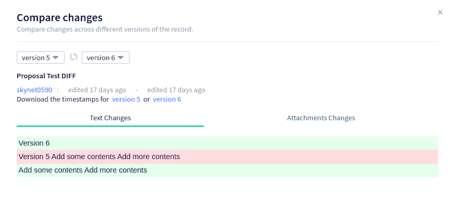
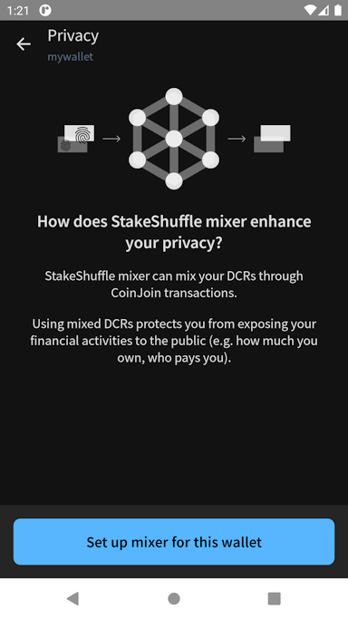
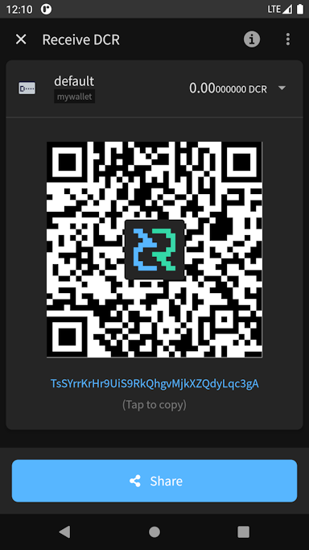
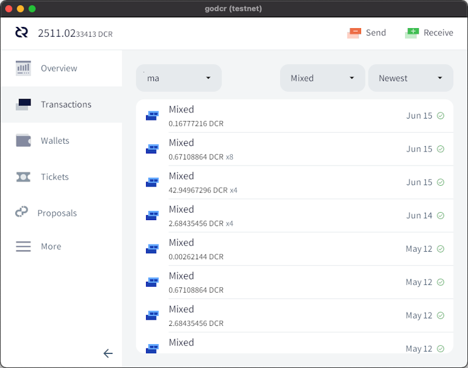
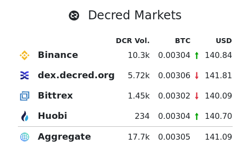
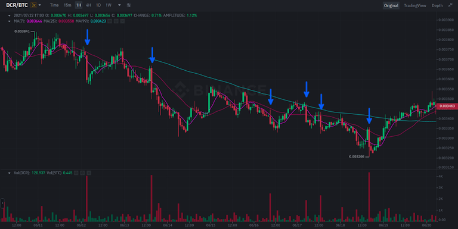

# Decred Journal – August 2021

_Image: Transmutive State by @saender_

- Politeia v1.1.0 has been released and deployed to the proposals site, it adds new features, including expanded metadata and enhanced UI.
- The ticket price finally set a new all time high of 321, which even surpassed the spikes in Decred's history, clearing the way to refer to new ticket price ATHs without any qualification about the early spikes in price.
- Solid progress on a range of Decred software repositories, including progress on 3 different DCPs (7, 8 & 9), and for DCRDEX the Solidity contract for ETH trading is under review on testnet.

Contents:

- [Development](#development)
- [People](#people)
- [Governance](#governance)
- [Network](#network)
- [Ecosystem](#ecosystem)
- [Outreach](#outreach)
- [Events](#events)
- [Media](#media)
- [Markets](#markets)
- [Relevant External](#relevant-external)

## Development

The work reported below has the "merged to master" status unless noted otherwise. It means that the work is completed, reviewed, and integrated into the source code that advanced users can [build and run](https://medium.com/@artikozel/the-decred-node-back-to-the-source-part-one-27d4576e7e1c), but is not yet available in release binaries for regular users.

**[dcrd](https://github.com/decred/dcrd)**

Implementation of the [Revert Treasury Expenditure Policy](https://github.com/decred/dcps/blob/master/dcp-0007/dcp-0007.mediawiki) consensus change (DCP-7) has been [merged](https://github.com/decred/dcrd/pull/2680) (following some [preparations](https://github.com/decred/dcrd/pull/2679) to make it easier to review). If the vote passes, the spend limit will be based on the treasury's historical income and not its historical spends, which in turn unlocks the ability to use the new decentralized treasury.

Merged work towards the [Automatic Ticket Revocations](https://github.com/decred/dcps/blob/master/dcp-0009/dcp-0009.mediawiki) consensus change (DCP-9):

- added a method to get all tickets that [will expire](https://github.com/decred/dcrd/pull/2701) in the next block
- unified vote and revocation [validation](https://github.com/decred/dcrd/pull/2702)
- added a function to create [revocation](https://github.com/decred/dcrd/pull/2707) tx for a given ticket

Other merged work:

- [definitions](https://github.com/decred/dcrd/pull/2713) for [Explicit Version Upgrades](https://github.com/decred/dcps/blob/master/dcp-0008/dcp-0008.mediawiki) consensus change (DCP-8)
- optimized [precomputed](https://github.com/decred/dcrd/pull/2690) math values for ~10% faster signature verification and ~400 KiB smaller `dcrd` binary
- rewritten [NAF conversion](https://github.com/decred/dcrd/pull/2695) to avoid all heap allocations and switch to a faster algorithm, removing another ~1% from signature verification time
- added methods to create and restore [snapshots](https://github.com/decred/dcrd/pull/2715) of spendable coinbase outputs (will allow more efficient tests)
- added config option for maximum [log file](https://github.com/decred/dcrd/pull/2711) size before it is rotated and compressed

**[dcrwallet](https://github.com/decred/dcrwallet)**

- added mixing and VSP support to [`purchaseticket`](https://github.com/decred/dcrwallet/pull/2064) JSON-RPC request
- added [`processunmanagedticket`](https://github.com/decred/dcrwallet/pull/2075) JSON-RPC request to assign an existing ticket to the VSP configured in the user's config file
- added [storing](https://github.com/decred/dcrwallet/pull/2068) of VSP host and public key for each ticket in the wallet database (allows more efficient checking of ticket fee status)
- fixed some duplicate address [watching](https://github.com/decred/dcrwallet/pull/2076) (it was bottlenecking block processing on heavily-used wallets)
- fixed some [hangs](https://github.com/decred/dcrwallet/pull/2081) when locking or shutting down the wallet
- fixed and improved [reorg handling](https://github.com/decred/dcrwallet/pull/2084) in SPV syncing mode

**[Decrediton](https://github.com/decred/decrediton)**

- added a button to [revoke](https://github.com/decred/decrediton/pull/3506) tickets while in SPV mode
- replaced the gap limit setting with one-shot [Discover Address Usage](https://github.com/decred/decrediton/pull/3532) action (that has its own gap limit)
- new UI design for [LN Send](https://github.com/decred/decrediton/pull/3538) and [LN Receive](https://github.com/decred/decrediton/pull/3537) pages

_Decrediton LN Receive page_

**[Politeia](https://github.com/decred/politeia)**

Politeia v1.1.0 has been released and deployed at [proposals.decred.org](https://proposals.decred.org/). Release highlights:

- proposal authors are now required to fill in funding amount, start and end dates, and domain, when submitting proposals (recent proposals like [this](https://proposals.decred.org/record/58d9f46) show this new data at the top)
- [combined](https://github.com/decred/politeiagui/pull/2431) `In Discussion` and `Voting` tabs into one `Under Review` tab to help users quickly see if any proposals are being voted on
- ability to see raw Markdown
- ability to see who censored the proposal and why
- many UI/UX fixes and improvements
- email notifications are now rate limited to prevent malicious users from triggering too many of them and getting Politeia flagged as a spam server
- user database moved to MySQL in order to remove CockroachDB as a dependency and have only one database instance to manage

For more details check the release notes in [politeia](https://github.com/decred/politeia/releases/tag/v1.1.0) and [politeiagui](https://github.com/decred/politeiagui/releases/tag/v1.1.0) repositories.

User-facing changes merged in master (post v1.1.0):

- allow the user to [compare](https://github.com/decred/politeiagui/pull/2524) any two proposal versions
- highlight comment [votes](https://github.com/decred/politeiagui/pull/2520) immediately but show an error if server request failed
- ~7 bug fixes

_Politeia proposal differ_

Backend, internal, and command-line changes (post v1.1.0):

- verify [password](https://github.com/decred/politeia/pull/1490) before expensive wallet operations in `politeiavoter vote` command
- human-readable [currency](https://github.com/decred/politeia/pull/1488) values in `pictl` tool output (e.g. when submitting new proposals with it)
- added CSRF protection to the [login](https://github.com/decred/politeia/pull/1481) route
- added [billing statuses](https://github.com/decred/politeia/pull/1480) (Active, Closed, Completed) to mark whether an approved proposal can or cannot be billed against
- require the [extra data](https://github.com/decred/politeia/pull/1487) fields to be signed when posting or editing comments, and only allow that data if configured in the `comments` plugin (the purpose of these fields is to extend the `comments` plugin with new functionality)
- allow proposal authors to post [updates](https://github.com/decred/politeia/pull/1491) on approved proposals. Each update starts a new comment thread where users can reply and vote, until an admin marks the proposal as either Completed or Closed.
- increased test coverage

**[vspd](https://github.com/decred/vspd)**

- ported [signal](https://github.com/decred/vspd/pull/293) handling improvements from other projects
- smaller fixes and maintenance

**[dcrlnd](https://github.com/decred/dcrlnd)**

- updated to [latest](https://github.com/decred/dcrlnd/pull/138) dcrd and dcrwallet
- added a [script](https://github.com/decred/dcrlnd/pull/139) to generate a simulation network for testing
- added [SPV support](https://github.com/decred/dcrlnd/pull/140) in embedded wallet mode (embedded wallet mode + SPV mode combined allow to run dcrlnd without both dcrd and dcrwallet)

**[DCRDEX](https://github.com/decred/dcrdex)**

User-facing:

- overhauled client [credentials](https://github.com/decred/dcrdex/pull/1015) system. Private keys for each new DEX account are now derived from a single app seed and the server's public key. Also, the single app password used to encrypt sensitive user data is replaced with a pair of keys where the "inner" key is encrypted with the "outer" key. This removes the need to re-encrypt all protected data when the password (and the outer key) is changed.
- added an endpoint to return [app seed](https://github.com/decred/dcrdex/pull/1149) if supplied the correct app password
- added a checkbox to [remember password](https://github.com/decred/dcrdex/pull/1119) for the duration of the session
- make the user aware of available markets and lot sizes before [registration](https://github.com/decred/dcrdex/pull/1135) fee is paid
- allow clients to [cancel](https://github.com/decred/dcrdex/pull/1133) orders while a market is suspended
- fixed [scrolling](https://github.com/decred/dcrdex/pull/1142) issues

Internal:

- use [compact filters](https://github.com/decred/dcrdex/pull/954) on the client to locate counterparty contract redemptions instead of always pulling blocks to check
- do not broadcast swaps if there's any trouble generating or signing the [refund tx](https://github.com/decred/dcrdex/pull/1166)
- initial [internationalization](https://github.com/decred/dcrdex/pull/1051) support on the client (in Go, HTML and JS code)
- automatically check if [localized](https://github.com/decred/dcrdex/pull/1167) templates need to be regenerated
- fixed some shutdown [hangs](https://github.com/decred/dcrdex/pull/1150)
- fixed and improved [reorg testing](https://github.com/decred/dcrdex/pull/669)

Ethereum support:

- initial version of the Solidity [smart contract](https://github.com/decred/dcrdex/pull/1019) for ETH swaps. As the [README](https://github.com/decred/dcrdex/tree/a7046c670b4f824b7b5e237c9efcecbd8fc5e604/dex/networks/eth/contracts) says, it is untested and unsafe for use on mainnet and is intended as a [proof of concept](https://en.wikipedia.org/wiki/Proof_of_concept#Software_development) of ETH swaps. This PR generated a lot of knowledge about Ethereum and contract security, and brought in [code](https://github.com/decred/dcrdex/blob/a7046c670b4f824b7b5e237c9efcecbd8fc5e604/client/asset/eth/rpcclient_harness_test.go#L706) testing for reentry attack vulnerability.
- added swap [gas cost](https://github.com/decred/dcrdex/pull/1157) approximation

Most of these changes are towards the [v0.3 milestone](https://github.com/decred/dcrdex/milestone/12) but some were backported to the [v0.2.x](https://github.com/decred/dcrdex/commits/release-v0.2) release branch.

Check out Decred in Depth [episode 42](https://www.youtube.com/watch?v=dRjAalxS3r8) where @chappjc answered community questions about DCRDEX and working as a Decred developer.

**[dcrandroid](https://github.com/planetdecred/dcrandroid)**

Merged in [dcrlibwallet](https://github.com/planetdecred/dcrlibwallet) library (shared by dcrandroid, dcrios, and godcr):

- [Politeia](https://github.com/planetdecred/dcrlibwallet/pull/202) voting support
- a filter for fetching [unmined](https://github.com/planetdecred/dcrlibwallet/pull/205) tickets (those with no confirmations)
- function to get time till next [ticket price](https://github.com/planetdecred/dcrlibwallet/pull/204) change

Merged in dcrandroid:

- implemented [dark mode](https://github.com/planetdecred/dcrandroid/pulls?q=is%3Apr+dark+merged%3A2021-08-01..2021-08-31+sort%3Aupdated-asc)
- added transaction [details](https://github.com/planetdecred/dcrandroid/pull/573) dialog for tickets
- updated [French](https://github.com/planetdecred/dcrandroid/pull/576) translation
- [upgraded](https://github.com/planetdecred/dcrandroid/pull/571) dependencies and migrated to Kotlin code style
- fixed "StrandHogg" [vulnerability](https://github.com/planetdecred/dcrandroid/pull/581) (one where malicious apps may hijack Android Tasks)

 

_dcrandroid Privacy and Receive on the dark side_

**[dcrios](https://github.com/planetdecred/dcrios)**

- bumped min deployment target to [iOS 12](https://github.com/planetdecred/dcrios/pull/816)
- ~2 bug fixes

**[godcr](https://github.com/planetdecred/godcr)**

- implemented [Politeia](https://github.com/planetdecred/godcr/pull/542) voting
- more informative display of [transaction](https://github.com/planetdecred/godcr/pull/582) lists and details
- added desktop [notifications](https://github.com/planetdecred/godcr/pull/518) when a new incoming transaction or proposal is detected
- new system for in-app (toast) and operating system [notifications](https://github.com/planetdecred/godcr/pull/540)
- show time till next [ticket price](https://github.com/planetdecred/godcr/pull/565) change
- customized notifications for [stake](https://github.com/planetdecred/godcr/pull/560) tx
- implemented [back](https://github.com/planetdecred/godcr/pull/557) navigation
- added [hover](https://github.com/planetdecred/godcr/pull/488) tooltips for ticket data
- introduced [LinearLayout](https://github.com/planetdecred/godcr/pull/563) to simplify layout code
- refactoring and code cleanup
- ~20 bug fixes

_godcr Mixed filter_

**[dcrdata](https://github.com/decred/dcrdata)**

- migrated to the new [Politeia API](https://github.com/decred/dcrdata/pull/1829)
- dependency upgrades and refactoring in preparation to release v6.0 branch

Other:

- Bug Bounty Program posted an [update](https://bounty.decred.org/2021/08/status-update/): 2 vulnerabilities have been patched and made public, and their authors added to the [Hall of Fame](https://bounty.decred.org/#hall_of_fame).

## People

Congratulations to new contractors granted the Decred Contractor Clearance (DCC): [@vibros68](https://github.com/vibros68)!

@raedah gave an interesting [interview](https://medium.com/authority-magazine/the-future-is-now-steven-wagner-of-raedah-group-on-how-their-technological-innovation-will-shake-4f272ced222f) to Authority Magazine talking about a variety of topics, his life experience, and Decred.

> _Can you please give us your favorite "Life Lesson Quote"? Can you share how that was relevant to you in your life?_
> 
> Jiddu Krishnamurti said in some of his books, "You can't drink the word water", and "If the water is clean, drink it". These were simple pointers about reality that the word or idea is not the same as the thing, and that we will need to be able to use our own judgement to determine if a thing is good instead of looking for some external authority to tell us what is true, good, or right. He gave discussions about us being our own source of authority in our lives instead of giving our power away to others or to social institutions. He was the best type of guru because he didn't want to be anyone's guru. He just wanted to send them away, and to hand their power back to them. The best business professionals I know also do this. Their goal is not to make the company depend on them in order to create job security, but rather to solve the problems and automate their job away so that their role is no longer needed. At that point, they can move on to solving the next challenge.

Check [Media](#media) section for other new interviews with Decred community members.

Community stats as of Sep 1:

- [Twitter](https://twitter.com/decredproject) followers: 48,161 (+575)
- [Reddit](https://www.reddit.com/r/decred/) subscribers: 11,597 (+148)
- [Matrix](https://chat.decred.org/) #general users: 522 (+9)
- [Discord](https://discord.gg/GJ2GXfz) users: 2,124 (+164)
- [Telegram](https://t.me/Decred) users: 2,846 (+13)
- [YouTube](https://www.youtube.com/decredchannel) subscribers: 4,610 (+10), views: 194K (+3K)

## Governance

In August the new [treasury](https://dcrdata.decred.org/treasury) received 10,942 DCR worth $1.76M at August's average rate of $161.24. 845 DCR was spent to pay contractors, worth $136K at August's rate, or $108K at July's billing rate of $127.48. As of Sep 2, combined balance of [legacy](https://dcrdata.decred.org/address/Dcur2mcGjmENx4DhNqDctW5wJCVyT3Qeqkx) and new treasury is 713,371 DCR (129 million USD at $187.50).

There were two new proposals published in August, and they have both started voting in early September:

- A third [proposal](https://proposals.decred.org/record/58d9f46) from Monde PR to renew the PR effort by @lindseymmc for another year at a cost of $42,000.

- A [proposal](https://proposals.decred.org/record/150cf81) from @finstreet21 to produce a series of educational videos about Decred for the Indian market, at a cost of $9,800 split across three milestones.

The two proposals submitted in July which voted in August were rejected:

- The [proposal](https://proposals.decred.org/record/ae609f1) to fund a documentary by @frizzers at a cost of $295,000 was rejected with 12.5% approval and turnout of 67%.

- The proposal to fund participation at the Dubai Crypto Expo was rejected with 37.5% approval and a turnout of 67%.

See Politeia Digest [issue 46](https://blockcommons.red/politeia-digest/issue046/) for more details on the month's proposals.

## Network

**Hashrate**: August's [hashrate](https://dcrdata.decred.org/charts?chart=hashrate&zoom=krrqjgnz-kt1oo9gz&scale=linear&bin=block&axis=time) opened at ~316 Ph/s and closed ~360 Ph/s, bottoming at 164 Ph/s and peaking at 413 Ph/s throughout the month.

Distribution of hashrate [reported](https://miningpoolstats.stream/decred) by the pools on Sep 1: Poolin 36%, F2Pool 29%, AntPool 16%, BTC.com 8%, Easy2Mine 5%, Luxor 3%, ViaBTC 1.6%, HuobiPool 1.3%, OKEx 0.14%, CoinMine 0.08%, UUPool 0.07%. These percentages are based on the 244 Ph/s attributed to known pools and do not include ~90 Ph/s from unknown miners. Distribution of 1,000 blocks actually [mined](https://miningpoolstats.stream/decred) before Sep 1 mostly confirmed these numbers.

**Staking**: [Ticket price](https://dcrdata.decred.org/charts?chart=ticket-price&zoom=krrqjgnz-kt1oo9gz&axis=time&visibility=true-true&mode=stepped) varied between 120.1-321.6 DCR, with 30-day [average](https://dcrstats.com/) at 193.8 DCR (+3.1).

The [locked amount](https://dcrdata.decred.org/charts?chart=ticket-pool-value&zoom=krrqjgnz-kt1oo9gz&scale=linear&bin=block&axis=time) was 7.23-8.12 million DCR, meaning that 54.5-61.1% of the circulating supply [participated](https://dcrdata.decred.org/charts?chart=stake-participation&zoom=krrqjgnz-kt1oo9gz&scale=linear&bin=block&axis=time) in proof-of-stake.

The ticket price [went down](https://www.reddit.com/r/decred/comments/p4drzc/whats_up_with_the_decred_ticket_price/) to 120 DCR and then shot up to a new all-time high of 321.6 DCR. The staking participation also reached a new ATH of 61.1%.

**VSP**: On Sep 1, ~8,100 (-500) live tickets were managed by [listed](https://decred.org/vsp/) vspd servers and ~250 (-150) by listed legacy dcrstakepool servers. Collectively the 11 legacy and 15 new VSPs managed 21% (-1.9%) of the ticket pool. Unlisted but still active legacy VSPs managed 40 live tickets.

**Nodes**: Throughout August there were around 205 reachable nodes according to [dcrextdata](https://dcrextdata.planetdecred.org/nodes).

Node versions as of Sep 1 [snapshot](https://nodes.jholdstock.uk/user_agents) (252 dcrd nodes): v1.6.2 - 56%, v1.6.0 - 14%, v1.6.1 - 12%, v1.7 dev builds - 13%, v1.6 dev builds - 2.4%, v1.5.2 - 2%, v1.5.1 - 0.4%.

The share of [mixed coins](https://dcrdata.decred.org/charts?chart=coin-supply&zoom=jyefppu5-kub1inpe&bin=day&axis=time&visibility=true-true-true) varied between 46.1-50.5% and crossed the 50% [milestone](https://twitter.com/lukebp_/status/1427980967789187076). Daily [mixed amount](https://dcrdata.decred.org/charts?chart=privacy-participation&zoom=krmqf4vr-kt3wbm67&bin=day&axis=time) varied between 200-786K DCR and also set a new record.

Many new all-time highs have been nicely summarized in @bochinchero's latest on-chain metrics [recap](https://twitter.com/TheBochinchero/status/1433834350353784875).

## Ecosystem

Welcome the [new](https://github.com/decred/dcrwebapi/pull/147) VSP at [synergy-crypto.net](https://vspd.synergy-crypto.net/) with 0.75% fee (and extra thanks for running a [testnet](https://vspd-testnet.synergy-crypto.net/) instance).

The following legacy VSP have been removed from public [listing](https://decred.org/vsp/):

- [dcr.farm](https://dcr.farm) - its legacy page has been redirecting to [vspd](https://vsp.dcr.farm/) since June (when it [had](https://github.com/decred/dcrwebapi/issues/146#issuecomment-865451784) 32 live tickets)
- [stakey.net](https://stakey.net) - the page has been replaced with vspd UI, but its [legacy API](https://stakey.net/api/v2/stats) is still up and reports how many live tickets remain (38 as of Sep 1)

raqamiya.net has shut down its legacy VSP. The closing procedure started in March when it was [delisted](https://github.com/decred/dcrwebapi/pull/132) and users were notified via email, website, and [March DJ](202103.md#integrations) to not buy any new tickets. Raqamiya then continued to vote on existing tickets for ~4 months before closing on Aug 16. A few users missed all notices and kept assigning tickets to this VSP until the end, resulting in 11 live tickets at the moment of shutdown. This can happen with any legacy VSP because [dcrstakepool](https://github.com/decred/dcrstakepool) has no way to reject ticket registrations (unlike the new vspd protocol).

For anyone still using legacy VSP, it is recommended to switch to [vspd providers](https://decred.org/vsp/) to avoid the risk of missed tickets, e.g. as a result of shutting down or if dcrstakepool stops working with the upcoming consensus upgrades. As of Sep 1, legacy VSPs managed less than 300 tickets, or 0.7% of the ticket pool.

New exchange integrations:

- Bitfinex [launched](https://twitter.com/bitfinex/status/1423210403774009345) DCR/USD trading
- Bitcoin.com Exchange [enabled](https://twitter.com/BitcoinComExch/status/1423589830672457733) DCR trading with BTC, ETH and USDT

Hotbit Korea has delisted its DCR/KRW pair, as [reported](https://twitter.com/DecredKorea/status/1425751145796956167) by @DecredKorea (the pair went live in [Nov 2020](https://twitter.com/Hotbit_Korea/status/1331412789416534017)).

Warning: the authors of the Decred Journal have no idea about the trustworthiness of any of the services above. Please do your own research before trusting your personal information or assets to any entity.

Join our [#services](https://chat.decred.org/#/room/#services:decred.org) chat to follow Decred ecosystem updates.

## Outreach

Monde PR had a scaled back month after its second [proposal](https://proposals.decred.org/proposals/c81926b) has ended in July. @l1ndseymm kept current opportunities moving along and responded to incoming queries while working on the [third proposal](https://proposals.decred.org/record/58d9f46) that starts in September.

## Events

Decred became a supporter of an educational program about crypto and blockchain tech organized by the Business School of the Catholic University of Argentina and Bitcoin Argentina NGO. Decred was [invited](https://matrix.to/#/!clHjlICBEtCtAdTupf:decred.org/$-CkRPUnXB8spWofBTk3nA3UAr2u4ofpCIzaoCJuoUag) as a result of past connections between Bitcoin Argentina and our [Spanish](https://twitter.com/Decred_ES) outreach team, and will be included in marketing materials (along other brands). The [workshop](http://uca.edu.ar/es/blockchain-y-criptoactivos) starts on Sep 8 and will run for 10 weeks.

## Media

Selected articles:

- The Suppressor part 1: War of attrition by @tacorevenge ([medium](https://medium.com/@tacorevenge/the-suppressor-part-1-war-of-attrition-3081a61b202b))
- The future is now: Steven Wagner of Raedah Group on how their technological innovation will shake up the tech scene by Fotis Georgiadis ([medium](https://medium.com/authority-magazine/the-future-is-now-steven-wagner-of-raedah-group-on-how-their-technological-innovation-will-shake-4f272ced222f))
- One of the most profitable cryptos to mine is one you may have never heard of, and it's up 1,300% from its 2020 low. Mining-farm CEO Josh Metnick explains the crypto, and which miners and pools to use. by Laila Maidan ([businessinsider.com](https://www.businessinsider.com/profitable-crypto-to-mine-according-to-ceo-mining-farm-navier-2021-8), paywalled ([kind of](https://twitter.com/exitusdcr/status/1429414135582937088)))

> "It's a highly legitimate project. Relatively speaking, like in crypto years, it's been around for a while. And there are some smart, ethical people involved in it" Metnick said.

Videos:

- Decred in Depth 41 - Stephen Palley + Gabriel Shapiro (Lexnode) + Luke Powell by @elima\_iii ([youtube](https://www.youtube.com/watch?v=9TXoyRv_Z8U))
- Decred in Depth 42 - Jonathan Chappelow + DCRDEX by @elima\_iii ([youtube](https://www.youtube.com/watch?v=dRjAalxS3r8))
- Decred News August - Blockchain governance in action, new network highs, exciting proposals & more! by @Exitus ([youtube](https://www.youtube.com/watch?v=6ifueUAWy_c))
- Decred's ticket voting system - Decred Fundamentals by @phoenixgreen ([youtube](https://www.youtube.com/watch?v=LEO0vHdY3gs))
- Tax education and Decred by @phoenixgreen ([youtube](https://www.youtube.com/watch?v=-26obfV2e84))
- Decred is heating up for something big by @phoenixgreen ([youtube](https://www.youtube.com/watch?v=n6ATfW_vnCg))
- Decred Price Analysis - 4th August 2021 by Brave New Coin ([youtube](https://www.youtube.com/watch?v=NOlvAI43VSY))

Decred was mentioned by Chris Burniske in July's [Original Sins of Crypto](https://www.youtube.com/watch?v=gLbzfZKf_ro&t=1h05m42s) interview with Jason Yanowitz of Blockworks:

> Jason: How do you trust though... Like, everyone is democratic, until they get power and then power corrupts. I love the concept of a DAO and I love the concept of DeFi but my biggest concern is, are we just trusting these "DeFi DAO CEOs" that they'll decentralize and give away power?
> 
> Chris: It really depends on the genesis of the DAO. Not all DAOs are equal. This is where for me the gold standard of how a DAO was started is still Decred.

Translations:

- Decred Journal July 2021 was [translated](https://xaur.github.io/decred-news/) to Arabic (@arij, @abdulrahman4), Chinese (@Dominic), and Spanish (@francov\_). Thank you to all translators for spreading the word!

Share your translations in our [#translations](https://chat.decred.org/#/room/#translations:decred.org) chat room.

## Markets

In August DCR was trading between USD 126.50-181.26 / BTC 0.0032-0.0038. The average daily rate was $161.24.

dcrdata now [shows](https://twitter.com/longtermdaily/status/1433148588608004097) [price](https://explorer.dcrdata.org/market?chart=candlestick&xc=dcrdex&bin=1d) and trading [volume](https://explorer.dcrdata.org/market?chart=volume&xc=dcrdex&bin=1d) history for the BTC/DCR pair at DCRDEX.

_DCRDEX volume finally exposed_

A new mysterious contributor @tacorevenge published the [first part](https://medium.com/@tacorevenge/the-suppressor-part-1-war-of-attrition-3081a61b202b) of an investigation of The Suppressor entity that some community members suspect of manipulating DCR markets.

_Odd high-volume selling_

## Relevant External

Some U.S. lawmakers got surprisingly selective about consensus algorithms and only excluded [proof-of-work mining](https://news.bitcoin.com/white-house-backs-crypto-tax-amendment-endorsing-proof-of-work-infrastructure-bill/) from the definition of "brokers" - which includes "any person who (for consideration) is responsible for and regularly provides any service effectuating transfers of digital assets". This broad definition has been [criticized](https://twitter.com/jchervinsky/status/1421150347788263433) as potentially applying to virtually every economic actor in the industry, and became the subject of a crypto lobbying effort to replace that language with some that is more specific and explicitly excludes all validators and software developers. There was a version of the bill which had support from a number of Senators which would have tightened the language up in this way, but due to Senate procedure no amendments were considered and the bill with the broad definition was [passed](https://www.coindesk.com/markets/2021/08/10/us-senate-sends-infrastructure-bill-to-house/) on to the House of Representatives.

A16Z, a VC with stakes in many crypto networks, has [published](https://a16z.com/2021/08/26/open-sourcing-our-token-delegate-program/) its "Token Delegate Program". The document explains why A16Z has decided to delegate its voting rights (they hold so many tokens that decision-making would be centralized otherwise). It also explains how they choose the delegates, around 50% of their delegations are to University based organizations with the remainder to startups and non-profits.

A Uniswap proposal from Flipside crypto caused some [controversy](https://twitter.com/DuneAnalytics/status/1428250340139356164) in the community as it breezed through early rounds of voting, it would have used $25M worth of UNI to generate yield that paid the Flipside team to produce "community-enabled analytics". One of the issues raised was that the entities named to oversee the grant included people who would benefit from it. All of the other providers of analytics were unimpressed by Flipside's attempt to get UNI to fund 8 full time employees for their company.

NFT mania reached new heights with the [LOOT](https://techcrunch.com/2021/09/03/loot-games-the-crypto-world) (for adventurers) drop, images with white text describing adventure game items on a black background, which were soon selling for upwards of 10 ETH each. The idea behind LOOT is that once the range of items and their scarcity is determined initially then people will add all of the aspects usually associated with games (visual representation of the item, stats, a _game world_ to use it in) afterward. Little attention seems to have been given to incentivizing this work so far however, rather LOOT's main feature at this stage seems that it entitles the holder to receive a range of similarly vacuous airdrops. Are we moving past "build it and they will come", to "sell them some placeholders for a high price and someone is bound to show up and build it"?

Also, it looks like the LOOT drop was heavily [gamed](https://twitter.com/IAMTHETORN/status/1434401460876369923) by people with expert knowledge, who were able to guarantee rare items in their bags.

A fake Banksy NFT was [sold](https://www.cnbc.com/2021/09/01/banksy-website-promotes-fake-nft-in-apparent-hack.html) for $300,000 after the graffiti artist's website was apparently hacked to add a page introducing this NFT and linking to its listing on Opensea. The scammer subsequently returned buyer's ETH for unstated reasons.

That's all we have for August. Share your updates for the next issue in our [#journal](https://chat.decred.org/#/room/#journal:decred.org) chat room.

## About

This is issue 41 of Decred Journal. Index of all issues, mirrors, and translations is available [here](https://xaur.github.io/decred-news/).

Most information from third parties is relayed directly from source after a minimal sanity check. The authors of the Decred Journal have no ability to verify all claims. Please beware of scams and do your own research.

Credits (alphabetical order):

- writing and editing: bee, degeri, richardred
- reviews and feedback: davecgh, l1ndseymm, lukebp, matheusd
- title image: saender
- funding: Decred stakeholders
