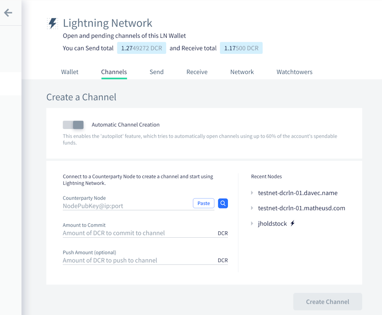
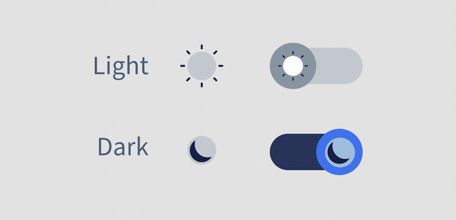
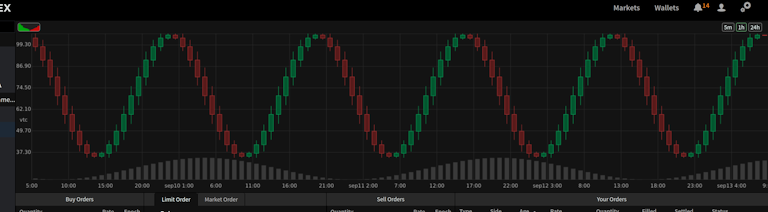
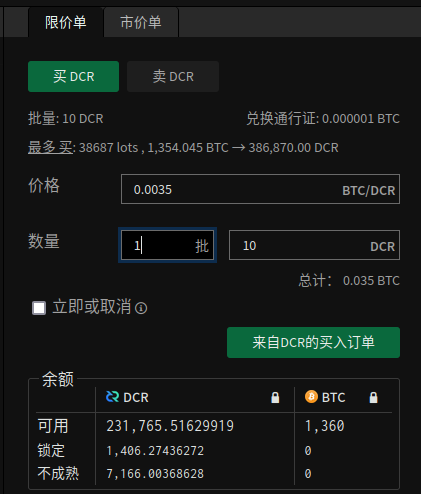
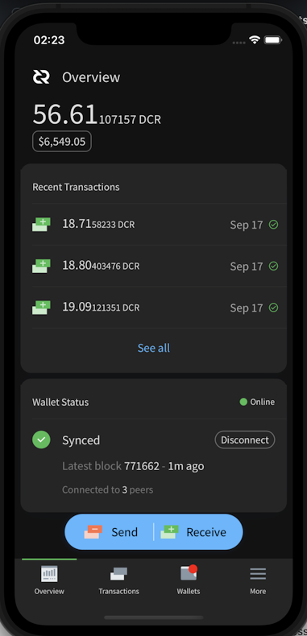
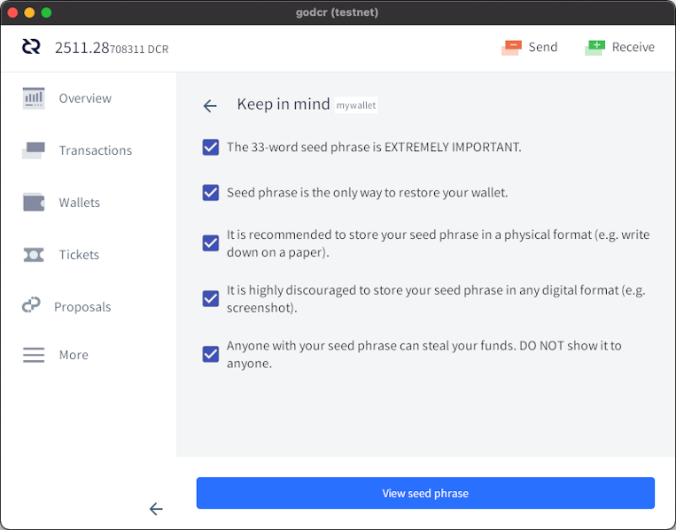
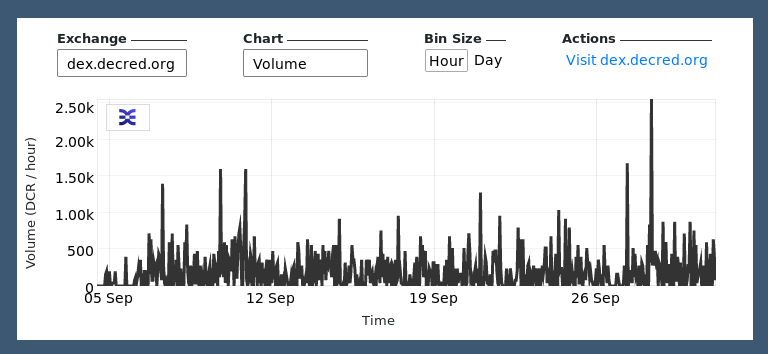

# Decred Journal – September 2021

_Image: Fourier's Square by @saender_

September's highlights:

- Work on the DCP-8 and DCP-9 consensus changes has been completed, they are ready to be introduced for an on-chain vote to ratify them.
- Politeia has been updated to v1.2, adding features like proposal updates and the capacity to make comparisons between any two versions of a proposal.
- The Android and iOS mobile wallets saw new releases in their respective app stores.
- GoDCR reached its first functional testnet build, demonstrating what has been achieved by that project so far, as the proposal for continued funding of GoDCR was published and discussed.

Contents:

- [Development](#development)
- [People](#people)
- [Governance](#governance)
- [Network](#network)
- [Ecosystem](#ecosystem)
- [Outreach](#outreach)
- [Media](#media)
- [Markets](#markets)
- [Relevant External](#relevant-external)

## Development

The work reported below has the "merged to master" status unless noted otherwise. It means that the work is completed, reviewed, and integrated into the source code that advanced users can [build and run](https://medium.com/@artikozel/the-decred-node-back-to-the-source-part-one-27d4576e7e1c), but is not yet available in release binaries for regular users.

**[dcrd](https://github.com/decred/dcrd)**

_dcrd is a full node implementation that powers Decred's peer-to-peer network around the world._

Explicit Version Upgrades consensus change ([DCP-8](https://github.com/decred/dcps/blob/master/dcp-0008/dcp-0008.mediawiki)):

- new consensus rules have been [implemented](https://github.com/decred/dcrd/pull/2716). Once activated, unknown transaction and script versions will be rejected until they have explicitly been enabled by another consensus change. Coins that were spendable before activation will remain spendable. This change will provide greater network security and allow developers to write more bug-proof code, as explained in [proposal](https://proposals.decred.org/record/3a98861) comments, [DCP-8](https://github.com/decred/dcps/blob/master/dcp-0008/dcp-0008.mediawiki), and a recent dev [discussion](https://github.com/decred/dcrd/pull/2719#issuecomment-909535320).
- @davecgh posted a [proposal update](https://proposals.decred.org/record/3a98861/comments/21) that all dcrd development work is complete

Automatic Ticket Revocations consensus change ([DCP-9](https://github.com/decred/dcps/blob/master/dcp-0009/dcp-0009.mediawiki)):

- [preparations](https://github.com/decred/dcrd/pull/2718): added tests, added agenda definitions, reorganized code to fit upcoming changes. A new transaction priority was introduced to ensure automatic revocations are always created. Full list of priorities becomes: votes (highest) > automatic revocations > tickets > regular transactions and revocations (lowest).
- [implemented](https://github.com/decred/dcrd/pull/2720) the actual consensus change. Once activated, blocks will be required to contain revocations for all tickets that become missed or expired as of that block. New rules will also allow unlocking some [~200K DCR](https://github.com/decredcommunity/proposals/blob/master/proposals/e2d7b7d/docs/unrevoked-missed-tickets.md) that got stuck in unrevoked missed tickets.
- @rstaudt2 posted a [proposal update](https://proposals.decred.org/record/e2d7b7d/comments/19) that all dcrd development work is complete

Other merged work:

- implemented spend journal [pruning](https://github.com/decred/dcrd/pull/2641) that delays removal of spend journal entries until they are no longer used (this is needed for [asynchronous indexing](https://github.com/decred/dcrd/issues/1470) that will speed up block validation)
- added more tests for address manager and [decoupled](https://github.com/decred/dcrd/pull/2596) it from `wire` package, in preparation for upcoming changes in the wire protocol
- pinned [Docker](https://github.com/decred/dcrd/pull/2735) images and GitHub [Actions](https://github.com/decred/dcrd/pull/2736) with hashes instead of tags for better supply chain security
- reworked [Docker](https://github.com/decred/dcrd/pull/2740) support to provide an image with a strong focus on security. It only includes Decred-specific binaries ("distroless") and runs them as an unprivileged user. The new final image is around 10 MB, compared to ~1 GB for the previous version.
- code upgraded to use [Go 1.16](https://github.com/decred/dcrd/pull/2722) features
- updated module [hierarchy](https://github.com/decred/dcrd/pull/2744) graph

> Huge dcrd release brewing... including 3 consensus votes, ~30% faster syncing, and much more. ([@rstaudt2](https://twitter.com/rstaudt2/status/1443668800679858181))

**[dcrwallet](https://github.com/decred/dcrwallet)**

_dcrwallet is a wallet server used by command-line and graphical wallet applications._

- allow processing [VSP fees](https://github.com/decred/dcrwallet/pull/2058) for already bought tickets when the ticketbuyer is off
- changed the default `ticketbuyer` [limit](https://github.com/decred/dcrwallet/pull/2086) to 1 max tickets per block
- allow to [disable](https://github.com/decred/dcrwallet/pull/2088) account discovery (allows to optimize clients that don't need it such as dcrlnd)
- added config option for max [log size](https://github.com/decred/dcrwallet/pull/2077) before it is rotated
- code upgraded to [Go 1.16](https://github.com/decred/dcrwallet/pull/2085) and latest [dcrd](https://github.com/decred/dcrwallet/pull/2087) modules
- fixed some issues with processing and confirming [fee payments](https://github.com/decred/dcrwallet/pull/2083) for VSP-managed tickets
- fixed [fee calculation](https://github.com/decred/dcrwallet/pull/2057) for multisig transactions
- fixed a potential [race](https://github.com/decred/dcrwallet/pull/2089) issue in SPV mode

**[Decrediton](https://github.com/decred/decrediton)**

_Decrediton is a full-featured desktop wallet app with integrated voting, StakeShuffle mixing, Lightning Network, DEX trading, and more. It runs with or without a full blockchain (SPV mode)._

- implemented new UI design for [LN Channels](https://github.com/decred/decrediton/pull/3543) tab
- update all accounts' [passphrases](https://github.com/decred/decrediton/pull/3546) on private passphrase change
- fixed some issues with syncing VSP fee [payment status](https://github.com/decred/decrediton/pull/3545)
- fixed 3 bugs when [creating](https://github.com/decred/decrediton/pull/3554) a wallet
- fixed legacy VSP [errors](https://github.com/decred/decrediton/pull/3561) being shown in new VSP mode
- fixed missing [navigation](https://github.com/decred/decrediton/pull/3558) links
- fixed [blurring](https://github.com/decred/decrediton/pull/3555) when restoring a Trezor wallet
- fixed [crashes](https://github.com/decred/decrediton/pull/3548) caused by processing very large transactions
- fixed [change](https://github.com/decred/decrediton/pull/3553) from mixed sends being sent to a wrong address

_Decrediton LN Channels page_

**[Politeia](https://github.com/decred/politeia)**

_Politeia is Decred's proposal system. It is used to request funding from the Decred treasury._

Another feature and bugfix release has [landed](https://twitter.com/lukebp/status/1442540461244043264) on [Politeia](https://proposals.decred.org/) website! Highlights of v1.2.0:

- proposal author updates for approved proposals
- compare any two proposal versions
- embed image button
- optimistic instant comment vote updates
- server: proposal billing status, to formalize whether billing is allowed or not
- server: unified proposal status to simplify clients
- server: increased security and stability

For more details check the release notes in [politeia](https://github.com/decred/politeia/releases/tag/v1.2.0) and [politeiagui](https://github.com/decred/politeiagui/releases/tag/v1.2.0) repositories.

User-facing changes merged in September:

- integrated new proposal [status](https://github.com/decred/politeiagui/pull/2609) and admin ability to set billing status
- improved UX of [embedding images](https://github.com/decred/politeiagui/pull/2567)
- show login modal when user session [expires](https://github.com/decred/politeiagui/pull/2541)
- added [SEO meta tags](https://github.com/decred/politeiagui/pull/2614) to improve placement in search results and enable nice previews on Twitter and Facebook
- updated dark mode [toggle](https://github.com/decred/politeiagui/pull/2588) design
- ~18 GUI bug fixes and ~3 enhancements

Backend, internal, and command-line changes:

- added unified [proposal status](https://github.com/decred/politeia/pull/1515) that serves as a single source for proposal metadata from different plugins, thus removing complexity from clients and also reducing the load on the server. The new status can be queried with `pictl proposalsummaries` command.
- added high-level interfaces for [file system checks](https://github.com/decred/politeia/pull/1512) to verify data integrity and rebuild caches on startup. [Implementations](https://github.com/decred/politeia/issues/1511) for individual components will be done separately.
- implemented cache rebuild for the [record inventory](https://github.com/decred/politeia/pull/1520) when file system check is enabled with `--fsck`
- added option to save `pictl`'s vote results output [as CSV](https://github.com/decred/politeia/pull/1478)
- added read and write [timeouts](https://github.com/decred/politeia/pull/1505) for both `politeiad` and `politeiawww` servers
- refactored middleware in [`politeiad`](https://github.com/decred/politeia/pull/1507) and [`politeiawww`](https://github.com/decred/politeia/pull/1506) servers and added read limits for client requests and WebSocket messages
- added [page sizes](https://github.com/decred/politeia/pull/1518) to policy responses
- added documentation: [exported API](https://github.com/decred/politeia/pull/1497) docs, [plugin](https://github.com/decred/politeia/pull/1519) system overview, and writing [E2E tests](https://github.com/decred/politeiagui/pull/2591)
- fixed a memory [leak](https://github.com/decred/politeia/pull/1500)
- ~4 other backend bug fixes
- increased backend and end-to-end UI test coverage

_Politeia dark mode icon. Shoutout to our designers @MariaPleshkova and @linnutee!_

**[vspd](https://github.com/decred/vspd)**

_vspd is server software for running a Voting Service Provider. A VSP votes on behalf of its users 24/7 and cannot steal funds._

- added architecture [diagram](https://github.com/decred/vspd/pull/296) to the [Deployment Guide](https://github.com/decred/vspd/blob/master/docs/deployment.md)
- updated handling of dcrd's [errors](https://github.com/decred/vspd/pull/295)
- more reliable value [comparison](https://github.com/decred/vspd/pull/294) in tests

**[dcrpool](https://github.com/decred/dcrpool)**

_dcrpool is server software for running a mining pool._

- upgraded to use [Go 1.16](https://github.com/decred/dcrpool/pull/335) features
- fixed handling of blocks that got [reorged](https://github.com/decred/dcrpool/pull/336) off the chain

**[dcrlnd](https://github.com/decred/dcrlnd)**

_dcrlnd is Decred's Lightning Network node software. LN enables instant and low-cost transactions._

- added a switch to save [memory profiles](https://github.com/decred/dcrlnd/pull/144)

**[DCRDEX](https://github.com/decred/dcrdex)**

_DCRDEX is a non-custodial exchange for trustless trading, powered by atomic swaps._

User-facing:

- added historical [candlestick chart](https://github.com/decred/dcrdex/pull/1208)
- recognize [`rpcconnect`](https://github.com/decred/dcrdex/pull/1206) Bitcoin config parameter

_DCRDEX candlestick chart. Not investment advice._

Backend and internal changes:

- added infrastructure for paying the registration fee in [assets](https://github.com/decred/dcrdex/pull/1202) other than DCR, implemented reg fees in BTC
- refactoring to prepare for [Bitcoin SPV](https://github.com/decred/dcrdex/pull/1089) support
- more fine-grained [rate limiting](https://github.com/decred/dcrdex/pull/1192) to protect against network attacks
- optimized [restoring](https://github.com/decred/dcrdex/pull/1183) account from seed
- simplified the procedure of changing [lot sizes](https://github.com/decred/dcrdex/pull/1212) (the minimum trade amount)
- discover accounts [earlier](https://github.com/decred/dcrdex/pull/1201) in the flow (to support multi-asset fees)
- simplified check for wallet [ownership](https://github.com/decred/dcrdex/pull/1193) when changing wallet settings
- added [`usermatches`](https://github.com/decred/dcrdex/pull/1213) command-line app for retrieving match data and saving it as CSV

Work towards internationalization:

- added [translation](https://github.com/decred/dcrdex/pull/1127) support to the web client UI
- improved system for translating [notifications](https://github.com/decred/dcrdex/pull/1197)
- added a `dexc` switch to re-translate templates on the fly (allows faster iteration)
- added [Portuguese](https://github.com/decred/dcrdex/pull/1185) and [Chinese](https://github.com/decred/dcrdex/pull/1207) translations

_DCRDEX Chinese translation preview_

Internal changes towards Ethereum support:

- added a tool to [verify](https://github.com/decred/dcrdex/pull/1203) swap contract deployed on the Ethereum network (can be used to detect an unexpected change of the contract)
- added decoding and validation of [transactions](https://github.com/decred/dcrdex/pull/1215) while they are in the mempool (allows to fail fast before a malformed tx is mined)
- implemented estimation of [max order](https://github.com/decred/dcrdex/pull/1184) the wallet may place

**[Decred Wallet (Android)](https://github.com/planetdecred/dcrandroid)**

Decred Wallet v1.6.1 has been released on [Google Play Store](https://play.google.com/store/apps/details?id=com.decred.dcrandroid.mainnet)!

Privacy-minded users can now also get the signed APK directly from the [GitHub release](https://github.com/planetdecred/dcrandroid/releases/tag/v1.6.1).

Merged in September:

- added settings option to choose app [theme](https://github.com/planetdecred/dcrandroid/pull/582)
- allow wallet unlock attempts with an [empty](https://github.com/planetdecred/dcrandroid/pull/585) passphrase

Merged in [dcrlibwallet](https://github.com/planetdecred/dcrlibwallet) library (shared by Android/iOS wallets and GoDCR):

- added various data queries to support multi-wallet [staking](https://github.com/planetdecred/dcrlibwallet/pull/206) overview

See the new mobile wallets [proposal](https://proposals.decred.org/record/6db3c4e) to learn about the development roadmap for 2021-2022.

**[Decred Wallet (iOS)](https://github.com/planetdecred/dcrios)**

Decred Wallet v1.6.1 has been released on [App Store](https://apps.apple.com/us/app/decred-wallet/id1462247643)!

Merged in September:

- implemented [dark mode](https://github.com/planetdecred/dcrios/pull/812)
- [notify](https://github.com/planetdecred/dcrios/pull/853) users that accounts cannot be deleted once created
- allow wallet unlock attempts with an [empty](https://github.com/planetdecred/dcrios/pull/827) passphrase
- ~5 bug fixes and ~2 UI tweaks

_Decred Wallet (iOS) Dark Overview_

**[GoDCR](https://github.com/planetdecred/godcr)**

_GoDCR is a lightweight desktop wallet app with integrated staking, privacy, and Politeia browsing._

First testnet build is [available](https://twitter.com/planetdecred/status/1441164793470087187) for preview! Download it from the [GitHub release](https://github.com/planetdecred/godcr/releases) and verify the signatures. If you plan to hunt for bugs, it is recommended to build from the latest [source](https://github.com/planetdecred/godcr) to have all recent bug fixes.

User-facing changes merged:

- split big seed backup flow into [steps](https://github.com/planetdecred/godcr/pull/587)
- added ["Advanced mode"](https://github.com/planetdecred/godcr/pull/614) link to Send page, which allows to manually select coins to spend in the transaction (this privacy feature is also [known](https://en.bitcoin.it/wiki/Privacy#Coin_control) as ["coin control"](https://bitcoin.design/guide/payments/send/coin-selection/#manual-coin-selection-aka-coin-control))
- added [hover](https://github.com/planetdecred/godcr/pull/586) effects to numerous [widgets](https://github.com/planetdecred/godcr/pull/624)
- show [rescan](https://github.com/planetdecred/godcr/pull/629) progress in Overview
- improved UX for [creating](https://github.com/planetdecred/godcr/pull/622) wallets and accounts
- allow closing [dropdowns](https://github.com/planetdecred/godcr/pull/616) by clicking outside
- improved rendering of Markdown [tables](https://github.com/planetdecred/godcr/pull/529)
- refactored [ticket](https://github.com/planetdecred/godcr/pull/567) fetching and display
- optimized UX of language and currency selection [modals](https://github.com/planetdecred/godcr/pull/626)
- added [Spanish](https://github.com/planetdecred/godcr/pull/521) translation
- fixed [blurry](https://github.com/planetdecred/godcr/pull/618) icons on higher resolutions
- ~7 other UX tweaks and ~17 bug fixes

Internal and developer changes:

- fixed building on [FreeBSD](https://github.com/planetdecred/godcr/pull/627)
- added [makefile](https://github.com/planetdecred/godcr/pull/628) to manage target OS builds
- [embedded](https://github.com/planetdecred/godcr/pull/620) assets in app binary

_GoDCR seed education_

In progress:

- [DEX](https://github.com/planetdecred/godcr/pull/637) integration (building on base [support](https://github.com/planetdecred/dcrlibwallet/pull/210) in dcrlibwallet)

Check the second [GoDCR proposal](https://proposals.decred.org/record/f7d9fc8) for a status update and 2021-2022 roadmap.

**[dcrdata](https://github.com/decred/dcrdata)**

_dcrdata is an explorer for Decred blockchain and off-chain data like Politeia proposals, markets, and more._

User-facing changes:

- implemented DCRDEX [candlestick](https://github.com/decred/dcrdata/pull/1854) chart on the [Market](https://explorer.dcrdata.org/market?chart=candlestick&xc=dcrdex&bin=1d) page
- show transaction and script [versions](https://github.com/decred/dcrdata/pull/1863) on tx page
- added support for [Pay-to-Pubkey](https://github.com/decred/dcrdata/pull/1871) (P2PK) [address type](https://devdocs.decred.org/developer-guides/addresses/)
- restored desktop [notifications](https://github.com/decred/dcrdata/pull/1866)
- added [SEO meta tags](https://github.com/decred/dcrdata/pull/1870) for prettier search results and previews in social media
- ~2 bug fixes

Internal changes:

- switched to a new [trylock](https://github.com/decred/dcrdata/pull/1868) implementation
- reduced [reliance](https://github.com/decred/dcrdata/pull/1855) on dcrd's RPC packages
- upgraded to latest [dcrd](https://github.com/decred/dcrdata/pull/1849)
- removed abandoned [notify.js](https://github.com/decred/dcrdata/pull/1867) dependency

Tip: bleeding-edge development version of dcrdata can be accessed at [tip.dcrdata.org](https://tip.dcrdata.org/).

**[dcrdevdocs](https://github.com/decred/dcrdevdocs)**

_dcrdevdocs is a source code for Decred [developer documentation](https://devdocs.decred.org/)._

- added [dark mode](https://github.com/decred/dcrdevdocs/pull/97) _(of course)_
- removed [inline HTML](https://github.com/decred/dcrdevdocs/pull/98) (helps to detect broken links)
- updated MkDocs and Python [versions](https://github.com/decred/dcrdevdocs/pull/99)

Other:

- [Bug Bounty](https://bounty.decred.org/) program got two [scope](https://github.com/decred/dcrbounty/pull/81) [updates](https://github.com/decred/dcrbounty/pull/83): replaced dcrstakepool with vspd, removed dcrdocs, and clarified rules for atomicswap.

## People

Welcome to new first-time contributors with code merged to master: @naveensrinivasan ([dcrd](https://github.com/decred/dcrd/commits?author=naveensrinivasan))!

Community stats as of Oct 2:

- [Twitter](https://twitter.com/decredproject) followers: 48,673 (+512)
- [Reddit](https://www.reddit.com/r/decred/) subscribers: 11,954 (+357)
- [Matrix](https://chat.decred.org/) #general users: 535 (+13)
- [Discord](https://discord.gg/GJ2GXfz) users: 2,077 (-47)
- [Telegram](https://t.me/Decred) users: 2,909 (+63)
- [YouTube](https://www.youtube.com/decredchannel) subscribers: 4,610 (+0), views: 196K (+2K)

## Governance

In September the new [treasury](https://dcrdata.decred.org/treasury) received 10,274 DCR worth $1.4M at September's average rate of $139.56. 590 DCR was spent to pay contractors, worth $82K at September's rate, or $95K at August's billing rate of $161.24. As of Oct 2, combined balance of [legacy](https://dcrdata.decred.org/address/Dcur2mcGjmENx4DhNqDctW5wJCVyT3Qeqkx) and [new treasury](https://dcrdata.decred.org/treasury) is 723,528 DCR (83.5 million USD at $115.45).

Two new proposals were submitted, both by @raedah, requesting renewed funding for [GoDCR](https://proposals.decred.org/record/f7d9fc8) and [Mobile Wallets](https://proposals.decred.org/record/6db3c4e).

Voter participation reached new heights, with both of the votes this month seeing turnout above the previous record level.

- The PR [proposal](https://proposals.decred.org/record/58d9f46) from Monde was approved with 97.5% approval and a turnout of 75%.
- The [proposal](https://proposals.decred.org/record/150cf81) to fund an educational video series for the Indian market, from @finstreet21, was rejected with 45% approval and turnout of 77%.

The long-awaited proposal [author updates](https://github.com/decred/politeia/issues/1473) feature is now live on Politeia and has already been used by two [development](https://proposals.decred.org/record/3a98861) [proposals](https://proposals.decred.org/record/e2d7b7d) to report progress.

See Politeia Digest [issue 46](https://blockcommons.red/politeia-digest/issue046/) and [issue 47](https://blockcommons.red/politeia-digest/issue047/) for more details on the month's proposals.

## Network

**Hashrate**: September's [hashrate](https://dcrdata.decred.org/charts?chart=hashrate&zoom=kszlo86g-ku72gu79&scale=linear&bin=block&axis=time) opened at ~355 Ph/s and closed ~228 Ph/s, bottoming at 190 Ph/s and peaking at 449 Ph/s throughout the month.

Distribution of hashrate [reported](https://miningpoolstats.stream/decred) by the pools on Oct 1: Poolin 36%, F2Pool 25%, AntPool 22%, BTC.com 5%, ViaBTC 5%, Luxor 3%, HuobiPool 1%, CoinMine 0.15%, OKEx 0.13%. Distribution of 1,000 blocks actually [mined](https://miningpoolstats.stream/decred) before Oct 1 confirmed the reported hashrate.

**Staking**: [Ticket price](https://dcrdata.decred.org/charts?chart=ticket-price&zoom=kszlo86g-ku72gu79&axis=time&visibility=true-true&mode=stepped) varied between 192.8-210.8 DCR, with 30-day [average](https://dcrstats.com/) at 199.4 DCR (+5.6).

The [locked amount](https://dcrdata.decred.org/charts?chart=ticket-pool-value&zoom=kszlo86g-ku72gu79&scale=linear&bin=block&axis=time) was 7.69-8.16 million DCR, meaning that 57.7-61.1% of the circulating supply [participated](https://dcrdata.decred.org/charts?chart=stake-participation&zoom=kszlo86g-ku72gu79&scale=linear&bin=block&axis=time) in proof-of-stake.

Ticket prices seem to have hit a relative plateau between two extremes.

**VSP**: On Oct 1, ~7,600 (-500) live tickets were managed by [listed](https://decred.org/vsp/) vspd servers and ~220 (-30) by listed legacy dcrstakepool servers. Collectively the 8 legacy and 15 new VSPs managed 19% (-2%) of the ticket pool. Unlisted but still active legacy VSPs managed 29 (-11) live tickets.

**Nodes**: Throughout September there were around 204 reachable nodes according to [dcrextdata](https://dcrextdata.planetdecred.org/nodes).

Node versions as of Oct 1 [snapshot](https://nodes.jholdstock.uk/user_agents) (257 dcrd nodes): v1.6.2 - 55%, v1.6.0 - 13%, v1.6.1 - 12%, v1.7 dev builds - 14%, v1.6 dev builds - 2.7%, v1.5.2 - 2%, v1.5.1 - 1.2%.

The share of [mixed coins](https://dcrdata.decred.org/charts?chart=coin-supply&zoom=jza9l4a5-kuoqy2o0&bin=day&axis=time&visibility=true-true-true) varied between 50.3-52.2% and set a new all-time high while the sum of mixed unspent coins broke the 7 million mark.

Daily [mixed amount](https://dcrdata.decred.org/charts?chart=privacy-participation&zoom=jza9l4a5-kuoqy2o0&bin=day&axis=time) varied between 240-550K DCR.

## Ecosystem

Matrix users are advised to upgrade their clients (most notably Element) to patch security [vulnerability](https://matrix.org/blog/2021/09/13/vulnerability-disclosure-key-sharing/) disclosed on Sep 13. If a user's account is compromised (by either a direct compromise of account credentials or by a compromised homeserver), in certain circumstances it may be possible to read encrypted messages sent to such account from its vulnerable contacts. The disclosure noted, "The greatest risk is to users who are in encrypted rooms containing malicious servers. Admins of malicious servers could attempt to impersonate their users' devices in order to spy on messages sent by vulnerable clients in that room.". As an extra safety measure, you can review active sessions and remove any obsolete or suspicious ones.

Legacy [decredvoting.com](https://decredvoting.com/) has been removed from the [VSP list](https://decred.org/vsp/) to facilitate user migration to the new [vspd system](https://blog.decred.org/2020/06/02/A-More-Private-Way-to-Stake/). Voting wallets are still online to vote the remaining tickets (9 tickets as of Oct 1). Decred Voting has served [since 2018](https://www.reddit.com/r/decred/comments/9c6s3l/new_voting_service_provider_aka_stake_pool_is_now/) and is known for developing advanced features like email [notifications](https://www.reddit.com/r/decred/comments/9oepq6/decredvotingcom_now_supporting_automatic_email/) on voted tickets and custom ticket analytics [dashboard](https://www.reddit.com/r/decred/comments/hbofz4/tired_of_keeping_track_of_your_staking_activities/), and for supporting small holders with [education](https://medium.com/decred/dcr-ticket-splitting-all-you-need-to-know-b8edc6b65db3) on ticket splitting and [features](https://www.reddit.com/r/decred/comments/euqd4h/introducing_split_ticket_dashboard_on/) to make it easier to use.

For anyone still using legacy VSP, it is recommended to switch to [vspd providers](https://decred.org/vsp/) to avoid the risk of missed tickets, e.g. in case the legacy VSP shuts down or stops working with the coming consensus upgrades. As of Oct 1, all legacy VSPs managed less than 250 tickets or 0.6% of the ticket pool.

u/daryledesilva [shared](https://www.reddit.com/r/decred/comments/pp8uu4/decred_dcr_dollar_cost_averaging_dca_calculator/) a dollar-cost averaging [calculator](https://dcacryptocalculator.com/decred) for Decred.

Warning: the authors of the Decred Journal have no idea about the trustworthiness of any of the services above. Please do your own research before trusting your personal information or assets to any entity.

Join our [#services](https://chat.decred.org/#/room/#services:decred.org) chat to follow Decred ecosystem updates.

## Outreach

r/decred's pinned post for newcomers has been updated: [Welcome to Decred: Money Evolved](https://www.reddit.com/r/decred/comments/pqsmgf/welcome_to_decred_money_evolved/).

@davecgh armed us with a new fantastic [Decred pitch](https://www.reddit.com/r/decred/comments/ppmkdm/opinions_on_long_term_value_of_decred_not_asking/hd5kvp0/) answering how Decred is valuable long term. Twitter version [here](https://twitter.com/rstaudt2/status/1443257842920734727).

Monde PR's achievements for September:

- PR [proposal](https://proposals.decred.org/record/58d9f46) passed September 14th
- updated the PR calendar to include upcoming announcements and PR activity
- pitched Decred to two PR opportunities
- secured two media interviews

Secured the following news articles:

- @lukebp was interviewed by the [Cigars and Crypto Podcast](https://www.cigarsandcrypto.com/episode-175-luke-powell-of-the-decred-project/), covering all things Decred

## Media

Selected articles:

- Decred Blockchain Analysis - Part 3 by @richardred ([blockcommons.red](https://blockcommons.red/post/dcr-on-chain-3/)) - explores what insights can be found by applying address clustering to all the tickets in the pool at specific block heights. Note: there remain a couple of issues to be fixed with the results.
- Decred address clustering deep dive by @richardred ([blockcommons.red](https://blockcommons.red/publication/clustering-deep-dive/)) - sub-report specialized on the challenges of clustering, includes many graphs showing the voting behavior of different clusters (users), and what it looks like when something is wrong with a cluster.
- A deep dive into how the top 10 DAOs work by Andrey Sergeenkov ([coinmarketcap.com](https://coinmarketcap.com/alexandria/article/a-deep-dive-into-how-the-top-daos-work))

Videos:

- Being fork resistant - Decred Fundamentals by @phoenixgreen ([youtube](https://www.youtube.com/watch?v=P2LrIcF_8qw))
- How is Decred fork resistant? - Decred Fundamentals @phoenixgreen ([youtube](https://www.youtube.com/watch?v=pmQiU3zycU0))
- Decred in Depth Ep. 43 - Chris Dannen + design thinking + Decred's future by @elima\_iii ([youtube](https://www.youtube.com/watch?v=Cj6PmMza9RQ))
- Decred Price Analysis - 15th September 2021 by Brave New Coin ([youtube](https://www.youtube.com/watch?v=qOpLpdBCMI4))

Audio:

- Cigars and Crypto 175 - Luke Powell of the Decred Project ([cigarsandcrypto.com](https://www.cigarsandcrypto.com/episode-175-luke-powell-of-the-decred-project/))
- Decred Society series by @phoenixgreen has gone live on [Apple Podcasts](https://podcasts.apple.com/us/podcast/decred-society/id1586826872).

Translations:

- [Decred News August](https://www.youtube.com/watch?v=6ifueUAWy_c) - in Chinese (@Dominic), published on Chinese video platforms like [Bilibili](https://www.bilibili.com/video/BV1QA411c77W), [Weibo](https://weibo.com/6824123103/KvXMCaDEW), and [WeChat](https://mp.weixin.qq.com/s/l1RO1Mkb9LNQK2Z2x1mkyw)
- Decred Journal August 2021 was [translated](https://xaur.github.io/decred-news/) to Arabic (@arij, @abdulrahman4), Chinese (@Dominic), and Spanish (@francov\_). Thank you to all translators for staying around!

Share your translations in our [#translations](https://chat.decred.org/#/room/#translations:decred.org) chat room.

_If this is what chain analysis looks like, I want to change my job (@bee)_

## Markets

In September DCR was trading between USD 96.14-185.79 / BTC 0.0023-0.0038. The average daily rate was $139.56.

_DCRDEX September trading volume_

## Relevant External

Sushi's Miso app was [exploited](https://www.coindesk.com/business/2021/09/17/3m-in-ether-stolen-from-sushiswaps-miso-launchpad/) to steal the proceeds of an NFT drop ($3M for Kia Sedonas from Jay Pegs Auto Mart). The attacker was [identified](https://www.coindesk.com/tech/2021/09/17/3m-was-stolen-but-the-real-steal-is-these-kia-sedonas-say-anonymous-developers/) (through their use of ENS domain) as a Sushi developer, who had inserted code into the front end which would send funds to their own address. The funds were subsequently returned.

The Compound DeFi app deployed new smart contracts which [gave](https://www.coindesk.com/tech/2021/09/30/defi-money-market-compound-overpays-15m-in-comp-rewards-in-possible-exploit/) away $80M worth of COMP tokens in unintended ways. Founder Robert Leshner asked recipients to send the tokens back, and described it as a moral [dilemma](https://www.coindesk.com/tech/2021/10/01/compound-founder-says-80m-bug-presents-moral-dilemma-for-defi-users/), after initially intimating that people who don't give the tokens back could have their details passed to tax collection authorities. One interesting aspect of the story is that the problem was identified quite quickly, but because changing the contracts requires a governance process there was no way to deploy a quick fix and all of the vulnerable funds were drained.

Coinbase users have been [exploited](https://www.zdnet.com/article/coinbase-sends-out-breach-notification-letters-after-6000-accounts-had-funds-stolen/), it seems that around 6,000 users whose login details had been compromised elsewhere then suffered losses from their Coinbase accounts after the attackers exploited a flaw in Coinbase's SMS two-factor recovery process to bypass this safeguard and withdraw their victims' funds. In a notification [letter](https://oag.ca.gov/system/files/09-24-2021%20Customer%20Notification.pdf) to customers, Coinbase said the flaw has been fixed and that all affected customers will be reimbursed. This follows on from more general [discontent](https://www.zdnet.com/article/coinbase-sends-out-breach-notification-letters-after-6000-accounts-had-funds-stolen/) with Coinbase customer service in the summer.

The Digital Asset Market Structure and Investor Protection Act, which was [introduced](https://beyer.house.gov/news/documentsingle.aspx?DocumentID=5307) in July, continues to see [coverage](https://www.jdsupra.com/legalnews/new-us-digital-assets-bill-casts-wide-5957884/) and discussion, indicating that it will receive serious consideration from lawmakers. The proposed Act is one of the broadest pieces of legislation to address digital assets and would clarify how different types of assets would fall under the purview of different enforcement agencies. The proposed definition of a security would focus on equity or voting rights in the issuing (corporate) entity, excluding voting on blockchain matters like block creation. There is also an aspect whereby selling tokens for an unfinished product whose production will be funded by the token sale (i.e. the ICO model) would be considered securities. Stablecoins could not be created or used without being approved by the Secretary of the Treasury, and the Federal Reserve would receive the authority to issue a US central bank digital currency.

That's all for September. Share your updates for the next issue in our [#journal](https://chat.decred.org/#/room/#journal:decred.org) chat room.

## About

This is issue 42 of Decred Journal. Index of all issues, mirrors, and translations is available [here](https://xaur.github.io/decred-news/).

Most information from third parties is relayed directly from source after a minimal sanity check. The authors of the Decred Journal have no ability to verify all claims. Please beware of scams and do your own research.

Credits (alphabetical order):

- writing and editing: bee, degeri, l1ndseymm, richardred
- reviews and feedback: davecgh, lukebp
- title image: saender
- funding: Decred stakeholders
