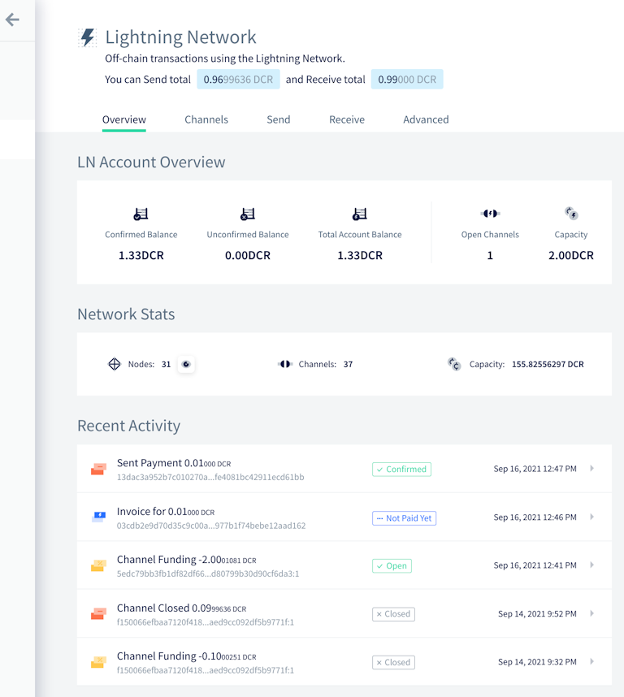
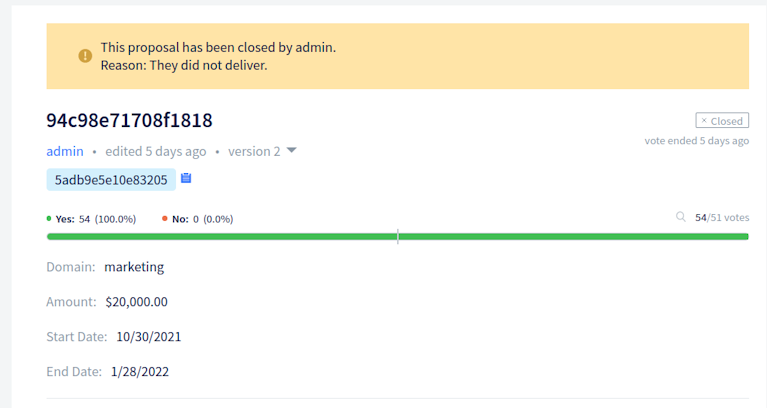
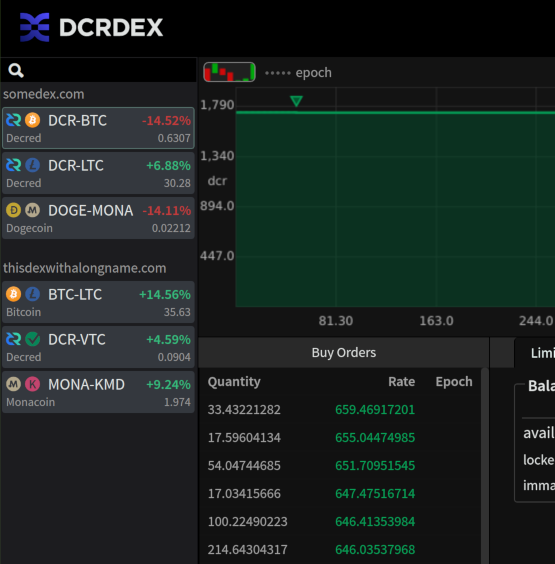
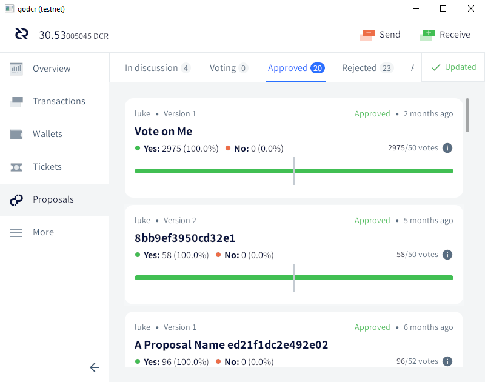
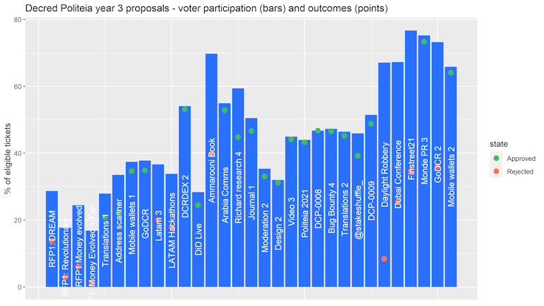
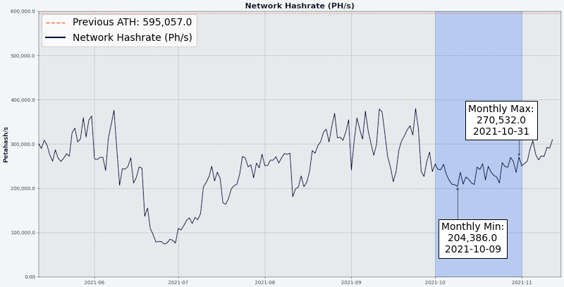
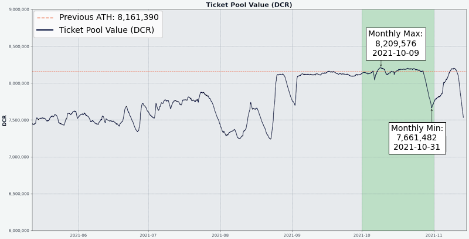
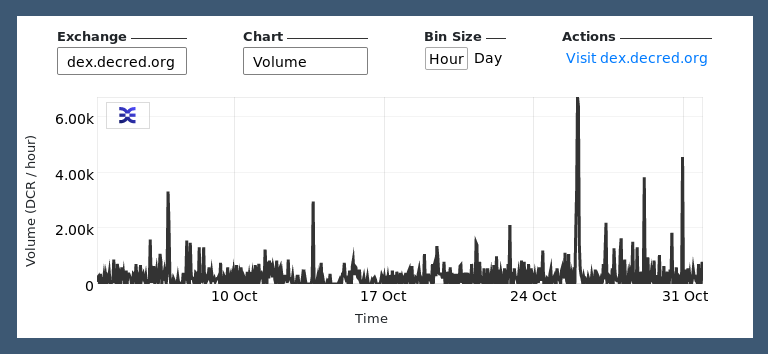

# Decred Journal – October 2021

_Image: Remote Node Outpost by @saender_

Highlights for October:

- Politeia celebrated its third year of operation and had another busy development month.
- The mobile wallets proposal from @raedah was funded for another year.
- The GoDCR proposal was rejected but a revised proposal is being prepared. Development continues to polish the wallet for a mainnet release.
- Changes merged in DCRDEX make it possible to pay registration fees in BTC and use a built-in SPV wallet without running a Bitcoin full node.

Contents:

- [Development](#development)
- [People](#people)
- [Governance](#governance)
- [Network](#network)
- [Ecosystem](#ecosystem)
- [Outreach](#outreach)
- [Media](#media)
- [Markets](#markets)
- [Relevant External](#relevant-external)

## Development

The work reported below has the "merged to master" status unless noted otherwise. It means that the work is completed, reviewed, and integrated into the source code that advanced users can [build and run](https://medium.com/@artikozel/the-decred-node-back-to-the-source-part-one-27d4576e7e1c), but is not yet available in release binaries for regular users.

**[dcrd](https://github.com/decred/dcrd)**

_dcrd is a full node implementation that powers Decred's peer-to-peer network around the world._

Merged changes:

- updating of indexes (transaction, address, exists address) has been made [asynchronous](https://github.com/decred/dcrd/pull/2219) to speed up the critical path of block validation and connection code. It allows for faster vote propagation and helps pave the way for other optimizations, sync models, and ultimately nicer data corruption recovery mechanisms.
- simplified to use only one latest [checkpoint](https://github.com/decred/dcrd/pull/2763), since intermediate checkpoints are no longer necessary with [headers-first syncing](https://github.com/decred/dcrd/pull/2555)
- improved consistency and clarity of `txscript` package [tests](https://github.com/decred/dcrd/pull/2757)
- fixed handling of automatic ticket revocations when their block is [disconnected](https://github.com/decred/dcrd/pull/2768) during a chain reorganization
- fixed a data [race](https://github.com/decred/dcrd/pull/2758) in peer address management
- fixed [`findcheckpoint`](https://github.com/decred/dcrd/pull/2759) and [`addblock`](https://github.com/decred/dcrd/pull/2760) tools
- [libFuzzer](https://llvm.org/docs/LibFuzzer.html) support has been added to dcrd's [continuous fuzzing](https://github.com/degeri/dcrd-continuous-fuzz) test suite

**[dcrwallet](https://github.com/decred/dcrwallet)**

_dcrwallet is a wallet server used by command-line and graphical wallet applications._

- implemented [`getblockheader`](https://github.com/decred/dcrwallet/pull/2098) and [`getcurrentnet`](https://github.com/decred/dcrwallet/pull/2102) methods in SPV mode (to be used by DCRDEX)
- added [`spv`](https://github.com/decred/dcrwallet/pull/2094) field to `walletinfo` result to distinguish between syncing modes
- fixed [sync loss](https://github.com/decred/dcrwallet/pull/2099) in SPV mode

**[Decrediton](https://github.com/decred/decrediton)**

_Decrediton is a full-featured desktop wallet app with integrated voting, StakeShuffle mixing, Lightning Network, DEX trading, and more. It runs with or without a full blockchain (SPV mode)._

User-facing changes:

- implemented new UI design on [LN Overview](https://github.com/decred/decrediton/pull/3551) tab. Wallet, Network, and Watchtowers tabs have been grouped under a newly introduced Advanced tab.
- new UI design for wallet [modals](https://github.com/decred/decrediton/pull/3534) with added password visibility toggle
- added the ability to use [random VSP](https://github.com/decred/decrediton/pull/3560) in Automatic Ticket Purchases (with a configurable maximum fee)
- automatically enable the new [per-account](https://github.com/decred/decrediton/pull/3579) encryption for new wallets
- improved usability of the [VSP selector](https://github.com/decred/decrediton/pull/3563)
- ~13 bug fixes

Internal:

- updated DEX integration via [libdexc](https://github.com/decred/decrediton/pull/3549) to utilize upcoming 0.3 features (localized UI, restore from seed, and discovery of existing accounts)
- updated to [Electron 15](https://github.com/decred/decrediton/pull/3571)
- added a new GUI tool for [translating](https://github.com/decred/decrediton/pull/3569) strings and a [guide](https://github.com/decred/decrediton/blob/master/app/i18n/community_translators.md) for community translators
- automated tests for [Accounts](https://github.com/decred/decrediton/pull/3577) views

_Decrediton LN Overview_

**[Politeia](https://github.com/decred/politeia)**

_Politeia is Decred's proposal system. It is used to request funding from the Decred treasury._

User-facing changes:

- added a standard way to show any status change. Admin that censored or abandoned the proposal is displayed along with the reason they gave for the status change.
- support [multiple](https://github.com/decred/politeiagui/pull/2629) billing status changes. The default is to only allow a single billing status change (from Active to Completed or Closed), but it is a configurable setting. If an admin makes a mistake, the sysadmin can temporarily update the setting to allow for the mistake to be corrected. It is also possible to temporarily [disable](https://github.com/decred/politeia/pull/1533) status changes.
- improved and standardized the [identity error](https://github.com/decred/politeiagui/pull/2623). The same error is now displayed anytime the user attempts to write data to Politeia without their active identity being loaded in the browser. The error message directs to the user details page to fix the issue.
- fixed multiple [comment navigation](https://github.com/decred/politeiagui/pull/2638) UX issues: filtering preferences being lost, Go Back button not working properly, slow loading of individual threads, UI flickering
- ~5 other bug fixes

Changes in `politeiavoter` command-line tool:

- changed the method of [trickling](https://github.com/decred/politeia/pull/1556) method (slow sending of votes). Previously it has sent votes in a sequence with random time intervals. This has proven to be brittle as one slow/failed send was delaying all other votes. The new method uses independent parallel voting processes that start at random times and do not affect each other, making trickling more robust.
- added an option to abort if vote trickling cannot finish with enough [extra time](https://github.com/decred/politeia/pull/1542) prior to the vote end. It alarms the user to adjust parameters so that enough time (12 hours by default) is left to retry any failed votes, which may happen over poor connections or Tor.
- brought back printing of proposal [names](https://github.com/decred/politeia/pull/1548) in `inventory` command

Backend and internal changes:

- added API to get billing [status changes](https://github.com/decred/politeia/pull/1526)
- allow fetching billing status changes [in batches](https://github.com/decred/politeia/pull/1535)
- use the server policy for [page size](https://github.com/decred/politeiagui/pull/2622)
- added data integrity checks for [`ticketvote`](https://github.com/decred/politeia/pull/1531) and [`comments`](https://github.com/decred/politeia/pull/1544) plugins
- added a new `pictl` command to test the [RFP flow](https://github.com/decred/politeia/pull/1551)
- ~4 bug fixes

Refactoring in preparation for the [user layer rewrite](https://github.com/decred/politeia/issues/1479) (largest chunk of work for the [2021 Q3](https://proposals.decred.org/record/91cfcc8) proposal):

- politeiawww codebase reorganized to move legacy APIs into a [`legacy`](https://github.com/decred/politeia/pull/1523) package. This will make it easier to rewrite the user layer to use a plugin architecture and to allow for horizontal scaling.
- extracted [`logger`](https://github.com/decred/politeia/pull/1527) package to allow plugins to configure their logging and become self-contained
- extracted [`websockets`](https://github.com/decred/politeia/pull/1529) package (will make it easier to scale the servers)
- extracted [config](https://github.com/decred/politeia/pull/1536) handling into its own package and separated out settings for legacy API for easier removal in the future
- moved [identity](https://github.com/decred/politeia/pull/1530) handling methods to more appropriate places
- added a generic [session store](https://github.com/decred/politeia/pull/1555) (will replace the [legacy](https://github.com/decred/politeia/pull/1554) one that did not have proper separation of concerns)

_No free money on Politeia_

**[vspd](https://github.com/decred/vspd)**

_vspd is server software for running a Voting Service Provider. A VSP votes on behalf of its users 24/7 and cannot steal funds._

- updated to latest [dcrd RPC](https://github.com/decred/vspd/pull/297) version. Since this commit, vspd will stop working against dcrd v1.6 and start to target the `master` branch.
- allow setting an [alternative](https://github.com/decred/vspd/pull/287) signing address to support VSP staking with Trezor

**[dcrlnd](https://github.com/decred/dcrlnd)**

_dcrlnd is Decred's Lightning Network node software. LN enables instant and low-cost transactions._

- perform account discovery only [once](https://github.com/decred/dcrlnd/pull/145) for embedded wallets (not applicable to remote wallets that are controlled externally)
- improved [quickstart](https://github.com/decred/dcrlnd/pull/146) docs and added a new doc summarizing the 4 [operation modes](https://github.com/decred/dcrlnd/blob/master/docs/operation_modes.md) (dcrd or SPV sync, remote or embedded wallet)

**[DCRDEX](https://github.com/decred/dcrdex)**

_DCRDEX is a non-custodial exchange for trustless trading, powered by atomic swaps._

User-facing changes:

- reworked register flow to accept [assets](https://github.com/decred/dcrdex/pull/1223) other than DCR
- added [overview](https://github.com/decred/dcrdex/pull/1232) of current prices and 24-hour changes to the left sidebar
- improved [registration](https://github.com/decred/dcrdex/pull/1234) sequence and form design/animations
- added [Bitcoin SPV](https://github.com/decred/dcrdex/pull/1230) support to trade against BTC without managing a full Bitcoin blockchain. Built on top of [Neutrino](https://github.com/lightninglabs/neutrino) and [btcwallet](https://github.com/btcsuite/btcwallet) (_old investment paying off!_).
- start BTC SPV wallet [scan](https://github.com/decred/dcrdex/pull/1249) from a certain date to save time
- require ["zpub"](https://github.com/decred/dcrdex/pull/1255) extended public keys but offer to convert from "xpub" for convenience. This is for server operators willing to accept registration fees in BTC.
- ~6 bug fixes

Internal changes:

- support multiple [HD accounts](https://github.com/decred/dcrdex/pull/1210) for the same app seed, to allow registering additional accounts if the initial account is suspended. This change also retires legacy accounts with random keys to ensure all new accounts can be derived from app seed.
- refactored client DCR backend to support alternative [wallet](https://github.com/decred/dcrdex/pull/1227) implementations. This will be used to integrate DCRDEX into GoDCR.

Progress towards Ethereum support:

- implemented several [backend methods](https://github.com/decred/dcrdex/issues/1154) ([swap](https://github.com/decred/dcrdex/pull/1218) and [redeem](https://github.com/decred/dcrdex/pull/1219) estimations, order [funding](https://github.com/decred/dcrdex/pull/1221), message [signing](https://github.com/decred/dcrdex/pull/1228), and more)
- added function to initiate a [batch](https://github.com/decred/dcrdex/pull/1251) of multiple swaps in the same transaction (saves gas)
- [derive](https://github.com/decred/dcrdex/pull/1225) the internal Ethereum wallet from DEX app seed

_DCRDEX markets overview. Shown data is not real._

**[Decred Wallet (iOS)](https://github.com/planetdecred/dcrios)**

- show non-zero balances with [8 decimals](https://github.com/planetdecred/dcrios/pull/857)
- fixed colors and icons for the dark mode

**[GoDCR](https://github.com/planetdecred/godcr)**

_GoDCR is a lightweight desktop wallet app with integrated staking, privacy, and Politeia browsing._

User-facing changes:

- added a button to quickly [hide](https://github.com/planetdecred/godcr/pull/646) wallet balance to increase the user's over the shoulder privacy
- added a [reminder](https://github.com/planetdecred/godcr/pull/663) to back up the seed words
- cycle input fields with the [Tab key](https://github.com/planetdecred/godcr/pull/640)
- unified [terminology](https://github.com/planetdecred/godcr/pull/645) about passwords and seeds
- show more details in Politeia proposal [tooltips](https://github.com/planetdecred/godcr/pull/638)
- show time since [last update](https://github.com/planetdecred/godcr/pull/642) of Politeia data
- improved [time](https://github.com/planetdecred/godcr/pull/666) information on Transactions page
- added draggable [scroll](https://github.com/planetdecred/godcr/pull/664) slider on long lists
- allow [empty](https://github.com/planetdecred/godcr/pull/625) password in some cases
- ~10 bug fixes

Internal changes:

- implemented a custom clickable [highlight](https://github.com/planetdecred/godcr/pull/630) effect with configurable color and borders and reused it across the app
- updated to the latest [Gio](https://github.com/planetdecred/godcr/pull/665) and removed code that is no longer needed
- support custom icons on [input fields](https://github.com/planetdecred/godcr/pull/677)

Merged in [dcrlibwallet](https://github.com/planetdecred/dcrlibwallet) library (shared by Android/iOS wallets and GoDCR):

- updated to [latest](https://github.com/planetdecred/dcrlibwallet/pull/209) dcrd, dcrwallet, and dcrdata modules
- added function to get the [timestamp](https://github.com/planetdecred/dcrlibwallet/pull/208) of the last sync with Politeia

_GoDCR Proposals view_

Development continued despite the second [GoDCR proposal](https://proposals.decred.org/record/f7d9fc8) getting rejected (49% Yes). Looking forward to the revised version and new app builds.

**[dcrdata](https://github.com/decred/dcrdata)**

_dcrdata is an explorer for Decred blockchain and off-chain data like Politeia proposals, markets, and more._

- updated [Decred](https://github.com/decred/dcrdata/pull/1874) [dependencies](https://github.com/decred/dcrdata/pull/1875)
- upgraded to [Bootstrap 5](https://github.com/decred/dcrdata/pull/1872)

## People

Welcome to new first time contributors with code merged to master: @AdimekweEbuka ([godcr](https://github.com/planetdecred/godcr/commits?author=AdimekweEbuka))!

Community stats as of Nov 2:

- [Twitter](https://twitter.com/decredproject) followers: 49,503 (+830)
- [Reddit](https://www.reddit.com/r/decred/) subscribers: 12,248 (+294)
- [Matrix](https://chat.decred.org/) #general users: 551 (+16)
- [Discord](https://discord.gg/GJ2GXfz) users: 2,267 (+190)
- [Telegram](https://t.me/Decred) users: 2,940 (+31)
- [YouTube](https://www.youtube.com/decredchannel) subscribers: 4,620 (+10), views: 197K (+1K)

## Governance

In October the new [treasury](https://dcrdata.decred.org/treasury) received 10,678 DCR worth $1.3 million at the month's average rate of $121.57. 974 DCR was spent to pay contractors, worth $118K at October's rate, or $136K at September's billing rate of $139.56. As of Nov 1, combined balance of [legacy](https://dcrdata.decred.org/address/Dcur2mcGjmENx4DhNqDctW5wJCVyT3Qeqkx) and [new treasury](https://dcrdata.decred.org/treasury) is 733,772 DCR (82.5 million USD at $112.42).

One [proposal](https://proposals.decred.org/record/c1f5b5c) was submitted this month, @ammarooni returns with a proposal that revises an earlier book [proposal](https://proposals.decred.org/proposals/9e1d644) to remove the book in favor of a steady stream of papers and social media content, memes and meetups.

The two proposals from @raedah were voted on this month, the one for [mobile wallets](https://proposals.decred.org/record/6db3c4e) was approved with 97.2% yes votes and 66% turnout, while the proposal to continue funding [GoDCR](https://explorer.dcrdata.org/proposal/f7d9fc852e309b31) was rejected with 49% approval and turnout of 73%.

See Politeia Digest [issue 47](https://blockcommons.red/politeia-digest/issue047/) and [issue 48](https://blockcommons.red/politeia-digest/issue048/) for more details on the month's proposals.

@richardred published numbers and graphs for Politeia's [third year](https://blockcommons.red/publication/politeia-at-3/). A few highlights:

- 31 proposals published, of which 20 approved, 11 rejected, 2 abandoned
- average (mean) voter participation improved considerably with 46% in year 3, compared to 31% in year 1 and 28% in year 2
- software development proposals have increased in count, budgets, and voter support
- marketing proposals have decreased in number so that these are no longer the dominant type, and particularly the number of marketing proposals that end with very low approval has reduced
- the proportion of proposals from people who are already contractors has gone up from 48% in year 2 to 77% in year 3
- the number of mixed tickets (those with extra privacy) has been increasing
- all-time stats for 3 years: 128 proposals published, of which 66 approved, 42 rejected, 20 abandoned

_Politeia third year_

## Network

**Hashrate**: October's [hashrate](https://dcrdata.decred.org/charts?chart=hashrate&zoom=ku5ml4us-kvgwhe37&scale=linear&bin=block&axis=time) opened at ~237 Ph/s and closed ~284 Ph/s, bottoming at 164 Ph/s and peaking at 323 Ph/s throughout the month.

Distribution of hashrate [reported](https://miningpoolstats.stream/decred) by the pools on Nov 1: Poolin 43%, F2Pool 29%, AntPool 10%, BTC.com 6.4%, ViaBTC 6%, Luxor 4.5%, HuobiPool 0.5%, OKEx 0.4%, CoinMine 0.2%

Distribution of 1,000 blocks actually [mined](https://miningpoolstats.stream/decred) by Nov 1: Poolin 42%, F2Pool 31%, Antpool 9%, BTC.com 7%, Luxor 5%, ViaBTC 5%, OKEx 0.7%, unknown 0.3%.

_Decred hashrate May-Oct 2021_

**Staking**: [Ticket price](https://dcrdata.decred.org/charts?chart=ticket-price&zoom=ku5ml4us-kvgwhe37&axis=time&visibility=true-true&mode=stepped) varied between 139.7-209.7 DCR, with 30-day [average](https://dcrstats.com/) at 191.6 DCR (-7.8).

The [locked amount](https://dcrdata.decred.org/charts?chart=ticket-pool-value&zoom=ku5ml4us-kvgwhe37&scale=linear&bin=block&axis=time) was 7.65-8.20 million DCR, meaning that 56.7-61.1% of the circulating supply [participated](https://dcrdata.decred.org/charts?chart=stake-participation&zoom=ku5ml4us-kvgwhe37&scale=linear&bin=block&axis=time) in proof-of-stake.

_Decred ticket pool May-Oct 2021_

**VSP**: On Nov 1, ~7,400 (-200) live tickets were managed by [listed](https://decred.org/vsp/) vspd servers and 224 (+4) by listed legacy dcrstakepool servers. Collectively the 7 legacy and 15 new VSPs managed 18.9% (-0.1%) of the ticket pool.

**Nodes**: Throughout October there were around 200 reachable nodes according to [dcrextdata](https://dcrextdata.planetdecred.org/nodes).

Node versions as of Nov 1 [snapshot](https://nodes.jholdstock.uk/user_agents) (245 total, dcrd only): v1.6.2 - 59%, v1.7 dev builds - 13%, v1.6.0 - 12%, v1.6.1 - 9%, v1.6 dev builds - 3%, v1.5.2 - 2%, v1.5.1 - 0.8%.

The share of [mixed coins](https://dcrdata.decred.org/charts?chart=coin-supply&zoom=jz3q3lq8-l0s732o6&scale=linear&bin=day&axis=time&visibility=true-true-true) varied between 52.3-54.4% and set a new all-time high with the sum of mixed unspent coins above 7.3 million.

## Ecosystem

Legacy VSP stakepool.eu has been [removed](https://github.com/decred/dcrwebapi/pull/153) from the [VSP list](https://decred.org/vsp/) to facilitate user migration to the new [vspd system](https://blog.decred.org/2020/06/02/A-More-Private-Way-to-Stake/). It is still online to vote on the remaining live tickets (7 as of Nov 1). This VSP launched in May 2016 with the codename `India`, just 3 months after Decred was [born](https://dcrdata.decred.org/block/1). Thank you for 5 years of service!

Legacy VSP from 99split.com has handled its final live ticket and was shutdown. It has served since late 2019 and was one of the few vendors to actively support [ticket splitting](https://github.com/matheusd/dcr-split-ticket-matcher) by coordinating sessions and creating user-friendly [video](https://www.youtube.com/watch?v=StF7GF5W_eM) [tutorials](https://www.youtube.com/watch?v=QOBjep3Ll7E). Users are welcome at its new [vspd instance](https://vspd.99split.com/) with a 0.99% fee and 1.7K voted tickets.

For anyone still using legacy VSP, it is recommended to switch to [vspd providers](https://decred.org/vsp/) to avoid the risk of missed tickets, e.g. in case the legacy VSP shuts down or stops working with the coming consensus upgrades. As of Nov 1, all legacy VSPs managed less than 260 tickets or 0.6% of the ticket pool.

Warning: the authors of the Decred Journal have no idea about the trustworthiness of any of the services above. Please do your own research before trusting your personal information or assets to any entity.

## Outreach

Monde PR's achievements for October:

- pitched one story to finance and crypto publications
- secured four media interviews

Secured the following news articles:

- the news about Decred reaching 77% voter participation and marking three years of Politeia was covered by [Crowdfund Insider](https://www.crowdfundinsider.com/2021/10/182204-decentralized-digital-currency-project-decred-dcr-reaches-governance-milestone-of-77-voter-participation/)

In response to a common question "What's up in Decred and where it is heading?" @bee wrote a [summary](https://www.reddit.com/r/decred/comments/q1402a/weekly_many_musings_mondays/hfji878/) of recent developments and mid-term goals.

@cryptotivo congratulates everyone with 600K "boring" blocks milestone:

> 👂Ever heard of the great #Decred hack?
> 
> How about the recent #Decred rug pull?
> 
> Yeah, me neither because they don't exist.
> 
> #Decred has recently produced its 600 000th block.
> 
> That's 600 fucking thousand bullshit free blocks.
> 
> Congrats to the team, stakers and visionaries. 🎖️ ([@cryptotivo](https://twitter.com/cryptotivo/status/1451632443665047557))

## Media

Selected articles:

- Year three of Decred's Politeia in numbers and graphs by @richardred ([blockcommons.red](https://blockcommons.red/publication/politeia-at-3/))
- Decred hits governance milestone of 77% voter participation ([decred.org](https://decred.org/press/2021-10-27_decred_hits_governance_milestone/), altered version published on [crowdfundinsider.com](https://www.crowdfundinsider.com/2021/10/182204-decentralized-digital-currency-project-decred-dcr-reaches-governance-milestone-of-77-voter-participation/))
- The Suppressor part 2: On-chain analysis by @tacorevenge ([medium](https://medium.com/@tacorevenge/the-suppressor-part-2-on-chain-analysis-6561c5a478c4))

Videos:

- GoDCR progress demo of Oct 9 ([twitter](https://twitter.com/planetdecred/status/1446927031887745027))
- Decred in Depth Ep. 44 - with Coin Artist - Decred historical outlook + NFTs + Metaverse + Neon District by @elima\_iii ([youtube](https://www.youtube.com/watch?v=PCcH04oVs18))
- WDYT: Thoughts on Decred? Trending on CoinMarketCap by NFT Daily News ([youtube](https://www.youtube.com/watch?v=f7Q5j22vrCM))
- Decred Price Analysis - 20th October 2021 by Brave New Coin ([youtube](https://www.youtube.com/watch?v=A0o8k1sECEk))

Translations:

- The future is now: Steven Wagner of Raedah Group on how their technological innovation will shake up the tech scene - [in Spanish](https://medium.com/authority-magazine/the-future-is-now-steven-wagner-of-raedah-group-on-how-their-technological-innovation-will-shake-4f272ced222f) by @francov\_
- Politeia Digest 47 - [in Spanish](https://medium.com/decred-es/politeia-digest-47-septiembre-4-octubre-3-2021-3cb3bb3e6c01) by @francov\_
- Decred Journal September 2021 was [translated](https://xaur.github.io/decred-news/) to Arabic (@arij, @abdulrahman4), Chinese (@Dominic), and Spanish (@francov\_). Thank you to all for staying around!

Other non-English content:

- Decred presentation in Spanish by @elian ([youtube](https://www.youtube.com/watch?v=H3Ffr5-kzxY))
- Decred erklärung deutsch - die blockchain mit Lightning Network ([youtube](https://www.youtube.com/watch?v=BG4cUkDmP7g))

## Markets

In October DCR was trading between USD 102.40-140.10 / BTC 0.0018-0.0025. The average daily rate was $121.57.

@tacorevenge published the [second part](https://medium.com/@tacorevenge/the-suppressor-part-2-on-chain-analysis-6561c5a478c4) of an investigation of The Suppressor entity that is suspected of manipulating DCR markets. This time on-chain analysis was used to see how funds have been flowing between miners, centralized exchanges and DCRDEX.

_DCRDEX October trading volume_

## Relevant External

Zcash has been [polling](https://electriccoin.co/blog/coin-holder-poll-results-summary/) its coinholders again, this time on the subject of whether to change the consensus mechanism away from Proof of Work. 85% of the 41,000 ZEC (0.3% of circulating supply) that voted put a switch from PoW as the number one priority for the project. The aim is to move away from Proof of Work entirely, to some form of Proof of Stake or equivalent.

Sam Altman and other Silicon Valley VCs [revealed](https://www.coindesk.com/tech/2021/10/25/why-everyone-is-mad-at-sam-altmans-worldcoin/) their vision for a universal basic income that people must submit unique eyeball hashes to claim, and privacy advocates have piled on to say it's a bad idea. Notable features are the orb-shaped eyeball scanners reminiscent of dystopian science fiction, and the 20% VC premine.

The latest DeFi airdrop farming [controversy](https://www.coindesk.com/tech/2021/10/08/airdrop-ethics-vc-firm-draws-ire-following-25m-ribbon-finance-exploit/) concerns Ribbon Finance, where one researcher from Divergence Ventures successfully met the qualifying criteria with hundreds of different wallets and received tokens worth $2.5 million. An independent researcher noticed the pattern and identified the wallet owner through association with an ENS domain, they [suggested](https://twitter.com/gabagooldoteth/status/1446498569603756033) copytrading them on Twitter, but it blew up and Divergence Ventures ended up giving back all the airdropped tokens.

Cream Finance has been [hacked](https://rekt.news/cream-rekt-2/) for $130 million, which is the second major hack in the last 3 months. This attack used a flash loan to repeatedly lend and borrow funds across two addresses and took advantage of a pricing vulnerability to drain many of Cream's liquidity pools. [Analysis](https://mudit.blog/cream-hack-analysis/) by a DeFi insider suggests that this hack was executed by a skilled DeFi developer, likely working on a rival project. The attacker also left a cryptic message which appeared to taunt a list of projects and blame Yearn developers, and some DeFi developers have started referring to a "[war](https://decrypt.co/84840/behind-defi-war-words-aave-yearn)" in their tweets.

The DeFi protocol Indexed Finance was [hacked](https://decrypt.co/83681/defi-protocol-indexed-finance-hacked-for-16-million-team-finds-hacker) for $16 million, but [identified](https://cryptobriefing.com/inside-the-war-room-how-indexed-finance-traced-its-16m-hacker/) the attacker. The [story](https://cryptobriefing.com/inside-the-war-room-how-indexed-finance-traced-its-16m-hacker/) of how the attacker was identified is an interesting one, involving an edit to Wikipedia which they made to describe themselves as a "notable mathematician". It subsequently transpired that the attacker is a [teenager](https://www.coindesk.com/tech/2021/10/22/after-stealing-16m-this-teen-hacker-seems-intent-on-testing-code-is-law-in-the-courts/), and rather than hand the funds back, or 90%, they have decided to test the "code is law" conjecture in court to see if they can keep their flash loan bounty.

The Creature Toadz NFT community was [scammed](https://cryptobriefing.com/hacker-admits-to-stealing-88-eth-then-returns-it/) by an attacker who posted a fake minting link in their Discord - in the 45 minutes before it was taken down 88 ETH was sent to the attacker. The funds were quickly returned after the hacker's identity was discovered.

In the dog eat dog world of [dog money](https://www.youtube.com/watch?v=cbI31x3FpS0), AnubisDAO executed a speedy [rug pull](https://decrypt.co/84924/anubisdao-investors-lose-60-million-in-alleged-rug-pull) with $60 million of investors' money, 20 hours into the initial token sale for this new dog token with no website. There is some dispute over whether the attack was executed by a project insider or someone who phished a project insider.

A new crypto news wire has launched, and it is run by a DAO, [PubDAO](https://decrypt.co/84755/pubdao-media-dao-decentralized-news-wire).

Popular patronage service Patreon is [considering](https://decrypt.co/84831/patreon-creators-fans-crypto-social-tokens) to drop the ban on its users offering and promoting social tokens on their platform.

The infamous $1 trillion infrastructure bill has returned to the house of representatives and someone has discovered an even more egregious anti-crypto provision: [6050I](https://unchainedpodcast.com/not-reporting-info-on-some-transaction-partners-could-soon-be-a-felony/). This provision would require recipients of digital assets to, in many cases, collect a variety of information about the sender and report this to the IRS within 15 days. This provision has only recently been discovered, but it is [apparently](https://twitter.com/jchervinsky/status/1456275741398683648) already too late to do anything about amending the infrastructure bill on its passage through the house of representatives.

The latest crypto [fad](https://www.wsj.com/articles/tungsten-cubes-bitcoin-gamestop-crypto-investors-11635431036) is not a new blockchain but small blocks of tungsten, which people are buying to touch and hold. It didn't take long for someone to come up with a [Tungsten DAO](https://twitter.com/tungsten_dao) which has minted an NFT representing a very large block of tungsten, and [sold](https://www.theverge.com/2021/11/3/22761305/tungsten-cube-meme-nft-crypto-midwest) this for $250,000, to a holder who is entitled to visit it once a year for looking and touching (it's too heavy to hold or deliver).

That's all for October. Share your updates for the next issue in our [#journal](https://chat.decred.org/#/room/#journal:decred.org) chat room.

## About

This is issue 43 of Decred Journal. Index of all issues, mirrors, and translations is available [here](https://xaur.github.io/decred-news/).

Most information from third parties is relayed directly from the source after a minimal sanity check. The authors of the Decred Journal cannot verify all claims. Please beware of scams and do your own research.

Credits (alphabetical order):

- writing and editing: bee, bochinchero, degeri, l1ndseymm, richardred
- reviews and feedback: davecgh, lukebp
- title image: saender
- funding: Decred stakeholders
