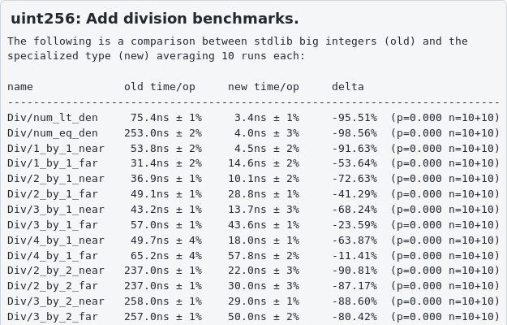
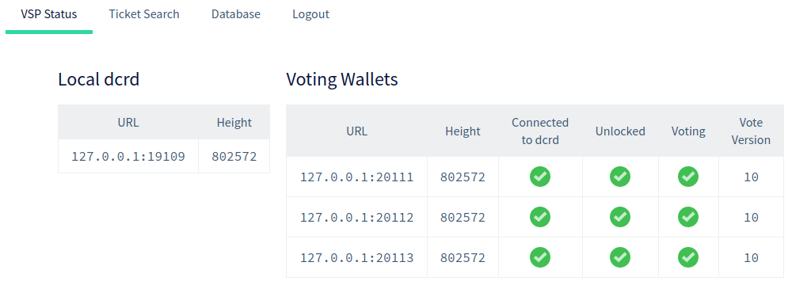
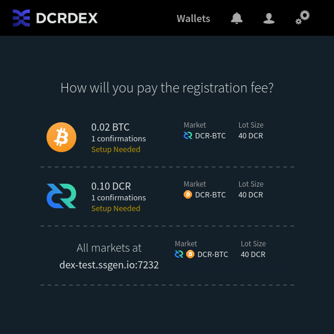
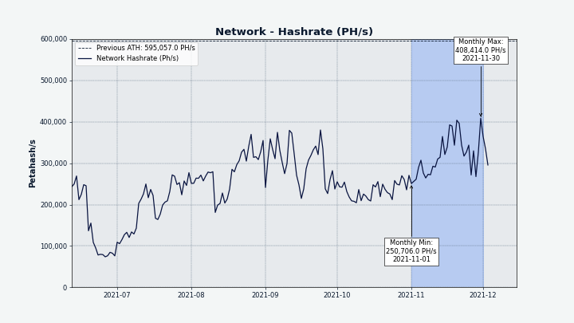
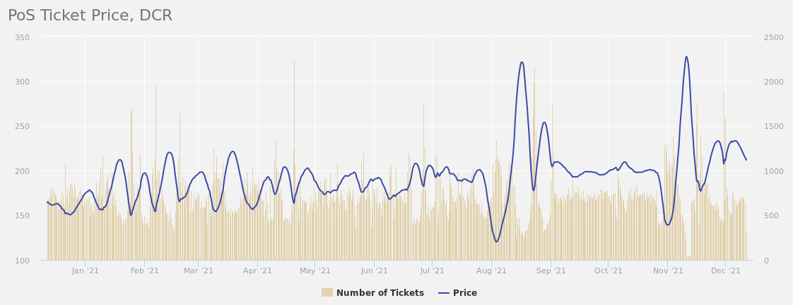
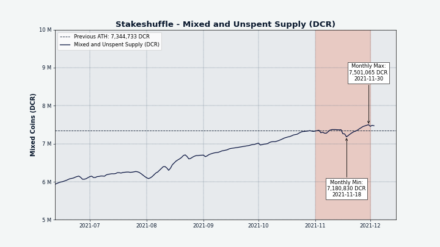
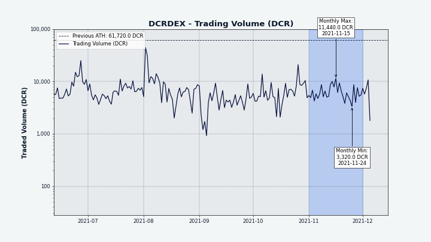
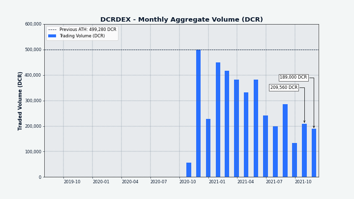

# Decred Journal – November 2021

_Image: Remote Node Outpost II by @saender_

November's highlights:

- A huge proposal to change the distribution of Decred block rewards so that PoW miners get a much smaller share was published, discussed, and has now been approved.
- The community has funded an outreach proposal after it was rejected by a Politeia vote.
- Politeia v1.3.0 is live in the wild, bringing improvements to the handling of proposal status, GUI improvements, and end-to-end testing.
- Two new reusable packages have been developed in dcrd, a general purpose one for fast big integers, and one for building Decred apps.

Contents:

- [Development](#development)
- [People](#people)
- [Governance](#governance)
- [Network](#network)
- [Ecosystem](#ecosystem)
- [Outreach](#outreach)
- [Media](#media)
- [Markets](#markets)
- [Relevant External](#relevant-external)

## Development

The work reported below has the "merged to master" status unless noted otherwise. It means that the work is completed, reviewed, and integrated into the source code that advanced users can [build and run](https://medium.com/@artikozel/the-decred-node-back-to-the-source-part-one-27d4576e7e1c), but is not yet available in release binaries for regular users.

**[dcrd](https://github.com/decred/dcrd)**

_dcrd is a full node implementation that powers Decred's peer-to-peer network around the world._

A minor bug in consensus has been fixed where tickets voting on treasury spends have not been detected as voted and were falsely reported as [missed](https://github.com/decred/dcrd/pull/2780) in some RPC requests. Importantly, the bug cannot cause an unintended fork and only affects data served via RPC. The live ticket pool is still accurate and all votes and payouts are unaffected. The fix will require a database migration.

Welcome [`uint256`](https://github.com/decred/dcrd/pull/2787), a new package implementing highly optimized allocation-free 256-bit integer arithmetic. It has the potential to speed up the initial chain sync by 5-10% when used in place of the standard library big integers. The package has a strong focus on performance and correctness, and features arithmetic, boolean comparison, bitwise logic, bitwise shifts, conversion to/from relevant types, and full formatting support - all served with an ergonomic API, full test coverage, and benchmarks. For a full dose of hacker's delight, follow how it came into existence [over 59 commits](https://github.com/decred/dcrd/pull/2787/commits) with a thorough README at the end.

The `uint256` package became the first step of a [long-term plan](https://github.com/decred/dcrd/issues/2786) to develop a new `primitives` module. It will become a new fundamental building block of consensus code by consolidating key concepts such as transactions, block headers, blocks, and sequence lock definitions, which are currently spread across multiple packages. Refined abstractions will improve clarity by making the distinction between consensus primitives and the data sharing protocol, and allow for significant performance optimizations.

Progress of the `stdscript` package (an effort to decouple "standard" from "consensus" script handling, to avoid unintended changes to consensus):

- added [provably pruneable](https://github.com/decred/dcrd/pull/2803) script support. This is a special form of public key script that cannot be spent and is safe to prune from the set of unspent transaction outputs (UTXOs) to save memory. They are primarily useful for anchoring data into the blockchain, as used by [timestamping](https://timestamp.decred.org/) and [Politeia](https://proposals.decred.org/).
- added support for determining the number of [signatures](https://github.com/decred/dcrd/pull/2805) required by a script
- added extraction of [addresses](https://github.com/decred/dcrd/pull/2807) from standard recognized forms of public key scripts
- package `stdscript` [moved](https://github.com/decred/dcrd/pull/2810) from the internal staging area to the `txscript` module and is now ready for consumption
- all packages [converted](https://github.com/decred/dcrd/pull/2808) to use the new `stdscript` package. To make review easier, the change was split into 50 small commits such that everything builds and passes all tests each step of the way.
- added methods to universally [extract](https://github.com/decred/dcrd/pull/2816) public key hashes and script hashes from stake-related scripts, which helps many applications that don't care about the specific script type (ticket purchase, vote reward, revocation, change, etc)

Other merged changes:

- fill and check [fraud proof](https://github.com/decred/dcrd/pull/2804) data for transactions entering the mempool. This data includes the input amount, block height, and an index in that block, and allows efficient detection of fraudulent transactions trying to spend more than their inputs provide. As a bonus, it also allows efficient calculation of fees without slower loading of chain data or requiring a full transaction hash index.
- upgrade code further [decoupled](https://github.com/decred/dcrd/pull/2776) from primary code to remain more stable as the primary code evolves
- tuned [ping](https://github.com/decred/dcrd/pull/2796) interval to prevent undesirable disconnects in higher latency scenarios
- optimized memory usage in [`netsync`](https://github.com/decred/dcrd/pull/2825) package
- reworked logic for downloading [next blocks](https://github.com/decred/dcrd/pull/2828) to be more compatible with parallel block downloads from multiple peers
- fixed an edge case in UTXO database [migration](https://github.com/decred/dcrd/pull/2798) (did not affect release builds)
- fixed a [deadlock](https://github.com/decred/dcrd/pull/2806) on shutdown (did not affect release builds)
- fixed an [overflow](https://github.com/decred/dcrd/pull/2778) in the optimized constant-time `ModNScalar` addition operation
- code cleanup and seasonal module dependency rituals in preparation for the next release

_Another day of optimizing dcrd_

**[dcrwallet](https://github.com/decred/dcrwallet)**

_dcrwallet is a wallet server used by command-line and graphical wallet applications._

- fixed [disconnection](https://github.com/decred/dcrwallet/pull/2105) from peers

**[Decrediton](https://github.com/decred/decrediton)**

_Decrediton is a full-featured desktop wallet app with integrated voting, StakeShuffle mixing, Lightning Network, DEX trading, and more. It runs with or without a full blockchain (SPV mode)._

User-facing changes:

- implemented new UI design for [Confirm Seed](https://github.com/decred/decrediton/pull/3594) view to simplify the painful UX of entering seed words
- added ability to restore a [DEX account](https://github.com/decred/decrediton/pull/3552) from a DEX seed
- added ability to select custom install [directory](https://github.com/decred/decrediton/pull/3572) for Bitcoin wallet. Any attempts to update the existing `bitcoin.conf` have been removed.
- hidden the [legacy](https://github.com/decred/decrediton/pull/3587) VSP ticket purchasing UI as a first step to removing it
- ~7 bug fixes

Internal:

- reused [Tabs](https://github.com/decred/decrediton/pull/3592) component from the pi-ui library
- added automated tests for: tabbed page component, [Home](https://github.com/decred/decrediton/pull/3598), Privacy and Security [pages](https://github.com/decred/decrediton/pull/3584)

Changes in the pi-ui library (shared by Decrediton and Politeia):

- support programmatic change of the [date picker](https://github.com/decred/pi-ui/pull/375) value
- improved customizability of [Tabs](https://github.com/decred/pi-ui/pull/376) and [CopyableText](https://github.com/decred/pi-ui/pull/382) components
- added components for [pagination](https://github.com/decred/pi-ui/pull/396) and text [highlighting](https://github.com/decred/pi-ui/pull/404)
- dependency and linter [upgrades](https://github.com/decred/pi-ui/pull/379)
- updates to match new design specs
- ~3 bug fixes

**[Politeia](https://github.com/decred/politeia)**

_Politeia is Decred's proposal system. It is used to request funding from the Decred treasury._

New [Politeia](https://proposals.decred.org/) release is live! Highlights of v1.3.0:

- billing statuses (will improve navigation and protect against invalid billing)
- proposal status indicating the stage of the proposal's life cycle
- SEO tags for prettier search engine results
- various GUI UX improvements
- parallel trickling in politeiavoter for better privacy and reliability
- new end-to-end testing infrastructure
- codebase preparations for the user layer rewrite

For more details check the release notes in [politeia](https://github.com/decred/politeia/releases/tag/v1.3.0) and [politeiagui](https://github.com/decred/politeiagui/releases/tag/v1.3.0) repositories, or the quick Twitter [walkthrough](https://twitter.com/lukebp/status/1462881215346880524) by @lukebp.

User-facing changes merged in November:

- use an unambiguous [date format](https://github.com/decred/politeiagui/pull/2640) like `08 Sep 2021`
- fixed [Go Back](https://github.com/decred/politeiagui/pull/2658) navigation
- ~10 other bug fixes

Internal GUI changes:

- added an extensible framework for writing [end-to-end tests](https://github.com/decred/politeiagui/pull/2624), including tools to mock API responses, generate data, and a how-to guide
- added more end-to-end tests to prevent repeating bugs

Backend changes:

- [prevent](https://github.com/decred/politeia/pull/1575) RFP proposals from billing status changes (they cannot bill against the treasury, unlike RFP submissions)
- introduced [`approved`](https://github.com/decred/politeia/pull/1578) status for proposals that cannot bill against the treasury (like RFP), to differentiate from `active` status that can bill
- implemented [session](https://github.com/decred/politeia/pull/1564) storage in MySQL
- implemented data integrity checks for the [`usermd`](https://github.com/decred/politeia/pull/1581) ("user metadata") plugin. This is the final check needed to proceed with [importing](https://github.com/decred/politeia/issues/1425) legacy Git proposals into the new tstore.
- allow to set the [status](https://github.com/decred/politeia/pull/1583) of proposals created with the `pictl seedproposals` command (helps in testing)
- added printing of execution [time statistics](https://github.com/decred/politeia/pull/1585) to the `pictl` command to help with performance testing
- ~2 bug fixes

`politeiavoter` command-line tool:

- allow up to 100 parallel [bunches](https://github.com/decred/politeia/pull/1565)
- reworked [help output](https://github.com/decred/politeia/pull/1580) to be more useful and match `dcrctl`. Also, only connect to the wallet if the command needs it.
- corrected [default values](https://github.com/decred/politeia/pull/1568) in the config file and updated the sample config

A notable feature of Politeia development is a formal pre-release step to test all changes in both the [backend](https://github.com/decred/politeia/issues/1573) and the [GUI](https://github.com/decred/politeiagui/issues/2653).

**[vspd](https://github.com/decred/vspd)**

_vspd is server software for running a Voting Service Provider. A VSP votes on behalf of its users 24/7 and cannot steal funds._

- report [status](https://github.com/decred/vspd/pull/302) of the dcrd instance on both the admin page and the status API endpoint
- show alternate signing address in ticket [search result](https://github.com/decred/vspd/pull/303)
- clarified [terminology](https://github.com/decred/vspd/pull/307) around "alternate signing address"
- added a workaround for tracking [revoked](https://github.com/decred/vspd/pull/301) tickets (will not be needed when auto ticket revocations activate)
- determine [client IP](https://github.com/decred/vspd/pull/308) from headers set by the reverse proxy server
- support custom directory for the test [harness](https://github.com/decred/vspd/pull/309)

_VSP admin status page_

**[dcrpool](https://github.com/decred/dcrpool)**

_dcrpool is server software for running a mining pool._

- [updated](https://github.com/decred/dcrpool/pull/337) to `master` versions of dcrd and dcrwallet (this breaks compatibility with the 1.6 release)

**[dcrlnd](https://github.com/decred/dcrlnd)**

_dcrlnd is Decred's Lightning Network node software. LN enables instant and low-cost transactions._

- updated to latest [`walletdb`](https://github.com/decred/dcrlnd/pull/149) package from btcwallet

**[cspp](https://github.com/decred/cspp)**

_cspp is a server for coordinating coin mixes using the CoinShuffle++ protocol. It is non-custodial, i.e. does not hold any funds._

- mixes now occur every [15 minutes](https://github.com/decred/dcrdocs/pull/1188), down from 20 minutes
- fixed a potential [DoS vector](https://github.com/decred/cspp/pull/75) where invalidation of unmixed data (e.g. due to a double spend) could fail a mix. It has not been exploited to developers' knowledge. This change also makes validation concurrent to reduce latency.

**[DCRDEX](https://github.com/decred/dcrdex)**

_DCRDEX is a non-custodial exchange for trustless trading, powered by atomic swaps._

User-facing changes:

- show detailed [status](https://github.com/decred/dcrdex/pull/1287) for revoked matches (Refund pending, Refunded, Redeemed, or Complete)

@chappjc shared a user-friendly [overview](https://twitter.com/chappjc/status/1457750847845195777) of recently added features like multi-asset fees or built-in Bitcoin SPV wallet.

Internal changes:

- added support for [DCR SPV](https://github.com/decred/dcrdex/pull/788) wallets
- more accurate [sync status](https://github.com/decred/dcrdex/pull/1271) of the BTC wallet
- removed the ban and unban [endpoints](https://github.com/decred/dcrdex/pull/1272) because it is already handled elsewhere and because operator-initiated ban/unban is incompatible with a mesh configuration or a tiered/bonded user scheme (two future concepts)
- store [active matches](https://github.com/decred/dcrdex/pull/1263) in a separate storage bucket instead of marking them as active or retired
- added rate [limits](https://github.com/decred/dcrdex/pull/1288) for new routes
- ~7 bug fixes

Progress towards Ethereum support:

- implemented: fetching of raw [transaction data](https://github.com/decred/dcrdex/pull/1279), basic contract [validation](https://github.com/decred/dcrdex/pull/1273), [Swap](https://github.com/decred/dcrdex/pull/1248) function, and [SwapConfirmations](https://github.com/decred/dcrdex/pull/1315) function
- [pack](https://github.com/decred/dcrdex/pull/1305) the Swap struct (essentially reorder it) to save 5-15% gas when initializing and redeeming swaps
- removed function for [initiating](https://github.com/decred/dcrdex/pull/1262) a single swap in favor of the batched version, in order to reduce smart contract code and client+server code around it (less code is easier to audit)
- updated the swap contract to [redeem](https://github.com/decred/dcrdex/pull/1274) swaps in batches too
- [lock](https://github.com/decred/dcrdex/pull/1291) funds for a possible refund
- calculate [pending balance](https://github.com/decred/dcrdex/pull/1303) by taking into account pending incoming and outgoing transactions
- made large [refactoring](https://github.com/decred/dcrdex/pull/1301) of the ETH client to call methods more directly, implement contract versions, switch to EIP-1559 transactions, and more

_Pay reg fees in other coins to save more DCR_

**[Decred Wallet (Android)](https://github.com/planetdecred/dcrandroid)**

- notify user when Internet [connection](https://github.com/planetdecred/dcrandroid/pull/604) is not available and pause the sync
- use term ["seed words"](https://github.com/planetdecred/dcrandroid/pull/600) consistently
- updated [French](https://github.com/planetdecred/dcrandroid/pull/586) translation
- fixed [links](https://github.com/planetdecred/dcrandroid/pull/599) to proposals website

**[Decred Wallet (iOS)](https://github.com/planetdecred/dcrios)**

- fixed icons of [active tabs](https://github.com/planetdecred/dcrios/pull/874)
- fixed dropdown [closing](https://github.com/planetdecred/dcrios/pull/872) when tapping outside

**[GoDCR](https://github.com/planetdecred/godcr)**

_GoDCR is a lightweight desktop wallet app with integrated staking, privacy, and Politeia browsing._

- implemented new UI design for the [Staking](https://github.com/planetdecred/godcr/pull/679) page (renamed from Tickets)
- implemented new [Governance](https://github.com/planetdecred/godcr/pull/691) UI with a new welcome page
- updated [Settings](https://github.com/planetdecred/godcr/pull/684) page design
- show account [mixer](https://github.com/planetdecred/godcr/pull/701) summary on the Overview page
- added ability to spend from the [unmixed](https://github.com/planetdecred/godcr/issues/674) account (for those who know what they're doing)
- ~9 bug fixes

Merged in [dcrlibwallet](https://github.com/planetdecred/dcrlibwallet) library (shared by Android/iOS wallets and GoDCR):

- added [`dexdcr`](https://github.com/planetdecred/dcrlibwallet/pull/210) package to allow client apps to integrate DCRDEX

> Hello, after careful consideration the Planet Decred team has determined that we are going to delay the GoDCR proposal v2 until we have a mainnet release. Because of this, please look for the v2 GoDCR proposal to post sometime in January. 1.0 mainnet GoDCR should be finished by the end of the year. (@monsa00 on [2021-12-02](https://matrix.to/#/!gruHpujXftcsHcghjx:planetdecred.org/$GJ7PliGPTamNznbE7D82QfK05Hm6wQpogg8x2aQkCmw))

**[dcrros](https://github.com/decred/dcrros)**

_dcrros is a middleware service that provides access to the Decred network via Rosetta API._

- v0.1.0 has been tagged as the first official release of dcrros. It embeds core Decred software v1.6.0 and implements Rosetta spec v1.4.10. See the full list of features in the [release notes](https://github.com/decred/dcrros/blob/master/docs/release-notes/release-notes-0.1.0.md).
- updated to use [latest](https://github.com/decred/dcrros/pull/23) released Decred v1.6.2 and Rosetta SDK v0.7.2. Also added an `--offline` flag to simplify running offline instances of dcrros (e.g. for tx construction and signing, possibly on an air-gapped setup).
- the above change has been released as [v0.1.1](https://github.com/decred/dcrros/pull/24)

**[dcrdocs](https://github.com/decred/dcrdocs)**

_dcrdocs is the source code for Decred [user documentation](https://docs.decred.org/)._

- [updated](https://github.com/decred/dcrdocs/pull/1190) mkdocs-material theme and polished Markdown sources

**[decred.org](https://github.com/decred/dcrweb)**

_dcrweb is the source code for the decred.org website._

- [added](https://github.com/decred/dcrweb/pull/1018) the governance milestone [press release](https://decred.org/press/2021-10-27_decred_hits_governance_milestone/)
- added [author names](https://github.com/decred/dcrweb/pull/1015) to press coverage items
- updated [Lottie](https://github.com/decred/dcrweb/pull/1020) animations library, fixing animations on [release](https://decred.org/release/) and [history](https://decred.org/history/) pages

Other:

- the [timestamp.decred.org](https://timestamp.decred.org/) app got several small [fixes](https://github.com/decred/dcrtimegui/pull/122) and an improved copy with consistent terminology
- zero-allocation script tokenizer from dcrd was [backported](https://twitter.com/roasbeef/status/1460809483714584582) to btcd yielding ~20% speedup for initial blockchain download

## People

Community stats as of Dec 1:

- [Twitter](https://twitter.com/decredproject) followers: 50,116 (+613)
- [Reddit](https://www.reddit.com/r/decred/) subscribers: 12,406 (+158)
- [Matrix](https://chat.decred.org/) #general users: 585 (+34)
- [Discord](https://discord.gg/GJ2GXfz) users: 2,223 (-44)
- [Telegram](https://t.me/Decred) users: 3,030 (+90)
- [YouTube](https://www.youtube.com/decredchannel) subscribers: 4,620 (+0), views: 198K (+1K)

## Governance

In November the new [treasury](https://dcrdata.decred.org/treasury) received 10,206 DCR worth $1.1 million at the month's average rate of $108.13. 1,995 DCR was spent to pay contractors, consisting of 974 DCR for September and 1,021 DCR for October. The latter is worth $110K at November's rate, or $124K at October's billing rate of $121.57. As of Dec 6, combined balance of [legacy](https://dcrdata.decred.org/address/Dcur2mcGjmENx4DhNqDctW5wJCVyT3Qeqkx) and [new treasury](https://dcrdata.decred.org/treasury) is 743,661 DCR (73 million USD at $98.01).

Two new proposals were submitted this month:

- A [proposal](https://proposals.decred.org/record/427e1d4) to change the subsidy (block reward) split from the current setting (60/30 PoW/PoS) to favor PoS (10/80) was submitted by @jy-p. The proposal passed in early December with approval of 92% and a turnout of 78%, the work is expected to be complete within a few weeks at a cost of no more than $30,000, and the change would take effect once it is introduced and voted on via a consensus change proposal. The proposal ended up collecting 166 comments on Politeia (new record) and 60+ on [Reddit](https://www.reddit.com/r/decred/comments/r3jq5a/change_powpos_subsidy_split_from_6030_to_1080/).

- A [proposal](https://proposals.decred.org/record/0ff082d) to extend the communications and content work of the Decred Arabia team with $10,600 for another 10-12 months - in the previous period in-person events were curtailed and the budget was under-spent. This proposal was approved in early December with approval of 98% and a turnout of 61%.

The [proposal](https://proposals.decred.org/record/c1f5b5c) for Economic Education and Outreach from @ammarooni was rejected with 33.6% Approval and turnout of 70%. However, this wasn't the end of the story as Ammar put up an address for donations, and this quickly [hit](https://twitter.com/Ammarooni/status/1458541211673931778) the target of $12K via 30 different transactions. He is now "charged up like a bison" and ready to deliver the proposed program.

Anybody voting via command line please upgrade:

> If you use politeiavoter to trickle in your proposal votes, make sure to upgrade to the v1.3.0 politeiavoter before the next round of voting. Retrying failed votes may not work properly if you don't. ([@lukebp](https://twitter.com/lukebp/status/1464627255108419586))

See Politeia Digest [issue 49](https://blockcommons.red/politeia-digest/issue049/) for more details on the month's proposals.

## Network

**Hashrate**: November's [hashrate](https://dcrdata.decred.org/charts?chart=hashrate&zoom=kvddhno1-kwon4zhl&scale=linear&bin=block&axis=time) opened at ~278 Ph/s and closed ~437 Ph/s, bottoming at 221 Ph/s and peaking at 441 Ph/s throughout the month.

_Decred hashrate_

Distribution of hashrate [reported](https://miningpoolstats.stream/decred) by the pools on Dec 1: AntPool 36%, Poolin 34%, F2Pool 13%, ViaBTC 7%, Luxor 6%, BTC.com 3%, OKEx 0.4%, CoinMine 0.16%.

**Staking**: [Ticket price](https://dcrdata.decred.org/charts?chart=ticket-price&zoom=kvddhno1-kwon4zhl&axis=time&visibility=true-true&mode=stepped) varied between 139.1-327.8 DCR, with 30-day [average](https://dcrstats.com/) at 203.6 DCR (+12.0).

The [locked amount](https://dcrdata.decred.org/charts?chart=ticket-pool-value&zoom=kvddhno1-kwon4zhl&scale=linear&bin=block&axis=time) was 7.42-8.19 million DCR, meaning that 54.7-60.5% of the circulating supply [participated](https://dcrdata.decred.org/charts?chart=stake-participation&zoom=kvddhno1-kwon4zhl&scale=linear&bin=block&axis=time) in proof-of-stake.

After a large drop in stake participation and ticket price, the following ticket buying has sent the price to a new ATH of 327.8 DCR.

_Ticket price swings_

**VSP**: On Dec 1, ~6,800 (-600) live tickets were managed by [listed](https://decred.org/vsp/) vspd servers and 195 (-29) by listed legacy dcrstakepool servers. Collectively the 7 legacy and 15 new VSPs managed 17.5% (-1.4%) of the ticket pool. The 3 unlisted but still active legacy VSPs managed 45 (+10) live tickets.

**Nodes**: Throughout November there were around 186 reachable nodes according to [dcrextdata](https://dcrextdata.planetdecred.org/nodes).

Node versions as of Dec 1 [snapshot](https://nodes.jholdstock.uk/user_agents) (208 total, dcrd only): v1.6.2 - 61%, v1.7 dev builds - 13%, v1.6.0 - 12%, v1.6.1 - 7%, v1.6 dev builds - 3.4%, v1.5.2 - 2.4%, v1.5.1 - 0.5%.

The share of [mixed coins](https://dcrdata.decred.org/charts?chart=coin-supply&zoom=jz3q3lq8-l0s732o6&scale=linear&bin=day&axis=time&visibility=true-true-true) varied between 52.9-55.1% and set a new all-time high with the sum of mixed unspent coins above 7.5 million.

_StakeShuffled DCR_

## Ecosystem

Chinese mining pools have experienced disruption as a result of Internet [censorship](https://www.theblockcrypto.com/post/125533/china-crypto-censorship-media-mining-pools) and [DNS issues](https://www.techspot.com/news/92397-major-mining-pools-facing-connectivity-issues-amid-chinese.html), and some have launched [alternative](https://twitter.com/ViaBTC/status/1465221867631886337) domains in response. This seems to have caused some redistribution of the Decred hashrate, while the total hashrate has not been affected much.

F2Pool [announced](https://f2pool.io/mining/updates/#20211015) that it will shut down operations in mainland China by the end of 2021. This was followed by the closure of mining pools for several coins including XMR, although the DCR pool has been [online](https://www.f2pool.com/) with 46 Ph/s as of Dec 1.

Ledger Live users have reported problems with sending DCR from this wallet. Due to incorrect fee calculation, the transactions would get stuck in the mempool and lock coins. A workaround was [found](https://www.reddit.com/r/decred/comments/qoe0hu/ledger_live_sending_issues_and_workarounds/) where coin control feature could be used to unlock the funds.

Someone has [reported](https://www.reddit.com/r/decred/comments/qru7vx/decred_is_the_majority_place_holder_of_the/) that DCR became the major component (27%) in the PRIV index at FTX, which tracks 9 privacy coins, although this appears to be due to a failure to rebalance what is intended to be a market capitalization weighted index.

Warning: the authors of the Decred Journal have no idea about the trustworthiness of any of the services above. Please do your own research before trusting your personal information or assets to any entity.

## Outreach

Decred now has an [Odysee channel](https://odysee.com/@Decred) where [YouTube](https://www.youtube.com/c/DecredChannel) content has been mirrored, just in case. As a bonus, it allows watching Decred videos without visiting YouTube and Google. Odysee is powered by [LBRY](https://lbry.com), a decentralized protocol for fair and robust content distribution (with optional monetization). Please consider supporting Decred videos if you use this platform.

October Decred Journal had an experimental custom announcement on Decred's [Instagram](https://www.instagram.com/decredproject/p/CWRRcJPp3zr/) page, in addition to all existing channels. Veteran Instagram users are welcome to support the account or advise how to grow it.

Last but not least, someone has registered an [OnlyFans account](https://onlyfans.com/decred) for Decred. It is hard to comment any further.

Monde PR's achievements for November:

- pitched 4 stories/PR opps to finance and crypto publications

Secured the following news articles:

- @jy-p was interviewed on [Benzinga's Moon or Bust Show](https://www.youtube.com/watch?v=0My2w4p2-PE), talking about all things Decred
- @jz was interviewed by [Authority Magazine](https://medium.com/authority-magazine/jonathan-zeppettini-on-the-5-things-you-need-to-understand-in-order-to-successfully-invest-in-2f09bff32e48) on how to successfully invest in cryptocurrency. The article contains several Decred mentions.

## Media

Selected articles:

- Decred: A top tier cryptocurrency by Andy Hecht ([investing.com](https://www.investing.com/analysis/decred-a-top-tier-cryptocurrency-200609428))
- Jonathan Zeppettini of Decred on the 5 things you need to understand in order to successfully invest in cryptocurrency by Tyler Gallagher of Authority Magazine ([medium](https://medium.com/authority-magazine/jonathan-zeppettini-on-the-5-things-you-need-to-understand-in-order-to-successfully-invest-in-2f09bff32e48))

> You need to understand yourself, and that the journey will be a never-ending learning experience. There are three traits you will also want to cultivate if you want to have any chance at success in my view: patience, discipline, and focus. As with any type of investing these will determine your outcome. (@jz)

Videos:

- Market update - Decred interview - Moon or bust by Logan Ross of Benzinga ([youtube](https://www.youtube.com/watch?v=0My2w4p2-PE)) - @jy-p talks Decred and answers questions from the chat, starting [29 min](https://www.youtube.com/watch?v=0My2w4p2-PE&t=29m19s)

Audio:

- There is no top. Bitcoin on-chain analysis with Glassnode ([bravenewcoin.com](https://bravenewcoin.com/insights/podcasts/there-is-no-top-bitcoin-on-chain-analysis-with-glassnode), [youtube](https://www.youtube.com/watch?v=6LJGaNGw4Us), [mp3](https://traffic.libsyn.com/secure/thecryptoconversation/MATE_FIN.mp3)) - @Checkmate talks about Decred around 35 minutes in

Art and fun:

- @bochinchero made a series of catchy images involving [bison](https://twitter.com/TheBochinchero/status/1459932658121822210) and what a revolution will _not_ be like ([centralized](https://twitter.com/TheBochinchero/status/1460288794767282187), [surveilled](https://twitter.com/TheBochinchero/status/1461030870861549578), [custodial](https://twitter.com/TheBochinchero/status/1461754024508723201), [centrally planned](https://twitter.com/TheBochinchero/status/1462836288982294528), and [rigged](https://twitter.com/TheBochinchero/status/1464335044164698122))

Translations:

- Politeia Digest 48 - [in Spanish](https://medium.com/decred-es/politeia-digest-48-octubre-4-noviembre-1-2021-e361f1c55e70) by @francov\_
- Decred Journal October 2021 was [translated](https://xaur.github.io/decred-news/) to Arabic (@arij, @abdulrahman4), Chinese (@Dominic), and Spanish (@francov\_). Thank you for all the hard work!

## Markets

In November DCR was trading between USD 91.36-121.75 / BTC 0.0016-0.0019. The average daily rate was $108.13.

DCRDEX trading volume charts from @bochinchero:

_DCRDEX daily trading volume_

_DCRDEX monthly trading volume_

## Relevant External

Binance [froze](https://www.coindesk.com/business/2021/11/12/binance-freezes-doge-withdrawals-as-users-report-being-asked-to-return-coins-they-dont-have/) DOGE withdrawals after [apparently](https://twitter.com/dogecoin_devs/status/1458868925039464451) processing a batch of old withdrawal requests accidentally after an upgrade. Binance users reported being asked to return DOGE that was not in their accounts and being informed that they would no longer be able to make withdrawals until they return the DOGE. Elon Musk [contributed](https://twitter.com/elonmusk/status/1463085111600205825) to raising awareness of the issue by criticising Binance on Twitter. Binance later published their [version](https://www.binance.com/en/blog/community/the-inside-story-on-doge-withdrawals-421499824684903102) of the story confirming that the problem was due to upgrading their wallet while it had old stuck transactions, which were then rebroadcast successfully. The explanation states that withdrawals of DOGE were down for 17 days so they could "re-build the wallet".

The ECC has [presented](https://electriccoin.co/blog/ecc-roadmap-calls-for-focus-on-wallet-proof-of-stake-and-interoperability/) a new Zcash road map which would see the project shift to proof-of-stake consensus over the next three years, with a focus on cross-chain interoperability and integrating governance features in the wallet. The other area being explored for Zcash is "[shielded assets](https://electriccoin.co/blog/update-ecc-research-and-paths-forward-for-zsas/)", representations of other assets on the Zcash chain, but the report is on the fence about whether this would be beneficial and worthwhile. These priorities had been informed by voting of [forum members](https://vote.heliosvoting.org/helios/elections/5dd57b92-01ed-11ec-a0a8-ae3066fac55d/view) and [coin holders](https://electriccoin.co/blog/coin-holder-poll-results-summary/).

Polkadot held a token [vote](https://vote.polkadot.network/) to decide on the future of their brand, it followed a quadratic voting method which diminished the weight of whale voting accounts and voters picked between two logo and identity directions. The choice of directions was purely aesthetic. The process to revise these assets began in December 2020, it was [funded](https://polkadot.polkassembly.io/bounty/0#4f1773e7-159c-4aa4-be6f-2594092c4fa7) with a budget of 10,000 euros. The final vote to choose one of the competing designs was conducted on a bespoke page and likely marks the first time that most of the 2,097 accounts voted - as the voting interface for funding proposals is much less accessible.

A community of crypto investors formed ConstitutionDAO to [try](https://www.vice.com/en/article/qjb8av/constitutiondao-aftermath-everyone-very-mad-confused-losing-lots-of-money-fighting-crying-etc) and buy a rare copy of the US constitution, raised $40 million in ETH but then [lost](https://www.vice.com/en/article/qjb8xv/hedge-fund-ceo-who-bailed-out-gamestop-short-seller-bought-the-constitution) the auction to hedge fund CEO, Ken Griffin. This caused a lot of uncertainty about what would happen to the contributed funds, with a new token being announced and cancelled, and the price of the PEOPLE token which contributors to the DAO had received fluctuated wildly. The project ultimately decided to wind down as no agreement could be reached on how to move it forward without the copy of the constitution, contributors can reclaim their ETH (but transaction fees will consume most or all of this for many of the smaller scale contributors) or claim their PEOPLE tokens.

The infamous Infrastructure Bill has been [signed](https://twitter.com/jchervinsky/status/1461384347974615041) into law, set to take effect on Jan 1, 2024. A bipartisan bill has been [introduced](https://twitter.com/jerrybrito/status/1461317078175072263) which would address the crypto community's concerns with the Infrastructure Bill.

Meanwhile, the EU's approach to [regulating](https://eur-lex.europa.eu/legal-content/EN/TXT/?uri=CELEX%3A52020PC0593) crypto-asset markets [appears](https://www.reddit.com/r/CryptoCurrency/comments/r218s7/the_most_important_piece_of_regulation_on/) to be proceeding in a more measured fashion and drawing a much clearer boundary around what and who is being regulated.

The NFT concept and its fans have been provoking adverse reactions from some online communities - [Creative Commons](https://twitter.com/creativecommons/status/1463964199785271308) and [Discord](https://arstechnica.com/gaming/2021/11/discord-ceo-backs-away-from-hinted-nft-integration-after-backlash/) have distanced themselves from NFT-related material, while an NFT project for young writers was [scrapped](https://twitter.com/BadWritingTakes/status/1450965836701831175) after a Twitter campaign against it.

Square [announced](https://bitcoinmagazine.com/business/jack-dorsey-square-decentralized-bitcoin-exchange-proposal-announced-tbdex) a white paper detailing its proposal for a decentralized exchange, tbDEX. Square then [changed](https://squareup.com/us/en/press/square-changes-name-to-block) its name to Block.

ETH has been added as a currency option by [Sothebys](https://decrypt.co/85841/sothebys-live-ethereum-bids-banksy-auctions) auction house, with live ETH bids being accepted during the auction and displayed on the feed - payment can also be made in BTC, USDC, or fiat currency.

Two of the Wyoming-based "DAOs" have been [prevented](https://www.coindesk.com/policy/2021/11/11/sec-stops-wyoming-based-dao-from-registering-2-digital-tokens/) from registering digital tokens as securities by the SEC because they provided deficient paperwork.

That's all for November. Share your updates for the next issue in our [#journal](https://chat.decred.org/#/room/#journal:decred.org) chat room.

## About

This is issue 44 of Decred Journal. Index of all issues, mirrors, and translations is available [here](https://xaur.github.io/decred-news/).

Most information from third parties is relayed directly from the source after a minimal sanity check. The authors of the Decred Journal cannot verify all claims. Please beware of scams and do your own research.

Credits (alphabetical order):

- writing and editing: bee, bochinchero, degeri, l1ndseymm, richardred
- reviews and feedback: davecgh, jz, lukebp
- title image: saender
- funding: Decred stakeholders
