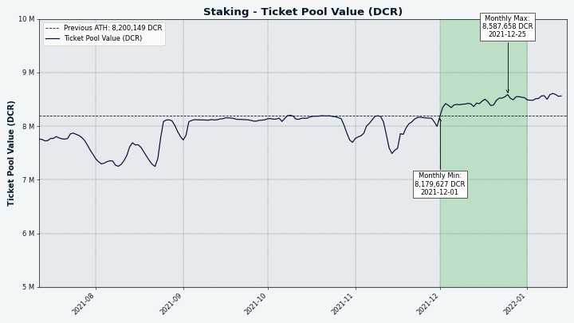
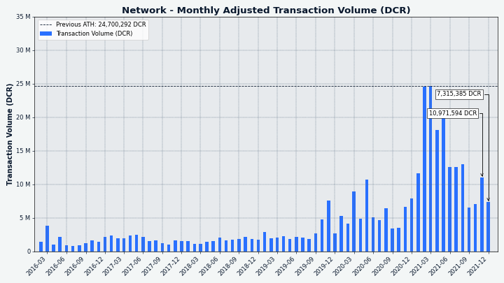
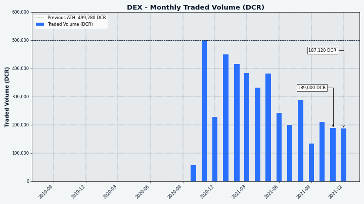

# Decred Journal – December 2021

_Image: Nodetropolis by @saender_

December's highlights:

- Decred's first payment to contractors from the new treasury was approved by a decentralized vote and sent.
- Development work for the DCP-10 consensus change was completed. It will change the PoW/PoS reward split from 60%/30% to 10%/80%.
- Politeia v1.3.1 bugfix and polishing release was deployed.
- New participation records have been set in proposal voting, staking, and mixing systems.
- The first release candidates for v1.7 were opened for testing in early Jan.
- A proposal for funding the third phase of DCRDEX development was published in early Jan.

Contents:

- [v1.7 Release Testing](#v17-release-testing)
- [Vote on Treasury Spends](#vote-on-treasury-spends)
- [Development](#development)
- [People](#people)
- [Governance](#governance)
- [Network](#network)
- [Ecosystem](#ecosystem)
- [Outreach](#outreach)
- [Media](#media)
- [Markets](#markets)
- [Relevant External](#relevant-external)
- [The Future of Decred Journal](#the-future-of-decred-journal)

## v1.7 Release Testing

Release candidate builds for the upcoming v1.7 "Based Bison" release are [available for testing](https://github.com/decred/decred-binaries/releases). Make sure to [verify](https://docs.decred.org/advanced/verifying-binaries/) the downloads before running. For extra safety [testnet coins](https://devdocs.decred.org/environments/testnet/) can be used for testing until the final release is out.

All help to make the final release bug-free and polished is greatly appreciated. Please report any issues in #support chat in [Matrix](https://chat.decred.org/#/room/#support:decred.org), [Discord](https://discord.com/channels/349993843728449537/350007452152102923), [Telegram](https://t.me/DecredSupport), or directly in the appropriate [GitHub repo](https://github.com/decred). Good hunting!

## Vote on Treasury Spends

Starting with the [payment](#governance) for November work, payments to contractors will from now on be made from the new treasury following the decentralized voting process.

If you use the command-line tools to solo vote please set your preference in the following manner:

    dcrctl --wallet settreasurypolicy "03f6e7041f1cf51ee10e0a01cd2b0385ce3cd9debaabb2296f7e9dee9329da946c" "yes or no"

That command sets how your wallet votes for treasury spend transactions ("tspends") signed by that key. The key `03f6e704...` represents the current management of the treasury and the command sets your trust to it.

You can verify this key in the [DCP-0006](https://github.com/decred/dcps/blob/master/dcp-0006/dcp-0006.mediawiki#chain-parameters) or in the [source code](https://github.com/decred/dcrd/blob/79f15b7f7269f3e139e1ce6ff7bf00d787a48a73/chaincfg/mainnetparams.go#L485). The voting is semi-automated with this one-time configuration, but it is possible to vote on individual tspend transactions when more granular control is needed.

Currently, tspends can only be voted on by solo stakers, VSP support is in the pipeline to allow Decrediton users to participate.

Read the [May issue](202105.md#new-treasury-activated) on how the process works and the [Governance](#governance) section on how the first real tspend was executed in December.

## Development

The work reported below has the "merged to master" status unless noted otherwise. It means that the work is completed, reviewed, and integrated into the source code that advanced users can [build and run](https://medium.com/@artikozel/the-decred-node-back-to-the-source-part-one-27d4576e7e1c), but is not yet available in release binaries for regular users.

<a id="dcrd" />

**[dcrd](https://github.com/decred/dcrd)**

_dcrd is a full node implementation that powers Decred's peer-to-peer network around the world._

Development work for the upcoming "Change PoW/PoS Subsidy Split To 10/80" consensus change has been completed, including the agenda [definitions](https://github.com/decred/dcrd/pull/2847), the [consensus vote](https://github.com/decred/dcrd/pull/2848) with new consensus rules and tests, and the [DCP-10](https://github.com/decred/dcps/pull/23) document with technical details. A small geek bonus of this change is it will increase the theoretical supply limit from the uncomfortable 20,999,999.99800912 to a more satisfying 21,000,000.00015952 DCR.

The new `primitives` package has been kickstarted with initial [proof-of-work](https://github.com/decred/dcrd/pull/2788) functions, calculations of [merkle tree](https://github.com/decred/dcrd/pull/2826) roots, and functions for generating and verifying [inclusion](https://github.com/decred/dcrd/pull/2827) proofs (along with full tests, benchmarks, and docs). New PoW functions build upon the new optimized `uint256` package and are much faster than the ones in use currently. `primitives` is a large refactoring [plan](https://github.com/decred/dcrd/issues/2786) to collect core consensus code in one place.

Other merged changes:

- introduced [`AssumeValid`](https://github.com/decred/dcrd/pull/2839) parameter and config option to skip certain validation checks prior to the specified block (which is assumed valid). Compared to using checkpoints for the same purpose, `AssumeValid` allows skipping more validation work and gives greater flexibility to node operators and developers (for testing).
- added an additional child key [derivation](https://github.com/decred/dcrd/pull/2845) method that strictly conforms to the [BIP-32](https://github.com/bitcoin/bips/blob/master/bip-0032.mediawiki) standard, to be used by DCRDEX. Decred's current method differs from the standard for legacy reasons.

Maintenance, refactoring, and cleanup:

- moved the `uint256` package from internal staging area and released it as v1.0.0 of the new [`math/uint256`](https://github.com/decred/dcrd/pull/2842) module. The original plan was to keep it inside the `primitives` module, but this move allows to release it sooner to serve projects outside of Decred. The new location also better reflects that it is a general purpose package, unlike `primitives`, which will be focused on Decred specifics.
- initial work to refactor [peer banning](https://github.com/decred/dcrd/pull/2554) and ban score tracking into a `banmanager` package
- changed RPC server to [submit](https://github.com/decred/dcrd/pull/2835) transactions directly now that piping it through `netsync` is no longer needed
- updated module dependencies for the upcoming release

<a id="dcrwallet" />

**[dcrwallet](https://github.com/decred/dcrwallet)**

_dcrwallet is a wallet server used by command-line and graphical wallet applications._

- added an optional parameter to set treasury vote [policy](https://github.com/decred/dcrwallet/pull/2053) specific to a treasury key or a ticket hash (will be used by VSP staking)
- return more useful info from address validation in [gRPC](https://github.com/decred/dcrwallet/pull/2091) and [JSON-RPC](https://github.com/decred/dcrwallet/pull/2096) methods
- added gRPC method to [import](https://github.com/decred/dcrwallet/pull/2116) extended public key
- added gRPC method to import [voting accounts](https://github.com/decred/dcrwallet/pull/1945) derived from a different seed (may be used by staking with Trezor and vspd)
- upgraded to [`cspp/v2`](https://github.com/decred/dcrwallet/pull/2111) module which includes an additional post-quantum key exchange
- added a config option to [limit](https://github.com/decred/dcrwallet/pull/2107) CSPP server connections per change amount
- migrated to the new [`stdscript`](https://github.com/decred/dcrwallet/pull/2108) package from dcrd
- fixed possible issues with 1-deep [reorgs](https://github.com/decred/dcrwallet/pull/2110) in SPV mode
- fixed [`listreceivedbyaccount`](https://github.com/decred/dcrwallet/pull/2119) with imported BIP-44 accounts

<a id="decrediton" />

**[Decrediton](https://github.com/decred/decrediton)**

_Decrediton is a full-featured desktop wallet app with integrated voting, StakeShuffle mixing, Lightning Network, DEX trading, and more. It runs with or without a full blockchain (SPV mode)._

User-facing:

- added a [filter](https://github.com/decred/decrediton/pull/3609) by tx ID to Transaction History and Ticket History views
- updated [DCRDEX](https://github.com/decred/decrediton/pull/3608) module to pull in v0.4 features
- added experimental [SPV support](https://github.com/decred/decrediton/pull/3615) for Decred DCRDEX wallets
- fixed 3 display issues for [watch-only](https://github.com/decred/decrediton/pull/3607) wallets
- fixed an issue with upgrading [certificates](https://github.com/decred/decrediton/pull/3616) for some older wallets

Internal:

- reused a few more components from the pi-ui library ([highlighted text](https://github.com/decred/decrediton/pull/3606), [paginator](https://github.com/decred/decrediton/pull/3603), [toggle](https://github.com/decred/decrediton/pull/3604), [buttons](https://github.com/decred/decrediton/pull/3610) and icons)
- made many productivity enhancements to the [translator](https://github.com/decred/decrediton/pull/3588) tool
- updated [English](https://github.com/decred/decrediton/pull/3618) strings for translation and removed old Transifex files

Changes in the pi-ui library (shared by Decrediton and Politeia):

- added [clickable](https://github.com/decred/pi-ui/pull/405) icon component
- added new [icons](https://github.com/decred/pi-ui/pull/406) for Decrediton
- updated [select](https://github.com/decred/pi-ui/pull/407) component to match new design specs

If you would like to add or update a Decrediton translation, please ask in our [#translations](https://chat.decred.org/#/room/#translations:decred.org) chat room.

<a id="politeia" />

**[Politeia](https://github.com/decred/politeia)**

_Politeia is Decred's proposal system. It is used to request funding from the Decred treasury._

Politeia v1.3.1 bugfix and polishing release is live on the [proposals](https://proposals.decred.org/) website. Check the release notes in [politeia](https://github.com/decred/politeia/releases/tag/v1.3.1) and [politeiagui](https://github.com/decred/politeiagui/releases/tag/v1.3.1) repositories for detailed changes.

User-facing changes merged in December:

- removed Markdown [link button](https://github.com/decred/politeiagui/pull/2678) from editor toolbar to prevent user errors
- fixed missing proposal published and edited [dates](https://github.com/decred/politeiagui/pull/2680)
- fixed downloading of vote [timestamps](https://github.com/decred/politeiagui/pull/2685)
- fixed user menu [alignment](https://github.com/decred/politeiagui/pull/2682)
- fixed infinite [loading](https://github.com/decred/politeiagui/pull/2674) on admin approved list

Internal GUI changes:

- added data mocking for proposal [creation](https://github.com/decred/politeiagui/pull/2676) and [editing](https://github.com/decred/politeiagui/pull/2692) flows, to enable automated UI testing without connecting to a backend

politeiavoter command-line app:

- improved reporting of ["already voted"](https://github.com/decred/politeia/pull/1594) errors
- [improved UX](https://github.com/decred/politeia/pull/1601) of `--hoursprior` and `--voteduration` settings
- fixed [stopping](https://github.com/decred/politeia/pull/1592) the process with Ctrl-C

Backend changes:

- allow retrieving all [comment votes](https://github.com/decred/politeia/pull/1598) without specifying the user ID filter (this was requested to better analyze the proposal process)
- added a [cache](https://github.com/decred/politeia/pull/1586) for proposal status to speed up loading of approved proposals
- execute batch reads [concurrently](https://github.com/decred/politeia/pull/1584) to improve performance
- converted route [page sizes](https://github.com/decred/politeia/pull/1604) to plugin settings to remove duplication and make it easily configurable by a sysadmin
- ensure consistent [ordering](https://github.com/decred/politeia/pull/1607) of returned records
- tell clients if comments extra data is allowed in the [policy](https://github.com/decred/politeia/pull/1602) response
- fixed handling of more than 32,767 votes by loading records in [multiple](https://github.com/decred/politeia/pull/1605) SELECT queries

<a id="dcrlnd" />

**[dcrlnd](https://github.com/decred/dcrlnd)**

_dcrlnd is Decred's Lightning Network node software. LN enables instant and low-cost transactions._

- updated to latest Decred [modules](https://github.com/decred/dcrlnd/pull/151)

<a id="cspp" />

**[cspp](https://github.com/decred/cspp)**

_cspp is a server for coordinating coin mixes using the CoinShuffle++ protocol. It is non-custodial, i.e. does not hold any funds._

- implemented [post-quantum](https://github.com/decred/cspp/pull/73) key exchange based on Streamlined [NTRU Prime](https://ntruprime.cr.yp.to/index.html) 4591^761. This key exchange occurs in addition to an x25519 key exchange as previously, such that if a weakness in [sntrup4591761](https://github.com/companyzero/sntrup4591761) is discovered, the security won't reduce to anything worse than just x25519.
- added [tags](https://github.com/decred/cspp/pull/76) to signed key exchange messages to prevent signature forgery
- check all signed messages for valid [signatures](https://github.com/decred/cspp/pull/78) (future-proofing the code if it will be used as part of a decentralized coordination protocol)

<a id="dcrdex" />

**[DCRDEX](https://github.com/decred/dcrdex)**

_DCRDEX is a non-custodial exchange for trustless trading, powered by atomic swaps._

First release candidates for the massive upcoming v0.4 release have been tagged. Advanced users can check the [`release-v0.4`](https://github.com/decred/dcrdex/tree/release-v0.4) branch and read the [release notes](https://github.com/decred/dcrdex/blob/release-v0.4/docs/release-notes/release-notes-0.4.0.md) with upgrade instructions, or try DCRDEX integrated into Decrediton's [release candidates](https://github.com/decred/decred-binaries/releases).

User-facing changes merged in December:

- fixed [volume](https://github.com/decred/dcrdex/pull/1368) on depth and candlestick charts
- changed how keys are [derived](https://github.com/decred/dcrdex/pull/1341) from the app seed to use strict BIP-32 (for compatibility with more wallets)
- added [`assetseed`](https://github.com/decred/dcrdex/pull/1324) command-line app that takes the DEX app seed and derives a wallet seed+password pair for a particular asset. The latter may be usable in some wallet software for accessing funds outside of DEX applications (e.g. btcwallet).
- [disallow](https://github.com/decred/dcrdex/pull/1367) Bitcoin Core's new Descriptor Wallets until they support the required key export method

Internal changes:

- migrated to dcrd's new [`stdscript`](https://github.com/decred/dcrdex/pull/1308) package
- final [dependency](https://github.com/decred/dcrdex/pull/1354) upgrades in preparation for the v0.4 release
- several fixes have been [backported](https://github.com/decred/dcrdex/pull/1338) to the v0.2 release branch since both v0.3 and v0.4 rely on the unreleased v1.7 of dcrd and dcrwallet

Progress towards Ethereum support:

- implemented ~8 more core [methods](https://github.com/decred/dcrdex/issues/1154) out of a long 27-item checklist. Along the way, the codebase is being continuously refactored to support account-based assets like Ethereum (originally DCRDEX was built for UTXO-based coins).
- added [funding validation](https://github.com/decred/dcrdex/pull/1293) for account-based assets
- handle different [versions](https://github.com/decred/dcrdex/pull/1339) of the swap contract
- added failure [reasons](https://github.com/decred/dcrdex/pull/1362) to the swap contract
- added wallet config option for the gas [fee limit](https://github.com/decred/dcrdex/pull/1344)
- settled on simpler definition of ["coin ID"](https://github.com/decred/dcrdex/pull/1326) for Ethereum
- simplified detection of [reorgs](https://github.com/decred/dcrdex/pull/1322) and added a script to [test](https://github.com/decred/dcrdex/pull/1316) them
- fixed client [balance](https://github.com/decred/dcrdex/pull/1321) calculation
- [keeping up](https://github.com/decred/dcrdex/pull/1309#issuecomment-977380539) with Ethereum's hardforks and breaking changes in the toolchain

Check the new development [proposal](https://proposals.decred.org/record/3326c82) for a report of Phase 2 and the roadmap for Phase 3.

<a id="dcrios" />

**[Decred Wallet (iOS)](https://github.com/planetdecred/dcrios)**

- allow the user to [hide wallet balance](https://github.com/planetdecred/dcrios/pull/873) to improve privacy
- notify the user when the [storage space](https://github.com/planetdecred/dcrios/pull/881) is low
- consistently use term ["seed words"](https://github.com/planetdecred/dcrios/pull/878)

<a id="godcr" />

**[GoDCR](https://github.com/planetdecred/godcr)**

_GoDCR is a lightweight desktop wallet app with integrated staking, privacy, and Politeia browsing._

- implemented [initial](https://github.com/planetdecred/godcr/pull/676) steps of the DEX flow (create app password, pay the reg fee, select DEX server)
- added options to turn off [Politeia](https://github.com/planetdecred/godcr/pull/721) and [transactions](https://github.com/planetdecred/godcr/pull/736) notifications
- made it harder to accidentally send from the [unmixed](https://github.com/planetdecred/godcr/pull/712) account (it may undo the privacy gains of mixing)
- ~17 bug fixes

Merged in [dcrlibwallet](https://github.com/planetdecred/dcrlibwallet) library (shared by Android/iOS wallets and GoDCR):

- updated DCRDEX [dependencies](https://github.com/planetdecred/dcrlibwallet/pull/214) to pull in the new DCR SPV wallet support
- added DEX client features to the [MultiWallet](https://github.com/planetdecred/dcrlibwallet/pull/212) manager

Progress towards the v1.0 release can be tracked [here](https://github.com/planetdecred/godcr/milestone/2).

<a id="dcrdata" />

**[dcrdata](https://github.com/decred/dcrdata)**

_dcrdata is an explorer for Decred blockchain and off-chain data like Politeia proposals, markets, and more._

- removed one redundant database [index](https://github.com/decred/dcrdata/pull/1845)
- enforce a minimum required [version](https://github.com/decred/dcrdata/pull/1880) of PostgreSQL
- updated dependencies: [npm](https://github.com/decred/dcrdata/pull/1881), [DCRDEX v0.4](https://github.com/decred/dcrdata/pull/1878), dcrd's [`stdscript`](https://github.com/decred/dcrdata/pull/1879) package

Other:

- Bug Bounty program posted a status [update](https://bounty.decred.org/2021/12/status-update/): all-time 209 submissions were processed and 19 were eligible for a payout. One minor submission will be revealed once enough users update to the upcoming 1.7 release.
- @fst\_nml posted a [progress](https://twitter.com/fst_nml/status/1474951827812585472) update on Decred+THORChain integration with first successful DCR swaps against BCH and RUNE on a privatenet. There is a detailed [dev log](https://github.com/alexdcox/thorchain-decred-work-log) of the work and challenges.

## People

Community stats as of Jan 2:

- [Twitter](https://twitter.com/decredproject) followers: 50,916 (+800)
- [Reddit](https://www.reddit.com/r/decred/) subscribers: 12,488 (+82)
- [Matrix](https://chat.decred.org/) #general users: 599 (+14)
- [Discord](https://discord.gg/GJ2GXfz) users: 2,175 (-48)
- [Telegram](https://t.me/Decred) users: 3,160 (+130)
- [YouTube](https://www.youtube.com/decredchannel) subscribers: 4,640 (+20), views: 200K (+2K)

## Governance

In December the new [treasury](https://dcrdata.decred.org/treasury) received 10,252 DCR worth $816K at December's average rate of $79.59. 1,006 DCR was spent to pay contractors, worth $80K at December's rate, or $109K at November's billing rate of $108.13. As of Jan 6, combined balance of [legacy](https://dcrdata.decred.org/address/Dcur2mcGjmENx4DhNqDctW5wJCVyT3Qeqkx) and [new treasury](https://dcrdata.decred.org/treasury) is 753,934 DCR (47.8 million USD at $63.37).

Decred's first spend from the new treasury was approved by a decentralized vote!

On Dec 18 the [transaction](https://dcrdata.decred.org/tx/f57f2f35abcfc58cb8d45da6315982610203c1335ee0d68b36240f22c24a557a) paying 1,006 DCR to contractors was broadcast to the network along with an [announcement](https://twitter.com.com/decredproject/status/1472050886830702597) with instructions on how to vote and verify the treasury key. The vote started on late Dec 18 and finished on Dec 28 when the transaction was mined in block [619,776](https://dcrdata.decred.org/block/619776). Out of 17,280 max eligible tickets, 6,269 had voted Yes and 0 had voted No by Dec 28, which created an insurmountable tally of Yes votes and triggered the "short-circuit" system to finish the vote 2 days sooner than the maximum 12 days. This algorithm allowed to make the decision faster and pay the contractors earlier.

Back in June, the first attempt to pay from the new treasury failed due to [a bug](202106.md#new-treasury-bug) making the safety system too aggressive and blocking the payment. That voting was still notable for [showing](202106.md#governance) an impressive 69% ticket participation and 100% support. Since then the contractors have been paid from the legacy treasury, but recently the unintended limit of 0.15 DCR has ended and it allowed to start making full payments from the new treasury. A consensus change was [developed](https://github.com/decred/dcps/blob/master/dcp-0007/dcp-0007.mediawiki) to correct the behavior and prevent this scenario in the future, voting to activate it will start when enough users upgrade to the upcoming v1.7 release.

On Politeia, voting on the block reward change [proposal](https://proposals.decred.org/record/427e1d4) exposed a bug that prevented some late votes from being counted. It started on Dec 9 18:36 UTC when the highest ever voter participation rate surpassed 32,767 votes (78% of all eligible tickets) and hit an unintended internal limit. In the remaining ~25 hours of voting, clients were unable to cast their votes or start new vote trickling processes with politeiavoter (trickling that had started prior to the last ~25 hours could still continue). Importantly, the bug could not have changed the vote outcome, e.g. even if 8,752 remaining eligible tickets all voted No it would still pass with 79% Yes. The fix was included and deployed with v1.3.1, see [#1605](https://github.com/decred/politeia/pull/1605) for technical details. This bug only related to the Politeia vote, it does not affect the consensus vote that will be triggered by the release of v1.7.0.

Proposal activity in December:

- The [proposal](https://proposals.decred.org/record/427e1d4) to change the block reward distribution was approved by Politeia vote with 91.7% approval and turnout of 79%. It has also collected a record of 166 comments.

- A [proposal](https://proposals.decred.org/record/1a290d8) for further funding of the [@StakeShuffle_](https://twitter.com/StakeShuffle_) Twitter bot was submitted. The requested sum of $1,684 would cover work done to improve the bot and hosting for 2022.

See Politeia Digest [issue 50](https://blockcommons.red/politeia-digest/issue050/) for more details on the month's proposals.

## Network

**Hashrate**: December's [hashrate](https://dcrdata.decred.org/charts?chart=hashrate&zoom=kwlns8ia-kxwxs928&scale=linear&bin=block&axis=time) opened at ~430 Ph/s and closed ~380 Ph/s, bottoming at 247 Ph/s and peaking at 535 Ph/s throughout the month.

Distribution of hashrate [reported](https://miningpoolstats.stream/decred) by the pools on Jan 2: Poolin 47%, AntPool 26%, F2Pool 10%, ViaBTC 7%, Luxor 6%, BTC.com 3%, OKEx 0.3%, CoinMine 0.1%. Distribution of 1,000 blocks actually [mined](https://miningpoolstats.stream/decred) before Jan 2 closely matched the reported numbers.

**Staking**: [Ticket price](https://dcrdata.decred.org/charts?chart=ticket-price&zoom=kwlns8ia-kxwxs928&axis=time&visibility=true-true&mode=stepped) varied between 191.9-233.3 DCR, with 30-day [average](https://dcrstats.com/) at 214.7 DCR (+11.1).

The [locked amount](https://dcrdata.decred.org/charts?chart=ticket-pool-value&zoom=kwlns8ia-kxwxs928&scale=linear&bin=block&axis=time) was 8.07-8.60 million DCR, meaning that 59.2-62.7% of the circulating supply [participated](https://dcrdata.decred.org/charts?chart=stake-participation&zoom=kwlns8ia-kxwxs928&scale=linear&bin=block&axis=time) in proof-of-stake. Both absolute and percentage values made new all-time highs.

_What has been staked... Cannot be unstaked_

**VSP**: On Jan 2, ~6,550 (-250) live tickets were managed by [listed](https://decred.org/vsp/) vspd servers and 171 (-28) by listed legacy dcrstakepool servers. Collectively the 7 legacy and 15 new VSPs managed 16.7% (-0.8%) of the ticket pool. The 3 unlisted but still active legacy VSPs managed 39 (-6) live tickets.

The count of VSP-managed tickets has been trending down since at least June 2021 when this observation started at ~9,300 tickets (22.7% of the ticket pool).

**Nodes**: Throughout December there were around 180 reachable nodes according to [dcrextdata](https://dcrextdata.planetdecred.org/nodes).

Node versions as of Jan 1 [snapshot](https://nodes.jholdstock.uk/user_agents) (216 total, dcrd only): v1.6.2 - 62%, v1.7 dev builds - 13%, v1.6.0 - 10%, v1.6.1 - 8%, v1.6 dev builds - 3%, v1.5.2 - 2.3%, v1.5.1 - 1.4%.

The share of [mixed coins](https://dcrdata.decred.org/charts?chart=coin-supply&zoom=jz3q3lq8-l0s732o6&scale=linear&bin=day&axis=time&visibility=true-true-true) varied between 54.4-56.9% and set a new all-time high with the sum of mixed unspent coins above 7.8 million.

Year 2021 had the highest transaction volume:

## Ecosystem

[Bybit](https://www.bybit.com/) has [tweeted](https://twitter.com/Bybit_Official/status/1471419840263081986) that DCR/USDT trading is live. The exchange is based in Singapore.

PoolBay [announced](https://www.reddit.com/r/decred/comments/rhp4p0/decred_mining_pools_and_network_charts/) a new mining pool [dashboard](https://poolbay.io/crypto/54/decred) and charts for Decred, as an alternative to [MiningPoolStats](https://miningpoolstats.stream/decred).

Warning: the authors of the Decred Journal have no idea about the trustworthiness of any of the services above. Please do your own research before trusting your personal information or assets to any entity.

## Outreach

Decred announcements are now also published on [Odysee](https://odysee.com/@Decred:c), in addition to all video content mirrored from YouTube. Users of Odysee or the [LBRY](https://lbry.com) network can support Decred content by tipping or staking LBC (staked coins can be withdrawn at any time).

The chat bridge between Telegram [@Decred](https://t.me/Decred) and Matrix #101 rooms was deactivated due to a large amount of spam. The spam was removed automatically by the moderation bots on the Telegram side but had to be manually cleaned up in the Matrix room. The bridge between Matrix and Discord #101 rooms remains.

The highly-discussed block reward change proposal made an appearance on [Hacker News](https://news.ycombinator.com/item?id=29530099).

Monde PR's achievements for December:

- pitched two stories/PR opps to finance and crypto publications

Secured the following news articles:

- Decred was mentioned as a top crypto in [CoinDesk](https://www.coindesk.com/business/2021/12/01/shiba-inu-memes-are-the-future-of-money/). The article was syndicated to [Nasdaq](https://www.nasdaq.com/articles/shiba-inu%3A-memes-are-the-future-of-money) and [Yahoo!](https://finance.yahoo.com/news/shiba-inu-memes-future-money-171404107.html).
- an article in [Finder.com](https://www.finder.com/ke/litecoin-ltc-price-prediction) featuring commentary from @jz on Litecoin
- an article in [Finder.com](https://www.finder.com/ke/ripple-xrp-price-prediction) featuring commentary from @jz on Ripple
- an article in [Geek Culture](https://medium.com/geekculture/which-two-altcoins-could-overtake-ethereum-in-the-ongoing-bull-run-84316d955cc0) featuring commentary from @jz on Ethereum. The article was also syndicated to [Concierge](https://coincierge.de/2021/top-investor-sicher-diese-zwei-altcoins-werden-ethereum-im-laufenden-bull-run-noch-ueberholen/).

## Media

Videos:

- Decred in Depth 45 - with Jake Yocom-Piatt - Changing PoW/PoS subsidy split by @elima\_iii ([youtube](https://www.youtube.com/watch?v=dPDak2o9VSk))
- Decred Price Analysis - 17th December 2021 by Brave New Coin ([youtube](https://www.youtube.com/watch?v=B_KGCBiabEI))

Translations:

- Decred Journal November 2021 was [translated](https://xaur.github.io/decred-news/) to Arabic (@arij, @abdulrahman4) and Chinese (@Dominic). Thank you all!

## Markets

In December DCR was trading between USD 60.05-110.95 / BTC 0.00129-0.00234. The average daily rate was $79.59.

## Relevant External

The Sushiswap AMM DEX is the subject of a [scandal](https://rekt.news/sushiswap-scandal/) after it emerged that 0xMaki had been forced out of their role by a clique of senior developers and that the team is riven by internal conflict.

BadgerDAO was the subject of a [hack](https://badger.com/technical-post-mortem) involving a compromised Cloudflare API key, which was used to inject malicious code for a subset of site users, leading to the loss of $130 million in assets, with $9 million being recovered thus far and a [plea](https://www.vice.com/en/article/v7dv4a/hacked-cryptocurrency-platform-begs-hacker-to-please-return-dollar119-million) for more to be returned by the hacker. The funds were not returned, and the BadgerDAO community has moved to determining how to make [restitution](https://www.coindesk.com/tech/2021/12/16/after-130m-hack-badgers-restitution-plan-tests-limits-of-dao-governance/) for victims of the hack. There is an interesting dynamic at play here where the stolen funds fall into three tranches with different remedy mechanisms - and the top 10 token holders were the most severely affected, representing a loss that the treasury cannot cover with available funds. One major victim of the BadgerDAO hack was the Celsius network, which [reportedly](https://cryptopotato.com/celsius-network-reportedly-lost-50-million-in-the-120-million-badgerdao-hack/) lost $50 million.

Users of popular NFT trading platform OpenSea became eligible to claim a new [token](https://decrypt.co/89325/sos-token-aidrop-opendao-opensea-what-you-need-to-know-explainer) (SOS) on Dec 24, and by Dec 26 over 200,000 wallets had claimed it. The token was not produced by OpenSea themselves, who have instead hinted at an IPO, but was rather released by a pseudonymous developer, using the public record of OpenSea NFT trades to determine eligibility to claim SOS. The market cap of SOS hit $200 million within two days, as initial votes were passed to set up liquidity provision incentives and other token distribution details. The issuance plans for SOS include reserving 20% to provide support to OpenSea users, particularly hack victims.

The EOS validators have moved to [block](https://www.theblockcrypto.com/post/126801/eos-community-halts-payments-worth-250-million-in-eos-to-block-one-and-brock-pierce) the payment of $250 million worth of EOS to Block.one. Block.one was due to receive 67 million EOS over a 6-7 year period, with half of these tokens going to Brock Pierce. This comes as part of an ongoing dispute over EOS intellectual property, which the community of validators wishes to acquire but which is currently held by the Bullish exchange (reasons unclear).

Public goods funding platform Gitcoin [deactivated](https://twitter.com/gitcoin/status/1469046914226307127) a grant for one of the recipient teams because the team conducted some activities in Iran and had recently been de-funded by Consensys. Gitcoin also [completed](https://twitter.com/gitcoin/status/1471635072952389632) round 12 of its grants program, which saw $3.1 million donated from 27.2K donors.

"The Internet Computer" held a major round of [voting](https://medium.com/dfinity/the-internet-computers-long-term-r-d-plans-motion-proposals-guide-dce6fdcd697d) to approve future direction of research and development work, with 25 different proposals to vote on and DFINITY foundation abstaining from the vote. The voting period for these proposals was just 24 hours and all 25 were approved with 5-6% approval (minimum requirement of 3% voting power voting yes) and very little opposition.

That's all for December. Thanks for reading!

## The Future of Decred Journal

> 45 months of Decred Journal was a great ride but recent issues were getting increasingly harder to make due to lack of time and energy. I plan to stop producing DJ after this issue, take a break, and do other things I wanted to do in Decred and beyond.
> 
> I will be around in chats to help anyone willing to take over the production of DJ, either as it looks today, or in a refreshed form to make it better.
> 
> Thank you to all contributors, translators, and most importantly readers, for this amazing journey! (@bee)

## About

This is issue 45 of Decred Journal. Index of all issues, mirrors, and translations is available [here](https://xaur.github.io/decred-news/).

Most information from third parties is relayed directly from the source after a minimal sanity check. The authors of the Decred Journal cannot verify all claims. Please beware of scams and do your own research.

Credits (alphabetical order):

- writing and editing: bee, bochinchero, degeri, l1ndseymm, richardred
- reviews and feedback: davecgh, lukebp
- title image: saender
- funding: Decred stakeholders
