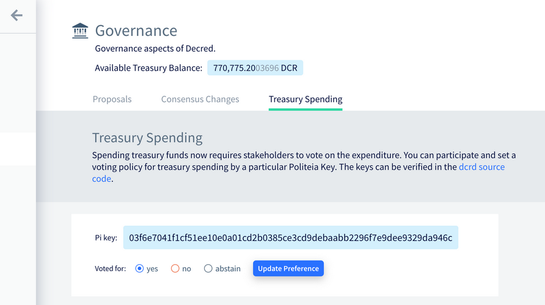
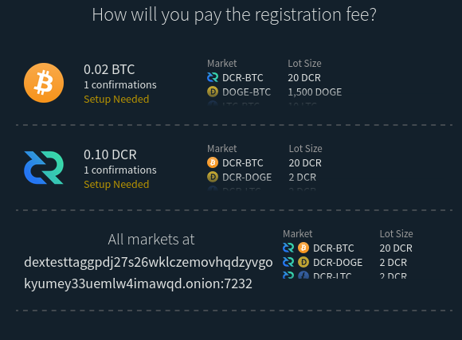
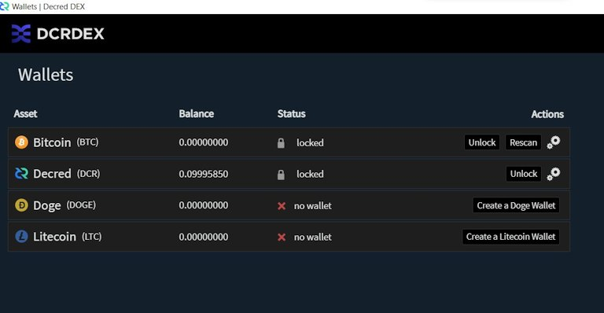
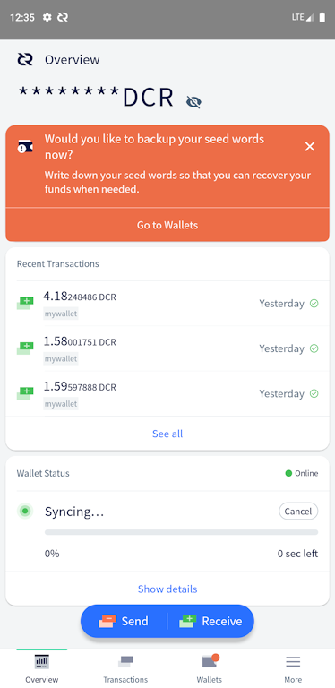
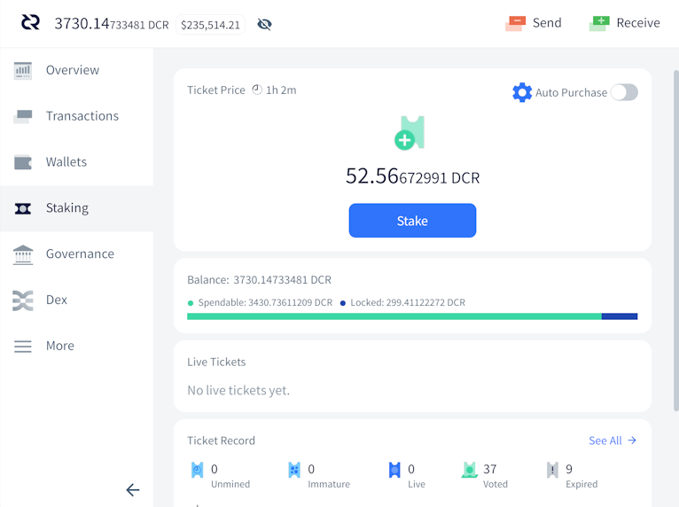
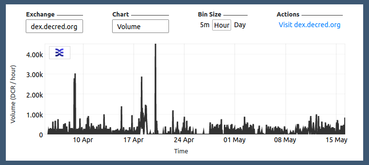
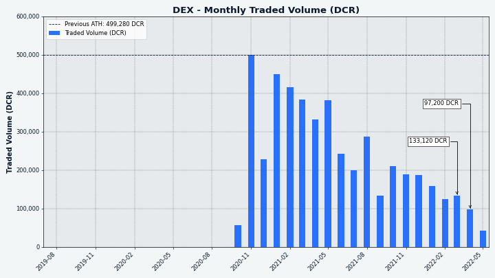

# Decred Journal – April 2022

_Image: Objective Constructs by @saender_

DJ is back! This issue covers April news, with a few exceptions.

Recent highlights:

- The four consensus changes DCP0007-DCP0010 were all approved by stakeholder voting with almost unanimous support (~99.7%) in April, and all have activated on May 8 so any nodes running old versions will have been forked off the network.
- In March, the majority of the funds held in the old treasury address, over 610,000 DCR, was transferred into the new treasury which requires stakeholder approval of spends.
- Version 1.7.2 of the Decred node and wallet software was released on May 11, it fixes some bugs and adds the treasury spend voting feature for Decrediton users.
- So far in 2022 there have been four Politeia proposals published, all approved with 96%+ support - funding has been extended for Politeia and DCRDEX development, along with video production and the @StakeShuffle\_ Twitter bot.

Contents:

- [Development](#development)
- [People](#people)
- [Governance](#governance)
- [Network](#network)
- [Ecosystem](#ecosystem)
- [Outreach](#outreach)
- [Events](#events)
- [Media](#media)
- [Discussions](#discussions)
- [Markets](#markets)
- [Relevant External](#relevant-external)

## Development

The work reported below has the "merged to master" status unless noted otherwise. It means that the work is completed, reviewed, and integrated into the source code that advanced users can [build and run](https://medium.com/@artikozel/the-decred-node-back-to-the-source-part-one-27d4576e7e1c), but is not yet available in release binaries for regular users.

<a id="dcrd" />

**[dcrd](https://github.com/decred/dcrd)**

_dcrd is a full node implementation that powers Decred's peer-to-peer network around the world._

- Removed all RPCs and associated code related to [missed and expired tickets](https://github.com/decred/dcrd/pull/2911). With the [automatic revocations](https://github.com/decred/dcps/blob/master/dcp-0009/dcp-0009.mediawiki) consensus change, wallets will not really need these RPCs anymore. In addition to lowering the maintenance costs, this removal unlocks performance optimizations of the ticket database.
- [Optimized old block](https://github.com/decred/dcrd/pull/2912) version upgrade checks.
- Added documentation for what is expected for [backported pull requests](https://github.com/decred/dcrd/pull/2934).
- Fixed one [race condition](https://github.com/decred/dcrd/pull/2932) and backported the fix to the v1.7.2 patch release.
- Various code optimizations, cleanup, and other improvements, especially for the major [subsidy split consensus change](https://proposals.decred.org/record/427e1d4).

More progress made towards the [`primitives`](https://github.com/decred/dcrd/issues/2786) module:

- Implemented a [subsidy cache](https://github.com/decred/dcrd/pull/2920) with functions to calculate subsidies for Proof of Work, votes, and the treasury. Also includes a full suite of tests and benchmarks.

<a id="decrediton" />

**[Decrediton](https://github.com/decred/decrediton)**

_Decrediton is a full-featured desktop wallet app with integrated voting, StakeShuffle mixing, Lightning Network, DEX trading, and more. It runs with or without a full blockchain (SPV mode)._

Decredition v1.7.2 has been released on May 11 with over two months of improvements and fixes (including everything reported below). Users are urged to [upgrade](https://decred.org/wallets/). Check the release notes [here](https://github.com/decred/decred-binaries/blob/master/release-notes.md#decrediton-v172). As always, [verify the downloads](https://docs.decred.org/advanced/verifying-binaries/) before installing.

DCRDEX integration:

- SPV mode is [no longer experimental](https://github.com/decred/decrediton/pull/3739) for the DCRDEX. Users can access the DEX tab while running Decredition in SPV mode.
- DEX [login will be skipped](https://github.com/decred/decrediton/pull/3749) once the DEX is initially launched. This should make loading up the DEX faster and improve flow.
- DCRDEX module updated to [v0.4.3](https://github.com/decred/decrediton/pull/3748) with some new features and important bug fixes. More in the [DEX](#dcrdex) section.

VSP oversight enhancements:

- Enhanced Vote details page to show a [warning](https://github.com/decred/decrediton/pull/3732) if consensus vote choices cast by the VSP differ from those set in the user's wallet. The page will also show the VSP that managed the ticket, and the transaction that has spent (voted with) it.
- Added [block voting](https://github.com/decred/decrediton/pull/3733) info to the Vote page (last block validity, voting version, vote bits).
- An [alert](https://github.com/decred/decrediton/pull/3736) is now in place in the Governance tab when using any un-upgraded VSP. A VSP that runs older software may not be able to use all vote preferences when voting users' tickets.

Other changes:

- A [Treasury Spending Tab](https://github.com/decred/decrediton/pull/3718) has been introduced. This is where users will vote on treasury spends.
- Added redesigned [Tutorial](https://github.com/decred/decrediton/pull/3669) views under the Settings tab covering many aspects of Decred.
- The Staking tab now features [an infographic](https://github.com/decred/decrediton/pull/3740) for first-time ticket buyers, reminding users the basics of Decred's time-locked ticket-based voting system.
- Performance improvements in the [transaction's history tab](https://github.com/decred/decrediton/pull/3745). Notably, rows are now loaded gradually using infinite scrolling, which will reduce bottlenecks and sluggishness. Added highlighting of the last clicked row to keep track of user's position in the list.
- Per-account encryption is now automatic for [restored wallets](https://github.com/decred/decrediton/pull/3746).
- More automated UI testing coverage.
- ~5 bug fixes.

_Voting on Treasury Spending is now in Decrediton!_

_RTFM without leaving Decrediton!_

<a id="politeia" />

**[Politeia](https://github.com/decred/politeia)**

_Politeia is Decred's proposal system. It is used to request funding from the Decred treasury._

Backend, merged:

- Fixed [two](https://github.com/decred/politeia/pull/1633) [bugs](https://github.com/decred/politeia/pull/1635) in migration code (did not affect normal operation of Politeia).

Backend, in progress:

- [Importing legacy proposals](https://github.com/decred/politeia/issues/1425) into the new Politeia database. A new tool to [convert](https://github.com/decred/politeia/pull/1631) legacy data into the new format is complete. Up next is the [import](https://github.com/decred/politeia/pull/1632) tool for loading converted data into the production Politeia database.

User-facing UI changes:

- Added a new component for editing, rendering and diffing [Markdown](https://github.com/decred/politeiagui/pull/2741), to replace the deprecated `react-mde` package. This should enhance editing UX and improve line diffing.
- Added [infinite scrolling](https://github.com/decred/politeiagui/pull/2750) to Proposals list.
- Revamped [loading placeholders](https://github.com/decred/politeiagui/pull/2755) for proposals.
- Reimplemented [Proposal details](https://github.com/decred/politeiagui/pull/2723) page using the latest components.
- Utilized new Markdown rendering and error handling in the [comments plugin](https://github.com/decred/politeiagui/pull/2758).

Developer UI changes:

- Implemented the new [layout system](https://github.com/decred/politeiagui/pull/2748) on the home page. Layout primitives like Column and Row are now reused from the pi-ui library.
- Added common [modal component](https://github.com/decred/politeiagui/pull/2749).
- Added [a flag to configure plugins](https://github.com/decred/politeiagui/pull/2754) when generating Politeia-like apps with the `newapp` CLI tool.
- New features and fixes in the shared [pi-ui library](https://github.com/decred/pi-ui) (default theming, button tooltips, layout primitivs, etc.).

<a id="cspp" />

**[cspp](https://github.com/decred/cspp)**

_cspp is a server for coordinating coin mixes using the CoinShuffle++ protocol. It is non-custodial, i.e. does not hold any funds._

R&D to replace single-server CoinShuffle++ with a peer-to-peer model has been announced:

> we will begin simulating this (p2p cspp vs single server) soon.
> 
> the expectation is that dealing with registration and timeouts will be messier, but it should be possible. afaict, the main threat model is partitioning attacks, whether external or internal. \[[@behindtext](https://twitter.com/behindtext/status/1506941924585967619), 2022-03-24\]

<a id="dcrdex" />

**[DCRDEX](https://github.com/decred/dcrdex)**

_DCRDEX is a non-custodial exchange for trustless trading, powered by atomic swaps._

DCRDEX development is on fire. SPV mode is now completed for use in Decredition. Dogecoin has been added. Zcash and Ethereum are making steady progress on testnet. Tor hidden service support is ready. The registration UI, which was a bit confusing for some, has been clarified.

Asset support:

- The Litecoin code now makes use of and [requires SegWit](https://github.com/decred/dcrdex/pull/1554).
- Support added for [Dogecoin](https://github.com/decred/dcrdex/pull/1558) (including custom [block deseralizer](https://github.com/decred/dcrdex/pull/1596) to handle merged mining blocks).
- Ethereum transactions now [link to etherscan](https://github.com/decred/dcrdex/pull/1572) on the orders page.
- Preparations for supporting Ethereum-based [tokens](https://github.com/decred/dcrdex/pull/1399).

Other changes:

- Tor [hidden service](https://github.com/decred/dcrdex/pull/1575) support added. This introduces special handling for DEX hosts with .onion names.
- The DEX Registration [UI has been updated](https://github.com/decred/dcrdex/pull/1589) to account for v3 .onion addresses. The UI also clarifies the registration fee process.
- [Privacy enhancements](https://github.com/decred/dcrdex/pull/1584) to protect against memory scraping attacks targeting user passwords and seeds.
- Better contract expiry edge case handling on the [server](https://github.com/decred/dcrdex/pull/1541) and on the [client](https://github.com/decred/dcrdex/pull/1548).
- Various bug fixes, optimizations, and other improvements.

> v0.5 is shaping up with a lot of big changes. Loads [already merged](https://github.com/decred/dcrdex/milestone/16?closed=1), but under review presently are swap acceleration with [CPFP transactions](https://github.com/decred/dcrdex/pull/1555), [mixed DCR](https://github.com/decred/dcrdex/pull/1498) account support, support for LTC's MWEB release, [Zcash](https://github.com/decred/dcrdex/pull/1570), [Electrum](https://github.com/decred/dcrdex/pull/1607) wallet support (SPV for many assets with existing/external wallets), and of course ETH on mainnet which we have been holding back from prime time. \[[@chappjc](https://matrix.to/#/!zefvTnlxYHPKvJMThI:decred.org/$sH4VqshHQ7s-yUkldhYG7SGlVpPlyCjExbiLkCoX9Y0), 2022-05-13\]

_Much wallets!_

<a id="dcrandroid" />

**[Decred Wallet (Android)](https://github.com/planetdecred/dcrandroid)**

- DCR logo [removed](https://github.com/planetdecred/dcrandroid/pull/623) from QR codes.
- Added an info icon explaining how transaction [byte size](https://github.com/planetdecred/dcrandroid/pull/606) is determined and how it affects fees.
- User is notified if [available disk space](https://github.com/planetdecred/dcrandroid/pull/607) is low.
- Icon added to [hide and show](https://github.com/planetdecred/dcrandroid/pull/601) wallet balance on Overview page.
- [Transaction sending page](https://github.com/planetdecred/dcrandroid/pull/624) has been reworked to provide users with more context of a successful transaction.
- Database type information has been added to the [wallet settings page](https://github.com/planetdecred/dcrandroid/pull/626).
- Prevent users from restoring duplicate wallets from the [same seed](https://github.com/planetdecred/dcrandroid/pull/629), and also from importing duplicate watch-only wallets using the same xpub.
- Seed input restore page is now more [protected against screenshots](https://github.com/planetdecred/dcrandroid/pull/614). Also, app window preview is no longer shown in task switcher.
- Updated [French](https://github.com/planetdecred/dcrandroid/pull/605) translation.
- ~4 bug fixes, and other tweaks and optimizations.

_Keep your DCR balance to yourself!_

<a id="dcrios" />

**[Decred Wallet (iOS)](https://github.com/planetdecred/dcrios)**

- Users can use [biometrics](https://github.com/planetdecred/dcrios/pull/883) such as Touch ID/Face ID for their spending Password/PIN.
- Info icon added to explain [transaction byte size](https://github.com/planetdecred/dcrios/pull/876) and fees.
- [Send success dialog](https://github.com/planetdecred/dcrios/pull/902) has been reworked.
- Removed DCR logo from Receive [QR code](https://github.com/planetdecred/dcrios/pull/903).
- [Privacy account](https://github.com/planetdecred/dcrios/pull/906) setup flow has been optimized.
- Prevent restoring [duplicate wallets](https://github.com/planetdecred/dcrios/pull/905) from same seed.
- Various tweaks, bug fixes, and other optimizations.

<a id="godcr" />

**[GoDCR](https://github.com/planetdecred/godcr)**

_GoDCR is a lightweight desktop wallet app with integrated staking, privacy, and Politeia browsing._

GoDCR v1.7.0 has been released on May 11! This is the first Mainnet release after almost 8 months of development and polishing since the v0.9.0 Testnet release. Get the [downloads and release notes](https://github.com/planetdecred/godcr/releases/tag/v1.7.0) and verify that it was really signed by `release@planetdecred.org` (key ends with `A3C9EB3218CCC3E8`).

Merged in April:

- Visualize [available/locked](https://github.com/planetdecred/godcr/pull/826) balance on the Staking page.
- Added a checkbox to [move funds](https://github.com/planetdecred/godcr/pull/890) when setting up mixing.
- Prevent restoring [duplicate wallets](https://github.com/planetdecred/godcr/pull/891) from same seed or same xpub.
- Proposal details [displayed in a modal](https://github.com/planetdecred/godcr/pull/901) instead of tooltip.
- Prevent usage of the default account in [StakeShuffle](https://github.com/planetdecred/godcr/pull/904).
- Fixed possible [address reuse](https://github.com/planetdecred/godcr/pull/899) on Receive page. Also, accessing Send and Receive pages will be blocked until sync is complete.
- ~14 bug fixes, ~10 UX tweaks, code refactoring.
- The base [dcrlibwallet](https://github.com/planetdecred/dcrlibwallet) updated to bring new features and fixes to Android, iOS and GoDCR wallets.

In progress:

- Initial [DEX integration](https://github.com/planetdecred/godcr/issues/619), specifically [wallet setup](https://github.com/planetdecred/godcr/pull/798) and [DEX registration](https://github.com/planetdecred/godcr/pull/900).

_GoDCR balance overview. Don't just look at it, press the button!_

**Other**

- Updates for [Go 1.18](https://github.com/decred/dcrctl/pull/45) in many repos.
- The [Decred Bug Bounty](https://bounty.decred.org/) program has been updated. A total of 228 submissions have been processed so far, with 21 of them being eligible for a payout. Details of three vulnerabilities can now be made public. Congrats to @Al1ex and @aditi\_singghh who have been listed in the Hall of Fame! Thanks to community member [@degeri](https://twitter.com/degeri_crypto) for running the bug bounty program.

## People

Welcome to new first-time contributors with code merged to master: @Juneezee ([dcrdex](https://github.com/decred/dcrdex/commits?author=Juneezee)) and @yaroyazeed ([dcrandroid](https://github.com/planetdecred/dcrandroid/commits?author=yaroyazeed))!

The Decred News Updates have a new face. [@Dajana_DCR](https://twitter.com/DajanaDcr) is now helping @Exitus as a news host, changing things up! Her [debut video](https://www.youtube.com/watch?v=BSHywc5qRzU&t=38s) received over 1,000 views and 101 likes.

Community stats as of May 2 (compared against statistics from [December Journal](202112.md)):

- [Twitter](https://twitter.com/decredproject) followers: 54,862 (+3,946, +987/mo)
- [Reddit](https://www.reddit.com/r/decred/) subscribers: 12,621 (+133, +33/mo)
- [Matrix](https://chat.decred.org/) #general users: 662 (+63, +16/mo)
- [Discord](https://discord.gg/GJ2GXfz) users: 2,293 (+118, +30/mo)
- [Telegram](https://t.me/Decred) users: 2,828 (-332, -83/mo)
- [YouTube](https://www.youtube.com/decredchannel) subscribers: 4,639 (-1), views: 214K (+14K, +3.4K/mo)

## Governance

In April the new [treasury](https://dcrdata.decred.org/treasury) received 9,481 DCR worth $575K at April's average rate of $60.62. 1,152 DCR was spent from the legacy treasury address to pay contractors, worth $70K at April's rate, or $66K at March's billing rate of $57.22.

In Feb-Mar, around 617K DCR was transferred from the legacy treasury address to the new treasury account that requires stakeholder approval to spend from.

As of May 10, combined balance of [legacy](https://dcrdata.decred.org/address/Dcur2mcGjmENx4DhNqDctW5wJCVyT3Qeqkx) and [new treasury](https://dcrdata.decred.org/treasury) is 788,247 DCR (32.7 million USD at $41.52). Around 46K DCR remains in the legacy treasury, or ~6% of the total.

Since the last issue of Decred Journal ([December 2021](202112.md)), there have been four proposals published on Politeia, all approved.

The [proposal](https://proposals.decred.org/record/4475472) for continued development of Politeia with $138,600 was approved in March with 97% support and turnout of 55%. This sees Politeia development funded until July 2022.

A [proposal](https://proposals.decred.org/record/6e9b633) by @Exitus to fund video content production with $32,000, covering the remainder of 2022, was approved in March with 98% support and turnout of 55%.

A [proposal](https://proposals.decred.org/record/1a290d8) to continue with phase 2 of @StakeShuffle\_ the Twitter bot with $1,684 was approved with 96% support and turnout of 55%.

The [proposal](https://proposals.decred.org/record/3326c82) to continue phase 3 of DCRDEX development with $370,000 was approved in January with 97% support and 57% ticket turnout.

All of the consensus changes deployed as part of the v1.7 release were approved by voters with very similar voting outcomes: 99.9% approval of the 60% of tickets that voted (as opposed to abstaining, which ~40% did), there were just 61 votes against the [subsidy split change](https://proposals.decred.org/record/427e1d4) (vs 23,664 Yes votes). Considering the opposition to this subsidy split proposal which was voiced in some quarters, the outcome suggests that the complaining parties either didn't have (m)any tickets or chose not to vote No with them for some reason.

The changes activated on May 8, so along with the new subsidy split ([DCP-10](https://github.com/decred/dcps/blob/master/dcp-0010/dcp-0010.mediawiki)) there are fixed treasury spend policy ([DCP-7](https://github.com/decred/dcps/blob/master/dcp-0007/dcp-0007.mediawiki)), explicit version upgrades ([DCP-8](https://github.com/decred/dcps/blob/master/dcp-0008/dcp-0008.mediawiki)), and automatic ticket revocations ([DCP-9](https://github.com/decred/dcps/blob/master/dcp-0009/dcp-0009.mediawiki)).

## Network

**Hashrate**: April's [hashrate](https://dcrdata.decred.org/charts?chart=hashrate&zoom=l1ezonii-l2odxr6y&bin=day&axis=time) opened at ~261 Ph/s and closed ~331 Ph/s, bottoming at 212 Ph/s and peaking at 370 Ph/s throughout the month.

Distribution of hashrate [reported](https://miningpoolstats.stream/decred) by the pools on May 10: Poolin 52%, ViaBTC 24%, F2Pool 8%, AntPool 6%, Luxor 5%, BTC.com 3%, CoinMine and OKx less than 1%.

Distribution of 1,000 blocks actually [mined](https://miningpoolstats.stream/decred) before May 10: Poolin 51%, ViaBTC 16%, DsV1GF7 9%, Luxor 4%, BTC.com 4%, F2Pool 3.6%, CoinmMine 0.4%, DsX51bV 0.1%, unknown 12%.

**Staking**: [Ticket price](https://dcrdata.decred.org/charts?chart=ticket-price&zoom=l1ezonii-l2odxr6y&bin=window&axis=time&visibility=true-true&mode=stepped) varied between 195-228 DCR, with 30-day [average](https://dcrstats.com/) at 214.2 DCR.

The [locked amount](https://dcrdata.decred.org/charts?chart=ticket-pool-value&zoom=l1ezonii-l2odxr6y&bin=block&axis=time) was 8.58-8.89 million DCR, meaning that 61.4%-63.0% of the circulating supply [participated](https://dcrdata.decred.org/charts?chart=stake-participation&zoom=l1ezonii-l2odxr6y&bin=block&axis=time) in Proof of Stake.

63.03% of the supply staked represents a **new all time high!**

_We're just staking. A bit more again. Nothing to see here!_

**VSP**: On May 10, ~6,780 live tickets were managed by 15 [listed](https://decred.org/vsp/) vspd servers, or 16.6% of the ticket pool. This is a small bump by ~230 tickets or +0.4% of the ticket pool, compared to our last snapshot on Jan 2.

Legacy (dcrstakepool) tickets can no longer be voted since May 8 when the chain forked to the new rules. On May 10, the 7 listed and 1 unlisted legacy VSPs collectively reported 125 tickets but this figure is outdated. 5 of these VSPs have stopped voting between May 2021 and Feb 2022. The 3 remaining VSPs to operate till the very end had 27 live tickets on May 8. coinmine.pl, decredbrasil.com, and stakey.net showed to be the most hardcore.

**Nodes**: Throughout April there were around 175 reachable nodes according to [PD Analytics](https://analytics.planetdecred.org/nodes).

Node versions as of May 10 [snapshot](https://nodes.jholdstock.uk/user_agents) (187 total, dcrd only): v1.7.1 - 49%, v1.7.0 - 17%, v1.7.0 dev builds - 9%, v1.6.2 - 5%, v1.8.0 dev builds - 4%, v1.6.0 - 2%, v1.7.2 - 2%, v1.5.2 - 2%, other - 7%.

The share of [mixed coins](https://dcrdata.decred.org/charts?chart=coin-supply&zoom=jz3q237o-la8vk000&scale=linear&bin=day&axis=time&visibility=true-true-true) varied between 57.9%-59.3%. Daily [mixed amount](https://dcrdata.decred.org/charts?chart=privacy-participation&zoom=jzuht6o0-l33oao00&bin=day&axis=time) varied between 290-450K DCR.

Decred's [Lightning Network](https://ln-map.jholdstock.uk/) has seen 45 nodes, 78 channels with a total capacity of 41.5 DCR as of May 10 - a nice bump since January's 36 nodes, 66 channels, and 25.5 DCR capacity.

## Ecosystem

A new VSP titled [big.decred.energy](https://github.com/decred/dcrwebapi/pull/161) run by [@DCR_uncle](https://twitter.com/DCR_Uncle) is in the process of being added to the official VSP list.

Warning: the authors of the Decred Journal have no idea about the trustworthiness of any of the services above. Please do your own research before trusting your personal information or assets to any entity.

## Outreach

Monde PR's achievements:

- Pitched Decred to 8 PR ops in finance and crypto publications.
- Responded to 1 request for comments.

Secured the following news articles:

- @jy-p was featured in an ARTE-TV documentary titled "Are Cryptocurrencies Better Money?". The documentary was broadcast on ARTE TV in [French](https://www.arte.tv/fr/videos/101938-007-A/42-la-reponse-a-presque-tout/) and [German](https://www.arte.tv/de/videos/101938-007-A/sind-kryptowaehrungen-das-bessere-geld/) and also appeared online. Here is the version with [English subtitles](https://vimeo.com/694783460) (password Db9p6ki).
- @jy-p was interviewed by [Coin Rivet](https://coinrivet.com/decred-founder-reveals-how-it-bounced-back-from-miner-manipulation/) talking about Decred's progress since 2018 and the subsidy split change. The article was syndicated to [Yahoo! Finance](https://finance.yahoo.com/news/decred-founder-reveals-bounced-back-135936130.html).
- A piece in [Cryptopolitan](https://www.cryptopolitan.com/20-quotes-about-bitcoin-predictions/#8_Jake_Yocom-Piatt) featuring commentary from @jy-p on Bitcoin.
- An article in [Finder](https://www.finder.com/litecoin-ltc-price-prediction) featuring commentary from @jz on Litecoin.

## Events

**Attended:**

- @Exitus attended a [cryptocurrency meetup](https://twitter.com/exitusdcr/status/1506118577035825157) at the Hashhouse in Medellin, Colombia. There he informed attendees about Decred and its unique features.
- [Insaf Nori](https://twitter.com/in_insaf/status/1506976446044114944) (@arij) was invited to talk about [Blockchain Technology](https://decredcommunity.github.io/events/index/20220326.1) and Decred Technology at the half-day training organized for the members of AEFDS Deroua, Morocco.

## Media

[@Applesaucesome](https://twitter.com/applesaucesome1/status/1517024462222336000) has written a cloud-based Decred [full-node tutorial](https://medium.com/@applesaucesome.dcr/decred-full-node-on-digital-ocean-92b904922291) using Digital Ocean.

> **Why run a full node you might ask?**
> 
> *Full nodes are the backbone of Decred. By validating and broadcasting transactions without relying on third parties they help keep the network decentralized. Each full node added to the network adds to its security and robustness.*

There are also [Raspberry Pi tutorials](https://www.youtube.com/watch?v=B-5O_GBcbV0) available.

Meet [decredsociety.com](https://www.decredsociety.com/) - a new website dedicated to Decred related ideas, news, and other aspects by @phoenixgreen. @Applesaucesome will also be posting technicals and other information related to Decred's markets.

**Selected articles:**

- [Top 10 privacy coins & how to buy them](https://www.binance.com/en/blog/fiat/top-10-privacy-coins--how-to-buy-them-421499824684903655) by Binance (Decred #4)
- [Decred price soars 45% in one day three weeks before a major hard fork](https://cointelegraph.com/news/decred-price-soars-45-in-one-day-three-weeks-before-a-major-hard-fork) by Yashu Gola of Cointelegraph
- [Spread of sanctions makes privacy tokens the hot bet in crypto markets](https://www.coindesk.com/markets/2022/04/13/spread-of-sanctions-makes-privacy-tokens-the-hot-bet-in-crypto-markets/) by Lyllah Ledesma of CoinDesk
- [Decred price prediction: Here's why DCR is going vertical](https://www.investingcube.com/decred-price-prediction-heres-why-dcr-is-going-vertical-cryptocurrencies/) by Crispus Nyaga of InvestingCube

**Videos:**

- [Decred News Update - On-chain voting underway, dcrd 1.7.1, LN upgrades, subsidy change + new host!](https://www.youtube.com/watch?v=BSHywc5qRzU) by @Exitus
- [Decred DEX tutorial: peer-to-peer atomic swap trading](https://www.youtube.com/watch?v=XaE_xzGKjeQ) by @Exitus
- [Decred block explorer - DCRDATA Series part 1](https://www.youtube.com/watch?v=o4Cye1CRThs) by @phoenixgreen
- [Hard fork vs soft fork - Decred Fundamentals](https://www.youtube.com/watch?v=DmkQrk3OInU) by @phoenixgreen
- [Six years of Decred - part 1](https://www.youtube.com/watch?v=0Z50aW-RZtw) by @phoenixgreen
- [Six years of Decred - part 2](https://www.youtube.com/watch?v=CI4yFLfHnqc) by @phoenixgreen
- [What is Decred crypto and how is it performing?](https://www.youtube.com/watch?v=30waU59s4Jk) by Kalkine Media

A new monthly LiveStream initiative has been started by @phoenixgreen and @Exitus called "Decred and the State of the Market". Any eager community members are welcome to join!

- [Sanctions, confiscation and regulations](https://www.youtube.com/watch?v=t3KQ4UhNNOI) by @Exitus and @phoenixgreen
- [Stable coins and DAO's](https://www.youtube.com/watch?v=a5W_90nuJQ8) by @Exitus and @phoenixgreen

**TikTok videos:**

- [TikTok talking about the importance of the DCR treasury](https://www.tiktok.com/@decred_crypto/video/7081478628759833861) by @Exitus and @DCR\_Dajana
- [Tiktok about Cathie Wood mentioning Decred](https://twitter.com/DajanaDcr/status/1511162514779914241) by @Exitus and @DCR\_Dajana

**Art and fun:**

- [Decred is the Jack of all Trades](https://twitter.com/exitusdcr/status/1513394638446542849) by @Exitus
- [DCRDEX atomic-swap art](https://twitter.com/exitusdcr/status/1518466782037745666) by @Exitus
- [Decred Ramadan](https://twitter.com/DecredArabia/status/1509991552382349312) by @DecredArabia

Please post yours memes in the `#DCR Memes` channel on Discord or Matrix!

**Non-English content**:

- The [Decred Brazil](https://twitter.com/Decred_BR) Twitter account has been actively posting about new Decred updates, animations, and more.

## Discussions

Selected Reddit posts:

- dcrd lead developer @davecgh [responds to criticism of the subsidy split 10/80 change](https://www.reddit.com/r/decred/comments/ueaqrt/when_is_the_108010_system_is_gonna_take_place/i6zx6v6/?context=3) from PoW miners

Selected Twitter discussions:

- [Tracking DCR suppy vs demand](https://twitter.com/PermabullNino/status/1516441186763952140) by @PermaBullNino
- [Decred Decentralized](https://twitter.com/behindtext/status/1520039910350237698) by @jy-p
- [Learning the inner-workings of Decred](https://twitter.com/DCR_Uncle/status/1515224110682415106) by @DCR\_Uncle
- [Comparing PoW vs PoS](https://twitter.com/behindtext/status/1514626081902505985) by @jy-p

## Markets

In April DCR was trading between USD $52.40-$86.20 / BTC 0.00129-0.00216. The average daily rate was $57.22.

DCR rallied by nearly 45% to over $86 in one day on April 18th, its highest level in four months. This pump was unfortunately short-lived.

_DEX April-May volume, in DCR_

_DEX monthly volume, in DCR_

## Relevant External

The latest big news which seems to be affecting the crypto markets is related to the collapse of LUNA and de-pegging of its associated stablecoin (UST) - and there are claims this was driven by an actor who short sold the tokens to profit from this eventuality. The latest development at time of writing (May 12) is that the Terra blockchain has been [halted](https://www.coindesk.com/business/2022/05/12/luna-issuer-terra-halts-blockchain-after-week-of-losses/) to prevent governance attacks because the value of LUNA had fallen too low and the whole blockchain became vulnerable, validators will coordinate to restart the chain. This is the most significant failure of a "stablecoin" to maintain its value so far, as LUNA had reached a valuation of $41B which put it in the top 10 crypto market caps, but quickly lost 97.5% of this value as UST de-pegged and it [emerged](https://thedefiant.io/do-kwon-terra-luna-spiral-humility/) that founder Do Kwon had been behind several other failed stablecoins pseudonymously. This disaster is still unfolding but it seems set to result in major losses for people who invested in the Terra ecosystem and trusted its stablecoin concept - it is also already drawing increased regulatory [attention](https://thedefiant.io/ust-meltdown-regulation-yellen/) on the stablecoin and DeFi space.

In April, the JUNO community voted to [confiscate](https://www.coindesk.com/layer2/2022/04/29/juno-blockchain-community-officially-votes-to-revoke-whales-tokens/) millions of dollars of tokens from the wallet of user who was accused of gaming the airdrop to receive 10% of all airdropped tokens. After an initial sentiment poll in March which favoured revoking the whale's tokens the holder came forward and claimed that the tokens belonged to his clients. However the vote to block access to all of the user's tokens was passed with 74% approval, he has said he is considering legal action if the tokens are not returned to the clients who own them.

The Ronin Bridge, associated with Axie Infinity play to earn game, was [hacked](https://cointelegraph.com/news/the-aftermath-of-axie-infinity-s-650m-ronin-bridge-hack) for $600M in March, when an attacker gained access to the private keys of 4 validators run by Sky Mavis (game creators) and one by "Axie DAO", and this was enough for them to take control and steal the funds. It [seems](https://twitter.com/ericgoldenx/status/1508844665881116674) the attackers also tried to profit on their attack by shorting the RON and AXS tokens, but because nobody noticed the missing funds for a week the attacker's short position got liquidated before the news broke. In April the Lazarus Group in North Korea was [revealed](https://twitter.com/chainalysis/status/1514645221027594245) by Chainalysis to be the beneficiary of the hack.

Yuga Labs have been busy in 2022 - [acquiring](https://techcrunch.com/2022/03/11/bored-apes-maker-yuga-labs-acquires-cryptopunks-nft-collection/) the rights to Cryptopunks NFTs and making these match BAYC terms of use and [launching](https://nftnow.com/news/bayc-official-apecoin-token-launch/) the APE token to serve as a currency for their ecosystem in March, then [issuing](https://www.coindesk.com/business/2022/05/01/bayc-team-raises-285m-with-otherside-nfts-clogs-ethereum/) deeds to land in the BAYC metaverse (Otherside) in April. The Otherside deeds launch was successful in raising $285M for Yuga Labs, but it was widely [criticised](https://decrypt.co/99256/bored-ape-creators-slammed-nightmare-ethereum-nft-land-drop) for a poor launch mode and implementation which saw users spending $180M in ETH fees in a gas price auction on poorly optimised smart contracts.

Cryptocurrency has featured in a number of ways in the conflict between Russia and Ukraine, with Ukraine [already](https://fortune.com/2022/01/31/ukraine-crypto-superpower-russia-crisis-investors-bitcoin/) having quite a developed crypto policy and stance before the Russian invasion. In the early days of the war the Ukrainian government [called for](https://www.ft.com/content/f3778d00-4c9b-40bb-b91c-84b60dd09698) and received crypto donations, and one month in had received over $100M in donations this way. However, by April the Ukrainian government's tone towards crypto had [shifted](https://fortune.com/2022/04/22/ukraine-government-banning-crypto-purchases-with-national-currency/) and the prospect of capital outflows weakening the national currency led the government to ban the purchase of crypto with the local currency, and limit purchases with foreign currencies to $3,300/month.

The prospect that Russia might use crypto to evade financial sanctions received significant [coverage](https://www.whitecase.com/publications/alert/us-regulators-seek-prevent-use-crypto-circumvent-russia-sanctions) but it [seems](https://theconversation.com/are-russias-elite-really-using-cryptocurrency-to-evade-sanctions-179559) that there is little sign of Russians state use of crypto, although the number of smaller retail level transactions has grown substantially since early 2022.

That's all for April. Share your updates for the next issue in our [#journal](https://chat.decred.org/#/room/#journal:decred.org) chat room.

## About

This is issue 46 of Decred Journal. Index of all issues, mirrors, and translations is available [here](https://xaur.github.io/decred-news/).

Most information from third parties is relayed directly from the source after a minimal sanity check. The authors of the Decred Journal cannot verify all claims. Please beware of scams and do your own research.

Credits (alphabetical order):

- writing and editing: bee, bochinchero, Exitus, l1ndseymm, richardred
- reviews and feedback: chappjc, davecgh
- title image: saender
- funding: Decred stakeholders
