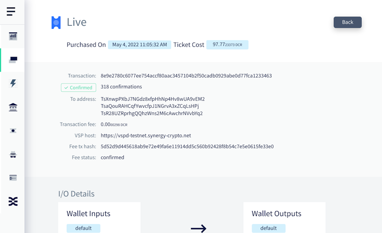
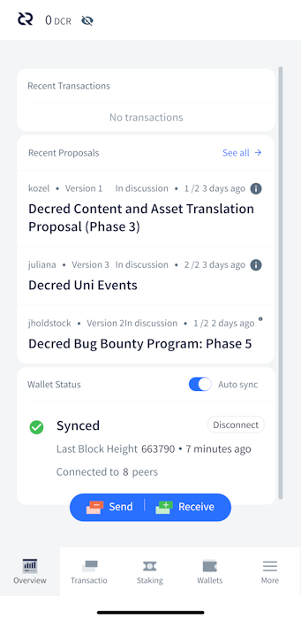
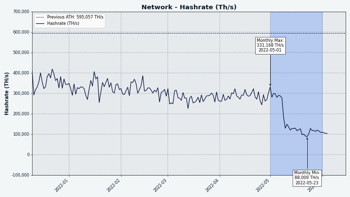
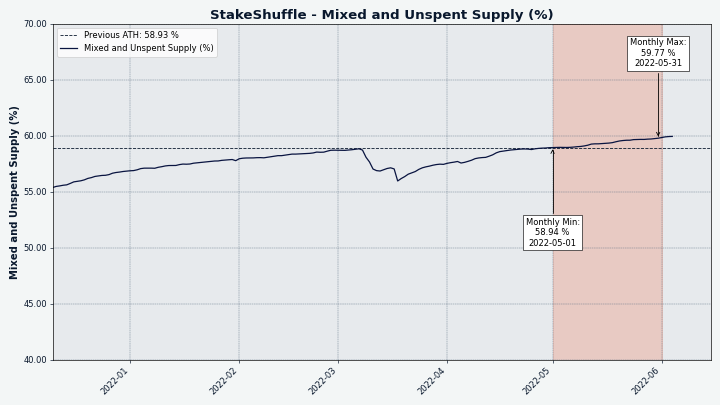

# Decred Journal – May 2022

_Image: Point Integral by @saender_

May was quite an epic month for Decred:

- The four consensus changes (DCP0007-10) recently approved by voters have activated on mainnet.
- There have been two interim bug fixing releases of the main software, v1.7.2 and v1.7.3.
- GoDCR v1.7.0 has been released, the first version which is intended for mainnet use - and a new proposal for funding has been published.
- Decred Magazine launched, it is a new platform for hosting and sharing Decred news and other content spearheaded by @phoenixgreen.
- All of the old failed tickets which didn't get revoked by their owners have now been revoked thanks to the activation of DCP-0009.
- Four new proposals have been published on Politeia.

Contents:

- [Four Consensus Changes Activated](#four-consensus-changes-activated)
- [Core Software v1.7.2 and v1.7.3 Released](#core-software-v172-and-v173-released)
- [GoDCR v1.7.0 Released](#godcr-v170-released)
- [Android and iOS Wallets v1.7.0 Released](#android-and-ios-wallets-v170-released)
- [Development](#development)
- [People](#people)
- [Governance](#governance)
- [Network](#network)
- [Ecosystem](#ecosystem)
- [Outreach](#outreach)
- [Events](#events)
- [Media](#media)
- [Discussions](#discussions)
- [Markets](#markets)
- [Relevant External](#relevant-external)

## Four Consensus Changes Activated

All four [consensus upgrades](https://docs.decred.org/governance/consensus-rule-voting/consensus-vote-archive/) added in v1.7 and approved by the stakeholders have activated on May 8, in [block 657,280](https://dcrdata.decred.org/block/657280):

- [DCP-0007](https://github.com/decred/dcps/blob/master/dcp-0007/dcp-0007.mediawiki) - the algorithm that determines the maximum monthly spend from the new treasury was fixed, and should no longer interfere with making monthly payments to contractors.

- [DCP-0008](https://github.com/decred/dcps/blob/master/dcp-0008/dcp-0008.mediawiki) - nodes now reject newer transaction versions they can't handle, and explicit consensus upgrades are now required to define and allow newer versions. It will be easier and less error-prone for all actors in the Decred ecosystem to integrate with future consensus changes. Some engineers would even say that _fully-validating nodes_ rejecting data they cannot _fully validate_ is the only sensible way to operate. With this upgrade, Decred doubles down on hard forks as the most secure and reliable way to upgrade consensus, "because we can".

- [DCP-0009](https://github.com/decred/dcps/blob/master/dcp-0009/dcp-0009.mediawiki) - miners now revoke missed and expired tickets automatically. This removes a big user frustration of dealing with revocations, and especially the pain of lost (not backed up) redeem scripts. Wallet code and GUIs become simpler, staking becomes easier.

- [DCP-0010](https://github.com/decred/dcps/blob/master/dcp-0010/dcp-0010.mediawiki) - 50% of each block's reward is redirected from PoW miners to PoS voters, changing the split from 60/30/10 to 10/80/10 for PoW/PoS/treasury. This will hopefully rebalance the supply and demand of DCR and reduce the ability of malicious actors to manipulate the markets. As a byproduct, higher PoS rewards make it more attractive to stake DCR. This was the [most debated proposal](https://proposals.decred.org/record/427e1d4) so far, but stakeholders said Yes and after around 6 months it is live.

This is perhaps the biggest consensus upgrade in Decred's history.

## Core Software v1.7.2 and v1.7.3 Released

dcrd and dcrwallet v1.7.2 were [released](https://twitter.com/decredproject/status/1524430609543831553) on May 11 - the latest version as of writing. dcrd got a fix for a rare and hard to hit case when optional indexing is enabled. dcrwallet received a fix for `verifymessage`, enabled change of public wallet passphrase, and some internal/developer changes. [Release notes](https://github.com/decred/decred-binaries/releases/tag/v1.7.2).

[Decrediton v1.7.2](https://github.com/decred/decred-binaries/releases/tag/v1.7.2#decrediton-v172) added support for voting on treasury spends, more information in VSP staking, updated DEX module, and several bug fixes. v1.7.3 has [followed](https://twitter.com/decredproject/status/1528430113355878401) on May 18 with fixes for macOS 10.15 and setting treasury spending vote choices. [Release notes](https://github.com/decred/decred-binaries/releases/tag/v1.7.3).

[Verify the downloads](https://docs.decred.org/advanced/verifying-binaries/) to make sure they have not been modified. The files are signed with Decred Release subkey ending with `6D897EDF518A031D` (primary key ends with `6DF634AA7608AF04`).

## GoDCR v1.7.0 Released

The debut Mainnet release of GoDCR was [announced](https://www.reddit.com/r/decred/comments/uwa6w2/godcr_desktop_wallet_for_decred_written_purely_in/) on May 23 after almost 8 months of development since the v0.9.0 Testnet release.

The following features are supported:

- Basic wallet send/receive
- Staking (with automatic ticket buying)
- Wallet privacy via StakeShuffle
- Proposal voting
- Consensus rule change voting
- Message signing
- Wallet restores
- Running on Linux, macOS, Windows, and FreeBSD

[Download it here](https://github.com/planetdecred/godcr/releases/tag/v1.7.0) and verify the signature from `release@planetdecred.org` (key ends with `A3C9EB3218CCC3E8`).

This is just the start for GoDCR. Up next is DEX trading, coin selection, treasury spend voting, and the ambitious goal of building desktop and mobile apps from one unified codebase. Check the [proposal](https://proposals.decred.org/record/0ef42e5) seeking to fund this work in 2022-2023.

_Image: GoDCR overview showing the summary of each subsystem._

## Android and iOS Wallets v1.7.0 Released

Android and iOS wallets v1.7.0 were [released](https://www.reddit.com/r/decred/comments/umye1t/decred_mobile_wallet_v170_has_been_released_for/) on May 11.

Changes since v1.6.1 include:

- Updated Decred modules to v1.7.0
- Updated certificate of the mixing server
- Manual privacy setup improvements
- Bug fixes and other minor improvements

Mainnet iOS app is available on the [App Store](https://apps.apple.com/us/app/decred-wallet/id1462247643) and the testnet version on [TestFlight](https://testflight.apple.com/join/7KL4VnB2).

Android app is available on Google [Play Store](https://play.google.com/store/apps/details?id=com.decred.dcrandroid.mainnet). For advanced users there is a new [APK download](https://github.com/planetdecred/dcrandroid/releases/tag/v1.7.0) signed by Planet Decred Release key.

## Development

The work reported below has the "merged to master" status unless noted otherwise. It means that the work is completed, reviewed, and integrated into the source code that advanced users can [build and run](https://medium.com/@artikozel/the-decred-node-back-to-the-source-part-one-27d4576e7e1c), but is not yet available in release binaries for regular users.

<a id="dcrd" />

**[dcrd](https://github.com/decred/dcrd)**

_dcrd is a full node implementation that powers Decred's peer-to-peer network around the world._

The general direction in May was to further leverage the consensus changes that activated recently, by adding optimizations and removing unneeded code.

- Optimized [stake node pruning](https://github.com/decred/dcrd/pull/2943) by using block headers instead of checkpoints (reducing dependency on the latter). Header-based sync operations are more efficient and pave the way to multi-peer block downloads.
- Retroactively fixed revocation [fee limit bug](https://github.com/decred/dcrd/pull/2948) that allowed one party to increase the fee paid to miners for another party in split transactions. This has never been exploited on `mainnet` and _can not_ be exploited since the automatic revocations agenda has activated.
- Reworked [old block rejection](https://github.com/decred/dcrd/pull/2945) logic to replace the use of checkpoints with the `assumevalid` block (hard-coded in each release). Semantics have been clarified to reflect that "checkpoints" are now only used for handling old forks and are no longer used for optimizations (that now rely on other methods). The `--nocheckpoints` CLI option has been replaced with `--allowoldforks`. With this change, the role of checkpoints is reduced to a minimum, which is desirable since they are a kind of a workaround.
- Removed the deprecated [address index](https://github.com/decred/dcrd/pull/2930) along with the associated CLI flags (`--addrindex` and `--dropaddrindex`) and `searchrawtransactions` JSON-RPC. Address index was a lot of overhead from a development perspective to maintain, it wasn't used by anything of note, and it didn't really easily provide what most people want from addresses anyway, which is a full balance as opposed to all of the individual transactions. All of the information it provided, and more, is available via dcrdata.
- Added a function to make [basic transaction sanity](https://github.com/decred/dcrd/pull/2949) checks to the `blockchain/standalone` module, which is nice for consumers (e.g. DCRDEX) since this module has very few dependencies.
- Implemented [header proof storage](https://github.com/decred/dcrd/pull/2938) along with a one-way database upgrade. This will avoid recalculating commitment hashes by storing/loading them from disk. The concept of "block header commitments" sounds scary, but it is a powerful piece of tech worth learning about. It was described well in the [proposal](https://proposals.decred.org/proposals/0a1ff84), but in short, these commitments are tiny fingerprints of blockchain data which allow to build fast _and_ secure lightweight apps. Currently there is only one type of commitment - the "compact block filters" that allow light wallets to find users' transactions quickly and securely. More commitments for other use cases may be added in the future.
- Made [`blockchain`](https://github.com/decred/dcrd/pull/2952) package internal and not exported. This is part of a continuing overall effort to reduce the total number of exported packages and modules to reduce the maintenance burden, and eventually get to the point it will be possible to follow [semantic versioning](https://semver.org/) for the root module.
- Continued [code](https://github.com/decred/dcrd/pull/2922) [cleanup](https://github.com/decred/dcrd/pull/2954) enabled by the recent consensus changes.

<a id="dcrwallet" />

**[dcrwallet](https://github.com/decred/dcrwallet)**

Released with the v1.7.2 patch:

- [Fixed](https://github.com/decred/dcrwallet/pull/2150) verification of signed messages.
- [Added](https://github.com/decred/dcrwallet/pull/2148) `walletpubpassphrasechange` to JSON-RPC methods. It allows to change wallet's public passphrase.
- [Added](https://github.com/decred/dcrwallet/pull/2146) VSP host to the returned ticket information, enabling wallet apps to know which VSP the ticket is managed by.
- [Removed](https://github.com/decred/dcrwallet/pull/2153) all ticket revoking functionality. Now that revocations are created [automatically](https://proposals.decred.org/record/e2d7b7d) there is no need for wallets to handle it.

Merged in `master`:

- [Compatibility](https://github.com/decred/dcrwallet/pull/2158) updates to the latest dcrd changes regarding missed and expired tickets.
- [Fixed](https://github.com/decred/dcrwallet/pull/2164) an error in the `getstakeinfo` command (caused by changes regarding expired tickets).

<a id="decrediton" />

**[Decrediton](https://github.com/decred/decrediton)**

_Decrediton is a full-featured desktop wallet app with integrated voting, StakeShuffle mixing, Lightning Network, DEX trading, and more. It runs with or without a full blockchain (SPV mode)._

Merged and released with May's v1.7.2 and v1.7.3 patches:

- Users can now fetch the [VSP fee transaction hash and fee status](https://github.com/decred/decrediton/pull/3752) in transaction details. If the received fee transaction shows confirmed status for an unspent ticket but the dcrwallet thinks it's not yet confirmed, the app processes and updates the status in the background.
- Improvements made to [Ticket Status and Ticket History views](https://github.com/decred/decrediton/pull/3751). Now the tabs remember their scroll positions after coming back from the transaction details page. Rows are loaded gradually using the infinite scroll functionality.
- [Removed revoke](https://github.com/decred/decrediton/pull/3754) tickets functionality. Now that revocations are created [automatically](https://proposals.decred.org/record/e2d7b7d) there is no need for wallets to handle it.
- Electron (the framework Decredtion is built on) has been [bumped to v17.4.2](https://github.com/decred/decrediton/pull/3765) to fix an issue that prevented dcrwallet/dcrd from launching on macOS 10.15 (Catalina).
- ~7 bug fixes

_Image: Decrediton showing additional VSP info for each ticket._

<a id="politeia" />

**[Politeia](https://github.com/decred/politeia)**

_Politeia is Decred's proposal system. It is used to request funding from the Decred treasury._

Backend changes:

- tlog client now has [its own package](https://github.com/decred/politeia/pull/1636) in politeiad (required for [importing](https://github.com/decred/politeia/pull/1632) legacy proposals).
- Trillian version [updated](https://github.com/decred/politeia/pull/1642) to 1.4.1.
- Fixed minimum proposal [start date bug](https://github.com/decred/politeia/pull/1637).
- Fixed [CSRF error check](https://github.com/decred/politeia/pull/1638).
- Fixed [error messages](https://github.com/decred/politeia/pull/1640) related to start and end dates.
- Comments plugin [fsck function rewritten](https://github.com/decred/politeia/pull/1641) to fix several bugs. "fsck" is short for "file system check" and is responsible for verifying data integrity and rebuilding the caches.

GUI changes:

- Fixed the [comment form component](https://github.com/decred/politeiagui/pull/2760) by replacing `formik` with ` react-hook-form`.
- Reimplemented home page [Sidebar](https://github.com/decred/politeiagui/pull/2764), [External Link](https://github.com/decred/politeiagui/pull/2768) modal, and [Navbar](https://github.com/decred/politeiagui/pull/2763) in the new [GUI plugin architecture](https://github.com/decred/politeiagui/tree/master/plugins-structure#politeiagui---plugins-structure).
- Fixed several bugs related to [proposal start/end dates](https://github.com/decred/politeiagui/pull/2771).

Changes in the pi-ui library (common UI elements for Politeia and Decrediton):

- Support [keyboard navigation](https://github.com/decred/pi-ui/pull/446) in the `DatePicker` widget.
- Added [info icon](https://github.com/decred/pi-ui/pull/447) with a tooltip to the text input field.

<a id="vspd" />

**[vspd](https://github.com/decred/vspd)**

_vspd is server software for running a Voting Service Provider. A VSP votes on behalf of its users 24/7 and cannot steal funds._

- 12 commits representing various code optimizations and refactoring.

<a id="dcrlnlpd" />

**[dcrlnlpd](https://github.com/decred/dcrlnlpd)**

_dcrlnlpd stands for "DCR LN Liquidity Provider Daemon"._

Meet the the newest project in Decred's LN ecosystem:

> This service allows running a Lightning Network Liquidity Provider in the Decred network.
> 
> This LP allows remote clients to request the node associated to the LP to open an LN channel back to the requesting client. This allows the requesting client to have some inbound bandwidth to receive LN payments.
> 
> To create the channel, the LP charges some amount, specified as a percentage of the desired channel size. \[[README file](https://github.com/decred/dcrlnlpd/blob/941743f09e2d01d5bae36b492de38e49c9565510/README.md)\]

<a id="dcrdex" />

**[DCRDEX](https://github.com/decred/dcrdex)**

_DCRDEX is a non-custodial exchange for trustless trading, powered by atomic swaps._

User-facing changes:

- Added support for [accelerating BTC transactions](https://github.com/decred/dcrdex/pull/1555) using the [Child Pays For Parent](https://bitcoinops.org/en/topics/cpfp/) fee bumping technique. Orders page will show a button if the order is able to be accelerated. When clicking the button, a popup shows up which allows the user to choose a higher fee.
- A button has been added to the Wallets page to [recreate the BTC SPV wallet](https://github.com/decred/dcrdex/pull/1507), as there are still many ways in which it could get [corrupted](https://github.com/decred/dcrdex/issues/1438).
- Support updating server's [TLS certificate](https://github.com/decred/dcrdex/pull/1602) with one supplied by the user.

Internal and developer changes:

- Allow [harness testing](https://github.com/decred/dcrdex/pull/1550) on testnet for the ETH client.
- Simnet harness tests [generalized](https://github.com/decred/dcrdex/pull/1603) to work with all currently supported assets.
- Implemented [stage 3](https://github.com/decred/dcrdex/pull/1530) of the signature message truncation fix. It is tricky to fix a bug when it is "deployed" on many co-dependent servers and clients, but the devs have a smart [4-stage plan](https://github.com/decred/dcrdex/pull/1526) for it.
- Switched to Bitcoin Cash [testnet4](https://github.com/decred/dcrdex/pull/1606) now that it is first class in bchd. Also, added a custom encoder for BCH's [CashAddr](https://www.reference.cash/protocol/blockchain/encoding/cashaddr/) addresses.
- Added methods for [calculating the median fee](https://github.com/decred/dcrdex/pull/1597) of the most recent block(s) in BTC/DOGE/LTC/BCH. Implemented a cache to prevent repeated scans between blocks, and a fallback if there is not enough data to estimate the fee.
- Updates to newer modules from [btcsuite and go-ethereum](https://github.com/decred/dcrdex/pull/1542).
- Dependency updates to build with [Node.js 18](https://github.com/decred/dcrdex/pull/1617).
- Encoding now allows for transaction [data longer](https://github.com/decred/dcrdex/pull/1620) than 65,535 bytes.
- Generic [wait and retry function](https://github.com/decred/dcrdex/pull/1623) reworked to gradually "taper off" (slow down) after a few initial frequent attempts.
- Various bug fixes, dependency upgrades, and optimizations.

While working on DCRDEX the developers have made [various contributions](https://twitter.com/blockchainbuck/status/1532146821300101120) to upstream projects: [btcd](https://github.com/btcsuite/btcd/commits?author=chappjc), [btcwallet](https://github.com/btcsuite/btcwallet/commits?author=chappjc), [go-ethereum](https://github.com/ethereum/go-ethereum/pull/24533), [neutrino](https://github.com/lightninglabs/neutrino/commits?author=chappjc), [zcash](https://github.com/zcash/zcash/commits?author=buck54321), and others.

Dev team has started a discussion on [renaming DCRDEX](https://www.reddit.com/r/decred/comments/v3gxa8/should_we_rebrand_decred_dex/) and are accepting name and logo ideas.

> Probably found a vendor to perform an audit of our Solidity atomic swap contracts. Notably, our contracts are so simple, we're under their minimum order size. That's what happens when you're not trying to extract trading fees and there's no admin functionality. \[[@blockchainbuck](https://twitter.com/blockchainbuck/status/1527105721724190722)\]

_Image: DCRDEX allows to accelerate swaps when the network is busy but you want that trade ASAP._

<a id="dcrios" />

**[Decred Wallet (iOS)](https://github.com/planetdecred/dcrios)**

- GitHub build [workflow added](https://github.com/planetdecred/dcrios/pull/907) to ensure dcrios builds without any errors.
- [Updated](https://github.com/planetdecred/dcrios/pull/899) automated UI tests.

<a id="godcr" />

**[GoDCR](https://github.com/planetdecred/godcr)**

_GoDCR is a lightweight desktop GUI wallet with integrated staking, privacy, Politeia voting, consensus voting, and more._

- [Default account](https://github.com/planetdecred/godcr/pull/910) is now filtered out when privacy is enabled.
- All [signed messages](https://github.com/planetdecred/godcr/pull/918) can be verified, the restriction to just personal wallet addresses has been removed.
- Redirect modals [added](https://github.com/planetdecred/godcr/pull/923) to debug page (sending to docs.decred.org) and transaction details page (sending to the block explorer).
- Reworked [key event](https://github.com/planetdecred/godcr/pull/907) handling to be less error-prone and more efficient.
- Option to [import watch-only](https://github.com/planetdecred/godcr/pull/943) wallet added to the splash screen.
- Privacy is [enabled by default](https://github.com/planetdecred/godcr/pull/936) when a new wallet is created.
- Gio [updated](https://github.com/planetdecred/godcr/pull/934) to latest stable version.
- A bottom [navigation bar](https://github.com/planetdecred/godcr/pull/948) has replaced the side bar on screen-sizes below 479px (mobile devices).
- [Fixes](https://github.com/planetdecred/godcr/pull/957) to wallet crashes and proposal titles.
- Bug fixed where [incorrect locked balance](https://github.com/planetdecred/godcr/pull/956) was displayed in the Staking tab.
- Fixed builds on [Android](https://github.com/planetdecred/godcr/pull/924) and [FreeBSD](https://github.com/planetdecred/godcr/pull/914).
- ~6 other bug fixes and some optimizations.

Android and iOS builds of GoDCR [already function](https://proposals.decred.org/record/0ef42e5/comments/31) in some capacity, although there remains a lot of work to polish the mobile/touch UX.

_Image: First look of GoDCR running on an emulated mobile OS._

<a id="dcrdata" />

**[dcrdata](https://github.com/decred/dcrdata)**

_dcrdata is an explorer for Decred blockchain and off-chain data like Politeia proposals, markets, and more._

- Updated [dependencies](https://github.com/decred/dcrdata/pull/1913) to build with Node.js 16 and 18.

<a id="dcrweb" />

**[decred.org](https://github.com/decred/dcrweb)**

_dcrweb is the source code for the decred.org website._

- [Updated chat room](https://github.com/decred/dcrweb/pull/1033) links.
- [Added](https://github.com/decred/dcrweb/pull/1035) PoW/PoS reward consensus change [press release](https://decred.org/press/2022-05-09-decred_shifts_to_majority_pos/).
- [Removed defunct](https://github.com/decred/dcrweb/pull/1037) exchanges.

**Other**

- dcrseeder: DNS seeding was finally [removed](https://github.com/decred/dcrseeder/pull/50), and a small fix to [prune dead peers](https://github.com/decred/dcrseeder/pull/47) more aggressively.

## People

Welcome to new first-time contributors with code merged to master in January-March:

- arjundashrath ([dcrd](https://github.com/decred/dcrd/commits?author=arjundashrath))
- liukun ([dcrd](https://github.com/decred/dcrd/commits?author=liukun))
- monsa00 ([godcr](https://github.com/planetdecred/godcr/commits?author=monsa00))
- ukane-philemon ([dcrdata](https://github.com/decred/dcrdata/commits?author=ukane-philemon), [dcrdex](https://github.com/decred/dcrdex/commits?author=ukane-philemon), [vspd](https://github.com/decred/vspd/commits?author=ukane-philemon))

We had no Decred Journal for these months but it's never too late to greet new contributors. Welcome onboard guys!

Community stats as of Jun 1 (compared to May 2):

- [Twitter](https://twitter.com/decredproject) followers: 54,474 (-388)
- [Reddit](https://www.reddit.com/r/decred/) subscribers: 12,631 (+10)
- [Matrix](https://chat.decred.org/) #general users: 677 (+15)
- [Discord](https://discord.gg/GJ2GXfz) users: 2,305 (+12)
- [Telegram](https://t.me/Decred) users: 2,858 (+30)
- [YouTube](https://www.youtube.com/decredchannel) subscribers: ~4,630 (-9), views: 209K (+2K)

See [June 2022](https://decredcommunity.github.io/social-media-stats/posts/20220604.1) report on Decred SM performance for a more in-depth look at Feb vs Jun numbers.

## Governance

In May the new [treasury](https://dcrdata.decred.org/treasury) received 9,407 DCR worth $390K at this month's average rate of $41.46. 2,950 DCR was spent from the legacy treasury to pay contractors, worth $122K at May's rate, or $179K at April's billing rate of $60.62. These payments were to cover both March and April's contractor invoices.

As of Jun 12, combined balance of [legacy](https://dcrdata.decred.org/address/Dcur2mcGjmENx4DhNqDctW5wJCVyT3Qeqkx) and [new treasury](https://dcrdata.decred.org/treasury) is 795,673 DCR ($23.9 million USD at $30.09).

A new [proposal](https://proposals.decred.org/record/0ef42e5) was submitted by Raedah Group to fund GoDCR, the desktop GUI wallet built in pure Go which will also replace existing mobile wallets as development continues. This proposal requests $250K for 12 months of funding, a greater amount than the [previous proposal](https://proposals.decred.org/record/f7d9fc8) which was narrowly rejected in October 2021. The extra budget is due to larger number of workers, a longer duration and covering the maintenance of existing Android/iOS wallets. The budget was reduced from the initial $300K in response to some comments.

Four proposals were published on Politeia in May:

- The [proposal](https://proposals.decred.org/record/4fdef29) from @Exitus to fund Decred Journal and Politeia Digest until December 2022. DJ was inactive for 3 months since [@bee announced the halt](202112.md#the-future-of-decred-journal), until @Exitus took over the lead of the April issue and eventually a full new proposal. A detailed report on the 2021 proposal's deliverables and finances was published [here](https://github.com/decredcommunity/proposals/blob/master/proposals/1d74b88/updates/20220521.md), with key stats being $24,800 spent out of $39,000 to release 12 issues of DJ and 10 issues of PD. The new budget is capped at $33,000.

- The [proposal](https://proposals.decred.org/record/7057e0b) from @kozel to fund Decred content and asset translations throughout 2022. A report on Phase 2 informed that only $8,180 out of $33,000 was spent, so Phase 3 will have a lower limit of $20,000.

- The [proposal](https://proposals.decred.org/record/da2f32d) to fund continuation of the Bug Bounty program until December 2023. For the last 12 months the operating costs were ~$2,100 and ~$1,000 were paid as bounty rewards. The new proposal has duration increased from 12 to 18 months, the budget is split between $5,000 for operating costs and up to $100,000 for reward payments. The leadership was transferred from @degeri to @jholdstock.

- The [proposal](https://proposals.decred.org/record/6bdffcb) from @juliana requested $3,575 to run 3 events at universities in Uganda in 2022, with 30 people expected at each event.

See Politeia Digest [issue 51](https://blockcommons.red/politeia-digest/issue051/) to catch up on proposal activity between January and May.

## Network

**Hashrate**: May's [hashrate](https://dcrdata.decred.org/charts?chart=hashrate&zoom=l2im68kw-l3x1522f&bin=block&axis=time) opened at ~345 Ph/s and closed ~115 Ph/s, bottoming at 74 Ph/s and peaking at 381 Ph/s throughout the month.

_Image: Anticipated hashrate drop after the mining reward reduction._

Distribution of hashrate [reported](https://miningpoolstats.stream/decred) by the pools on Jun 1: Poolin 55%, ViaBTC 21%, F2Pool 7%, AntPool 7%, Luxor 5%, BTC.com 4%, CoinMine 0.3%.

Distribution of 1,000 blocks actually [mined](https://miningpoolstats.stream/decred) before Jun 1: Poolin 55%, ViaBTC 20%, F2Pool 8%, DsV1GF7 6.5%, BTC.com 6%, Luxor 4%, CoinMin2 0.2%, DsmLNFC 0.1%.

**Staking**: [Ticket price](https://dcrdata.decred.org/charts?chart=ticket-price&zoom=l2im68kw-l3x1522f&axis=time&visibility=true-true&mode=stepped) varied between 217-231 DCR, with 30-day [average](https://dcrstats.com/) at 223.6 DCR (+9.4).

The [locked amount](https://dcrdata.decred.org/charts?chart=ticket-pool-value&zoom=l2im68kw-l3x1522f&scale=linear&bin=block&axis=time) was 8.78-9.07 million DCR, meaning that 62.6-63.9% of the circulating supply [participated](https://dcrdata.decred.org/charts?chart=stake-participation&zoom=l2im68kw-l3x1522f&scale=linear&bin=block&axis=time) in Proof of Stake. Both DCR and percentage values are the new ATHs for Decred.

All missed and expired tickets [have been revoked](https://github.com/decred/dcrd/pull/2861#issuecomment-1144049589), unlocking a total 175,957 DCR from 1,719 tickets (average price 103 DCR per ticket). ~45K of that DCR have moved already, while the remaining ~131K DCR are likely lost due to lost seeds and other reasons. One of the revoked tickets was from an old block 767, around the time when first complaints about [the high ticket price](https://forum.decred.org/threads/are-you-still-purchasing-at-current-price-4-55-dcr.840/) appeared.

All new missed votes are revoked automatically, the first one revoked in block [657295](https://dcrdata.decred.org/block/657295).

**VSP**: On Jun 1, ~6,900 (+120) live tickets were managed by 16 [listed](https://decred.org/vsp/) vspd servers, or 16.8% of the ticket pool (+0.2%).

Legacy (dcrstakepool) tickets can no longer be voted since May 8 when the chain forked to the new rules. Unlike all other shutdown/stalled legacy VSPs, on Jun 1 coinmine.pl and decredbrasil.com reported that they're on a current block height and collectively hold 19 live tickets. We are not sure how this is possible and these tickets are not included in the above stats.

**Nodes**: Throughout May there were around ~185 reachable nodes according to [PD Analytics](https://analytics.planetdecred.org/nodes).

Node versions as of Jun 1 [snapshot](https://nodes.jholdstock.uk/user_agents) (160 total, dcrd only): v1.7.1 - 41%, v1.7.2 - 20%, v1.7.0 - 12%, v1.7.0 dev builds - 9%, v1.8.0 dev builds - 4%, v1.6.x - 6%, v1.5.x - 4%.

_Image: Mixed and unspent % crawling up._

## Ecosystem

- [big.decred.energy VSP](https://github.com/decred/dcrwebapi/pull/161) from [@DCR_Uncle](https://twitter.com/DCR_Uncle) is now [available](https://twitter.com/DCR_Uncle/status/1527138204175847424) on the VSP list with a 1% fee.

- A second instance of Decred Lightning Network Visualizer was discovered at [decred.lighting](https://decred.lighting/), running same code as [ln-map.jholdstock.uk](https://ln-map.jholdstock.uk/).

Warning: the authors of the Decred Journal have no idea about the trustworthiness of any of the services above. Please do your own research before trusting your personal information or assets to any entity.

## Outreach

Monde PR's achievements:

- Pitched 2 news updates to crypto and finance media.
- Pitched 1 newsjack.
- Responded to 3 requests for comments.
- Secured 2 media interviews.

Secured the following news articles:

- Decred's shift to a majority PoS consensus model was covered by [Invezz](https://invezz.com/news/2022/05/09/decred-shifts-to-majority-proof-of-stake-consensus-model/), featuring commentary from @jy-p. Invezz posted the story in 9 other languages including [French](https://invezz.com/fr/actualites/2022/05/09/decred-passe-au-modele-de-consensus-majoritaire-proof-of-stake/) and [Italian](https://invezz.com/it/notizie/2022/05/10/decred-passa-al-modello-proof-of-stake/). The story was syndicated to 4 publications including [Bitcoin Insider](https://www.bitcoininsider.org/article/164786/decred-shifts-majority-proof-stake-consensus-model) and [Crypto News](https://cryptonews.net/news/altcoins/6288659/).
- The GoDCR release was covered by [CryptoNinjas](https://www.cryptoninjas.net/2022/05/23/decred-blockchain-introduces-new-cross-chain-spv-based-wallet-godcr/) and [E-Crypto News](https://e-cryptonews.com/decred-launches-godcr-wallet-with-enhanced-privacy-features/). The CryptoNinjas article was syndicated to 3 publications including [BitcoinEthereumNews](https://bitcoinethereumnews.com/blockchain/decred-blockchain-introduces-new-cross-chain-spv-based-wallet-godcr-cryptoninjas/) and [Global Online Money](https://globalonlinemony.com/decred-blockchain-introduces-new-cross-chain-spv-based-wallet-godcr-cryptoninjas/).

## Events

**Attended:**

- @arij and @khalidesi hosted a Decred booth during the two days of [EMEC EXPO](https://twitter.com/in_insaf/status/1526979202951655425) (International Exhibition of Digital Transformation) in Casablanca, Morocco, and answered many questions about how Decred works and what problems it solves.

- Edson Neto [talked about](https://twitter.com/Decred_BR/status/1529089788199976960) Decred at [Bitconf](https://www.instagram.com/p/Cd6sL2wLHU7/) in Sao Paulo, Brazil.

**Upcoming:**

- Jun 30 - [Decred Social Meetup](https://www.meetup.com/chicago-decred-meetup/events/286491971/) in Chicago, USA. There will be at least one Decred Jacket, sources say.

_Image: Edson Neto presenting at Bitconf._

## Media

[Decred Magazine](https://www.decredmagazine.com/) has been [launched](https://twitter.com/DecredSociety/status/1530562659006939136) by @phoenixgreen to collect all Decred content in one place, give new writers a platform, and archive great past content ([Decred Journal](https://www.decredmagazine.com/tag/decred-journal/) included). The latter is valuable since websites and blogs commonly "evaporate" their content over time and it becomes hard or impossible to recover. As of writing, around 300 posts have been imported and 8 authors have explicitly agreed to add their content. Decred Magazine is intended as a replacement for [decredsociety.com](https://www.decredsociety.com/) launched earlier as a pilot project.

**Selected articles:**

- [Decred Lightning node setup guide](https://gist.github.com/dcr-uncle/11b30f44e73b55cc31fb75881f9b4643) by @DCR\_Uncle
- [The biggest blockchain consensus vote in history goes live!](https://www.decredmagazine.com/the-bigest-blockchain-consensus-vote-in-history-goes-live/) by @phoenixgreen
- [The PoW rebellion](https://www.decredmagazine.com/the-pow-rebellion/) by @phoenixgreen

**Videos:**

- [Peer to Peer Exchange - Decred and the state of the market](https://www.youtube.com/watch?v=vqzaEdtmCsI) by @phoenixgreen and @Exitus
- [Decred Monthly Recap - 2.66x increase in staking rewards, dev updates, big hard-fork inbound!](https://www.youtube.com/watch?v=uOHiDTj9Prs) by @Exitus and @DajanaDcr
- [DCRDATA Looking into a block - Decred Fundamentals](https://www.youtube.com/watch?v=nsMrdK45cK8) by @phoenixgreen - also as a [blog post](https://www.decredmagazine.com/dcrdata-looking-into-a-block/)
- [DCRDATA Proof of Work charts - Decred Fundamentals](https://www.youtube.com/watch?v=t_pcHfJS0uw) by @phoenixgreen - also as a [blog post](https://www.decredmagazine.com/dcrdata-proof-of-work-charts/)
- [DCRDATA Proof of Stake charts - Decred Fundamentals](https://www.youtube.com/watch?v=eRtogHA_2_w) by @phoenixgreen - also as a [blog post](https://www.decredmagazine.com/dcrdata-proof-of-stake-charts/)
- [This miner is QUIET, PROFITABLE, and BROKEN WTF?!](https://www.youtube.com/watch?v=skv8RehpaaU) (DR5 Miner and Subsidy Change) by @VoskCoin
- [Decred staking rewards just increased 2.6x! Let's spread the word!](https://twitter.com/DajanaDcr/status/1526306473051045892) (TikTok) by @DajanaDcr and @Exitus
- [Decred code history visualized](https://twitter.com/karamblez/status/1528173850642505728) by @karamble

**Audio**:

- Videos by @phoenixgreen (aka Decred Society) are also available in the [podcast format on anchor.fm](https://anchor.fm/decred-society/).

## Discussions

Selected Reddit posts:

- [Weekly Contribution Streaks](https://www.reddit.com/r/decred/comments/v0eus3/weekly_contribution_streaks_tards_unite/) is a new weekly activity from u/ersfbddfgwe that seeks to break the common mental barrier "I can't contribute anything because I'm not a developer :(". The "rules" are simple: just show up and write about _anything_ you did, big or small, with an optional DCR address for tips. There is an ongoing discussion about how to better rank and reward contributions.

- In [Decred Mining Thread](https://www.reddit.com/r/decred/comments/unh7nn/decred_mining/) miners have been sharing the challenges of mining DCR after their block reward share was reduced from 60% to 10%.

Selected Twitter discussions:

- Implementing [SPV trading wallets](https://twitter.com/blockchainbuck/status/1531156971759575040) for the DCRDEX. What it means and why the devs are focused on SPV. - by @buck54321
- Implementing a custom workflow for creating [Ethereum ERC-20 wallets](https://twitter.com/blockchainbuck/status/1527105720285552641). What tokens should we do and why? - by @buck54321

## Markets

In May DCR was trading between USD 30.00-58.68 / BTC 0.00103-0.00190. The average daily rate was $41.46.

@Applesaucesome is posting technical analysis of DCR, crypto, and the broader market on the new [Decred Magazine](https://www.decredmagazine.com/author/applesaucesome/) website, about once a week.

In May, DCRDEX has facilitated the trading of [~74K DCR](https://github.com/bochinchero/dcrsnapshots/tree/main/2022-05/700), equivalent of ~3M USD.

## Relevant External

Insider trading in the crypto space is increasingly in the spotlight. The Wall Street Journal featured an [article](https://www.wsj.com/articles/crypto-might-have-an-insider-trading-problem-11653084398) about suspected insider trading around exchange listings on Binance, Coinbase and FTX. The analysis was conducted by Argus Inc based on public blockchain records.

The former OpenSea product manager Nathaniel Chastain, who lost their job over profiting from the listing of NFTs on the OpenSea front page in September, has now been [arrested](https://www.cnbc.com/2022/06/01/former-opensea-employee-charged-in-first-ever-nft-insider-trading-case.html) and charged with insider trading by prosecutors in New York's Southern District. Although the NFTs in question are not the usual securities which insider trading laws apply to, the DA is alleging that Chastain injured his employer (OpenSea) by misappropriating information.

Actor Seth Green [lost](https://www.buzzfeednews.com/article/sarahemerson/seth-green-bored-ape-stolen-tv-show) his Bored Ape NFT in a phishing incident, made even more consequential by the fact that the ape had been set to star in a new show he was developing, *White Horse Tavern*. In June Green paid a $260,000 [ransom](https://www.businessinsider.com/seth-green-pays-260000-return-stolen-bored-ape-ethereum-nft-2022-6) to secure the return of the ape, so that the show could go on (without raising a lot of copyright questions over whether the stolen ape's image could be used).

That's all for May. Share your updates for the next issue in our [#journal](https://chat.decred.org/#/room/#journal:decred.org) chat room.

## About

This is issue 47 of Decred Journal. Index of all issues, mirrors, and translations is available [here](https://xaur.github.io/decred-news/).

Most information from third parties is relayed directly from the source after a minimal sanity check. The authors of the Decred Journal cannot verify all claims. Please beware of scams and do your own research.

Credits (alphabetical order):

- writing and editing: bee, bochinchero, Exitus, l1ndseymm, richardred
- reviews and feedback: davecgh, matheusd, phoenixgreen
- title image: saender
- funding: Decred stakeholders
