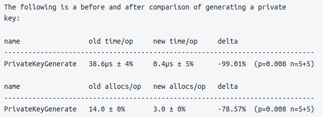
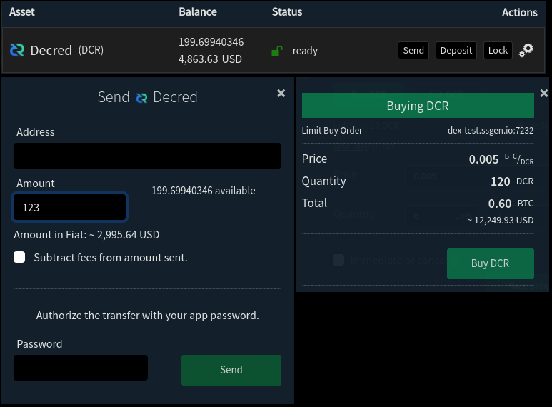
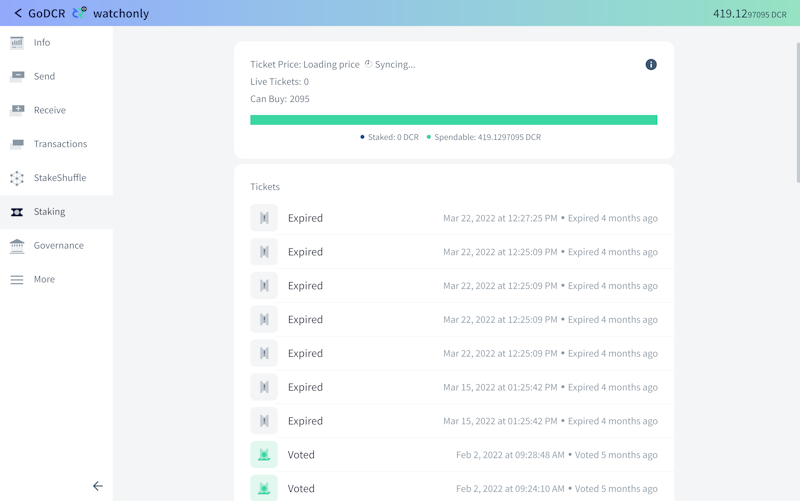
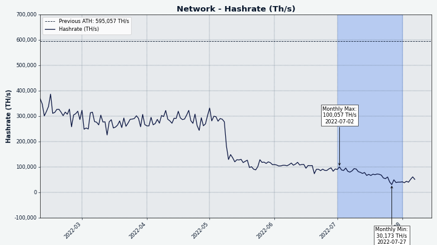
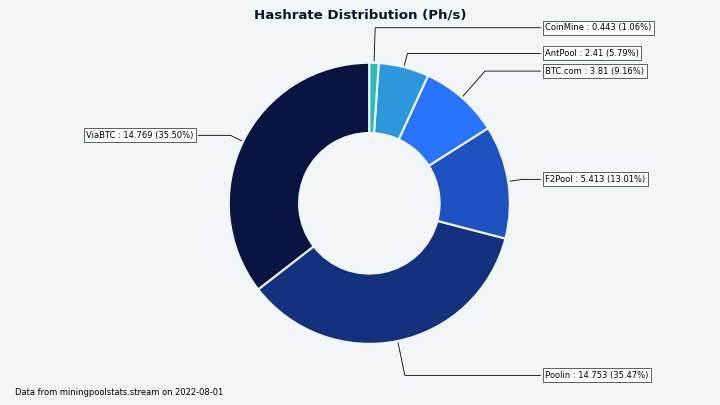
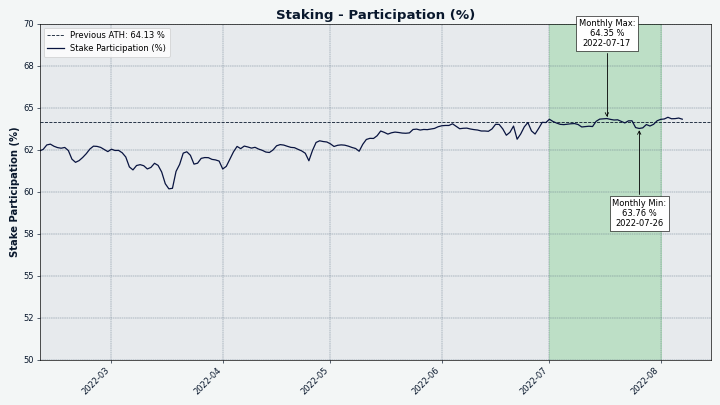
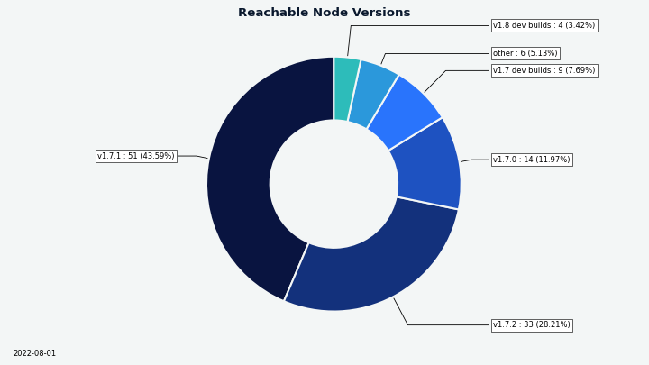
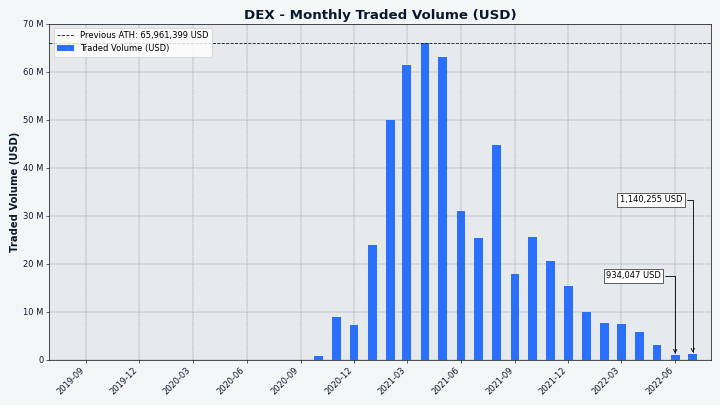

# Decred Journal – July 2022

_Image: News art by @OfficialCryptos._

Highlights for July:

- DCRDEX has added support for a new type of Bitcoin wallet, support for the Electrum SPV wallet has been merged

- Politeia is getting close to a new release with legacy proposals imported and a new GUI plugin architecture

- After the rejection of a proposal to continue funding GoDCR, the team has announced that they will no longer be working on it

- @jy-p mentioned in an interview something he has been working on for Lightning Network, a novel way to use LN which is already feature-complete and should make its public debut within the next two months

Contents:

- [Development](#development)
- [People](#people)
- [Governance](#governance)
- [Network](#network)
- [Ecosystem](#ecosystem)
- [Outreach](#outreach)
- [Media](#media)
- [Discussions](#discussions)
- [Markets](#markets)
- [Relevant External](#relevant-external)

## Development

The work reported below has the "merged to master" status unless noted otherwise. It means that the work is completed, reviewed, and integrated into the source code that advanced users can [build and run](https://medium.com/@artikozel/the-decred-node-back-to-the-source-part-one-27d4576e7e1c), but is not yet available in release binaries for regular users.

### dcrd

_[dcrd](https://github.com/decred/dcrd) is a full node implementation that powers Decred's peer-to-peer network around the world._

Optimizations:

- Private key generation [implemented directly](https://github.com/decred/dcrd/pull/2971) for the secp256k1 curve to replace the generic version in the standard library with any adaptor code it required. Not only is this implementation significantly more efficient, both in terms of execution speed and memory allocations, it also is theoretically more secure since it does not have the modulo bias the implementation in the standard lib does.
- Significantly [optimized CPU mining](https://github.com/decred/dcrd/pull/2977) code that is useful for mining on testnet. Speed stat tracking code reworked to improve accuracy and performance. Before this change the hashrate was ~0.5 Mh/s and up to 2 cores could be used efficiently. Optimized code hashes at 1.2 Mh/s on a single core and over 10 Mh/s with 10 cores.

Other:

- Removed [planetdecred.org seeders](https://github.com/decred/dcrd/pull/2974) for both mainnet and testnet as requested by their maintainer.
- Reformatted [doc comments](https://github.com/decred/dcrd/pull/2976) in the entire repository with `gofmt` in the new Go 1.19. Doing it all at once in a single commit saves future commits from extra diff clutter.
- Fixed [broadcasting of winning tickets](https://github.com/decred/dcrd/pull/2968) when there are multiple next block candidates ("chain tips") and some of them do not yet have their block data available. Voting wallets connected to dcrd in such state were unable to re-start voting for blocks due to an error.
- Smaller improvements.

_Image: Another day in dcrd development._

### dcrwallet

_[dcrwallet](https://github.com/decred/dcrwallet) is a wallet server used by command-line and graphical wallet apps._

Ticketbuyer:

- Do not attempt to [mix change](https://github.com/decred/dcrwallet/pull/2171) if CoinShuffle++ server is unset.

JSON-RPC and command-line use via `dcrctl`:

- Fixed `signrawtransasction` command not seeing the provided [private keys](https://github.com/decred/dcrwallet/pull/2173) for signing P2PKH inputs.

In progress:

- Add requests to allow Decrediton to get and update the [pending TSpend voting policies](https://github.com/decred/dcrwallet/pull/2172).

### Decrediton

_[Decrediton](https://github.com/decred/decrediton) is a full-featured desktop wallet app with integrated voting, StakeShuffle mixing, Lightning Network, DEX trading, and more. It runs with or without a full blockchain (SPV mode)._

In progress - [voting on individual TSpend transactions](https://github.com/decred/decrediton/pull/3787) is being introduced into Decrediton:

- The Treasury Spending tab will display pending TSpends and the ability to vote.
- On the Home view users will see notifications of new active and not yet voted TSpends.
- Ticket details page will show treasury key and TSpend vote choices that have been set on the VSP.

### Politeia

_[Politeia](https://github.com/decred/politeia) is Decred's proposal system. It is used to request funding from the Decred treasury._

Backend - tstore:

- Removed ability to [use LevelDB](https://github.com/decred/politeia/pull/1651) as a key-value storage for tstore, which is now MySQL by default. Since MySQL is required by Trillian anyway, removing an alternative storage backend simplifies politeiad setup and makes the code easier to maintain.
- Updated the tstore backend to allow [overwriting](https://github.com/decred/politeia/pull/1652) existing entries. tstore saves data in 2 steps: save data in the key-value store, and then append its hash onto the Trillian tree. Overwriting existing entries fixes the inability to resubmit unchanged data if the second step failed.

Backend - `ticketvote` plugin:

- Added the [timestamp](https://github.com/decred/politeia/pull/1653) of the last vote status change to the vote summary structure. This allows to pull less data when rebuilding the vote inventory.
- Rewrote `ticketvote` [inventory cache](https://github.com/decred/politeia/pull/1649) with an improved API, better documentation, and saving data in the tstore database instead of the file system. Similarly, [vote summaries cache](https://github.com/decred/politeia/pull/1657) and [runoff vote submissions cache](https://github.com/decred/politeia/pull/1658) moved from the file system to the tstore provided plugin cache.
- Implemented the `ticketvote` plugin's [fsck function](https://github.com/decred/politeia/pull/1659) that rebuilds all of its caches.

Backend - legacy proposals:

- Added an [`import` command](https://github.com/decred/politeia/pull/1632) to the `legacypoliteia` tool. It imports the JSON data into the tstore backend that was generated during the execution of the `convert` command. The two commands (`convert` and `import`) allow to migrate most data from the previous version of Politeia into the current version. Client and server signatures are not imported since they don't match the converted data. Some Trillian weirdness had to be investigated and addressed with extensive testing and workarounds.

Backend - other changes:

- Fixed bug where [empty comments](https://github.com/decred/politeia/pull/1655) were accepted.
- Removed [legacy websockets code](https://github.com/decred/politeia/pull/1660) which was never used for anything.
- Code cleanup and packaging.
- Various improvements, tweaking etc.

`politeaivoter` command-line app:

- Consolidated [config error handling](https://github.com/decred/politeia/pull/1648) to cover more cases consistently.

Politeia GUI:

- Removed hardcoded [legacy proposals](https://github.com/decred/politeiagui/pull/2762) and code handling them, now that they have been migrated into the current Politeia database.
- Various tweaks, improvements, and ~8 fixes.

Politeia GUI progress towards the new [plugin architecture](https://github.com/decred/politeiagui/tree/master/plugins-structure#politeiagui---plugins-structure):

- Show a warning modal for [external links](https://github.com/decred/politeiagui/pull/2804).
- Each plugin can now [export "effects"](https://github.com/decred/politeiagui/pull/2800) that developers can reuse and compose in their Politeia-like apps. For example, when the user scrolls to the end of the list, code to fetch next batch of proposals/comments/vote summaries can be called from the plugins responsible for these pluggable features.
- Added a `politeiagui-scripts` [CLI package](https://github.com/decred/politeiagui/pull/2827). It deduplicates common configuration and provides 7 commands for developing and testing plugins and apps.

### cspp

_[cspp](https://github.com/decred/cspp) is a server for coordinating coin mixes using the CoinShuffle++ protocol. It is non-custodial, i.e. does not hold any funds._

- [@jy-p says he's made a lot of progress](https://www.youtube.com/watch?v=1RBBNnrPqc0&t=123) with @jrick on peer-to-peer mixing for Decred's StakeShuffle privacy service. Currently StakeShuffle relies on a central server at [mix.decred.org](https://mix.decred.org/).

### DCRDEX

_[DCRDEX](https://github.com/decred/dcrdex) is a non-custodial, privacy-respecting exchange for trustless trading, powered by atomic swaps._

General user-facing changes:

- Display [fiat equivalents](https://github.com/decred/dcrdex/pull/1600) in various places of the UI.
- Added general support for [live wallet reconfiguration](https://github.com/decred/dcrdex/pull/1686) and implemented it for BTC. This allows locked coins to be re-established after wallet configuration was changed. Prior to this change, reconfiguring a wallet with live orders was unlocking the funds but attempting to use them resulted in an error.
- Implemented [fee rate caching and expiry](https://github.com/decred/dcrdex/pull/1721) to resolve a long-standing issue of using outdated fee rate. Also optimized how frequent fee rate is fetched from various sources (wallet, order book, external API).
- Clarified the message about [disabling a DEX server](https://github.com/decred/dcrdex/pull/1634). With the recent account discovery features, a server can be disabled and reenabled as needed without paying the registration fee again.
- Optimized [high resource use](https://github.com/decred/dcrdex/pull/1684) when typing price.
- Fixed [Filled percentage](https://github.com/decred/dcrdex/pull/1711) display for market buys.
- Fixed users getting [order completion credit](https://github.com/decred/dcrdex/pull/1707) for revoked orders in rare circumstances.

General internal/other changes:

- Enforced [code formatting](https://github.com/decred/dcrdex/pull/1699) check during CI builds for consistency.
- Other test infrastructure improvements, refactoring, and ~5 fixes.

Decred support:

- Support [external source](https://github.com/decred/dcrdex/pull/1654) of transaction fee estimates for DCR wallets (dcrdata's Insight API), to serve as a fallback when the wallet cannot get the fee estimate locally.
- Fixed block monitoring for DCR SPV wallets and improved [connectivity error messages](https://github.com/decred/dcrdex/pull/1701).

Bitcoin and Bitcoin-like asset support:

- Added support for common [Electrum SPV](https://github.com/decred/dcrdex/pull/1607) wallets (BTC, LTC, BCH). DEX client can communicate with a local Electrum wallet (min version 4.2) and use its funds for trading.
- Added a short delay for [sending ZEC](https://github.com/zcash/zcash/issues/6045) after a block is mined in load tests, to workaround an issue with Zcash [output selection](https://github.com/zcash/zcash/issues/6045).
- Minimum required [Bitcoin Core version](https://github.com/decred/dcrdex/pull/1735) bumped to v0.21 (and v22 for using descriptor wallets).
- Fixed native BTC SPV wallet getting wrecked after [sending too small](https://github.com/decred/dcrdex/pull/1705) ("dust") amount, which should not be allowed.
- Fixed creating native BTC wallet with [too small fee](https://github.com/decred/dcrdex/pull/1657).

Ethereum support:

- Increased ETH [gas fee cap](https://github.com/decred/dcrdex/pull/1692) for redemptions when base fee is too high.
- Added ability to [export ETH wallet](https://github.com/decred/dcrdex/pull/1648) to Metamask.
- Changed how [ETH wallet's private key](https://github.com/decred/dcrdex/pull/1702) is derived to have an extra step where Ethereum BIP-39 mnemonic is generated, and then the private key is derived from that seed. This leaves the door open to exporting both the seed words and the account private key in the future.
- Added a test for [arithmetic overflow](https://github.com/decred/dcrdex/pull/1722) in the Ethereum Solidity contract. Starting with Solidity v0.8.0 the transaction _should_ be reverted automatically if there is an overflow. The test is added just in case Solidity version used in DCRDEX is somehow reduced below v0.8.0, or if future Solidity versions remove this protection. However unlikely that may be, it's better to be safe than sorry.

_Image: DCRDEX showing fiat equivalents to ease the transition from the legacy financial system._

### GoDCR

_[GoDCR](https://github.com/planetdecred/godcr) is a lightweight desktop GUI wallet with integrated staking, privacy, Politeia voting, consensus voting, and more._

Following the rejection of a [proposal](https://proposals.decred.org/record/0ef42e5) to fund future GoDCR development, the @raedah team has [announced](https://matrix.to/#/!gruHpujXftcsHcghjx:planetdecred.org/$tSIfmIcwrrtslpOU04O5m8y8cJzumZvds5ipv9coB30?via=planetdecred.org&via=decred.org&via=matrix.org) that it will no longer be actively developed by them.

Merged:

- Updated [Transactions page](https://github.com/planetdecred/godcr/pull/893) (improved tx row display, count of each tx type in the filter dropdown, etc.).
- Implemented a new [Overview page](https://github.com/planetdecred/godcr/pull/1008) design.
- Updated Wallet Settings page to the [latest UI](https://github.com/planetdecred/godcr/pull/1007).
- Added DEX [server selector](https://github.com/planetdecred/godcr/pull/1011), ability to use custom server, and payment of the registration fee.
- Fixed [handling](https://github.com/planetdecred/godcr/pull/1023) of wallet deletion.
- Implemented a new [Staking tab design](https://github.com/planetdecred/godcr/pull/1016).
- Numerous bug fixes and UI tweaks.
- Translation updates.

In progress:

- Streamlined API in dcrlibwallet for [pulling data](https://github.com/planetdecred/dcrlibwallet/pull/255) from the dcrdata block explorer and exchanges.
- New [StakeShuffle page](https://github.com/planetdecred/godcr/pull/1024) layout.
- New [Transaction page](https://github.com/planetdecred/godcr/issues/1025) design.
- [Proposal search](https://github.com/planetdecred/godcr/pull/1027) functionality.

_Image: New Staking design in GoDCR._

### dcrdata

_[dcrdata](https://github.com/decred/dcrdata) is an explorer for Decred blockchain and off-chain data like Politeia proposals, markets, and more._

- Added [message signature verification](https://github.com/decred/dcrdata/pull/1911) page and two new HTTP API endpoints for use in scripts and apps. [Request body limiter](https://github.com/decred/dcrdata/commit/c9d07773f51cc93186d6c4d1c1f74f8c170f297d) was also added with a default of 2 MiB, down from default 10 MiB.

In progress:

- Expose more [treasury mechanics](https://github.com/decred/dcrdata/pull/1918) like quorum progress, approx. vote start/end date, Pi keys used, and more.
- Devs are looking into [pagination problems](https://github.com/decred/dcrdata/issues/1925) on the Treasury page.

### Documentation

_[dcrdocs](https://github.com/decred/dcrdocs) is the source code for Decred [user documentation](https://docs.decred.org/)._

- Updated docs related to [command-line apps](https://github.com/decred/dcrdocs/pull/1193) to match v1.7.2 release, and mentioned support of Apple M1 chip and BSD systems.
- [Updated and reorganized](https://github.com/decred/dcrdocs/pull/1195) the [Using the Block Explorer](https://docs.decred.org/getting-started/using-the-block-explorer/) guide to address some [confusion](https://www.reddit.com/r/decred/comments/uqrdpa/dcr_data_looking_into_a_block_decred_fundamentals/i8su4lb/) on Reddit.

### decred.org

_[dcrweb](https://github.com/decred/dcrweb) is the source code for the decred.org website._

- [Social media](https://decred.org/community/) links were [cleaned up](https://github.com/decred/dcrweb/pull/1052). Notably, Chinese specific social media has been removed due to a lack of control and proper moderation over these channels.

### Other

In response to a community question "What would you like to see Decred develop next?" @jy-p [dropped a teaser](https://www.youtube.com/watch?v=1RBBNnrPqc0&t=2462): "This one has a nuanced answer. I've developed it, and it's almost ready, and it fills a gap that we've had for a very long time, and it involves Lightning Network. I'm not gonna say a whole lot else. You can think about it like this. There's a whole bunch of problems around us today. There is one of them that makes me absolutely crazy and I'm going to try and address it.". Whatever it is, the remaining integration and GUI work was roughly estimated as "2 months".

## People

Congratulations to new contractors granted the Decred Contractor Clearance (DCC) in May-June:

- @philemon (GitHub [@ukane-philemon](https://github.com/ukane-philemon), Development)
- @zippycorners (GitHub [@matthawkins90](https://github.com/matthawkins90), Development)

Decred developers [@dreacot (GoDCR)](https://www.decredmagazine.com/introducing-decred-developer-dreacot/) and [@VictorGuedes (Politeia)](https://www.decredmagazine.com/introducing-decred-developer-victorguedes/) were interviewed by @phoenixgreen on Decred Magazine.

Community stats as of Aug 1 (compared to Jul 1):

- [Twitter](https://twitter.com/decredproject) followers: 54,306 (-74)
- [Reddit](https://www.reddit.com/r/decred/) subscribers: 12,633 (-3)
- [Matrix](https://chat.decred.org/) #general users: 707 (+18)
- [Discord](https://discord.gg/GJ2GXfz) users: 1,765 (-561 - purged inactive users)
- [Telegram](https://t.me/Decred) users: 2,773 (-37)
- [YouTube](https://www.youtube.com/decredchannel) subscribers: 4,630 (+0), views: 212K (+2K)

## Governance

In July the new [treasury](https://dcrdata.decred.org/treasury) received 9,204 DCR worth $220K at July's average rate of $23.93. 3,205 DCR was spent to pay contractors, worth $77K at July's rate, or $90K at June's billing rate of $28.06.

The treasury spend [tx](https://explorer.dcrdata.org/tx/453e713358bb3c5662ebc1f58c50c50ceb66a950dae925701d8e25a3c4c72d4e) was mined on July 24, it had 20 outputs ranging from 2.8 DCR to 1,184 DCR. The transaction was approved with 4,590 Yes votes and 7 No votes.

As of Aug 8, combined balance of [legacy](https://dcrdata.decred.org/address/Dcur2mcGjmENx4DhNqDctW5wJCVyT3Qeqkx) and [new treasury](https://dcrdata.decred.org/treasury) is 807,000 DCR (30.7 million USD at $38.01).

There were no new proposals in July. The Decred Magazine [proposal](https://proposals.decred.org/record/3bb2c7e) was approved in July with approval of 87% and turnout of 28%. Two other proposals were rejected, for GoDCR (20% approval, 57% turnout) and Decred Brazil marketing (19% approval, 57% turnout).

See Politeia Digest [issue 53](https://blockcommons.red/politeia-digest/issue053/) for more detail on the month's proposals.

## Network

**Hashrate**: July's [hashrate](https://dcrdata.decred.org/charts?chart=hashrate&zoom=l4vb70eb-l6cmn0q7&scale=linear&bin=block&axis=time) opened at ~87 Ph/s and closed ~44 Ph/s, bottoming at 28 Ph/s and peaking at 116 Ph/s throughout the month.

_Image: Hashrate continues to seek a new equilibrium._

Distribution of 42 Ph/s hashrate [reported](https://miningpoolstats.stream/decred) by the pools on Aug 1: Poolin 36%, ViaBTC 36%, F2Pool 13%, BTC.com 9%, AntPool 6%, CoinMine 1%.

Distribution of 1,000 blocks actually [mined](https://miningpoolstats.stream/decred) by Aug 1: Poolin 42%, ViaBTC 30%, BTC.com 8%, CoinMine 1%, unknown 19%.

_Image: Pool hashrate distribution._

**Staking**: [Ticket price](https://dcrdata.decred.org/charts?chart=ticket-price&zoom=l4vb70eb-l6cmn0q7&axis=time&visibility=true-true&mode=stepped) varied between 215-238 DCR, with 30-day [average](https://dcrstats.com/) at 226.8 DCR (+3.1).

The [locked amount](https://dcrdata.decred.org/charts?chart=ticket-pool-value&zoom=l4vb70eb-l6cmn0q7&scale=linear&bin=block&axis=time) was 9.12-9.25 million DCR, meaning that 63.7-64.5% of the circulating supply [participated](https://dcrdata.decred.org/charts?chart=stake-participation&zoom=l4vb70eb-l6cmn0q7&scale=linear&bin=block&axis=time) in Proof of Stake.

_Image: Staking participation all-time high._

**VSP**: On Aug 1, ~7,170 (+20) live tickets were managed by [listed](https://decred.org/vsp/) vspd servers. Collectively the 18 VSPs managed 17.4% of the ticket pool (+0.1%).

_Image: Distribution of tickets managed by VSPs._

**Nodes**: Node versions captured by [Decred Mapper](https://nodes.jholdstock.uk/user_agents) on Aug 9 (127 total, dcrd only): v1.7.1 - 39%, v1.7.2 - 25%, v1.7.0 - 11%, v1.7.0 dev builds - 7%, v1.8.0 dev builds - 4%, v1.6 series - 3%, v1.5 series - 0.7%, v1.4 series - 0.7%.

_Image: dcrd node version distribution._

The share of [mixed coins](https://dcrdata.decred.org/charts?chart=coin-supply&zoom=jz3q237o-la8vk000&scale=linear&bin=day&axis=time&visibility=true-true-true) varied between 60.6-60.8%. Daily [mixed amount](https://dcrdata.decred.org/charts?chart=privacy-participation&zoom=l4pct44v-l6ik5xc0&bin=day&axis=time&visibility=true-false) varied between 244-509K DCR.

Decred's [Lightning Network](https://ln-map.jholdstock.uk/) has seen 45 nodes (+1), 78 channels (+6) with a total capacity of 36.9 DCR (+0.2), as of Aug 9.

## Ecosystem

Two new VSPs were listed on decred.org and in Decrediton: [vspd.bass.cf](https://vspd.bass.cf/) by [@cryptocoiner69](https://github.com/decred/dcrwebapi/pull/162) (0.2% fee) and [dcrhive.com](https://dcrhive.com/) by @kozel (0.7% fee). @kozel plans to use the earned VSP fees for [providing liquidity](https://www.reddit.com/r/decred/comments/vt0wrt/dcr_hive_a_new_lowish_fee_vsp_coming_to_your/) for Decred's Lightning Network - an interesting new incentive to consider when selecting a VSP.

Binance has reduced required DCR confirmations from 20 back to 6 [according to @jz](https://matrix.to/#/!lDZCzVQjFoJsXMPkvr:decred.org/$XSPP3KlRoIcNt3cqBG9ZbgTnwu88Kr6VcwPDTNEGZo4?via=decred.org&via=matrix.org&via=planetdecred.org).

[BisonPool](https://bisonpool.org/) has officially launched. BisonPool is a new kind of proof-of-stake pool which enables all Decred holders to earn PoS rewards, even if they cannot afford a whole ticket on their own. To make this possible, BisonPool pools users' DCR to purchase tickets. The ticket rewards are split among participants based on the amount of DCR they were able to provide. See the [announcement on Reddit](https://www.reddit.com/r/decred/comments/vyydm1/bisonpool_is_now_live/).

Users have no control over voting preferences for their tickets on BisonPool.

It should be noted that this is a custodial service, meaning BisonPool has control of user's funds. There is a risk that your Decred can be stolen if you choose to use this service. The identity of whoever is running BisonPool is unknown to the community. Remember, not your keys, not your coins.

Warning: the authors of the Decred Journal have no idea about the trustworthiness of any of the services above. Please do your own research before trusting your personal information or assets to any entity.

Join our [#ecosystem](https://chat.decred.org/#/room/#ecosystem:decred.org) chat to follow Decred ecosystem updates.

## Outreach

Monde PR's achievements:

- Pitched Decred to 2 PR opportunities
- Responded to 2 requests for comments.
- Secured 1 media interview.
- Sourced 2 freelance journalists to write for Decred Magazine.

Secured the following news articles:

- An article in [Finder](https://www.finder.com/id/ethereum-eth-price-prediction) featuring commentary from @jz on Ethereum's outlook for 2022.
- An article in [Finder](https://www.finder.com.au/solana-sol-price-prediction) featuring commentary from @jz on Solana's outlook for 2022.
- An article in [Finder](https://www.finder.com/nz/litecoin-ltc-price-prediction) featuring commentary from @jz on Litecoin's outlook for 2022.
- An article in [Finder](https://www.finder.com/id/dogecoin-doge-price-prediction) featuring commentary from @jz on Dogecoin's outlook for 2022.
- An article in [Cointelegraph](https://cointelegraph.com/news/3ac-a-10b-hedge-fund-gone-bust-with-founders-on-the-run) featuring commentary from @jz on what led to the downfall of Three Arrows Capital. The article was syndicated to 44 publications including [Crypto News Canada](https://cryptonewscanada.com/3ac-a-10b-hedge-fund-gone-bust-with-founders-on-the-run/), [The Switzerland Times](https://www.theswitzerlandtimes.com/3ac-a-10-billion-hedge-fund-goes-bankrupt-with-founders-on-the-run/) and [Bitcoin Insider](https://www.bitcoininsider.org/article/176949/3ac-10b-hedge-fund-gone-bust-founders-run).

## Media

[Decred Magazine](https://www.decredmagazine.com/) update:

> In July we published 10 new articles and added all previous "Decred Assembly" content to the archive. We have a new Official Contributor - Tivra.
> 
> DM now has 297 posts, 50 newsletter subscribers, 6 active social media campaigns. I'm not sure how to show the full social media engagement, but according to my stats over the last 30 days there have been 48 new posts, 309 clicks on posts, 375 likes, 56 retweets, content was posted to 887 followers across all accounts. \[@phoenixgreen\]

DM has its own Twitter now, [follow @decredmagazine](https://twitter.com/decredmagazine) to get new stories and announcements.

Authors wanted! Contact @phoenixgreen in Matrix [#writers](https://chat.decred.org/#/room/#writers:decred.org) chat or [@DecredSociety](https://twitter.com/DecredSociety) on Twitter.

**Decred Magazine articles:**

- [Introducing Decred developer @dreacot](https://www.decredmagazine.com/introducing-decred-developer-dreacot/) by @phoenixgreen
- [Magic 8 ball, is this the bottom?](https://www.decredmagazine.com/magic-8-ball-is-this-the-bottom/) Technical Analysis by @Applesaucesome
- [Introducing Decred developer VictorGuedes](https://www.decredmagazine.com/introducing-decred-developer-victorguedes/) by @phoenixgreen
- [Sound money that iterates and evolves](https://www.decredmagazine.com/decred-iterates-where-bitcoin-is-weak-broken/) by @RonnieAmato
- [Indecision, doubt, and a monthly dose of hopium](https://www.decredmagazine.com/indecision-doubt-and-a-monthly-dose-of-hopium/) Technical Analysis by @Applesaucesome

**Videos:**

- [Decred Explained - Improving decentralization & scalability with a hybrid consensus mechanism](https://www.youtube.com/watch?v=VjbYtYFkYI4) by Crypto Sketch 101
- [Decred News Update - First DAO payout w/ new rules, DEX Solidity contract audit, mixing ATH & more!](https://www.youtube.com/watch?v=QOCC4INo2TM) by @Exitus
- [What is Decred? DCR price prediction (explained with animations)](https://www.youtube.com/watch?v=Gpa-xADhtow) by Blockchain Side
- [DCRDATA the details that define the project - Decred Fundamentals](https://www.youtube.com/watch?v=Y6U_iWYQb9A) by @phoenixgreen

Livestream:

- [Two-tiered economy - Decred and the State of the Market with Jake Yocom-Piatt](https://www.youtube.com/watch?v=1RBBNnrPqc0) with @Exitus and @phoenixgreen

**Art and fun:**

- [Decred stairs to evolve and adapt](https://www.decredmagazine.com/decred-stairs-to-evolve-and-adapt/) by @OfficialCryptos ([tweet](https://twitter.com/decredmagazine/status/1551255007118458883))
- [Decred's StakeShuffle Mixing](https://twitter.com/karamblez/status/1551637047038853122) statistic animation by @karamble

**Translations:**)

- Decred Journal June 2022 was [translated](https://xaur.github.io/decred-news/) to Chinese (@Dominic). Thank you!

## Discussions

Selected Reddit posts:

- The Weekly Contributions initiative paused for a month but [came back with a 4th edition](https://www.reddit.com/r/decred/comments/w7qg79/weekly_contributions_edition_4_bounty_pool_2_dcr/) with a longer duration and a bounty pool of 2 DCR (plus 1 DCR pledged by a participant for 2nd best contribution if there is one). Bootstrapping is going hard but there are still more ideas to try before giving up.

## Markets

In July DCR was trading between USD 20.86-29.10 / BTC 0.00104-0.00134. The average daily rate was $23.93.

@Applesauceseome shared two [market](https://www.decredmagazine.com/magic-8-ball-is-this-the-bottom/) [reviews](https://www.decredmagazine.com/indecision-doubt-and-a-monthly-dose-of-hopium/) with charts and commentary on crypto and the broader market, and a "next gen hopium" in the last piece.

_Image: DCRDEX monthly volume in USD._

## Relevant External

The group of people who refer to themselves as "Bitcoin Maximalists" is fragmenting and shrinking, and July saw some significant [defections](https://www.coindesk.com/layer2/2022/07/06/nic-carter-and-the-case-for-bitcoin-mediumism/) and ruptures. Nic Carter has for many years presented a pro-Bitcoin narrative in the media consummately, earning the respect of many in the community - but when the latest investment of his fund Castle Island Ventures was set upon by Bitcoin Maximalists on Twitter, Nic went on a protracted [offensive](https://medium.com/@nic__carter/setting-the-record-straight-b4e1b415e7d9) against them, calling out that group's mis-steps and failings and distancing himself from them. Later in the month Samson Mow, considered by many as an architect of the maximalist position, objected to a [comment](https://twitter.com/TheBlueMatt/status/1556448996159377414) from long time Bitcoin developer Matt Carralo and tweeted that people [should remember](https://twitter.com/Excellion/status/1556508492822745089) Matt as a person who introduced an inflation bug to Bitcoin - a controversial sentiment which drew criticism from many other Bitcoin developers, pointing out that dev work undergoes review by a whole team of people and bringing it up to disparage Matt for making comments is the kind of toxic behavior that drives people away from Bitcoin. One of the lead Bitcoin Core maintainers [announced](https://coincodecap.com/lead-bitcoin-core-maintainer-to-leave) shortly afterwards that they were stepping down from the role.

Tesla [sold](https://www.coindesk.com/business/2022/07/20/tesla-sold-936m-worth-of-bitcoin-in-second-quarter/) 75% of its BTC holdings in the second quarter of 2022, worth $936M at time of sale. Microstrategy, the other public company to go big on buying BTC, held on to its Bitcoin but took an "impairment charge" of $918M. Michael Saylor, noted Bitcoin Maximalist [meme-crafter](https://dailycoin.com/top-10-crazy-things-michael-saylor-said-about-bitcoin/), stepped down as CEO to "[focus on buying bitcoin](https://www.coindesk.com/business/2022/08/02/microstrategy-replaces-saylor-as-ceo-with-companys-president-saylor-to-become-executive-chairman/)", but remains in control of a majority of the company's voting shares and as serving Chairman of the Board.

The details of 1 billion Chinese residents have been [stolen](https://www.reuters.com/world/china/hacker-claims-have-stolen-1-bln-records-chinese-citizens-police-2022-07-04/) and made available on a dark web hacker forum. Binance CEO CZ was one of the first to [tweet](https://twitter.com/cz_binance/status/1543700689611792386) about it, stating that Binance threat security checks would be increased for the affected region, and speculating that the breach occurred because a [developer leaked their](https://twitter.com/cz_binance/status/1543905416748359680) keys in a blog post. This is a one more proof that the best way to protect user data is [to not collect](https://www.youtube.com/watch?v=Q8f3j5DWyE8&t=229) it in the first place.

The Solana Foundation is opening an "[embassy](https://www.coindesk.com/layer2/2022/07/28/is-solana-leading-crypto-into-retail-or-trailing-apple/)" in New York City - an Apple store type unit where people will be able to look at Solana NFTs and check out the forthcoming Solana phone.

That's all for July. Share your updates for the next issue in our [#journal](https://chat.decred.org/#/room/#journal:decred.org) chat room.

## About

This is issue 49 of Decred Journal. Index of all issues, mirrors, and translations is available [here](https://xaur.github.io/decred-news/).

Most information from third parties is relayed directly from the source after a minimal sanity check. The authors of the Decred Journal cannot verify all claims. Please beware of scams and do your own research.

Credits (alphabetical order):

- writing, editing, publishing: bee, bochinchero, Exitus, jz, l1ndseymm, phoenixgreen, richardred
- reviews and feedback: buck54321
- title image: OfficialCryptos
- funding: Decred stakeholders
