# Decred Journal – April 2023

_Image: Untitled by @Exitus_

Highlights of April:

- Decred DEX saw a major new release shipping around 8 months of dev work, including ETH and USDC trading.

- v1.7.7 of the core Decred software has been released, featuring optimizations and bug fixes as well as ta feature allowing Decrediton users to vote on individual TSpends.

- Another new Bison Relay release deployed many of the improvements to UX and onboarding.

Contents:

- [Core Software v1.7.7 Release](#core-software-v177-release)
- [DCRDEX v0.6.0 Release](#dcrdex-v060-release)
- [Bison Relay v0.1.7 Release](#bison-relay-v017-release)
- [Development](#development)
- [People](#people)
- [Governance](#governance)
- [Network](#network)
- [Ecosystem](#ecosystem)
- [Outreach](#outreach)
- [Events](#events)
- [Media](#media)
- [Markets](#markets)
- [Relevant External](#relevant-external)

## Core Software v1.7.7 Release

Highlights of the [v1.7.7 release](https://twitter.com/decredproject/status/1648190102802161671):

- **dcrd** got a few optimizations to use a bit less bandwidth and CPU in certain scenarios.

- **dcrwallet** got many bug fixes and performance improvements for SPV mode, ticket buying, and mixing. In particular, this benefits heavily-used wallets that contain many transactions.

- **Decrediton** gained voting for individual TSpend transactions, redesigned launcher views that educate the user while the wallet is loading, redesigned Trezor views, an upgrade to DCRDEX v0.6.0 with ETH and USDC trading, and a number of bug fixes.

Visit the [GitHub release](https://github.com/decred/decred-binaries/releases) for the full list of changes and downloads. As always, we recommend to [verify the files](https://docs.decred.org/advanced/verifying-binaries) before running.

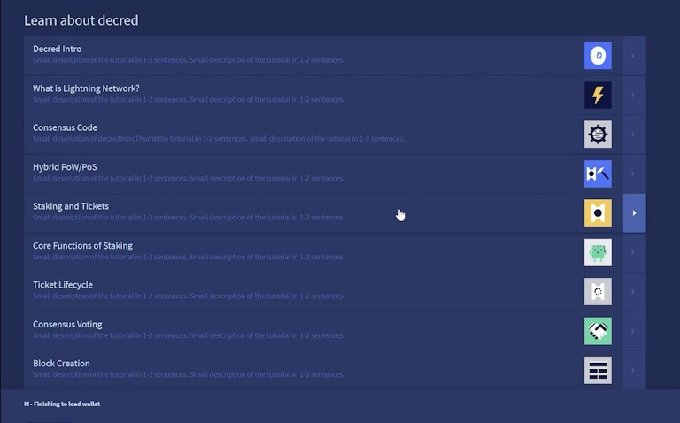

_Image: New launcher views - learn about Decred while the wallet is syncing_

## DCRDEX v0.6.0 Release

The long-awated v0.6 has shipped around 8 months of development work. Major changes since v0.5:

- ETH and ERC-20 wallets and trading
- Built-in light wallets for Bitcoin Cash (BCH) and Litecoin (LTC) allow to store and trade funds without running full nodes
- Registration fee is replaced with fidelity bonds, time-locked funds that can be returned back to the user
- Ability to connect to a DEX server in view-only mode
- Restyled Markets and Wallets pages with different layouts for various screen sizes
- Experimental market maker bot

Other notable changes:

- Manual peer management controls
- Fee estimates on Send pages
- Ability to disable an existing wallet
- Archiving of older order data
- Snappier order placement
- Recent matches shown on the Markets page
- Numerous improvements and fixes in Electrum support, Ethereum support, order tracking and presentation, error reporting, fee estimation, translations, and more

There are 3 ways to obtain DCRDEX:

- As part of the [Decrediton](https://github.com/decred/decred-binaries/releases) wallet (all integrated, no separate app to run, signed by `Decred Release` key)
- Standalone `dexc` app from [core software release](https://github.com/decred/decred-binaries/releases) (more CPU and OS options, signed by `Decred Release` key)
- Standalone `dexc` app from [DCRDEX's own release](https://github.com/decred/dcrdex/releases) (has a more Windows-friendly build with a system tray icon and no terminal window, signed by DEX developers)

Please take the time to read [Important Notices](https://github.com/decred/dcrdex/releases/tag/v0.6.0) to learn about specifics of non-custodial P2P trading.

Tips:

- Check new video guides on [setting up the DEX in Decrediton](https://www.decredmagazine.com/setting-up-dcrdex-0-6-in-decrediton/) and [setting up light built-in wallets for LTC, BCH, and BTC](https://www.decredmagazine.com/setting-up-dcrdex-native-wallets-btc-bch-ltc/), and more on [@DecredTV](https://www.youtube.com/@DecredTV/videos).
- Built-in LTC wallet can be slow to get started as it searches for a node that supports compact block filters. Users can go to DEX wallet page, click Litecoin -> Settings -> Manage Peers, and manually add one peer [from this list](https://gist.github.com/chappjc/d0f26b12258f8531bb78b37f38d080a0) to help boostrap the process.
- Market maker bot can be [enabled](https://twitter.com/blockchainbuck/status/1655933747064360967) by running DEX client with `--experimental` flag and selecting "Market Making" from the hamburger menu. Be sure to turn up the "oracle weight". The bot helps to add liquidity but should be used with care while it is considered experimental.

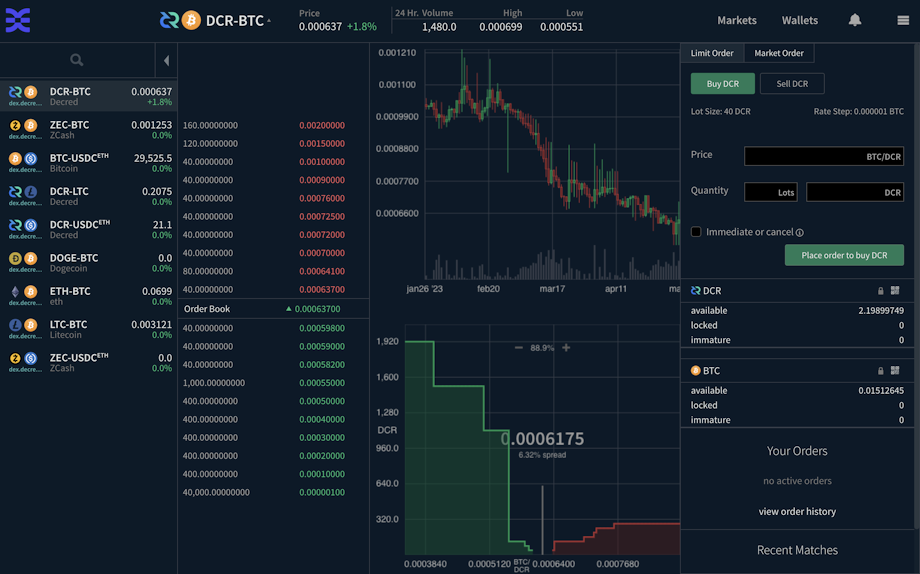

_Image: Updated trading view in DCRDEX v0.6.0_

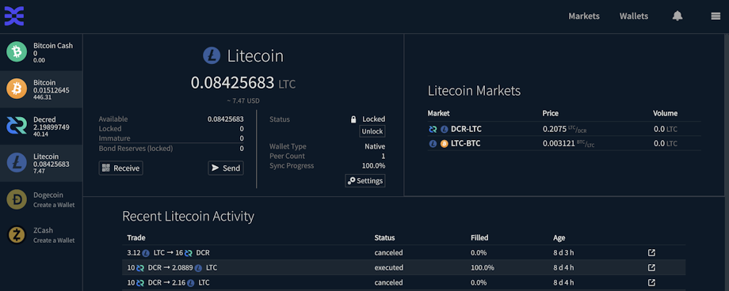

_Image: Updated wallet view in DCRDEX v0.6.0_

## Bison Relay v0.1.7 Release

New release has landed just 4 weeks since v0.1.6 RC1. Notable changes in v0.1.7 final:

- Improved onboarding flows thanks to new pre-funded invites, prepaid server-based invites, and automated wallet setup
- Right-clicking a username opens a menu, making tipping much easier
- Button to suggest a user to exchange keys with another user (i.e. introduce one to another)
- UI notifications for new posts and new comments to existing posts
- Send and receive DCR on-chain (can be used to withdraw DCR from Bison Relay)
- Improved and fixed scrolling behavior
- Listing of all own posts
- Better UX for adding files to posts
- Received files can be opened directly from BR
- Improved macOS installer, the app is signed and notarized
- More details in the [Bison Relay](#bison-relay) Development section below

Get the latest release binaries on [GitHub](https://github.com/companyzero/bisonrelay/releases). Bison Relay downloads can now be [verified](https://docs.decred.org/advanced/verifying-binaries) thanks to the added signatures made by the same key that signs Decred releases (`Decred Release <release@decred.org>` with fingerprint `F516ADB7A069852C7C28A02D6D897EDF518A031D`).

Check the [install guide](https://www.decredmagazine.com/bison-relay-upgrades-to-version-0-1-7/) and the [tipping guide](https://www.decredmagazine.com/oprah-tipping-bot-bisonrelay/) to avoid common issues with receiving tips. Find more Bison Relay video guides at [@DecredTV](https://www.youtube.com/@DecredTV/videos).

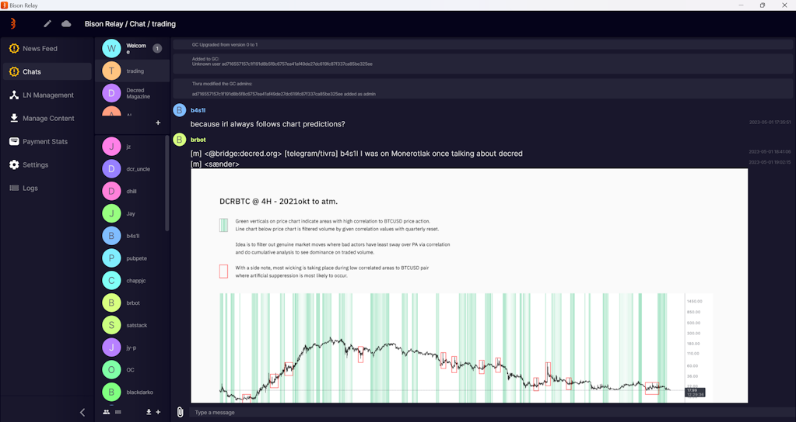

_Image: Bison Relay v0.1.7_

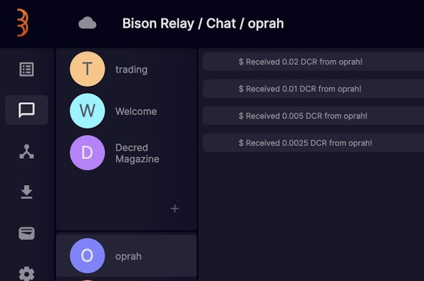

_Image: Oprah's tipping in action in Bison Relay_

## Development

The work reported below has the "merged to master" status unless noted otherwise. It means that the work is completed, reviewed, and integrated into the source code that advanced users can [build and run](https://medium.com/@artikozel/the-decred-node-back-to-the-source-part-one-27d4576e7e1c), but is not yet available in release binaries for regular users.

### dcrd

_[dcrd](https://github.com/decred/dcrd) is a full node implementation that powers Decred's peer-to-peer network around the world._

Past changes backported to [v1.7.7 release](https://github.com/decred/dcrd/releases/tag/release-v1.7.7):

- Increased minimum Go version to 1.17 for [`peer`](https://github.com/decred/dcrd/commit/0d375e0738e5995b1c3beb303a654aefe76e4a64) and [`addrmgr`](https://github.com/decred/dcrd/commit/235233906177b5c429f0e1297cc05bafb9d60b15) modules to enable Go toolchain optimizations like [module graph pruning](https://go.dev/ref/mod#graph-pruning) and [lazy module loading](https://go.dev/ref/mod#lazy-loading). [`peer`](https://github.com/decred/dcrd/tree/8f3e249555544ff8f1991d055da1e910dbd5a88b/peer) and [`addrmgr`](https://github.com/decred/dcrd/tree/8f3e249555544ff8f1991d055da1e910dbd5a88b/addrmgr) modules provide a solid foundation for building software that talks to the Decred network.
- Increased version of the peer-to-peer [protocol](https://github.com/decred/dcrd/commit/ad501373e203aeff56e8f7f699ab442f8706694e) used by the `peer` module to no longer use the `reject` message (we explained it in the [November](202211.md#dcrd) issue).
- Fixed caching of other peers' [inventory](https://github.com/decred/dcrd/pull/3074) (small traffic optimization).
- Optimized [peer address selection](https://github.com/decred/dcrd/commit/32e98be286deb3104352f81fe8c1147c1f158e29) and mitigated excessive CPU usage in testnet scenarios.
- Updated code formatting, build scripts and README for [Go 1.20](https://github.com/decred/dcrd/pull/3087).
- Updated to latest `sys` module (low-level interaction with the operating system) to support building on OpenBSD with 64-bit [RISC-V](https://en.wikipedia.org/wiki/RISC-V) processors.
- All backported changes have been added to the [release branch](https://github.com/decred/dcrd/commits/release-v1.7) as opposed to just increasing module version numbers in the `go.mod` file. This makes building from the release branch [easier](https://github.com/decred/dcrd/pull/3083) for some developers.

Changes merged in `master` towards future releases:

- Added definitions for the upcoming consensus votes to change the [proof-of-work hashing](https://github.com/decred/dcrd/pull/3089) to [BLAKE3](https://en.wikipedia.org/wiki/BLAKE_(hash_function)#BLAKE3) and to [reduce PoW block rewards](https://github.com/decred/dcrd/pull/3090). These changes will be documented more formally in [Decred Change Proposals](https://github.com/decred/dcps) DCP-11 and DCP-12, respectively. The definitions only add basic information like vote description, choices, and validity dates. Code implementing the real changes will be added separately.
- Implemented the [DCP-12 consensus vote](https://github.com/decred/dcrd/pull/3092). If it passes, block reward split will change to 1% PoW, 89% PoS, 10% Treasury.
- Added a function for [generating a private key](https://github.com/decred/dcrd/pull/3096) using a custom source of entropy. Having such a function in dcrd allows to remove duplication from other Decred packages.
- Code refactoring and cleanup.
- Versions of several modules have been bumped to enable Go's module graph pruning across the codebase.

### dcrwallet

_[dcrwallet](https://github.com/decred/dcrwallet) is a wallet server used by command-line and graphical wallet apps._

Changes backported to v1.7.7 release:

- Added [`watchlast` option](https://github.com/decred/dcrwallet/pull/2196) to limit initially watched addresses, which benefits large wallets with many old addresses.
- Removed needless [balance calculation](https://github.com/decred/dcrwallet/pull/2203) when using the ticket auto buyer. This improves performance for more active wallets.
- Fixed an edge case where ticket purchasing is cancelled due to a change of the ticket price, leading to some wallet's transactions [not being discovered](https://github.com/decred/dcrwallet/pull/2212).
- Implemented a faster way to [select random UTXOs](https://github.com/decred/dcrwallet/pull/2202) (aka "coins") used to create new transactions.
- Avoid creating [small mix change](https://github.com/decred/dcrwallet/pull/2218) so that the unmixed account is not filled with these outputs that are too small to mix, and too tempting to spend together. "Mix change" are special outputs of mix transactions that are created when the DCR amount sent into the mix does not [divide evenly](https://math.stackexchange.com/a/58558) by the mix denomination. For example look at [this mix](https://dcrdata.decred.org/tx/a87479a31814f2f08513df76ea4dcc438de9f12b04bfba89c77dd960db169656): 3.2189 DCR goes into the mix and the outputs include 17 outputs of the standard mix denomination of 0.1678 DCR (totalling 2.8521 DCR) and 7 "change" outputs of smaller size (totalling 0.3666 DCR). According to [mix.decred.org](https://mix.decred.org/), mix change is not anonymous and can be used to damage the privacy of mixes. dcrwallet can anonymize such change by carefully mixing it, but this cannot be done for change outputs smaller than 0.00264314 DCR (smallest mix denomination of 0.00262144 DCR plus default fee). Instead of creating such small outputs that should not be used anyway, their value is rolled into the transaction fee.

Changes merged in `master` towards future releases:

- Cleaned up and simplified public API of internal [VSP code](https://github.com/decred/dcrwallet/pull/2227). This is part of consolidating VSP code in the [vspd](https://github.com/decred/vspd) repository for easier maintenance and code reuse.
- Removed [ticket revocation](https://github.com/decred/dcrwallet/pull/2230) support from the VSP client. This removes a significant dependency from the VSP code, and it is unnecessary anyway because revocations are automatic since [DCP-9](https://github.com/decred/dcps/blob/master/dcp-0009/dcp-0009.mediawiki).
- Fixed [max VSP fee](https://github.com/decred/dcrwallet/pull/2228) set in the config not being respected and always overridden with the hard-coded value of 0.2 DCR. Also, VSP config validation has been moved to startup code so that invalid options are reported earlier.
- Code maintenance and 1 concurrency fix.

### dcrctl

_[dcrctl](https://github.com/decred/dcrctl) is a command-line client for dcrd and dcrwallet._

- Updates for the v1.7.7 release: switch to latest GitHub build code, Go 1.20, and latest dcrwallet code.

### Decrediton

_[Decrediton](https://github.com/decred/decrediton) is a full-featured desktop wallet app with integrated voting, StakeShuffle mixing, Lightning Network, DEX trading, and more. It runs with or without a full blockchain (SPV mode)._

Changes backported to v1.7.7 release:

- ~34 [commits](https://github.com/decred/decrediton/compare/release-v1.7.6...release-v1.7.7) with all fixes and improvements made since [November 2022](202211.md#decrediton).
- Updated to include [DCRDEX v0.6.0](https://github.com/decred/decrediton/pull/3857).
- Fixed a bug on the [Send form](https://github.com/decred/decrediton/pull/3855) that caused wrong DCR amount to be reported or sent in some scenarios.
- Fixed delay when [opening wallet](https://github.com/decred/decrediton/pull/3846) by removing the unnecessary fetching of VSP info.
- Fixed [loading status](https://github.com/decred/decrediton/pull/3846) on Process Managed/Unmanaged Tickets views and added tests for them. These views help to ensure that all tickets are registered with VSPs and their fees are paid.
- Fixed [ETH showing as not supported](https://github.com/decred/decrediton/pull/3861) in the DEX window. Release [binaries](https://github.com/decred/decred-binaries/releases/tag/v1.7.7) were quickly rebuilt to include this fix.

See the [release notes](https://github.com/decred/decred-binaries/releases/tag/v1.7.7#decrediton-v177) for a summary of all changes since v1.7.6.

### vspd

_[vspd](https://github.com/decred/vspd) is server software used by Voting Service Providers. A VSP votes on behalf of its users 24/7 and cannot steal funds._

- Updated to latest [Decred modules](https://github.com/decred/vspd/pull/378) from dcrd and dcrwallet.
- Code maintenance.

### Lightning Network

_[dcrlnd](https://github.com/decred/dcrlnd) is Decred's Lightning Network node software. LN enables instant and low-cost transactions._

- Backported a [change](https://github.com/lightningnetwork/lnd/pull/5047) from upstream lnd to bring [account-related functions](https://github.com/decred/dcrlnd/pull/178) (import account, import a single public key, list accounts, etc.). On top of that a few more features have been added: creating additional wallet accounts, exporting individual private keys, and spending specific UTXOs. The goal for these changes is to allow users to create an account from which individual private keys may be extracted and then spent. This is used in Bison Relay for funding prepaid invites.
- Updated to latest [Decred modules](https://github.com/decred/dcrlnd/pull/179) from dcrd and dcrwallet.
- Added RPC request for getting information about a [transaction](https://github.com/decred/dcrlnd/pull/180) that belongs to LN wallet.

### cspp

_[cspp](https://github.com/decred/cspp) is a server for coordinating coin mixes using the CoinShuffle++ protocol. It is non-custodial, i.e. never holds any funds. CSPP is part of StakeShuffle, Decreds privacy system._

- Project Lead Jake Yocom-Piatt reports [peer-to-peer mixing](https://twitter.com/exitusdcr/status/1655095852392935425) will eventually replace the central server that coordinates mixes currently.

### DCRDEX

_[DCRDEX](https://github.com/decred/dcrdex) is a non-custodial, privacy-respecting exchange for trustless trading, powered by atomic swaps._

Client changes included in v0.6.0 release:

- Do not put web server's address to Content Security Policy (CSP) HTTP header if it is an [IPv6 address](https://github.com/decred/dcrdex/pull/2287). This is a fix for a workaround for a [Safari bug](https://bugs.webkit.org/show_bug.cgi?id=201591) that resulted some in icons [not loading](https://github.com/decred/dcrdex/issues/1652) properly.
- Fixed potential integer [overflow](https://github.com/decred/dcrdex/pull/2285) when calculating Ethereum transaction confirmations.
- A few smaller fixes.

All other changes below are merged in `master` towards future releases.

Client:

- Show a notification when [failing to connect](https://github.com/decred/dcrdex/pull/2288) to a wallet.
- Default to using [`127.0.0.1`](https://github.com/decred/dcrdex/pull/2283) IPv4 address when it is not specified in the config. This helps to satisfy the [Content Security Policy](https://developer.mozilla.org/en-US/docs/Web/HTTP/CSP) protocol in a way that also work-arounds a bug in Safari. The new default avoids an issue where some [icons](https://github.com/decred/dcrdex/issues/1652) are not loading properly because of CSP failures.
- Always show market's [recent matches](https://github.com/decred/dcrdex/pull/2307). Previously the Recent Matches list was cleared in some situations like restarting the client.
- Show [order rate](https://github.com/decred/dcrdex/pull/2281) even if the order box is collapsed. Rate (price) is important info that must be visible without having to click to expand order details.
- Removed excess [trailing zeroes](https://github.com/decred/dcrdex/pull/2278) from some UI elements and improved overall consistency of number formatting.
- Remember last selected [candle size](https://github.com/decred/dcrdex/pull/2284) across page reloads. Default candle size changed from 5 min to 1 hour.
- Track confirmations for the [redeem transaction](https://github.com/decred/dcrdex/pull/2049) and retry it if necessary. This is addressing an edge case when the mempool is so full that transactions paying lower fees are purged and never mined. Such transactions must be retried later, possibly with a higher fee.
- Added [release notes](https://github.com/decred/dcrdex/pull/2276) for v0.6.0.
- Fixed market [prices](https://github.com/decred/dcrdex/pull/2280) on the left sidebar getting out of sync.
- Fixed handling of server [notifications](https://github.com/decred/dcrdex/pull/2286) that may come before client's markets are initialized.
- Fixed error during [shutdown](https://github.com/decred/dcrdex/pull/2325) when running in Decrediton.
- Fixed ~2 smaller UI bugs.

Ethereum:

- Show more meaningful [Walle Types](https://github.com/decred/dcrdex/pull/2207) such as "RPC" for ETH wallets powered by 3rd party data providers and "Ethereum token" for USDC wallets.
- Updated [docs](https://github.com/decred/dcrdex/pull/2289): Removed ArchiveNode.io provider which is shutting down, advised against using Flashbots.net, added Wallet Recovery tips.
- Refactored code for [rotating bonds](https://github.com/decred/dcrdex/pull/2275) to integrate ETH bonds more easily.
- Changed to broadcast transactions to [all RPC providers](https://github.com/decred/dcrdex/pull/2266) instead of only one preferred provider. This should help ensure the transactions quickly propagate and are mined.
- Added [config guide link](https://github.com/decred/dcrdex/pull/2261) to forms related to wallet setup. Also two input fields will be shown for RPC providers instead of one. It is important that users understand that provider's failure may lead to loss of funds, and configure 2 or more providers to always have a fallback.
- Added a developer tool for getting [gas estimates](https://github.com/decred/dcrdex/pull/2050) for DEX-critical operations on Ethereum. It will help to add new tokens or new contract versions.

Litecoin:

- Ported [transaction size fixes](https://github.com/decred/dcrdex/pull/2299) from [ltcd](https://github.com/ltcsuite/ltcd/pull/25) to handle some unusually large SegWit transactions.
- Some MimbleWimble [decoder code](https://github.com/ltcsuite/ltcd/issues/17#issuecomment-1201877368) written for DCRDEX has been [adopted](https://github.com/ltcsuite/ltcd/issues/17#issuecomment-1506234416) in [ltcd](https://github.com/ltcsuite/ltcd/pull/31)!

Zcash:

- Replaced usages of [deprecated address methods](https://github.com/decred/dcrdex/pull/2237) for Zcash. This requires zcashd v5.4.2 or newer.
- Added [initial](https://github.com/decred/dcrdex/pull/2317) [infrastructure](https://github.com/decred/dcrdex/pull/2250) for shielded pools, a Zcash feature enabling private balances and transactions. First stage of Zcash privacy integration will be limited to shielding/unshielding own funds, and sending from own shielded to arbitrary shielded or transparent addresses. Only transparent addresses will be involved in swap activity initially.
- Fixed spelling of [Zcash](https://github.com/decred/dcrdex/pull/2300) across the codebase.

DigiByte:

- DigiByte swaps have been tested on [mainnet](https://github.com/decred/dcrdex/pull/1993#issuecomment-1487571640), DGB support has been [merged](https://github.com/decred/dcrdex/pull/1993) and is [planned](https://github.com/decred/dcrdex/pull/1993#issuecomment-1511304826) for the upcoming v0.6.1.
- Running a DigiByte full node is currently the only option since it is based on Bitcoin Core v0.17 and has no [compact filters](https://github.com/decred/dcrdex/issues/1992#issue-1486990539) support (so DEX cannot implement a light built-in wallet for DGB). A big upgrade to Bitcoin Core v22 features is [in progress](https://github.com/DigiByte-Core/digibyte/pull/63) so this may change in the future.
- For some background, DGB community members expressed interest back in November 2022 and have been [active](https://twitter.com/JohnnyLaw2021/status/1587801707790180353) on [Twitter](https://twitter.com/dgb_ycagel/status/1599944772403466241) and DEX's [GitHub](https://github.com/decred/dcrdex/pull/1993#issuecomment-1459097459). @chappjc created a [patch](https://github.com/DigiByte-Core/digibyte/pull/102) that improves DigiByte node's performance on testnet to facilitate the development. In March 2023 Decred stakeholders approved DGB integration as part of the latest [DEX development proposal](https://proposals.decred.org/record/ca6b749).
- Note that this stage is just software support in DCRDEX, getting DGB markets up and running is a [separate](https://github.com/decred/dcrdex/pull/1993#issuecomment-1456932743) task.

Server:

- Removed server startup requirement of having [DCR registration fees](https://github.com/decred/dcrdex/pull/2293) configured, and removed code strictly tied to DCR fees. This old code was made obsolete by the ability to pay the registration fee in assets other than DCR. Now with the transition to fidelity bonds the multi-asset registration fee support is itself deprecated, but it will remain available for some time.
- Fixed startup [balance check](https://github.com/decred/dcrdex/pull/2312) bug that could erroneously unbook an order.

Other:

- Many less exciting but necessary changes are made behind the scenes to add new assets more smoothly, such as code refactoring, cleanup, build code optimization, etc.
- Some of the [fixes](https://github.com/decred/dcrdex/pull/2323) listed above will be backported to the upcoming v0.6.1 release.
- Umbrel integration has been completed. Decred's Umbrel Community App Store has been [updated](https://github.com/decred/umbrel-app-store/pull/3) with the latest Docker image including DEX v0.6.0 release. Umbrel installation links have been [added](https://github.com/decred/dexweb/pull/34) to [dex.decred.org](https://dex.decred.org/). Finally, DEX v0.6 release on Umbrel has been [announced](https://twitter.com/decredproject/status/1648439889678192640) on Twitter.
- Litecoin node operators are [advised](https://twitter.com/chappjc/status/1645982431571329024) to upgrade their nodes to v0.21 and enable compact block filters. Currently it is hard for the built-in SPV wallet to find its first peer because not as many public full nodes serve compact filters. DCRDEX users can work-around this by manually adding peers from [this list](https://gist.github.com/chappjc/d0f26b12258f8531bb78b37f38d080a0).

In progress:

- [DCR staking](https://github.com/decred/dcrdex/issues/2264) directly in the DEX wallet. This has triggered an effort to [extract more VSP code](https://github.com/decred/vspd/pull/382) from dcrwallet to the vspd repository to make it easier to reuse.
- Market maker bot. This is a big effort involving tasks like [command-line interface](https://github.com/decred/dcrdex/issues/2304), [testing framework](https://github.com/decred/dcrdex/issues/2303) simulating various market conditions, [trade performance monitoring](https://github.com/decred/dcrdex/issues/2306), [segregating bot's balances](https://github.com/decred/dcrdex/pull/2332), and more.
- [Arbitrage bot](https://github.com/decred/dcrdex/pull/2005). Both bots are part of the recent [DEX bots proposal](https://proposals.decred.org/record/8b1ceda).
- Packaging DEX as a [desktop app](https://github.com/decred/dcrdex/pull/1957). This will wrap the GUI in [WebView](https://github.com/webview/webview) so the DEX will behave like a normal desktop app with its own window, taskbar/tray icon, notifications, etc. so that users no longer need to load the app in a regular browser. This is part of the [packaging proposal](https://proposals.decred.org/record/ae7c4fe). Specialized packages for [Debian](https://github.com/decred/dcrdex/pull/2308) and [macOS](https://github.com/decred/dcrdex/pull/2333) are also in progress. Testers wanted! Join the [#dexdev](https://chat.decred.org/#/room/#dexdev:decred.org) chat and ask how to participate.
- [Polygon integration](https://github.com/decred/dcrdex/issues/2319) (part of the [client dev proposal](https://proposals.decred.org/record/ca6b749)). Polygon is a layer 2 scaling solution for Ethereum with faster execution and lower fees. Formerly known as Matic Network (MATIC token).
- New version of ETH [smart contract for swaps](https://github.com/decred/dcrdex/pull/2038) which has potential to significantly [reduce fees](https://github.com/decred/dcrdex/pull/1426).
- Fidelity bonds funded in [ETH](https://github.com/decred/dcrdex/pull/2223).
- Initial research to integrate [Firo](https://github.com/decred/dcrdex/pull/2270) has started. Firo is formerly known as Zcoin.

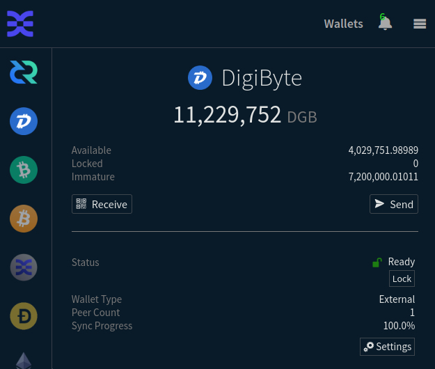

_Image: DigiByte is coming to DCRDEX_

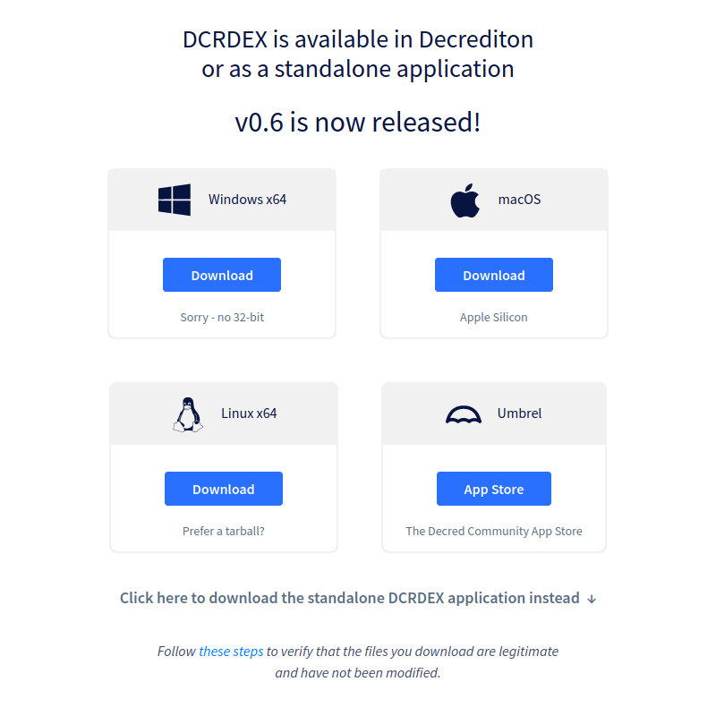

_Image: Umbrel is one more way to get DCRDEX_

### decred.org

_[dcrweb](https://github.com/decred/dcrweb) is the source code for the [decred.org](https://decred.org/) website._

- Updates for [v1.7.7 release](https://github.com/decred/dcrweb/pull/1115).

### Bison Relay

_[Bison Relay](https://github.com/companyzero/bisonrelay) is a new social media platform with strong protections against censorship, surveillance, and advertising, powered by Decred Lightning Network._

New features have been first tested by the community in Release Candidate 1 which revealed a few bugs that got fixed in v0.1.7 final.

Common changes in GUI and CLI apps in v0.1.7:

- Added progress tracking and automatic [retries to send DCR tips](https://github.com/companyzero/bisonrelay/pull/176).

GUI app changes in v0.1.7:

- Added a menu command to [suggest](https://github.com/companyzero/bisonrelay/pull/182) one user to do a key exchange with another user. This allows to connect two users together by mediating their key exchange.
- Made [received files](https://github.com/companyzero/bisonrelay/pull/190) interactive: each file has an icon indicating its type, and clicking the file opens it with a program as configured in the operating system.
- Added tooltip explaining the [Cost](https://github.com/companyzero/bisonrelay/pull/196) field when sharing content (it is the price users will pay to download content).
- Added context menu when [right clicking](https://github.com/companyzero/bisonrelay/pull/198) user name in various places like chat, user list, feed, or post comments. This provides faster access to tipping and other actions on users.
- Improved UX for [embedding files in posts](https://github.com/companyzero/bisonrelay/pull/203). Several users failed to press the `+` button to add a file, resulting in posts without images. The confusing `+` button has been removed and files are now added in one action.
- Added a page listing all [own posts](https://github.com/companyzero/bisonrelay/pull/204).
- Added [prepaid invites](https://github.com/companyzero/bisonrelay/pull/191). When such an invite is imported its DCR will automatically fund the Bison Relay wallet of the invited user.
- Added wallet account management (create and list accounts) and the ability to [send and receive DCR with on-chain](https://github.com/companyzero/bisonrelay/pull/191) (not LN) transactions. With this BR can act as a simple DCR wallet, becoming a third actively supported GUI wallet after Decrediton and DCRDEX.
- Added [server-based invites](https://github.com/companyzero/bisonrelay/pull/194) (aka RV-based invites) which avoid the need for exchanging invite files. Instead the invite is pushed to the server and its download is pre-paid by the sender. Receiving user may fetch such invite without having any funds to pay the server. If the invite has any DCR in it, it can be redeemed to bootstrap new user's wallet for using Bison Relay.
- Added automated [onboarding flow](https://github.com/companyzero/bisonrelay/pull/197) using server-based invites. It performs all wallet setup tasks if given an appropriate prepaid invite key. Tasks include: fetch the invite, redeem funds, open outbound and inbound LN channels, and perform an initial key exchange with the user who created the invite.
- Fixed unwanted [newline](https://github.com/companyzero/bisonrelay/pull/195) getting inserted when sending with the Enter key and the cursor is not at the end of the line. Also fixed sending of empty messages.
- Fixed a few input forms not responding to [Enter key](https://github.com/companyzero/bisonrelay/pull/198), which normally submits the form.
- Fixed and improved chat [scroll behavior](https://github.com/companyzero/bisonrelay/pull/207). New messages will no longer cause scrolling to the bottom and loss of scroll position. After leaving and returning to a chat it will scroll to the bottom like in Element. Scroll to first unread message has been added.
- Fixed error message when using [Query Route](https://github.com/companyzero/bisonrelay/pull/200) feature to check if there is a valid route to the LN node used by the Bison Relay server.

GUI app issues found in v0.1.7 Release Candidate 1 and fixed in v0.1.7 final:

- Added [notifications](https://github.com/companyzero/bisonrelay/pull/217) for new posts and new comments to existing posts. If there are unread items, icons on the main sidebar will change, Feed items will be tagged with "New Post" or "New Comments", and new comments will show in bold until the user clicks away from the post.
- Updated [icons](https://github.com/companyzero/bisonrelay/pull/218) for macOS and Windows, changed app name from "bruig" to "bisonrelay".
- Fixed [New Post](https://github.com/companyzero/bisonrelay/pull/210) button navigating to a wrong page.
- Fixed [icons](https://github.com/companyzero/bisonrelay/pull/220) being hard to see in dark mode.
- Fixed Chats tab behaving like [like the user has no contacts yet](https://github.com/companyzero/bisonrelay/issues/211) and showing the initial invite prompt, until the app syncs with the network. This has been replaced with loading animation while the address book is loading.

CLI app changes in v0.1.7:

- Added an option to the `/channels` command to show [additional info](https://github.com/companyzero/bisonrelay/pull/208) for LN channels.
- Fixed attempt to load TLS certificate when its path is empty on the "Request receive capacity" view.
- Updated the [build script](https://github.com/companyzero/bisonrelay/pull/209) and removed leftovers from ZKC (Bison Relay's predecessor).

Changes merged in `master` towards future releases:

- Fixed possible crash of the CLI app when listing [LN channel](https://github.com/companyzero/bisonrelay/pull/222) balances with `/ln channels` command.
- Updated GUI app [styles](https://github.com/companyzero/bisonrelay/pull/225) for new post and new comment notifications.

Other stuff:

- Tipping bot Oprah will be [sending messages](https://matrix.to/#/!GHnoHXSgkVAsUknRUg:decred.org/$FKG9OTiG-WZO7vRl_-VhS9ST_EhvjpWOLeQjs9qvcyc?via=decred.org&via=matrix.org&via=zettaport.com) to users when it fails to send a tip. This way, tip recipients will be notified of issues with their receive channels.
- Existing public group chats will be upgraded to support multiple admins and utilize the new onboarding admin bot. Members of such rooms should upgrade to v0.1.6 or higher.
- New [admin bot](https://matrix.to/#/!GHnoHXSgkVAsUknRUg:decred.org/$X75ujNeIVZdUSDf2HUwdlIzbXVzYsfKj-HnkWMJwpZk) will further streamline onboarding by helping new users discover public channels and inviting them automatically, removing the wait for a manual invite.
- After the onboarding work developers plan to work on [pages, stores and mobile apps](https://matrix.to/#/!GHnoHXSgkVAsUknRUg:decred.org/$oyK-Bcj3BRUfWvIcJcR4-gx-pOC7BbFRHm9KStEFmTk?via=decred.org&via=matrix.org&via=zettaport.com).

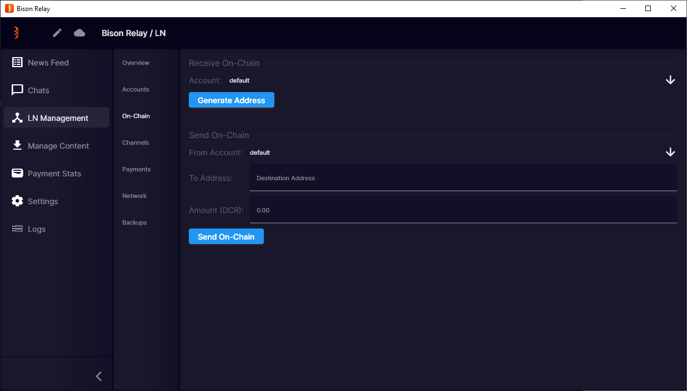

_Image: Bison Relay can now be used as a simple DCR wallet_

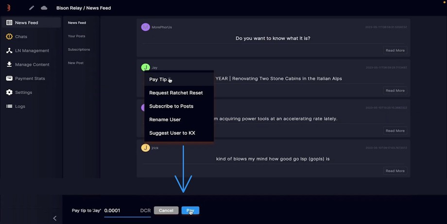

_Image: Tipping users in Bison Relay got much easier_

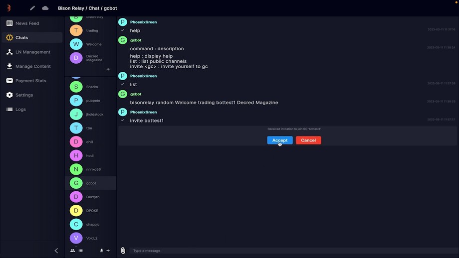

_Image: Friendly bot helps to discover public chats_

### Other

- Decred's own [release](https://github.com/decred/release) build tool gained [build flavors](https://github.com/decred/release/pull/90) which will be used by DCRDEX builds with Windows system tray integration. Support for [OpenBSD on 64-bit ARM](https://github.com/decred/release/pull/88) has been added. [Windows on 64-bit ARM](https://github.com/decred/release/commit/542b45cf593c8c6dbfa1d2d92e67bf7c21e36f0e) was explored but removed due to one dependency not supporting it yet.
- [decred-release](https://github.com/decred/decred-release) automatic installer has been updated with hashes and signatures for v1.7.7 release.
- [dcrtest](https://github.com/decred/dcrtest/pull/11) integration test framework has been [updated](https://github.com/decred/dcrtest/pull/11) to latest Go modules from dcrd.
- During the reproducible building [session](https://matrix.to/#/!zefvTnlxYHPKvJMThI:decred.org/$qjda4fjr5oQaDICsfnfhSRMmmoJtYx67zBrrRQqzyrk?via=decred.org&via=matrix.org&via=planetdecred.org) for v1.7.7 release developers encountered a mismatch in `go-ethereum` builds for DCRDEX, which turned out to be ["a doozy of a compiler bug"](https://github.com/golang/go/issues/59500) (it is quite an achievement to hit a compiler bug!) and another [bug](https://github.com/golang/go/issues/59525) in Go building code. Investigation has delayed the release by a few days, eventually both bugs got fixed and the fixes will ship in Go 1.21 and Go 1.20.4.

## People

Welcome the new first-time contributors:

- Jay ([Decred Magazine](https://www.decredmagazine.com/author/jay/) author, [@h3la1](https://twitter.com/h3la1) on Twitter)

Congratulations to [@norwnd](https://github.com/norwnd) for getting the Decred Contractor Clearance!

Community stats as of May 3 (compared to Apr 3):

- [Twitter](https://twitter.com/decredproject) followers: 53,077 (-112)
- [Reddit](https://www.reddit.com/r/decred/) subscribers: 12,701 (+23)
- [Matrix](https://chat.decred.org/) #general users: 763 (+2)
- [Discord](https://discord.gg/GJ2GXfz) users: 1,573 (+17), verified to post: 921 (-2)
- [Telegram](https://t.me/Decred) users: 2,508 (-111)
- [YouTube](https://www.youtube.com/decredchannel) subscribers: 4,630 (+0), views: 228.1K (+1.6K)

## Governance

In April the new [treasury](https://dcrdata.decred.org/treasury) received 7,958 DCR worth $161K at April's average rate of $20.22. 3,087 DCR was spent to pay contractors, worth $62K at April's average rate.

A [treasury spend tx](https://dcrdata.decred.org/tx/5aa2142e4dce72d28fb3cef3e7d1b565a90655304fdd284016fb585cc96431e9) was approved with 6,900 Yes votes and 54% turnout, and mined on Apr 16. It had 23 outputs making payments to contractors, ranging from 7 DCR to 1,102 DCR. Most of this DCR was likely paid for February work, at its billing exchange rate of $24.03 the TSpend is worth around $74K.

As of May 9, combined balance of [legacy](https://dcrdata.decred.org/address/Dcur2mcGjmENx4DhNqDctW5wJCVyT3Qeqkx) and [new treasury](https://dcrdata.decred.org/treasury) is 856,305 DCR ($14.5 million USD at $16.96).

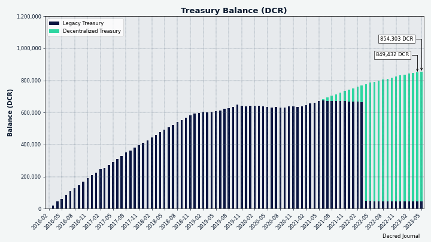

_Image: Decred Treasury balance in DCR_

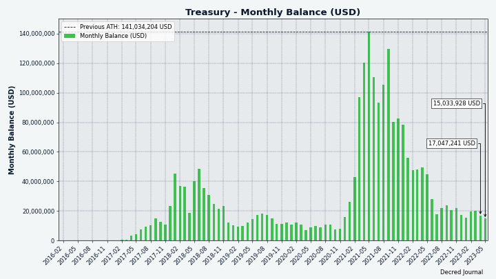

_Image: Decred Treasury balance in USD_

There were 2 new proposals submitted in April:

- [Decred Vanguard](https://proposals.decred.org/record/0a1b782) is a new initiative to fund a community-driven outreach team with a budget of $46,784. There will be up to 25 paid positions for participants to receive $100/month, as well as $100 prizes for good contributions from inside and outside the Vanguard team.

- BTC-ECHO, a German crypto news site, submitted a [proposal](https://proposals.decred.org/record/49e373b) requesting $9,500 for 2 sponsored articles and related promotion, running over a period of 3 months.

@jy-p's [proposal](https://proposals.decred.org/record/a8501bc) to change the reward distribution so that PoW miners get just 1% and the hashing algorithm changes was approved with 97% Yes votes and turnout of 62%. @bee has [compiled](https://github.com/decredcommunity/proposals/blob/master/proposals/a8501bc/qna.md) the most common questions and answers from the highly active comments on the proposal. The development work needed to implement the DCP-12 change has already been [merged](https://github.com/decred/dcrd/pull/3092) to master.

A [proposal](https://proposals.decred.org/record/609db9e) from @joegruff to develop Decrediton support for Ledger hardware was approved with 89% Yes votes and 39% turnout.

See Politeia Digest [issue 59](https://blockcommons.red/politeia-digest/issue059/) for more details on the month's proposals.

## Network

New ATHs in April:

- Staked DCR: 9,882,748.69 DCR
- Mixed and unspent DCR: 9,380,774.51 DCR
- LN nodes: 192
- LN channels: 392
- LN capacity: 163.63 DCR

**Hashrate**: April's [hashrate](https://dcrdata.decred.org/charts?chart=hashrate&scale=linear&bin=day&axis=time) opened at ~94 Ph/s and closed ~76 Ph/s, bottoming at 62 Ph/s and peaking at 94 Ph/s throughout the month.

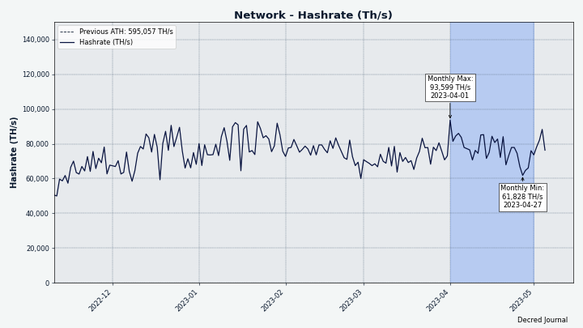

_Image: Decred hashrate_

Distribution of 72 Ph/s hashrate [reported](https://miningpoolstats.stream/decred) by the pools on May 1: Poolin 64%, F2Pool 30%, AntPool 6%, CoinMine 0.3%.

Distribution of 1,000 blocks actually [mined](https://miningpoolstats.stream/decred) by May 1: Poolin 63%, F2Pool 28%, AntPool 6%, BTC.com 2.5%, CoinMine 0.2%.

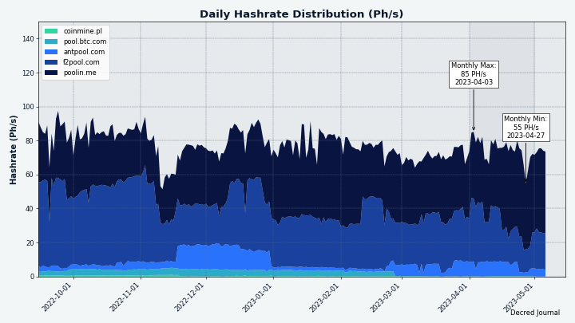

_Image: Historical pool hashrate distribution_

**Staking**: [Ticket price](https://dcrdata.decred.org/charts?chart=ticket-price&axis=time&visibility=true-true&mode=stepped) varied between 236-253 DCR.

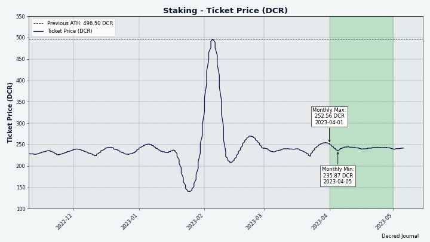

_Image: Ticket price has been unusually stable in April_

The [locked amount](https://dcrdata.decred.org/charts?chart=ticket-pool-value&scale=linear&bin=day&axis=time) was 9.75-9.88 million DCR, meaning that 64.6-65.3% of the circulating supply [participated](https://dcrdata.decred.org/charts?chart=stake-participation&scale=linear&bin=day&axis=time) in Proof of Stake.

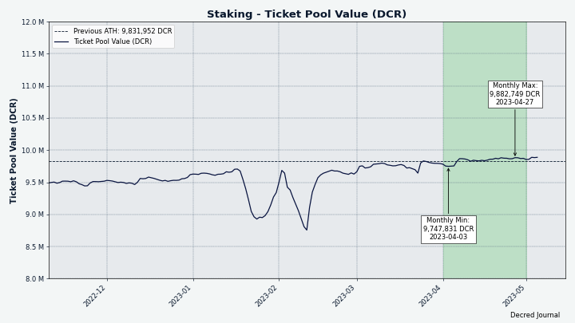

_Image: DCR locked in tickets is crawling up_

**VSP**: The [14 listed VSPs](https://decred.org/vsp/) collectively managed ~6,960 (-240) live tickets, which was 17.1% of the ticket pool (-0.5%) as of May 1.

Biggest gainer in April was vspd.bass.cf (+165 tickets or +27%). Two VSPs got [delisted](#ecosystem).

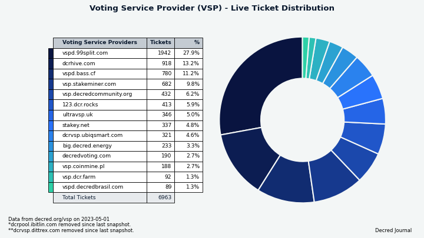

_Image: Distribution of tickets managed by VSPs_

**Nodes**: [Decred Mapper](https://nodes.jholdstock.uk/user_agents) observed between 163 and 171 dcrd nodes throughout the month. Versions of 166 nodes seen on May 1: v1.7.5 - 28%, v1.7.1 - 21%, v1.8.0 dev builds - 13%, v1.7.2 - 12%, v1.7.7 - 11%, v1.7.0 - 5%, v1.7.4 - 4%, other - 7%.

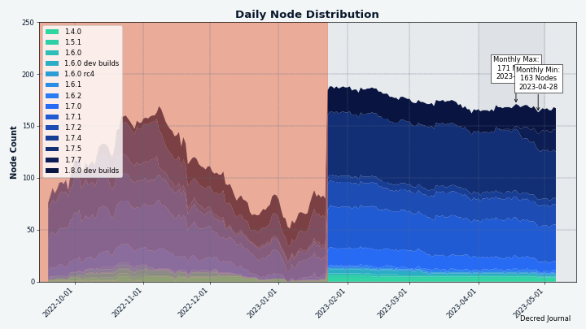

_Image: Historical dcrd version distribution, data from nodes.jholdstock.uk. Data before Jan 2023 was incomplete._

The share of [mixed coins](https://dcrdata.decred.org/charts?chart=coin-supply&zoom=jz3q237o-la8vk000&scale=linear&bin=day&axis=time&visibility=true-true-true) varied between 61.0-61.8%. Daily [mixed volume](https://dcrdata.decred.org/charts?chart=privacy-participation&bin=day&axis=time) varied between 303-502K DCR.

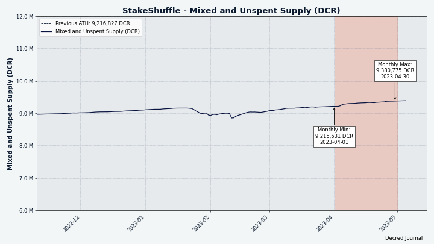

_Image: Mixed supply is on the rise_

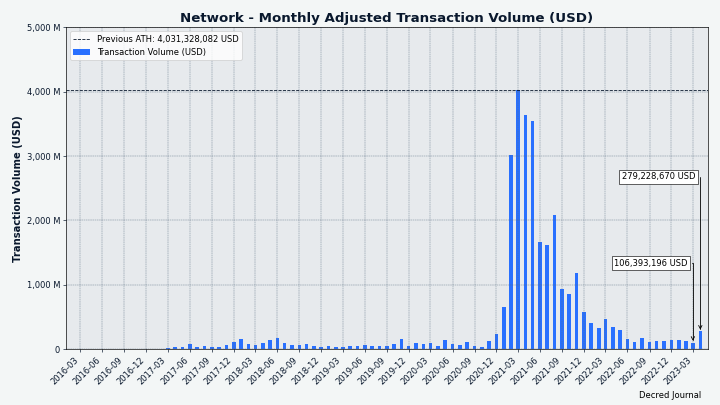

_Image: Uptick in ["adjusted transaction volume"](https://coinmetrics.io/introducing-adjusted-estimates/) as defined by Coin Metrics, in both DCR and USD_

Decred's [Lightning Network](https://ln-map.jholdstock.uk/) explorer has seen 196 nodes (+21), 399 channels (+45) with a total capacity of 163 DCR (+34), as of May 1. These stats are different for each node. For example, @karamble's node reported 193 nodes (+18), 429 channels (+53) and 174 DCR (+39) capacity on same day May 1.

Decred's LN has surpassed Litecoin LN in node count and channel count, and is getting close in capacity according to [Litecoin LN data](https://1ml.com/litecoin/) from 1ML.com.

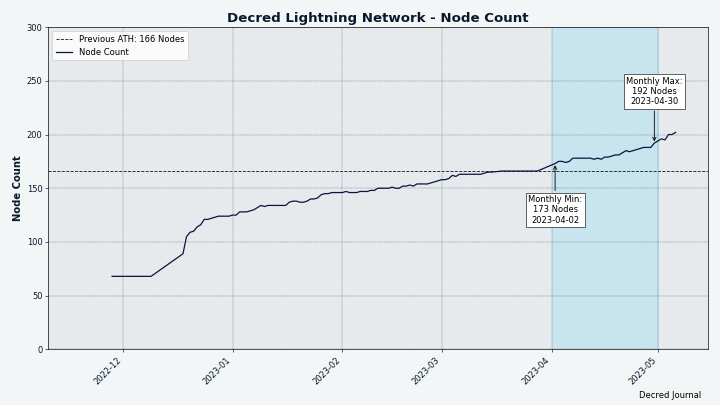

_Image: Decred's Lightning Network is seeing more nodes_

@bochinchero created charts showing [balances of top mining addresses](https://github.com/bochinchero/decred-pub/blob/main/MiningRewardBalance/MiningAddresses.md) against DCR's price history and key events like ASIC launch dates and CEX listings. While not providing much analysis or commentary on its own, it contributes to the collective research of miners' participation in malicious suppression of DCR markets, which is the key argument of the recent [proposal](https://proposals.decred.org/record/a8501bc) to reduce mining rewards to 1% and change the mining algorithm.

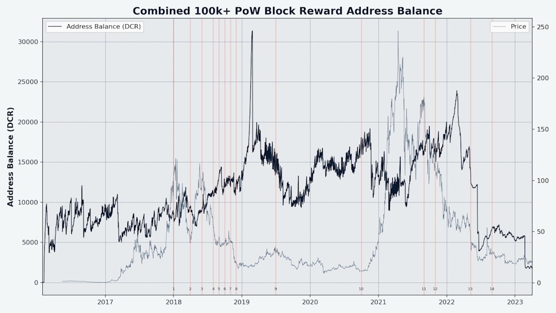

_Image: Combined balance of top 22 mining addresses vs DCR price history_

## Ecosystem

Services gained or listed:

- New DCR/USDC, BTC/USDC and ETH/BTC pairs are [live](https://twitter.com/decredproject/status/1648190102802161671) at [dex.decred.org](https://dex.decred.org/). DEX client version 0.6.0 or higher is required to create ETH and USDC wallets and trade.

- [Bison Relay](https://bisonrelay.org/) has been [added](https://github.com/decred/dcrweb/pull/1114) to [Community](https://decred.org/community/) links at decred.org.

- [Trocador.app](https://trocador.app/) has been [added](https://github.com/decred/dcrweb/pull/1124) to [Exchanges](https://decred.org/exchanges/), it is a meta exchanger that finds quotes from various services and then fronts it for the user via their APIs. It works without JavaScript and over Tor (they even have an Onion URL). A useful feature of Trocador is it rates the probability of each backend provider forcing KYC/AML after the fact. This is the biggest risk with instant exchanges other than outright scamming. Additionally, Trocador may reimburse some of the exchanged amount if for some reason the backend provider fails to send funds or provide some proof of a legal order justifying it. DCR was listed in [February 2023](https://twitter.com/TrocadorApp/status/1625487712601112576).

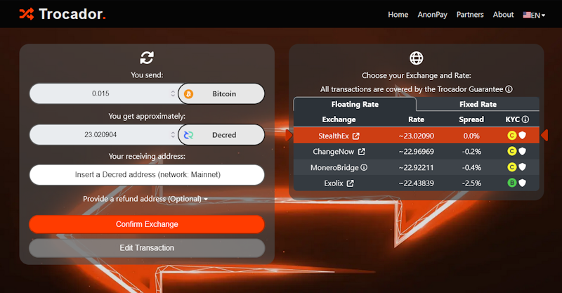

_Image: Trocador.app finds best rates, isolates from vendors, and warns about KYC risks_

Services lost or delisted:

- VSP [dcrpool.ibitlin.com](https://dcrpool.ibitlin.com) has been [removed](https://github.com/decred/dcrwebapi/pull/173) from the [VSP list](https://decred.org/vsp/) after being offline since Feb 28, last time it reported 4 live tickets. This VSP had been serving since Jan 2021 and voted ~1,200 tickets with a miss ratio of 0.75%. The fee was 1% of the ticket reward.

- VSP [dcrvsp.dittrex.com](https://dcrvsp.dittrex.com) has been removed from [VSPs](https://decred.org/vsp/), it was last seen online on Apr 04 with 2 live tickets. The owner [clarified](https://github.com/decred/dcrwebapi/pull/175) on GitHub that the VSP is being retired. It had been serving since Apr 2021 and voted ~500 tickets, missing only 0.6% of them. This one had a 5% fee.

- [Metal Pay](https://github.com/decred/dcrweb/pull/1124) was [removed](https://github.com/decred/dcrweb/pull/1124) from [Exchanges](https://decred.org/exchanges/), it disabled buy orders for DCR as reported in [March issue](202303.md#ecosystem).

- [GloBee](https://globee.com/) was [removed](https://github.com/decred/dcrweb/pull/1119) from [Exchanges](https://decred.org/exchanges/). A payment processor founded by Monero's fluffypony and others, is now offline. We could not find any shutdown announcement on its [Twitter](https://twitter.com/GlobeeCom) or elsewhere. Last snapshot of the website was made in [January](https://web.archive.org/web/20230131111854/https://globee.com/).

- [dcrstats.com](https://dcrstats.com/) is offline since around early April, it was a network stats dashboard popular in the early years of Decred.

Other news:

- Bittrex has been [charged](https://reason.com/2023/04/19/sec-sues-crypto-exchange-bittrex-shortly-after-it-announces-its-leaving-u-s-markets/) by U.S. SEC for operating unregistered securities exchange. This came shortly after the [March](202303.md#ecosystem) announcement that Bittrex is leaving U.S. markets. So far we have not seen information suggesting it may impact non-U.S. users of [Bittrex Global](https://global.bittrex.com/trade/dcr-usdt).

Coming [changes](https://matrix.to/#/!lDZCzVQjFoJsXMPkvr:decred.org/$jO-Hc1bk0SGjON0JrJvLwzLNeF6pzg-bAgwXT5lv-BA) to Decred's [chat platforms](https://decred.org/community/):

- All chat bridges are being taken down except for the bridge between Matrix and Bison Relay.
- Discord is likely going to be shut down completely. Without the bridged content it may become a ghost town, and without enough moderators watching it will be taken over by spammers or scammers.
- [Decred](https://t.me/Decred) Telegram will continue to function as usual with the same rules but without the bridge (it was [disabled](202112.md#outreach) in 2021 due to high amount of spam).
- [Decred Trading](https://t.me/DecredTrading) Telegram was renamed to [Bison Time](https://t.me/BisonTime) and Decred branding has been removed.
- [Decred Support](https://t.me/DecredSupport) Telegram has been unbridged, locked, and now just redirects to Matrix #support.
- [#trading](https://matrix.to/#/!lDZCzVQjFoJsXMPkvr:decred.org/) on Matrix will become subject to same moderation rules as the other chat rooms.
- [#support](https://matrix.to/#/!xUNvyzkFgiMjhvPbIi:decred.org/) on Matrix becomes the *only* chat that is actively monitored by developers. All support requests [will be redirected](https://matrix.to/#/!xUNvyzkFgiMjhvPbIi:decred.org/$oC3cXW1RvLqONPyIiqOBm1Oo5tMTbbQ3ndntruO8aTw) to this Matrix chat.

Join our [#ecosystem](https://chat.decred.org/#/room/#ecosystem:decred.org) chat to get more news about Decred services.

Warning: the authors of the Decred Journal have no idea about the trustworthiness of any of the services above. Please do your own research before trusting your personal information or assets to any entity.

## Outreach

Monde PR's achievements:

- Pitched 1 news announcement
- Pitched 6 media opportunities

Secured the following media placements:

- An article in [Invezz](https://invezz.com/news/2023/04/17/decred-announces-dcrdex-0-6-with-support-for-ethereum-and-usdc-swaps/) about the launch of DCRDEX 0.6. The article was syndicated to 5 publications including [Bitcoin Insider](https://www.bitcoininsider.org/article/212399/decred-announces-dcrdex-06-support-ethereum-and-usdc-swaps).
- An article in [CoinJournal](https://coinjournal.net/news/decred-launches-dcrdex-0-6-the-latest-version-of-its-decentralized-exchange/) about the launch of DCRDEX 0.6. The article was syndicated to 3 publications including [Crypto News BTC](https://cryptonewsbtc.org/2023/04/17/decred-launches-dcrdex-0-6-the-latest-version-of-its-decentralized-exchange/).
- @jy-p appeared on the [Entangled Things Podcast](https://www.entangledthings.com/all-episodes/episode/7bef6428/quantum-and-cryptocurrency-with-jake-yocom-piatt) talking about the threat of quantum computing to cryptocurrencies.
- @jy-p appeared on the [MineYourBiz Show](https://www.youtube.com/watch?v=aTaEul34RsA) talking about the current state of the Decred project and its new privacy features.

## Events

**Upcoming:**

- @arij and @khalidesi are going to [GITEX AFRICA](https://www.gitexafrica.com/home) as both visitors and Decred representatives. This is a large tech event held in Marrakech, Morocco, from May 31 to June 2. If anyone plans to attend or has suggestions please join Matrix [#events](https://chat.decred.org/#/room/#events:decred.org) chat.

## Media

**Selected articles:**

- [Decred offers solutions to society problems?](https://www.decredmagazine.com/decred-offers-solutions-to-society-problems/) by @Joao
- [Decred mining evolves](https://www.decredmagazine.com/decred-mining-evolves/) by @OfficialCryptos
- [Decred vs Dash: Governance for all!](https://www.decredmagazine.com/decred-vs-dash/) by @Joao
- [Top 5 reasons Decred's price will explode](https://www.decredmagazine.com/top-5-reasons-decreds-price-will-explode/) by @Jay
- [The paradox of choice: Deciding between Turing complete and non-Turing complete blockchains](https://www.decredmagazine.com/the-paradox-of-choice-deciding-between-turing-complete-and-non-turing-complete-blockchains/) by @BlockchainJew
- [Voting mechanisms & incentives for governance in DAOs](https://mirror.xyz/0x34ddd9223D9DDb6B56F640824Af6FCC31e1deBF4/T6AUZv8Rn5rlGS9xxQNVzh7QPoo8h2CCWIwU_OYpJmk) by Arhat - a study of DAO governance, author has [corrected](https://twitter.com/0xArhat/status/1650753877430468608) the Decred section in response to feedback
- [Inter-community talk! Today with Jose Trejo from the DigiByte community](https://www.decredmagazine.com/inter-community-talk-today-with-jose-trejo-from-the-digibyte-community/) by @Joao - first talk of a series where Decred Magazine authors will be interviewing members from other crypto communities

> Whatever the outcome, the next year or so will be an interesting ride. If you're here for cypherpunk ideals (innovation, decentralisation, non-custodial solution and development), it's hard not to be enthusiastic for the future. \[[@OfficialCryptos](https://www.decredmagazine.com/decred-mining-evolves/)\]

Decred Magazine engagement Stats for April:

- Total number of articles on DM: 444
- Newsletter subscribers: 96
- New DM posts and newsletters sent: 16
- Active social media campaigns: 46
- Completed social media campaigns: 38
- Social media posts: 212
- Likes: 1,230
- Re-tweets: 260
- Social media followers across all platforms and accounts (including [@DecredSociety](https://twitter.com/DecredSociety)): 1300

**Videos:**

- [Decred Recap - Mining change, new subsidy split, Cointelegraph proposal, tons of dev updates!](https://www.youtube.com/watch?v=xW4JzxjYKww) by @Exitus - also as a [podcast](https://podcasters.spotify.com/pod/pod/show/decred-magazine/episodes/Decred-Recap---Mining-Change--New-Subsidy-Split--Cointelegraph-Proposal--tons-of-Dev-Updates-e21jks5)
- [Decrediton staking - Buying tickets the easy way](https://www.youtube.com/watch?v=oaRTDuNVF4Y) by @phoenixgreen - also as a [text post](https://www.decredmagazine.com/decrediton-staking-buying-tickets-the-easy-way/)
- [Oprah tipping bot - BisonRelay](https://www.youtube.com/watch?v=6uSFttopNnk) by @phoenixgreen - also as a [text post](https://www.decredmagazine.com/oprah-tipping-bot-bisonrelay/)
- [Setting up DCRDEX 0.6 in Decrediton](https://www.youtube.com/watch?v=6LCxuCSstGo) by @phoenixgreen - also as a [text post](https://www.decredmagazine.com/setting-up-dcrdex-0-6-in-decrediton/)
- [Setting up DCRDEX native wallets (BTC, BCH & LTC)](https://www.youtube.com/watch?v=7eioER2lWmI) by @phoenixgreen - also as a [text post](https://www.decredmagazine.com/setting-up-dcrdex-native-wallets-btc-bch-ltc/)

> With Bison Relay, you are no longer the product. Your content and opinions have always had monetary value, but the main difference here is the value belongs to the creator, not the platform. \[[@phoenixgreen](https://www.youtube.com/watch?v=6uSFttopNnk)\]

Livestream:

- [Decred - Bricking ASICs and P2P social media discussion feat. Dave Collins & Jake Yocom-Piatt](https://www.youtube.com/watch?v=ZZmq7NVqYBA) by @phoenixgreen and @Exitus joined by @jy-p and @davecgh - also as a [podcast](https://podcasters.spotify.com/pod/show/decred-magazine/episodes/Decred---Bricking-ASICs-and-P2P-Social-Media-discussion-feat--Dave-Collins--Jake-Yocom-Piatt-e21qf1e)
- [What the heck is #Decred & how does it protect #PRIVACY?](https://www.youtube.com/watch?v=aTaEul34RsA) by MineYourBiz feat. @jy-p

**Audio:**

- [Quantum and cryptocurrency with Jake Yocom-Piatt](https://www.entangledthings.com/all-episodes/episode/7bef6428/quantum-and-cryptocurrency-with-jake-yocom-piatt) by Patrick Hynds and Ciprian Jichici - an episode in the Entangled Things podcast discussing encryption standards and the threat of quantum computing to blockchain. Mirrored on [Apple Podcasts](https://podcasts.apple.com/us/podcast/quantum-and-cryptocurrency-with-jake-yocom-piatt/id1552714727?i=1000607276017), [Buzzsprout](https://entangledthings.buzzsprout.com/1617373/12580449-quantum-and-cryptocurrency-with-jake-yocom-piatt), and other platforms.

**Translations:**

- [Why is Decred not EVM compatible?](https://www.decredmagazine.com/why-is-decred-not-evm-compatible/) - [in Chinese](https://github.com/DominicTing/decred-ZH-translations/blob/master/Why%20is%20Decred%20not%20EVM%20compatible%3F.md) by @Dominic
- [The paradox of choice: Deciding between Turing complete and non-Turing complete blockchains](https://www.decredmagazine.com/the-paradox-of-choice-deciding-between-turing-complete-and-non-turing-complete-blockchains/) - [in Chinese](https://github.com/DominicTing/decred-ZH-translations/blob/master/The%20Paradox%20of%20Choice:%20Deciding%20Between%20Turing%20Complete%20and%20Non-Turing%20Complete%20Blockchains.md) by @Dominic
- Decred Journal February-March got a total of 3 new [translations](https://xaur.github.io/decred-news/) to Arabic (@arij, @abdulrahman4), Chinese (@Dominic) and Polish (@kozel). Thank you all!

**Non-English content:**

- [Decred overview in Croatian](https://www.youtube.com/watch?v=xlQH09pzmDw) by @FIMA

**Discussions:**

- Bison Relay [post](https://twitter.com/exitusdcr/status/1642750459890008065) about how junk follower accounts on Twitter can be used to reduce visibility of the targeted account
- A convo about [coin centralization](https://www.reddit.com/r/decred/comments/12d8ake/one_entity_owns_2m_dcr_bad_or_good/)
- Decred [pitch](https://twitter.com/0x69b9/status/1649089557927804928) by 0x69b9

**Other:**

- [Decred tag page](https://bitcoinmagazine.com/tags/decred) at Bitcoin Magazine is gone. Last time it was [seen](https://web.archive.org/web/20220119175419/https://bitcoinmagazine.com/tags/decred) with 4 articles. [Direct links](https://bitcoinmagazine.com/business/decred-sets-its-sights-decentralization-2018) should still work.

## Markets

In April DCR was trading between USDT 17.91-25.18 and BTC 0.00061-0.00089. The average daily rate was $20.22.

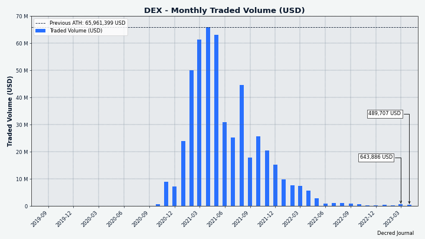

_Image: DCRDEX monthly volume in USD_

## Relevant External

Bitcoin Ordinals continued to [grow](https://decrypt.co/138438/bitcoin-transactions-soar-as-ordinals-barrell-past-2-5-million-notch-daily-record), with over 2.5 million being minted so far, with a peak of 223K in a single day, increasing the number of daily Bitcoin transactions to levels not seen since 2017. Much of the recent Ordinals activity is around a new [BRC-20](https://dailycoin.com/bitcoin-ordinals-highs-brc-20/) standard for minting fungible tokens in a series.

Ethereum's Shapella upgrade was [activated](https://cointelegraph.com/news/ethereum-shapella-upgrade-community-celebrates-as-update-goes-live-on-mainnet) on mainnet, allowing ETH holders who have been staking their ETH, some of it for years, to finally withdraw it from the staking contract.

The issuer of USDC stablecoin, Circle, has [released](https://www.coindesk.com/tech/2023/04/26/circle-unveils-new-method-for-moving-usdc-between-blockchains/) details of a new method for transferring the asset between blockchains without "lock-and-mint" bridges which have proven to be a great target for hackers - they're calling it "Cross-Chain Transfer Protocol" or CCTP.

Crypto exchange Bittrex has been [charged](https://www.coindesk.com/policy/2023/04/17/crypto-exchange-bittrex-violated-federal-laws-sec-charges-in-lawsuit/) with violating securities laws by the SEC. The charge [names](https://beincrypto.com/sec-6-names-tokens-securities/) 6 tokens as securities which Bittrex should have registered to trade: OMG Network (OMG), Dash (DASH), Algorand (ALGO), Monolith (TKN), NAGA (NGC), and IHT Real Estate Protocol (IHT). The naming of DASH as a security has been [viewed](https://twitter.com/lex_node/status/1648027888531423232) as reflecting a particularly aggressive stance, Dash development is funded by block rewards and it had no (official) pre-mine.

Coinbase has continued in its efforts to engage with the SEC and seek clarity on how they define crypto securities by [suing](https://www.theblock.co/post/228047/coinbase-sues-the-sec-for-answer-on-rule-specific-to-digital-assets) the SEC in an attempt to force it to make its criteria public and clarify its decisions.

Gary Gensler has [appeared](https://www.coindesk.com/policy/2023/04/19/sec-chair-gensler-declines-to-say-if-ether-is-a-security-in-contentious-congressional-hearing/) in a congressional hearing in which he answered some questions about the SEC's approach, but not whether ETH is classified as a security. He also released a new [video](https://twitter.com/GaryGensler/status/1651624244445421591) comparing crypto securities to dogs impersonating goldfish, in his signature condescending style.

The European Parliament has [voted](https://www.coindesk.com/policy/2023/04/20/eu-parliament-approves-crypto-licensing-funds-transfer-rules/) in favor of the Markets in Crypto-Assets (MiCA) licensing regime with 90% Yes votes and turnout of 97%, paving the way for it to become law across the EU in 2024. While the regulations have been [welcomed](https://www.coindesk.com/policy/2023/04/21/eu-crypto-industry-applauds-mica-but-looks-to-whats-next/) by the industry for the clarity they will bring, many crypto privacy enthusiasts are [disappointed](https://twitter.com/Hermetics_/status/1651414492528492544) that use of mixing services will lead to funds being flagged as high risk. At the same time the parliament voted in favor of Transfer of Funds regulation which will require crypto operators to identify their customers as an anti-money-laundering step - final voting figures were 92% Yes votes with 98% of eligible MEPs voting.

James Zhong, the man who was found to have over 50,000 BTC which he fraudulently obtained from the Silk Road by making simultaneous withdrawal requests, was [sentenced](https://www.justice.gov/usao-sdny/pr/silk-road-dark-web-fraud-defendant-sentenced-following-seizure-and-forfeiture-over-34) to one year and one day in prison, and forfeiture orders were granted for all of the BTC and associated assets he had bought with it, including an LLC real estate holding company, gold, silver and [Casascius coins](https://en.bitcoin.it/wiki/Casascius_physical_bitcoins).

That's all for April. Share your updates for the next issue in our [#journal](https://chat.decred.org/#/room/#journal:decred.org) chat room.

## About

This is issue 58 of Decred Journal. Index of all issues, mirrors, and translations is available [here](https://xaur.github.io/decred-news/).

Most information from third parties is relayed directly from the source after a minimal sanity check. The authors of the Decred Journal cannot verify all claims. Please beware of scams and do your own research.

Credits (alphabetical order):

- writing, editing, publishing: bee, bochinchero, Exitus, jz, karamble, l1ndseymm, phoenixgreen, richardred
- reviews and feedback: chappjc, davecgh
- title image: Exitus
- funding: Decred stakeholders
