# Decred Journal – August 2023

_Image: Untitled by @Exitus_

Highlights of August:

- Two consensus changes activated on Decred mainnet to reduce mining rewards and change the mining algorithm. These changes disrupt ASIC mining cartels and make GPU mining more accessible.

- Cryptopower's first mainnet release is out. It is a new wallet building on the legacy of GoDCR, and adding BTC and LTC wallets, instant coin exchange, and more. Initially available as a desktop app but mobile apps are in development.

- Bison Relay v0.1.8 has been released with chat history loading after app restart, initial e-commerce features, and numerous UX improvements in the graphical and text apps.

- Full node wallet support for Dash and Firo has been merged in DCRDEX. Advanced users can try it out.

Contents:

- [New Consensus Rules Activated](#new-consensus-rules-activated)
- [Cryptopower v1.0.0 Release](#cryptopower-v100-release)
- [Bison Relay v0.1.8 Release](#bison-relay-v018-release)
- [Development](#development)
- [People](#people)
- [Governance](#governance)
- [Network](#network)
- [Ecosystem](#ecosystem)
- [Outreach](#outreach)
- [Media](#media)
- [Markets](#markets)
- [Relevant External](#relevant-external)

## New Consensus Rules Activated

Consensus changes [Change PoW to BLAKE3 and ASERT](https://github.com/decred/dcps/blob/master/dcp-0011/dcp-0011.mediawiki) and [Change PoW/PoS Subsidy Split To 1/89](https://github.com/decred/dcps/blob/master/dcp-0012/dcp-0012.mediawiki) have activated on Decred mainnet at block [794,368](https://dcrdata.decred.org/block/071683030010299ab13f139df59dc98d637957b766e47f8da6dd5ac762f1e8c7) on August 29. It took roughly 5 months since the [Politeia proposal](https://proposals.decred.org/record/a8501bc) was submitted in March to implement these changes and activate them with a vote.

The chain was paused for almost 3 days until CPU miners found the first blocks and everything got running again. We will cover early CPU and GPU mining developments in the next issue. As of writing everything looks stable again and more upgrades are in the pipeline.

Old software will not follow the chain past the Aug 29 fork. To use Decred, make sure to upgrade to the latest [core software release](https://github.com/decred/decred-binaries/releases), standalone [DCRDEX app](https://github.com/decred/dcrdex/releases), [Cryptopower](https://github.com/crypto-power/cryptopower/releases) or any other [wallet](https://decred.org/wallets/) you've been using.

Congratulations to the Decred community for activating our [12th consensus change](https://github.com/decred/dcps)!

## Cryptopower v1.0.0 Release

Cryptopower is a new self-custodial wallet for DCR, BTC and LTC. The first public mainnet release packages a year of development work and new features added since GoDCR was discontinued in [August 2022](202208.md#godcr). Highlights:

- Multi-coin wallet for DCR, BTC and LTC - all working in light (SPV) mode without needing to download full blockchains
- Decred staking, mixing, and governance - voting on consensus changes, treasury spends and Politeia proposals
- Coin conversion via centralized exchangers like [Flyp.me](https://flyp.me/), [Godex.io](https://godex.io/), [ChangeNOW.io](https://changenow.io/) and others
- Custom coin selection for extra control
- Custom gap limit
- Runs on Windows, macOS, Linux, FreeBSD
- Potential to build mobile apps for Android and iOS from the same codebase

Download the app for your operating system [here](https://github.com/crypto-power/cryptopower/releases). Make sure to verify the files as explained in the [release](https://github.com/crypto-power/cryptopower/releases/tag/release-v1.0.0); the builds are signed by `Cryptopower <release@cryptopower.dev>` with key fingerprint `5C26BFEC6C2466A528D5551CD05AC74F68976E52`.

Android APK builds are [experimental](https://twitter.com/dreacot/status/1699963093940363668) and not yet recommended for real wallets but testers are welcome.

Bug reports and feedback are welcome using [GitHub Issues](https://github.com/crypto-power/cryptopower/issues) or the [#cryptopower](https://matrix.to/#/!oxOZZtibVUXxXtdPJS:decred.org) Matrix chat.

Learn more:

- [Short demo video](https://twitter.com/dreacot/status/1694260734878712220)
- [Introduction and screenshots](https://www.cypherpunktimes.com/cryptopower-golang-native-desktop-mobile-wallet/)
- [Proposal](https://proposals.decred.org/record/256efee) to fund Cryptopower development
- [Status of desktop and mobile and a big feature table](https://proposals.decred.org/record/256efee) comparing Cryptopower, Decrediton, old Android and iOS wallets, Cake Wallet and DCRDEX
- [Q&A with lead developer @dreacot](https://www.cypherpunktimes.com/introducing-decred-developer-dreacot/)

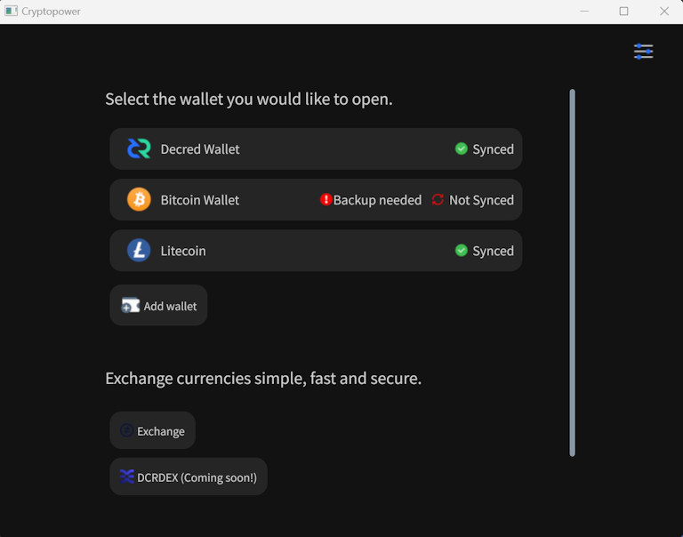

_Image: Cryptopower wallet selection page in dark mode_

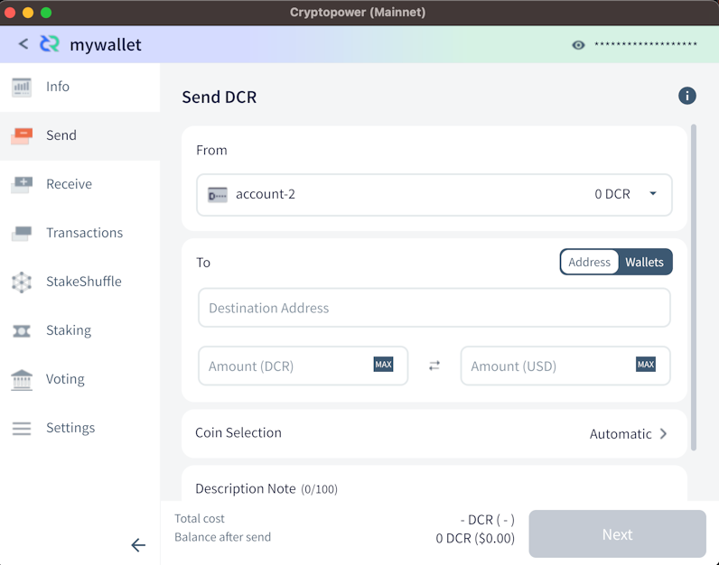

_Image: Cryptopower's send page_

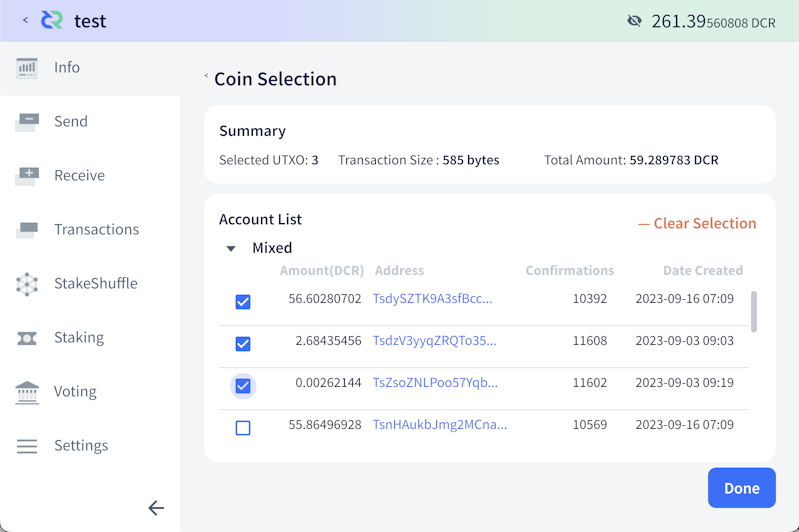

_Image: Cryptopower supports advanced Coin Selection for extra control_

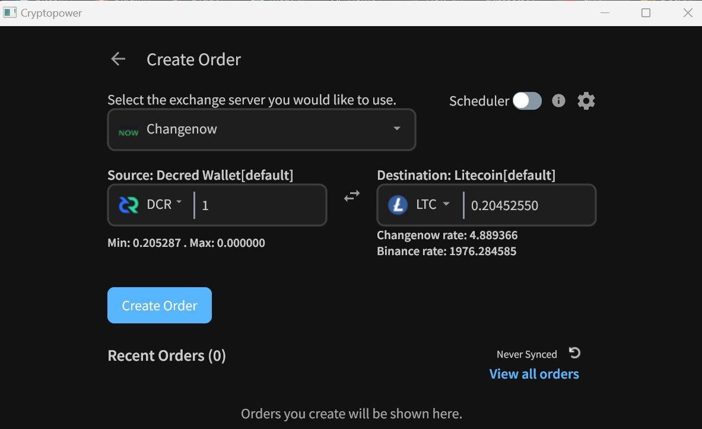

_Image: Cryptopower lets you [convert coins](https://twitter.com/exitusdcr/status/1699366344813109572) without touching the browser_

## Bison Relay v0.1.8 Release

This is a big release with new features and UX improvements made over the last 4 months.

Major changes in both GUI and text apps:

- Loading of chat history after app restarts
- Pages with hyperlinks (similar to web pages)
- Improved reliability of key exchanges and tipping
- Numerous bug fixes

GUI app highlights:

- Address book with searching and filtering
- News Feed with images and improved sorting
- Improved notifications UI
- Improved responsiveness on smaller screens

brclient text app highlights:

- Initial e-commerce features
- Client-side content filtering
- Client data backups

The initial e-commerce infrastructure called "simplestore" is designed for selling digital-only goods such as images, videos, audio, and files. Supported payment methods are DCR Lightning Network, on-chain DCR transfers, and custom/manual processing. Simplestore is only available in the text-based brclient app in this release.

GUI and text clients have different features now. Changes for each app are listed on the [release page](https://github.com/companyzero/bisonrelay/releases/tag/v0.1.8); please pay attention to the upgrade notice if migrating from v0.1.7 on Windows. For a complete list of changes with explanations see [Decred Journal](https://xaur.github.io/decred-news/) issues from April to July 2023. See the [README](https://github.com/companyzero/bisonrelay/blob/v0.1.8/README.md#verifying-binaries) file for instructions on verifying the files.

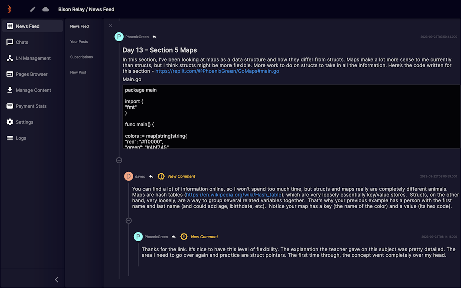

_Image: Bison Relay v0.1.8 helps you find new comments faster_

## Development

The work reported below has the "merged to master" status unless noted otherwise. It means that the work is completed, reviewed, and integrated into the source code that advanced users can [build and run](https://medium.com/@artikozel/the-decred-node-back-to-the-source-part-one-27d4576e7e1c), but is not yet available in release binaries for regular users.

### dcrd

_[dcrd](https://github.com/decred/dcrd) is a full node implementation that powers Decred's peer-to-peer network around the world._

The majority of the work this month was developer-focused, and not necessarily user-focused. However, it's always interesting when a new Go version is supported, because it unlocks potential new features and improvements from the coding language itself (check the dcrwallet updates from the [July issue](202307.md#dcrwallet) for examples of this).

The following work has been merged in `master` towards future releases:

- Dropped official support for Go 1.19, and [added support for Go 1.21](https://github.com/decred/dcrd/pull/3172) (Go 1.20 is still supported as well). This included updates to the GitHub Actions build workflow. Building against Go 1.19 is still possible, and it is highly likely to work fine, but it is no longer being actively tested.
- Updated the [Docker image](https://github.com/decred/dcrd/pull/3171) to build the dcrd binary with Go 1.21.0.
- Optimized the GitHub Actions [build workflow](https://github.com/decred/dcrd/pull/3168) to reduce duplicate cache entries and cache spam. This involved removing the Go module and build cache from the GitHub build workflow, since the latest `setup-go` action caches them by default, and this was creating duplicate cache entries. The linter is still cached separately, and this update also included a small filename change to produce significantly fewer cache objects.
- Added a test scenario to the [ASERT tests](https://github.com/decred/dcrd/pull/3173) that ensures the difficulty adjusts appropriately when block times are speeding up.
- Added a [duplicate-word linter](https://github.com/decred/dcrd/pull/3175), and used it to [tidy up comments](https://github.com/decred/dcrd/pull/3174) in 44 different files.
- [Removed unused parameters](https://github.com/decred/dcrd/pull/3177) from a few blockchain functions. These functions are internal, so this change has no impact to clients or users.
- Added an [error linter](https://github.com/decred/dcrd/pull/3179), and updated multiple errors so that they can be [wrapped with useful context](https://github.com/decred/dcrd/pull/3178). This allows them to be unwrapped by function callers to identify the source of the error. This update allows the errors to work nicely with `errors.Is` and `errors.As`.

The [DCP-11 document](https://github.com/decred/dcps/blob/master/dcp-0011/dcp-0011.mediawiki) specifying the change to BLAKE3 and ASERT has been reviewed and [released](https://github.com/decred/dcps/pull/29). Here are some interesting facts we found:

- The document explains the new proof of work hash, new ASERT difficulty adjustment algorithm, and the difficulty reset at the activation block, all in great detail with formulas, diagrams, and guidance for implementations.
- *Block header* stayed exactly the same; it is a compact 180-byte structure that holds important metadata about the block and allows syncing and navigating the chain very quickly.
- *Block hash* remained unchanged too; it is the same BLAKE-256 14-round hash of the *block header*. Most Decred software uses block hash to identify blocks and needs no modifications.
- *Proof of work hash* changed to BLAKE3; it is created by hashing the *block header*. Only mining software (and hardware) needs to adapt to this new hashing algorithm.
- Research into difficulty algorithms has shown that ASERT is one of the [best performers](https://github.com/zawy12/difficulty-algorithms/issues/50) in the space. Side note: Bitcoin's DA got the worst rating in the 9th category after all others. Based on that and other research, Bitcoin Cash [adopted](https://documentation.cash/protocol/forks/2020-11-15-asert.html) a variation of ASERT in November 2020.
- A new ASERT difficulty must be calculated for every block, which is 144x more frequent than the previous EMA algorithm. However, the ASERT algorithm can be calculated ~16x faster, so overall dcrd will spend ~9x more time running ASERT code. Fortunately, this is on the order of microseconds per block and does not make any practical difference. Read more [here](https://github.com/decred/dcps/pull/29#discussion_r1300314310).
- DCP-11 is the biggest DCP so far, when measuring by the length of text, file count, and overall size. It is very well-made and all Decred enthusiasts are advised to [read the full thing](https://github.com/decred/dcps/blob/master/dcp-0011/dcp-0011.mediawiki).

Voting results have been added to all 12 [DCP documents](https://github.com/decred/dcps) to record at which historical blocks the voting started as well as when consensus changes locked in and activated. Implementations of Decred consensus may use these block numbers to optimize their chain verification logic and avoid tallying historical votes.

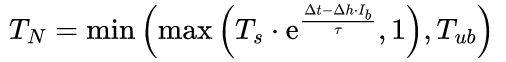

_Image: The ASERT difficulty formula is rather simple. If our processors could just run this beautiful math directly..._

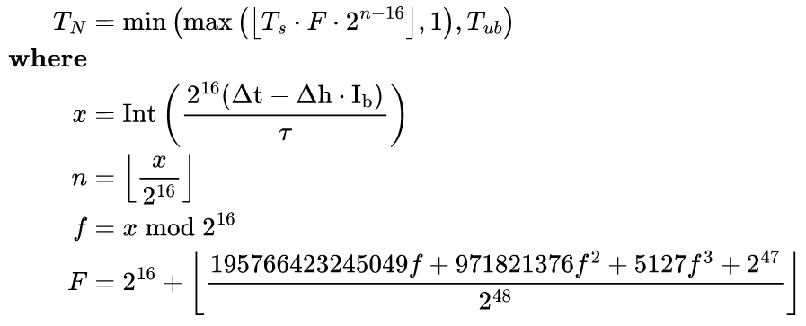

_Image: But come down to Earth and face the brutal reality of binary computers with limited precision. This adjusted formula is optimized to run fast on real hardware, with minimal error._

### dcrwallet

_[dcrwallet](https://github.com/decred/dcrwallet) is a wallet server used by command-line and graphical wallet apps._

June-July changes [backported](https://github.com/decred/dcrwallet/pull/2277) for the next v1.8.x release:

- [Warn users](https://github.com/decred/dcrwallet/commit/1c1bcfbd5aa7ca0b1cbad06b4f1bb6b8c2af5aa5) about VSP fee payment errors caused by the wallet being locked. This will allow users to react if a locked wallet blocks VSP fee payments. Upon seeing the error, the user should unlock the wallet and try again to prevent missed tickets.
- Fixed broken [retrying logic](https://github.com/decred/dcrwallet/commit/07854e3746aeef2de88488ae5cc87ee6a092387b) for errored VSP ticket purchases. This issue affected many users. Any ticket purchases which worked first time were unaffected, but any purchases which ran into an error were not being retried, which would lead to tickets not being added to the VSP and votes being missed. Thankfully, re-registering the ticket with a different VSP was a workaround, but it was poor UX.
- Fixed a bug where the [fee payment status check](https://github.com/decred/dcrwallet/commit/c4c6c4213da7cde5ecdc97fb5347a1c7bc3aeae2) could be unreasonably delayed. The VSP client delays actions by some random duration in order to help protect privacy. With this incorrect delay calculation the wallet would report fee payments as being unconfirmed for up to 2 hours until the next check happens, when actually the fee has been sent and confirmed. Now the user wallet will update sooner.
- Require VSP clients to [wait for the VSP to confirm fee payments](https://github.com/decred/dcrwallet/commit/7c551ce6b95456b6ec1a174b5529641dd133230a) before considering a VSP ticket fully purchased. This eliminates multiple problematic edge cases caused by users broadcasting their own fee transactions, such as paying too low of a fee or sending payment to the wrong address. It is a preventative fix for extremely unlikely cases which have not been seen in the wild.

New changes merged in `master` and backported for the next v1.8.x release:

- Fixed another bug where confirming a VSP ticket fee transaction took longer than necessary, caused by ticket's [live and expiry block heights](https://github.com/decred/dcrwallet/pull/2270) not getting updated after the ticket was mined. It happened with the majority of VSP tickets. The fee would eventually get confirmed if the wallet was left running. Restarting the wallet would sync it straight away. There was no risk of votes being missed. Backported change is [here](https://github.com/decred/dcrwallet/commit/1319da0b05d4a9715b045e847ff58b442f407f39).

User-facing changes merged in `master` towards future releases:

- Added [logging of transaction changes the wallet notices](https://github.com/decred/dcrwallet/pull/2275) during rescans. This is off during the initial rescan (during reseed or after restarting dcrwallet) because it would be too noisy. Any other rescans are typically done to fix a problem, and dcrwallet will log when it finds new wallet transactions inside an old block, or wallet transactions which were previously unmined, but are now mined. Rescans aren't fun for users, and rescans are really just a bandaid to sync wallets that got out of sync. Having the hashes of missed transactions will be helpful to debug why a wallet had a problem syncing them, and will hopefully result in some bugfixes that reduce user's need to rescan.
- Added a [cancellation check](https://github.com/decred/dcrwallet/pull/2276) to non-mixed ticket purchases before publishing the purchase. Mixed ticket purchases already check for cancellation, so this may solve an edge-case bug.
- Fixed processing of a batch of VSP tickets if [one of them failed](https://github.com/decred/dcrwallet/pull/2259). When adding multiple tickets to the VSP client if one of them were to fail, the remaining ones would not be attempted. It is unlikely that this caused any issues in the real world. This change also added some missing logging to make users aware that some VSP tickets failed and may need investigating.

Developer and internal changes:

- Moved the logic of [finding VSP-managed tickets](https://github.com/decred/dcrwallet/pull/2259) out of the VSP client and into the main wallet code. This is part of the continued effort to refactor VSP and wallet logic.
- Added official [support for Go 1.21](https://github.com/decred/dcrwallet/pull/2278) and updated the GitHub Actions build workflow.
- [Replaced](https://github.com/decred/dcrwallet/pull/2265) all non-generated uses of `interface{}` with `any` in the codebase. While `any` is just a new alias, it makes the code easier to read.

### dcrctl

_[dcrctl](https://github.com/decred/dcrctl) is a command-line client for dcrd and dcrwallet._

- Improved instructions for setting up [environment variables](https://github.com/decred/dcrctl/pull/68) when building or installing dcrctl.
- Updated CI and docs for [Go 1.21](https://github.com/decred/dcrctl/pull/69).

### Decrediton

_[Decrediton](https://github.com/decred/decrediton) is a full-featured desktop wallet app with integrated voting, StakeShuffle mixing, Lightning Network, DEX trading, and more. It runs with or without a full blockchain (SPV mode)._

Packaging contributions:

- Decrediton v1.8.0 has been added to [Homebrew Cask](https://github.com/Homebrew/homebrew-cask/pull/149083) repository for macOS users.
- Decrediton v1.8.0 has been added to [winget](https://github.com/microsoft/winget-pkgs/pull/112385), a package manager installed by default in Windows 10 and 11.

Other news:

- [Decrediton 2FA](https://www.reddit.com/r/decred/comments/15cyod5/decrediton_2fa_hoddle_safely/) concept from @norwnd has been put [on hold](https://matrix.to/#/!DwNysKhaQPBPURaBGt:decred.org/$sn4rEGvdxLgITmVuwLrFXfQhPXbVqvMVkK1So_xa2DY) in favor of exploring a general-purpose [multisig solution](https://gist.github.com/norwnd/890ad642985f4e9e9f7b1dd243b21f9e#long-term-we-need-decrediton-with-generic-multisig-support-right-) for Decrediton if there is demand. Currently, there is no GUI for multisig in Decred.

### vspd

_[vspd](https://github.com/decred/vspd) is server software used by Voting Service Providers. A VSP votes on behalf of its users 24/7 and cannot steal funds._

Functional changes that VSP admins may notice:

- Wait until all other startup tasks have been completed before listening to [notifications from dcrd](https://github.com/decred/vspd/pull/407). There was no problem with connecting to dcrd earlier but it was unnecessary and created messy logs.
- Changed discovery of [voted and revoked tickets](https://github.com/decred/vspd/pull/413) from using dcrwallet's `TicketInfo` call to using [GCS filters](https://github.com/decred/dcrd/tree/f69247ff2478057ddbbc6692fc96ff6520b6a8c1/gcs) from dcrd. [Golomb-coded Sets](https://github.com/decred/dcps/blob/master/dcp-0005/dcp-0005.mediawiki#user-content-Golombcoded_Sets) (GCS) enable very efficient detection of transactions, this feature is a key element in Decred's privacy-preserving light wallets (SPV). The new method is [more robust](https://github.com/decred/vspd/pull/413#issuecomment-1694228745), and as a result VSP admins may notice that vspd detects some historic voted/revoked tickets which `TicketInfo` never detected.
- Added a new integrity check that updates revoked tickets in the database to be either [expired or missed](https://github.com/decred/vspd/pull/415). Initial version of vspd was unable to distinguish between expired and missed tickets and reported them all as "revoked". Knowing how many tickets were missed by the VSP is useful for [evaluating its reliability](https://github.com/decred/vspd/issues/268). This update uses a clever heuristic to guess ticket outcome based on how long it took to revoke it. It is not 100% accurate but is good enough for the purpose of reporting VSP stats.

Developer and internal changes:

- Added a test to ensure the hard-coded [error string](https://github.com/decred/vspd/pull/404) returned from [securecookie](https://github.com/gorilla/securecookie) will not change unexpectedly when vspd is upgraded to a newer version of the library.
- [Replaced](https://github.com/decred/vspd/pull/401) uses of `interface{}` with `any`, similar to [dcrwallet](#dcrwallet).
- Updated to [Go 1.21](https://github.com/decred/vspd/pull/402) and newer GitHub Actions. Testing with Go 1.19 has been removed.
- Removed client-side [VSP fee payment logic](https://github.com/decred/vspd/pull/403) from vspd repository. The [idea](https://github.com/decred/vspd/issues/379) to migrate all VSP client code from dcrwallet to vspd repository was found to be problematic, it created a circular dependency between vspd and dcrwallet which is [cumbersome](https://matrix.to/#/!zefvTnlxYHPKvJMThI:decred.org/$_rzNyvnGedWeh_tnXWk5WDQKaj3TODeXbxRa9fg7CtY) and not worth the maintenance burden. Most VSP client code has been removed from vspd and will continue to live in dcrwallet repository. Eventually it should become an exported package which can be reused by software seeking to add VSP staking features. What remains in the vspd repository are the absolute basics which will be useful for any consumer of the vspd API: the [data types](https://github.com/decred/vspd/blob/2db761e0727866fda0bc303432e443599a2d3b45/types/types.go) and a [basic HTTP client](https://github.com/decred/vspd/blob/2db761e0727866fda0bc303432e443599a2d3b45/client/client.go) for communicating with vspd, including signing requests and verifying signatures of responses for [two-way accountability](https://github.com/decred/vspd/blob/2db761e0727866fda0bc303432e443599a2d3b45/docs/two-way-accountability.md).
- Simplified [shutdown code](https://github.com/decred/vspd/pull/410). It was inherited from dcrwallet and was a bit more flexible and complex than required for vspd.
- Various [refactoring](https://github.com/decred/vspd/pull/408) to allow more code reuse and improve integrity checks.
- Refactored how [data is passed](https://github.com/decred/vspd/pull/409) internally to remove duplication and prepare for future changes.
- Fixed a bug with processing new block [notifications](https://github.com/decred/vspd/pull/412) from dcrd (it did not affect any released version).
- Removed [contexts from structs](https://github.com/decred/vspd/pull/411) as [recommended](https://pkg.go.dev/context) by standard library documentation. Added [linters](https://github.com/decred/vspd/pull/411) to prevent this and other issues that came up during code review.

### Lightning Network

_[dcrlnd](https://github.com/decred/dcrlnd) is Decred's Lightning Network node software. LN enables instant and low-cost transactions._

- Ported changes made in the upstream [lnd](https://github.com/lightningnetwork/lnd) between v0.11.1 and [v0.12.1](https://github.com/lightningnetwork/lnd/releases/tag/v0.12.1-beta) (released Feb 2021). 541 commits distributed across 220 upstream PRs have been ported, of which [53 commits](https://github.com/decred/dcrlnd/commits?after=c97f63c8bc41977c6c9b6e5b62fb216e8157cef9+0&author=matheusd) were needed to adjust the codebase to Decred. Full list of ported pull requests can be found [here](https://github.com/decred/dcrlnd/blob/master/docs/upstream-prs.csv).

### DCRDEX

_[DCRDEX](https://github.com/decred/dcrdex) is a non-custodial, privacy-respecting exchange for trustless trading, powered by atomic swaps._

DCRDEX v0.6.2 is now available in [Decred's Umbrel app store](https://github.com/decred/umbrel-app-store).

August changes included in the v0.6.3 release (out in September):

- Fixed a possibility of showing incorrect [order book](https://github.com/decred/dcrdex/pull/2449) in some order cancellation scenarios.

The remaining changes below are merged in the `master` branch towards future releases.

Client:

- Improved [app seed display](https://github.com/decred/dcrdex/pull/2462) on the backup page, it will be shown in groups of 8 characters.
- Implemented [configuration restrictions](https://github.com/decred/dcrdex/pull/2454) for wallets controlled externally. This can hide settings like password change if the DEX GUI is embedded in Decrediton and not running standalone. In this scenario any changes to the trading wallet must be done from Decrediton, and blocking them in the DEX UI should prevent users from breaking the wallet.
- Update browser [tab/window title](https://github.com/decred/dcrdex/pull/2458) when changing markets. Also provide instant visual feedback when the user clicks on another market, such as clear the depth chart, order book and recent matches.

Server:

- Only send penalize notification when user's [tier changes](https://github.com/decred/dcrdex/pull/2451), avoiding unnecessary notifications.

Decred:

- Added [staking support foundations](https://github.com/decred/dcrdex/pull/2290).
- Exposed staking methods via the [JSON-RPC API](https://github.com/decred/dcrdex/pull/2316).
- Added a method to fetch a [list of Voting Service Providers](https://github.com/decred/dcrdex/pull/2466) from [api.decred.org](https://github.com/decred/dcrwebapi/blob/master/docs/api.md).
- Next step is to create a GUI for staking.

Bitcoin:

- Fixed crash when attempting to [reconfigure](https://github.com/decred/dcrdex/pull/2474) a missing or corrupted BTC wallet.

Dash:

- Added [full node wallet](https://github.com/decred/dcrdex/pull/2424) support for DASH.
- Require Dash's mandatory [v19.2.0](https://github.com/decred/dcrdex/pull/2484) update.

Firo:

- Implemented [Electrum light wallet](https://github.com/decred/dcrdex/pull/2426) support for Firo, including test harnesses with automated Firo's chain daemon, ElectrumX server, and wallet client.

[Market maker and arbitrage bots](https://proposals.decred.org/record/8b1ceda) progress:

- Implemented [balance segregation](https://github.com/decred/dcrdex/pull/2332) which limits the amount of funds available to each bot.
- Implemented [simulation](https://github.com/decred/dcrdex/pull/2409) of sideways, trending, and volatile markets. This will be used to [test bot behavior](https://github.com/decred/dcrdex/issues/2303). For the curious, available market simulations are documented [here](https://github.com/decred/dcrdex/blob/8fad25372c4af9d0b378335e4a3dbd12f6ba0d22/dex/testing/loadbot/README.md).
- Updated the basic market maker strategy to [place multiple orders](https://github.com/decred/dcrdex/pull/2416) at various distances from the basis price instead of just one.
- Take into account the possibility of [refunds](https://github.com/decred/dcrdex/pull/2479) in market making balance calculations.

Documentation:

- Added a wiki page about [managing DEX trading accounts](https://github.com/decred/dcrdex/pull/2468) covering topics such as: creating, using an existing account, disabling, exporting, or managing trading account tier.
- Updated [spec](https://github.com/decred/dcrdex/pull/2470) for new API endpoints.
- Added [build instructions](https://github.com/decred/dcrdex/pull/2476) for the macOS app.

Developer and internal changes:

- Added flag to [disable background mining](https://github.com/decred/dcrdex/pull/2452) in DCR test harness.
- Refactoring and testing improvements.

Other:

- A rough plan of development for [fall 2023](https://github.com/decred/dcrdex/issues/2483) has been published for review and discussion, including some ambitious ideas like fiat onboarding.

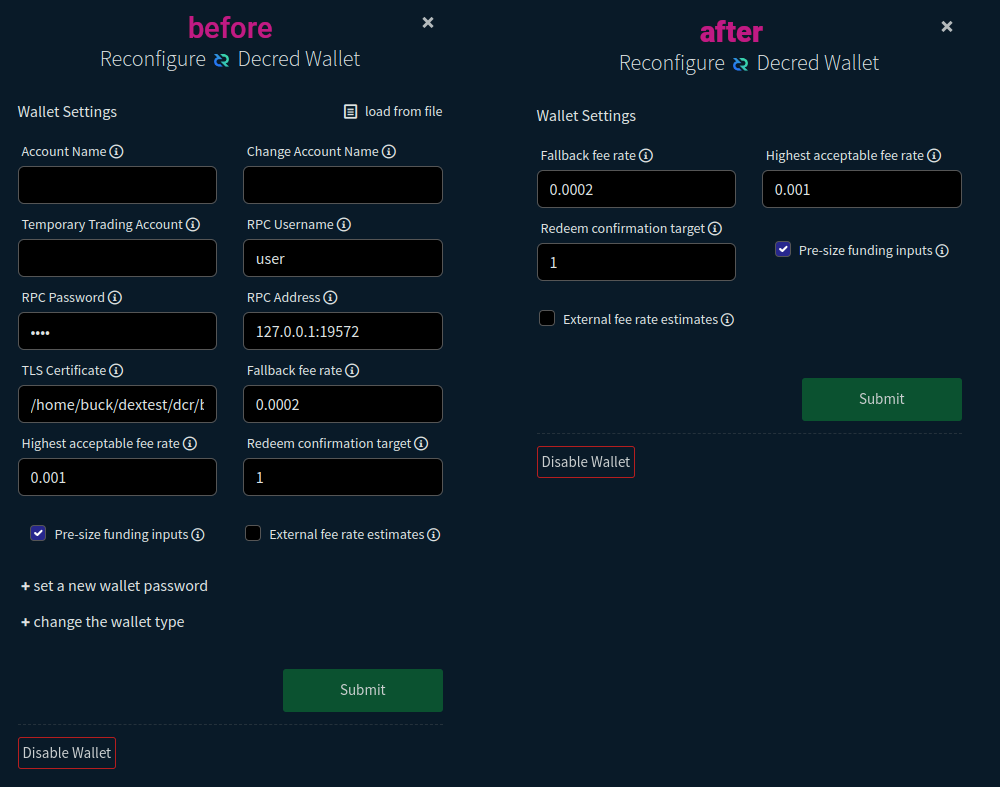

_Image: Footgun protection will prevent accidental changes that might break the wallet when using DEX inside Decrediton_

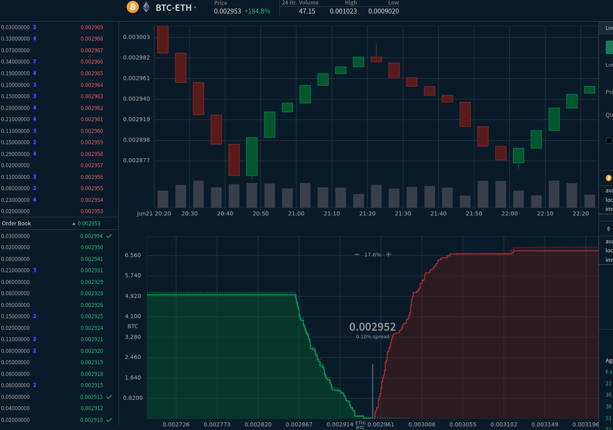

_Image: Simulated sideways market for testing market maker bots' performance_

### Cryptopower

_[Cryptopower](https://github.com/crypto-power/cryptopower) is a multi-coin desktop GUI wallet for DCR, BTC, and LTC. It runs in a privacy-preserving light SPV mode without needing full blockchains, supports Decred staking, mixing, voting, and other unique features._

Last time we wrote dev logs for this project was in [August 2022](202208.md#godcr), when it was called GoDCR. Here's a quick recap of project's history so far:

- In September 2018 Raedah Group began experimenting with GUI libraries suitable for building a Decred wallet in pure Go. A pure Go app has potential to have higher security, better performance, and reach more platforms.
- Five prototype interfaces were built: command line, text-based terminal UI based on [tview](https://github.com/rivo/tview), web browser UI based on [Stimulus](https://stimulus.hotwired.dev/), desktop GUI made with immediate mode [nucular](https://github.com/aarzilli/nucular) toolkit, and another desktop GUI made with retained mode [Fyne](https://github.com/fyne-io/fyne) toolkit. These prototypes and [screenshots](https://github.com/raedahgroup/godcr-old/wiki/Screenshots) are now archived [here](https://github.com/raedahgroup/godcr-old).
- As a result of this research another library called [Gio](https://gioui.org/) was chosen as a winner and a new app [GoDCR](https://github.com/planetdecred/godcr) was started in Jan 2020.
- First GoDCR [development proposal](https://proposals.decred.org/proposals/e5c8051) was approved in Nov 2020 with 92% Yes.
- First functional testnet build was released in [Sep 2021](https://xaur.github.io/decred-news/journal/202109).
- [Second proposal](https://proposals.decred.org/record/f7d9fc8) was rejected with 49% Yes in Oct 2021.
- First mainnet release came out in [May 2022](https://xaur.github.io/decred-news/journal/202205).
- [Third proposal](https://proposals.decred.org/record/0ef42e5) combining GoDCR and existing mobile wallet development was rejected with 20% Yes in Jul 2022.
- Commits in the [godcr](https://github.com/planetdecred/godcr) repository stopped in Aug 2022 but only 2 weeks later the work continued in a private fork.
- After a full year of private development, a rebrand to Cryptopower, a v1.0.0 release, and a new proposal have been [revealed](https://matrix.to/#/!aNnAOHkWUdNcEXRGjJ:decred.org/$Bz6ilL9i3WnaaHeAuWxEl8UOvuJrD9sNQIK8fC359lM).

This August was relatively quiet in terms of development while the team was focused on shipping the [initial v1.0.0 release](#cryptopower-v100-release) and working on the [proposal](https://proposals.decred.org/record/256efee) to get this project funded.

Changes merged in `master` towards the next release:

- Fixed issues preventing DCR [ticket purchasing](https://github.com/crypto-power/cryptopower/pull/44). If paying the VSP fee has failed, it can be resubmitted by opening ticket details page.
- Fixed app crash when clicking on the [Vote button](https://github.com/crypto-power/cryptopower/pull/54) to vote on a proposal.

[instantswap](https://github.com/crypto-power/instantswap) library:

- Added a function to verify that an [address has received](https://github.com/crypto-power/instantswap/pull/5) the specified amount.
- Cryptopower wallet uses the instantswap library to convert between coins through centralized services like Flyp.me, Godex.io, ChangeNOW.io, [and more](https://github.com/crypto-power/instantswap/tree/a58863beed9541e9cfefce611b2a3392ef0a9c1d/instantswap). It also provides utilities for inspecting addresses and transactions via different [block explorers](https://github.com/crypto-power/instantswap/tree/a58863beed9541e9cfefce611b2a3392ef0a9c1d/blockexplorer).

The plan from here is to fix bugs found in the initial release, and build out the features outlined in the [proposal](https://proposals.decred.org/record/256efee) while reusing as much as possible from DCRDEX and other Decred projects.

Developers and testers interested to contribute can join the #cryptopower and #cryptopower-dev chat rooms. See [this guide](https://docs.decred.org/getting-started/joining-matrix-channels/) for how to join our Matrix chats.

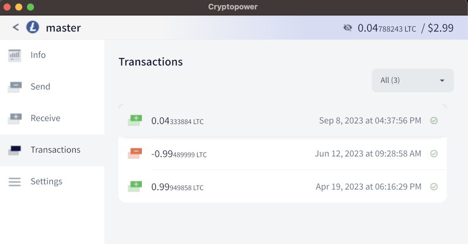

_Image: Cryptopower's LTC wallet_

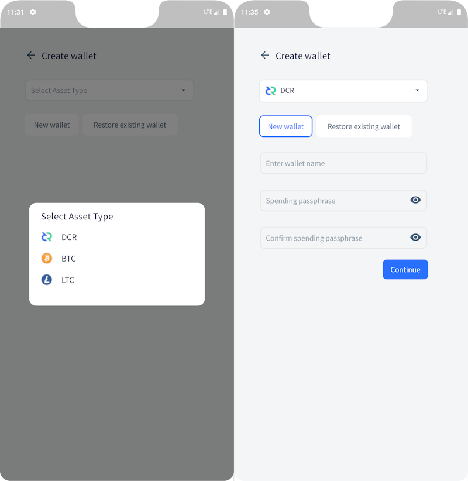

_Image: Cryptopower's wallet creation UI on Android, design is work in progress_

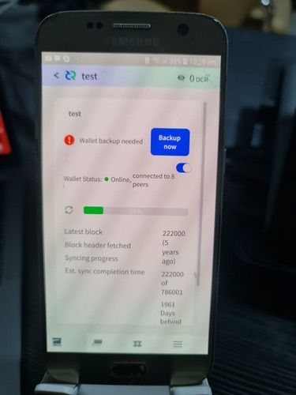

_Image: Experimental Cryptopower Android build tested on a real device_

### Documentation

_[dcrdocs](https://github.com/decred/dcrdocs) is the source code for Decred [user documentation](https://docs.decred.org/)._

- Several pages have been updated for [DCP-12](https://github.com/decred/dcrdocs/pull/1226). [Overview](https://docs.decred.org/), [Glossary](https://docs.decred.org/glossary/), and [Constitution](https://docs.decred.org/governance/decred-constitution/) pages now have correct block reward split. Additionally, [Issuance](https://docs.decred.org/advanced/issuance/) page now documents all three historical splits (60/30/10, 10/80/10, and 1/89/10), and has an updated issuance chart.
- Updated [Material theme for MkDocs](https://github.com/decred/dcrdocs/pull/1227) to v9.2.6, which adds new validation for internal links and navigation menu items. There was an [issue](https://github.com/squidfunk/mkdocs-material/issues/5924) with one plugin but the maintainer has fixed it and released the fixed version in just one day.

> Taking into account the initial block reward splits for the first 794,367 blocks and the modified split starting with block 794,368, the effective final split of the total mined coins is:
> 
> * 40.34% to PoW miners
> * 49.63% to PoS voters
> * 10% to the Decred Treasury \[[DCR Issuance](https://docs.decred.org/advanced/issuance/)\]

### decred.org

_[dcrweb](https://github.com/decred/dcrweb) is the source code for the [decred.org](https://decred.org/) website._

- Added [brand icons](https://github.com/decred/dcrweb/pull/1132) to software releases on the [News](https://decred.org/news/) page.
- Added [13 items](https://decred.org/news/) to the News page.

### Bison Relay

_[Bison Relay](https://github.com/companyzero/bisonrelay) is a new social media platform with strong protections against censorship, surveillance, and advertising, powered by Decred Lightning Network._

August changes included in v0.1.8 release for both the GUI app and text-based brclient:

- [Recognize `lnpay://` links](https://github.com/companyzero/bisonrelay/commit/66ebc67b02d758594bf86bf640c8f66d9f409fe5) and display them as buttons that can initiate LN payments.
- Added [release notes](https://github.com/companyzero/bisonrelay/pull/313), hashes and signatures for v0.1.8 release. This also adds instructions on [verifying the files](https://github.com/companyzero/bisonrelay/tree/8f902aaa62bf3475d859fc3aef50474b7f98d03a#verifying-binaries) to the README file.
- Skip buggy [amount checks](https://github.com/companyzero/bisonrelay/pull/309) in dcrlnd until they are fixed. These checks may prevent the client from sending messages.

GUI app changes included in v0.1.8 release:

- Bison Relay's data directory on Windows will be [moved to a new location](https://github.com/companyzero/bisonrelay/pull/307) due to issues with MSIX and an updated certificate. The user will be shown a warning and advised to make a backup before proceeding.
- List [active chats](https://github.com/companyzero/bisonrelay/pull/320) in the address book. Previously, if a chat is already open it would not be shown in the address book and users could be confused that some contacts are missing.
- Fixed [app name](https://github.com/companyzero/bisonrelay/pull/322) shown in Windows Task Manager.

brclient changes included in v0.1.8 release:

- Added [tracking of simplestore payments](https://github.com/companyzero/bisonrelay/pull/303) made with LN invoices and on-chain DCR transactions. Added ability to send the purchased file after the payment is confirmed.
- Added [documentation](https://github.com/companyzero/bisonrelay/pull/311) about configuring simplestore.
- Fixed possibility of parsing wrong files when [reloading products](https://github.com/companyzero/bisonrelay/commit/57c8d48a2ad7cf8a88208e9d89c9e952bab13ae0) from disk.

Changes listed below have been merged in `master` towards a future release, likely v0.1.9.

Common changes in both GUI and text apps:

- Automatically unsubscribe idle users and remove them from group chats. If a peer client is idle for 21 days an automatic handshake is sent to test if it will respond. After 60 days, if there is still no response, idle peer is forcibly unsubscribed from local user's posts and removed from any group chats where the local user is the admin. Both time intervals can be configured or disabled by the user.

GUI app changes:

- Fixed [link opening](https://github.com/companyzero/bisonrelay/pull/318) returning error instead of opening link in the web browser.

brclient changes:

- [Generate](https://github.com/companyzero/bisonrelay/pull/332) stub simplestore files if the configured store directory exists but is empty. Previously an existing empty directory prevented this.
- [Expand](https://github.com/companyzero/bisonrelay/pull/330) environment variables and `~` in the `/backup` command.

Internal and developer changes:

- Build and test with [Go 1.21](https://github.com/companyzero/bisonrelay/pull/315).
- Updated [dependencies](https://github.com/companyzero/bisonrelay/pull/312).

### Other

- A concept of Monero atomic swap with BTC or BCH has been [proposed](https://github.com/decred/atomicswap/issues/129) in the atomicswap repository. Monero does not have primitives like hashing or timelocks needed for conventional atomic swaps, but the proposed scheme requires only one of the two chains to have sufficient scripting capabilities. There is significant interest in this research with projects like [xmr-btc-swap](https://github.com/comit-network/xmr-btc-swap) from COMIT Network and [BasicSwap](https://particl.news/bidirectional-part-anon-and-xmr-atomic-swaps-now-live-on-basicswap-dex/) from Particl exploring how to swap Monero with Bitcoin-like currencies.

## People

Welcome the new first-time contributors:

- @tallamericano ([Cypherpunk Times](https://www.cypherpunktimes.com/author/tall/) author)

Community stats as of Sep 2 (compared to Aug 1):

- [Twitter](https://twitter.com/decredproject) followers: 53,306 (-22)
- [Reddit](https://www.reddit.com/r/decred/) subscribers: 12,751 (+4)
- [Matrix](https://chat.decred.org/) #general users: 805 (+8)
- [Discord](https://discord.gg/GJ2GXfz) users: 1,661 (+72), verified to post: 677 (+34)
- [Telegram](https://t.me/Decred) users: 2,303 (-52)
- [YouTube](https://www.youtube.com/decredchannel) subscribers: 4,640 (+0), views: 234.6K (+2.1K)

## Governance

In August the new [treasury](https://dcrdata.decred.org/treasury) received 7,155 DCR worth $99K at August's average rate of $13.89. 5,961 DCR was spent to pay contractors, worth $83K at same rate.

A [treasury spend tx](https://dcrdata.decred.org/tx/144c17b0542e4aecb6c2b00b905552b001055dcf8298a0cd8ce0c1409e4bb2e4) was approved with 7,163 Yes votes and 56% turnout, and mined on Aug 28. It had 26 outputs making payments to contractors, ranging from 7 DCR to 2,036 DCR. Most of this DCR was likely paid for June work, at its billing exchange rate of $14.25 the TSpend is worth around $85K.

As of Sep 2, combined balance of [legacy](https://dcrdata.decred.org/address/Dcur2mcGjmENx4DhNqDctW5wJCVyT3Qeqkx) and [new treasury](https://dcrdata.decred.org/treasury) is 865,779 DCR (11.1 million USD at $12.81).

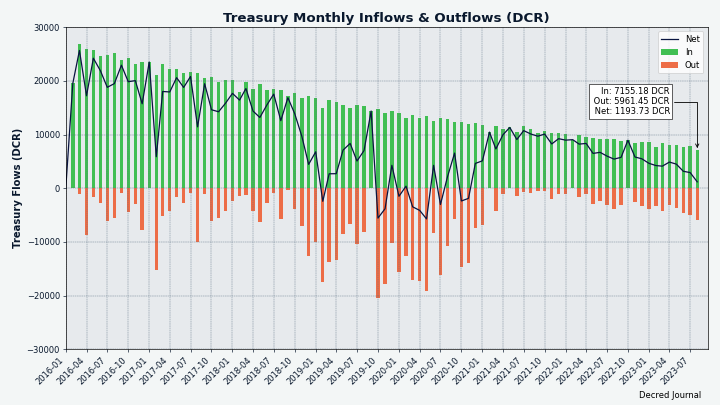

_Image: Treasury inflows and outflows in DCR_

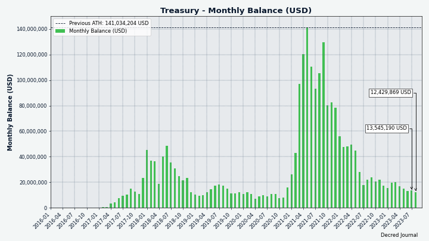

_Image: Treasury balance in USD_

There were 3 new proposals submitted:

- [Proposal](https://proposals.decred.org/record/256efee) requesting $61,600 budget for Cryptopower, a multi-asset version of GoDCR revival, written in Go to be cross-platform and mobile friendly. In addition to Politeia many comments have been posted in #proposals [chat](https://matrix.to/#/!qYpAAClAYrHaUIGkLs:decred.org/$dhl2WaQkMIKawUTXNg5Jrx30doUAvJkoFS2vD4d5AAs).
- [Proposal](https://proposals.decred.org/record/2f25f2d) requesting $80,000 budget to integrate initial basic DCR support in [Cake Wallet](https://cakewallet.com/). Chat comments start [here](https://matrix.to/#/!qYpAAClAYrHaUIGkLs:decred.org/$PTJF15NZg5RqJgt_aDQfWOkh9YoJfI-bYwCKcwERpXU).
- [Proposal](https://proposals.decred.org/record/b80040f) requesting $15,000 for the writing and publication of two articles about Decred on the [Odaily](https://www.odaily.news/) Chinese language crypto news site.

See Politeia Digest [issue 63](https://blockcommons.red/politeia-digest/issue063/) for more details on the month's proposals.

## Network

**Hashrate**: August's [hashrate](https://dcrdata.decred.org/charts?chart=hashrate&scale=linear&bin=day&axis=time) opened at ~59 PH/s and closed ~0 PH/s, bottoming at 0 PH/s and peaking at 65 PH/s throughout the month. The drop to almost zero hashrate is due to the activation of [DCP-11](https://github.com/decred/dcps/blob/master/dcp-0011/dcp-0011.mediawiki) which removed all existing hashrate from the network and caused ~3 days without new blocks being mined. Eventually the difficulty adjusted and normal operation was restored, we will cover this in greater detail in the next issue.

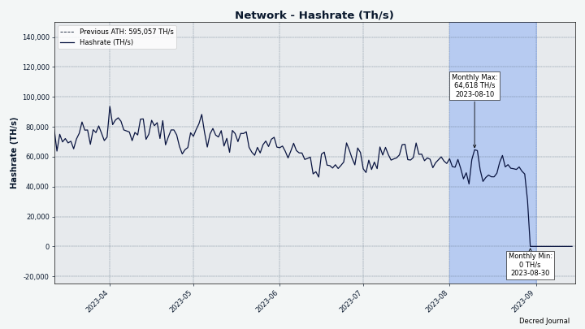

_Image: Decred hashrate_

Distribution of 54 PH/s hashrate [reported](https://miningpoolstats.stream/decred) by the pools on Aug 29 (last valid data from the pools): Poolin 46%, F2Pool 44%, BTC.com 7%, AntPool 3%.

Distribution of 1,000 blocks actually [mined](https://miningpoolstats.stream/decred) by Aug 29: Poolin 44%, F2Pool 40%, BTC.com 6%, AntPool 3%, unknown 7%.

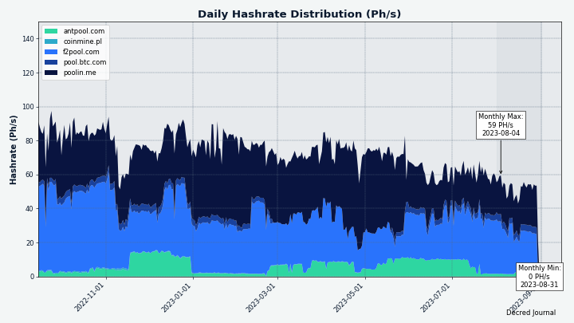

_Image: Historical pool hashrate distribution_

**Staking**: [Ticket price](https://dcrdata.decred.org/charts?chart=ticket-price&axis=time&visibility=true-true&mode=stepped) varied between 236-244 DCR.

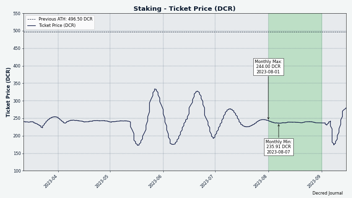

_Image: Ticket price has been unusually stable in August_

The [locked amount](https://dcrdata.decred.org/charts?chart=ticket-pool-value&scale=linear&bin=day&axis=time) was 9.76-9.81 million DCR, meaning that 63.2-63.7% of the circulating supply [participated](https://dcrdata.decred.org/charts?chart=stake-participation&scale=linear&bin=day&axis=time) in proof of stake.

**VSP**: The [14 listed VSPs](https://decred.org/vsp/) collectively managed ~5,900 (-250) live tickets, which was 14.5% of the ticket pool (-0.6%) as of Sep 1.

The biggest gainers of August are [dcr.farm](https://vsp.dcr.farm) (+220 tickets or +193%) and [bass.cf](https://vspd.bass.cf/) (+183 tickets or +25%).

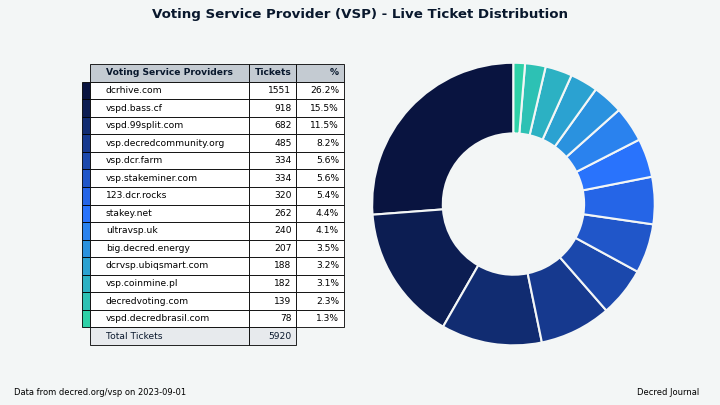

_Image: Distribution of tickets managed by VSPs_

**Nodes**: [Decred Mapper](https://nodes.jholdstock.uk/user_agents) observed between 157 and 167 dcrd nodes throughout the month. Versions of 157 nodes seen on Sep 1: v1.8.0 - 88%, v1.7.x - 5%, v1.8.0 dev builds - 2%, v1.9.0 dev builds - 1.3%, other - 4%.

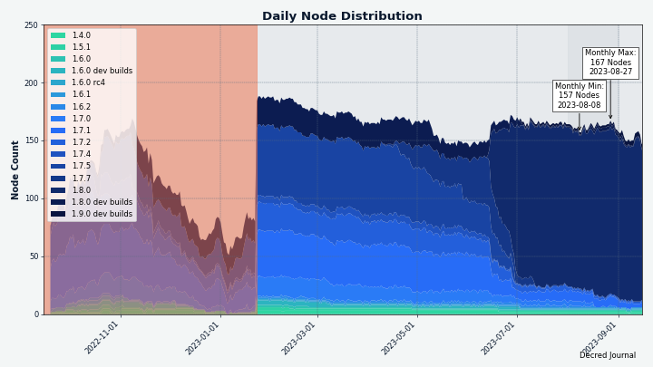

_Image: The majority of nodes are running dcrd v1.8.0. The red area before Jan 2023 indicates incomplete data we had at that time._

The share of [mixed coins](https://dcrdata.decred.org/charts?chart=coin-supply&zoom=jz3q237o-la8vk000&scale=linear&bin=day&axis=time&visibility=true-true-true) varied between 62.45-62.50%. Daily [mixed volume](https://dcrdata.decred.org/charts?chart=privacy-participation&bin=day&axis=time) varied between 0-497K DCR. The low of 0 is due to no blocks being mined in the last 2 days of the month.

Decred's [Lightning Network](https://ln-map.jholdstock.uk/) explorer has seen 213 nodes (-6), 431 channels (-14) with a total capacity of 186 DCR (-3), as of Sep 1. These stats are different for each node. For example, @karamble's node reported 217 nodes (-3), 453 channels (-11) and 192 DCR (+1) capacity on same day Sep 1.

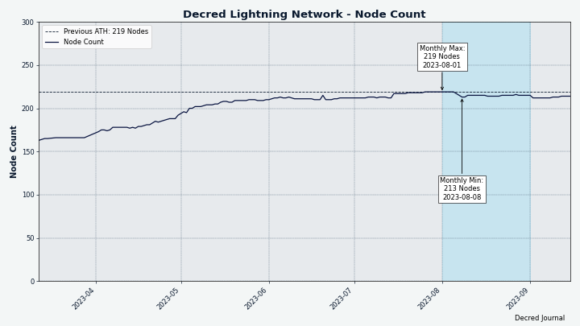

_Image: Decred's Lightning Network node count has stabilized_

## Ecosystem

Vendor readiness for Decred's August 29 hardfork:

- Binance announced on [Aug 25](https://www.binance.com/en/support/announcement/binance-will-support-the-decred-dcr-and-multiversx-egld-network-upgrades-hard-forks-969d5dee8218430aa94310e6820d41eb) that deposits and withdrawals will be suspended until the chain stabilizes after the fork, while trading will not be affected.

- Poloniex made an announcement on [Aug 25](https://support.poloniex.com/hc/en-us/articles/17020071785111) which is very similar to Binance's. It was also posted on their [Telegram](https://t.me/PoloniexAnnouncements/2453).

- The only communication from Bittrex we could find was a generic ["stay tuned"](https://twitter.com/BittrexGlobal/status/1694979576512872708)-like response on Twitter. Bittrex Global's support sites has no mentions of ["Decred"](https://bittrexglobal.zendesk.com/hc/en-us/search?utf8=%E2%9C%93&query=Decred) and only 2 old pages for ["DCR"](https://bittrexglobal.zendesk.com/hc/en-us/search?utf8=%E2%9C%93&query=DCR) search queries.

- F2Pool announced on [Aug 25](https://f2pool.zendesk.com/hc/en-us/articles/22224378432665-Closing-DCR-mining-pool) ([mirror](https://f2pool.io/mining/updates/#20230825)) that they will terminate DCR mining services on the day of the network upgrade. DCR payouts will be completed during the week following the network upgrade. Users can fetch their mining reward history until 2023-09-29.

- Poolin announced the closure of DCR mining pool on [Aug 28](https://help.poolin.me/hc/en-us/articles/22324428533273-Announcement-on-Closing-DCR-Mining-Pool) and kindly [reposted](https://matrix.to/#/!lDZCzVQjFoJsXMPkvr:decred.org/$_acFN1O8kvkZHBVl7OxecDrFewDkma_7omNGOJrBUKE) it in [Decred's Telegram](https://t.me/Decred) chat. The notice warned pool users to configure or shut down their miners because earnings will be greatly reduced after the fork, and called to withdraw DCR from the pool ASAP. An unusual detail here is, unlike the other vendors, Poolin has totally missed the *change of the mining algorithm* to BLAKE3, and planned to run the pool for 1-2 days *after* the fork "so that you will have more time to configure your miner(s)".

- This list only covers updates that have surfaced in Decred chats. If you know more news don't hesitate to share in #ecosystem!

Communication systems:

- stakey.net has [launched](https://matrix.to/#/!ggjLwhBHTjsMROezFf:decred.org/$FhjfyYqxHoPF3m6lMkWhk6Pf3txJpA3facOHWOLjRMI) a Nostr relay at `wss://nostr.stakey.net` and a web client at [citadel.stakey.net](https://citadel.stakey.net/), powered by [snort](https://github.com/v0l/snort). Nostr web client replaces the Mastodon server which was hosted on the same domain previously. Mastodon was used for [stakey.net](https://stakey.net/)'s announcements. It was also open for Decred community members to register and post but has seen little use, and was eventually [shut down](https://matrix.to/#/!ggjLwhBHTjsMROezFf:decred.org/$K3iSve6SAtBeCK2sBy1abK3ImA0FgbjzuC04UmXriis) in favor of Nostr. Nostr users can follow [stakeynet](https://citadel.stakey.net/p/npub1feh69xgmqfmxf5rjf44x6wfyntuz3mzlxcrymucxa0k2af5uzysqmlgx6j) for service updates about the VSP.

Other news:

- Two Decred community members have requested Kraken to list DCR via their [listing form](https://matrix.to/#/!lDZCzVQjFoJsXMPkvr:decred.org/$xZe0qWBllVIePmjOPqvNKyuEYda7EvrK9kulXUX-268) and [Twitter](https://twitter.com/longtermdaily/status/1688517496628711424). This has been done many times in the past, the chances are low but doesn't hurt to keep trying. Additionally, multiple #trading members have [rated DCR](https://matrix.to/#/!lDZCzVQjFoJsXMPkvr:decred.org/$CtHJaU81BKb_Cvi_zWMuzWxGty21CU2XaDy8gUXLWSY) in the Coinbase app, hoping that more searches and ratings will make a difference.

Join our [#ecosystem](https://chat.decred.org/#/room/#ecosystem:decred.org) chat to get more news about Decred services.

Warning: the authors of the Decred Journal have no idea about the trustworthiness of any of the services above. Please do your own research before trusting your personal information or assets to any entity.

## Outreach

### Monde PR

Monde PR's achievements in August:

- Pitched one news update to target crypto publications
- Pitched four story ideas to target crypto publications

Secured the following media placements:

- An article in [BeInCrypto](https://beincrypto.com/blockchain-reform-democracy-decred-co-founder/) on how blockchain can expose fake news and help improve democracies. The piece looks at how Decred has been used in Brazil's elections and talks about the role social media can play, featuring details about Bison Relay, with quotes from @jy-p. The article was syndicated to eight publications including [Bitcoin Linux](https://www.bitcoinlinux.com/2023/08/10/blockchain-can-expose-fake-news-and-help-improve-democracies-says-decreds-co-founder/) and [Trading View](https://www.tradingview.com/news/beincrypto:d5091a62a094b:0-blockchain-can-expose-fake-news-and-help-improve-democracies-says-decred-s-co-founder/).
- The article was also posted in [Spanish](https://es.beincrypto.com/blockchain-puede-exponer-fake-news-mejorar-democracias-reporte/) version of BeInCrypto, which was syndicated to [Cryptocity.press](https://cryptocity.press/noticias/blockchain-puede-exponer-fake-news-y-mejorar-las-democracias-segun-reporte).
- An article in [ZyCrypto](https://zycrypto.com/3ac-founders-slammed-with-2-6-million-fine-by-dubais-regulator-over-new-exchange/) featuring commentary from @jz on the fall of 3AC. The article was syndicated to three publications including [Bitcoin Crypto](https://bitcoin-crypto.nl/zycrypto-com-3ac-founders-slammed-with-2-6-million-fine-by-dubais-regulator-over-new-exchange/).
- An article in [Cryptonews.com](https://cryptonews.com/news/decred-launches-bison-relay-v018-revolutionizing-e-commerce-with-decentralized-shopify.htm) about the Bison Relay v0.1.8 release, including details about the new features, Simplestore infrastructure, and quotes from @jy-p. The article was syndicated to three publications including [Globe Echo World News](https://globeecho.com/business/crypto/decred-launches-bison-relay-v0-1-8-revolutionizing-e-commerce-with-decentralized-shopify/).
- An paragraph in [CoinDesk's "Protocol Village"](https://www.coindesk.com/tech/2023/08/28/protocol-latest-tech-news-crypto-blockchain/) news roundup about the Bison Relay release, with links back to the Decred website and GitHub.
- An article in [The Currency Analytics](https://thecurrencyanalytics.com/crypto-exchanges/revolutionizing-online-shopping-bison-relay-unveils-latest-upgrade-paving-the-way-for-decentralized-e-commerce-67167.php) about the Bison Relay release, including details about the new features and how the upgrade is "Paving the Way for Decentralized E-commerce".

In a discussion about recent marketing proposals @l1ndseymm commented on the differences between marketing and PR:

> It is beneficial to have both a PR and marketing strategy, as they can complement each other and amplify results overall. And marketing is by nature more expensive than PR. Businesses tend to spend about 10% of their revenue on marketing.
> 
> I gave feedback on the Cointelegraph proposal that the ideal situation would be to have a marketing person who has managed ad spend before. There are so many options out there - we could sponsor/advertise on newsletters, podcasts, billboards, social media, in addition to paid content opportunities like these. This person could suggest a budget and then advise on which platforms and mediums will garner the best results based on our audience/goals. They could then track results and tweak the strategy as we go. They often have access to special rates and know what's fair in terms of pricing. \[[@l1ndseymm](https://matrix.to/#/!qYpAAClAYrHaUIGkLs:decred.org/$nXniE7jvWEt3H1J6UrEh6oejVdz6JeWifATWj12xk0c)\]

### Decred Vanguard

We've been testing several engagement tactics in a small scale, like the recent [DCR giveaway](https://twitter.com/exitusdcr/status/1685994386339897344) ($100 prize pool, 15 participants, 2 winners) which required entrants to prove a real wallet install.

Other than that we've slowed down as we try to think about the best ways to navigate through a bear market where interest and volume are considerably lower than normal. While the Vanguard marketing method focuses around trying to talk about Decred *a lot*, at this time, we'd prefer to be realistic and remain grounded as we configure new strategies.

[Decred Vanguard](https://proposals.decred.org/record/0a1b782) is always looking for new, eager members to help us promote Decred. The benefits are straightforward - $100 a month in Decred for participation and your Twitter Blue account paid for! Organization is done in a Discord server. If you have any unique ideas for promoting Decred, like making memes, art, or just want to be a contributing member, please contact [@Exitus](https://twitter.com/exitusdcr) or [@Tivra](https://twitter.com/WasPraxis).

### Cypherpunk Times

Engagement stats for August:

- Total number of articles on CT: 517
- Newsletter subscribers: 105
- New CT posts and newsletters sent: 20
- Active social media campaigns: 80
- Completed social media campaigns: 9
- Social media posts: 192
- Social media followers across all platforms and accounts: 1,575
- [@decredsociety](https://twitter.com/decredsociety) stats: followers - 967, tweet impressions - 12.8K, likes - 311, retweets - 79
- [@decredmagazine](https://twitter.com/decredmagazine) stats: followers - 481, tweet impressions - 15.4K, likes - 450, retweets - 144
- [@cypherpunktimes](https://twitter.com/cypherpunktimes) stats: followers - 127, tweet impressions - 31.0K, likes - 550, retweets - 170

### Other

- @Tivra has connected Decred with Cake Wallet, which resulted in a collaborative [video livestream](https://www.youtube.com/watch?v=0KKsD4ZhZn0) with [Vik Sharma](https://twitter.com/vikrantnyc) and [Justin Ehrenhofer](https://twitter.com/JEhrenhofer), and a [proposal](https://proposals.decred.org/record/2f25f2d) to fund the integration of DCR into Cake Wallet. Cake looks like a promising partner for publishing their [source code](https://github.com/cake-tech/cake_wallet), building [non-custodial finance](https://cakewallet.com/), building bridges to fiat, promoting privacy and [empowering individuals](https://cakelabs.com/#principles).
- @Dominic took part in a triathlon event wearing a [stylish Decred outfit](https://twitter.com/wanbihou/status/1695772020687229092).
- Totti from BTC-ECHO has posted [fourth](https://proposals.decred.org/record/49e373b/comments/31) and [fifth](https://proposals.decred.org/record/49e373b/comments/32) on Politeia. All feedback has been incorporated and the first [Decred article](https://www.btc-echo.de/news/decred-eine-der-aeltesten-kryptos-ueberzeugt-mit-prinzipien-sponsored-166076/) has been published on [Aug 17](https://twitter.com/btcecho/status/1692192057136119841). A week later it has been "republished", as planned in the fifth update.

_Image: "When I compete in a triathlon, I become a billboard for #decred" \[[@wanbihou](https://twitter.com/wanbihou/status/1695772020687229092)\]_

## Media

**Selected articles:**

- [CBDC : Exploring the Global Impact on Traditional Banking](https://www.cypherpunktimes.com/central-bank-digital-currencies-cbdcs-exploring-the-global-impact-on-traditional-banking/) by @tallamericano
- [Blockchain Can Expose Fake News and Help Improve Democracies, Says Decred's Co-Founder](https://beincrypto.com/blockchain-reform-democracy-decred-co-founder/) by Josh Adams for BeInCrypto
- [DeFi, Decred, and the Potential to Disrupt Traditional Banking](https://www.cypherpunktimes.com/defi-decred-and-the-potential-to-disrupt-traditional-banking/) by @tallamericano
- [Cryptopower: Golang Native Desktop & Mobile Wallet](https://www.cypherpunktimes.com/cryptopower-golang-native-desktop-mobile-wallet/) by @phoenixgreen
- [Decred Unveils Bison Relay v0.1.8 Ushering in a New Era of Decentralized E-commerce and Unrivaled User Sovereignty](https://decred.org/news/2023-08-29_decred_unveils_bison_relay_0.1.8/) - press release at decred.org
- [Decred Launches Bison Relay v0.1.8: Revolutionizing E-Commerce with Decentralized 'Shopify'](https://cryptonews.com/news/decred-launches-bison-relay-v018-revolutionizing-e-commerce-with-decentralized-shopify.htm) by Hassan Shittu for Crypto News
- [Tutorial: How to Solo Mine Decred's Upcoming Blake3 Algorithm](https://www.cypherpunktimes.com/tutorial-solo-mine-decreds-blake3/) by @karamble
- [Cypherpunk talk with Ernesto from the Dash community!](https://www.cypherpunktimes.com/cypherpunk-talk-with-ernesto-from-the-dash-community/) by @Joao

*NOTE: Here in Decred Journal we only list selected articles about Decred but Cypherpunk Times has more quality content about other coins, finance, and social media. [Check it out!](https://www.cypherpunktimes.com/page/2/)*

**Videos:**

- [News Update - Voting Complete! Decred Switching to GPU Mining. Bison Relay Stores + More](https://www.youtube.com/watch?v=P7SC7Ug_qZY) by @Exitus - also as a [podcast](https://podcasters.spotify.com/pod/show/cypherpunktimes/episodes/News-Update---Voting-Complete--Decred-Switching-to-GPU-Mining--Bison-Relay-Stores--More-e27o05t)
- [How to buy your first Decred (DCR)? - Common Questions](https://www.youtube.com/watch?v=tBHqUuLfIIw) by @phoenixgreen - also as a [podcast](https://podcasters.spotify.com/pod/show/cypherpunktimes/episodes/QA-Sessions---How-to-buy-your-first-Decred-DCR-e27veep) and a [text post](https://www.cypherpunktimes.com/how-to-buy-your-first-decred-dcr/)
- [How to Solo Mine Decred's Upcoming Blake3 Algorithm](https://www.youtube.com/watch?v=pKFEV2AW-fk) by @phoenixgreen
- [What are simple swaps? - Decred Q&A Sessions](https://www.youtube.com/watch?v=QJEGB9TInuE) by @phoenixgreen - also as a [podcast](https://podcasters.spotify.com/pod/show/cypherpunktimes/episodes/QA-Sessions---What-are-simple-swaps-e289kk8) and a [text post](https://www.cypherpunktimes.com/what-are-simple-swaps/)
- [Voting on Treasury Spending in Decrediton](https://www.youtube.com/watch?v=kdJMDSM01_0) by @phoenixgreen

Live streams:

- [Crypto Integrations: Cake Wallet](https://www.youtube.com/watch?v=0KKsD4ZhZn0) by @phoenixgreen and @Tivra featuring [Vik Sharma](https://twitter.com/vikrantnyc) and [Justin Ehrenhofer](https://twitter.com/JEhrenhofer) - also as a [podcast](https://podcasters.spotify.com/pod/show/cypherpunktimes/episodes/Crypto-Integrations-Cake-Wallet-e27m0td)
- [Decred v1.8.0 - "The Forkening" feat. Lead Dev Dave Collins](https://www.youtube.com/watch?v=TJnP_t4dEq8) by @phoenixgreen and @Exitus featuring @davecgh - also as a [podcast](https://podcasters.spotify.com/pod/show/cypherpunktimes/episodes/Decred-1-8-0---The-Forkening-feat--Dave-Collins-e27sbo9)

**Translations:**

- [Tutorial: How to Solo Mine Decred's Upcoming Blake3 Algorithm](https://www.cypherpunktimes.com/tutorial-solo-mine-decreds-blake3/) - in [Chinese](https://github.com/DominicTing/articles/blob/master/Tutorial:%20How%20to%20Solo%20Mine%20Decred's%20Upcoming%20Blake3%20Algorithm.md) by @Dominic
- Decred Journal April-July got a total of 4 new [translations](https://xaur.github.io/decred-news/) to Arabic (@arij, @abdulrahman4), Chinese (@Dominic) and Polish (@kozel). Thank you folks!

**Non-English content:**

- [Decred: one of the oldest cryptos convinces with principles](https://www.btc-echo.de/news/decred-eine-der-aeltesten-kryptowaehrungen-ueberzeugt-mit-prinzipien-sponsored-166076/) by BTC-ECHO (German)
- [Blockchain Can Expose Fake News and Help Improve Democracies, Says Decred's Co-Founder](https://es.beincrypto.com/blockchain-puede-exponer-fake-news-mejorar-democracias-reporte/) by Josh Adams for BeInCrypto (Spanish translation)

**Art and fun:**

- [Visions of a decentralised future](https://www.cypherpunktimes.com/visions-of-a-decentralised-future/) by @OfficialCryptos
- Unofficial Decred ["merch"](https://crosby.shop/) has been [discovered](https://matrix.to/#/!rLQWsgjPJFAClvskmU:decred.org/$kV-PGswIf-YyrTaiZTiOhLE5D6EZT5WdnRzJC6sgwKQ)
- [Hey! Do you know wen next block?](https://matrix.to/#/!lDZCzVQjFoJsXMPkvr:decred.org/$GqIUkOZ8siT5gWrNJSwMtO99x1s6YMpcMalY46jRh44) by @Void

_Image: "How do you identify?" - "I'm so upper-right quadrant that it's off your chart" by [@Tivra](https://twitter.com/WasPraxis/status/1676890319902633985)_

_Image: "Was looking to re-up my supplement stack and came across this. Now it's a must buy, don't you think?" by [@kozel](https://matrix.to/#/!lDZCzVQjFoJsXMPkvr:decred.org/$Svd-YbzCDskjqeiql3tKQB9XSoINI-JnSKt_-fjeq-Q)_

_Image: Proof-of-Shoe_

## Markets

In August DCR was trading between USDT 12.42-15.73 and BTC 0.00040-0.00058. The average daily rate was $13.89.

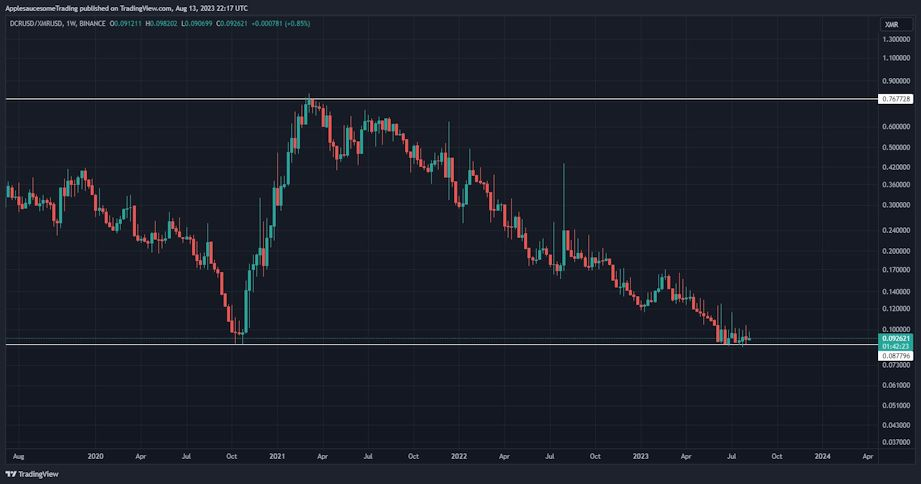

_Image: DCR is at a "long time" low vs XMR_

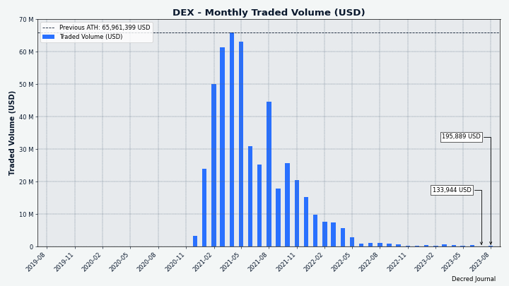

_Image: DCRDEX monthly volume in USD_

## Relevant External

Coinbase's new Ethereum layer 2 network using the Optimism stack [launched](https://www.coindesk.com/tech/2023/08/09/coinbase-officially-launches-base-blockchain-milestone-for-a-public-company/), it is called Base. This is the first time a publicly traded company has launched its own blockchain, and Coinbase hopes to earn revenue from transaction fees and dapps in the future.

An early success/hype story for Base came in the form of [friend.tech](https://www.coindesk.com/web3/2023/08/11/is-friendtech-a-friend-or-foe-a-dive-into-the-new-social-app-driving-millions-in-trading-volume/), a social app where users can buy "shares" (soon [renamed](https://decrypt.co/153287/friend-tech-shares-renamed-keys-securities) to "keys") in other users, and owning such keys allows one to send messages to them. When the hype kicked in friend.tech quickly hit 126K transactions and 4,400 ETH volume, more than the entire NFT ecosystem for that period. friend.tech is a rebranding of "stealcam", and from someone best known for "Tweet DAO eggs", NFTs that allowed holders to tweet from a certain account, until the account was suspended and the website taken down. By the end of the month activity was already [substantially down](https://cointelegraph.com/news/friendtech-pronounced-dead-inflows-activity-declines) on all metrics, with transactions and fee revenue dropping by 80% from the initial peak.

In a bid to capitalize on the hype around friends.tech, a new meme token was launched on Ethereum - FrensTech. It was rugged by its founder when the price started to explode, AzFlin [withdrew](https://www.theblock.co/post/244591/uniswap-frenstech) all his tokens from the liquidity pool and cashed them in, cratering the price. After a Twitter sleuth [exposed](https://twitter.com/UniswapVillain/status/1690216623041372161) the identity of the rug-puller as a Uniswap employee, he got [fired](https://twitter.com/haydenzadams/status/1690395983773880321).

The Horizen blockchain [announced](https://www.bitcoininsider.org/article/218557/zen-will-no-longer-be-privacy-coin-after-horizen-update) the intention to remove the on-chain "shielded pools" privacy feature of ZEN at the consensus level via hard fork. The reasoning for the decision is to avoid regulatory backlash against "privacy coins" by no longer qualifying for that category. Horizen's privacy pools were based on Zcash's "Sprout" technology, which Zcash has long since replaced, and so this is being taken as an opportunity to replace outdated tech with something based on sidechains or another method that will allow ZEN to get back to being listed on exchanges. The change is included in a new Horizen update which should activate in September for the mainchain.

Gitcoin [announced](https://www.gitcoin.co/blog/gitcoin-shell-collaboration) a controversial partner for the latest round of quadratic matched funding, the Shell (oil) company sponsoring a climate solutions matching pool. There was a significant [backlash](https://decrypt.co/152662/greenwashing-gitcoin-shell-partnership-draws-fire-crypto-pundits) from Gitcoin supporters on Twitter, who were disappointed to see the brand tarnished (in their view) by the association with Shell, who were exploiting the public relationship with Gitcoin as cost effective greenwashing. The backlash led someone who was involved in the decision making to post an apologetic [tweet](https://twitter.com/kbw/status/1691797028987162874) explaining how the decision had been arrived at and acknowledging the problems with such a relationship. One of the main criticisms, [from](https://twitter.com/owocki/status/1691488210315288576) founder Owocki, was that not only was the brand being sold for greenwashing, the amount Shell were paying in as grant funding was just $500K, so they were getting a very good deal for such a large and well resourced corporation. Gitcoin approved this partnership because the relevant council members had faith in the quadratic matching concept to steer the funds to worthy recipients regardless of where the money was coming from, in a sense that they were above the suspicion that would commonly surround outcomes from a "climate solutions" call sponsored by one of the big oil companies.

The SEC [lost](https://www.coindesk.com/policy/2023/08/29/sec-must-review-grayscales-etf-bid-appeals-court-rules/) a court decision about the Grayscale ETF currently under review, with the court agreeing with Grayscale's case that it was being treated unfairly because two substantially similar futures funds had been approved. This decision sparked a rally in the BTC market as the prospect of an approved ETF was seen as more likely, but by the time the SEC [announced](https://www.coindesk.com/policy/2023/08/31/after-grayscale-victory-sec-kicks-the-can-on-latest-bitcoin-etf-applications/) it was delaying decisions on all Bitcoin ETFs the retrace was complete.

Republicans on the SEC oversight committee in US Congress have [demanded](https://www.coindesk.com/policy/2023/08/15/republican-lawmakers-demand-gensler-tell-them-how-prometheum-got-sec-approval/) that Gary Gensler explain what is going on with Prometheum getting approval as a special crypto broker suddenly when all of the more well known crypto exchanges that actually have working products have found this to be a long and painful process that goes nowhere. 23 members of the committee signed a [letter](https://financialservices.house.gov/uploadedfiles/2023-08-09_fsc_gop_letter_to_sec_re_prometheum.pdf) outlining their suspicion, which is that Prometheum's sudden appearance in Washington and unheralded approval of their license to operate came at a very convenient time for Gensler - because the total lack of approved crypto broker dealers to that point was weakening his argument that the regulations are fine the way they are written (and he is enforcing them). The letter also references Prometheum's connections to Wanxiang and the CCP as cause for concern.

The SEC went after its first NFT project for securities [violations](https://protos.com/sec-says-nfts-are-securities-in-landmark-case/), the Impact Theory project had raised around $30 million from the sale of NFTs which was described as funding the company's operations. Impact Theory made the SEC's job easier by issuing statements saying they "will make sure that we do something that, by any reasonable standard, people got a crushing, hilarious amount of value" and describing the tokens as "the mechanism by which communities will be able to capture economic value from the growth of the company they support". The company agreed to buy back and destroy the tokens, eliminate the royalty sharing feature, and find a way to return the rest of the money they raised through the sale. There is speculation that this could be the first of many enforcement actions targeting NFTs, as "funding a roadmap" was a common purpose given for the minting events.

Binance's SEC woes have been added to by a [sealed](https://www.coindesk.com/policy/2023/08/29/secs-secret-binance-court-filing-has-observers-bracing-for-bad-news/) court filing, where the contents of 35 exhibits are not being publicly disclosed for some unknown reason, possibly having to do with a concurrent criminal investigation by DoJ, but in any case highly unusual.

Coingecko has added a category of "tokens the SEC considers to be [securities](https://www.coingecko.com/en/categories/alleged-sec-securities)", which is a handy way to list all of the various altcoins that have or had enforcement actions against them by the SEC.

The US Treasury Department has [released](https://home.treasury.gov/news/press-releases/jy1705) proposed rules which would introduce a new tax reporting obligation for crypto asset brokers, and would [define](https://twitter.com/lex_node/status/1695061496177258731) these very broadly in a way which includes decentralized exchanges and operators of websites that communicate with wallets. A new form would be created (1099-DA) which brokers must complete and send to both the IRS and the individual users, calculating how much they likely owe in taxes. The rule is planned to be effective for brokers in 2025 for the 2026 tax filing season.

In the US the Inland Revenue Service (IRS) has [released](https://cointelegraph.com/news/crypto-staking-rewards-taxable-gross-income-once-received-irs) a clarification on how staking rewards (from PoS blockchains) are to be taxed. The recipient of staking rewards should declare them as income at the point when they gain "dominion" over the tokens (can sell them), based on the fair market exchange value of the tokens at that time.

The Drug Enforcement Agency has fallen victim to an address dusting attack and [sent](https://www.forbes.com/sites/thomasbrewster/2023/08/24/dea-accidentally-sends-50000-in-drug-proceeds-to-crypto-scammer) $50,000 of seized crypto to a scammer by mistake. DEA staff seized some USDT by transferring to their own Trezor hardware wallet, and in preparation to transfer this to the US Marshals they sent a small test transaction, a scammer spotted this transaction and then sent an airdrop to the DEA account so that it looked like the test transaction was successful, but swapping in their own very similar address. When the DEA staff came to make the real transfer they copied the (scammer's) address from a block explorer erroneously, possibly checked that the first and last few characters matched what they expected as the Marshals' address, and hit send.

An early victim of a Bitcoin "clipboard hijack" hack through the Electrum Atom wallet in 2018, Andrew Schrober, began an investigation and has been pursuing the alleged attackers in the courts since 2021. The hacked software would monitor the user's clipboard and when it detected something like a Bitcoin address it would generate a replacement address which looked similar but actually was controlled by the attacker's wallet, and then the user would mistakenly send their BTC to the substituted address. Some of the filings in the case provide a detailed [account](https://medium.com/@nbax/anatomy-of-a-bitcoin-heist-the-electrum-atom-malware-saga-1685abf7c903) of how the BTC was moved and sent to Bitfinex, where they connected a used IP address to a residential UK address where one of their suspects lived. The account also details Monero transactions which are thought to be linked because of specific amounts going in/out with implausible decoy ring members, and the use of vanity addresses for ShapeShift transactions.

Lastpass has been [identified](https://twitter.com/tayvano_/status/1696222671699329271) as the most likely compromise vector for the mysterious crypto thefts that have been [documented](https://twitter.com/tayvano_/status/1648187031468781568) since April by community developer/sleuths but apparently ongoing since Dec 2022. The thefts are distinctive because they happen in certain time windows and have commonalities like exchanging tokens for ETH within the wallet before sending out, or sometimes sending tokens to another victim's address until the ETH amount is large enough that they transfer to their own address. These funds are moved to centralized swapping services where they are exchanged to BTC, victims are often losing other assets like LTC, XRP, XMR, and they all go to the same places to be changed to BTC which then gets mixed. @tayvano\_ on Twitter now seems convinced that the common detail reported by almost all victims is that they stored their private key on Lastpass, often for many years under the protection of a secure encryption password. Lastpass was [hacked](https://twitter.com/tayvano_/status/1696222673632977054) in mid-2022 but the scope is unclear and the hackers should not have been able to access data that users had stored with strong encryption passwords, but that is seemingly what is occurring to result in these thefts from many "Crypto OGs".

CoinDesk has [retracted](https://beincrypto.com/coindesk-poor-journalism-retracts-articles/) two articles, a rare occurrence [according](https://www.coindesk.com/consensus-magazine/2023/07/24/chainalysis-investigations-lead-is-unaware-of-scientific-evidence-the-surveillance-software-works/) to them. The [first](https://web.archive.org/web/20230728103222/https://www.coindesk.com/consensus-magazine/2023/07/24/chainalysis-investigations-lead-is-unaware-of-scientific-evidence-the-surveillance-software-works/) concerned Chainalysis, reporting that the head of investigations was "unaware" of any scientific evidence for the accuracy of its Reactor software, while being questioned as part of a court hearing which seeks to use the outputs of this tool as evidence. The article was [retracted](https://www.coindesk.com/consensus-magazine/2023/07/24/chainalysis-investigations-lead-is-unaware-of-scientific-evidence-the-surveillance-software-works/) in July but the author was not informed and did not discover this until August, when they [complained](https://twitter.com/L0laL33tz/status/1696086324254494914) about CoinDesk's ethics and suggested that the retraction was due to CoinDesk's parent company DCG owning a stake in Chainalysis. The second [retracted](https://www.coindesk.com/consensus-magazine/2023/08/25/justin-sun-the-next-do-kwon-or-sbf/) article concerned Justin Sun, comparing him to SBF and Do Kwon and then [speculating](https://web.archive.org/web/20230826054525/https://www.coindesk.com/consensus-magazine/2023/08/25/justin-sun-the-next-do-kwon-or-sbf/) about the scale of collateral damage if Sun's empire collapses. CoinDesk used the same rationale to explain both retractions, that they should not have been published because they are written by pseudonymous authors and attack specific individuals in a defamatory way.

Tether has [announced](https://tether.to/en/tether-makes-strategic-transition-to-meet-community-demands-and-foster-innovation/) that it will stop supporting USDT on the Bitcoin Omni layer, the first transport layer used by Tether since 2014 - support will also be cut for Kusama and Bitcoin Cash networks. While USDT started on Omni much of the volume has migrated to smart contract chains, of $82 billion USDT outstanding only $240 million are circulating on Omni, and considerably less on the other two networks to lose support. Redemptions will continue to be available for 12 months from Aug 17.

That's all for August. Suggest news for the next issue in our [#journal](https://chat.decred.org/#/room/#journal:decred.org) chat room.

## About

This is issue 62 of Decred Journal. Index of all issues, mirrors, and translations is available [here](https://xaur.github.io/decred-news/).

Most information from third parties is relayed directly from the source after a minimal sanity check. The authors of the Decred Journal cannot verify all claims. Please beware of scams and do your own research.

Credits (alphabetical order):

- writing, editing, publishing: bee, bochinchero, Exitus, jz, karamble, kozel, l1ndseymm, phoenixgreen, richardred, zippycorners
- reviews and feedback: davecgh, jholdstock
- title image: Exitus
- funding: Decred stakeholders
