# {DRAFT} Decred Journal – September 2023

_Image: Circuit by @Exitus_

Highlights of September:

- Decred network has switched to BLAKE3 proof of work and 89% proof of stake reward, but it took 3 days to start mining new blocks.

- Decred GPU mining support has been added to gominer and BzMiner, leading to an explosion in hashrate.

- Bison Relay v0.1.9 came out with numerous fixes and initial mobile design.

- DCRDEX v0.6.3 has been released with fixes for BTC wallet and bond maintenance. Development of the Polygon integration, trading bots, and other features is marching forward.

Contents:

- [Network Upgrade and Service Outage](#network-upgrade-and-service-outage)
- [Decred GPU Mining Software](#decred-gpu-mining-software)
- [Bison Relay v0.1.9 Release](#bison-relay-v019-release)
- [DCRDEX v0.6.3 Release](#dcrdex-v063-release)
- [Development](#development)
- [People](#people)
- [Governance](#governance)
- [Mining](#mining)
- [Network](#network)
- [Ecosystem](#ecosystem)
- [Outreach](#outreach)
- [Events](#events)
- [Media](#media)
- [Markets](#markets)
- [Relevant External](#relevant-external)

## Network Upgrade and Service Outage

On August 29, consensus changes [Change PoW to BLAKE3 and ASERT](https://github.com/decred/dcps/blob/master/dcp-0011/dcp-0011.mediawiki) and [Change PoW/PoS Subsidy Split To 1/89](https://github.com/decred/dcps/blob/master/dcp-0012/dcp-0012.mediawiki) activated on Decred mainnet at block 794,368. The initial difficulty value was reset to target 1.45 TH/s with the expectation that GPU hashrate would start mining on the fork day. This assumption had basis in history, as at the launch of Decred in February 2016, GPU mining started without any announcement. Also, the upcoming switch to BLAKE3 was publicly known for around 5 months since [April 2023](https://proposals.decred.org/record/a8501bc). GPU mining did not start as expected, however, and the network was left with a difficulty that was extremely high for CPUs. As a result, the chain stopped producing blocks for a couple of days.

Any services depending on the chain getting new blocks got suspended, for example:

- Deposits and withdrawals at centralized exchanges were temporarily disabled
- DCR swaps at DCRDEX could not start or complete
- Timestamping services were suspended
- Politeia could not start or stop proposal voting
- Politeia voting software was not operating normally (casting votes required hacks and tricks)
- LN channels could not be opened or closed
- Bison Relay functionality was restricted (could not deposit or withdraw to/from wallets, could not open/close LN channels)

After 24 hours of no blocks, miners faced an issue where dcrd would refuse to mine on top of old blocks. The workaround for the issue was to set back the system clock and regenerate certificates if necessary.

Block [794,369](https://dcrdata.decred.org/block/655d0c998b6f838a63a69991ebfb8dc776ed0234117c7b6cca407fe15c2cb02c) was eventually mined on September 1st and the chain got moving again. Some dcrd nodes had to be restarted due to hitting a path where they weren't trying to fetch new blocks. After that last issue was resolved, the new ASERT algorithm adjusted the difficulty and restored normal block production speed within hours.

This 2.9 day outage has set a new record, beating the [previous outage](https://forum.decred.org/threads/04-23-17-pow-mining-outage.5287/) in [April 2017](https://twitter.com/decredproject/status/856193098879299584) when it took 9.6 hours to mine [block 127,072](https://dcrdata.decred.org/block/127072).

## Decred GPU Mining Software

GPU mining kicked in one week after the hardfork and quickly displaced CPU mining. Two software options for GPU mining Decred were publicly released in September:

- [gominer](https://github.com/decred/gominer) supports Decred mining on OpenCL and CUDA devices, including AMD and Nvidia GPUs. Binaries are currently not available, but the build and setup process is [well-documented](https://github.com/decred/gominer#readme).

- [BzMiner](https://www.bzminer.com/) supports mining Decred on AMD, Nvidia and Intel GPUs since version 17.0.0. The source code is not public, but BzMiner has a long list of [features](https://github.com/bzminer/bzminer) and can achieve higher hashrates compared to gominer. The binaries are available on [GitHub](https://github.com/bzminer/bzminer/releases) and [bzminer.com](https://www.bzminer.com/).

For any help, join the #pow-mining chat on Matrix or Discord.

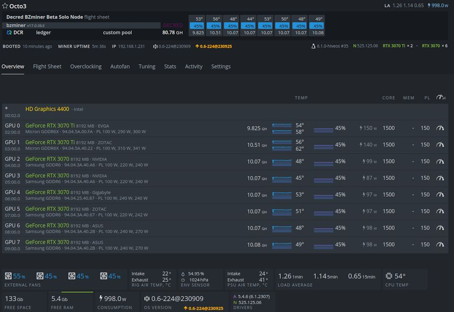

_Image: BzMiner GUI running on HiveOS_

## Bison Relay v0.1.9 Release

This release improves posts UX, key exchange maintenance, and fixes bugs reported in v0.1.8.

Notable changes in both GUI and text apps:

- Automatic handshakes with users idle for 21 days to keep the contacts alive
- Automatic unsubscribing and kicking from group chats of users idle for 60 days
- Exclude list to prevent automatic unsubscriptions for certain users, such as well-known bots

GUI app highlights:

- Improved listing of user's posts
- A button to reset all old key exchanges
- First round of mobile UI design implementation (can be tested by reducing the window width below 500 px)
- Fixed: getting stuck on the setting up flow, opening of URL links, and incorrect visibility of unread indicators

There is a [short video](https://www.youtube.com/watch?v=Wz0Gn7Kdjeo) demonstrating what's new in the GUI app.

Text app highlights:

- Fixed various issues with Simplestore
- Fixed browsing of local pages
- Fixed UI bugs with chat

Full release notes and downloads can be found on the [release page](https://github.com/companyzero/bisonrelay/releases/tag/v0.1.9). It is recommended to verify the files as described in the [README](https://github.com/companyzero/bisonrelay/tree/v0.1.9#verifying-binaries).

_Image: Improved notifications in Bison Relay v0.1.9_

## DCRDEX v0.6.3 Release

This release contains several important fixes and improvements. All users are advised to update. Highlights for the standalone app:

- Trade limits scale with bond level
- Fixed a common error that arose when rescanning the built-in BTC wallet
- Fixed a scenario where bonds could fully expire before being replaced

Read the full release notes [here](https://github.com/decred/dcrdex/releases/tag/v0.6.3).

Note: As of writing, dexc binaries are also available as part of the [core v1.8.1 release](https://github.com/decred/decred-binaries/releases/tag/v1.8.1). These binaries offer a number of advantages: they are signed with Decred Release key, support more operating system and CPU architectures, and are built with a newer and more optimized Go toolchain.

## Development

The work reported below has the "merged to master" status unless noted otherwise. It means that the work is completed, reviewed, and integrated into the source code that advanced users can [build and run](https://medium.com/@artikozel/the-decred-node-back-to-the-source-part-one-27d4576e7e1c), but is not yet available in release binaries for regular users.

### dcrd

_[dcrd](https://github.com/decred/dcrd) is a full node implementation that powers Decred's peer-to-peer network around the world._

Changes backported to the v1.8.1 release:

- Added the new [proof of work hash](https://github.com/decred/dcrd/pull/3192) to the verbose outputs of `getblock` and `getblockheader`.
- Changed the [`getnetworkhashps`](https://github.com/decred/dcrd/pull/3181) to treat `-1` as a default value (120 blocks back). Previous meaning of `-1` "the number of blocks since last difficulty change" no longer makes sense given that the difficulty is now calculated every block as opposed to every 144 blocks with the old difficulty algorithm.

Changes merged in `master` towards future releases:

- Updated Docker image to [Go 1.21.1](https://github.com/decred/dcrd/pull/3183).
- Improved internal [error handling](https://github.com/decred/dcrd/pull/3182) in `rpcserver` to make the code cleaner and harder to misuse.
- Changed [`sampleconfig`](https://github.com/decred/dcrd/pull/3185) package to use Go's embed functionality. It allows to have sample configs as separate files that are easier to work with, while retaining convenient access to their contents from code.
- Added functions to access the [R and S values](https://github.com/decred/dcrd/pull/3188) of signatures in the `secp256k1/ecdsa` package, these values can be useful in some computations.
- Added a couple of [new](https://github.com/decred/dcrd/pull/3190) [tests](https://github.com/decred/dcrd/pull/3191) to push test coverage to 99.6%.

### dcrwallet

_[dcrwallet](https://github.com/decred/dcrwallet) is a wallet server used by command-line and graphical wallet apps._

Changes backported to the v1.8.1 release:

- Updated verbose [`getblock` and `getblockhash`](https://github.com/decred/dcrwallet/pull/2285) responses to include the new proof of work hash.

Changes merged in `master` towards future releases:

- Updated [VSP fee calculation](https://github.com/decred/dcrwallet/pull/2281) for the new block reward split in DCP-12 (proof of stake reward increased from 80% to 89%). This piece of code is only used by vspd servers so this didn't need to be backported.

### Decrediton

_[Decrediton](https://github.com/decred/decrediton) is a full-featured desktop wallet app with integrated voting, StakeShuffle mixing, Lightning Network, DEX trading, and more. It runs with or without a full blockchain (SPV mode)._

All changes below have been included in the v1.8.1 release (published in October).

Progress towards Ledger integration:

- Added [backend functions](https://github.com/decred/decrediton/pull/3869) for interacting with Ledger. This is using [WebUSB](https://github.com/electron/electron/pull/36289) API which allows Electron-based apps to access USB devices.
- Added [Ledger UI](https://github.com/decred/decrediton/pull/3874) for testnet.
- Enabled Ledger on [mainnet](https://github.com/decred/decrediton/pull/3906). This has been tested on Linux, Windows and macOS on Nano X and Nano S Plus devices.
- Rolled back [Electron](https://github.com/decred/decrediton/pull/3912) to v21.2.3 because the newer version caused issues with the DEX window. This will need to be [investigated and fixed](https://github.com/decred/decrediton/issues/3921) in a future release, because [Electron v23](https://releases.electronjs.org/release/v23.0.0) is needed for WebUSB support, which powers Ledger integration in Decrediton.

Other:

- Updated the [DCRDEX module](https://github.com/decred/decrediton/pull/3905) to v0.6.3 and enabled its new "extension mode" to protect Decrediton's wallet from being misconfigured in the DEX window.
- Updated the [Chinese translation](https://github.com/decred/decrediton/pull/3893).
- ~8 changes updating web dependencies and fixing small bugs.

### vspd

_[vspd](https://github.com/decred/vspd) is server software used by Voting Service Providers. A VSP votes on behalf of its users 24/7 and cannot steal funds._

September's vspd work has made incremental quality of life improvements for users, admins and developers.

All changes listed below have been included in [v1.3.0](https://github.com/decred/vspd/releases/tag/release-v1.3.0) and [v1.3.1](https://github.com/decred/vspd/releases/tag/release-v1.3.1) releases, which came out in September.

User-facing changes:

- Added separate expired and missed ticket counts on the VSP [home page](https://github.com/decred/vspd/pull/417) and in the [`/vspinfo` response](https://github.com/decred/vspd/pull/421). The "revoked tickets" reported previously was a sum of expired and missed tickets; having missed tickets listed separately is a better metric for evaluating VSP's reliability, because expired tickets are not the VSP's fault.
- Updated [VSP fee calculations](https://github.com/decred/vspd/pull/435) to consider the new block reward split specified in DCP-12.
- A new yellow top banner will appear if the VSP is running on [testnet or simnet](https://github.com/decred/vspd/pull/417). [Debug banner](https://github.com/decred/vspd/pull/443) has been changed to the color red, because debug mode should not be used in production.

Changes for VSP admins:

- Added a new admin page that lists all tickets which were registered with the VSP, but [missed their votes](https://github.com/decred/vspd/pull/451).
- Optimized [discovery of voted and revoked tickets](https://github.com/decred/vspd/pull/416) to run twice as fast. This is achieved by using a different [matching function](https://github.com/decred/dcrd/blob/dc41075594cfdef63e8a64340b4fc5651a56a604/gcs/gcs.go#L304) from dcrd's `gcs` package that is [better optimized](https://github.com/decred/vspd/pull/413#issuecomment-1694228745) for this job.
- Improved responsiveness of handling [shutdown requests](https://github.com/decred/vspd/pull/426) and removed some duplicate boilerplate code.
- Improved compatibility of handling [shutdown signals](https://github.com/decred/vspd/pull/438) on various OSes.
- Changed the web API to return [explicit errors](https://github.com/decred/vspd/pull/440) if the web API cache is not ready. This will make the admin immediately aware of possible issues. Previously, if the cache was not ready, web pages were rendered with no data and no indication of anything being wrong.
- Ensure [startup/shutdown messages](https://github.com/decred/vspd/pull/427) are always the first/last thing to be logged.
- Tweaked [logging](https://github.com/decred/vspd/pull/445) to reduce unnecessary spam.
- Added release notes for [v1.3.0](https://github.com/decred/vspd/pull/447) and [v1.3.1](https://github.com/decred/vspd/pull/452).

Internal and developer changes:

- Restored the ability to run [vspd on simnet](https://github.com/decred/vspd/pull/419), which is needed by DCRDEX to test new staking features.
- Small performance optimizations by making [better use of dcrd](https://github.com/decred/vspd/pull/422).
- Unexported some code and [moved](https://github.com/decred/vspd/pull/428) it to [internal](https://github.com/decred/vspd/pull/430) [packages](https://github.com/decred/vspd/pull/436) since it is not suitable for consumption by third parties. Small public API surface makes development and maintenance easier.
- Reworked how components are [created, started](https://github.com/decred/vspd/pull/434), and [stopped](https://github.com/decred/vspd/pull/436) to decouple and simplify code.
- Fixed [database backup](https://github.com/decred/vspd/pull/439) running only once instead of running periodically (unreleased bug).
- ~20 commits with smaller improvements and code cleanup.

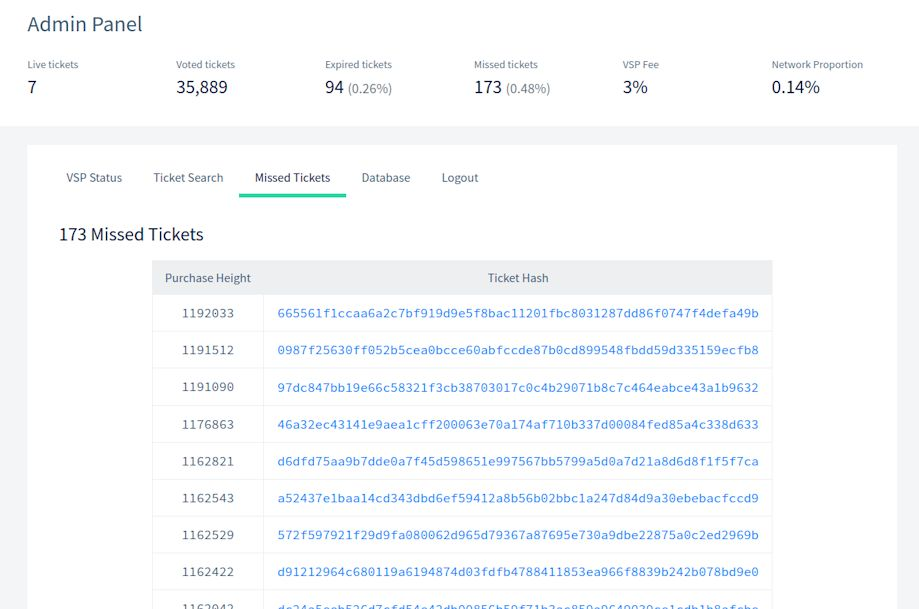

_Image: Missed tickets in vspd admin panel_

### gominer

_[gominer](https://github.com/decred/gominer) is a Decred proof of work miner for solo and pool mining with OpenCL and CUDA devices._

The main goal of September's gominer development was to quickly react to the first GPU miners who did not share their code publicly and thus began to dominate the hashrate. The updates to gominer allow anyone to mine with their GPUs. Besides adding BLAKE3 GPU mining support, an effort has been made to automate or document the setup process to address multiple pain points reported by the miners.

BLAKE3 GPU mining:

- Added support for [BLAKE3 GPU mining via OpenCL](https://github.com/decred/gominer/pull/194). It includes a custom optimized BLAKE3 OpenCL kernel based on midstates for supporting GPUs that work with OpenCL and OpenCL with ADL. "Kernel" is a program written in a specialized [OpenCL kernel language](https://en.wikipedia.org/wiki/OpenCL#OpenCL_kernel_language) that runs on the GPU. This change also improves discovery of CL devices, randomizes nonces to ensure each device is doing different work, and improves hashrate values display.
- Added support for [BLAKE3 GPU mining with CUDA](https://github.com/decred/gominer/pull/195) on Linux. CUDA is a platform for high-performance computing on GPUs. The OpenCL kernel has been adjusted to compile with the CUDA toolkit. Unlike OpenCL, [CUDA](https://en.wikipedia.org/wiki/CUDA) is proprietary, closed-source, and only works on Nvidia cards. However, CUDA allows control of overclocks and fan speeds to potentially significantly increase efficiency (gigahashes per watt). Given the cost of electricity is a huge factor in profitability, such tradeoffs often make sense.
- Added a script and instructions for building the CUDA-enabled version of gominer on [Windows](https://github.com/decred/gominer/pull/206). Building a Go program with CUDA support is [more complicated](https://github.com/decred/gominer/blob/7e2fb9e40e5568d4c85636c7c7ef1474eb44cf6c/cuda_builder.go#L5) on Windows than on Linux, but the new builder goes to great lengths to automate the process as much as possible. If a missing dependency or environment configuration is detected, the builder will print human-readable directions on how to resolve the issue. [Manual instructions](https://github.com/decred/gominer/blob/7e2fb9e40e5568d4c85636c7c7ef1474eb44cf6c/docs/cuda-manual-windows-build.md) have been added as a fallback in case the automatic builder does not work. This change also removes a dependency on GNU Make.
- Added support for [CUDA versions older than 10](https://github.com/decred/gominer/pull/216). This enables building gominer on more configurations, although performance will be significantly degraded with older CUDA versions. Installed CUDA toolkit version and GPU architecture will be [detected automatically](https://github.com/decred/gominer/pull/n/commits/a7076d78a46f9b9d9277fb3f92620ed130d5e7e9) during build to use the best possible GPU features, specifically the fast [funnel shift](https://stackoverflow.com/questions/12767113/funnel-shift-what-is-it) intrinsic.
- Fixed an issue where [autocalibration](https://github.com/decred/gominer/pull/218/commits/d3e68cf1e370e94eb50b1e74d5b2446b8e24c4ad) could not release the device and make the actual mining loop fail.

GPU programming is not something the Decred developers do every day, but this OpenCL kernel has shown to be quite fast. For example, it achieves 10-12 GH/s on an RTX 3070, which is close to 12 GH/s reported by [WhatToMine](https://whattomine.com/gpus/48-nvidia-geforce-rtx-3070) for IronFish, another mining algorithm based on BLAKE3. A better comparison would need to consider the details (size of the hashed data, number of hashing rounds, etc.), but the hashrates reported so far suggest that gominer is good enough to make GPU mining fairer and accessible to more people.

README updates:

- Switched Windows OpenCL build instructions to [MSYS2](https://github.com/decred/gominer/pull/196).
- Added OpenCL AMD/Nvidia [build instructions](https://github.com/decred/gominer/pull/198) for Linux.
- Added [configuration instructions](https://github.com/decred/gominer/pull/199).
- Added [user-reported hashrates](https://github.com/decred/gominer/pull/201).

Other changes:

- Improved [shutdown handling](https://github.com/decred/gominer/pull/207).
- 19 [housekeeping](https://github.com/decred/gominer/pull/210) and clean up commits, including the addition of more linters to prevent poor code from getting in.
- Fixed a [couple](https://github.com/decred/gominer/pull/204) of [issues](https://github.com/decred/gominer/pull/205) with the [Stratum](https://braiins.com/stratum-v1) protocol.

### dcrpool

_[dcrpool](https://github.com/decred/dcrpool) is server software for running a Decred mining pool._

Similar to gominer, dcrpool development has been reactivated after a period of low activity since summer 2021 when release v1.2.0 came out. The developers upgraded the codebase to the latest Go features, fixed multiple concurrency and shutdown edge cases, and paid off some technical debt, all in preparation for adding pooled GPU mining support.

Upgrades and changes:

- Added [BLAKE3 support](https://github.com/decred/dcrpool/pull/341) to the internal CPU miner, which is used for testing.
- Improved accuracy when calculating the number of [possible iterations](https://github.com/decred/dcrpool/pull/360).
- Improved log messages to trace [clients that time out](https://github.com/decred/dcrpool/pull/376).
- Improved [signal handling](https://github.com/decred/dcrpool/pull/381) to shut down more cleanly on more variants of Unix, as well as on Windows, in response to events such as the user logging off, the terminal being closed, or the system shutting down.
- Updated [build code](https://github.com/decred/dcrpool/pull/386) to use Go 1.21 and PostgreSQL 16.0.
- Removed all bbolt [database upgrades](https://github.com/decred/dcrpool/pull/391) and reset the database version to 1. This allows removing a significant amount of code which no longer needs to be maintained, gives developers flexibility to change the database format before the next release, and may avoid potential bugs and support issues caused by inconsistent data. This change assumes there have been no known public deployments of dcrpool and suggests labeling the next release v2.0.0 to reflect that the database format is incompatible with the last major version v1.2.0.

Fixes:

- Corrected [shutdown logic](https://github.com/decred/dcrpool/pull/351) to ensure that log files are properly closed if the process exits due to an error.
- Fixed some cases where configuration [errors were not being logged](https://github.com/decred/dcrpool/pull/352) as expected, and removed code duplication.
- Ensure the [database is closed](https://github.com/decred/dcrpool/pull/353) on all error paths.
- [Fail fast](https://github.com/decred/dcrpool/pull/377) if the GUI web server's listen port is already in use. Before this change, if the GUI could not start normally dcrpool process would continue to run, which was not expected behavior. Now the process will terminate quickly and allow the admin to resolve any issues immediately.
- Fixed edge cases where duplicate [work share IDs](https://github.com/decred/dcrpool/pull/390) and [payment IDs](https://github.com/decred/dcrpool/pull/392) could be generated. Random numbers have been added to these IDs to ensure they are unique. This fixes test failures on fast hardware.
- ~9 miscellaneous fixes in concurrency, cancellation, shutdown logic, and error handling.

Refactoring:

- Removed unused code for running dcrpool as a [Windows](https://github.com/decred/dcrpool/pull/342) [service](https://github.com/decred/dcrpool/pull/349).
- ~11 commits cleaning up code and enabling new linters.
- Reworked how app [version numbers are handled](https://github.com/decred/dcrpool/pull/355) to use a more robust approach from dcrd and dcrwallet.
- Reworked lifecycles of several subsystems to make their startup and shutdown more reliable, easier to reason about, and protected from unintended future changes. The subsystems are: [pool hub](https://github.com/decred/dcrpool/pull/356), [GUI](https://github.com/decred/dcrpool/pull/370) [web server](https://github.com/decred/dcrpool/pull/371), [pool endpoint and client](https://github.com/decred/dcrpool/pull/373), and [chain state](https://github.com/decred/dcrpool/pull/378). Handling of disconnecting [pool clients](https://github.com/decred/dcrpool/pull/380) has been simplified.
- Made the `gui` package [internal](https://github.com/decred/dcrpool/pull/357) since it is not intended for external consumers.
- ~9 commits including small improvements in memory management and concurrency.

Documentation:

- Added the latest [tested versions](https://github.com/decred/dcrpool/pull/384) of PostgreSQL and updated best practices of creating the database.
- Updated and simplified [build and setup instructions](https://github.com/decred/dcrpool/pull/385).

Test code:

- Read from compressed test data archive [in chunks](https://github.com/decred/dcrpool/pull/348) - a good practice to avoid uncontrolled allocations.
- Made test harness easier to run on [Windows](https://github.com/decred/dcrpool/pull/368).
- Made [endpoint tests](https://github.com/decred/dcrpool/pull/387) more robust.
- Allow [keeping the test database](https://github.com/decred/dcrpool/pull/389) for inspection after test failure.
- Removed all code related to ASICs that can no longer mine Decred and are no longer supported by dcrpool.

### Lightning Network

_[dcrlnd](https://github.com/decred/dcrlnd) is Decred's Lightning Network node software. LN enables instant low-cost transactions._

- Removed custom config to target [100 peer connections](https://github.com/decred/dcrlnd/pull/190) ([inherited](https://github.com/lightningnetwork/lnd/blob/d233f61383f2f950aa06f5b09da5b0e78e784fae/server.go#L1413) from lnd).
- Fixed [startup failure](https://github.com/decred/dcrlnd/pull/191) if `--routing` options were not set.
- Build and test against [Go 1.21](https://github.com/decred/dcrlnd/pull/192).
- [v0.4.0 release](https://github.com/decred/dcrlnd/releases/tag/v0.4.0) has been tagged to mark the revision included in core software v1.8.0 release.

### DCRDEX

_[DCRDEX](https://github.com/decred/dcrdex) is a non-custodial, privacy-respecting exchange for trustless trading, powered by atomic swaps._

September changes included in the [v0.6.3 release](https://github.com/decred/dcrdex/releases/tag/v0.6.3):

- Added [extension mode](https://github.com/decred/dcrdex/pull/2486), a restricted mode where DCRDEX won't allow changes to settings like wallet type, wallet password, or wallet accounts. This will protect the wallet from misconfiguration while the DEX is running as part of Decrediton.
- Removed ["bonus tiers"](https://github.com/decred/dcrdex/pull/2502), which were an "accounting curiosity" on the server that didn't do anything for the client but did introduce a bug where the client's bonds could fully expire before being replaced.

Work listed below has been merged to `master` towards future releases.

Decred:

- Added a minimalist [GUI for VSP staking](https://github.com/decred/dcrdex/pull/2482) with the following features: select a VSP, view current ticket price and voting rewards, purchase tickets, view all-time staking stats, view a list of owned tickets, view and set voting preferences (consensus agendas, treasury spends, and treasury keys).
- Allow specifying a [custom VSP](https://github.com/decred/dcrdex/pull/2529) that is not listed in the [VSP API](https://github.com/decred/dcrwebapi/blob/master/docs/api.md).

Firo:

- Implemented Firo [block parsing](https://github.com/decred/dcrdex/pull/2488) to enable fee estimation on testnet.

Ethereum:

- Implemented [WebSocket subscriptions](https://github.com/decred/dcrdex/pull/2490) so the DEX server could get new block headers from chain data provider more efficiently than by polling them. When HTTP polling is still used, the poll interval will automatically increase for non-local sources. Previously, changing this interval required the server to be rebuilt.
- Implemented a smart contract for [getting balances](https://github.com/decred/dcrdex/pull/2520) of ETH and any number of tokens to greatly reduce the request rate to providers. Also, added a cache for responses to further reduce requests to providers between blocks.

Polygon (MATIC):

- Changes across the board to finish the initial [Polygon support](https://github.com/decred/dcrdex/pull/2431): generalized the Ethereum wallet and server backend to reuse common code, added RPC compatibility tests, added Polygon token support to the test harness and gas estimation, deployed USDC swap contract on Polygon mainnet, updated token-related UI code. For user convenience, Polygon and Ethereum wallets will use the same seed and derive the same private keys and addresses as [discussed here](https://github.com/decred/dcrdex/pull/2431#issuecomment-1650510000).
- Added support for wrapped tokens [WBTC and WETH](https://github.com/decred/dcrdex/pull/2522) and adjusted gas rates based on testing results.

Client GUI:

- Improved [active orders UI](https://github.com/decred/dcrdex/pull/2171): show live orders and recent orders in one table, and show buttons when hovering an order, so the user could perform actions without expanding the rows.
- Show [average traded rate](https://github.com/decred/dcrdex/pull/2463) in several places.
- Skip redundant [password entry step](https://github.com/decred/dcrdex/pull/2542) when creating an account on the DEX server if the password is cached.

Client backend:

- Implemented [asynchronous notifications](https://github.com/decred/dcrdex/pull/2492) that wallets can send to the GUI. This will allow to solve some issues and keep the GUI up-to-date in more situations.
- Allow the client to connect to DEX servers using certificates provided by trusted [Certificate Authorities](https://github.com/decred/dcrdex/pull/2513). Previously, server certificate had to be configured manually.
- Optimized [exchange rates fetching](https://github.com/decred/dcrdex/pull/2512) logic and timeouts.
- Fixed the possibility of unexpected [bond expiration](https://github.com/decred/dcrdex/pull/2460) and cancellation of all orders, which was caused by the concept of "bonus tiers" and incorrect guessing of account's trading tier on the client side.

Client, trading bots:

- Implemented an [arbitrage bot](https://github.com/decred/dcrdex/pull/2480) with a simple strategy which only places orders when there is an arbitrage opportunity between the DEX and a centralized exchange (initially supporting Binance).
- Updated [market making UI](https://github.com/decred/dcrdex/pull/2491), which now includes an overview page with all configured bots and settings pages for each one. The configuration is stored in a JSON file. The markets page was also updated not to allow users to place orders manually while market making is running.
- Fixed the market maker bot to [rebalance](https://github.com/decred/dcrdex/pull/2517) a bit later, when the necessary matches data is available.

Documentation:

- Updated [wallet recovery and rescanning guide](https://github.com/decred/dcrdex/pull/2473) for the built-in (aka native) BTC wallet.
- Added [release notes](https://github.com/decred/dcrdex/pull/2536) for v0.6.3.

Server:

- Allow [disabling a market](https://github.com/decred/dcrdex/pull/2487) in the config file.
- Allow the server to run [without TLS encryption](https://github.com/decred/dcrdex/pull/2515), for example for setups where encryption is handled by nginx.
- Added a [reverse tunnel](https://github.com/decred/dcrdex/pull/2493) for obtaining chain data services. Instead of DEX server connecting to data providers, they can initiate connections to a public DEX server and provide RPC services. This allows obtaining chain data from private nodes that cannot accept connections. Having an integrated reverse tunnel offers some advantages over SSH tunneling used previously to achieve the same goal, such as simple configuration. DEX server can consume from multiple source nodes for redundancy.

Other:

- Increased the [minimum Go version](https://github.com/decred/dcrdex/pull/2521) to 1.19.
- Fixed desktop build for [Debian](https://github.com/decred/dcrdex/pull/2525).
- Added a script for setting up [two wallets](https://github.com/decred/dcrdex/pull/2535) for manual testing on mainnet and testnet. This allows to test more scenarios.
- ~11 smaller changes and fixes.

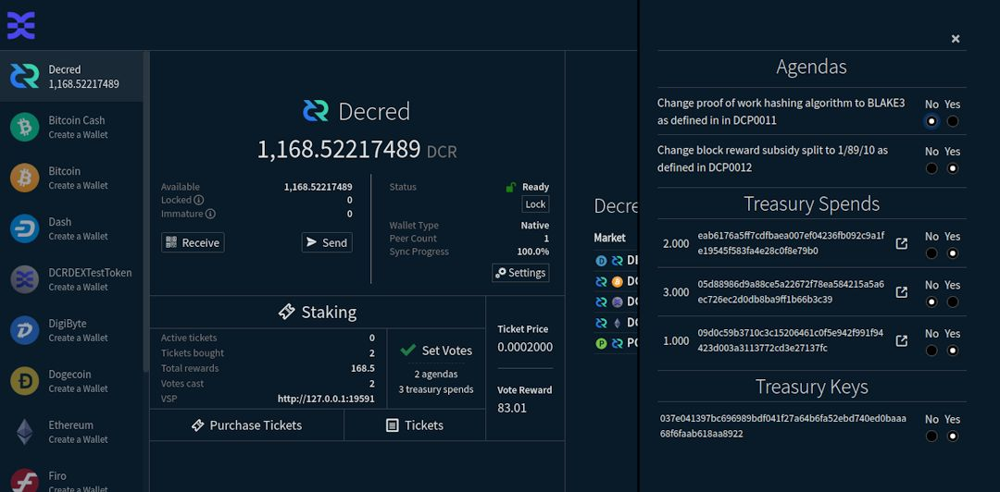

_Image: Decred staking UI in DCRDEX_

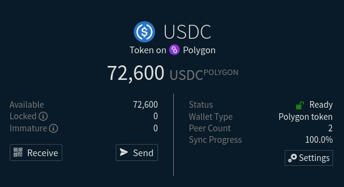

_Image: Polygon integration in DCRDEX_

### Cryptopower

_[Cryptopower](https://github.com/crypto-power/cryptopower) is a multi-coin desktop GUI wallet for DCR, BTC, and LTC. It runs in a privacy-preserving light SPV mode without needing full blockchains, supports Decred staking, mixing, voting, and other unique features._

All changes listed below have been merged to `master` towards future releases.

New Overview page:

- Implemented a new [Home page](https://github.com/crypto-power/cryptopower/pull/65) design with [dummy data](https://github.com/crypto-power/cryptopower/pull/75) and reorganized features into 3 high-level tabs: Overview, Wallets and Trade.
- Use real data in [recent trades card](https://github.com/crypto-power/cryptopower/pull/104).
- Use real wallet data in [balance cards](https://github.com/crypto-power/cryptopower/pull/115).
- Added a modal showing [total asset value](https://github.com/crypto-power/cryptopower/pull/68/commits/f393b5304359f16df92d385e7f93fcc24567692d) in USD.

DEX integration:

- Added the first step of [DEX onboarding](https://github.com/crypto-power/cryptopower/pull/119).

User-facing changes:

- Show a [loading indicator](https://github.com/crypto-power/cryptopower/pull/73) while the list of VSPs is being loaded.
- Hide the [mixing progress bar](https://github.com/crypto-power/cryptopower/pull/70) when the mixer is not running.
- Persistent [balance hiding](https://github.com/crypto-power/cryptopower/pull/81) setting across app restarts.
- Added a modal for [receiving funds](https://github.com/crypto-power/cryptopower/pull/108) that can be accessed from anywhere by clicking the Receive button.

User-facing fixes:

- Fixed [missing icons](https://github.com/crypto-power/cryptopower/pull/64) in Recent Orders list of the instant exchange feature.
- Fixed [staking transactions](https://github.com/crypto-power/cryptopower/pull/92) being listed in Transaction Overview instead of Staking Activities.
- Fixed width of the [asset balance card](https://github.com/crypto-power/cryptopower/pull/95) on the Overview page.
- Fixed [Home page](https://github.com/crypto-power/cryptopower/pull/105) not being shown after successfully creating or restoring a wallet.
- Fixed total USD balance and notification bell invisible in [dark mode](https://github.com/crypto-power/cryptopower/pull/132).
- Fixed crash when loading the app to the [Overview page](https://github.com/crypto-power/cryptopower/pull/133).
- Fixed crash when clicking on a [staking transaction](https://github.com/crypto-power/cryptopower/pull/136).

Decred:

- Fixed incorrect percentage of Yes/No votes shown on [proposal vote bar](https://github.com/crypto-power/cryptopower/pull/63).
- Fixed [log spam](https://github.com/crypto-power/cryptopower/pull/106) on the Staking page if the wallet is not synced.

Litecoin:

- Fixed [address discovery](https://github.com/crypto-power/cryptopower/pull/59) unnecessarily running after every app restart.

Android:

- Created a prototype [Kotlin project](https://github.com/crypto-power/cryptopower-android).
- Fixed app launch on Android 11+ by storing data in [app's private directory](https://github.com/crypto-power/cryptopower/pull/116). As an added advantage, this makes app files not accessible to other apps.

Internal and developer changes:

- Fixed issues with some [instant exchanges](https://github.com/crypto-power/instantswap/pull/6) in the `instantswap` library.

Bug reports and feedback are welcome via [GitHub Issues](https://github.com/crypto-power/cryptopower/issues) or the [#cryptopower](https://matrix.to/#/!oxOZZtibVUXxXtdPJS:decred.org) Matrix [chat](https://docs.decred.org/getting-started/joining-matrix-channels/)!

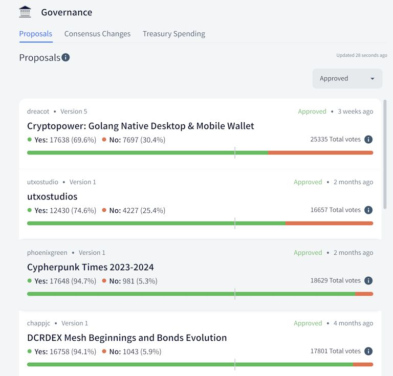

_Image: Proposal voting in Cryptopower_

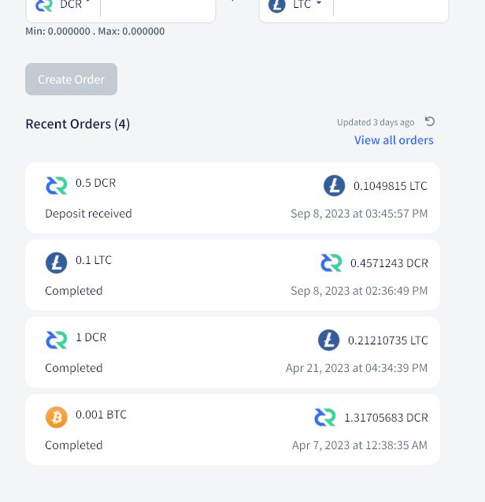

_Image: Recent trades in Cryptopower use centralized instant exchange services_

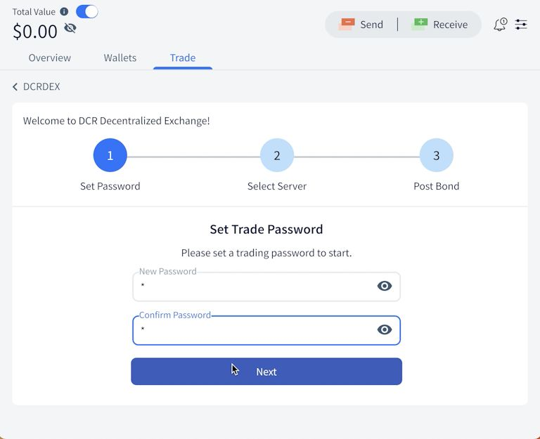

_Image: DCRDEX onboarding pages in Cryptopower_

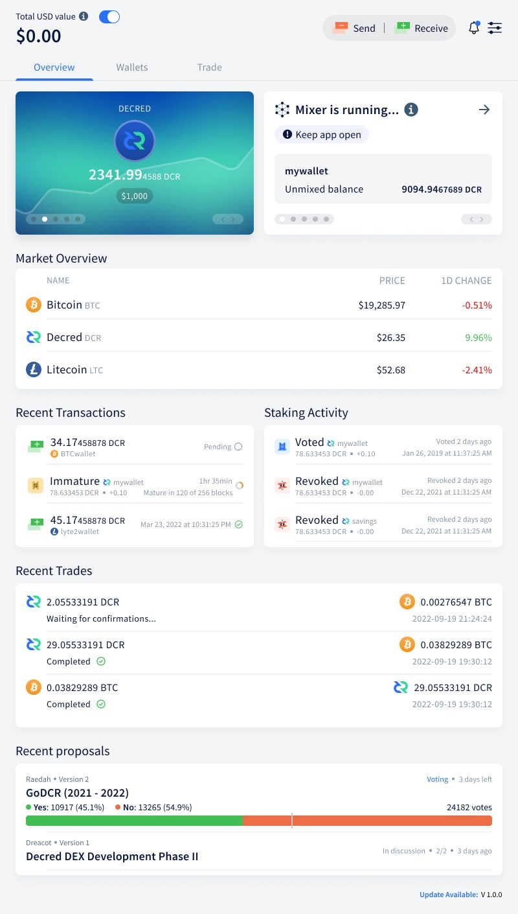

_Image: Design for the upcoming Overview page in Cryptopower (actual implementation may differ)_

### Documentation

_[dcrdocs](https://github.com/decred/dcrdocs) is the source code for Decred [user documentation](https://docs.decred.org/)._

- [Updated](https://github.com/decred/dcrdocs/pull/1228) the [Proof-of-Work](https://docs.decred.org/mining/overview/) page removing the legacy documents related to ASICs and added information about BLAKE3 and CPU mining.
- Updated the [project history](https://github.com/decred/dcrdocs/pull/1232) timeline adding notable events like the launch of Bison Relay, GPU mining for BLAKE3, and the block reward change.
- Added the `blake3pow` and `changesubsidysplitr2` [agendas](https://github.com/decred/dcrdocs/pull/1231) to the [Consensus Vote Archive](https://docs.decred.org/governance/consensus-rule-voting/consensus-vote-archive/).

### decred.org

_[dcrweb](https://github.com/decred/dcrweb) is the source code for the [decred.org](https://decred.org/) website._

- Updated [press release](https://github.com/decred/dcrweb/pull/1136) formatting.
- Updated the [Arabic translation](https://github.com/decred/dcrweb/pull/1140).

### Bison Relay

_[Bison Relay](https://github.com/companyzero/bisonrelay) is a new social media platform with strong protections against censorship, surveillance, and advertising, powered by Decred Lightning Network._

September changes in both GUI and text apps included in v0.1.9 release:

- Show the dates of contact [creation and last handshake attempt](https://github.com/companyzero/bisonrelay/pull/348).
- Added an [ignore list to automatic unsubscription of idle users](https://github.com/companyzero/bisonrelay/pull/349). Users in this list will not be automatically unsubscribed or removed from group chats even if they are idle. By default, it includes well-known bots (Oprah and GC bot), but more users can be added using the new config file option `autoremoveignorelist`.

GUI app changes included in v0.1.9 release:

- Implemented first round of [mobile-optimized UI design](https://github.com/companyzero/bisonrelay/pull/334). This covers the unlock screen, LN overview, feed posts, mobile drawer/sidebar, chat lists, and new icons. Mobile layouts can be tested by reducing the window width below 500 px.
- Updated mobile design for [direct and group chats](https://github.com/companyzero/bisonrelay/pull/343) and added a date change indicator.
- Improved [listing of user's posts](https://github.com/companyzero/bisonrelay/pull/300). Previously, it was just text in the direct chat window. The new listing will look similar to News Feed and indicate whether posts have been downloaded or not. User menu has been tuned to show "Subscribe to Posts" item if not subscribed and "List Posts" and "Unsubscribe to Posts" items if subscribed.
- Added a button to the Settings page that attempts to [reset all old key exchanges](https://github.com/companyzero/bisonrelay/pull/345) with stale users. The period of no activity that is considered "stale" is taken from the server.
- Fixed [inability to add LN capacity](https://github.com/companyzero/bisonrelay/pull/338) after all LN channels had been closed and the app had been restarted.
- Fixed [new comments indicator](https://github.com/companyzero/bisonrelay/pull/342) not disappearing when a post has been viewed, fixed new chat indicator not appearing on new messages.
- Fixed [unnecessary redrawing](https://github.com/companyzero/bisonrelay/pull/344) of messages.
- Fixed crash of the [unlock page](https://github.com/companyzero/bisonrelay/pull/353) on small (mobile) screens.

brclient changes included in v0.1.9 release:

- Made `/list runningtips` command [return an error](https://github.com/companyzero/bisonrelay/pull/347) if no tip attempts are running.
- Fixed issues when interacting with local [Pages and Stores](https://github.com/companyzero/bisonrelay/pull/335). `/ln payinvoice` command now understands the `lnpay://` prefix in invoice links. "Order Completed" page enhanced to show order details and the validity of the invoice (1 hour). If LN invoice creation fails, for example if the seller does not have enough inbound LN capacity, an on-chain payment address will be created instead as a fallback.

In other news, @vctt is making a [poker game](https://matrix.to/#/!GHnoHXSgkVAsUknRUg:decred.org/$sP-K9yQG-ohkPm4G4XVfyaXBcFq2_pvQ4EbxtdePBgU) proof of concept built on top of brclient. In the second iteration, the poker logic has been [converted to a bot](https://matrix.to/#/!GHnoHXSgkVAsUknRUg:decred.org/$fKQ_Emk1kqGH4mbV7aFXddMiSNKFTRa3b7PSiDsWlBw), which is easier to integrate in existing clients. The code can be found [here](https://github.com/companyzero/bisonrelay/compare/master...vctt94:bisonrelay:poker-bot).

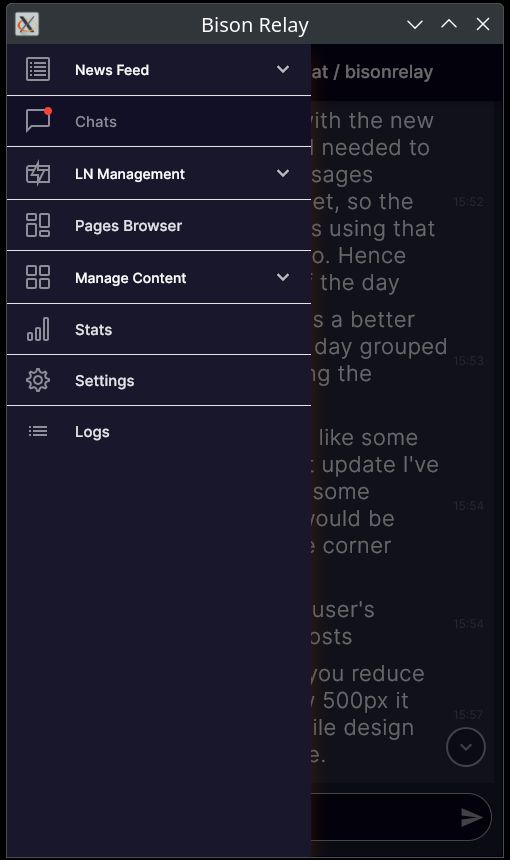

_Image: First iteration of mobile design in Bison Relay v0.1.9_

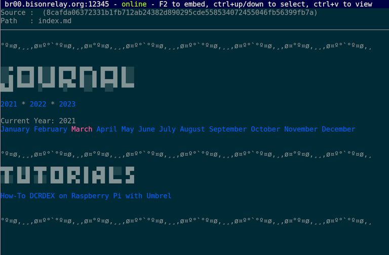

_Image: Pages in brclient v0.1.9_

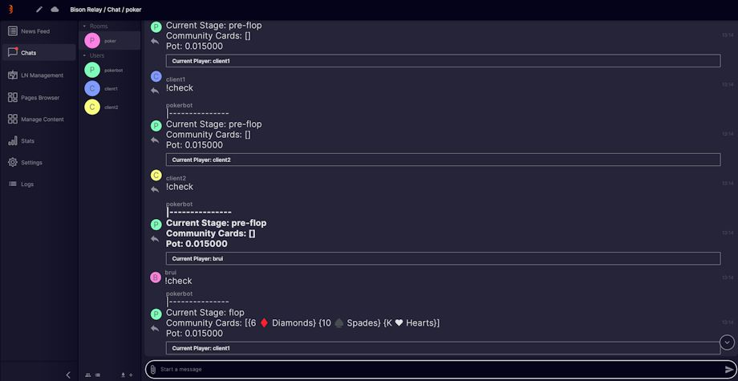

_Image: Poker bot PoC game in Bison Relay GUI_

## People

Welcome the new first-time contributors:

- minizilla (development, [dcrd](https://github.com/decred/dcrd/pull/3188))
- omahs (development, [dcrdex](https://github.com/decred/dcrdex/pull/2533))
- Clopas (development, [dcrweb](https://github.com/decred/dcrweb/pull/1139))

Community stats as of Oct 2 (compared to Sep 2):

- [Twitter](https://twitter.com/decredproject) followers: 53,407 (+101)
- [Reddit](https://www.reddit.com/r/decred/) subscribers: 12,757 (+6)
- [Matrix](https://chat.decred.org/) #general users: 819 (+14)
- [Discord](https://discord.gg/GJ2GXfz) users: 1,795 (+134), verified to post: 744 (+67)
- [Telegram](https://t.me/Decred) users: 2,321 (+18)
- [YouTube](https://www.youtube.com/decredchannel) subscribers: 4,640 (+0), views: 240K (+5.4K)

## Governance

In September the new [treasury](https://dcrdata.decred.org/treasury) received 8,374 DCR worth $111K at September's average rate of $13.23. 

No treasury spend transactions were mined in September due to a slip in the admin approval timeframe, but a [treasury spend tx](https://dcrdata.decred.org/tx/dad857ec261237d51247d4bfae1a1ffb4348c8a7ed8933b2b877e6cac1d75436) spending 8,411 DCR was mined on Oct 1 after being approved with 99.9% Yes votes and 64% turnout, the highest so far. This TSpend covers July and the majority of August's billing, in an effort to close the expanding gap between work being completed and being paid. It has 53 outputs ranging in size from 7 DCR to 1,719 DCR. The billing rate for July was $15.40/DCR and for August $13.89/DCR, at the average of $14.65/DCR the payment would cover about $123K of costs for both months combined.

As of Oct 5, the combined balance of [legacy](https://dcrdata.decred.org/address/Dcur2mcGjmENx4DhNqDctW5wJCVyT3Qeqkx) and [new treasury](https://dcrdata.decred.org/treasury) is 866,862 DCR (11.4 million USD at $13.20).

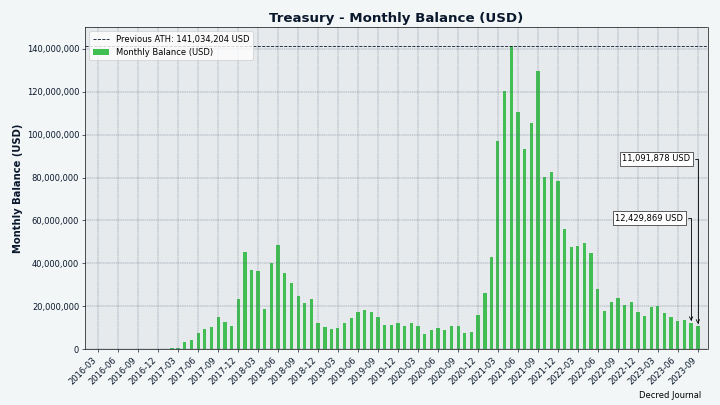

_Image: Treasury monthly balance in USD; note that it heavily depends on the exchange rate_

Voting was completed for two proposals in September, but the voting period was disrupted by the activation of DCP-0011 and a period of around 3 days when the blockchain was stalled waiting for a new block to be found with the new hashing function, followed by a period of rapid block production as GPU miners began operating on the network. The delay of greater than 24 hours without a block caused certain safeguards to activate in the wallet software, which became convinced that the client must be offline and would have prevented normal voting behavior.

- The Cryptopower multi-asset Golang wallet for Desktop and Mobile [proposal](https://proposals.decred.org/record/256efee) with a budget of $61,600 was approved with 69.6% Yes votes and 62% turnout.

- The Cake Wallet integration [proposal](https://proposals.decred.org/record/2f25f2d) requesting $80,000 to integrate basic DCR functionality in [Cake Wallet](https://cakewallet.com/) failed to reach the quorum requirement with 18% turnout, although it was at 87% approval. Cake Wallet voting was authorized and started after the Cryptopower proposal was already voting for more than 1 day, and as a result the Cake Wallet vote was more severely affected by the voting system problems.

There were two proposals published this month, although one of them is a repeat of the Cake Wallet integration proposal.

- [Cake Wallet Integration Again](https://proposals.decred.org/record/b3bdacb) is back for another try at the quorum requirement.

- A fifth iteration of @l1ndseymm's [Public Relations proposal](https://proposals.decred.org/record/0c04c6f) initially requested an increased amount of $60,000 for another year, then reduced it to $48,000.

More events and details surrounding the above proposals have been covered in [Politeia Digest issue 64](https://blockcommons.red/politeia-digest/issue064/).

## Mining

Decred mining was rebooted on August 29th when ASICs mined their last block and the chain switched to BLAKE3 proof of work.

Since the switch would remove all ASIC hashrate from the network, the mining difficulty had to be reset to a low enough value to allow commodity hardware to mine new BLAKE3 blocks. For comparison, ASICs mined their [last block](https://dcrdata.decred.org/block/0000000000000000c293d8c67409d05e960447ea25cdaf770e864d995c764ef0) at difficulty of 3.5 billion while the [next block](https://dcrdata.decred.org/block/071683030010299ab13f139df59dc98d637957b766e47f8da6dd5ac762f1e8c7) had the difficulty value of 101 thousand, or 35,068 times lower.

The initial difficulty value was manually set to target about 1.45 TH/s hashrate in [anticipation of GPU hashrate](https://matrix.to/#/!TSpuyuYWgkTrgPTcXh:decred.org/$mtTPqh-YoNoXn-Q8-Q8K0390wy28L4XrD8Udx9yDU6U), but it didn't immediately join the network and only CPU miners were active upon BLAKE3 activation. A single CPU achieves between ~5-75 megahashes per second (from old laptops to high-end CPUs). Assuming an "average CPU" as 20 MH/s, getting 1.45 *terahashes* would require some 72,500 CPUs. The first BLAKE3 block (794,368) was extremely lucky to be found in only 50 minutes, assuming it was found with CPUs, but afterwards the chain stalled.

In a positive development, this incident activated many old and new community members to come together and push the chain forward. The #pow-mining chat became very busy as people converted any available hardware to Decred miners and endured the generated excess heat. Devices ranged from tiny Raspberry Pi's (1 MH/s), to old laptops (2-5 MH/s), to new laptops and desktops (10-20 MH/s), to monstrous 120 Watt+ processors with 16 and 32 cores (60-75 MH/s).

> I have to say, I love how this is bringing everyone together. I've missed this collaborative spirit. [[@jazzah](https://matrix.to/#/!TSpuyuYWgkTrgPTcXh:decred.org/$dXjs1Gqsw5jE2v1p9Ly5mwo_JaQXU_KDsrg_FyeI4i0)]

By the end of August 31st around 25 individuals reported a total of 550 MH/s, but that (and any unreported hashrate) was still not enough. On early September 1st, @grumlin and @davecgh turned to [cloud hashrate](https://matrix.to/#/!TSpuyuYWgkTrgPTcXh:decred.org/$-Ql5Vva-X-A2ds34OYP0HZZs8O8fsikHIeTH6zlN9yU) and within ~3 hours [block 794,369](https://dcrdata.decred.org/block/655d0c998b6f838a63a69991ebfb8dc776ed0234117c7b6cca407fe15c2cb02c) was [found](https://matrix.to/#/!TSpuyuYWgkTrgPTcXh:decred.org/$s5YhsGnMnTGaWnNLHGWD6CSKXYfoTxNklSFeKuS7zb4). It was 324 KB in size and included 240 transactions accumulated over the days. Since no blocks had been mined for so long, the ASERT algorithm only needed one block to reduce the mining difficulty from ~97,000 to ~1,800 and from there CPUs had no problem finding new blocks and the target block time was restored in just a few hours.

September 1-5th was the short period when CPU mining was feasible as the difficulty settled around 500 and the corresponding network hashrate stayed between 6-10 GH/s, the equivalent of ~300 CPUs or just 1 mid-range GPU. Mining address distribution became significantly more decentralized compared to the [ASIC era](https://proposals.decred.org/record/a8501bc/comments/66).

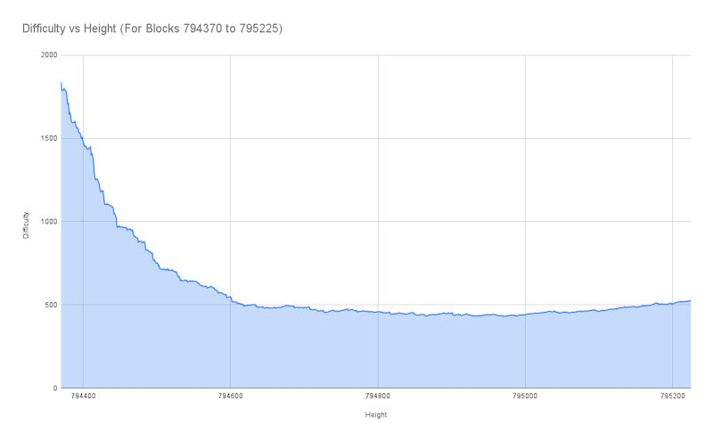

_Image: Mining difficulty during the CPU days_

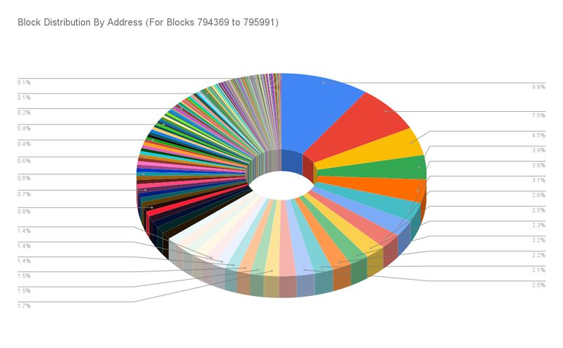

_Image: Block distribution by mining address as of September 6th_

However, the CPU mining days did not last long. Developers anticipated that GPU miners would show up soon given that even a single GPU mines as fast as roughly 500 CPUs, and GPU *farms* are quite common. First signs of GPU mining got spotted around September 2nd but it wasn't definitive because they seemed to be intentionally keeping it in the range of plausible deniability. With a more reliable confirmation on the 5th, the developers rushed to add GPU mining support to [gominer](https://github.com/decred/gominer).

On September 6th, a significant increase in block production rate was a clear indicator of GPU mining happening on the network. The hashrate increased to ~32 GH/s by 15:00, from ~9 GH/s just one day before. In about one day, rewards for ~150 blocks were collected by a single address (normally ~288 blocks are mined per day). First GPU mining [patch](https://github.com/decred/gominer/pull/194) was merged in gominer around 14:30 and by 15:30 first community members got their GPUs up and running. After GPU mining was made available to everyone the hashrate went straight up, reaching ~52 GH/s by 18:30 and [~700 GH/s](https://matrix.to/#/!TSpuyuYWgkTrgPTcXh:decred.org/$P9sXHlT3txgllOwHtrWLNVWpXSC10i0Dx9p6mImfMgw) by 20:00. New blocks were being mined as fast as 100 per hour (the normal rate is 12 blocks/hour).

By late September 7th the hashrate reached the level expected on the fork day, around 1,500 GH/s or 150 GPUs (assuming a 10 GH/s GPU like RTX 3070). This was a good test of the new difficulty algorithm, which was designed in anticipation of such a scenario. It worked well, ASERT managed to return block times to normal by September 10th, despite the hashrate increasing to ~3,000 GH/s in the same period. With the old algorithm it would take 2 weeks in the best case.

Soon after gominer was in good shape enough that the developers switched to refreshing the codebase and adding BLAKE3 support to [dcrpool](https://github.com/decred/dcrpool). BzMiner developer @iedoc released BzMiner v17.0.0 with Decred mining support, capable of squeezing out a few extra gigahashes from the GPU compared to gominer.

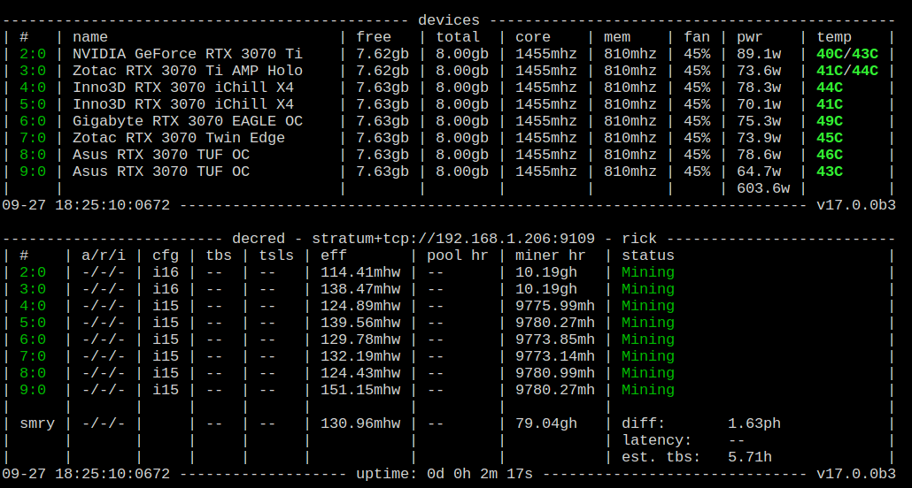

_Image: BzMiner v17 managing 8 GPUs mining Decred_

The rest of September was not as dramatic, but nevertheless the hashrate continued to grow and reached ~8,000 GH/s by the end of the month.

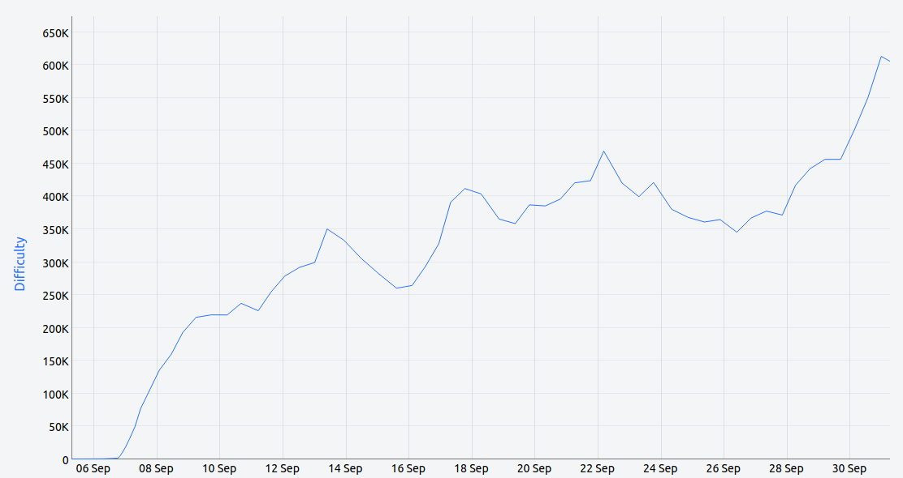

_Image: Mining difficulty increased x200 in just 2 days, and did another x5 through the rest of September_

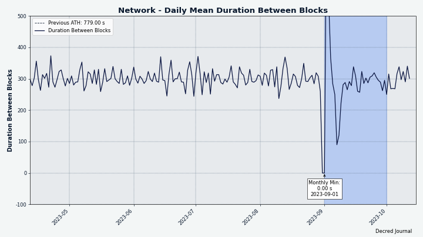

_Image: Average block time was wild for a few days, but stabilized quickly_

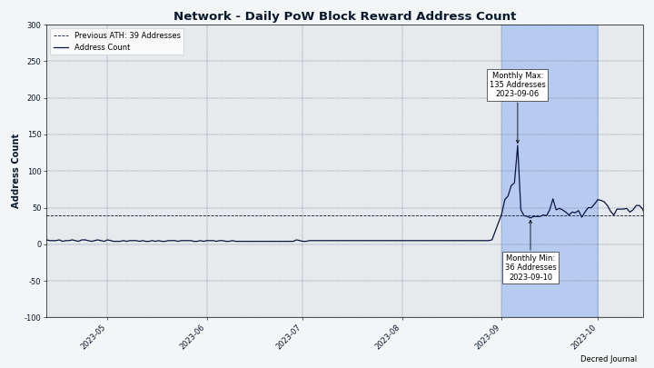

_Image: This chart shows just how centralized the mining was before the fork, only ~5 unique mining addresses_

_Image: Another view at mining (de)centralization, each color represents a unique mining address_

## Network

Decred's network upgrade and the corresponding technical issues have created volatility in several metrics as shown on the charts below, but most metrics have normalized by the end of September or early October.

**Hashrate**: September's [hashrate](https://dcrdata.decred.org/charts?chart=hashrate&scale=linear&bin=day&axis=time) opened at ~0 TH/s and closed at ~8.8 TH/s, bottoming at 0 TH/s and peaking at 8.8 TH/s throughout the month.

No information about DCR mining pools operating in September is available.

**Staking**: [Ticket price](https://dcrdata.decred.org/charts?chart=ticket-price&axis=time&visibility=true-true&mode=stepped) varied between 141-278 DCR.

The [locked amount](https://dcrdata.decred.org/charts?chart=ticket-pool-value&scale=linear&bin=day&axis=time) was 8.52-9.82 million DCR, meaning that 54.9-63.5% of the circulating supply [participated](https://dcrdata.decred.org/charts?chart=stake-participation&scale=linear&bin=day&axis=time) in proof of stake.

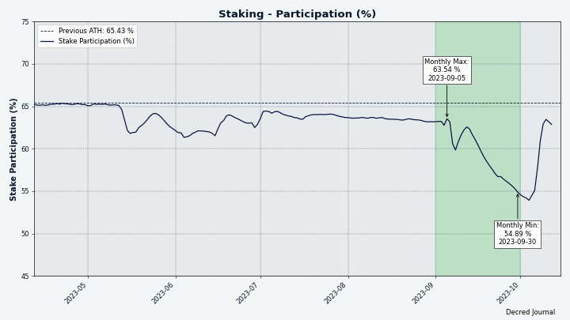

_Image: Low ticket buying activity caused a drop in locked DCR and stake participation_

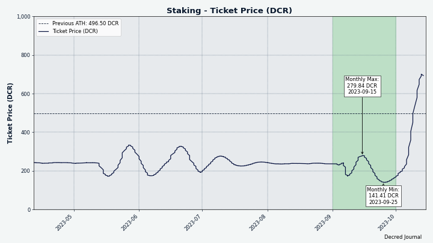

_Image: Ticket price went down to stimulate ticket buying again_

**VSP**: The [15 listed VSPs](https://decred.org/vsp/) collectively managed ~7,550 (+650) live tickets, which was 18.0% of the ticket pool (+3.5%) as of Oct 1.

The biggest gainers of September are [bass.cf](https://vspd.bass.cf/) (+495 tickets or +54%), [stakeminer.com](https://vsp.stakeminer.com/) (+357 tickets or +107%), and [stakey.net](https://stakey.net/) (+336 tickets or +128%).

_Image: Distribution of tickets managed by VSPs_

**Nodes**: [Decred Mapper](https://nodes.jholdstock.uk/user_agents) observed between 147 and 159 dcrd nodes throughout the month. Versions of 153 nodes seen on Oct 1: v1.8.0 - 89%, v1.7.x - 4%, v1.9.0 dev builds - 2.6%, v1.8.0 dev builds - 0.7%, other - 4%.

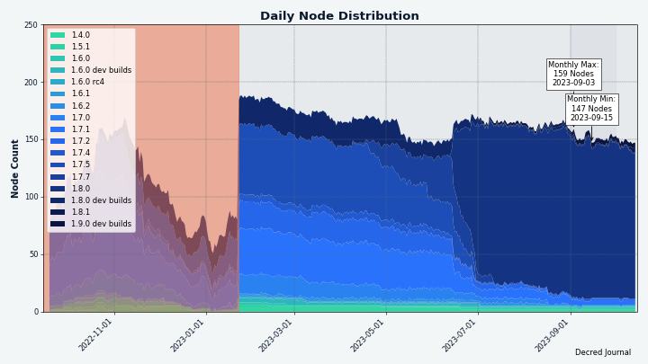

_Image: The majority of nodes are running dcrd v1.8.0. The red area before Jan 2023 indicates incomplete data we had at that time._

The share of [mixed coins](https://dcrdata.decred.org/charts?chart=coin-supply&zoom=jz3q237o-la8vk000&scale=linear&bin=day&axis=time&visibility=true-true-true) varied between 60.7-62.6%. Daily [mix volume](https://dcrdata.decred.org/charts?chart=privacy-participation&bin=day&axis=time) varied between 40-**906K** DCR and made a new all-time high.

_Image: Daily mixed DCR dropped during the chain stall, but came back with a vengeance marking a new ATH_

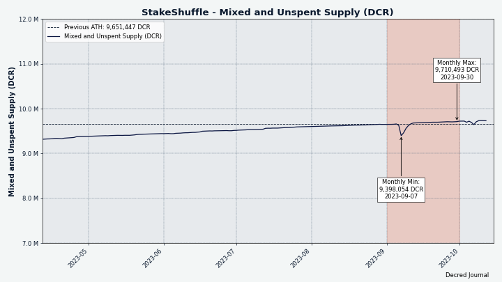

_Image: Total mixed and unspent DCR dipped, but quickly recovered_

Decred's [Lightning Network](https://ln-map.jholdstock.uk/) explorer saw 211 nodes (-2), 429 channels (-2) with a total capacity of 190 DCR (+4), as of Oct 2. These stats are different for each node. For example, @karamble's node reported 213 nodes (-4), 446 channels (-7) and 191 DCR (-1) capacity on same day Oct 2.

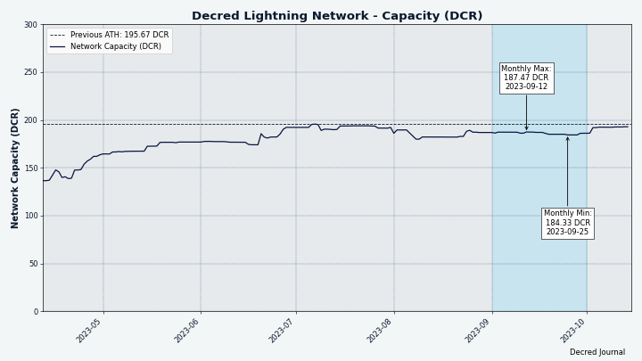

_Image: Decred's Lightning Network capacity remains stable_

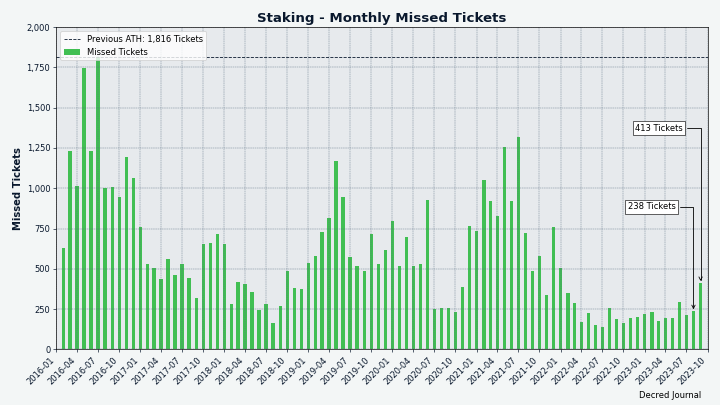

_Image: Uptick in missed tickets in September was likely due to technical issues after the hard fork_

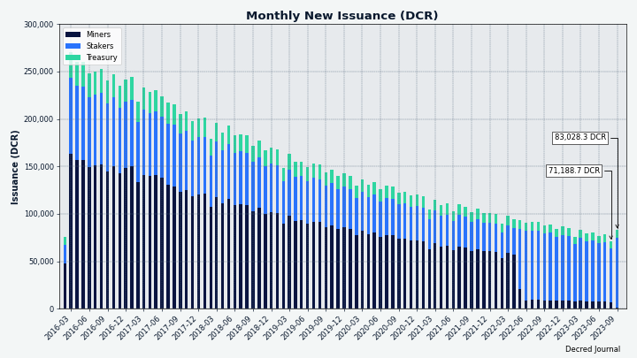

_Image: Monthly DCR emission was slightly higher than usual due to a period of fast blocks_

Thanks to @bochinchero for providing and improving these charts. About 40 other charts not used in this Decred Journal issue are available in the [dcrsnapshots](https://github.com/bochinchero/dcrsnapshots) repository; everyone is welcome to share them on social media.

## Ecosystem

Voting Service Providers:

- A warm welcome to [vote.dcr-swiss.ch](https://vote.dcr-swiss.ch/), a new VSP [listed](https://github.com/decred/dcrwebapi/pull/178) in the VSP API and on the [VSP page](https://decred.org/vsp/). DCR Swiss has a low fee of 0.25%. Out of 15 existing VSPs this is the fourth lowest fee after dcrhive.com (0.15%), dcr.farm (0.15%), and vspd.bass.cf (0.2%). As of writing, the VSP reports 391 voted, 0 revoked, and 334 live tickets.

Exchanges:

- Poloniex users who transacted in DCR in 2017-2019 may be eligible for compensation if claims are submitted by October 31, 2023. This is a result of the SEC's [proceedings](https://www.sec.gov/enforcement/information-for-harmed-investors/poloniex) against Poloniex from 2021. See more details on the [Poloniex Fair Fund](https://www.poloniexfairfund.com/) website and its [FAQ section](https://www.poloniexfairfund.com/frequently-asked-questions.aspx).

- KuCoin and Huobi have been [re-added](https://github.com/decred/dcrweb/pull/1139) to the [Exchanges](https://decred.org/exchanges/) page. Apparently, Huobi never delisted DCR as [planned](https://web.archive.org/web/20221002130913/https://www.huobi.com/support/en-us/detail/104917015223952), while KuCoin had fixed [DCR issues](https://www.kucoin.com/news/en-kucoin-opens-mainnet-dcr-tokens-deposit-and-withdrawal-services-20220924) some time ago. Hotbit has been removed following its closure in [May 2023](202305.md#ecosystem).

- [Changelly.com](https://changelly.com/) was observed to no longer offer DCR trading as of September 19th. Their [System Health](https://pro.changelly.com/system-monitor) dashboard did not list DCR either, even in maintenance mode. In a response to a support ticket, Changelly replied that DCR was switched off due to "its maintenance" (possibly referring to the Aug 29 hardfork) and that it would be back at some point.

- Binance is selling the entirety of its Russia business to CommEx, according to their [tweet](https://twitter.com/binance/status/1706944096688885895) and a [blog post](https://www.binance.com/en/blog/all/binance-fully-exits-russia-with-sale-to-commex-8578760889994024403). The stated reason is "operating in Russia is not compatible with Binance's compliance strategy". A gradual migration process has been announced to move Russian users to CommEx, after which Binance could sunset all exchange services and business in Russia. The impact on DCR services and whether CommEx will list DCR is currently unknown.

Other news:

- A phishing site that was a near perfect clone of the official [decred.org](https://decred.org), but with an added "community airdrop" was briefly advertised in Decred's Telegram channels. These messages were taken down within minutes after being posted. Site's page source suggested it was targeting the users of MetaMask, Coinbase and other browser-based wallets. As a reminder, do not click any random links, and ignore DMs instructing to do otherwise. The official Decred website is [decred.org](https://decred.org) with a certificate from Gandi. Official social media links are listed on [decred.org/community](https://decred.org/community/).

Join our [#ecosystem](https://chat.decred.org/#/room/#ecosystem:decred.org) chat to get more news about Decred services.

Warning: the authors of the Decred Journal have no idea about the trustworthiness of any of the services above. Please do your own research before trusting your personal information or assets to any entity.

## Outreach

### Decred Vanguard

Decred Vanguard is a community-based marketing effort with the goal of increasing Decred's outreach and social media presence. 

Updates: We ran a successful [meme competition](https://twitter.com/exitusdcr/status/1708184512805405096) and gave out [$200 in DCR for prizes](https://twitter.com/exitusdcr/status/1708981341033816333). The other recipients of the monthly Decred Vanguard reward of $100 in DCR were [@tothemoon](https://twitter.com/P________L) for his Decred Discord server contributions, and [@PubPete](https://twitter.com/longtermdaily) for his high activity.

Are you a meme creator, artist, strategist, or just someone passionate about the Decred Project? We're [expanding](https://twitter.com/exitusdcr/status/1704349424003010700) our community-driven marketing program, and we want YOU!

What's in it for you?

- Earn $100 in DCR every month just for participating.
- We'll cover the cost of your X Premium.
- No strict rules on participation. Contribute in your own unique way, whenever you can.
- Win potential prizes for contributions.

Interested? Contact [@Exitus](https://twitter.com/exitusdcr) on Twitter/Matrix/Discord.

### Cypherpunk Times

Engagement stats for September:

- Total number of articles on CT: 539
- Newsletter subscribers: 110
- New CT posts and newsletters sent: 23
- Active social media campaigns: 81
- Completed social media campaigns: 18
- Social media posts: 263
- Social media followers across all platforms and accounts: 1,627
- [@decredsociety](https://twitter.com/decredsociety) Twitter: followers - 981, Tweet impressions - 17.3K, likes - 295, retweets - 89
- [@decredmagazine](https://twitter.com/decredmagazine) Twitter: followers - 490, Tweet impressions - 15.6K, likes - 464, retweets - 125
- [@cypherpunktimes](https://twitter.com/cypherpunktimes) Twitter: followers - 156, Tweet impressions - 22.0K, likes - 461, retweets - 151
- Posts by project for September: General crypto - 9, Firo - 3, Decred - 10, Updated Decred post - 1

### Other

- After publishing their first Decred article, the next step of BTC-ECHO proposal's plan was to publish the [podcast ad script](https://proposals.decred.org/record/49e373b/comments/32) for community's review but then BTC-ECHO disappeared for more than a month.
- [utxostudios proposal](https://proposals.decred.org/record/9e265ad) is complete; a total of 14 short videos have been created: 2 in English, 11 in different languages, and 1 compilation. All have been uploaded to [Decred's YouTube channel](https://www.youtube.com/playlist?list=PLaMrpvQ0yJ_xm0FgwJ-oO9CWJfplsZD_N) and mirrored [on IPFS](https://ipfs.io/ipfs/QmZSpS7VdsBoFzDinZgpxL594sWFN597dZHBbpzWhLfKvv/).

## Events

**Attended:**

@arij has signed a partnership agreement with [National Institute of Innovation and Advanced Technology](https://www.linkedin.com/company/niiat/) (NIIAT) based in Casablanca, Morocco. This 1-year agreement will facilitate cooperative efforts like workshops, study sessions, and various interactive events. One of the key topics of the event was the introduction of [Islah.city](https://islah.city/), a platform where citizens of Casablanca can identify and collaboratively resolve urban challenges. The potential to integrate blockchain technology and timestamping has been discussed. The event garnered attention on the national TV news channel Al Aoula, the video clip is available on [Twitter](https://twitter.com/in_insaf/status/1705858291929137232) and [YouTube](https://www.youtube.com/watch?v=GO5Ky0JXhyU). See more in the [full report](https://decredcommunity.github.io/events/index/20230923.1).

## Media

**Selected articles:**

Decred:

- [Cryptocurrency and environmental concerns: the road to sustainable blockchain solutions](https://www.cypherpunktimes.com/cryptocurrency-and-environmental-concerns-the-road-to-sustainable-blockchain-solutions/) by @tallamericano
- [Brazilian government wants new tax over crypto](https://www.cypherpunktimes.com/brazilian-government-wants-new-tax-over-crypto/) by @Joao
- [Cryptocurrency adoption in developing countries: promising trends and implications](https://www.cypherpunktimes.com/cryptocurrency-adoption-in-developing-countries-promising-trends-and-implications/) by @tallamericano
- [New study shows that big investors have a positive perspective on cryptocurrencies](https://www.cypherpunktimes.com/new-study-shows-that-big-investors-have-a-positive-perspective-on-cryptocurrencies/) by @Joao
- [Privacy matters! A features comparison](https://www.cypherpunktimes.com/privacy-matters-a-features-comparison/) by @Joao
- See also text versions for the Videos below

General crypto:

- [The battle for a spot bitcoin ETF continues](https://www.cypherpunktimes.com/the-battle-for-a-spot-bitcoin-etf-continues/) by @BlockchainJew
- [SIM swap attacks: a growing threat to your online security](https://www.cypherpunktimes.com/sim-swap-attacks-a-growing-threat-to-your-online-security/) by @BlockchainJew
- [Lessons from the Mark Cuban hacking incident](https://www.cypherpunktimes.com/lessons-from-the-mark-cuban-hack-incident/) by @Joao
- [Exploring altcoins: promising cryptocurrencies beyond Bitcoin and Ethereum](https://www.cypherpunktimes.com/exploring-altcoins-promising-cryptocurrencies-beyond-bitcoin-and-ethereum/) by @tallamericano

**Guides**:

- [AtomicSwap refunds in DCRDEX](https://www.youtube.com/watch?v=W9dDnE6AdIs) by @phoenixgreen - also as a [text post](https://www.cypherpunktimes.com/atomicswap-refunds-in-dcrdex/)
- [Upgrading DCRDEX standalone version](https://www.youtube.com/watch?v=IIJ0SWAuwr8) by @phoenixgreen - also as a [text post](https://www.cypherpunktimes.com/upgrading-dcrdex-standalone-version/)
- [How-to DCRDEX on Raspberry Pi with Umbrel](https://www.youtube.com/watch?v=hnXic_tVwr0) by @karamble - also as a [text post](https://www.cypherpunktimes.com/how-to-dcrdex-on-raspberry-pi-with-umbrel/)

**Videos:**

- [CPU mining, staking & participation - State of the Market](https://www.youtube.com/watch?v=Z2zL2J9RL-A) by @phoenixgreen and @Exitus feat. @Tivra - also on [Spotify podcasts](https://podcasters.spotify.com/pod/show/cypherpunktimes/episodes/Decred-CPU-Mining--Staking--Participation---State-of-the-market-e29034h)
- [Decred News - Hard-fork completed! Now CPU/GPU mined - ASICs are out!](https://www.youtube.com/watch?v=u1Nts-UKsuY) by @Exitus - also on [Spotify](https://podcasters.spotify.com/pod/show/cypherpunktimes/episodes/Decred-News---Hard-fork-completed--Now-CPU_GPU-Mined---ASICs-are-out-e292vcg)
- [Decred unmasked](https://www.youtube.com/playlist?list=PLaMrpvQ0yJ_xm0FgwJ-oO9CWJfplsZD_N) - playlist of 14 videos by @utxostudios in different languages
- [Mining cartels](https://www.youtube.com/watch?v=KR4w_arcRZQ) by Son of a Tech (aka @blindrun)
- [Decred's blockchain mining revolution - Moving Blockchain Forward](https://www.youtube.com/watch?v=Ev7XRQ_VrnI) by @phoenixgreen - also on [Spotify](https://podcasters.spotify.com/pod/show/cypherpunktimes/episodes/Decreds-Blockchain-Mining-Revolution--Moving-Blockchain-Forward-e29f8ji) and a [text post](https://www.cypherpunktimes.com/decreds-blockchain-mining-revolution-moving-blockchain-forward/)
- [Removing centralisation from crypto - Moving Forward](https://www.youtube.com/watch?v=746-gBoVcCE) by @phoenixgreen - also on [Spotify](https://podcasters.spotify.com/pod/show/cypherpunktimes/episodes/Removing-Centralisation-From-Crypto-e29rhvn) and as a [text post](https://www.cypherpunktimes.com/removing-centralisation-from-crypto/)

Audio versions of some videos are published on the [Cypherpunk Times](https://podcasters.spotify.com/pod/show/cypherpunktimes) Spotify podcast.

Check out the new [Shorts section](https://www.youtube.com/channel/UCJ2bYDaPYHpSmJPh_M5dNSg/shorts) on @DecredTV!

**Translations:**

- [DCP-11 change PoW to BLAKE3 and ASERT](https://github.com/decred/dcps/blob/master/dcp-0011/dcp-0011.mediawiki) - in [Chinese](https://github.com/DominicTing/articles/blob/master/dcp-0011/dcp-0011.mediawiki) by @Dominic
- Decred Journal June-August got a total of 2 new [translations](https://xaur.github.io/decred-news/) to Chinese (@Dominic) and Polish (@kozel). Thank you, friends!

**Non-English content:**

- [Makertronic](https://www.youtube.com/channel/UCsm-K1pBCJiH_g2K3_TbUyg) created French tutorials for Decred GPU mining on [Linux and Windows](https://www.youtube.com/watch?v=Xsx6uaFA8x4) and on [HiveOS](https://www.youtube.com/watch?v=sxuBNhYe9G0) (English subtitles available). The videos got pretty good views for Decred content.

- A video clip from Moroccan national TV news channel Al Aoula covering the [partnership agreement](#events) event between Decred and the National Institute of Innovation and Advanced Technology (NIIAT) has been published on Abdellatif Belmkadem's [YouTube](https://www.youtube.com/watch?v=GO5Ky0JXhyU) and @arij's [Twitter](https://twitter.com/in_insaf/status/1705858291929137232).

**Discussions:**

A reality check from @Tivra:

> This is not "crypto" this is some trashy reality show some of you follow on X. Crypto happens on GitHub and on chain not on video. You control where your attention goes, it's ultimately your responsibility [[tweet](https://twitter.com/WasPraxis/status/1706573581168050566)]

**Other**:

- Decred's [LinkedIn page](https://www.linkedin.com/company/decredproject) became visible without login again.

**Art and fun:**

- [Staking - is it worth it?](https://www.youtube.com/watch?v=ItlHeKohvO4) by @Exitus - first in @DecredTV Shorts tab
- [Decred GPU mining "NeoGen" animation](https://twitter.com/karamblez/status/1699017182502347176) by @karamble
- [Buying decred is like hitting the bullseye](https://www.cypherpunktimes.com/buying-decred-is-like-hitting-the-bullseye/) by @OfficialCryptos
- [Unlimited potential](https://www.cypherpunktimes.com/unlimited-potential/) by @OfficialCryptos
- [Stake Decred](https://twitter.com/jz_bz/status/1706546021994570040) short by @jz
- [@dearcryptopunk](https://www.tiktok.com/@dearcryptopunk) TikTok videos by @jp.santanna
- @Tivra proposed a [revolutionary paradigm](https://matrix.to/#/!lDZCzVQjFoJsXMPkvr:decred.org/$-k2e-8QCXjQ04mv7LqYyW2WALIb5wDvX-jRqWrc5Dk4) called "UP ONYL". The self-professed leader of the new radical UpOnlyism movement declared a death punishment to anyone who says our charts should move anywhere but UP.

_Image: Merch design by @lewildbeast for the hero miner who solved block 794,369 (DCR reward needs to be [updated](https://dcrdata.decred.org/block/794369))_

_Image: Interpretation of the UP ONYL paradigm by @Void_

## Markets

In September DCR was trading between USDT 12.33-15.25 and BTC 0.00048-0.00057. The average daily rate was $13.23.

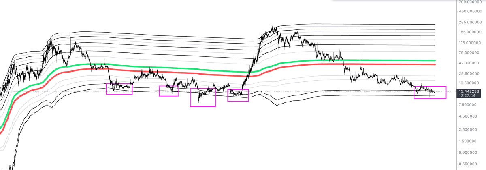

_Image: Historical DCR/USD accumulation zones by @saender_

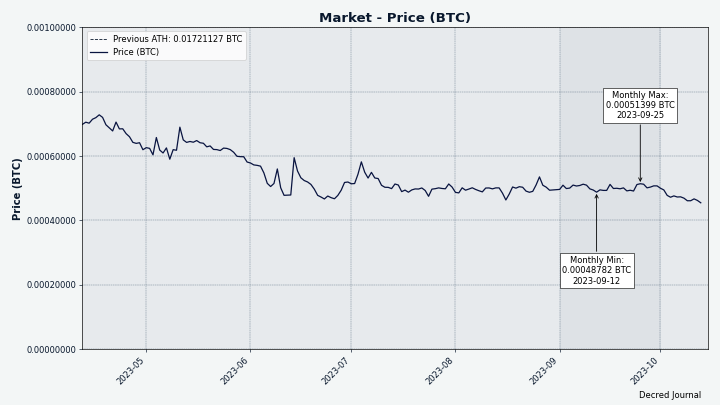

_Image: Recent DCR/BTC, data from Coin Metrics_

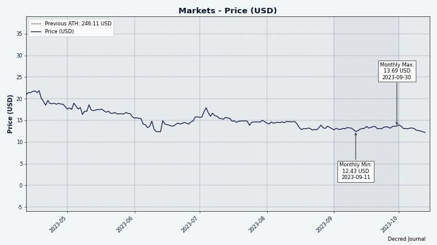

_Image: Recent DCR/USD, data from Coin Metrics_

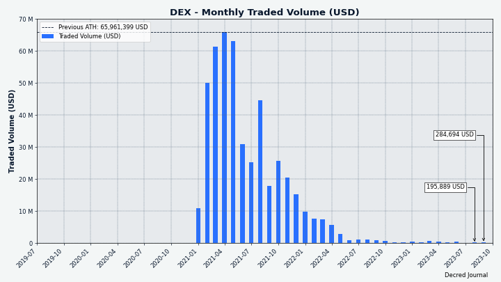

_Image: DCRDEX monthly volume in USD_

## Relevant External

The debate around Drivechains for Bitcoin and BIP-300 was [reignited](https://cointelegraph.com/news/bitcoin-bip300-drivechain-proposal-sparks-debate-and-alternate-solutions) after Luke Dashjr wrote an implementation. There are discussions about whether this kind of sidechain which would allow for flexible creation and use of other assets would be a positive for Bitcoin, whether there are technical downsides or if allowing people to create scam-like assets on Bitcoin is the worst aspect. There are also discussions about how to activate the soft fork, with already some miners [signaling](https://twitter.com/francispouliot_/status/1697633126497882143) support. A new player entered the mix in September with claims of being able to operate a sidechain with a two-way peg on Bitcoin without any soft fork changes, but they as yet had no explanation which people could make sense of.

Paxos [accidentally](https://cointelegraph.com/news/miner-returns-over-500k-btc-transaction-fee-overpayment-paxos) paid 19.8 BTC for a Bitcoin transaction, but F2Pool apparently returned the BTC.

The Brave browser [announced](https://brave.com/web3-privacy/) a partnership with Electric Coin Company to add Zcash support to its wallet, and to develop a "private and decentralized messaging feature" with the support of Filecoin and the InterPlanetary File System (IPFS).

Nouns DAO, which auctions one NFT a day to fund a treasury and had amassed a sum of around $50 million in this fashion, underwent a [fork](https://www.coindesk.com/business/2023/09/21/nouns-daos-27m-revolt-reveals-toxic-mix-of-money-hungry-traders-and-blockchain-idealists/) which saw over half of this value exiting through a newly introduced quit mechanism. The Nouns DAO is controlled by voting of the holders of Noun NFTs, and this community has long been split between a camp which embodied the original spirit of using the fund to promote the Nouns meme, and a camp which was disturbed by frivolous spending amounts as high as $90,000 on naming a frog species, and which saw themselves as entitled to some share of the fund proportional to the number of Nouns NFTs and voting power they had. As the product of a long-running discussion, v3 of the Nouns DAO's contracts incorporated a mechanism that allowed 20% of the NFTs to trigger a week-long forking discussion and voting period. The majority of Nouns holders chose to exit and their share of the funds is now moved to a new DAO that has a ragequit mechanism, in addition to the familiar mechanisms of Nouns DAO, which will allow them to further exit and claim their individual share of that balance, if they so desire.

Terra Classic is to [cease](https://cointelegraph.com/news/terra-classic-cease-ustc-minting) minting and reminting USTC in hopes of returning it to parity with the US dollar, after a vote with 59% in favour of the proposal. Since the the decline of the price of LUNC, there are concerns about spam and a proposal to increase the minimum deposit amount to 5 million LUNC was approved with 93% support. 

Coinbase, in its role as an Ethereum validator, [received](https://www.coindesk.com/tech/2023/09/15/coinbase-inadvertently-earned-1m-due-to-hack-but-hasnt-reimbursed-victims/) a 570 ETH MEV payment from the Curve hackers in July to prioritize the transactions which allowed them to profit from the attack. That's about $1 million profit for Coinbase at the moment, and they seem reluctant to return it to the affected party, Alchemix, citing a legal opinion that they are under no obligation to do so.

The SEC has reached a settlement in which the makers of the Stoner Cats NFT collection and associated web series were [fined](https://www.coindesk.com/consensus-magazine/2023/09/14/the-inanity-of-the-sec-stoner-cat-action/) $1 million and had to kill all the Cats in its possession. The case attracted attention because it featured celebrities Ashton Kutcher and Mila Kunis promoting the project and participating in the creation of the comedy series, which the $800 NFT would allow holders to access. The token sale generated 3,650 ETH ($8.2 million at the time) for the company, and they received a further $20 million in royalties in transactions where holders sold their NFTs on the secondary market. After the news broke, the price for the NFTs rose substantially, possibly because people expect the holders to be able to access part of the settlement, but $1 million seems quite small in the scheme of things. The people who lost out in this situation are those who bought the NFTs at their all-time high prices of around 0.3 ETH, they are unlikely to benefit from any financial penalties, and the recent rise in price to 0.05 ETH is little consolation.

Claimants in the ongoing bankruptcy processes of FTX, BlockFi and Genesis have had their details [leaked](https://www.bloomberg.com/news/articles/2023-08-25/ftx-genesis-blockfi-customer-data-at-risk-in-bankruptcy-hack) by Kroll, a provider of bankruptcy services. A hacker performed a SIM swap attack on a Kroll employee and was able to access files with details of all the claimants. This further raises concerns that participants in the claims process for bankrupt crypto companies are being targeted by scammers who attempt to gain access to whatever crypto the claimants might hold off the exchange. The leaked details allow the scammers to produce more convincing materials which reference compromised information, one reported example is offering marks a way to speed the claims process or get a better outcome.

The Commodity Futures Trading Commission (CFTC) has [announced](https://www.coindesk.com/policy/2023/09/07/cftc-goes-after-opyn-other-defi-operations-in-enforcement-sweep/) settlements with three DeFi operations (Opyn, ZeroEx, and Deridex), who it charged with offering illegal derivatives trading. The companies agreed to shutting down these services and paying fines of $100,000 to $250,000 after cooperating with the CFTC's investigations.

The CFTC is [hampering](https://www.coindesk.com/consensus-magazine/2023/09/22/americans-seemingly-arent-allowed-to-put-this-economic-theory-to-the-test/) the development of prediction markets by objecting to any markets relating to political outcomes. These are explicitly banned in over 10 states but the CFTC has a broader objection in that it does not want to become an "election cop" adjudicating disputes about how the contracts have been operated.

Senator Elizabeth Warren has [gathered](https://cointelegraph.com/news/crypto-bill-us-nine-senators-back-elisabeth-warren) support of 9 other senators for her Digital Asset Anti-Money Laundering Act, which would crack down on non-custodial wallets, extend Bank Secrecy Act responsibilities, and other measures to tackle illicit use of crypto. 

Chase bank in the UK, owned by JP Morgan, has [announced](https://www.reuters.com/technology/jpmorgans-uk-bank-chase-ban-crypto-transactions-2023-09-26/) a ban on crypto-related transactions for its customers, who from mid-October will no longer be able to make debit card or bank transfers to crypto companies like exchanges. The reason given was that this is a response to a growing number of scams targeting UK users with a crypto component.

The UK's Online Safety Bill has been [passed](https://www.reuters.com/world/uk/uks-online-safety-bill-passed-by-parliament-2023-09-19/) by Parliament and is on track to become law. The legislation will require the UK's regulator Ofcom to produce a code of conduct detailing how providers of online messaging platforms must pro-actively police illegal content on those platforms. One particular aspect which has been [criticised](https://theconversation.com/the-uk-just-passed-an-online-safety-law-that-could-make-people-less-safe-213595) would undermine end to end encryption by requiring service providers to sift through encrypted private content for evidence of illegal activity. Both Signal and WhatsApp have indicated that they would leave the UK market rather than comply with the new rules which would require them to undermine their encryption.

That's all for September. Suggest news for the next issue in our [#journal](https://chat.decred.org/#/room/#journal:decred.org) chat room.

## About

This is issue 63 of Decred Journal. Index of all issues, mirrors, and translations is available [here](https://xaur.github.io/decred-news/).

Most information from third parties is relayed directly from the source after a minimal sanity check. The authors of the Decred Journal cannot verify all claims. Please beware of scams and do your own research.

Credits (alphabetical order):

- writing, editing, publishing: bee, bochinchero, Exitus, jz, karamble, kozel, l1ndseymm, phoenixgreen, richardred, zippycorners
- reviews and feedback: davecgh, Dominic, jholdstock
- title image: Exitus
- funding: Decred stakeholders
