# {DRAFT} Decred Journal – November 2023

_Image: November cover by @Exitus_

_Time was a big challenge for me in December and we are releasing this very late. Sorry for the wait! \[@bee\]_

Highlights of November:

- Proof of concept mesh network design has been proposed for DCRDEX.

- Private testing of Android and iOS builds of Cryptopower has begun.

- Decred's Lightning Network received a massive update to the upstream lnd v0.13 codebase.

- Poloniex and HTX got hacked and disabled DCR withdrawals for weeks. Bittrex announced that it is closing and urged users to withdraw.

Contents:

- [Development](#development)
- [People](#people)
- [Governance and Finances](#governance-and-finances)
- [Network](#network)
- [Ecosystem](#ecosystem)
- [Outreach](#outreach)
- [Events](#events)
- [Media](#media)
- [Markets](#markets)
- [Relevant External](#relevant-external)

## Development

The work reported below has the "merged to master" status unless noted otherwise. It means that the work is completed, reviewed, and integrated into the source code that advanced users can [build and run](https://medium.com/@artikozel/the-decred-node-back-to-the-source-part-one-27d4576e7e1c), but is not yet available in release binaries for regular users.

### dcrd

_[dcrd](https://github.com/decred/dcrd) is a full node implementation that powers Decred's peer-to-peer network around the world._

Developer and internal changes:

- [Fixed a bug](https://github.com/decred/dcrd/pull/3209) that was introduced in [October](202310.md#dcrd) with the new ability to handle [concurrent messages](https://github.com/decred/dcrd/pull/3203) from peers. dcrd would hang if a peer disconnected after having sent multiple messages. This bugfix allows dcrd to respond gracefully when peers disconnect.
- Updated the [Docker image](https://github.com/decred/dcrd/pull/3210) to build with Go 1.21.4.
- Peers should not be sending each other `nil` messages. In an effort to preemptively find and debug cases where this might happen, dcrd will now [panic if a `nil` message is queued](https://github.com/decred/dcrd/pull/3213) ("panic" means dcrd will terminate and alert the user of a problem). This change includes a handy error trace to help inform devs about which bit of code caused the panic.

In progress:

- A new wire message has been proposed which will speed up SPV client syncing by allowing dcrd to [send compact block filters in batches](https://github.com/decred/dcrd/issues/3206) as opposed to one for each block. An initial [implementation](https://github.com/decred/dcrd/pull/3211) has been submitted for code review.

Decred was [started](https://blog.companyzero.com/2015/12/decred-rethink-digital-currency/) as a fork of the [btcsuite project](https://blog.companyzero.com/2015/03/btcsuite-code-migration-and-btcd-0-10-0-release/). When asked how dcrd code has diverged over the years, @davecgh replied:

> dcrd is *significantly* improved over btcd. It's pretty night and day really. I don't just mean in the ways that DCR improves over BTC either.  I mean in pretty much every aspect.  e.g. APBFs, much improved network code, the entire way the chain code allows for headers first semantics, how overall syncing is handled, support for block invalidation and reconsideration, the way peers with old chains are handled, way faster crypto, 50x (at least) improvement to sync time, essentially a full rewrite of the underlying script semantics (e.g. stdscript, stdaddr, proper versioning support, etc), and a bunch more. [@davecgh in [chat](https://matrix.to/#/!zefvTnlxYHPKvJMThI:decred.org/$TTnbRmx8LDGfU-0-0phuCKMut55fcdt0sJpMqhU-Hhk)]

### dcrwallet

_[dcrwallet](https://github.com/decred/dcrwallet) is a wallet server used by command-line and graphical wallet apps._

Many of the user-facing changes this month are focused on optimizing [SPV mode](https://docs.decred.org/wallets/spv/), which is where the wallet can operate without having to download the full blockchain. This is a great choice for wallets with limited hardware performance, esp. mobile devices. Decred's SPV mode uses [advanced crypto tech](https://github.com/decred/dcps/blob/master/dcp-0005/dcp-0005.mediawiki#simplified-payment-verification-spv) to enable light clients with a high level of security and decentralization.

Optimizations of the [initial SPV sync](https://github.com/decred/dcrwallet/issues/2289) - part of SPV wallet's startup routine when it catches up with the chain:

- [Validate block difficulties](https://github.com/decred/dcrwallet/pull/2297) earlier. This means that if any blocks violate the consensus for PoW or PoS difficulty, the wallet can ignore those blocks earlier and do less work. This will help speed up sync times. Additionally, if the wallet does receive blocks which violate the difficulty consensus, it will now [report them in the log](https://github.com/decred/dcrwallet/pull/2294).
- Perform the ["fetch any missing compact filters"](https://github.com/decred/dcrwallet/pull/2298) stage just once. This used to happen upon connecting to every single new peer, but now it only needs to happen once per sync, which reduces duplicate work. "Compact filters" or just "cfilters" are an efficient way to track transactions in blocks without downloading the full block.
- [Fetch new block headers and compact filters once](https://github.com/decred/dcrwallet/pull/2300) at startup instead of fetching the same headers from each peer. This avoids wasted duplicate effort for every peer, and significantly reduces the amount of resources (CPU, RAM, bandwidth, goroutines) used during the initial sync.
- Perform [account/address discovery and rescan blocks](https://github.com/decred/dcrwallet/pull/2301) once at startup instead of after every new connected peer. This makes the code easier to reason about.
- [Only request cfilters for the best sidechain](https://github.com/decred/dcrwallet/pull/2302). This avoids having to perform work for sidechains that are not (and will never become) the main chain.
- [Allow dcrwallet to fetch cfilters in smaller batches](https://github.com/decred/dcrwallet/pull/2307). No functional change will occur yet, but this makes the code ready to switch to batched cfilter requests as soon as they are supported in dcrd. The dcrd work is [already in progress](https://github.com/decred/dcrd/pull/3211).
- [Fetch cfilters in parallel from multiple peers at once](https://github.com/decred/dcrwallet/pull/2308). This spreads the load across multiple peers, making the initial sync process (on average) slightly faster due to lower remote peer resource usage.

Other SPV mode optimizations:

- Eliminate having to [calculate block hashes](https://github.com/decred/dcrwallet/pull/2295) multiple times. This results in a faster sync time and reduced memory use. During SPV operation, the time spent calculating block hashes is reduced by ~72%.
- When connected in SPV, [disconnect from straggling peers](https://github.com/decred/dcrwallet/pull/2299). During initial sync, it might be useful to connect to a peer for earlier block ranges, but that peer may later get overtaken by the wallet due to the wallet discovering more up-to-date blocks from other peers. If a particular peer doesn't send any headers after the wallet has received several newer headers, it probably means that the straggler peer has poor connectivity to the network and should be disconnected in favor of attempting to find a better peer.

Developer and internal changes:

- If the user tries to spend a multisignature UTXO that contains one or more [invalid signatures](https://github.com/decred/dcrwallet/pull/2274), indicate that the transaction is not ready to send, and return signing errors. This is a step towards improving the UX for advanced users and developers working with [multisignatures](https://en.bitcoin.it/wiki/Multi-signature), which are currently possible but are not widely used nor [well-developed](https://gist.github.com/norwnd/890ad642985f4e9e9f7b1dd243b21f9e) in Decred.
- Added [unit tests](https://github.com/decred/dcrwallet/pull/2293) for the semantic versioning of the `chain` package.
- Other code refactoring.

### Decrediton

_[Decrediton](https://github.com/decred/decrediton) is a full-featured desktop wallet app with integrated voting, StakeShuffle mixing, Lightning Network, DEX trading, and more. It runs with or without a full blockchain (SPV mode)._

Merged in `master` for the next release:

- Upgraded to [Electron v26](https://github.com/decred/decrediton/pull/3928) to enable the new Ledger integration. This was made possible by hunting down a tiny breaking change in Electron v21.3.0 that broke DCRDEX window, and adding a [workaround](https://github.com/decred/dcrdex/pull/2596) for it.
- A [newer version](https://www.electronjs.org/blog/electron-23-0) of Electron means Windows 7/8/8.1 will not be supported in the next Decrediton release. Cryptocurrency security enthusiasts don't store their private keys on those insecure operating systems anyway, right?
- Bumped a few Go and web dependencies.
- Fixed [wrong password error](https://github.com/decred/decrediton/pull/3916) not being shown when attempting to purchase tickets using a wrong password.
- Fixed the inability to remove peer host from the [SPV Connect](https://github.com/decred/decrediton/pull/3915) field in Settings.

### vspd

_[vspd](https://github.com/decred/vspd) is server software used by Voting Service Providers. A VSP votes on behalf of its users 24/7 and cannot steal funds._

Changes included in November's [v1.3.2 release](https://github.com/decred/vspd/releases/tag/release-v1.3.2):

- Added logic to retry broadcasting the ticket's [parent transaction](https://github.com/decred/vspd/pull/455) if it failed due to referencing unknown outputs. There is a good chance that missing ancestor transactions will propagate through the network and show up in the local mempool after a few seconds.
- Reverted to the [previous VSP fee calculation](https://github.com/decred/vspd/pull/454) algorithm that does not consider the activation of DCP-12. This resolves an issue where Decrediton sometimes fails to pay VSP fees because it calculated the fee differently from the server.

### dcrpool

_[dcrpool](https://github.com/decred/dcrpool) is server software for running a Decred mining pool._

User-facing changes:

- Fixed several bugs in [payment fee calculation](https://github.com/decred/dcrpool/pull/427) that caused paying extremely large fees in some cases. The associated tests have been reworked and extended to test more cases.

Internal refactoring (changes that don't add features or fix bugs, but that untangle the code, make bugs easier to find and fix, and make the code easier to change in the future):

- Removed duplicate and error prone [channel closures](https://github.com/decred/dcrpool/pull/422) from notification handlers.
- Simplified code calculating [rewards payments](https://github.com/decred/dcrpool/pull/423).
- Updated tests to use more [realistic](https://github.com/decred/dcrpool/pull/426) DCR amounts.

### Lightning Network

_[dcrlnd](https://github.com/decred/dcrlnd) is Decred's Lightning Network node software. LN enables instant low-cost transactions._

- dcrlnd codebase has been [synced](https://github.com/decred/dcrlnd/pull/193) with changes made in upstream [lnd](https://github.com/lightningnetwork/lnd) between v0.12.1 and [v0.13.4](https://github.com/lightningnetwork/lnd/releases/tag/v0.13.4-beta) (released Nov 2021). Around 140 out of 170 upstream pull requests have been ported, bringing 451 new commits, including about a dozen of Decred-specific commits to adapt upstream changes and simplify future porting efforts. Full list of ported and skipped pull requests can be found [here](https://github.com/decred/dcrlnd/blob/master/docs/upstream-prs.csv). All notable changes are documented in lnd release notes: [v0.13.0](https://github.com/lightningnetwork/lnd/releases/tag/v0.13.0-beta), [v0.13.1](https://github.com/lightningnetwork/lnd/releases/tag/v0.13.1-beta), [v0.13.3](https://github.com/lightningnetwork/lnd/releases/tag/v0.13.3-beta), and [v0.13.4](https://github.com/lightningnetwork/lnd/releases/tag/v0.13.4-beta). dcrlnd has been tested with these changes applied in production on a few mainnet hubs.
- Updated several [Go libraries](https://github.com/decred/dcrlnd/pull/194).

Note that while Anchor Outputs became the default channel type for Bitcoin in lnd v0.13, they are [disabled](https://matrix.to/#/!FRpxSOMVXBCUXtQsDk:decred.org/$xOjxggI8ida5REJTWq-90TIG_Wfj-FsjiNl3FH__hJA) on Decred LN mainnet for extra safety against attacks such as the [replacement cycling](https://cointelegraph.com/news/bitcoin-core-developer-antoine-riard-steps-back-lightning-network-dilemma) vulnerability disclosed in October 2023.

### DCRDEX

_[DCRDEX](https://github.com/decred/dcrdex) is a non-custodial, privacy-respecting exchange for trustless trading, powered by atomic swaps._

General client changes:

- Disable the [Place order](https://github.com/decred/dcrdex/pull/2534) button on various conditions, such as insufficient balance.
- Moved the [Sign Out](https://github.com/decred/dcrdex/pull/2590) button to the end of the hamburger menu.
- Tuned [colors](https://github.com/decred/dcrdex/pull/2601): added some variation in element background colors in both light and dark modes, added slight background transparency behind active modals, and tuned down background color in light mode to use a softer white color.
- Removed the [font weight change effect](https://github.com/decred/dcrdex/pull/2610) on mouse hover because it didn't look consistent on various browsers and font settings.
- Changed the login flow to [not force users to register on the server](https://github.com/decred/dcrdex/pull/2614). After the local login, the user will be redirected to the Wallets page instead.
- Fixed the [staking panel](https://github.com/decred/dcrdex/pull/2586) not updating after wallet creation.
- Fixed the prompt to create [missing wallets](https://github.com/decred/dcrdex/pull/2577) on the Markets view.

Desktop app:

- Fixed the opening of [external](https://github.com/decred/dcrdex/pull/2541) [links](https://github.com/decred/dcrdex/pull/2597); they will trigger the operating system's default URL handler (which may launch a default browser or show a dialog).
- Fixed [dark mode](https://github.com/decred/dcrdex/pull/2604) preference not saving on Linux. The fix is to save it in WebView's local storage instead of a cookie, because cookies are not persistent between app launches in the Linux version of the WebView component.

Account trading tier, bonds, and reputation:

- Exposed more [bond and reputation data](https://github.com/decred/dcrdex/pull/2575) in the registration and settings views. When the user enters a tier number, a new preview form will show the amount that will actually be locked for bonds, trading limits, and their USD equivalents. The trading form on the Markets view will show how many lots can be used for the current trading tier. Multiple help strings have been added to explain bonds, trading tiers, and penalties for bad behavior.

Market maker bots:

- Updated the [Market Maker Settings](https://github.com/decred/dcrdex/pull/2587) UI to have a more responsive layout and explain bot strategies (there are 5 strategies currently).
- Added a bot strategy combining [market maker and simple arbitrage](https://github.com/decred/dcrdex/pull/2530). Based on a CEX order book, it places orders on the DEX order book, and when there is a match on the DEX, the opposite order on the CEX is immediately executed for a profit.

Decred:

- Added general infrastructure for [mixing funds](https://github.com/decred/dcrdex/pull/2478) and implemented the low-level bits for DCR (no GUI yet).

Bitcoin:

- Store [transaction history](https://github.com/decred/dcrdex/pull/2550) for Bitcoin SPV wallets. Although the underlying SPV wallet implementation ([Neutrino](https://github.com/lightninglabs/neutrino)) stores transaction data already, using that storage leads to unreliable and confusing code. Storing transactions in a separate database fixes this and also unlocks more accuracy, such as differentiating regular sends and swap transactions.

Zcash:

- Extracted Zcash code into its own [wallet implementation](https://github.com/decred/dcrdex/pull/2553). This is needed to untangle it from Bitcoin code, because the Zcash wallet is very different from Bitcoin's. The change allows Zcash wallets to be shielded by default and resolves some internal issues.

Ethereum:

- Show [token contract address](https://github.com/decred/dcrdex/pull/2592) on the UI so the users could be sure which Ethereum or Polygon token they are using. For example, the ERC-20 contract address for USDC is [0xa0b8699...eb48](https://etherscan.io/token/0xa0b86991c6218b36c1d19d4a2e9eb0ce3606eb48).

Internal and developer changes:

- Updated the client's [web dependencies](https://github.com/decred/dcrdex/pull/2584), which fixes one critical vulnerability in the Babel compiler.

In progress:

- A proof of concept toy mesh network implementation called [Tatanka](https://github.com/decred/dcrdex/pull/2602) has been submitted for discussion. This is work towards the [DCRDEX mesh proposal](https://proposals.decred.org/record/4d2324b) approved in June 2023. Readers are advised to watch a [short video](https://www.youtube.com/watch?v=uZRTLpXXlds) to understand what Tatanka really is (try [Invidious](https://redirect.invidious.io/watch?v=uZRTLpXXlds) if the video is restricted in your location).
- An implementation of [private atomic swaps](https://github.com/decred/atomicswap/pull/130) with Schnorr adaptor signatures has been submitted for review to the atomicswap repository. The atomic swap method currently used by DCRDEX leaves the same unique value on both chains, allowing anyone to link buyer's and seller's transactions. Adaptor signatures allow users to fix this privacy vulnerability at the cost of some additional off-chain communication required between the parties. However, there is some [criticism](https://matrix.to/#/!lDZCzVQjFoJsXMPkvr:decred.org/$-PRFKJglyc2CZefIwH7dA0boM_hyJ0yqYl15TEPYBIo) of this approach due to its dependency on Taproot (which introduces non-trivial issues) and [elliptic-curve cryptography](https://en.wikipedia.org/wiki/Elliptic-curve_cryptography) (so this code would break should Decred upgrade to [post-quantum cryptography](https://en.wikipedia.org/wiki/Post-quantum_cryptography)). Note that `atomicswap` is a command-line tool separate from the DCRDEX project, but the code pioneered in it could be applied to DCRDEX as well.

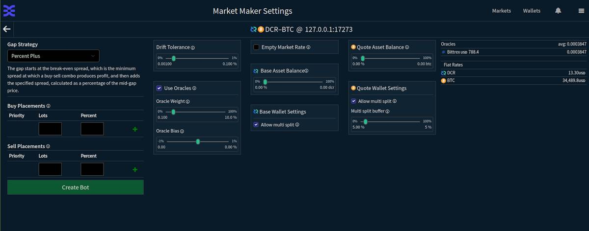

_Image: Market Maker Settings UI in DCRDEX_

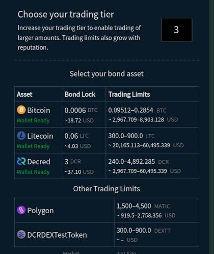

_Image: DCRDEX will better expose the bond math and trading limits_

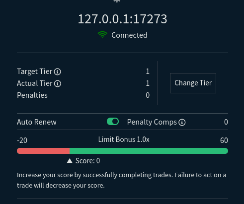

_Image: Improved bond information in DCRDEX Settings_

### Cryptopower

_[Cryptopower](https://github.com/crypto-power/cryptopower) is a multi-coin desktop GUI wallet for DCR, BTC, and LTC. It runs in a privacy-preserving light SPV mode without needing full blockchains, supports Decred staking, mixing, voting, and other unique features._

Design implementation of the top-level Home subpages:

- Implemented new [Transactions tab](https://github.com/crypto-power/cryptopower/pull/198) showing all transactions across all wallets with optional filters by wallet and by transaction type.
- Jump to [transaction details](https://github.com/crypto-power/cryptopower/pull/258) when a transaction is clicked on Overview.
- Jump to [proposal details](https://github.com/crypto-power/cryptopower/pull/272) when a proposal is clicked on Overview.
- Hide [Send button](https://github.com/crypto-power/cryptopower/pull/302) for watch-only wallets.

Design implementation of Wallets subpages:

- Added new cards to [wallet Info](https://github.com/crypto-power/cryptopower/pull/247) page to show mixer status, recent transactions, and recent staking activity.
- Implemented new layout on [wallet Settings](https://github.com/crypto-power/cryptopower/pull/228) page.
- Updated layout of wallet [Staking](https://github.com/crypto-power/cryptopower/pull/244) page sections: general Staking Info, Statistics, and Tickets.

Mobile adaptation:

- Adapted [wallet selection](https://github.com/crypto-power/cryptopower/pull/226) page to mobile layout.

Coin conversion:

- Added low-level support for [Trocador.app](https://github.com/crypto-power/instantswap/pull/7) in the [instantswap](https://github.com/crypto-power/instantswap) library.

Fixes:

- Fixed rendering of [coin card backgrounds](https://github.com/crypto-power/cryptopower/pull/236) on the Overview tab.
- Fixed onboarding pages coming up during [app shutdown](https://github.com/crypto-power/cryptopower/pull/259).
- Fixed crash when switching between [Wallets and Overview](https://github.com/crypto-power/cryptopower/pull/263) tabs.
- Minor fixes.

Internal and developer changes:

- Refactoring to simplify [internal APIs](https://github.com/crypto-power/cryptopower/pull/232), optimize [memory use](https://github.com/crypto-power/cryptopower/pull/223), and remove unnecessary code.
- Removed a lot of unneeded [listener helper code](https://github.com/crypto-power/cryptopower/pull/240).
- Removed duplicated [app width calculation](https://github.com/crypto-power/cryptopower/pull/274).
- Fixed [linter errors](https://github.com/crypto-power/cryptopower/pull/241) and updated CI configuration.

Private testing of mobile app builds has been set up in Google Play Store and Apple Store (TestFlight). If you'd like to participate please ask in [#cryptopower](https://chat.decred.org/#/room/#cryptopower:decred.org) Matrix chat (see [how to join Matrix](https://docs.decred.org/getting-started/joining-matrix-channels/)).

Follow [@cryptopowerWlt](https://twitter.com/cryptopowerWlt) on Twitter to support the project and get more updates.

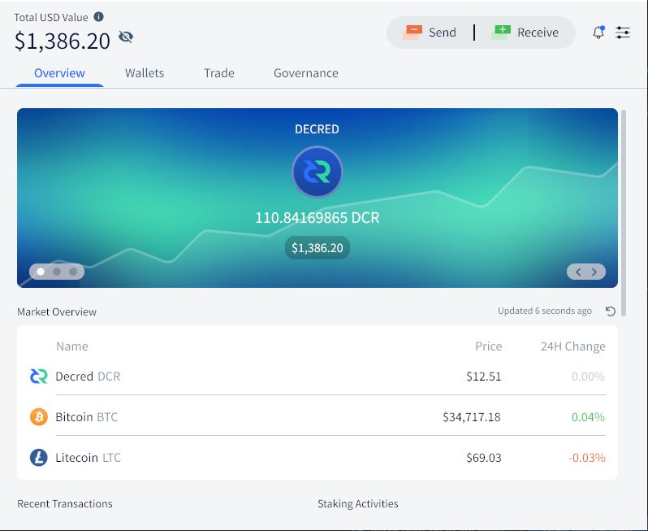

_Image: Overview tab in Cryptopower_

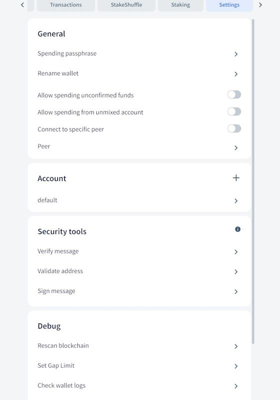

_Image: Updated Settings in Cryptopower_

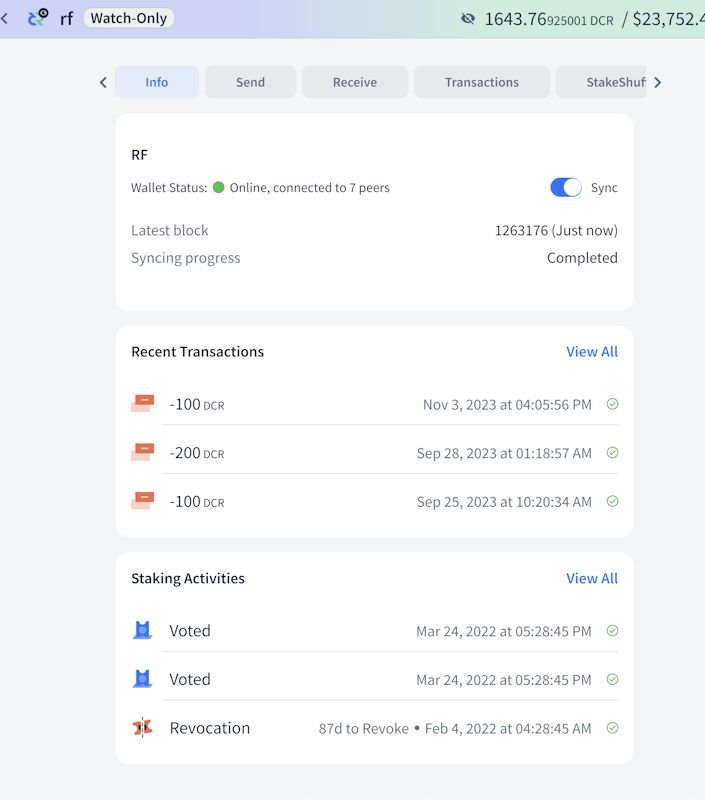

_Image: Updated wallet overview in Cryptopower_

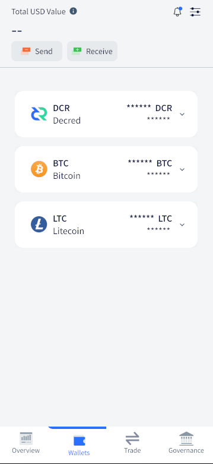

_Image: Mobile layout in Cryptopower (work in progress)_

### Documentation

_[dcrdocs](https://github.com/decred/dcrdocs) is the source code for Decred [user documentation](https://docs.decred.org/)._

- Updated [block reward split and total issuance](https://github.com/decred/dcrdocs/pull/1234) numbers on a few pages.
- Fixed date of [DCP-12 deployment](https://github.com/decred/dcrdocs/pull/1233).

### Bison Relay

_[Bison Relay](https://github.com/companyzero/bisonrelay) is a new social media platform with strong protections against censorship, surveillance, and advertising, powered by Decred Lightning Network._

Work listed below has been merged to `master` towards the next release.

Changes in both GUI and text apps:

- Filter [unwanted content](https://github.com/companyzero/bisonrelay/pull/377) when reading saved chat history. Previously content filtering handled newly received messages only.
- Replaced Bittrex with MEXC as a source of [exchange rates](https://github.com/companyzero/bisonrelay/pull/383).

User-facing changes in the GUI app:

- Allow users to [select text](https://github.com/companyzero/bisonrelay/pull/379) in news feed and posts.
- Fixed newly created group chat [not appearing](https://github.com/companyzero/bisonrelay/pull/376) in Chat Rooms.

GUI app adaptation to mobile devices:

- Various [mobile fixes and UX refinements](https://github.com/companyzero/bisonrelay/pull/375), including: replace Menu button with Back button in some pages, font size tweaks, onboarding tweaks, overflow fixes, and Android build fixes.
- Increased [spacing](https://github.com/companyzero/bisonrelay/pull/378) in chats based on user feedback.

Internal changes in the GUI app:

- Consolidated [font size](https://github.com/companyzero/bisonrelay/pull/346) declarations and usages for consistency and greater control of fonts based on which OS or platform the app is running.

In progress:

- Users reported various [LN channel issues](https://matrix.to/#/!GHnoHXSgkVAsUknRUg:decred.org/$nOaRAKaygrxyyvZkPzJ4jGr5S0MsC7FGYS0iPFRG7pc) when interacting with the Oprah bot. The root cause of some of them was found in dcrlnd and is being worked on.

Other news:

- Decred Journal archives are now published on Bison Relay. Contact @karamble for usage instructions.

### Cake Wallet Integration

Completed work merged in the intermediate [integration tree](https://github.com/JoeGruffins/cake_wallet/tree/cw-decred):

- Added a [stub for libwallet](https://github.com/JoeGruffins/cake_wallet/pull/4) to move forward with higher-level code while the real libwallet is being written. Also, removed a lot of unnecessary code left from earlier experiments.
- Continued investigation of the best ways to call Decred's code written in Go from Cake's high-level code written in Dart/Flutter.
- Three developers configured build environments and got working builds of Cake Wallet showing dummy Decred views on iOS, Android, and macOS. Just getting a working build is a notable milestone considering how complex and confusing the build process is.

In progress work for Cake Wallet:

- First change adding [initial Decred screens](https://github.com/cake-tech/cake_wallet/pull/1165) has been submitted to the upstream repository's integration branch called `decred_main`. Working Decred code will be tested and polished in that branch before being added to Cake Wallet's `main` branch.
- Integrating [libwallet](https://github.com/JoeGruffins/cake_wallet/pull/8) built as a C library, including any necessary glue code in Kotlin and Swift, and build code for various OSes and CPU architectures.
- Scripts and how-to guide for building Cake Wallet [on macOS](https://github.com/cake-tech/cake_wallet/pull/1163). This documents the missing knowledge of the complex build process that was quite hard to discover.

Merged work for [libwallet](https://github.com/itswisdomagain/libwallet):

- Implemented [basic functions](https://github.com/itswisdomagain/libwallet/pull/1) for DCR, BTC and LTC wallets, including: create wallet, create watch-only wallet, open wallet, start/stop wallet sync, set wallet birthday. This borrows some code and ideas from DCRDEX and Cryptopower, and builds on top of existing cryptocurrency projects written in Go, including: [Decred](https://github.com/decred), [btcsuite](https://github.com/btcsuite), [ltcsuite](https://github.com/ltcsuite), [Neutrino](https://github.com/lightninglabs/neutrino) for BTC and [Neutrino fork](https://github.com/ltcsuite/neutrino) for LTC (plus [patches](https://github.com/dcrlabs/neutrino-ltc) from DCRDEX developers).
- Storage implementation for saving [wallet config and transaction data](https://github.com/itswisdomagain/libwallet/pull/3).

In progress work for libwallet:

- A wrapper layer for building libwallet as a [C library](https://github.com/itswisdomagain/libwallet/pull/2) that could be called from Cake Wallet's high-level app code.
- A package for managing [wallet sync](https://github.com/itswisdomagain/libwallet/pull/4) and reporting sync progress for DCR, BTC and LTC wallets.

libwallet is a multi-coin library implementing light (SPV) wallets for Decred, Bitcoin and Litecoin. It was originally created to integrate Decred in Cake Wallet, but it has potential to become a platform for building Decred and multi-coin software. The second app to use libwallet will likely be the Cryptopower wallet. This will be similar to how the now-discontinued [dcrlibwallet](https://github.com/planetdecred/dcrlibwallet) was shared by GoDCR and Android/iOS Decred apps, but will support more assets than just Decred. C interop layer will be added soon which will allow libwallet to be used by any programming language that can [call C code](https://en.wikipedia.org/wiki/Foreign_function_interface), facilitating Decred integrations in a wide array of existing and new crypto software (this was one of the goals of the [TinyDecred v2](202206.md#tinywallet) effort).

Wallet apps built on libwallet will have much better privacy compared to many existing apps on the market, where it is common to use central servers that can track users' funds. Unfortunately, Cake's Bitcoin wallet is one such case because it relies on their [Electrum server](https://github.com/cake-tech/cake_wallet/blob/3760285a64405935fafe7aeeb051fd25d850585b/assets/bitcoin_electrum_server_list.yml) which is [not good for privacy](https://electrum.readthedocs.io/en/latest/faq.html). Under the hood libwallet uses [dcrwallet](https://github.com/decred/dcrwallet) for Decred and [Neutrino](https://github.com/lightninglabs/neutrino) for Bitcoin, which connect directly to full nodes and fetch data privately without revealing owned funds and transactions.

### Other

- Arabic translation of [timestamply.org](https://timestamply.org/)'s interface has been [submitted](https://github.com/decred/dcrtimegui/pull/157) for code review.

## People

Welcome the new first-time contributors:

- @Philip-21 (developer, [dcrwallet](https://github.com/decred/dcrwallet/pull/2293))

Community stats as of Dec 3 (compared to Nov 2):

- [Twitter](https://twitter.com/decredproject) followers: 53,939 (+464)
- [Reddit](https://www.reddit.com/r/decred/) subscribers: 12,773 (+11)
- [Matrix](https://chat.decred.org/) #general members: 833 (+7)
- [Discord](https://discord.gg/GJ2GXfz) members: 1,862 (+24), verified to post: 769 (+7)
- [Telegram](https://t.me/Decred) members: 2,319 (+22)
- [YouTube](https://www.youtube.com/decredchannel) subscribers: 4,660 (+20), views: 244.7K (+2.3K)

## Governance and Finances

In November the new [treasury](https://dcrdata.decred.org/treasury) received 7,060 DCR worth $101K at November's average rate of $14.35. 8,471 DCR was spent to pay contractors, worth $122K at same rate.

A [treasury spend tx](https://dcrdata.decred.org/tx/ca24ed5e5d4819ca68b270a78345be07d5a18890b83ada366e970807425e8bfc) was approved with 7,346 Yes votes and 57% turnout, and mined on Nov 21. It had 50 outputs making payments to contractors, ranging from 3 DCR to 1,411 DCR. Most of this DCR was likely paid for September and some October work. Using an estimated billing exchange rate for the mix of two months of $12.98, the billed amount in this TSpend is around $110K.

One of the considerations around the timing and structuring of treasury payments to contractors for these months is to stay within the limit of 150% of monthly inflows as dictated by [DCP-7](https://github.com/decred/dcps/blob/master/dcp-0007/dcp-0007.mediawiki). The lower DCR/USD exchange rate and decline in block reward subsidy over time means that hitting the limit is a realistic concern for the first time, especially if there is a backlog of older invoices accumulating. In this case invoices that were already submitted for October were sent for payment at the same time as those for September rather than waiting another month, which would have been more usual.

As of Dec 1, combined balance of [legacy](https://dcrdata.decred.org/address/Dcur2mcGjmENx4DhNqDctW5wJCVyT3Qeqkx) and [new treasury](https://dcrdata.decred.org/treasury) is 871,828 DCR ($12.5 million USD at $14.39).

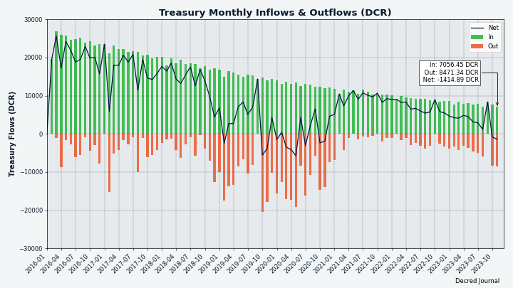

_Image: Treasury inflows and outflows in DCR_

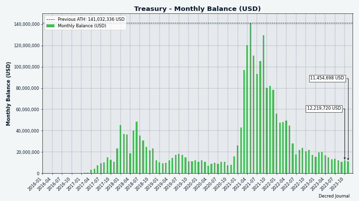

_Image: Treasury monthly balance in USD; note that it heavily depends on the exchange rate_

There were no Politeia proposals [submitted](https://proposals.decred.org/?tab=under%20review), [approved](https://proposals.decred.org/?tab=approved) or [rejected](https://proposals.decred.org/?tab=rejected) in November.

It has been [reported](https://matrix.to/#/!xUNvyzkFgiMjhvPbIi:decred.org/$LluGF4EWaQrEEb8lKRKyBRxeQxSqpjWPK8GOSVUA4zU) on November 23rd that one user was unable to register and submit a proposal. Apparently Politeia [did not detect](https://matrix.to/#/!qYpAAClAYrHaUIGkLs:decred.org/$jmqFcgH8De7TuG2Z9FofSxeBfcYPWn5KMjcG-V6d0bk) the registration fee payment. As of December 1st this has not been resolved.

## Network

This section tracks key health metrics of the fundamental infrastructure.

### Mining

November's [hashrate](https://dcrdata.decred.org/charts?chart=hashrate&scale=linear&bin=day&axis=time) opened at ~13.7 TH/s and closed ~5.5 TH/s, bottoming at 5.0 TH/s and peaking at 15.9 TH/s throughout the month.

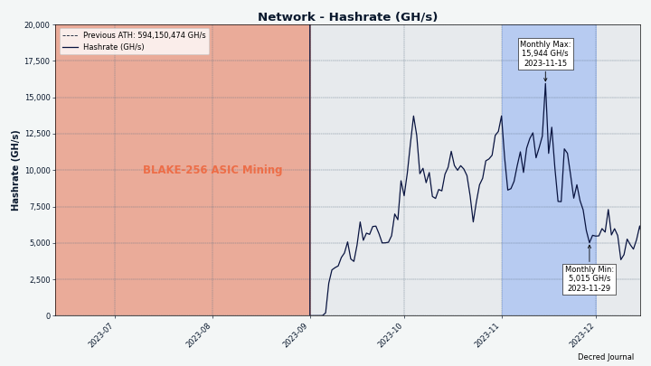

_Image: Decred hashrate is seeking a new equilibrium after the initial influx of GPU miners_

Distribution of 1,000 blocks actually [mined](https://miningpoolstats.stream/decred) by Dec 3: [miningandco.com](https://decred.miningandco.com/) 41%, [losmuchachos.digital](https://losmuchachos.digital/) 8%, [pooltronic.tech](https://decred.pooltronic.tech/) 3.6%, and 47% of blocks were not identified by [miningpoolstats.stream](https://miningpoolstats.stream/decred).

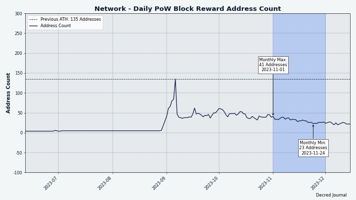

_Image: The reduction of unique mining addresses suggests it is getting more centralized again_

### Staking

[Ticket price](https://dcrdata.decred.org/charts?chart=ticket-price&axis=time&visibility=true-true&mode=stepped) varied between 224-324 DCR.

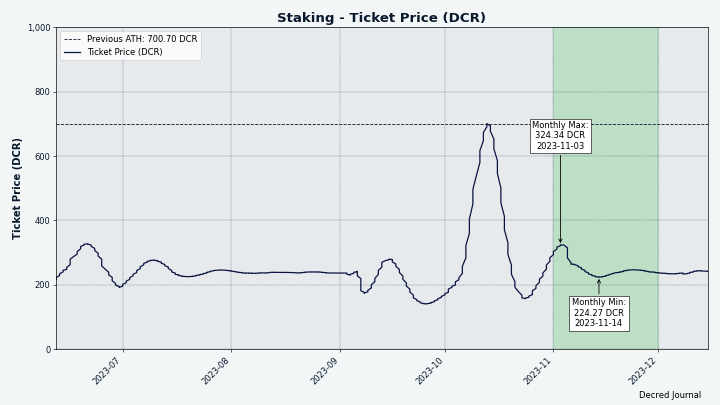

_Image: Ticket price has stabilized pretty quickly_

The [locked amount](https://dcrdata.decred.org/charts?chart=ticket-pool-value&scale=linear&bin=day&axis=time) was 9.27-9.85 million DCR, meaning that 59.4-63.1% of the circulating supply [participated](https://dcrdata.decred.org/charts?chart=stake-participation&scale=linear&bin=day&axis=time) in proof of stake.

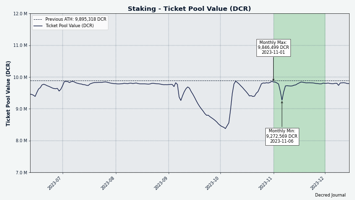

_Image: DCR locked in tickets is staying near its ATH_

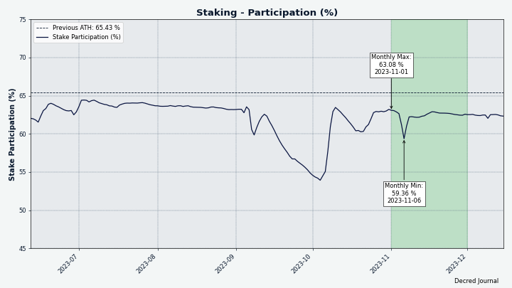

_Image: Among the other things, percentage of staked DCR indirectly shows how much of new emission is re-staked_

### VSP Staking

The [14 listed VSPs](https://decred.org/vsp/) collectively managed ~5,850 (-1,350) live tickets, which was 14.3% of the ticket pool (-2.5%) as of Dec 1. Note: these figures exclude around 400 tickets managed by [123.dcr.rocks](https://123.dcr.rocks/) which was delisted due to closing.

The only gainer of November was [99split.com](https://vspd.99split.com) (+136 tickets or +32%), the other 13 saw outflows of tickets.

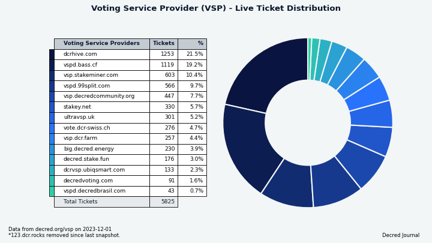

_Image: Distribution of tickets managed by VSPs_

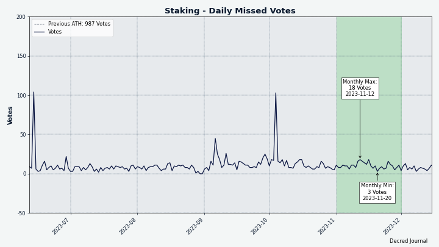

_Image: Missed votes are back to low numbers_

### Nodes

[Decred Mapper](https://nodes.jholdstock.uk/user_agents) observed between 150 and 158 dcrd nodes throughout the month. Versions of 147 nodes seen on Dec 1: v1.8.0 - 67%%, v1.8.1 - 23%, v1.9.0 dev builds - 3%, v1.7.x - 2%, v1.8.0 - 0.7%, other - 3%.

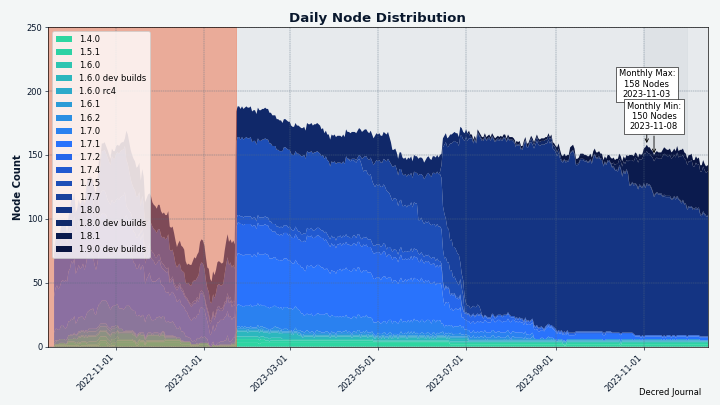

_Image: Nodes are upgrading to v1.8.1. The red area before Jan 2023 indicates incomplete data we had at that time._

### StakeShuffle

The share of [mixed coins](https://dcrdata.decred.org/charts?chart=coin-supply&zoom=jz3q237o-la8vk000&scale=linear&bin=day&axis=time&visibility=true-true-true) varied between 62.1-62.3%. Daily [mix volume](https://dcrdata.decred.org/charts?chart=privacy-participation&bin=day&axis=time) varied between 0-1,032K DCR.

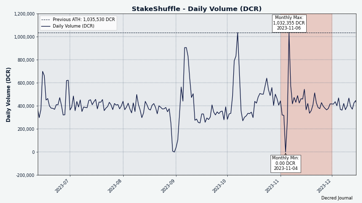

_Image: Second big dip and recovery of daily DCR mixing_

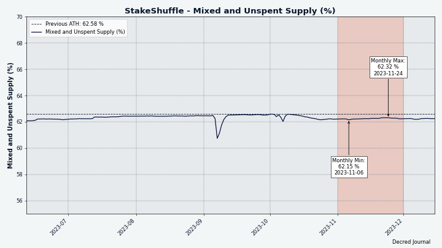

_Image: More than 62% of circulating supply prefers privacy_

### Lightning Network

Decred [LN Explorer](https://ln-map.jholdstock.uk/) saw 220 nodes (+0), 420 channels (-28) with a total capacity of 206 DCR (+3), as of Dec 3 (compared to Nov 1).

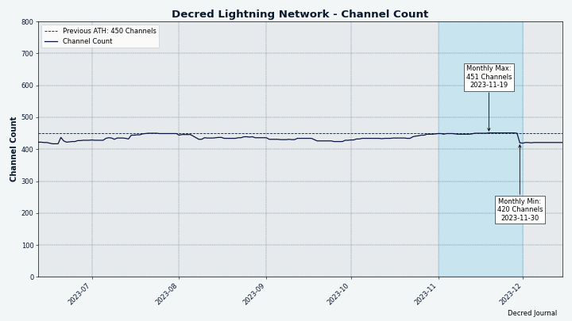

_Image: Some LN channels got closed_

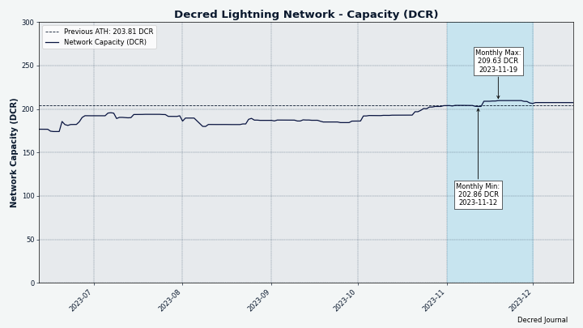

_Image: LN node count stayed the same while the capacity increased a bit_

Thanks to @bochinchero for providing and improving these charts. About 40 other charts not used in this Decred Journal issue are available in the [dcrsnapshots](https://github.com/bochinchero/dcrsnapshots) repository; everyone is welcome to share them on social media.

## Ecosystem

### Voting Service Providers

- vspd [v1.3.2 release](https://github.com/decred/vspd/releases/tag/release-v1.3.2) came out with fixes that should resolve issues with ticket status errors and VSP fee payment failures. 9 out of 14 VSPs have deployed these fixes as of December 1st.

- The [VSP list page](https://decred.org/vsp/) has been [updated](https://github.com/decred/dcrweb/pull/1148) to show all-time Missed ticket stats. As of the December 1st snapshot, the 14 active VSPs between 6 months and 3 years old reported a total of 1,108 revoked tickets, of which 1,101 expired [normally](https://docs.decred.org/proof-of-stake/overview/) and only 7 missed their votes. The low missed count shows that vspd deployments are much more reliable compared to the old [dcrstakepool](https://github.com/decred/dcrstakepool) which had higher miss rates. Note: [bass.cf](https://vspd.bass.cf/) has been excluded from these numbers because it has not yet upgraded to report missed tickets.

### Mining Pools

- [decred.miningandco.com](https://decred.miningandco.com/) has been made [open for all](https://matrix.to/#/!TSpuyuYWgkTrgPTcXh:decred.org/$H4QA2fDpl1OO6jLnJa6PTAHiEPPSYQYSlomhYzWLrb8). We announced it in [October](202310.md#ecosystem) but missed that it was a private pool initially. Supported miners include the official [gominer](https://github.com/decred/gominer) for Windows and [custom binaries](https://github.com/Gddrig/gominer/releases) of gominer for Linux and HiveOS. [GitHub repo](https://github.com/Gddrig/gominer) hosting those binaries does not include the source code yet, so use with care.

### Staking Services

- [BisonPool](https://twitter.com/BisonPool) [reported](https://twitter.com/BisonPool/status/1724110111503728738) that with the activation of DCP-10 earnings rose from ~2.8%/year to ~7.8%/year, and now with DCP-12 up to ~8.6%/year. Current returns are shown on their [home page](https://bisonpool.org/), note that it is not fixed and depends on ticket prices. BisonPool was [launched](https://www.reddit.com/r/decred/comments/vyydm1/bisonpool_is_now_live/) in July 2022 by two IT security enthusiasts who were anonymously participating in Decred since 2018. The service allows staking and earning rewards with less than a full ticket. Bear in mind that it is a custodial service that takes full control of users' funds.

### Exchanges

- [Poloniex](https://poloniex.com/) was hacked on November 10th for an estimated loss of $118 million in Ethereum assets, Tron assets, and BTC. As DCR was not mentioned by [Poloniex](https://twitter.com/Poloniex/status/1722956238160536049), [Justin Sun](https://twitter.com/justinsuntron/status/1722942733680296246), or the [Lookonchain tweet](https://twitter.com/lookonchain/status/1722969227915661531) about the stolen assets, it is unknown if any DCR was stolen during the hack. In any case, DCR users were affected by the suspension of all withdrawals. On-chain researchers of the #trading club [noticed](https://matrix.to/#/!lDZCzVQjFoJsXMPkvr:decred.org/$c4Da_17xYGDPGRlK3JLf91bA2UbhoQvthyfVBCD6vvI) a transaction sending around ~60K DCR from a [Poloniex address](https://dcrdata.decred.org/address/DsTSdjhiCY1z8AeQGWYJ5ryJKRA3eSBGRTj) to [Binance](https://dcrdata.decred.org/address/DsSJDWwDZtxjFvh7xvTzkENAtNZEeZsQgG8) around 12 hours after the hack became public and ~7 hours after Poloniex was [said](https://twitter.com/justinsuntron/status/1723009018086527126) to be "restored". The speculation has been that it could be either Poloniex saving the remaining funds or the hacker liquidating them on Binance.

- Poloniex was slow at recovering from the hack. Trading was [resumed](https://support.poloniex.com/hc/en-us/articles/18996694952983) on the next day, but no withdrawals have been enabled by Nov 30 and their [support Twitter](https://twitter.com/PoloSupport) has been silent. At the same time there was no shortage of promotion, hype, or even coin listing [tweets](https://twitter.com/Poloniex). As a consequence of withdrawals and cross-exchange arbitrage not functioning, DCR price went down significantly compared to the other markets.

- [HTX](https://www.htx.com/) exchange (formerly Huobi) and its HECO Chain Bridge lost around $117 million worth of assets to a hot wallet compromise according to the official [support article](https://www.htx.com/support/en-us/detail/104954980569005) and [PeckShield](https://twitter.com/PeckShieldAlert/status/1727290028064436539). [Justin Sun](https://twitter.com/justinsuntron/status/1727304656622326180) and [HTX](https://www.htx.com/support/en-us/detail/104954980569005) promised to fully compensate users for the losses. DCR was not mentioned as a stolen asset and was likely never integrated in the HECO Chain Bridge. However, DCR users were hit by the suspension of all withdrawals.

- HTX has been recovering faster compared to Poloniex. By Nov 30 withdrawals for BTC, ETH, TRX and about a hundred other assets have been restored (including USDT and USDC), but based on official updates and DCR/USDT slippage on HTX, DCR was not so lucky.

- [Bittrex Global](https://bittrexglobal.com/) announced that they are [winding down operations](https://twitter.com/BittrexGlobal/status/1726652430673121310). All trading activity will end by December 4th, and from there customers will only be able to withdraw. Any remaining USD will be [auto-converted to USDT](https://twitter.com/BittrexGlobal/status/1729897531448987831). It's been a bad year for Bittrex: [$29 million](https://www.reuters.com/business/finance/crypto-exchange-bittrex-fined-53-mln-by-us-treasury-dept-2022-10-11/) in fines in October 2022, having to wind down [U.S. operations](202303.md#ecosystem) in March 2023 due to unwelcoming regulatory and economic environment, [charges by U.S. SEC](202304.md#relevant-external) in April for securities violations, and a [bankruptcy](202305.md#ecosystem) filing in May.

- DCR withdrawals from Bittrex have been suspended for 9 days (judging by [this address](https://dcrdata.decred.org/address/DsbvnccsFTAP7FQV7g3SgGfyoXNcPL2Y1fm)), as a result the price of DCR went down and some smart traders picked it up for as low as $5. Withdrawals resumed on November 29th however, and one user [reported](https://matrix.to/#/!aNnAOHkWUdNcEXRGjJ:decred.org/$hj_TXo2KHkW8DLyE8UDYagtqXXjrva1RL0SSWCGAOtY) it worked for DCR with no issues.

- [KuCoin](https://www.kucoin.com/) announced that [DCR/USDT trading pair](https://www.kucoin.com/announcement/kucoin-will-add-and-close-certain-spot-trading-pairs) will launch on November 24th while DCR/ETH pair will be closed. The same change was made for 8 other coins.

- [Bitvavo.com](https://bitvavo.com/en) may be staking customers' DCR according to on-chain findings of [#trading](https://matrix.to/#/!lDZCzVQjFoJsXMPkvr:decred.org/$PkJ9-s1hjxrdFMPBB1fXLqk0_-gK1q3q237PmVsg5Zk) researchers. Bitvavo's support has [confirmed](https://twitter.com/CryptoDYOR/status/1723760185884164196) that the exchange can collect rewards generated from holding the assets on behalf of its users, according to their User Agreement. DCR is currently missing from the ["reward-eligible" assets](https://support.bitvavo.com/hc/en-us/articles/4405243949841-Staking-and-Lending-at-Bitvavo), so there is no way for the users to opt-in to receive DCR staking rewards. Staking DCR without sharing the rewards with customers received mixed feedback from the community, ranging from it being highly unethical, to it being more secure (against theft or misuse by the exchange itself), or even being a "selling point" to get DCR listed on more exchanges.

- [Changelly](https://github.com/decred/dcrweb/pull/1153) has been removed from [decred.org Exchanges](https://decred.org/exchanges/) page because DCR doesn't work since [September](202309.md#ecosystem).

- [MEXC.com](https://www.mexc.com/exchange/DCR_USDT) and [XT.com](https://www.xt.com/) have been tested: DCR trading works over VPN and without KYC. DCR withdrawals are working at MEXC, help is needed to test withdrawals at XT.

- [Trocador](https://trocador.app/) [launched](https://twitter.com/TrocadorApp/status/1722987823664410844) new [prepaid virtual cards](https://trocador.app/en/prepaidcards/) that can be purchased with crypto and used as normal credit cards. A test run for DCR has uncovered some issues: a backend error (devs fixed it), automatic email with card details didn't work (support request resolved it), it worked with Google Pay but not with contactless NFC payments, and there was roughly an 8% markup to use the service. Despite those issues, it works and allows sending DCR and getting a prepaid VISA card that can be used to buy real world things.

### Other News

- Decred Vanguard became active in testing and pursuing new integrations for Decred, check their report [below](#decred-vanguard).

- Anyone can help to improve Decred's presence in the crypto ecosystem. Even little things like emailing or tweeting to an exchange/wallet/service/influencer can make a difference.

Join more than 100 members of our [#ecosystem](https://chat.decred.org/#/room/#ecosystem:decred.org) chat to get detailed news about Decred services. Volunteers who can help with testing withdrawals are welcome in the [#ecochat](https://chat.decred.org/#/room/#ecochat:decred.org) work group as well.

Warning: the authors of the Decred Journal have no idea about the trustworthiness of any of the services above. Please do your own research before trusting your personal information or assets to any entity.

## Outreach

### Decred Vanguard

Updates:

- Ran a [Meme Contest](https://twitter.com/exitusdcr/status/1719412415375241610) with $100 in DCR as rewards.
- Attempted contacts with cryptocurrency exchanges [Kraken](https://www.kraken.com/), [CEX.IO](https://cex.io/), and [M2](https://www.m2.com/en_AE/) for listing guidance.
- Filed a listing [application](https://twitter.com/exitusdcr/status/1723075248709370337) for [TradeOgre.com](https://tradeogre.com/).
- Tested out altcoin exchanges [MEXC.com](https://www.mexc.com/exchange/DCR_USDT) and [XT.com](https://www.xt.com/) to ensure deposits and withdrawals work.
- Tested out Trocador [prepaid cards](https://trocador.app/en/prepaidcards/) bought with $DCR.
- Spoke to Trocador about possible partnerships. This led to Cryptopower [integrating](https://github.com/crypto-power/cryptopower/pull/257) Trocador's swap service into their wallet, qualifying them as a partner and thus listed on Trocador's main [website](https://trocador.app/en/).
- Spoke to [BTCPay Server](https://docs.btcpayserver.org/) devs and [confirmed](https://matrix.to/#/!zefvTnlxYHPKvJMThI:decred.org/$zRag-ReHSe8Ot8onMz-MPW7lMsS4DJssxWzlLAcFD3Y) that they are open to merging an altcoin integration if it's done correctly.
- Reached out to thought leader [Justin Bons](https://twitter.com/Justin_Bons) to have a conversation.
- Spoke on [Cake Wallet](https://twitter.com/cakewallet/status/1724849595195253163) Twitter space about working in the Decred DAO.
- Ran a poll on what [marketing effort](https://twitter.com/exitusdcr/status/1729192850544587079) the community would like most. Influencer collaboration was most popular at 46%. 106 votes were cast.
- Completed a [$100 Decred giveaway](https://twitter.com/exitusdcr/status/1729571096230252835) with easy effort entry. Giveaways with low barriers always get more likes, views, and retweets.

Decred Vanguard is a community-based marketing effort with the goal of increasing Decred's outreach and social media presence.

Are you a meme creator, artist, strategist, or just someone passionate about the Decred Project? We're expanding our community-driven marketing program, and we want YOU!

What's in it for you?

- Earn $100 in DCR every month just for participating.
- We'll cover the cost of your X Premium.
- No strict rules on participation. Contribute in your own unique way, whenever you can.
- Win potential prizes for contributions.

We are always testing out new giveaways and running meme contests with prizes!

Interested? Contact @Exitus on Twitter/Matrix/Discord.

### Cypherpunk Times

Engagement stats for November:

- Total number of articles on CT: 588
- Newsletter subscribers: 112
- New CT posts and newsletters sent: 23
- Social media followers across all platforms and accounts: 1,181
- [@decredsociety](https://twitter.com/decredsociety) Twitter: followers - 985, posts - 16, tweet impressions - 17.1K, likes - 350, retweets - 51, comments - 51
- [@cypherpunktimes](https://twitter.com/cypherpunktimes) Twitter: followers - 196, posts - 154, tweet impressions - 19.3K, likes - 439, retweets - 107, comments - 88
- Posts by project for November: Firo - 5, Decred - 7, Other crypto projects / news - 11

## Events

**Attended:**

- @arij was invited to a large conference organized by LBANK Labs focusing on [Investment Dynamics and the Emergence of the Blockchain Ecosystem in Morocco](https://decredcommunity.github.io/events/index/20231121.1), where she engaged in networking sessions as a Decred representative and established valuable connections.

## Media

### Articles

Decred:

- [Decred back on track! what can we hope for?](https://www.cypherpunktimes.com/decred-back-on-tracks-what-can-we-hope-for/) by @Joao
- [Decred vs Polygon: Decentralization and innovation!](https://www.cypherpunktimes.com/decred-vs-polygon-decentralized-and/) by @Joao
- See companion text posts in the Videos section below

General crypto:

- [Cypherpunk Times Monthly Roundup (October 2023 edition)](https://www.cypherpunktimes.com/cypherpunktimes-monthly-roundup-october-2023-edition/) by @tallamericano
- Bear Market Blues: Surviving and Thriving in Cryptocurrency Downturns [Part 1](https://www.cypherpunktimes.com/bear-market-blues-surviving-and-thriving-in-cryptocurrency-downturns/) and [Part 2](https://www.cypherpunktimes.com/bear-market-blues-surviving-and-thriving-in-cryptocurrency-downturns-2-2/) by @tallamericano
- [Reviewing major crypto scams and hacks in October](https://www.cypherpunktimes.com/reviewing-major-crypto-scams-and-hacks-in-october/) by @BlockchainJew
- [One year after: Sam Bankman from FTX is condemned](https://www.cypherpunktimes.com/one-year-after-sam-bankman-from-ftx-is-condemned/) by @Joao
- [CEX in view](https://www.cypherpunktimes.com/cex-in-view/) by @BlockchainJew
- Navigating the exchange listings jungle: A comprehensive guide on how to get your cryptocurrency listed [Part 1](https://www.cypherpunktimes.com/navigating-the-exchange-listings-jungle-a-comprehensive-guide-on-how-to-get-your-cryptocurrency-listed-1-2/) by @tallamericano
- [Crypto in view: Unraveling the week's digital drama](https://www.cypherpunktimes.com/crypto-in-view-unraveling-the-weeks-digital-drama/) by @BlockchainJew

### Videos

- [Decred News - Version 1.8.1, dev AMA on Reddit, new ticket price ATH, lots of updates!](https://www.youtube.com/watch?v=pRQSH3tO5xk) by @Exitus
- [Scaling the blockchain: Why Decred chose to scale using the Lightning Network - Moving Forward](https://www.youtube.com/watch?v=xWgjrKW1e1o) by @phoenixgreen - also as a [text post](https://www.cypherpunktimes.com/scaling-the-blockchain-why-decred-chose-to-scale-using-the-lightning-network/)
- [A new work paradigm - Working for the Decred DAO - Moving Forward](https://www.youtube.com/watch?v=1z0Q-jcRcHI) by @phoenixgreen - also as a [text post](https://www.cypherpunktimes.com/a-new-work-paradigm-working-for-the-decred-dao/)
- [How to safely store and backup your Decred - Q&A sessions](https://www.youtube.com/watch?v=fYCNaY3MKps) by @phoenixgreen - also as a [text post](https://www.cypherpunktimes.com/how-to-safely-store-and-backing-up-your-decred-qanda-session/)
- [How are Decred blocks constructed? - Q&A sessions](https://www.youtube.com/watch?v=8DNSrEicKx0) by @phoenixgreen - also as a [text post](https://www.cypherpunktimes.com/how-are-decred-blocks-constructed-q-a-sessions/)

Live streams:

- [Decred developer review - State of the Market](https://www.youtube.com/watch?v=mdtTVqEFewE) by @phoenixgreen and @Exitus, discussing the [Decred Developer AMA](https://www.reddit.com/r/decred/comments/1700xyi/decred_developer_ask_me_anything_ama_feat_dev/) and the questions asked by the community

Shorts:

- [Decred - cryptocurrency that combines privacy with an auditable supply](https://www.youtube.com/watch?v=A7hHQuN9VX0) by @DajanaDcr and @Exitus - also on [TikTok](https://www.tiktok.com/@decred_crypto/video/7307471531305602336)

### Audio

- @Exitus gave an overview of the Decred DAO/Treasury and how contractors contribute early on in the space in Cake Wallet's [Twitter Space](https://twitter.com/cakewallet/status/1724849595195253163) dedicated to working in crypto.
- Check the [Cypherpunk Times](https://podcasters.spotify.com/pod/show/cypherpunktimes) podcast on Spotify for the audio versions of Decred videos.

### Non-English content

- A video about [Timestamply](https://www.youtube.com/watch?v=xvsoded_XsU) by [@arij](https://twitter.com/in_insaf/status/1728829464237514971)
- Decred Journal September got a total of 3 new [translations](https://xaur.github.io/decred-news/) to Arabic (@arij), Chinese (@Dominic) and Polish (@kozel). Thank you friends!

### Random

- Educational tweets on [Decred Treasury](https://twitter.com/decredproject/status/1722177861803483579) and [TSpend voting](https://twitter.com/decredproject/status/1723269730113323485) by @kozel
- Monthly [Random + Trader](https://www.reddit.com/r/decred/comments/17lahax/monthly_random_trader_talk/) group therapy about bullish thesis and ideas what to do
- Intellectual challenge from @h3la1: [propose a good Decred stablecoin idea](https://twitter.com/h3la1/status/1729116883889348704) and win 1 DCR
- First [DCRDEX experiences](https://twitter.com/longtermdaily/status/1720895569529364900) by @pubpete

> I never planned to use the #DCRDEX, because I didn't need to, but over time I realized it added value. It wasn't until the only exchange (@BittrexExchange) I use to buy #Decred stopped operating in the US.... thats when it really hit me!  It wasn't a want, it was a need! [[@longtermdaily](https://twitter.com/longtermdaily/status/1720895569529364900)]

### Art and Fun

- [Pillars of creation](https://www.cypherpunktimes.com/pillars-of-creation/) by @OfficialCryptos
- Some winners of @Exitus' [meme contest](https://twitter.com/exitusdcr/status/1719412415375241610): [@Atonito](https://twitter.com/exitusdcr/status/1720511478694822066), [@CahyadieDika](https://twitter.com/exitusdcr/status/1720504961635660253), [@MANCASTVZX](https://twitter.com/exitusdcr/status/1720411076527903070), [@wumudidi](https://twitter.com/wumudidi/status/1719539682999255443)

_Images: Trapped Bitcoin users looking at the cure, by [@yourkingroyal](https://twitter.com/yourkingroyal/status/1720035878318248374)_

_Image: An old Decred Moon Fuel art on [@wumudidi](https://twitter.com/wumudidi/status/1719539682999255443)'s cup_

## Markets

In November DCR was trading between USDT 12.33-16.50 and BTC 0.00036-0.00046 on Binance. Using the weighed daily close data from Coin Metrics the price ranges were USD 13.11-15.50 and BTC 0.00037-0.00043. The average daily rate as calculated for contractor payments was $14.35.

Brian Beamish of [The Rational Investor](https://www.therationalinvestor.com/) made a [technical analysis of DCR](https://www.youtube.com/watch?v=l1wZCgi8Zv8&t=1h15m10s) (jump to 1:15:10).

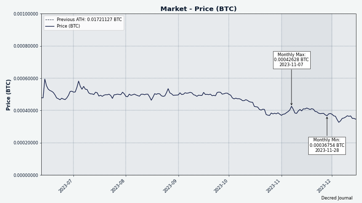

_Image: Recent DCR/BTC, data from Coin Metrics_

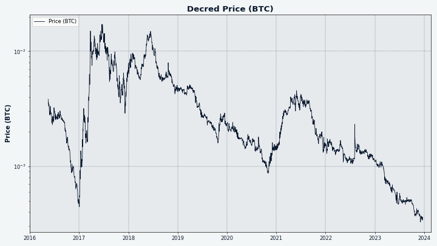

_Image: All-time DCR/BTC, data from Coin Metrics_

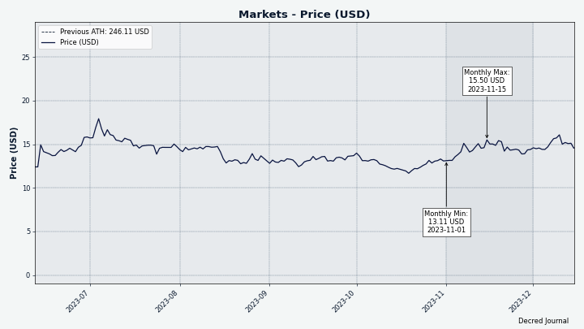

_Image: Recent DCR/USD, data from Coin Metrics_

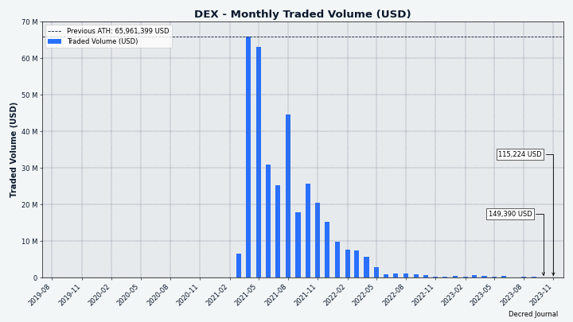

_Image: DCRDEX monthly volume in USD_

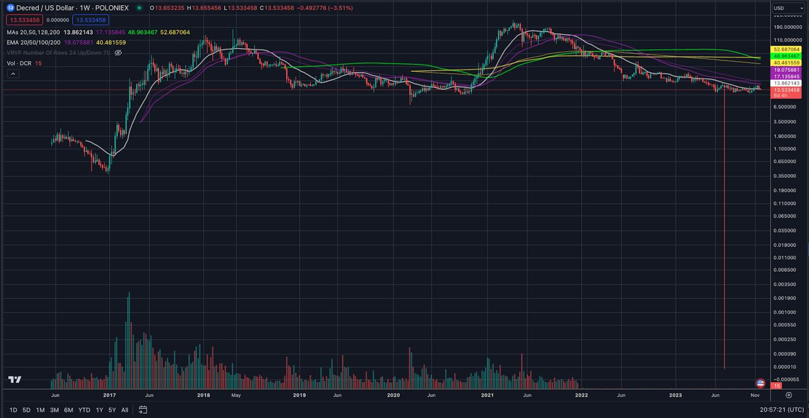

_Image: "A better long-term chart than a lot of people realize" by [@cburniske](https://twitter.com/cburniske/status/1729243261460734172)_

## Relevant External

Bitcoin mining pool f2pool has [admitted](https://news.bitcoin.com/bitcoin-mining-pool-f2pool-acknowledges-ofac-transaction-censorship-backpedals-after-community-backlash/) to censoring transactions from OFAC-sanctioned addresses. This behaviour was discovered by Bitcoin developer 0xB10C by analyzing transactions which should have been included by f2pool but weren't. Initially f2pool denied the behavior, but they subsequently admitted it and said they would pause it until community consensus could be established - but they have deleted the various posts about it since.

Monero chain sleuths Moonstone Research have [analyzed](https://moonstoneresearch.com/2023/11/03/Postmortem-of-Monero-CCS-Hack.html) the transactions made by the attacker who drained the Community Crowdfunding System (CCS) wallet and discovered some transactions they are fairly sure represent the attacker sending funds to an exchange or counterparty. This caused some [controversy](https://twitter.com/sethforprivacy/status/1720792327579414915) in the community because Monero is known for its privacy, but this is a "worst case scenario" for privacy where the wallet's private keys and metadata have been shared with the investigators, and the attacker appears to have made an unusual transaction (using the Monerujo's "PocketChange" feature) and some other missteps (sweeping the wallet) which have made the job of the investigators easier.

There are various proposals for a new Monero CCS system design which avoids the pitfall of having a large sum of XMR under the control of some core member(s) who can be targeted. One of these is a "[cypherpunk proposal](https://monero.observer/cypherpunk-transmission-017-rethinking-monero-ccs-cypherpunk-proposal/)" which would remove the custodian role by having people donate directly to the wallets of the project owners once they are greenlit for funding - so removing the centralized oversight and release of funds.

Fluffypony has [proposed](https://github.com/monero-project/meta/issues/921) disbanding the "Monero Core Team" in favour of 6 workgroups whose membership is determined by community consensus, with a cutover date of Jan 1 2024. The proposal is partly driven by recent issues with the CCS funds, but the Core team is also seen as having too much control in general, and some of the roles, like those dealing with service providers, require "individuals in those particular roles to not be abrasive, and to be warm and understanding and friendly with the individuals they deal with at those service providers". The workgroups he proposes relate to the General Donation Fund, the Community Crowdfunding System, Intellectual Property holding, Servers and CDN hosting, Git maintenance, and Community Channels moderation. The proposal calls for a straw poll consensus mechanism to be decided to select members of the workgroups, but stipulates that only participants with several years of contributions should be considered for membership of a workgroup.

Jae Kwon, the Cosmos founder, has [called](https://www.coindesk.com/markets/2023/11/27/cosmos-founder-calls-for-chain-split-atom-down-3/) for a chain splitting hard fork after a proposal to decrease ATOM issuance was approved by the community against his wishes. The proposal to drop the issuance rate from 14% annually to 10% was passed with 41.1% yes votes and 31.9% no votes from the voting power that participated - the rationale for the change was that Cosmos Hub was paying too much for security. Kwon's chain split proposal would form a new chain that has its own token but would also allow the original ATOM token to be used in some way. This may also resolve some tension in the community around a vetoed plan for "Cosmos 2.0" which had significant levels of support but was deemed too risky by the leadership.

The Aragon Association has [announced](https://protos.com/aragon-helped-lido-curve-form-daos-now-its-dissolving/) that it intends to disband, returning 95% of the assets held by the organization to ANT token holders and retaining 5% to settle obligations. ANT holders will be able to redeem ANT for ETH at a rate of 0.0025376 ETH per ANT until Nov 2 2024, at which point any unclaimed funds will revert to the newly formed "Aragon Shield", where they will be put towards some loosely defined continuation of product development. Although Aragon's software tools were used by successful DAOs such as Lido and Curve, the team decided that it was not possible to derive any value for ANT holders from this kind of usage, and they have acknowledged that ventures like "Aragon Court" were not viable.

Some of the ANT token holders are not happy with the Aragon Association plan, specifically the retention of $11 million plus all unclaimed funds after a year for Aragon Shield, and they have [backed](https://twitter.com/dcfgod/status/1726861803257471313/) a proposal to go after Aragon Association for more money via a "highly conditional grant" to Patagon Management LLC, a trading company specializing in this kind of legal action to recover funds.

A fake "Ledger Live" app made it into the Microsoft app store and as a result whoever released it was sent 38 transactions worth $588K as it [stole](https://cointelegraph.com/news/fake-ledger-live-app-sneaks-into-microsoft-app-store-as-victims-lose-half-a-million) the BTC of people who thought they were using the proper Ledger Live software to access their hardware wallet.

KyberSwap was subjected to a [hack](https://twitter.com/kybernetwork/status/1727475235342217682) and urged users to withdraw their funds if able, but the attacker was able to get hold of around $55 million of users' funds by [performing](https://therecord.media/kyberswap-crypto-platform-54-million-hack) a sophisticated sequence of actions that allowed them to exploit a vulnerability to manipulate prices. The KyberSwap team offered a 10% bounty for return of the funds and the attacker replied in an on chain message that negations would begin in a few hours when they were rested. Front running bots were able to join in the exploit and get $5.7M of user funds before the attacker, the operators of the bots are [returning](https://twitter.com/KyberNetwork/status/1728800315955437743) funds for a 10% bounty.

There have been four major hacks in two months [targeting](https://cointelegraph.com/news/justin-sun-platforms-hacked-4-times) exchanges and a bridge operated by Justin Sun. HTX exchange (formerly Huobi) suffered two hacks for $8M and $30M, while Poloniex was hit for $100M, reportedly due to a private key compromise. HTX's HECO Chain bridge, used to move funds between the exchange and various chains, was the other casualty, with $87M making its way to suspicious addresses.

LBRY Inc. is [winding down](https://twitter.com/LBRYcom/status/1715108834950123929) after the SEC sued it into bankruptcy, all of its assets will be sold off to pay creditors. Odysee will continue using the LBRY network to provide its video sharing service, by some [measures](https://odysee.com/@lbry:3f/theendoflbryinc:d) one of the most highly used Web3 platforms with 5.3 million unique monthly users.

The SEC [sued](https://www.reuters.com/business/finance/us-sec-sues-kraken-operating-crypto-trading-platform-without-registering-2023-11-20/) Kraken with operating a securities exchange illegally because they failed to register, similar to the cases brought against Coinbase and Binance in June.

SafeMoon's CEO and CTO have been [arrested](https://www.coindesk.com/policy/2023/11/01/sec-charges-safemoon-team-with-fraud-offering-unregistered-crypto-securities/) by the US Department of Justice in a fraud investigation, with a complaint that they misled investors by spending $200M on luxury goods while telling them it was locked in a liquidity pool. The SEC piled on with charges of securities violations related to the SFM token being unregistered and the price being manipulated, the token tanked in the aftermath of the charges being published.

The SBF trial [concluded](https://decrypt.co/204154/sam-bankman-fried-verdict-ftx-fraud) with guilty verdicts on seven charges and sentencing to come in 2024 and SBF facing a maximum 115 years in prison. The question of whether to pursue the political donations element was to be made at a later date - spoiler alert, they [decided](https://www.bloomberg.com/news/articles/2023-12-30/us-drops-plan-for-second-bankman-fried-trial-on-other-charges) not to expose the extent of that crime and all of the politicians who were involved to media scrutiny, in December.

The FTX Bankruptcy advisors have been [providing](https://decrypt.co/204336/ftx-handing-over-customer-crypto-trading-data-fbi) FBI offices with access to customer trading data.

Chinese courts have [affirmed](https://cointelegraph.com/magazine/chinas-surprise-nft-move-hong-kongs-15m-bitcoin-fund-asia-express/) legal protection of NFTs as property, with a commentary that clarifies some previous contradictions. NFTs are seen as having both use value and exchange value, their scarcity means they conform to the characteristics of online virtual property. Recognizing property rights for NFTs means that people can be prosecuted for stealing them.

The US Federal Reserve is [coming](https://twitter.com/BitcoinMagazine/status/1720433939431477400) after Bitcoin Magazine for making fun of their FedNow service in a way which they allege infringes on their copyright and trademarks. Bitcoin Magazine has [published](https://bitcoinmagazine.com/legal/federal-reserve-threatens-to-sue-bitcoin-magazine) an open reply declining to comply by removing the offending t-shirt, which contains the Fed's trademark, from their store.

Bittrex Global has finally [wound down](https://cointelegraph.com/news/bittrex-global-winds-down-operations) its operations and ceased trading. Since they announced the closing date there were intermittent issues with withdrawing DCR and the DCR pairs started behaving unusually with low liquidity and some concern about whether people would be able to withdraw any DCR they bought there.

Attendees at the Bored Ape Yacht Club's annual ApeFest were [subjected](https://arstechnica.com/health/2023/11/bored-ape-creator-says-uv-lights-at-apefest-burned-attendees-eyes-and-skin/) to UV light exposure, with over 20 people who were located too near a UV light reporting severe pain and burning sensations in their eyes, likely caused by photokeratitis or sunburn of the cornea.

That's all for November. Suggest news for the next issue in our [#journal](https://chat.decred.org/#/room/#journal:decred.org) chat room.

## About

This is issue 65 of Decred Journal. Index of all issues, mirrors, and translations is available [here](https://xaur.github.io/decred-news/).

Most information from third parties is relayed directly from the source after a minimal sanity check. The authors of the Decred Journal cannot verify all claims. Please beware of scams and do your own research.

Credits (alphabetical order):

- writing, editing, publishing: { bee, bochinchero, Exitus, jz, karamble, kozel, phoenixgreen, richardred, zippycorners }
- reviews and feedback: {}
- title image: { Exitus }
- funding: Decred stakeholders
