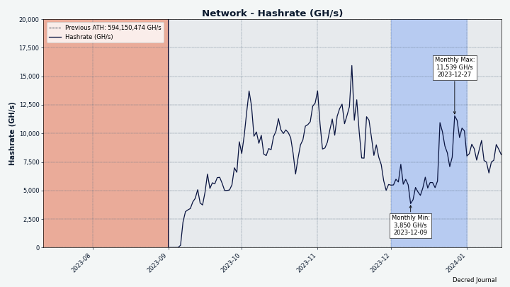
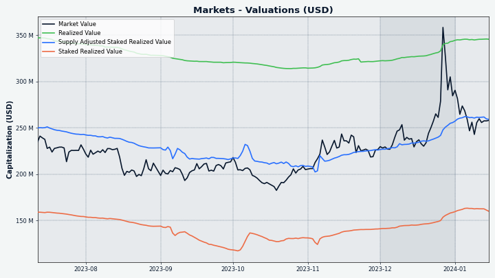

# Decred Journal – December 2023

_Image: December cover by @Exitus_

*Dear readers, sorry for taking so long to complete this December issue. In recent months, finding time to work on the Journal has been a big challenge. We are discussing an overhaul of DJ to optimize our efforts. I hope this issue still has unique and useful information for you. Happy reading! -- @bee*

Highlights of December:

- Two proposals have been approved, for continuing the Bug Bounty program and Video Content creation in 2024.

- Two new mining pools have launched, but data suggests mining is becoming more centralized again.

- Wallet apps and Bison Relay are getting polished for their next releases, Cake integration is ongoing.

Contents:

- [Development](#development)
- [People](#people)
- [Governance and Finances](#governance-and-finances)
- [Network](#network)
- [Ecosystem](#ecosystem)
- [Outreach](#outreach)
- [Media](#media)
- [Markets](#markets)
- [Relevant External](#relevant-external)

## Development

The work reported below has the "merged to master" status unless noted otherwise. It means that the work is completed, reviewed, and integrated into the source code that advanced users can [build and run](https://medium.com/@artikozel/the-decred-node-back-to-the-source-part-one-27d4576e7e1c), but is not yet available in release binaries for regular users.

### dcrd

_[dcrd](https://github.com/decred/dcrd) is a full node implementation that powers Decred's peer-to-peer network around the world._

Developer and internal changes:

- Updated the [Docker image](https://github.com/decred/dcrd/pull/3214) to build with Go 1.21.5.
- Marked `cfilter` version 1 messages as [deprecated](https://github.com/decred/dcrd/pull/3205) in the `wire` package. This is just general cleanup, since V1 `cfilter` messages are already invalid. V2 `cfilter` messages have been [the standard](https://github.com/decred/dcrd/pull/1906) since [DCP-5](https://github.com/decred/dcps/blob/master/dcp-0005/dcp-0005.mediawiki) activated in Jan 2020.

In progress:

- Introduce [P2P mixing messages](https://github.com/decred/dcrd/pull/3066) to the `wire` protocol

### dcrwallet

_[dcrwallet](https://github.com/decred/dcrwallet) is a wallet server used by command-line and graphical wallet apps._

User-facing changes:

- Only [request block notifications](https://github.com/decred/dcrwallet/pull/2310) after the wallet is fully synced. This solves a race issue where the wallet might try to look at blocks before the underlying dcrd instance was fully synced. This could happen when dcrwallet is started very quickly after dcrd (for example, from within Decrediton). The result would be missed transaction notifications and the wallet's balance to be wrong, requiring a rescan to be fixed.
- When the wallet is syncing in SPV mode, [process header batches in parallel](https://github.com/decred/dcrwallet/pull/2311). This resulted in a 32% faster sync on average when tested in the real world.
- When the wallet is in SPV mode and the initial sync has already finished, [request headers from each newly connected peer](https://github.com/decred/dcrwallet/pull/2316). This speeds up re-syncing after initial sync when the local client has been offline for some time (for example, due to an intermittent network connection) by ensuring any and all new headers are requested immediately, instead of waiting until a new block is announced to begin the catchup process.
- Fixed a bug where a restored wallet would [miss discovering transactions](https://github.com/decred/dcrwallet/pull/2319) if those transactions were in the tip block after restoring from seed. This was quite a rare bug, because having more blocks in the chain post-restoration (common case) would prevent the issue from being hit. The bug would've likely only impacted automated dev tests, although rescans would also have fixed the issue for any users who might've experienced the bug.

Internal and developer changes:

- Modify the pruning procedure to [prune partial sidechains](https://github.com/decred/dcrwallet/pull/2309) instead of pruning entire trees. This does not have a functional change yet, but in the future will allow SPV clients to process chains asynchronously.
- Use Go 1.19 [atomic types](https://github.com/decred/dcrwallet/pull/2312) wherever possible. These types prevent misuse by only allowing access through the provided methods and guarantee proper use even if the variables are reorganized in the struct layout.
- If a peer gives the wallet a new block, ensure that block has a [known ancestor either in the main chain or a side chain](https://github.com/decred/dcrwallet/pull/2315). If no known ancestor exists, this means the wallet missed some blocks and should resync headers. Previously, the wallet only looked for ancestors in the main chain, instead of all side chains too. This caused `getHeaders` to run unnecessarily often, especially for devs simulating large reorgs with side chains.
- Fix the gRPC logger, which wasn't [correctly removing prefixes](https://github.com/decred/dcrwallet/pull/2313) when logging message arguments. This error [was caught](https://github.com/decred/dcrwallet/issues/2169) by a friendly passerby who is writing a custom golang linter.

In progress:

- Add [integration tests](https://github.com/decred/dcrwallet/pull/2318) to assert the correct behavior of restoring a wallet under various scenarios that were known to cause missed transactions. These tests make use of the upcoming [automation and testing framework](https://github.com/decred/dcrtest/pull/20) for operating a dcrwallet binary through its JSON-RPC and gRPC interfaces.
- Add [batched fetching of compact filters](https://github.com/decred/dcrwallet/pull/2314) to further [speed up syncing in SPV mode](https://github.com/decred/dcrwallet/issues/2289). This change depends on a related [change in dcrd](https://github.com/decred/dcrd/pull/3211) enabling the full nodes to serve the batched data to light SPV clients.

### vspd

_[vspd](https://github.com/decred/vspd) is server software used by Voting Service Providers. A VSP votes on behalf of its users 24/7 and cannot steal funds._

- [Added documentation](https://github.com/decred/vspd/pull/458) for how a new VSP admin can get their VSP listed in Decrediton and on [decred.org/vsp](https://decred.org/vsp). This documentation is not aimed at the general user, and therefore has also been removed from [docs.decred.org](https://docs.decred.org).

### dcrpool

_[dcrpool](https://github.com/decred/dcrpool) is server software for running a Decred mining pool._

- Display the connected miners' [IP and port](https://github.com/decred/dcrpool/pull/428) on the pool account page. This makes it a little bit easier to distinguish clients from each other.
- Allow dcrpool to [gracefully handle errors](https://github.com/decred/dcrpool/pull/431) if dcrd's `GetTxOut` method can't find an output for a given transaction.

### Lightning Network

_[dcrlnd](https://github.com/decred/dcrlnd) is Decred's Lightning Network node software. LN enables instant low-cost transactions._

- Added automatic closing of channels that [have not been reestablished for some time](https://github.com/decred/dcrlnd/pull/196). Normally peers keep their channels healthy by "reestablishing" them. If channel peer is seen online for some time but it is not sending a message to reestablish the channel, such channel is a good candidate for being force closed, because it is likely the remote peer has lost the ability to use the channel (for example, due to restoring the node after data loss without the use of an [SCB backup file](https://docs.decred.org/lightning-network/backups/)). By default, if channel's remote counterparty is seen online for 72 hours without reestablishing the channel, it will be auto closed. This should be a reasonable compromise between not closing channels too fast on hubs (that are online 24/7) and ephemeral nodes (that may be online only for an hour or two a day). Integration test has been added to assert the correct behavior.

### cspp

_[cspp](https://github.com/decred/cspp) is a server for coordinating coin mixes using the CoinShuffle++ protocol. It is non-custodial, i.e. never holds any funds. CSPP is part of StakeShuffle, Decred's privacy system._

- Updated [C headers](https://github.com/decred/cspp/pull/98) to support the [third major version](https://flintlib.org/doc/history.html#flint-3-0-0) of the fast math library `flint` (released October 2023). Newer versions of `flint` may provide performance and other improvements to the CSPP server.

### DCRDEX

_[DCRDEX](https://github.com/decred/dcrdex) is a non-custodial, privacy-respecting exchange for trustless trading, powered by atomic swaps._

Changes backported to the next v0.6.x release:

- Fixed a bug where a trade could [get stuck](https://github.com/decred/dcrdex/pull/2622) after a server disconnect. The full list of affected markets is unknown, but it is known that the bug affected LTC/DCR market and did not affect the DCR/BTC market.

Market maker bots:

- Implemented low-level [CEX management functions](https://github.com/decred/dcrdex/pull/2568): deposit, withdraw, and balance tracking. Automatic rebalancing has been added to the simple arbitrage strategy where the bot initiates deposits and withdrawals to/from the CEX to maintain the configured balances. Binance is the first CEX supported by this functionality.
- Modified Binance code to track 1,000 [order book entries](https://github.com/decred/dcrdex/pull/2627) instead of 20.

General client changes:

- Added display of [expired unrefunded bonds](https://github.com/decred/dcrdex/pull/2626) on DEX Settings view. When a bond expires it can be refunded to get the funds back.
- Fixed a rare [race condition](https://github.com/decred/dcrdex/pull/2630) when handling [preimage requests](https://github.com/decred/dcrdex/blob/2f6cae0917fca97ec0fa979f367cff69655def33/spec/orders.mediawiki#order-commitment).
- Minor UI fixes.

Other:

- Updated [dex.decred.org footer](https://github.com/decred/dexweb/pull/39) to show more supported assets.

In progress highlights:

- Switching to [native USDC on Polygon](https://github.com/decred/dcrdex/pull/2629).
- Build environment for creating a standalone [Windows desktop app](https://github.com/decred/dcrdex/pull/2635) and an installer for it.
- @buck54321 asked on Twitter [which coins and features](https://twitter.com/blockchainbuck/status/1732515860156199038) the community would want to see developed in the future, and [which USDC pairs](https://twitter.com/blockchainbuck/status/1734048766850683051) are the most wanted.

### Cryptopower

_[Cryptopower](https://github.com/crypto-power/cryptopower) is a multi-coin desktop GUI wallet for DCR, BTC, and LTC. It runs in a privacy-preserving light SPV mode without needing full blockchains, supports Decred staking, mixing, voting, and other unique features._

Newly implemented UI elements:

- A page for [managing wallet accounts](https://github.com/crypto-power/cryptopower/pull/260).
- [Onboarding pages](https://github.com/crypto-power/cryptopower/pull/219) that help the user with initial configuration after launching the app for the first time.
- Animated [swiping of asset cards](https://github.com/crypto-power/cryptopower/pull/256) on the Overview page.
- Updated UI design of [governance pages](https://github.com/crypto-power/cryptopower/pull/221) (proposals, consensus, treasury).
- Added ["All Wallets" filter](https://github.com/crypto-power/cryptopower/pull/313) on the Transactions page.
- Added advanced options to the [Send page](https://github.com/crypto-power/cryptopower/pull/310), including the ability to send to multiple recipients in one transaction.

Trading:

- Implemented coin conversion (exchange) via [Trocador](https://github.com/crypto-power/cryptopower/pull/257).
- Added [intro pages](https://github.com/crypto-power/cryptopower/pull/224) shown when first visiting DCRDEX and CEX features.
- Open [trade details](https://github.com/crypto-power/cryptopower/pull/300) when clicking on a recent trade on Overview.
- Added [Trade History](https://github.com/crypto-power/cryptopower/pull/333) page.

DEX trading:

- Implemented [UI layout](https://github.com/crypto-power/cryptopower/pull/208) for DCRDEX main page, base DEX [logic](https://github.com/crypto-power/cryptopower/pull/238), and the ability to [post bonds](https://github.com/crypto-power/cryptopower/pull/269) from the DCR wallet.

Privacy:

- Updated [privacy pages](https://github.com/crypto-power/cryptopower/pull/248). By default, mixing will be off, mixing-related accounts won't be created, and sending from the `default` account will be allowed.

Mobile UI implementation, the following pages have been updated/fixed for mobile screens:

- Common [header](https://github.com/crypto-power/cryptopower/pull/311) with wallet name and balance shown on all the wallet's sub-pages.
- Updated the [mixer card](https://github.com/crypto-power/cryptopower/pull/316) and [recent transactions](https://github.com/crypto-power/cryptopower/pull/339) on the Overview page.
- [Governance](https://github.com/crypto-power/cryptopower/pull/317) layouts.
- [StakeShuffle](https://github.com/crypto-power/cryptopower/pull/330) pages.
- [CEX trading](https://github.com/crypto-power/cryptopower/pull/323) (instant exchange) layouts.
- [General Settings and wallet Settings](https://github.com/crypto-power/cryptopower/pull/324) pages.
- [Transactions](https://github.com/crypto-power/cryptopower/pull/327) pages (app-wide, wallet-wide, transaction details).
- [Staking](https://github.com/crypto-power/cryptopower/pull/335) page.
- Wallet [Accounts](https://github.com/crypto-power/cryptopower/pull/336) page.
- Wallet [Info](https://github.com/crypto-power/cryptopower/pull/332) (overview) page.
- [App onboarding](https://github.com/crypto-power/cryptopower/pull/342) pages.
- Wallet [create/restore](https://github.com/crypto-power/cryptopower/pull/352) pages, wallet [backup](https://github.com/crypto-power/cryptopower/pull/350) pages.
- [Send](https://github.com/crypto-power/cryptopower/pull/347) and [Receive](https://github.com/crypto-power/cryptopower/pull/346) pages and quick access modals.

Fixes:

- Fixed an error when visting [Treasury page](https://github.com/crypto-power/cryptopower/pull/235) without creating a DCR wallet.
- Fixed [mobile UI elements](https://github.com/crypto-power/cryptopower/pull/298) showing in desktop mode.
- Fixed crash when visiting [Staking pages](https://github.com/crypto-power/cryptopower/pull/328) after restoring a Decred wallet.
- Fixed request [rate limit](https://github.com/crypto-power/cryptopower/pull/323) errors when querying instant exchange orders.
- Other minor UI fixes.

Internal and developer changes:

- Refactoring to remove an [unnecessary interface](https://github.com/crypto-power/cryptopower/pull/235).
- Documented instructions for [building for Android and iOS](https://github.com/crypto-power/cryptopower/pull/299).

In other news:

- Test builds of Android and iOS apps have been submitted to Google Play Store and Apple TestFlight.

_Image: Cryptopower will support trading via the privacy-friendly [Trocador.app](https://trocador.app/)_

_Image: Cryptopower is adding a lightweight UI for trading on DCRDEX_

_Image: Cryptopower getting ready for mobile screens_

### Cake Wallet Integration

In progress:

- Integrating [libwallet](https://github.com/JoeGruffins/cake_wallet/pull/8) into the build process of Cake Wallet.
- Code branch with most other coins removed has been [created](https://github.com/JoeGruffins/cake_wallet/tree/onlydecred) to speed up the development process.
- Discussing how to call Go code from Cake's Dart code. The plan so far is to connect the layers using simple [JSON strings](https://github.com/itswisdomagain/libwallet/pull/6).
- Discussing which APIs should be provided by libwallet for Cake and Cryptopower.
- First change adding [initial Decred screens](https://github.com/cake-tech/cake_wallet/pull/1165) has been merged in the upstream integration branch. This branch is an intermediate location to test and polish Decred code before adding it to Cake Wallet's `main` branch.

### decred.org

_[dcrweb](https://github.com/decred/dcrweb) is the source code for the [decred.org](https://decred.org/) website._

- Improved links and text on the [Wallets page](https://github.com/decred/dcrweb/pull/1152) to help users choose from the four wallet options.
- Updated [Portuguese translation](https://github.com/decred/dcrweb/pull/1160).

_Image: Four wallet choices reflect a lot of development going on but users need guidance to find what's best for them_

### Bison Relay

_[Bison Relay](https://github.com/companyzero/bisonrelay) is a new social media platform with strong protections against censorship, surveillance, and advertising, powered by the Decred Lightning Network._

Work listed below has been merged to `master` towards the next release.

Changes in both GUI and text apps:

- Added a command to [change group chat owner](https://github.com/companyzero/bisonrelay/pull/391).

Changes in the GUI app:

- Added a button to [reset all key exchanges](https://github.com/companyzero/bisonrelay/pull/388) (KX).
- Added a button to [subscribe to posts](https://github.com/companyzero/bisonrelay/pull/382) straight from the News Feed (saves a few clicks).
- Added [transitive KX reset](https://github.com/companyzero/bisonrelay/pull/390) command to user menu.
- Fixed missing [Unsubscribe from posts](https://github.com/companyzero/bisonrelay/pull/382) menu item.

Text-based app (brclient):

- Grouped various [invite handling](https://github.com/companyzero/bisonrelay/pull/386) subcommands under the `/invite` meta-command.
- Fixed client-side message [filtering](https://github.com/companyzero/bisonrelay/pull/393) hiding client's own messages.

Internal and developer changes:

- Updated to latest [dcrlnd](https://github.com/companyzero/bisonrelay/pull/392) and improved tracking of dcrlnd readiness during startup.

### Other

- Updated the [Bug Bounty website](https://bounty.decred.org/) to show only the top 5 participants and link to a separate page with the full list.
- Fixed [DCRDEX version](https://github.com/decred/umbrel-app-store/pull/10) and pinned hash in Decred's custom [Umbrel App Store](https://github.com/decred/umbrel-app-store).

## People

Community stats as of Jan 14\* (compared to Dec 3):

- [Twitter](https://twitter.com/decredproject) followers: 54,595 (+656)
- [Reddit](https://www.reddit.com/r/decred/) subscribers: 12,768 (-5)
- [Matrix](https://chat.decred.org/) #general members: 842 (+9)
- [Discord](https://discord.gg/GJ2GXfz) members: 1,924 (+62), verified to post: 772 (+3)
- [Telegram](https://t.me/Decred) members: 2,327 (+8)
- [YouTube](https://www.youtube.com/decredchannel) subscribers: 4,670 (+10), views: 247.1K (+2.4K) \*\*

\* Due to the late snapshot taken on Jan 14 (Jan 9 for YouTube) the deltas represent ~1.5 months instead of the usual 1-month period.

\*\* Decred's [YouTube channel](https://www.youtube.com/channel/UCJ2bYDaPYHpSmJPh_M5dNSg) has more than 300 videos now!

## Governance and Finances

In December the new [treasury](https://dcrdata.decred.org/treasury) received 7,467 DCR worth $119K at December's average rate of $15.89. 8,427 DCR was spent to pay contractors, worth $134K at same rate.

A [treasury spend tx](https://dcrdata.decred.org/tx/bbe950023801d9a9a082b15374cb5b30385172431dec0961207b2adb7197e82d) was approved with 99.5% Yes votes and 58% turnout, and mined on Dec 19. It had 29 outputs making payments to contractors, ranging from 7.5 DCR to 2,182 DCR. Most of this DCR was likely paid for October and November work. Estimating the average billing exchange rate for the two months at $13.54, the billed amount in this TSpend represents around $114K USD equivalent.

As of Jan 1, combined balance of [legacy](https://dcrdata.decred.org/address/Dcur2mcGjmENx4DhNqDctW5wJCVyT3Qeqkx) and [new treasury](https://dcrdata.decred.org/treasury) is 870.9K DCR (15.7 million USD at $17.98).

_Image: Treasury inflows and outflows in DCR_

_Image: Treasury monthly balance in USD; note that it heavily depends on the exchange rate_

Two proposals were submitted and approved in December:

- [Bug Bounty Program 2024](https://proposals.decred.org/record/a1fd5dd) by @jholdstock requested a budget of $105,000, split between $100,000 for bounty payments and $5,000 for administrative costs. In practice, only a small fraction of the requested budget has been used in previous iterations. The proposal reported that the expenses for the last 18 months were $415 paid for bounties and $1,750 for the operations. Overall the program has spent around $11K since its launch in 2019. The proposal has been approved with 98% Yes and a very high 74% turnout.

- [Decred Video Content 2024](https://proposals.decred.org/record/49cf2e1) by @phoenixgreen requested a budget of $71,000 for the creation and dissemination of video content for 2024. This proposal has been approved with 85% Yes and 64% turnout.

One proposal author reported a problem with purchasing [proposal credits](https://matrix.to/#/!qYpAAClAYrHaUIGkLs:decred.org/$elsLkiZbjOz5Pyx42S6e3HPk_4gnkoVpK8J_-qNhqJM) but it was resolved within a few days. A November issue with the registration fee not getting detected [persisted](https://matrix.to/#/!qYpAAClAYrHaUIGkLs:decred.org/$5SiSLy_z6wCTEhGzKif9rgGjKo-kOPMNBROt3i_dRqs) in December, and it is unknown if it affects just one unlucky new account or possibly others.

See [Politeia Digest issue 65](https://www.cypherpunktimes.com/politeia-digest-september-27-december-12-2023/) for more details on the month's proposals.

PD's publishing workflow has been reworked to improve reach and engagement: the main release channel is now [Cypherpunk Times](https://www.cypherpunktimes.com/politeia-digest-september-27-december-12-2023/) (main link is posted on Twitter and other places), Medium release is now posted in [Decred's main publication](https://medium.com/decred/politeia-digest-65-september-27-december-12-2023-984c12c31091) (instead of the lesser known [Politeia Digest](https://medium.com/politeia-digest) publication), and companion [Twitter threads](https://twitter.com/decredproject/status/1737514771954471033) are now being produced so that the highlights can be consumed without leaving Twitter.

## Network

This section tracks key health metrics of the Decred infrastructure.

### Mining

December's [hashrate](https://dcrdata.decred.org/charts?chart=hashrate&scale=linear&bin=day&axis=time) opened at ~5.5 TH/s and closed ~10.2 TH/s, bottoming at 3.8 TH/s and peaking at 11.6 TH/s throughout the month.

_Image: Decred hashrate is seeking a new equilibrium after the initial influx of GPU miners_

Distribution of 1,000 blocks actually [mined](https://miningpoolstats.stream/decred) by Jan 7: [miningandco.com](https://decred.miningandco.com/) 26%, [pooltronic.tech](https://decred.pooltronic.tech/) 21%, [gopool.cash](https://dcr.gopool.cash/) 2.7%, [losmuchachos.digital](https://losmuchachos.digital/) 1.3%, and 49% of blocks were not identified by [miningpoolstats.stream](https://miningpoolstats.stream/decred).

_Image: The decline of unique mining addresses suggests it is getting more centralized again_

### Staking

[Ticket price](https://dcrdata.decred.org/charts?chart=ticket-price&axis=time&visibility=true-true&mode=stepped) varied between 234-243 DCR.

_Image: Ticket price has been very stable in December_

The [locked amount](https://dcrdata.decred.org/charts?chart=ticket-pool-value&scale=linear&bin=day&axis=time) was 9.74-9.82 million DCR, meaning that 62.0-62.6% of the circulating supply [participated](https://dcrdata.decred.org/charts?chart=stake-participation&scale=linear&bin=day&axis=time) in proof of stake.

_Image: DCR locked in tickets is staying near its ATH_

### VSP Staking

The [14 listed VSPs](https://decred.org/vsp/) collectively managed ~5,750 (-100) live tickets, which was 14.0% of the ticket pool (-0.3%) as of Jan 1.

The biggest gainers of December were [vote.dcr-swiss.ch](https://vote.dcr-swiss.ch) (+290 tickets or +105%) and [vsp.stakeminer.com](https://vsp.stakeminer.com/) (+67 tickets or +11%).

_Image: Distribution of tickets managed by VSPs_

_Image: [Solo voters](https://docs.decred.org/advanced/solo-proof-of-stake-voting/) continue to dominate, only 14% of tickets use VSPs_

_Image: VSPs are better at not missing tickets than solo voters_

### Nodes

[Decred Mapper](https://nodes.jholdstock.uk/user_agents) observed between 141 and 151 dcrd nodes throughout the month. Versions of 145 nodes seen on Jan 1: v1.8.0 - 65%, v1.8.1 - 27%, v1.9.0 dev builds - 3%, v1.7.x - 2%, other - 3.4%.

_Image: Nodes are slowly upgrading to v1.8.1. The red area before Jan 2023 indicates incomplete data we had at that time._

### StakeShuffle

The share of [mixed coins](https://dcrdata.decred.org/charts?chart=coin-supply&zoom=jz3q237o-la8vk000&scale=linear&bin=day&axis=time&visibility=true-true-true) varied between 62.2-62.3%. Daily [mix volume](https://dcrdata.decred.org/charts?chart=privacy-participation&bin=day&axis=time) varied between 346-541K DCR.

_Image: 62% of circulating supply opts in to protect privacy and fungibility_

### Lightning Network

Decred's [Lightning Network](https://ln-map.jholdstock.uk/) explorer saw 220 nodes (+0), 415 channels (-5) with a total capacity of 202 DCR (-4), as of Jan 8. Mind that these stats are different for each LN node.

_Image: The Decred Lightning Network capacity remains around 200 DCR_

## Ecosystem

### Mining Pools

- [losmuchachos.digital](https://losmuchachos.digital/) has been launched, it is a Germany based DCR mining pool supporting the PPLNS payment model with a pool fee of 3%.

- [dcr.gopool.cash](https://dcr.gopool.cash/) has been spotted. [MiningPoolStats](https://miningpoolstats.stream/decred) reports that the Brazil based pool uses the PPLNS model with a fee of 1%. DCR is one of the [15 coins](https://miningpoolstats.stream/gopool.cash_pools) supported by the pool.

- There are (at least) 5 public mining pools now, all running [dcrpool](https://github.com/decred/dcrpool) software.

### Exchanges

- All trading activity on Bittrex Global has been [terminated](https://twitter.com/BittrexGlobal/status/1731736725393699094) according to the shutdown plan published on [November 20th](https://twitter.com/BittrexGlobal/status/1726652430673121310). If our interpretation of chain activity is correct, the amount held at Bittrex when the trading stopped (December 4th) was [~17.5K DCR](https://dcrdata.decred.org/tx/d44e9f656bc3f376ff5814b9088b6c6de2718569d532b0dae1d7aec0e0e8f51b), and it looks like withdrawals have been working smoothly.

- [MEXC](https://www.mexc.com/) has been [added](https://github.com/decred/dcrweb/pull/1158) to [decred.org Exchanges](https://decred.org/exchanges/) list after DCR withdrawals were [confirmed](https://github.com/decred/dcrweb/issues/1157) to work. The exchange works over VPNs and allows some trading without KYC. MEXC added spot DCR/USDT market back in [June 2019](https://twitter.com/MEXC_Official/status/1143851087167758337) and 5x leveraged DCR/USDT pair in [December 2020](https://twitter.com/MEXC_Official/status/1334707659900035075), but there was little community feedback to confirm it is working.

- MEXC attracted some controversy after several users reported [seizure of funds](https://cointelegraph.com/news/traders-report-frozen-assets-account-blocks-mexc), account freezing, and withdrawals getting blocked. MEXC denied all claims in their [response](https://twitter.com/MEXC_Official/status/1738767532004434018). Two common patterns in the reports were very profitable leveraged trading and large withdrawals, both getting flagged as "abnormal" activity by MEXC. We cannot verify if the reports are true, but it's a good reminder to always do your own research and be very careful when dealing with custodial services.

- DCR withdrawals on Poloniex and HTX continued to be suspended for a total of about 1.5 months and have not been fixed in December, based on the information published on their [support](https://support.poloniex.com/hc/en-us/) [sites](https://www.htx.com/support/en-us/) and one user report in the #trading channel. All withdrawals, including DCR, were suspended in November in response to the [two hacks](202311.md#ecosystem) on these exchanges.

- Indian financial authorities announced the decision to [block URLs of 9 offshore exchanges](https://www.coindesk.com/policy/2023/12/29/indias-local-crypto-and-web3-advocacy-body-asked-for-action-against-offshore-entities-source/) for not complying with local AML regulations. If the block will be implemented, accessing DCR markets on Binance, KuCoin, and other exchanges from India will become more difficult.

### Wallets

- Users of hardware wallet [Ledger](https://www.ledger.com/) fell victim to a [supply chain attack](https://www.ledger.com/blog/security-incident-report) on December 14th. A compromised [npmjs.com](https://www.npmjs.com/) account of a former Ledger employee was used by an attacker to upload a malicious version of the Ledger Connect Kit library used by many DApps, which tricked EVM DApp users into signing transactions that drain their wallets. The vulnerability was patched quickly, but it took around ~5 hours for the fix to propagate. The exploit was limited to third party DApps which use the library, it did not affect the integrity of Ledger hardware or Ledger Live. Ledger [tweeted](https://twitter.com/Ledger/status/1737457365526470665) that around $600K worth of assets has been affected and promised to make victims whole if they [claim](https://support.ledger.com/hc/en-us/articles/15580506579101) refunds (this process requires ID verification). To the best of our knowledge, no DCR wallets were affected by the exploit.

- [Guarda](https://guarda.com/) has been [removed](https://github.com/decred/dcrweb/pull/1161) from the list of known-to-work [wallets at decred.org](https://decred.org/wallets/) after several users [complained](https://www.reddit.com/r/decred/comments/18s54fm/help_importing_a_private_key/) that DCR was not working for 3 months. Timing suggests Guarda's DCR wallet stopped working around September 2023 because they failed to upgrade to Decred [v1.8.0](https://github.com/decred/decred-binaries/releases/tag/v1.8.0) (released June 13th, 2023) and missed the hardfork (completed [September 1st](https://dcrdata.decred.org/block/794369), 2023). A person from Guarda [confirmed](https://www.reddit.com/r/decred/comments/18s54fm/help_importing_a_private_key/kf9n3pj/) that DCR is still considered a supported asset, but they're working on "some issues post-Decred's network upgrade". Until that is fixed, Guarda users can [export the private key](https://www.reddit.com/r/decred/comments/18s54fm/help_importing_a_private_key/kfbw3f6/) and import it in another wallet like dcrwallet or Exodus.

### Other news

- Crypto lending service [CoinRabbit.io](https://coinrabbit.io/) has [added](https://twitter.com/CoinRabbitLoans/status/1739750163579625829) DCR as a collateral asset.

Join our [#ecosystem](https://chat.decred.org/#/room/#ecosystem:decred.org) chat to get more news about Decred services.

Warning: the authors of the Decred Journal have no idea about the trustworthiness of any of the services above. Please do your own research before trusting your personal information or assets to any entity.

## Outreach

### Decred Vanguard

Vanguard ran two different DCR giveaways in an attempt to spread outreach: A [Meme Contest](https://twitter.com/exitusdcr/status/1730263344668352982) and a [New Year's giveaway](https://twitter.com/exitusdcr/status/1740456118462345249).

Other notable activities:

- Reached out via Twitter/e-mail to [Alchemy Pay](https://alchemypay.org/) for Decred integration, it is a service that performs crypto purchases with fiat payment cards.
- Applied and reached out to [Biconomy](https://biconomy.com/), a Canada based exchange with a US license.
- Applied to [Crypto.com](https://crypto.com/) for a listing.

The [2023 proposal](https://proposals.decred.org/record/0a1b782) concluded on December 31st. A [new proposal for 2024](https://proposals.decred.org/record/d658f9a) was developed that includes contributor tiers, funds for ads on X, increased discretionary funds for things like giveaways and other experimentation, while keeping things from the first proposal like DAO funded tools.

### Cypherpunk Times

The content creation process at [Cypherpunk Times](https://www.cypherpunktimes.com/) is undergoing changes to become more open to the community. The public [#writers](https://matrix.to/#/!NkCFEoJGXyDMwLfgMb:decred.org/) chat is now being actively used to plan and review upcoming articles, or discuss the overall direction and operation of the site. The process of selecting and creating content is being standardized and documented to guide existing and future authors.

Engagement stats for December:

- Total number of articles on CT: 606
- Newsletter subscribers: 114
- New CT posts and newsletters sent: 18
- Social media followers across all platforms and accounts: 1,206
- [@decredsociety](https://twitter.com/decredsociety) Twitter: followers - 1,007, posts - 48, tweet impressions - 47.9K, likes - 992, retweets - 136
- [@cypherpunktimes](https://twitter.com/cypherpunktimes) Twitter: followers - 199, posts - 47, tweet impressions - 13.5K, likes - 230, retweets - 53
- Posts by project for December: Zcash - 1, Decred - 9, Other crypto news - 4

## Media

### Articles

Decred:

- [Cypherpunk talk with Michael from the Zcash community!](https://www.cypherpunktimes.com/cypherpunk-talk-with-ernesto-from-the-dash-community-2/) by @Joao
- [Decred vs Polkadot: Overcoming challenges](https://www.cypherpunktimes.com/decred-vs-polkadot-2/) by @Joao

General crypto articles on Cypherpunk Times:

- [Cypherpunk Times Monthly Roundup (November 2023 edition)](https://www.cypherpunktimes.com/cypherpunk-times-monthly-roundup-october-2023-edition/) by @tallamericano
- [Navigating the exchange listings jungle: A comprehensive guide on how to get your cryptocurrency listed (2/2)](https://www.cypherpunktimes.com/navigating-the-exchange-listings-jungle-a-comprehensive-guide-on-how-to-get-your-cryptocurrency-listed-2-2/) by @tallamericano
- [Crypto in view: Bitcoin community split and a recap of the week's crypto events](https://www.cypherpunktimes.com/crypto-in-view-bitcoin-community-split-and-a-recap-of-the-weeks-crypto-events/) by @BlockchainJew
- [Bull market? Maybe, but you have to prepare!](https://www.cypherpunktimes.com/bull-market-maybe-but-you-have-to-prepare/) by @Joao
- [Cryptocurrency unveiled: Analysing core principles, distortions, and impact (1/2)](https://www.cypherpunktimes.com/cryptocurrency-unveiled-analyzing-core-principles-distortions-and-impact-1-2/) by @tallamericano
- [Cryptocurrency unveiled: Analysing core principles, distortions, and impact (2/2)](https://www.cypherpunktimes.com/cryptocurrency-unveiled-analysing-core-principles-distortions-and-impact-2-2/) by @tallamericano
- [More than 300 memecoins emerge after Elon Musk curses advertisers](https://www.cypherpunktimes.com/more-than-300-memecoins-emerge-after-elon-musk-curses-advertisers/) by @Joao
- [How is the crypto community preparing for a spot Bitcoin ETF?](https://www.cypherpunktimes.com/how-is-the-crypto-community-preparing-for-a-spot-bitcoin-etf/) by @BlockchainJew

### Videos

- [Decred - Money Evolved: Development and community updates](https://www.youtube.com/watch?v=O-rOgtYkh6A) by @Exitus
- [Building a decentralized workforce - Moving Forward](https://www.youtube.com/watch?v=MKWYViZPn-g) by @phoenixgreen - also as a [text post](https://www.cypherpunktimes.com/building-a-decentralised-workforce/)
- [Non-custodial staking - Moving Forward](https://www.youtube.com/watch?v=1iXN0A_ugdY) - also as a [text post](https://www.cypherpunktimes.com/non-custodial-staking-moving-forward/)
- [DECRED (DCR) - GPU mining - BLAKE3 - A step-by-step guide](https://www.youtube.com/watch?v=VnMMRrYBN0o) by HashOnTube

Live streams:

- [2023 the year of encroachment - State of the Market](https://www.youtube.com/watch?v=yiU1gkoyct4) by @phoenixgreen and @Exitus feat. @h3la1

### Audio

- [2024 - The year crypto goes fully mainstream?](https://twitter.com/i/spaces/1ypJdkebzbjGW) - Twitter Space hosted by @Tivra talking about ETFs, AI, working in crypto, delisting and DEXes, and more.

### Non-English content

- [Peer-to-peer transactions on Decredition](https://www.youtube.com/watch?v=RZz-yPziXwQ) - a 10-minute guide by @arij (Arabic)
- Decred Journal October got a total of 3 new [translations](https://xaur.github.io/decred-news/) to Arabic (@arij), Chinese (@Dominic) and Polish (@kozel). Thank you guys for translating DJ for so long!

### Random

- [DCR highlights pitch](https://twitter.com/exitusdcr/status/1732126308467949844) by @Exitus
- [DCRDEX pitch/update](https://twitter.com/blockchainbuck/status/1731832017627517229) by @buck54321

> Custodial wallets will require KYC/AML in the U.S. Full node wallets are not feasible for normal users for $BTC or $ETH. Others are questionable too. Decred DEX has struck a balance, using SPV technology to reduce 100s of GBs to < 4GB for BTC, with good privacy and sync times.
> 
> For $ETH, there's a no-privacy culture based on infrastructure providers (infura etc.). We've improved upon this slightly by enabling multiple infrastructure providers simultaneously. Full information about wallet activity would require collaboration between providers.
> 
> Our $DCR, $LTC, and $BCH wallets are also SPV, so good privacy and sync times there too. #Polygon has a multi-provider wallet like $ETH. All other wallets are full node, which is fine, since they are not Bitcoin, though $ZEC full node is still challenging.
> 
> Financial self-sovereignty MUST be an option for everybody. Decred DEX is battling to keep it possible. We've still got work to do, but is any other project sticking to blockchain principles like Decred DEX?
> 
> Did I mention that our wallet has new privacy options? We've added #Decred mixing, fully integrated with trading so that swap redemptions are re-mixed, adding to the (already huge) anonymity set. #Zcash is going shielded-by-default too, unified addresses and all. [@blockchainbuck on [Twitter](https://twitter.com/blockchainbuck/status/1731832017627517229)]

### Art and Fun

- Someone has made an [Ordinals inscription](https://ordinals.com/inscription/3ea12f3785e8026bd5a4bb30cbc7d7c3ebecebac4658b116225bb3424eb86d41i0) of the Decred Technical Brief on the Bitcoin chain
- An unhinged [Twitter thread](https://twitter.com/LukeDashjr/status/1736490182688297135) with LukeDashjr about Bitcoin's high fees and Decred's (lack of) a governance solution
- [Decred the fluid blockchain](https://www.cypherpunktimes.com/decred-the-fluid-blockchain/) by @OfficialCryptos

## Markets

In December DCR was trading between USDT 14.12-26.50 and BTC 0.0032-0.00063 on Binance. Using the weighed daily close data from Coin Metrics the price ranges were USD 14.40-22.66 and BTC 0.00033-0.00052. The average daily rate as calculated for contractor payments was $15.89.

_Image: Recent DCR/BTC, data from Coin Metrics_

_Image: Recent DCR/USD, data from Coin Metrics_

_Image: DCRDEX monthly volume in USD_

_Image: Market valuations (USD) based on @bochinchero's [Staked Realized Value](https://bochinchero.medium.com/decred-on-chain-staked-realised-value-444ab5a146d8) model_

_Image: 3rd attempt to leave the perfect accumulation zone, by @saender_

## Relevant External

Ledger's Connect Kit library, used heavily by DeFi applications like SushiSwap, Balancer and Zapper to allow users to interact with their wallets, was hacked when a staff member's credentials were compromised and malicious code was introduced to the GitHub repository. This allowed the hacker to [steal](https://www.coindesk.com/business/2023/12/14/ledger-exploit-drained-484k-upended-defi-former-staffer-linked-to-malicious-code/) $484K from users who accessed their wallets during the critical 2-hour period before the red flag was raised and many of the DeFi protocols using the library paused operations amid a general [panic](https://twitter.com/udiWertheimer/status/1735308883160100996) about the safety of any Ethereum transaction made on the day of the attack.

As of Jan 1 2024 new regulations come into [effect](https://www.paulhastings.com/insights/client-alerts/digital-asset-reporting-is-here) which treat digital assets as cash in the sense that receiving more than $10,000 "in one transaction (or a series of related transactions)" will mandate reporting the transaction event and the identity of the sender to the IRS on a Form 8300. This was a provision of the Infrastructure Investment and Jobs Act ("Infrastructure Act") that was passed in 2021, and it is widely seen as presenting a [problematic](https://cointelegraph.com/news/irs-rules-10k-crypto-transactions-2024) increase in the level of admin work involved in receiving cryptocurrency as a business.

Tether has started [freezing](https://www.theblock.co/post/266872/tether-freezes-all-ofac-sanctioned-wallets-in-proactive-security-measure) the assets held by wallet addresses sanctioned by OFAC, and has also blacklisted the contract address for Tornado Cash. Tether has also been happily "[onboarding](https://www.theblock.co/post/267973/tether-weve-onboarded-fbi-secret-service-to-our-platform)" the US Secret Service and FBI to their platform, while bragging about the 435 million USDT it has so far frozen at law enforcement's behest.

Binance has been [running](https://www.ft.com/content/47fe6542-d000-4051-86d9-feb0055697da) half-day courses in France that introduce people to blockchain concepts and software like Metamask, and get them to sign up to Binance to receive their "NFT diploma", and in some of the poorer regions which they have targeted attendees are being forced to sign up for this "education" as part of a state-sponsored retraining effort. This is one of the outcomes of French PM Macron's relatively welcoming attitude towards the company which saw Binance pledge to invest 100 million euros in the country's burgeoning crypto scene in 2021, as detailed in [this article](https://www.ft.com/content/47fe6542-d000-4051-86d9-feb0055697da).

That's all for December. Thank you for reading!

## About

This is issue 66 of Decred Journal. Index of all issues, mirrors, and translations is available [here](https://xaur.github.io/decred-news/).

Most information from third parties is relayed directly from the source after a minimal sanity check. The authors of the Decred Journal cannot verify all claims. Please beware of scams and do your own research.

Credits (alphabetical order):

- writing, editing, publishing: bee, bochinchero, Exitus, jz, kozel, phoenixgreen, richardred, zippycorners
- title image: Exitus
- funding: Decred stakeholders
